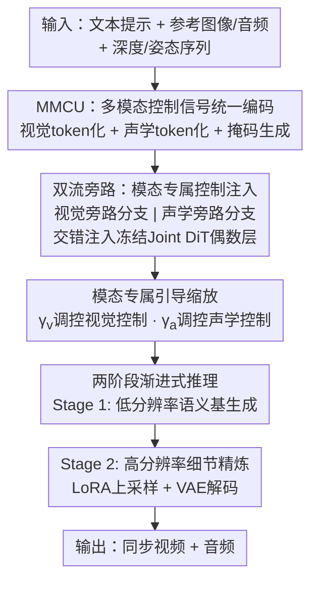

# MMControl: Unified Multi-Modal Control for Joint Audio-Video Generation

**会议**: ECCV 2026  
**arXiv**: [2604.19679](https://arxiv.org/abs/2604.19679)  
**代码**: 无  
**领域**: 视频生成  
**关键词**: 联合音视频生成, 多模态控制, 扩散Transformer, 可控生成, 音视频同步

## 一句话总结
MMControl 提出首个面向联合音视频生成的多模态统一控制框架，通过 MMCU 将参考图像、参考音频、深度图和姿态序列等异构控制信号统一编码，经双流旁路架构非侵入式注入冻结的 Joint DiT 骨干，并在推理时以模态专属引导缩放因子独立调节视觉与声学控制强度，在身份一致性、音色保真度和结构对齐上全面超越现有单模态控制方法。

## 研究背景与动机
**领域现状**：以 DiT 为骨干的联合音视频生成模型（如 Sora 2、LTX-2、MoVa）已能在单一模型内同时合成视频和同步音频，在跨模态时序一致性和生成质量上远超传统级联方案。

**现有痛点**：当前可控生成框架（如 ControlNet、VACE、OmniControl）几乎全部聚焦于视觉模态——要么只控视频结构不碰音频，要么只做音频驱动口型而忽视视觉身份和场景结构。这导致三个实际问题：(1) 用户无法在一个流程里同时指定角色的长相和声音；(2) 视觉控制信号和声学控制信号来自不同系统，跨模态对齐靠后处理拼凑，一致性和同步性差；(3) 缺乏统一的推理时调节机制，用户不能独立调整视觉和音频各自的控制强度。

**核心矛盾**：联合生成模型天然拥有跨模态同步先验，但现有的控制注入方式都是单模态设计的——如果直接把两套独立的 ControlNet 分别插进视频流和音频流，不仅破坏联合潜空间的协同性，还会引入模态冲突。

**本文目标**：在保持联合 DiT 跨模态同步能力的前提下，实现对视觉身份/结构（参考图、深度、姿态）和声学音色（参考音频）的统一可控生成。

**核心 idea**：把异构控制信号全部 tokenize 为统一表示后，通过视觉和声学两路独立的可训练旁路分支，以零初始化门控残差的方式注入冻结的 Joint DiT 偶数层，并在推理时用两个标量因子 γv 和 γa 独立缩放两路控制强度——既不破坏预训练生成先验，又实现了多模态解耦可控。

## 方法详解

### 整体框架
MMControl 要解决的问题是：给定文本提示、可选的参考图像（指定人物身份）、可选的参考音频（指定音色）以及可选的深度/姿态序列（指定结构约束），在一个冻结的预训练 Joint DiT（LTX-2 19B）上生成同步的视频和音频。整体流程分四个阶段：首先，多模态控制单元（MMCU）将异构输入统一编码为带掩码的同步表示；然后，双流旁路架构将这些表示通过视觉和声学两路独立旁支注入骨干的偶数层；接着，模态专属引导缩放因子 γv 和 γa 在推理时独立调节两路控制强度；最后，两阶段渐进式推理先在低分辨率生成语义基，再上采样到全分辨率做细节精炼。

### 关键设计

**1. MMCU：多模态控制信号的统一编码与同步**

痛点在于参考图像（一张静态图）、参考音频（一段波形）、深度/姿态序列（逐帧结构图）是三种完全不同模态、不同时长的信号，必须把它们对齐成同一套时序表示才能喂给联合扩散模型。MMCU 的做法是：对视觉侧，将参考图像的 VAE 潜变量 `z_img` 放在序列最前面，后面接 t 帧结构引导帧的潜变量 `{z_{s,1}, ..., z_{s,t}}`，同时生成一个二值掩码 M_v——参考帧位置为 0，生成帧位置为 1——让模型显式区分"保持身份"和"遵循结构"两类帧。对声学侧，将参考音频的 k 个潜变量 token `{z_aud,1, ..., z_aud,k}` 前置，后面接 t 个静音潜变量作为生成占位符，掩码 M_a 在参考段为全 0、生成段为全 1。这个设计的巧妙之处在于：掩码通道让模型不需要额外的位置编码或 segment embedding 就能知道每一帧是"条件"还是"待生成"，且静音占位符的设计为未来扩展音高/能量曲线等精细声学控制留了接口。

**2. 双流旁路架构：非侵入式模态专属控制注入**

如果直接把控制信号通过额外的 cross-attention 或拼接方式注入冻结的 Joint DiT，会干扰预训练的跨模态注意力分布，导致音视频同步性退化。MMControl 的做法是建立两条平行的、可训练的旁路分支——视觉旁路和声学旁路——分别处理各自的 MMCU 表示。每条旁路内部的 Self-Attention、Text Cross-Attention 和 FFN 层从预训练骨干继承权重，但额外增加一个 Context Projector，将 MMCU 序列与掩码沿通道维度拼接后投影到 DiT 的隐藏维度。关键细节是：投影器中对应潜变量的权重继承自骨干 embedder，而掩码通道的权重从头初始化。旁路分支只在偶数层介入，其输出通过一个零初始化的投影层转换为 hint 向量，以门控残差形式注入骨干主分支：

$$ \mathbf{x}_{\text{main}}^{(l)} = \text{MainBlock}^{(l)}(\mathbf{x}_{\text{main}}^{(l-1)}) + \gamma_m \cdot \text{Hint}_m^{(l)}, \quad m \in \{v, a\} $$

零初始化确保训练初期 hint 为零向量，不会扰乱预训练先验，训练过程中逐步学会注入有用的控制信息。此外，旁路内故意不设音频-视频 cross-attention，让每条旁路专注于自身模态的精细控制，同时降低计算开销。

**3. 模态专属引导缩放：解耦的推理时控制强度调节**

推理时绕不开的一个实际问题是：有时候用户想要严格的身份保持但可以接受更自由的语音变化，有时候反过来。直接训死一组控制强度无法覆盖这些需求。MMControl 引入两个标量因子 γv 和 γa，分别乘在视觉旁路和声学旁路的 hint 上。γ=0 时该模态完全由文本驱动（回到预训练先验），γ=1 时完全遵循控制信号。实验中展示了一种典型用法：γv=1 锚定参考图像身份 + γa=0 让模型自由合成语音，得到视觉一致但声音多样化的结果；反之 γv=0 + γa=1 则保持参考音色但生成新的人物外观。这本质上是将 ControlNet 的单标量控制尺度扩展为多模态多尺度的解耦控制。

**4. 两阶段渐进式推理：高效高分辨率生成**

直接从噪声生成全分辨率（h x w）的音视频在计算上非常昂贵。MMControl 沿袭 LTX-2 的策略，拆成两个阶段：Stage 1 在半分辨率（h/2 x w/2）下运行完整去噪流程，使用完整的 MMCU 条件和标准 flow-matching 调度加 CFG，生成一个低分辨率但语义完整、结构正确的音视频草稿；Stage 2 用一个空间潜变量上采样器将视频 latent 升到全分辨率，然后仅运行 3 步截断噪声调度做细节精炼，此时 CFG 关闭以保持已建立的语义布局，MMCU 信号以全分辨率重新编码以提供高频细节引导。蒸馏自 LTX-2 的冻结 LoRA 权重在 Stage 2 中被激活，增强细粒度纹理合成能力而无额外训练开销。

### 一个完整示例：参考图 + 参考音频 + 深度图联合生成

假设输入为：(1) 一张半身人像参考图，(2) 一段 3 秒的参考语音（说话人说"今天天气真好"），(3) 一个 5 秒的深度序列（从一段挥手视频中提取），(4) 文本提示"[VISUAL]: A person waves hand while speaking outdoors [SPEECH]: 今天天气真好"。MMCU 首先将参考图像 VAE 编码为 `z_img`，将 5 帧深度图 VAE 编码为 `{z_depth,1, ..., z_depth,5}`，拼接为视觉序列 `[z_img, z_depth,1, ..., z_depth,5]`，掩码 `[0, 1, 1, 1, 1, 1]`；同时将参考语音编码为 `{z_aud,1, ..., z_aud,k}`，拼接 t=5 帧静音占位符，掩码 `[0, ..., 0, 1, 1, 1, 1, 1]`。这两路表示分别进入视觉旁路和声学旁路，在每层冻住的 Joint DiT 偶数层以 γv=1.0, γa=0.8 的强度注入。Stage 1 生成低分辨率草稿（已可见挥手动作和同步口型），Stage 2 经 3 步精炼到全分辨率，V AE 解码输出 5 秒视频+音频——人物长相与参考图一致、手势遵循深度引导、语音与参考音色一致且口型同步。

### 损失函数 / 训练策略
训练沿用 LTX-2 的 flow-matching 目标，骨干完全冻结，仅更新旁路分支和投影器参数。优化器为 AdamW，峰值学习率 1e-5，cosine annealing 调度，共 7,200 步。在 4 张 H200 GPU 上训练，每卡 batch size 为 2，梯度累积 2 步，总训练时间约 12 小时。训练数据为 Hallo3 数据集中精选的 30,000 个高质量样本，覆盖参考图+音频、参考图+深度、参考图+姿态三种控制任务组合。为支持 CFG，视觉和声学控制信号各以 0.1 概率独立随机丢弃。

## 实验关键数据

### 主实验
**音频驱动联合生成对比**（Table 1）：在包含文本对齐度（Text CLIP Similarity）、身份保持度（Subject DINO Similarity）、动态程度（Dynamic Degree）、美学质量（Aesthetic Quality）、运动平滑度（Motion Smoothness）以及音视频同步指标 Sync-C/Sync-D 的全面评估中，MMControl 取得了最高的 Text CLIP（0.2546）、Subject DINO（0.8948）和 Sync-C（2.716），且 Sync-D（10.506）优于大多数使用真值音频的基线方法。值得注意的是，Hallo3 等基线使用的是真值音频和首帧图，条件比 MMControl 更容易，但 MMControl 在同步性和身份保持上仍然胜出，证明了联合 DiT 捕获的跨模态相关性比后拼接方案更有效。

| 方法 | Text CLIP Similarity ↑ | Subject DINO Similarity ↑ | Dynamic Degree ↑ | Aesthetic Quality ↑ | Motion Smoothness ↑ | Sync-D ↓ | Sync-C ↑ |
|------|------------------------|---------------------------|------------------|---------------------|---------------------|----------|----------|
| SadTalker | 0.2410 | 0.8752 | 0.0057 | 0.5434 | 0.9977 | 10.696 | 2.474 |
| AniPortrait | 0.2302 | 0.8857 | 0.0368 | 0.5350 | 0.9965 | 12.383 | 1.322 |
| HunyuanCustom | 0.2203 | 0.7816 | 0.6150 | 0.5003 | 0.9955 | 10.912 | 1.628 |
| Hallo3 | 0.2337 | 0.8873 | 0.9184 | 0.5169 | 0.9667 | 10.243 | 2.550 |
| **MMControl** | **0.2546** | **0.8948** | 0.5750 | **0.5461** | 0.9954 | 10.506 | **2.716** |

**结构控制**：深度控制上 MMControl 取得 Mean MAE (x100) 4.52，远优于 VideoComposer 的 15.41 和 VACE 的 5.35；姿态控制上取得 MAE 3.07，优于 VACE 的 3.29。同时在这两项任务中均保持了最优的 Subject DINO 相似度和运动平滑度，说明 MMCU 在精确跟随结构信号的同时不牺牲视觉语义一致性。人类评估中 MMControl 获得 3.58 的总分（4 分制），涵盖唇形同步、表情自然度、动作自然度、文本对齐、主体对齐和视觉质量六项指标，全面超越 Hallo3 的 3.22。

### 消融实验

| 配置 | Sync-C ↑ | SIM-o ↑ | Depth MAE (x0.01) ↓ | Pose MAE (x0.01) ↓ | 关键发现 |
|------|----------|---------|---------------------|--------------------|----------|
| Full model | 2.73 | 0.22 | 4.65 | 3.78 | 完整模型 |
| M1: 去掉 MMCU 掩码 | 2.53 | 0.17 | 5.01 | 3.92 | 掩码对音频同步和身份保持很重要 |
| M2: 去掉投影器权重继承 | 2.36 | 0.16 | 18.32 | 14.42 | 权重继承是结构控制的基石，去掉后深度/姿态 MAE 暴增 3-4 倍 |
| B1: 统一注意力替代双流 | 2.15 | 0.17 | 5.13 | 4.00 | 双流分离对于跨模态协同至关重要 |
| B2: 去掉音频旁路 | 2.20 | 0.10 | 4.97 | 4.24 | 音频旁路对音色保持不可或缺，SIM-o 减半 |
| B3: 去掉视觉旁路 | 2.15 | 0.11 | 19.35 | 16.83 | 视觉旁路是结构控制的主要通道，去掉后 MAE 暴增 |
| B4: 旁路内加音视频 cross-attention | 2.73 | 0.14 | 4.87 | 4.01 | 加入 cross-attention 反而降低 SIM-o，验证了模态内专注设计的合理性 |

### 关键发现
- **投影器权重继承是结构控制的核心使能因素**：去掉后深度 MAE 从 4.65 飙升至 18.32（~4x），姿态 MAE 从 3.78 升至 14.42（~3.8x），远超其他消融项的影响，说明从预训练 embedder 继承的表示空间对理解空间结构信号是不可替代的。
- **双流分离明显优于统一注意力**：B1 将两路旁路合并为统一注意力后 Sync-C 从 2.73 骤降至 2.15，证明视觉和声学控制信号在特征层面必须独立处理，硬融合会引入模态间干扰。
- **引导缩放因子的解耦效果显著**：γv 从 0.5 到 1.3 时 Subject DINO 从 0.860 升至 0.911，而 SIM-o 几乎不变；γa 从 0.5 到 1.3 时 SIM-o 从 0.16 升至 0.22 后降至 0.14（过强反而有害），两个因子各自独立影响对应模态，不存在明显的跨模态泄漏。
- **动态程度上 MMControl 在 Hallo3 之后**：Hallo3 的 Dynamic Degree 0.9184 明显高于 MMControl 的 0.5750，这与 Hallo3 专门为大幅度动作优化有关，但 MMControl 在美学质量和身份保持上更优，体现了一种质量-动态性的取舍。
- **与 AVControl 对比**：MMControl 在深度控制 MAE（4.52 vs 11.49）和姿态控制 MAE（3.07 vs 7.57）上大幅领先，说明统一的 MMCU+双流旁路方案比逐任务训练 LoRA 适配器的方案更有效。

## 亮点与洞察
- **掩码通道是低成本的多模态信号解耦手段**：MMCU 不仅在序列层面拼接了不同模态的 token，还在通道维度拼接了二值掩码——这个操作几乎不增加参数和计算量，但让模型可以零额外学习地区分"参考帧"和"生成帧"、"参考音频"和"生成音频"。这个设计简单得近乎 trivial，但消融实验证明去掉它 Sync-C 掉 0.2、SIM-o 掉 0.05，表明这种显式信号分离对联合扩散模型尤为重要。
- **零初始化+权重继承的组合策略是训练稳定性的关键**：投影器的潜变量权重继承自骨干（保留预训练表示空间），掩码权重从头训练（适应新通道），旁路输出投影器零初始化（防止训练初期扰动）——三管齐下，使得在冻结 19B 大模型上训练轻量旁路 12 小时即可收敛，这是一个工程上高度可复用的方法论。
- **"不做 cross-attention"也是一种设计选择**：B4 消融显示在旁路内加入音频-视频 cross-attention 反而降低 SIM-o，这挑战了"多模态就该交互"的直觉。原因是旁路的目标是提取纯化后的控制特征，跨模态交互应该留给冻结骨干的原始注意力层去处理——旁路加交互等于"越俎代庖"。
- **可迁移思路**：MMCU+双流旁路的"统一编码-模态分离注入-推理时独立调节"三段式架构可以迁移到任何需要多模态条件控制的预训练生成模型上，例如在视频编辑模型中同时控制内容和音频风格、在 3D 人体运动生成中同时控制动作序列和脚步声等。

## 局限与展望
- **作者承认**：当前框架仅支持单人场景，对多角色对话场景中的跨说话人同步和长时序一致性尚未涉及；控制模态目前限定为参考图/音频/深度/姿态四种，扩展到任意新模态仍需任务特定适配。
- **潜在局限**：(1) 两阶段推理虽然高效但 Stage 1 的低分辨率瓶颈可能在高动态场景下丢失细节，且 CFG 只在 Stage 1 使用、Stage 2 关掉的设计是否对某些 prompt 导致语义漂移值得检验；(2) 训练数据仅 30k 样本且来自 Hallo3，对室外复杂场景和不常见人物的泛化能力存疑；(3) 缺乏对音频内容质量（如发音准确性、韵律自然度）的定量提升分析，WER 指标（7.96% weighted）虽然可用但仍有改进空间。
- **改进方向**：(1) 将静音占位符替换为可学习的声学控制 token，支持音高、能量、语速等更精细的韵律控制；(2) 引入说话人分离机制支持多人对话场景；(3) 探索将 γv/γa 从静态标量扩展为逐层或逐时间步的自适应调度，以更精细地控制不同去噪阶段的条件依赖强度。

## 相关工作与启发
- **vs ControlNet/T2I-Adapter**: 两者建立了图像生成中空间条件注入的经典范式（旁路模块+零初始化），MMControl 将其从单模态图像生成推广到多模态联合音视频生成，核心变化是从一条旁路变为视觉+声学双流旁路，且引入模态专属引导缩放使控制强度可独立调节。
- **vs VACE/OmniControl**: VACE 是视频视觉控制的统一框架，OmniControl 做人体运动的任意关节控制——但它们都只处理视觉模态。MMControl 的贡献不在于"统一更多视觉条件"（VACE 已经做了），而在于把"统一控制"的概念从纯视觉拓展到了跨视觉-声学的多模态空间。
- **vs MoCha/Hallo3**: 这些方法做的是"音频驱动视频"（audio-to-video），本质上是单向的——音频是输入，视频是输出。MMControl 的定位是双向联合生成（audio-and-video），两者都是在生成过程中同时受文本和控制信号约束，天然具有更好的跨模态同步性。
- **vs AVControl**: AVControl 是 MMControl 的同期工作，为不同控制模态训练独立的 IC-LoRA 适配器。MMControl 的优势在于所有控制模态共享同一套 MMCU+双流旁路架构，不需要逐任务训练适配器，且 MAE 大幅优于 AVControl（深度 4.52 vs 11.49，姿态 3.07 vs 7.57）；但 AVControl 在声学侧支持响度控制，MMControl 目前只支持音色控制——两者在声学控制范围上互补。

## 评分
- 新颖性: ⭐⭐⭐⭐☆ 首次将多模态统一控制引入联合音视频生成是一个明确的空白填补，MMCU+双流旁路的架构设计合理，但组件层面（掩码、旁路、引导缩放）的单项技术并不新鲜，新颖性主要体现在系统集成和问题定义上
- 实验充分度: ⭐⭐⭐⭐⭐ 覆盖 4 种控制信号组合，对比 7 个基线方法，包含自动指标、人类评估和音频质量三类评测，消融实验拆解了 7 个变体并分析了 γ 因子的敏感性曲线，附录还与同期工作 AVControl 做了头对头比较
- 写作质量: ⭐⭐⭐⭐☆ 问题定义清晰、方法描述结构化、图示质量高（teaser + 架构图 + 双阶段推理图 + 解耦控制图 + 定性对比图共 7 张），但部分实验表格标注不够具体（如未说明测试集样本量）
- 价值: ⭐⭐⭐⭐☆ 为联合音视频生成领域的可控性研究建立了一个可复用的 baseline 框架，12 小时训练即可在冻结 19B 模型上获得 SOTA 控制效果，工程实用性高；但当前控制模态有限且限于单人场景，距离"任意模态、任意场景"的通用可控生成仍有距离

<!-- RELATED:START -->

## 相关论文

- [\[ECCV 2026\] AVTok: 1D Unified Tokenization for Holistic Audio-Video Generation](avtok_1d_unified_tokenization_for_holistic_audio-video_generation.md)
- [\[CVPR 2026\] UnityVideo: Unified Multi-Modal Multi-Task Learning for Enhancing World-Aware Video Generation](../../CVPR2026/video_generation/unityvideo_unified_multi-modal_multi-task_learning_for_enhancing_world-aware_vid.md)
- [\[ICLR 2026\] JavisDiT++: Unified Modeling and Optimization for Joint Audio-Video Generation](../../ICLR2026/video_generation/javisdit_unified_modeling_and_optimization_for_joint_audio-video_generation.md)
- [\[CVPR 2026\] UniAVGen: Unified Audio and Video Generation with Asymmetric Cross-Modal Interactions](../../CVPR2026/video_generation/uniavgen_unified_audio_and_video_generation_with_asymmetric_cross-modal_interact.md)
- [\[ICLR 2026\] Video-As-Prompt: Unified Semantic Control for Video Generation](../../ICLR2026/video_generation/video-as-prompt_unified_semantic_control_for_video_generation.md)

<!-- RELATED:END -->
