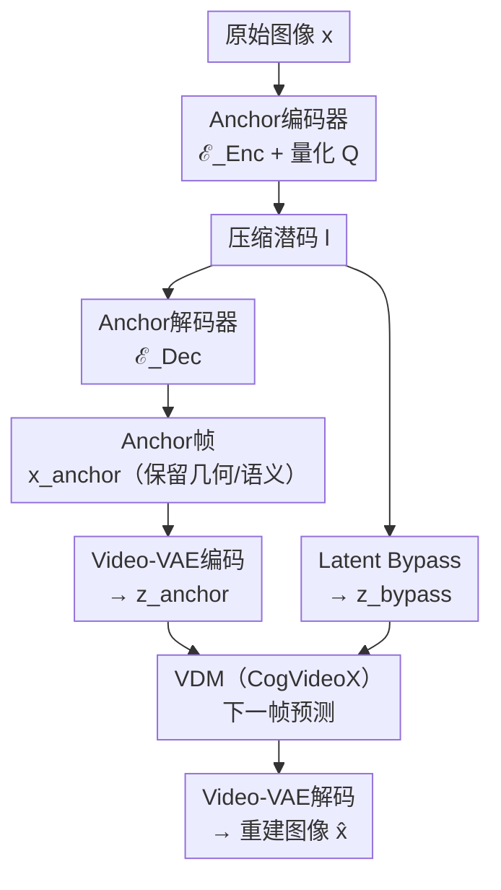

# Next-Frame Decoding for Ultra-Low-Bitrate Image Compression with Video Diffusion Priors

**会议**: ECCV 2026  
**arXiv**: [2603.15129](https://arxiv.org/abs/2603.15129)  
**代码**: [https://github.com/UnoC-727/NeFIC](https://github.com/UnoC-727/NeFIC) (有)  
**领域**: 图像压缩 / 扩散模型 / 视频生成  
**关键词**: 超低码率图像压缩, 视频扩散先验, 下一帧预测, anchor编解码, 单步生成  

## 一句话总结

本文提出 NeFIC，将超低码率图像压缩（ULB-IC）中的生成式解码重新解释为从 compact anchor 到最终重建图像的虚拟时间演化过程，利用预训练视频扩散模型（VDM）作为时序先验做下一帧预测，并通过两阶段训练（区间适配 + 单步生成旁路）实现高质量、高效率的极低码率图像压缩。

## 研究背景与动机

**领域现状**：超低码率图像压缩（ULB-IC）的目标是在极低比特率下生成视觉上逼真且与源图像语义一致的重建结果。基于扩散模型的生成式编解码器（如 PerCo、DiffC、StableCodec 等）利用大型预训练扩散模型的生成先验，在极低码率下展现出优秀的感知真实感。这些方法通常通过 ControlNet 等方式将压缩后的条件信号注入图像扩散模型的多步去噪过程。

**现有痛点**：现有扩散式 ULB-IC 方案存在两个根本性问题。第一，条件信号对扩散过程的影响不明确，且标准高斯噪声初始化的不确定性共同导致语义漂移（semantic drift），削弱了重建结果对源图像的信真度（faithfulness）。第二，迭代式去噪过程相比传统 VAE 编解码器带来显著更高的计算开销和解码延迟。

**核心矛盾**：当前 ULB-IC 面临三元矛盾的三角——同时实现强感知真实感（perceptual realism）、源内容信真度（source-content faithfulness）和实用的推理效率（inference efficiency）。图像扩散模型在信真度上受限于隐晦的条件注入方式，而多步采样又拖累了效率。

**核心 idea**：本文的关键洞察是——预训练视频扩散模型天然具备从模糊到清晰的"失焦到聚焦"时序过渡能力（defocus-to-focus temporal transition）。NeFIC 将这一先验引入图像压缩：解码时先重建一个紧凑的 anchor 帧（保留场景几何和语义布局，舍弃高频细节），然后用 VDM 将 anchor 到原始图像的过渡建模为两帧虚拟视频的下一帧预测。为消除多步扩散的低效，进一步设计 latent bypass 将多步去噪坍缩为单步生成。

## 方法详解

### 整体框架

NeFIC 的编解码流程分为编码端和解码端。编码端：原始图像 $x$ 经过 Anchor Codec 的编码器 $\mathcal{E}_{Enc}$ 和量化 $Q$ 得到压缩潜码 $l$ 并传输。解码端：先由 Anchor 解码器 $\mathcal{E}_{Dec}$ 从 $l$ 重建可感知的 anchor 图像 $x_{anchor}$（保留场景几何与语义布局，舍弃高频细节）；然后利用预训练视频扩散模型（CogVideoX-1.5-5B）将 anchor 作为条件帧、原始图像作为目标帧，构建两帧虚拟视频序列进行下一帧预测，最终得到高质量重建 $x̂$。整个生成式解码过程被定义为 $\hat{x} = (\mathcal{G} \circ \mathcal{E}_{Dec})(l; \xi)$，其中 $\mathcal{G}$ 是适配了单间隔写实下一帧预测的 VDM，$\xi$ 是目标帧的噪声潜码输入。

训练分为两个阶段：Stage I 对 VDM 和 Anchor Codec 进行联合微调，使其学会从 compact anchor 合成高频细节并抑制非预期的时序伪影（物体运动、场景闪烁）；Stage II 引入 Latent Bypass 机制，将多步扩散坍缩为单步生成，同时引入 CLIP-based GAN Loss 提升真实感。

### 关键设计

**1. Anchor 帧 + 下一帧预测范式：将图像解码重构为虚拟时序过渡**

现有扩散式 ULB-IC 方法（如 PerCo、DiffC）通过 ControlNet 等方式将条件信号注入图像扩散模型，条件与噪声的交互局限于隐晦的通道拼接，易导致语义漂移。NeFIC 首先定义一个显式的中间态——anchor 帧——这是一幅保留场景几何、语义布局和粗略外观但舍弃高频细节的可感知图像（由 VAE-based Anchor Codec 编解码）。然后将生成式解码重新解释为从 anchor 到最终重建的虚拟时间演化过程：构建一个两帧虚拟视频，其中 anchor 是第一帧（条件帧），原始图像是第二帧（目标帧）。VDM 的任务就是从条件帧预测下一帧。

这一范式的优势在于：anchor 帧提供了一个可见的、语义可信的初始状态（而非无信息的高斯噪声），从根本上抑制了语义漂移。同时，VDM 的时序一致性先验天然适合"粗→细"的渐进式细化过程，无需额外的 ControlNet。与预测残差（如 DIRAC、Add2）的思路有本质区别——NeFIC 利用的是 VDM 中的"模糊到清晰"时序过渡先验，而非运动先验。

**2. 为什么选择 VDM 而非 IDM：时序先验与 3D 架构优势**

预训练 VDM 天然具备两项关键能力，是图像扩散模型（IDM）不具备的。第一，**时序过渡先验**：VDM 在大规模视频数据上训练，学习了大量"失焦到聚焦"（defocus-to-focus）的时序模式——如鹦鹉羽毛从模糊到清晰的逐帧细化。NeFIC 将高度压缩的 anchor 视为早期模糊帧，最终重建对应清晰帧，直接复用这一先验。第二，**架构优势**：VDM 的 3D Attention 和 3D RoPE 提供了更原生的条件注入方式。IDM 通常将条件与噪声在通道维度拼接（隐式跨通道混合），而 VDM 通过 token 拼接 + 3D Attention 实现显式的自适应检索——每个噪声 token 可以直接关注任意 anchor token，3D RoPE 则在时间轴上施加对应关系偏置，使注意力偏向空间对齐的区域。这使得高频细节的合成成为粗布局的"结构锚定细化"，而非黑盒的随机生成。

**3. Stage I 区间适配训练：将多帧视频生成为单间隔下一帧预测**

直接使用预训练 VDM 做 ULB-IC 面临领域鸿沟：VDM 训练于数十帧的渐进时间演化（包含物体运动和场景过渡），而 NeFIC 需要的是单间隔的"粗→精"过渡（仅两帧，且不含运动）。Stage I 的区间适配正是为此设计。

具体地，将原始图像 $x$ 通过冻结的 Video-VAE 编码器 $E_{Vid}$ 得到 $\mathbf{z}_0 = E_{Vid}(x)$，加上噪声 $\mathbf{z}_t = \alpha_t \mathbf{z}_0 + \sigma_t \boldsymbol{\epsilon}$；将解码后的 anchor $x_{anchor}$ 也通过 $E_{Vid}$ 编码得到 $\mathbf{z}_{anchor}$。使用一个通用文本提示 $p$（"生成高质量图像……"）编码为 $\mathbf{z}_{text}$。DiT 块的输入为三组 token 的拼接：$\mathbf{z}_{text} \oplus \mathbf{z}_{anchor} \oplus \mathbf{z}_t$。采用 v-prediction 参数化，只监督对应目标帧的 token 输出，文本和 anchor token 的输出被丢弃。损失为：

$$\mathcal{L}_{noise} = \|\hat{\mathbf{z}}_0 - \mathbf{z}_0\|_2^2$$

同时引入辅助 anchor 损失 $\mathcal{L}_{aux}$（MSE + LPIPS）确保 anchor 保持在 Video-VAE 的训练分布内。仅通过 LoRA 微调 Anchor Codec 和 DiT 的注意力投影（$W_q, W_k, W_v, W_{out}$），其余部分冻结，训练高效。

**4. Stage II 单步生成旁路：将多步去噪坍缩为单步推理**

Stage I 虽然实现了适配，但仍需多步（50步）扩散采样，解码延迟不可接受。Stage II 的核心是建立一个 latent bypass，在压缩 VAE 和生成 VAE 之间建立信息通路，使得单步去噪即可生成高质量图像。

包含两个子设计。**条件性 Anchor 编码**：Anchor 编码器在提取特征 $\mathbf{h}_{enc}$ 的同时，将原始图像经冻结 $E_{Vid}$ 编码的 $\mathbf{z}_0$ 在通道维度与之拼接：$\mathbf{h}_{cond} = [\mathbf{h}_{enc}; \mathbf{z}_0]$，使 Anchor Codec 偏向保留与扩散先验一致的场景信息和布局语义。**旁路细化模块（Bypass Refinement）**：从 anchor 解码特征 $\mathbf{h}_{dec}$ 经过一个 Transformer 映射得到 $\mathbf{z}_{bypass} = T(\mathbf{h}_{dec})$，替代纯高斯噪声作为单步生成的初始潜码。将 $\mathbf{z}_{bypass}$ 视为部分去噪状态，设定去噪步 $t^\star = 500$（最大步数的一半），VDM 单步预测噪声并重建 $\hat{\mathbf{z}}_0$，$Video-VAE$ 解码器 $D_{Vid}$ 输出最终图像 $\hat{x} = D_{Vid}(\hat{\mathbf{z}}_0)$。此外引入 CLIP-based GAN Loss 进一步弥合分布差异。

总体损失：
$$\mathcal{L}_{stageII} = \mathcal{L}_{RGB} + \lambda_{aux} \mathcal{L}_{aux} + \lambda_R R$$

其中 $\mathcal{L}_{RGB} = \lambda_{GAN} \mathcal{L}_{GAN} + \lambda_{MSE} \|\hat{x} - x\|_2^2 + \lambda_{LPIPS} \text{LPIPS}(\hat{x}, x)$。

### 损失函数 / 训练策略

两阶段训练均在 Flickr2W 数据集上进行，随机裁剪 512-768px 方形块，batch size=8。Stage I 训练 10k steps，lr=1e-4；Stage II 训练 50k steps，在 35k steps 引入 CLIP-based GAN Loss，45k steps 衰减 lr 至 1e-5。超参数：$\lambda_{aux}=0.1$，$\lambda_R \in \{5, 3, 1.7, 1.0, 0.5, 0.25\}$ 控制码率。LoRA rank/alpha 默认 256/256。两阶段训练总计约 3 天（A100 GPU）。优化器 AdamW。

## 实验关键数据

### 主实验

以下为 NeFIC 与多种生成式编解码器在三个数据集上的 BD-Rate (%，越低越好，以 DiffC 为基准) 对比：

| 数据集 | 指标 | NeFIC (本文) | StableCodec (ICCV'25) | DLF (ICCV'25) | DiffC (基准) | 提升 (vs 次优) |
|--------|------|---|---|---|---|---|
| Kodak | LPIPS BD-Rate | -64.03 | -42.19 | -42.31 | 0.00 | 降 21.84% |
| Kodak | PSNR BD-Rate | -34.26 | -22.05 | 7.77 | 0.00 | 降 12.21% |
| DIV2K | LPIPS BD-Rate | -61.71 | -27.31 | -20.07 | 0.00 | 降 34.40% |
| DIV2K | FID BD-Rate | -49.94 | -52.06 | -25.71 | 0.00 | — (StableCodec 略优) |
| CLIC2020 | LPIPS BD-Rate | -64.09 | -27.39 | -22.51 | 0.00 | 降 36.70% |
| CLIC2020 | KID BD-Rate | -75.94 | -73.46 | -67.93 | 0.00 | 降 2.48% |

| 模型 | 编码/解码时间 (Kodak) | 编码/解码时间 (DIV2K) | BD-Rate LPIPS (DIV2K) |
|------|----------------------|----------------------|----------------------|
| PerCo | 0.39s / 1.92s | 0.62s / 38.29s | 266.60 |
| DiffEIC | 0.23s / 4.82s | 2.42s / 58.46s | 106.71 |
| StableCodec | 0.11s / 0.14s | 18.86s / 40.63s | -27.31 |
| **NeFIC** | **0.17s / 0.88s** | **0.58s / 6.83s** | **-61.71** |
| w/o Stage II | 0.16s / 30.61s | 0.51s / 296.02s | -47.01 |

### 消融实验

| 配置 | LPIPS BD-Rate | FID BD-Rate | 说明 |
|------|-------------|-------------|------|
| NeFIC (完整) | -61.71 | -49.94 | 完整模型 |
| w/o Interval Adaptation | -52.32 | -40.32 | 跳过 Stage I，BD-Rate 退化 8-10% |
| w/o One-step Bypass | -47.01 | -53.72 | 只有 Stage I（50步采样），LPIPS 降 15% |
| w/o Conditional Encoding | -56.81 | -42.01 | 条件编码被移除，LPIPS 降 4.9% |
| w/o Bypass Refinement | -48.01 | -39.36 | 绕过细化，LPIPS/FID 降 10-14% |
| w/o Aux Anchor Loss | -19.78 | -31.07 | 无辅助 anchor 损失，严重退化 |
| w/o CLIP-based GAN | -63.09 | -30.31 | 无对抗训练，FID/KID 严重退化 (+20/41) |
| LoRA rank=64/64 | -44.18 | -59.91 | 低 rank 下 LPIPS 降，FID 反升 |
| LoRA rank=256/256 | -61.71 | -49.94 | 默认设置（LPIPS 最优） |

### 关键发现

- **Anchor 辅助损失不可或缺**：去除 $\mathcal{L}_{aux}$ 导致 anchor 偏离自然图像域（语义/色彩漂移），BD-Rate LPIPS 从 -61.71% 急剧退化为 -19.78%，是所有消融中退化最严重的单项，说明保持 anchor 在 Video-VAE 分布内是 VDM 有效条件化的前提。
- **Stage II 单步旁路的效果与代价**：相比只使用 Stage I（50 步去噪），Stage II 在 LPIPS/DISTS 上提升约 15% 但 FID/KID 小幅退化约 4%/7%，存在感知信真度与真实感之间的轻微折衷。更重要的是解码速度从 30.61s（Kodak）降至 0.88s——加速 35 倍，实用性大幅提升。
- **VDM 范式 vs IDM 范式**：与替换为 Flux-dev-12B（12B 参数 IDM）的对比中，NeFIC（5B 参数 VDM）在 LPIPS/DISTS 上显著领先，说明 VDM 的时序架构和下一帧预测范式带来的增益超过了单纯扩大模型规模的效果。
- **CLIP-based GAN Loss 对真实感至关重要**：移除后 FID/KID 分别退化约 20 和 41 个 BD-Rate 点，虽然 LPIPS/DISTS 略有改善，但生成真实感严重下降。
- **LoRA rank 与 alpha 的设置**：从 64/64 到 256/256 时 LPIPS 一致改善（-44.18% → -61.71%），但 FID 反向退化（-59.91% → -49.94%），表明更高 rank 更注重逐像素忠实度（LPIPS）而非分布级真实感（FID）。

## 亮点与洞察

- **将图像解码重新定义为时序演化**是最巧妙的概念跃迁：不是"用 VDM 生成图像"，而是"将解码过程视为从 anchor 到目标的虚拟时间过渡"，使得 VDM 的 defocus-to-focus 时序先验得到直接复用，无需额外设计条件注入网络。这一思路可以迁移到其他需要"粗到精"细化的任务（如图像超分、修复）。
- **利用 VDM 的 in-context learning 能力**做条件注入：通过 token 拼接 + 3D Attention 实现显式的自适应检索，比 IDM 的通道拼接更自然、更强。3D RoPE 的对齐偏置是 VDM 独有的 inductive bias，值得后续工作深入挖掘。
- **Latent Bypass 的设计简洁而高效**：将压缩 VAE 的潜码映射到生成 VAE 潜空间，使多步去噪坍缩为单步，同时 $\mathbf{z}_{bypass}$ 作为部分去噪状态携带了丰富的语义信息，避免了高斯噪声初始化的歧义。这种"两个潜空间的信息通路"设计思路可推广到其他需要融合压缩与生成模型的任务。
- **辅助 anchor 损失 $\mathcal{L}_{aux}$ 的精细设计**：同时用 MSE（保持像素级可编码性）和 LPIPS（保持语义一致性），配合 $\lambda_{MSE}=5, \lambda_{LPIPS}=1$ 的权重，确保 anchor 既在 Video-VAE 分布内又携带足够语义，是 pipelined 架构中中间表示设计的小而关键的经验。

## 局限与展望

- **模型参数的依赖性**：当前方案绑定 CogVideoX-1.5-5B，虽然提供了优秀的 VDM 先验，但也意味着模型体量较大（5B），资源受限场景下部署有难度。未来可探索更轻量的 VDM 架构。
- **与纯图像扩散模型的后向兼容性有限**：文中与 Flux-dev-12B 的对比显示 IDM 难以复用 VDM 的 3D 时序先验，说明该范式的迁移需要 VDM 原生支持。若 VDM 推理尚未广泛部署，该范式的推广门槛较高。
- **单步生成的真实感仍有提升空间**：Stage II 相比 Stage I（50 步采样）在 FID/KID 上略有退化，说明单步生成在分布级真实感上有自然损失。结合蒸馏或一致性模型可能进一步缩小差距。
- **数据集的局限性**：训练仅在 Flickr2W 上进行（2 万张），规模偏小；测试集中在 Kodak/CLIC2020/DIV2K，缺乏对无限制自然图像分布的泛化能力验证。
- **码率范围受限于 Anchor Codec**：当前方案仅做超低码率，因为需要 anchor 足够"compact"才能体现 VDM 的时序过渡价值。如果要求中等/高码率，该范式可能需要调整乃至重新设计。

## 相关工作与启发

- **vs PerCo / DiffC (IDM-based ULB-IC)**：这些方法通过 ControlNet/通道拼接将条件注入图像扩散模型。NeFIC 的核心区别在于改用 VDM 的下一帧预测范式，提供更显式、更可控的条件注入（token 级 3D Attention），同时避免了高斯噪声初始化的歧义。优势是更好的信真度和 5.5-8.6 倍解码加速。
- **vs StableCodec / DLF (最新 SOTA ULB-IC)**：StableCodec（ICCV'25）也在探索稳定性，但 NeFIC 在 Kodak 的 PSNR BD-Rate 上比 StableCodec 低 18.27%（更优），且解码速度快 6-40 倍（DIV2K 避免 tiling 开销）。
- **vs DIRAC / Add2 (残差预测方法)**：这些方法预测原始图像与重建间的残差。NeFIC 不是预测残差，而是利用 VDM 的 blur-to-sharp 时序先验做"结构锚定细化"——本质上是利用扩散模型生成合理的高频细节，而非做像素级残差纠正。
- **对视频扩散模型应用的启发**：本文展示了 VDM 的价值不仅限于生成长视频，其时序先验（defocus-to-focus）和 3D 架构优势可迁移到单图的粗到精细化任务。未来值得探索 VDM 在其他低级视觉任务（超分、去雨、修复）中的泛化应用。

## 评分

- 新颖性: ⭐⭐⭐⭐⭐ 将 VDM 引入图像压缩并重新定义为虚拟时序演化是概念上的优雅创新，两阶段训练（区间适配 + 单步旁路）的设计完整且自洽。
- 实验充分度: ⭐⭐⭐⭐⭐ 在 Kodak/CLIC2020/DIV2K 三个数据集上做了详尽的量化对比，包含 5 张表格（主实验 BD-Rate、效率、消融×3），且对每个设计点的消融都有定性展示（如图 7 的牙齿对比）。
- 写作质量: ⭐⭐⭐⭐ 动机阐述清晰，方法前有充分动机铺垫（Why VDM > IDM 单独一小节），图示丰富。扣一星是因为公式编号在小括号中略显混乱（如公式 1 在段落中间），且部分符号下标较杂。
- 价值: ⭐⭐⭐⭐⭐ 超低码率压缩是实际需求极强的方向，NeFIC 同时改善信真度、真实感和效率，且范式可推广，具有明确的学术和应用价值。

<!-- RELATED:START -->

## 相关论文

- [\[CVPR 2026\] TempoMaster: Efficient Long Video Generation via Next-Frame-Rate Prediction](../../CVPR2026/video_generation/tempomaster_efficient_long_video_generation_via_next-frame-rate_prediction.md)
- [\[CVPR 2026\] Improving Motion in Image-to-Video Models via Adaptive Low-Pass Guidance](../../CVPR2026/video_generation/improving_motion_in_image-to-video_models_via_adaptive_low-pass_guidance.md)
- [\[ICLR 2026\] Video-GPT via Next Clip Diffusion](../../ICLR2026/video_generation/video-gpt_via_next_clip_diffusion.md)
- [\[ECCV 2026\] AHOY! Animatable Humans under Occlusion from YouTube Videos with Gaussian Splatting and Video Diffusion Priors](ahoy_animatable_humans_under_occlusion_from_youtube_videos_with_gaussian_splatti.md)
- [\[CVPR 2026\] Generative Neural Video Compression via Video Diffusion Prior](../../CVPR2026/video_generation/generative_neural_video_compression_via_video_diffusion_prior.md)

<!-- RELATED:END -->
