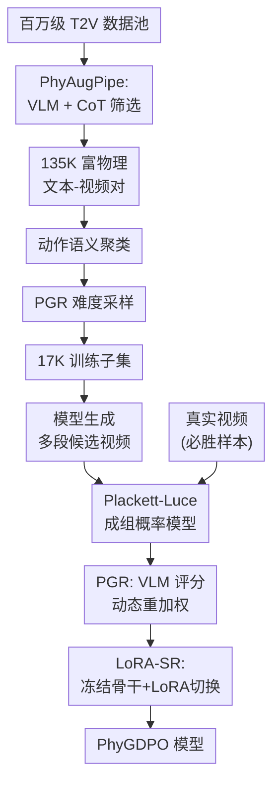

# PhyGDPO: Physics-Aware Groupwise Direct Preference Optimization for Physically Consistent Text-to-Video Generation

**会议**: ECCV 2026  
**arXiv**: [2512.24551](https://arxiv.org/abs/2512.24551)  
**代码**: [https://github.com/caiyuanhao1998/Open-PhyGDPO](https://github.com/caiyuanhao1998/Open-PhyGDPO)  
**领域**: 视频生成  
**关键词**: 文本到视频生成, 物理一致性, 直接偏好优化, Plackett-Luce模型, 成组偏好学习

## 一句话总结
PhyGDPO 提出了一种面向物理合理视频生成的成组直接偏好优化框架，用真实视频作为必胜样本、Plackett-Luce 成组概率模型替代两两对比以捕捉全局偏好，配合 VLM 引导的物理奖励重加权和 LoRA 切换参考机制，在 14B 参数量级下高效实现了优于 Sora2 和 Veo3.1 的物理一致性。

## 研究背景与动机

文本到视频（T2V）生成近年来取得了突破性进展，Wan2.1、Sora2、Veo3.1 等模型已能生成视觉质量极高的视频。然而，准确且一致地建模视频中的物理规律——例如人体运动中的关节协调、球类碰撞的运动轨迹、玻璃碎裂时的应力传播——仍然是一个极具挑战且未被充分探索的问题。提升视频生成模型的物理推理能力，使其更接近通用物理模拟器，对游戏、影视制作、自动驾驶乃至机器人操控等领域都有深远意义。

目前改善物理建模的技术路线大致分为两类。其一是基于图形学引擎的方法，依赖模拟器在简单场景中指定物理参数（如完美弹性碰撞、刚体动力学），但环境复杂度一旦上升就难以参数化。其二是基于 LLM 提示词扩展的方法，让 LLM 在输入 prompt 中显式加入物理定律描述，再通过迭代生成或微调来模拟物理效果。这类方法将物理推理"外包"给了 LLM——T2V 模型自身的提示词遵循能力有限，LLM 的物理知识也远非完美，反而可能引入错误引导。更根本的问题是，即使是海量数据预训练的 Sora2 和 Veo3.1，仍然在复杂人体运动和物理现象上频繁失败，因为训练数据中缺乏负例来提供"物理上什么是错误的"这一对比信号。

直接偏好优化（DPO）为此提供了有前景的解决方案，但直接套用会遭遇三个具体困难。第一，缺乏能全面捕捉各类物理交互的配对训练数据。第二，标准 DPO 把条件生成视频当作必胜样本，但生成视频的物理写实度本身有限——更关键的是，DPO 基于 Bradley-Terry 模型做两两比较，无法捕捉物理合理性这类需要多候选全局视角的偏好信号。第三，标准 DPO 需要复制一份完整的 14B 模型作为参考，GPU 内存和计算效率都难以承受。本文从数据、建模、工程三个维度系统解决了这些问题。**核心 idea：将视频生成中的物理偏好优化从两两 Bradley-Terry 比较扩展为以真实视频为必胜样本的 Plackett-Luce 成组概率模型，通过 VLM 物理评分对困难案例重加权、并借助 LoRA 切换参考机制让 14B 模型的 DPO 后训练在 25GB 显存量级高效完成。**

## 方法详解

### 整体框架

PhyGDPO 包含数据构建（PhyAugPipe）和偏好优化（PhyGDPO）两大部分。数据侧，PhyAugPipe 从百万级 T2V 数据池出发，用 Qwen2.5-72B VLM 配合 CoT 规则筛选出物理交互丰富的 13.5 万对数据；再对筛选结果做动作语义聚类，并用 VideoCon-Physics 评估各类动作的生成难度，按难度指数采样得到最终 1.7 万对训练子集。训练侧，以真实视频为必胜样本、以模型生成的多段候选为失败样本，在 PL 成组概率模型下优化；Physics-Guided Rewarding（PGR）用 VideoCon-Physics 的两条评分动态调整各失败样本的损失权重；LoRA-Switch Reference（LoRA-SR）冻结骨干网络作为参考模型，在注意力层附加可训练 LoRA 模块并通过环境管理器灵活切换参考/训练模式。

### 关键设计

**1. PhyAugPipe：用 VLM+CoT 从海量数据中筛出富物理交互视频**

物理交互视频之所以稀缺，是因为判断"一个视频是否包含有意义的物理交互"本身就不是一件容易自动化的事——你不能只看有没有人在动，还要判断运动与物体的交互是否蕴含力学逻辑。PhyAugPipe 的核心思路是把判断任务交给一个有链式推理能力的 VLM（Qwen2.5-72B），按五步思维链处理每段视频。第一步，VLM 从 prompt 和视频帧中解析实体及其材质、动作与受力关系；第二步，将解析结果与视频画面交叉验证，剔除幻觉成分；第三步，基于可靠解析写出物理推理说明，解释实体如何通过力学交互导致结果；第四步，综合实体数量与交互复杂度、受力明确度和因果清晰度，计算一个 0-1 的物理丰富度分数，以 0.6 为阈值做二分类标注；第五步，在前三步基础上扩展原始 prompt 嵌入因果物理细节。这套 CoT 驱动的筛选不同于固定规则模板，能够理解"足球被踢出弧线"和"玻璃杯从桌面掉落碎裂"背后完全不同的物理机制。经过这步筛选，100 万对数据中保留了 13.5 万对。之后用 sentence Transformer 做动作语义聚类确保各动作类别的覆盖均衡，再用 VideoCon-Physics 评估各类动作的生成难度，按指数采样权重 $r_k = \exp(\tau d_k)$ 将数据预算倾斜到困难类别上，其中 $d_k = 1 - \mathcal{S}_f(k)$ 是类别级物理得分。值得强调的是，整个 PhyAugPipe 是筛选型管线——VLM 只影响物理丰富度的判断和采样比例，原始 prompt 和真实视频画面未经 VLM 改写，因此不会引入 VLM 偏差。

**2. Groupwise DPO：以真实视频为必胜样本的 PL 成组概率模型**

标准 DPO 有两个不适合物理合理性优化的根本问题。首先是对比粒度的局限——Bradley-Terry 模型只能处理一对一的比较，当有多个候选时只能两两计算再平均，丢失了候选间的全局排序信息。其次是获胜信号的方向错误——标准 DPO 把条件生成视频当作获胜样本，但生成视频的物理写实性本身不可靠。PhyGDPO 用一个设计同时解决这两个问题：以真实世界视频为必胜样本（天然遵循物理规律，学习信号绝对正确），基于 Plackett-Luce（PL）成组概率模型描述"从 1 个获胜加 m 个失败组成的候选集合中选出获胜者"的概率：
$$
p_{\text{PL}}(x^w_0 \mid \mathcal{G}^l(c), c) = \frac{\exp(r(c, x^w_0))}{\exp(r(c, x^w_0)) + \sum_{j=1}^m \exp(r(c, x^{l_j}_0))}
$$
该概率直接学习"真实视频应当被选为最佳"这一全局偏好。将 DPO 的隐式奖励形式代入 PL 模型，损失函数从两两形式自然扩展为成组形式。为控制训练效率，论文通过 Jensen 不等式和一个构造的不等式 $\log(1 + \sum e^{x_j}) \le \sum \gamma_j \log(1 + e^{\alpha_j x_j})$ 将成组训练上界近似为逐对训练、单时间步形式。最终损失等价于让真实视频在 flow matching 每一步的预测速度场 $v_\theta$ 比生成视频更接近 oracle 速度场 $x_1 - x_0$——核心机制已从"两段生成视频比谁更不差"转变为"谁的预测速度场更接近物理真值"。

**3. PGR（Physics-Guided Rewarding）：VLM 分数驱动的困难样本自适应重加权**

不是所有的物理错误都应该被同等对待：一个椅子轻微倾斜和一个人反重力跳跃，后者包含着更应该被学习的物理信息。PGR 用物理感知 VLM（VideoCon-Physics）对每个失败候选输出两条分——语义匹配度 $s^{sa}_j \in [0,1]$ 和物理常识度 $s^{pc}_j \in [0,1]$——然后构造物理难度 $v_j = 1 - (s^{sa}_j + s^{pc}_j)/2$。通过两层 sigmoid 映射，$v_j$ 分别决定对比锐度 $\alpha_j$ 和损失权重 $\gamma_j$：物理越离谱的样本，$\gamma_j$ 越大（损失贡献放大）、$\alpha_j$ 越小（对比更平滑）。$\alpha_j$ 控制偏好对比的"严格程度"，$\gamma_j$ 控制样本在损失中的重要性权重。两者由 $\lambda$、$\kappa_{\alpha,\gamma}$、$b_{\alpha,\gamma}$、$\alpha_{\text{min}}$ 等超参调控。这相当于在 DPO 训练中以数据驱动的方式自适应地分配优化预算，同时关键约束是 VLM 评分只影响样本权重和对比锐度，不改变"真实视频优于生成视频"这一核心 DPO 目标——物理正确性的保障始终来自真实视频。

**4. LoRA-SR（LoRA-Switch Reference）：冻结骨干加 LoRA 切换的轻量参考模型**

标准 DPO 需要同时维护动作模型 $\theta$（训练中）和参考模型 $\psi$（冻结的完整拷贝），对于 Wan2.1-14B 来说仅参考模型就需约 50GB GPU 显存。LoRA-SR 的解决方案是将骨干网络冻结作为参考模型 $\psi$，在骨干自注意力层的 Q/K/V/O 线性投影上附加 LoRA 模块，通过一个环境管理器控制 LoRA 是否生效：
$$
\mathbf{Y} = \mathbf{X}(\mathbf{W} + \mathbf{1}_{action} \cdot \frac{\alpha}{r} \mathbf{BA})^\top
$$
当 $\mathbf{1}_{action}=0$ 时输出等价于参考模型，$\mathbf{1}_{action}=1$ 时输出为骨干加 LoRA 的动作模型。这使得 DPO 只需在骨干上多存一套 LoRA 权重（84MB），无需额外存完整副本。实验显示 LoRA-SR 将 GPU 内存从 48.7GB 降至 25.3GB（降 44%），存储空间从 5.3GB 压缩至 84MB（60 倍以上），同时因为低秩参数更新幅度受限，动作模型不易快速偏离参考模型——在 Hard Action 上 LoRA-SR 版（0.0444）甚至比全量拷贝版（0.0389）高出 14%，说明训练稳定性对困难样本的学习有实质帮助。

### 损失函数 / 训练策略

最终训练目标让真实视频的 flow matching denoising MSE（预测速度场 $v_\theta$ 与 oracle 速度场 $x_1 - x_0$ 之间的 $\ell_2$ 距离）小于候选生成视频的 denoising MSE，每个候选的权重和对比锐度由 PGR 根据 VLM 评分动态调整。基于 Wan2.1-14B 基座，在 8 张 H100 GPU 上以 batch size 8 训练 10K 步，约 6 天。采用 BF16 混合精度训练和次线性显存训练。优化器为 AdamW（$\beta_1=0.9$，$\beta_2=0.999$，权重衰减 0.01），学习率从 1e-5 余弦退火至 1e-6。视频分辨率 480×832。关键超参：$\tau=3$（难度指数采样温度），$\alpha_{\text{min}}=0.5$，$\lambda=0.6$，LoRA rank=48。

## 实验关键数据

### 主实验

| 数据集 | 维度 | 本文 | 之前SOTA | 提升 |
|--------|------|------|----------|------|
| VideoPhy2 | Hard | 0.0500 | Veo3.1 0.0444 | +13% |
| VideoPhy2 | Activity | 0.1571 | Veo3.1 0.1405 | +12% |
| VideoPhy2 | Interaction | 0.1761 | Veo3.1 0.1887 | -7% |
| VideoPhy2 | Overall | 0.1627 | Veo3.1 0.1525 | +7% |
| PhyGenBench | Mechanics | 0.55 | VideoDPO 0.48 | +15% |
| PhyGenBench | Thermal | 0.58 | VideoDPO 0.47 | +23% |
| PhyGenBench | Avg | 0.55 | VideoDPO 0.54 | +2% |

用户研究（104 名受试者，48 轮/人）：PhyGDPO 以 64.4%–94.2% 的偏好率优于所有对比方法（含 Sora2 和 Veo3.1），每项结果 95% 置信区间不超过 ±2.4%。

### 消融实验

| 配置 | VideoPhy2 Overall | 说明 |
|------|------------------|------|
| Baseline（Wan2.1-14B） | 0.1288 | 原始基座模型 |
| + CoT 数据筛选 | 0.1525 | 物理丰富度过滤，+18% |
| + 动作聚类与均衡采样 | 0.1575 | 动作分布更均衡 |
| + 物理奖励重加权（完整 PhyAugPipe） | 0.1627 | 完整数据管线 |
| + LoRA-SR | 0.1458 | GPU 内存降 44%，Hard +150% |
| + Groupwise PL 模型 | 0.1559 | 比两两对比显著提升 |
| + PGR（完整 PhyGDPO） | 0.1627 | 完整方法 |

### 关键发现

- **Hard Action 是最大获益点**：完整方法在 Hard 上实现 4.5 倍提升（0.0111 → 0.0500），说明成组对比和困难重加权恰好击中"难动作"这一瓶颈。Activity 和 Interaction 提升则较为温和。
- **LoRA-SR 降显存的同时反而提升了 Hard Score**：相比全量拷贝版（Hard 0.0389），LoRA-SR 版的 Hard 高出 14%（0.0444），说明低秩参数更新带来的训练稳定性对困难样本有正面效果——动作模型不会在优化过程中"漂移"得太远。
- **跨模型和跨评估器验证了泛化性**：将基座模型从 Wan2.1-14B 换为 Vcrafter2，或将评估器从 VideoPhy2-AutoRater 换为 Gemini-2.5-pro，PhyGDPO 均保持领先优势，证明方法不严重依赖特定 T2V 架构或特定的 VLM 评分器。

## 亮点与洞察

- **"真实视频作获胜样本"是改变游戏规则的决策**：将 DPO 从"两段不完美生成视频比谁更不差"变为"完美真实视频 vs 不完美生成视频"，学习信号质量发生质变——这是本文最有洞察力的设计点，后续 DPO 类视频工作很可能将此设为标准做法。
- **数学不等式构造让成组训练变得实用**：从 PL 模型出发，经 Jensen 不等式和构造不等式将 $\log(1 + \sum e^{x_j})$ 解耦为逐对训练，不仅将训练效率从每组 2m+2 次推理降至 1 次，还通过 $(\alpha_j, \gamma_j)$ 自然引入了样本级重加权的入口——数学构造与物理动机实现了统一。
- **PGR 的"评分只改权重不改目标"约束很精巧**：VLM 分数只控制哪些样本学得更多、学得更激进，但"什么是对的"这一信号始终由真实视频提供——这避免了 VLM 偏差污染 DPO 的核心优化方向，同时保留了自适应重加权的收益。
- **LoRA-SR 是可迁移的 DPO 工程贡献**：不限于视频生成，任何需要在 DPO 中加载大模型参考的场景均可复用此设计——在 14B 模型上省下 23GB 显存是质变级别的效率提升。

## 局限与展望

- **对 VLM 评分质量的上限依赖**：PGR 的效果受 VideoCon-Physics 评估质量的制约，在极罕见物理现象上 VLM 可能评估不准。论文用 Gemini-2.5-pro 做跨评估器验证缓解了这一担忧，但未彻底消除风险。
- **CoT 筛选的计算成本较高**：Qwen2.5-72B 逐条处理百万级数据是一次性的离线步骤，但对希望复现或迁移到其他领域（如医学物理模拟）的团队来说，VLM 推理的计算开销可能构成落地门槛。
- **Interaction 维度落后于 Veo3.1**：在 VideoPhy2 Interaction 上 PhyGDPO（0.1761）低于 Veo3.1（0.1887），论文未解释原因——可能成组 DPO 在需要精确时序对齐的物体交互任务上仍有不足，值得在后续工作中专门分析。
- **LoRA 秩的容量上限问题**：LoRA rank=48 在更长训练时间或更大数据集下是否足以表达物理参数变化的空间，以及 LoRA-SR 在全量精调（非 LoRA-SFT）对比中的表现，是值得进一步探索的问题。

## 相关工作与启发

- **vs VideoDPO**: VideoDPO 是首个将 DPO 应用于 T2V 的工作，但使用两两比较和生成视频作获胜样本。PhyGDPO 以真实视频作获胜 + PL 成组模型，在 VideoPhy2 Overall 高 18.5%（0.1373 → 0.1627），Hard Action 高 80%。
- **vs PhyT2V**: PhyT2V 走 LLM prompt 扩展路线，在推理时用 LLM 改写 prompt 加入物理描述。PhyGDPO 走后训练路线，不依赖推理时外部模块。在 VideoPhy2 Overall 上 PhyGDPO 以 0.1627 对 0.1492 领先 9%，且推理时无需调用 LLM，延迟和成本都更低。
- **vs Flow-DPO**: Flow-DPO 将 DPO 引入 flow matching 模型但仍基于两两比较。相同设置下（Wan2.1-1.3B，相同数据）PhyGDPO 全面超越 Flow-DPO，Hard Action 领先 50%。

## 评分

- 新颖性: ⭐⭐⭐⭐☆ 将 groupwise PL 模型引入视频物理偏好优化、真实视频作获胜样本、PGR 双重加权和 LoRA-SR 四个设计各有所创新，整体属系统性适配而非颠覆性范式
- 实验充分度: ⭐⭐⭐⭐⭐ 消融实验递进完备（数据成分、方法成分、DPO 算法对比、跨 VLM 评估、跨基座模型、参数敏感性），用户研究 104 人 48 轮，非常扎实
- 写作质量: ⭐⭐⭐⭐☆ 数学推导清晰，符号体系一致，消融结论与表格吻合。引言稍长，部分公式推导在正文而非附录
- 价值: ⭐⭐⭐⭐⭐ 物理一致性是 T2V 生成的核心瓶颈，LoRA-SR 可在其他 DPO 场景直接复用，实验设计和用户研究说服力强

<!-- RELATED:START -->

## 相关论文

- [\[CVPR 2026\] LocalDPO: Direct Localized Detail Preference Optimization for Video Diffusion Models](../../CVPR2026/video_generation/mind_the_generative_details_direct_localized_detail_preference_optimization_for_.md)
- [\[ECCV 2026\] Physics Question Scene Graph: Fine-grained Evaluation of Physical Plausibility in Text-to-Video Generation](physics_question_scene_graph_fine-grained_evaluation_of_physical_plausibility_in.md)
- [\[ICLR 2026\] NewtonGen: Physics-consistent and Controllable Text-to-Video Generation via Neural Newtonian Dynamics](../../ICLR2026/video_generation/newtongen_physics-consistent_and_controllable_text-to-video_generation_via_neura.md)
- [\[ICLR 2026\] Dual-IPO: Dual-Iterative Preference Optimization for Text-to-Video Generation](../../ICLR2026/video_generation/dual-ipo_dual-iterative_preference_optimization_for_text-to-video_generation.md)
- [\[ICLR 2026\] Consistent Noisy Latent Rewards for Trajectory Preference Optimization in Diffusion Models](../../ICLR2026/video_generation/consistent_noisy_latent_rewards_for_trajectory_preference_optimization_in_diffus.md)

<!-- RELATED:END -->
