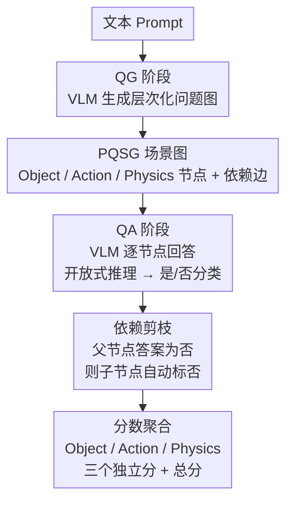

# Physics Question Scene Graph: Fine-grained Evaluation of Physical Plausibility in Text-to-Video Generation

**会议**: ECCV 2026  
**arXiv**: [2606.25306](https://arxiv.org/abs/2606.25306)  
**代码**: [https://github.com/atinpothiraj/pqsg](https://github.com/atinpothiraj/pqsg)  
**领域**: 视频生成  
**关键词**: 物理合理性评估, 场景图, 细粒度评估, 文本到视频生成, VLM评估  

## 一句话总结
PQSG 将视频物理合理性评估分解为三层层次化问题图（Object -> Action -> Physics），由 VLM 自动生成带依赖关系的问题并逐节点回答，在 FinePhyEval 数据集上实现了比现有指标更高的人类判断相关性，且能精确定位视频在哪一维度（对象/动作/物理）违反物理规律。

## 研究背景与动机
视频生成模型（Sora 2、Veo 3、Wan 2.1 等）在画面真实感上进步飞速，但生成物理上合理的视频仍是核心短板——物体可能会溶解而非吸收液体、牛顿摆的碰撞轨迹错乱、镜面反射丢失关键物体。这种物理不可信严重制约了视频生成模型在机器人仿真、具身智能训练、合成数据生成等下游应用中的实用价值。

然而，为什么之前没有可靠的细粒度物理评估方法？原因在于技术上的双重壁垒：一方面，早期评估指标（FID、FVD、CLIPScore）只衡量视觉质量或语义对齐，根本不管物理规律；另一方面，即便近年出现了 VideoPhy-2、PhyGenEval 等专门评估物理合理性的工作，它们也只输出一个聚合分数，无法定位"到底是物体没生成对、还是动作错了、还是物理交互不合理"——而这恰恰是模型改进和视频修复最需要的诊断信息。

做这件事为什么现在才可能？关键使能因素是 VLM（Gemini-2.5-Pro、GPT-5.5 等）的成熟。VLM 不仅能理解视频内容，还能生成原子化的验证问题并逐题回答，这使得"自动生成一套层次化、带依赖关系的物理验证问题"从不可行变为可行。PQSG 正是抓住了这个窗口：用 VLM 从文本 prompt 自动生成一棵问题场景图，再让 VLM 对着生成视频逐节点回答，最后按依赖关系剪枝无效问题，得到对象/动作/物理三个维度的独立分数。

**核心 idea**：将物理评估建模为一棵有向无环图（DAG），节点是原子验证问题，边编码逻辑依赖（物体不存在就不问它的动作，动作没发生就不问它的物理），从而在评估粒度和可靠性上同时超越现有聚合指标。

## 方法详解

### 整体框架
PQSG 要解决的核心问题是：给定一个文本 prompt 和一段生成视频，如何既给出整体物理可信度评分，又能精确定位具体在哪个维度（哪个物体、哪个动作、哪个物理交互）出了问题。整体设计是一个两阶段 VLM 管线：第一阶段从 prompt 自动生成一棵层次化问题场景图（QG），第二阶段将场景图中的问题逐一对照视频回答（QA），最后按图的依赖结构剪枝并聚合分数。

QG 阶段的输入是文本 prompt 和一个 in-context 示例（含示例 prompt、示例 PQSG 节点和边），输出是一棵完整的问题场景图。QA 阶段的输入是生成视频和单个问题节点，采用两步式回答：先让 VLM 生成开放式推理，再将推理结果分类为"是"或"否"，以此避免直接 yes/no 导致的思维链缺失。每个问题独立处理，确保细粒度。所有问题回答完毕后，按图的依赖结构剪枝——父节点答案为"否"时，其所有子节点自动标记为"否"且不再查询——最后对每类节点分别计算"是"的比例作为该维度得分，所有节点的平均即为总分。

### 关键设计

**1. 三层层次化问题分类：将视频评估解耦为 Object / Action / Physics**

现有评估方法的最大问题是把所有维度的质量混进一个聚合分数，导致无法判断模型到底在哪个环节失败。PQSG 将验证问题严格分为三个层次：Object 节点验证 prompt 中的关键物体是否出现在视频中（如 "O2: Are there two pillows?"）；Action 节点验证物体是否执行了正确的动作（如 "A1: Does one grabber tool release the brown tennis ball?"）；Physics 节点评估动作的物理合理性（如 "P8: Do the pillows visibly deform or compress upon impact?"）。Action 与 Physics 的区分标准是：Action 是 prompt 中直接提到的行为，Physics 是 prompt 隐含的物理常识（如形变、吸收、重力加速度等）。这种分离使得评估能精确区分三种失败模式：物体没生成对、动作没做对、物理交互不合理。实验证明这种层次化分离是有效的——在所有视频生成模型上，Object 得分（平均 0.93）远高于 Action（0.66）和 Physics（0.57），说明当前模型"画得出物体但做不对物理"才是真正的瓶颈。

**2. 依赖图结构与剪枝推理：确保只问有意义的问题**

这是 PQSG 区别于简单问题列表的核心设计。PQSG 将问题组织成一棵有向无环图，边的方向编码逻辑依赖关系：大多数 Action 节点以 Object 节点为父节点，大多数 Physics 节点以 Action 节点为父节点。同时也允许同类别依赖边（如 Object→Object、Action→Action），用于建模序列性依赖（如后续动作以前置动作为前提）。评估时严格强制执行依赖结构：若父节点答案为"否"，则其整条子节点链不再查询，自动标记为"否"。这样做的关键收益是避免 VLM 对无效问题产生幻觉——例如，如果视频中根本没有网球，直接问"网球的自由落体加速度是否符合重力定律"会让 VLM 瞎编一个答案。消融实验（Table 8）直接验证了这一点：去掉依赖图结构后，与人类判断的 Pearson 相关性从 0.48 降至 0.44；当 QA 由人类执行时，降幅更明显（0.80 -> 0.75），说明依赖结构对评估可靠性的贡献是实质性的。

**3. 两阶段 VLM 评估管线：QG 生成问题图 + QA 逐节点两段式回答**

PQSG 将评估拆成 QG（Question Generation）和 QA（Question Answering）两个独立阶段，两个阶段可由不同 VLM 承担，设计上是模型无关的。QG 阶段用 in-context learning：提供一个包含完整 PQSG 节点和边的示例 prompt，让 VLM 学会从新 prompt 生成结构一致的问题图。QA 阶段有一个关键实现细节：直接让 VLM 回答 yes/no 会抑制思维链推理，导致 VLM 跳过关键视觉细节就仓促判断。PQSG 的解决方案是两步式 QA——先让 VLM 输出开放式推理（描述视频中看到的现象），再基于自己的推理结果分类为 yes/no。这增加了可忽略的延迟但显著提升了 QA 质量。从 Table 5 可以看出，即使是最强的 GPT-5.5，QA 准确率在 Physics 类别上也仅有 64.6%，远低于 Object 类别的 88.4%，说明物理推理仍然是 VLM 的薄弱环节，这也构成了 PQSG 当前的能力上限。

**4. FinePhyEval 数据集：195 个视频的四维度人工标注**

为验证 PQSG 的有效性并建立可靠的评估基准，作者构建了 FinePhyEval 数据集。其核心设计选择包括：(a) 从 Physics-IQ 中选取全部 65 个专门测试物理理解的 prompt，涵盖固体力学(38)、流体动力学(15)、光学(8)、热力学(3)、磁学(2)五个物理类别；(b) 用 Sora 2、Veo 3、Wan 2.1 三个当前最强视频生成模型分别生成视频，共 195 个 prompt-video 对；(c) 每个视频由 8 名非作者人工标注员在 Object / Action / Physics / Overall 四个维度上用 5 点 Likert 量表打分，共收集 780 个分数；(d) 额外对 20 个 prompt 做问题生成（QG）的人工标注、对 30 个 prompt-video 对（444 个 QA 对）做问题回答（QA）的人工标注，为 QG/QA 子任务评估提供真值。标注质量通过 ICC=0.84 的高一致性得到了验证。这个数据集使得 PQSG 不仅能验证自身分数与人类判断的相关性，还能独立评估 QG 和 QA 两个子任务的 VLM 表现，使整个评估框架的每个环节都可被诊断。

### 一个完整示例：网球坠落场景

以论文开篇的示例说明 PQSG 的完整工作流。给定 prompt "Two pillows on a table and two grabber tools hanging above them from which a brown tennis ball and an orange block are suspended. The grabber tools let go of the ball and block."，QG 阶段 VLM 生成一个问题场景图：

- Object 节点：O1 "Is there a table?"、O2 "Are there two pillows?"、O9 "Is there a brown tennis ball?"
- Action 节点（以 Object 为父节点）：A1 "Does one grabber tool release the brown tennis ball?"（父节点 O9）、A2 "Does the other grabber tool release the orange block?"
- Physics 节点（以 Action 为父节点）：P8 "Do the pillows visibly deform or compress upon impact?"（父节点 A1/A2）、P5 "Does the tennis ball exhibit realistic gravitational acceleration?"

QA 阶段逐节点查询：VLM 回答 O2=Yes（有枕头）、O9=Yes（有网球）、A1=Yes（夹子释放了网球）、P8=No（枕头在球撞击时没有可见形变）。依赖剪枝在此例中未触发大规模剪枝，因为大多数前置条件成立。最终得分：Object 得分高（物体都生成对了），Physics 得分低（枕头不变形、重力加速度不对），精确指出了"模型生成了正确的物体和动作，但物理交互不可信"这一诊断结论。如果不做层次化分解，一个聚合分数只会说"这个视频质量一般"，无法告知开发者该修什么。

### 损失函数 / 训练策略
PQSG 本身不涉及模型训练，是一个零样本评估框架。QG 和 QA 均使用现成 VLM 的 API 调用，无需微调。在迭代优化实验中（Sec 5.5），作者用 PQSG 的细粒度反馈指导 prompt 精炼，配合 Wan 2.2 TI2V-5B 做迭代生成，但 PQSG 本身仍作为固定评估器，不涉及训练。

## 实验关键数据

### 主实验：与人类判断的相关性

| 评估方法 | Pearson's r | Kendall's tau | Spearman's rho |
|----------|------------|---------------|-----------------|
| VideoScore | 0.289 | 0.262 | 0.378 |
| VideoPhy-2-Autoeval | 0.346 | 0.277 | 0.349 |
| PhyGenEval | 0.272 | 0.220 | 0.264 |
| DSG (image-based) | 0.302 | 0.195 | 0.265 |
| Direct VQA | 0.382 | 0.290 | 0.360 |
| **PQSG w/ Gemini-2.5-Pro** | **0.467** | **0.306** | **0.406** |
| **PQSG w/ GPT-5.5** | **0.478** | **0.336** | **0.456** |

PQSG 在所有三个相关系数上均优于现有方法。值得注意的是，即便 DSG 也是基于问题图的评估方法，但因其设计面向图像而非视频，缺乏对时序属性（动作、物理交互）的建模，其相关性（Pearson 0.302）远低于 PQSG。此外，PQSG 的分数上界很高：当 QA 由人类执行时（Table 8），Pearson 相关性可达 0.80，说明随着 VLM 能力提升，PQSG 的自动评估质量还有很大上升空间。

### 多模型 PQSG 得分对比

| 视频生成模型 | Object | Action | Physics | Overall |
|-------------|--------|--------|---------|---------|
| Sora 2 | 0.95 | 0.75 | 0.69 | 0.78 |
| Veo 3 | 0.98 | 0.78 | 0.68 | 0.80 |
| Wan 2.1 | 0.86 | 0.53 | 0.46 | 0.59 |
| Cosmos 2.5 | 0.93 | 0.56 | 0.46 | 0.62 |

三个发现：(1) 所有模型在 Object 上得分最高、Physics 上最低，说明"画对物体"已经不是瓶颈，"画对物理"才是；(2) 闭源模型（Sora 2、Veo 3）全面领先开源模型（Wan 2.1、Cosmos），尤其在 Action 和 Physics 维度差距悬殊（Veo 3 Physics 0.68 vs Wan 2.1 Physics 0.46）；(3) Cosmos 作为专为物理世界仿真设计的模型，Object 得分接近闭源模型但 Physics 得分与 Wan 2.1 持平，说明物理仿真架构优势尚未在视频生成质量上体现。

### 消融实验

| 配置 | Pearson's r (GPT-5 QA) | Pearson's r (Human QA) |
|------|----------------------|------------------------|
| PQSG (完整) | 0.48 | 0.80 |
| 去掉依赖图结构 | 0.44 | 0.75 |
| 去掉细粒度问题（直接 VQA 三个维度） | 0.40 | 0.68 |

两个消融结论清晰：(1) 细粒度问题分解贡献最大——去掉后相关性下降 0.08（自动）和 0.12（人工），因为直接让 VLM 输出三个维度的综合分数会丢失中间推理过程；(2) 依赖图结构的贡献虽然小于细粒度分解，但在人工 QA 设置下贡献更明显（0.05），说明逻辑依赖在人做判断时本就隐含存在，但显式建模对 VLM 的可靠性帮助更大。

### 关键发现
- **Physics 是评估的最大瓶颈**：VLM 的 QA 准确率在 Object 上为 88.4%，在 Physics 上仅 64.6%，且 VLM 表现出明显的 "yes-bias"——倾向于在不了解细节时默认回答"是"。例如对烟雾方向的判断，VLM 声称"烟雾向上飘散"，实际视频显示烟雾像信号弹一样从侧面喷射。
- **人类做 QA 的上界高达 Pearson 0.80**（Table 8），说明 PQSG 的评估框架本身是可靠的，当前自动化评估的质量主要受限于 VLM 的物理推理能力。随着 VLM 进步，PQSG 的评估质量会自动提升。
- **模型迭代优化实验**：用 PQSG 反馈指导 prompt 精炼后，Wan 2.2 生成视频的平均 PQSG 得分从约 70% 提升至约 82%（第一轮 +15%），第二轮小幅提升至 81.9% 后饱和，证明 PQSG 不仅是评估工具，也可作为生成优化回路中的反馈信号。
- **泛化性**：在 VideoPhy-2 外部数据集上，PQSG 将语义对齐（SA）的 Pearson 相关性从 0.450 提升至 0.550，物理常识（PC）从 0.420 提升至 0.498，证明方法不依赖特定数据分布。

## 亮点与洞察
- **依赖剪枝是最妙的工程设计**：很多评估框架都会生成问题列表，但 PQSG 把问题组织成 DAG 并在评估时强制执行依赖剪枝，这本质上是对 VLM 的一种"保护"——不让它在缺乏前提条件时回答无意义的问题，从而减少了幻觉回答对最终得分的污染。这个设计思想可以迁移到任何需要分层验证的 VLM 评估场景（如长文事实性检查、多步推理验证）。
- **Action 与 Physics 的显式分离是概念性贡献**：区分"prompt 里说的动作"和"prompt 隐含的物理常识"，让评估能区分"模型不会做这个动作"和"模型做了但做得很假"两种失败。这个区分在推理上很自然，但在 PQSG 之前没有评估框架明确建模，导致两种失败被混为一谈。
- **QG 和 QA 解耦带来的灵活性**：两个阶段独立，可以用不同的 VLM 承担，也可以替换其中一方。当 VLM 升级时，只需替换 QA 模型就能获得更好的评估质量，无需重新设计整个框架。这种模块化设计与"模型无关"的声明使得 PQSG 具有长期生命力。
- **FinePhyEval 的复层标注设计值得借鉴**：不仅标注了 Likert 总分，还标注了 QG 和 QA 的真值，使得评估框架的每个子组件都可以独立验证。做 benchmark 论文时这种设计能大幅提升数据集的说服力和复用价值。

## 局限与展望
- **VLM 物理推理能力是硬上界**：作者坦诚 PQSG 的评估质量完全受限于 QA VLM 的物理理解能力（Physics QA 准确率仅 64.6%）。虽然人工 QA 上界高达 Pearson 0.80 证明了框架本身的可靠性，但当前自动化水平下 Physics 维度的评估仍不够可信。一个未讨论的问题是：PQSG 目前的 QG 示例只包含一个 in-context example，增加更多覆盖不同物理类别的示例是否能提升 QG 质量？
- **只评估 prompt 中涉及的内容**：PQSG 只为 prompt 中提到的物体、动作生成问题。如果一段视频中 prompt 未提及的区域发生了严重物理违规（如背景中水倒流），PQSG 不会捕捉到。这是"基于 prompt 的评估"这一范式的固有限制，人类可以不依赖 prompt 判断物理合理性。论文将此列为 future work 方向。
- **闭源 VLM 依赖影响可复现性**：主实验使用 Gemini-2.5-Pro 和 GPT-5.5，均为闭源模型。虽然作者承诺公开所有代码、prompt 和标注数据，并在 VideoPhy-2 上验证了开源 VLM 的可用性，但闭源模型的 API 行为变化仍可能影响长期复现。
- **Physics 类别多样性不足**：FinePhyEval 的 65 个 prompt 中固体力学占 38 个（58%），磁学仅 2 个（3%），物理现象覆盖不均衡。某些物理类别（如电磁学）的评估结论可能因样本过少而不够可靠。

## 相关工作与启发
- **vs VideoPhy-2**: VideoPhy-2 通过在物理视频数据上微调 VLM 来输出物理合理性分数，但仍然是单一聚合分数，无法提供细粒度诊断。PQSG 的层次化问题图天然具备可解释性和可定位性，且不需要微调（零样本），部署成本更低。
- **vs DSG (Davidsonian Scene Graph)**: DSG 是 PQSG 最直接的前身，同样使用问题图评估生成内容，但 DSG 面向图像且不区分 Object/Action/Physics 层次，不建模时序依赖。PQSG 可以视为 DSG 在视频+物理维度的自然扩展。实验数据也证明了这一扩展的关键性：DSG 在 FinePhyEval 上的 Pearson 相关性仅 0.302，显著低于 PQSG 的 0.478。
- **vs PhyGenEval**: PhyGenEval 也使用 VLM 评估物理常识，但评分粒度粗且没有依赖图结构，其 Pearson 相关性（0.272）在对比方法中最低，说明单纯的"让 VLM 打分"策略在面对复杂物理场景时不可靠。

## 评分
- 新颖性: 四颗星——将视频物理评估从"打一个总分"升级为"层次化问题图+依赖剪枝"，概念简洁但填补了明确的空白；Action/Physics 的显式分离虽然直觉但之前确实没人做
- 实验充分度: 四颗星——人类判断相关性、多模型对比、消融实验、外部数据集泛化、子任务（QG/QA）独立评估、迭代优化实验，六组实验覆盖全面；扣一星在于 Physics 类别分布不均且未对更多开源 VLM 做系统对比
- 写作质量: 四颗星——动机链条清晰（为什么需要细粒度 -> 为什么之前没有 -> 为什么现在能做），方法描述结构良好，每个设计选择都有对应的消融验证；Figure 2 的运行示例非常直观
- 价值: 四颗星——对视频生成领域的评估实践有直接指导意义，依赖图+层次化分解的设计模式可迁移到其他生成任务的评估（图像编辑、3D 生成、语音合成等）；FinePhyEval 本身也有独立的数据集价值

<!-- RELATED:START -->

## 相关论文

- [\[ICCV 2025\] ETVA: Evaluation of Text-to-Video Alignment via Fine-Grained Question Generation and Answering](../../ICCV2025/video_generation/etva_evaluation_of_text-to-video_alignment_via_fine-grained_question_generation_.md)
- [\[ECCV 2026\] PhyGDPO: Physics-Aware Groupwise Direct Preference Optimization for Physically Consistent Text-to-Video Generation](phygdpo_physics-aware_groupwise_direct_preference_optimization_for_physically_co.md)
- [\[ICLR 2026\] $PhyWorldBench$: A Comprehensive Evaluation of Physical Realism in Text-to-Video Models](../../ICLR2026/video_generation/phyworldbench_a_comprehensive_evaluation_of_physical_realism_in_text-to-video_mo.md)
- [\[ECCV 2026\] Your Data Manifold is Secretly a Reward Model: Shell-LCC for Text-to-Video Generation](your_data_manifold_is_secretly_a_reward_model_shell-lcc_for_text-to-video_genera.md)
- [\[ECCV 2026\] PhysRAG: Enhancing Physics-Awareness in Video Generation via Retrieval-Augmented Generation](physrag_enhancing_physics-awareness_in_video_generation_via_retrieval-augmented_.md)

<!-- RELATED:END -->
