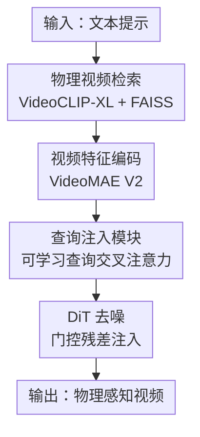

# PhysRAG: Enhancing Physics-Awareness in Video Generation via Retrieval-Augmented Generation

**会议**: ECCV 2026  
**arXiv**: [2606.26916](https://arxiv.org/abs/2606.26916)  
**代码**: [https://github.com/sediment1024/PhysRAG](https://github.com/sediment1024/PhysRAG)  
**领域**: 视频生成  
**关键词**: 物理感知视频生成, 检索增强生成, 视频扩散模型, 物理先验注入, 可学习查询

## 一句话总结
PhysRAG 将检索增强生成（RAG）引入视频扩散模型：先从手工构建的物理视频数据库中检索与输入 prompt 物理属性最相关的参考视频，再用 VideoMAE V2 编码其时空特征，最后通过一组可学习查询（learnable queries）作为信息瓶颈选择性提取物理先验并注入 DiT 去噪过程，在 PhyGenBench 物理常识基准上以平均分 0.58 达到 SOTA，同时推理开销仅增加 1.24%。

## 研究背景与动机
文本到视频（T2V）生成近年来取得了巨大进展，Wan、CogVideoX、HunyuanVideo 等大规模 DiT 模型已能生成视觉高度逼真的视频。然而，这些模型在面对涉及物理规律的场景时频繁失效——水花飞溅不满足动量守恒、物体下落违反重力方向、液体体积在接触前就已膨胀。根本原因在于：现有视频扩散模型缺乏对物理动力学的显式建模能力，仅靠数据驱动的视觉模式匹配不足以保证物理一致性。

围绕物理感知视频生成，已有方法分为两条路线。**显式方法**依赖确定性物理模拟器或数学约束（如哈密顿网络、牛顿动力学），能严格保证物理定律成立，但在开放世界复杂场景中泛化能力极差——热力学、光学等现象难以用封闭形式方程描述。**隐式方法**走数据驱动路线，通过 DPO、强化学习、3D 约束对齐等手段让模型隐式习得物理规律，泛化性好但可控性不足：物理先验被编码为标量奖励或 prompt 侧推理信号，难以精确注入生成过程。两派的共同盲区是：都没有利用真实物理视频中的显式时空参考作为物理先验。

本文从一个认知类比出发：人类学习物理规律的方式并非背诵公式，而是通过观察大量日常物理场景，在遇到新情境时从记忆中检索相似经验并提取其中隐含的物理原理。受此启发，PhysRAG 提出将 RAG 范式引入视频生成——显式检索具有相同底层物理规律的参考视频，隐式地将其物理动态通过可学习查询注入扩散模型去噪过程。核心 idea：**用检索到的真实物理视频作为显式物理先验，通过可学习查询信息瓶颈选择性提取物理动态并注入 DiT，让模型生成符合物理规律的视频**。

## 方法详解

### 整体框架
PhysRAG 的整体管线分为离线和在线两个阶段。离线阶段：从 WISA-80K 数据集中通过两阶段过滤管线筛选出约 7K 高质量物理视频用于训练，同时手工构建一个 170 视频、17 类物理现象的 PhysRAG 数据库供推理时检索。在线推理阶段：给定文本 prompt，用 VideoCLIP-XL 在 PhysRAG 数据库中检索物理属性最相关的参考视频，由预训练 VideoMAE V2 编码器提取时空特征，再通过 Query Inject 模块——一组可学习查询对视频特征做交叉注意力、以信息瓶颈方式选择性提取物理先验——将蒸馏后的物理 token 经门控残差连接注入 Wan2.2-5B DiT 的早期层（第 0, 1, 2 层），引导去噪过程生成物理一致的视频。

### 关键设计

**1. 两阶段数据过滤管线：以可控成本从噪声数据中提取高质量物理视频**

WISA-80K 是一个面向物理感知视频生成的互联网爬取数据集，但原始数据存在严重的描述与视频不匹配、内容质量低等问题——直接使用会引入噪声物理信号，反而误导模型。PhysRAG 设计了一个两阶段过滤管线，在数据质量和计算成本之间取得平衡。

第一阶段（粗过滤）：仅使用文本级别的 Qwen3-VL-4B 对视频的文字描述进行质量和物理相关性评分，保留 top 10% 候选。纯文本筛选成本极低，能高效剔除明显无关样本，但会引入假阳性——描述看起来有物理意义但视频内容不匹配的样本。第二阶段（细粒度对齐验证）：对第一阶段保留的候选视频均匀采样关键帧，连同对应 prompt 一起送入 Qwen3-VL-4B 进行图文一致性判断，剔除不匹配样本，保留率约 90%。使用均匀采样关键帧而非全视频序列是成本考量：在 WISA-80K 全量规模上用 Qwen3-VL-4B 逐帧推理约需 2000 GPU 小时（H20），无法承受。最终从 80K 原始视频中筛选出约 7K 高质量子集。

**2. 物理视频数据库构建：手工分类 17 类物理现象提供可靠检索源**

RAG 框架的效果高度依赖检索数据库的质量和结构。PhysRAG 手工构建了一个包含 170 个视频的物理视频数据库：首先梳理开放域视频生成中频繁出现的物理现象，系统性地归纳为 17 个类别（碰撞、燃烧、爆炸、流体、自由落体、热力学、光学等），每个类别人工收集并审核 10 个能清晰展示对应物理特征的高质量视频。数据库采用简单的层级目录结构组织，每个类别一个独立子目录。

这种设计有两个好处：一是约束检索空间到物理上有意义的样本，提高检索可靠性；二是每个类别内提供多样但一致的参考，帮助模型提取可迁移的物理先验而非过拟合单个视频实例。检索时使用 VideoCLIP-XL 提取 prompt 和视频的特征，通过 FAISS 进行高效最近邻检索。

**3. 可学习查询注入模块（Query Inject）：信息瓶颈选择性提取物理动态**

这是 PhysRAG 最核心的技术贡献。预训练 VideoMAE V2 编码器能从检索视频中提取丰富的时空特征 $F_v \in \mathbb{R}^{L \times C_v}$，但直接将这些稠密的潜在表示注入 DiT 会带来严重问题：检索视频中除了物理动态，还包含大量无关信息——背景纹理、物体外观、光照条件等——直接注入会引入视觉噪声和偏差，反而降低生成质量（消融实验中 concat 注入仅得 0.540，表 3）。

Query Inject 模块的核心思想是用一组可学习查询 $Q \in \mathbb{R}^{N \times C_h}$（$N=128$）充当**信息瓶颈**，通过交叉注意力选择性关注视频特征中与物理动态相关的成分：

$$H_{ca} = \text{CrossAttn}(Q, F_v, F_v) \in \mathbb{R}^{N \times C_h}$$

查询 $Q$ 作为 query，视频特征 $F_v$ 同时作为 key 和 value。这个操作自适应地聚合与当前生成任务最相关的物理动态。随后经过 FFN + 残差连接细化：

$$H_{ffn} = H_{ca} + \text{FFN}(H_{ca}), \quad \text{FFN}(x) = W_2\,\text{GELU}(W_1 x)$$

细化特征经线性投影 $H_{out} = H_{ffn}W_o \in \mathbb{R}^{N \times C_p}$ 得到紧凑的物理先验 token。注入 DiT 时，先通过轻量对齐算子 $\mathcal{A}(\cdot)$ 将对齐到 DiT token 维度和序列长度，再与原始 DiT token 沿序列维度拼接并通过融合投影 $\phi(\cdot)$ 压缩回原始维度：

$$H_{fuse} = \phi(\text{Concat}(H_{DiT}, \tilde{H}_p)) \in \mathbb{R}^{T \times C_d}$$

最终以门控残差形式注入：$H'_{DiT} = H_{DiT} + \alpha H_{fuse}$，其中 $\alpha$ 是可学习标量门，让模型自适应地调节物理先验的注入强度。线性探测实验（表 4）验证了可学习查询 token 确实保留了物理类别信息（准确率 67.06% vs 原始特征 67.65%），仅轻微下降，证明信息瓶颈有效蒸馏了物理信息同时过滤了无关视觉细节。

**4. 联合训练策略：DiT 主干与 RAG 模块必须协同优化**

训练策略的消融（表 5）揭示了一个关键发现：分阶段训练（先 SFT 微调 DiT 主干，再冻结主干单独训练查询模块，即 SFT+RAG）仅得 0.551，远低于联合训练的 0.578，甚至不如纯 SFT 的 0.546 加成明显。这说明物理先验的有效利用不是简单的"先学好视觉再叠加物理信息"——可学习查询提取的物理动态需要 DiT 主干在去噪过程中主动适配和利用，而非被动接收。联合训练让 DiT 和 Query Inject 模块协同演化：查询学会提取对 DiT 最有用的物理信号，DiT 学会如何利用这些信号约束生成过程。注入位置选择也验证了这一点：多层注入（0, 1, 2 层）效果最好（0.578），单层注入（尤其是最前端或最后端）显著下降——早期层注入让 DiT 从一开始就建立高层物理表征，多层设计则在不同抽象层级全面整合物理先验。

### 一个完整示例：机械臂蚀刻电路板

以 PhyGenBench 中"机械臂蚀刻电路板"场景为例走一遍 PhysRAG 的完整流程。输入 prompt 描述一台机械臂在电路板上执行连续蚀刻动作。首先，VideoCLIP-XL 将该 prompt 与 PhysRAG 数据库中 17 类物理现象的特征进行匹配，检索到"机械交互"类别下的一段参考视频——该视频展示了一个工具在表面上执行连续按压和滑动的动作。VideoMAE V2 将检索视频编码为 $L$ 个时空 token 的特征矩阵 $F_v$。128 个可学习查询 $Q$ 通过交叉注意力从 $F_v$ 中蒸馏出与"工具-表面接触力学"相关的物理先验 token——包括压力施加的方向性、接触点的空间约束、运动的连续性——而忽略检索视频中的具体物体外观和背景。这些物理 token 经对齐后注入 Wan2.2-5B DiT 的第 0, 1, 2 层，与噪声潜在表示 $H_{DiT}$ 融合。门控残差机制让模型自适应决定在每个去噪步骤中物理先验的贡献权重。生成结果中，机械臂执行了连贯的下压-滑动-抬起的连续动作，而基线 Wan2.2-5B 生成的视频中机械臂几乎静止——因为它从未在训练数据中学习过这种精确力学交互的模式。

### 损失函数 / 训练策略
PhysRAG 基于 Wan2.2-5B 进行微调，使用标准扩散损失（噪声预测 MSE），联合训练 Wan 主干和 Query Inject 模块的所有参数。训练配置：4 张 NVIDIA H20 GPU 训练 2 天，有效 batch size 128（每卡 micro-batch 16 + 2 步梯度累积），学习率 $1 \times 10^{-6}$，weight decay 0.01，20 个 epoch，视频分辨率 $49 \times 704 \times 480$。优化器 AdamW（$\beta_1=0.9$, $\beta_2=0.999$），BF16 混合精度 + 梯度检查点 + DeepSpeed ZeRO-3 CPU offload 降低显存。查询注入到 DiT 的第 0, 1, 2 层，模型总参数量从 4.998B 增加到 5.114B（+2.28%）。

## 实验关键数据

### 主实验
**PhyGenBench 物理常识评估**（GPT-4o 作为裁判）：PhysRAG 以平均分 0.58 达到 SOTA，超过 Wan2.2 基线 0.54（+0.04），优于闭源商业模型 Kling（0.49）和 Gen-3（0.51），也优于同属检索增强路线的 DiT-Mem（0.56）。热学和材料指标提升尤为显著（分别 +0.04 和 +0.05），说明检索到的真实物理视频对复杂物理现象（热传导、流体材料特性）帮助最大。

| 方法 | 规模 | 力学 | 光学 | 热学 | 材料 | 平均 |
|------|------|------|------|------|------|------|
| Pika | - | 0.35 | 0.56 | 0.43 | 0.39 | 0.44 |
| Gen-3 | - | 0.45 | 0.57 | 0.49 | 0.51 | 0.51 |
| Kling | - | 0.45 | 0.58 | 0.50 | 0.40 | 0.49 |
| CogVideoX | 5B | 0.39 | 0.55 | 0.40 | 0.42 | 0.45 |
| Open-Sora V1.2 | 1.1B | 0.43 | 0.50 | 0.44 | 0.37 | 0.44 |
| DiT-Mem | 5B | 0.56 | 0.74 | 0.48 | 0.47 | 0.56 |
| Wan 2.2 | 5B | 0.58 | 0.60 | 0.50 | 0.48 | 0.54 |
| **Wan 2.2 + PhysRAG** | 5B | **0.59** | **0.66** | **0.54** | **0.53** | **0.58** |

**VBench 通用视频质量评估**：PhysRAG 在低层和高层指标上均实现一致提升。Low-Avg 从 62.10% 提升到 65.48%（所有对比方法中最高），High-Avg 从 81.18% 提升到 82.88%。色彩得分（Color）达 93.95%，为所有方法中最高。这说明注入物理先验不仅没有损害通用生成质量，反而通过更合理的运动约束改善了画面一致性。

| 方法 | Color | Style | Obj. Class | Low-Avg | Subj. Consist. | Spatial Rel. | Multi-Obj. | High-Avg |
|------|-------|-------|------------|---------|----------------|--------------|------------|----------|
| CogVideo | 79.57% | 22.01% | 73.40% | 58.33% | 92.19% | 18.24% | 18.11% | 42.85% |
| DiT-Mem | 93.67% | 21.22% | 80.00% | 64.96% | 95.67% | 78.42% | 74.38% | 82.82% |
| Wan 2.2 | 85.92% | 21.26% | 79.12% | 62.10% | 95.51% | 78.91% | 69.12% | 81.18% |
| **Wan 2.2 + PhysRAG** | **93.95%** | 22.00% | **80.50%** | **65.48%** | **96.31%** | 77.33% | **75.00%** | **82.88%** |

### 消融实验

| 配置 | 力学 | 光学 | 热学 | 材料 | 平均 | 说明 |
|------|------|------|------|------|------|------|
| SFT（仅过滤数据微调） | 0.575 | 0.626 | 0.511 | 0.475 | 0.546 | 无 RAG，纯数据质量基线 |
| SFT+RAG（分阶段训练） | 0.566 | 0.626 | 0.511 | 0.500 | 0.551 | 先 SFT 后冻结主干只训练查询 |
| **PhysRAG（联合训练）** | **0.586** | **0.660** | **0.540** | **0.526** | **0.578** | 主干 + 查询端到端联合优化 |
| PhysRAG + Random Data | 0.558 | 0.640 | 0.511 | 0.466 | 0.544 | 用未过滤数据，甚至不如 Filtered-SFT |
| Concat 注入 | 0.541 | 0.633 | 0.488 | 0.500 | 0.540 | 直接拼接检索特征，引入视觉噪声 |
| Cross Attention 注入 | 0.541 | 0.633 | 0.522 | 0.516 | 0.553 | 密集交叉注意力，信息瓶颈缺失 |
| RAG-Front（仅第 0 层） | 0.508 | 0.500 | 0.511 | 0.393 | 0.478 | 单层注入效果最差 |
| RAG-Mid（仅第 15 层） | 0.533 | 0.653 | 0.500 | 0.500 | 0.546 | 中层注入优于首尾但不及多层 |

### 关键发现
- **联合训练是不可妥协的设计**：SFT+RAG 分阶段训练（0.551）不仅远低于联合训练（0.578），甚至力学指标（0.566）低于纯 SFT（0.575）。物理先验不是即插即用的插件，DiT 主干需要从头学习如何利用检索信号，冻结主干等同于给模型塞入它无法理解的额外信息。
- **数据质量决定 RAG 上限**：PhysRAG + Random Data（0.544）甚至不如 Filtered-SFT 纯微调（0.546），说明 RAG 机制对训练数据质量高度敏感——垃圾检索源只会放大噪声。过滤数据让 RAG 从 0.544 跃升到 0.578（+0.034），是单一模块中贡献最大的因素之一。
- **信息瓶颈是 Query Inject 的灵魂**：concat 直接拼接（0.540）和 dense cross-attention（0.553）都显著差于 Query Inject（0.578）。根本原因在于检索视频中的背景纹理、物体外观等非物理信息会污染 DiT 特征空间，导致生成质量下降。可学习查询充当的信息瓶颈是连接显式检索与隐式生成的桥梁。
- **多层早期注入策略最优**：单层注入（尤其是最后端 0.521 或最前端 0.478）效果远差于多层（0.578）。最优配置仅在 DiT 的前三层注入，说明物理先验应该在去噪过程的早期阶段引入，从高层语义层面约束整体运动模式，而非在后期局部细化阶段介入。
- **计算开销极低**：PhysRAG 仅增加 114.25M 参数（+2.28%）、1.81GB 显存（+9.2%）、推理延迟增加 0.82 秒/样本（+1.24%）。FAISS 检索耗时仅 0.0065 秒，可忽略不计。收益主要来自检索和注入机制的有效性而非算力堆砌。

## 亮点与洞察
- **"人类学物理"的类比精巧且贯穿全文**：不是简单的修辞包装，而是真正指导了方法设计——从为什么用 RAG（人靠回忆相似场景）到为什么需要信息瓶颈（人只提取物理原理而忽略无关细节），每个模块都有认知动机支撑。
- **信息瓶颈设计解决了一个普遍问题**：检索增强生成中"如何只取有用的部分"是共性难题。Query Inject 的 learnable query bottleneck 是通用范式，可直接复用到其他检索增强任务（如 style-guided generation、motion transfer）。关键洞察是：检索到的参考中最有价值的是"结构信息"而非"外观信息"，信息瓶颈天然适合这种"去外观存结构"的需求。
- **数据过滤的自适应成本策略**：两阶段（文本→多模态）不是简单的串行，而是考虑了每阶段的假阳性特征和计算成本的非均匀分布。第一阶段文本筛选便宜但引入假阳性，第二阶段多模态验证昂贵但精准——这种"先粗后细"的策略在 2000 GPU 小时的预算约束下是最优解。
- **门控残差注入是低成本高收益的设计**：单个可学习标量 $\alpha$ 就让模型自适应控制物理先验的注入强度。无需复杂的时间步调度或层次化注入策略，极简设计带来的是训练稳定性和可解释性。
- **三层注入而非全层注入**：仅在前三层注入物理先验就达到最佳效果，说明物理约束主要作用在高层语义规划阶段。这个发现对理解扩散模型去噪过程的层级分工有启发意义——早期层管"整体布局和运动趋势"，后期层管"局部细节细化"。

## 局限与展望
- **物理视频数据库覆盖有限**：170 个视频 17 个类别远不能穷尽真实物理世界。像断裂、相变、电磁感应等现象尚未覆盖。数据库的扩展机制（自动发现新类别、众包标注）是实际部署中必须解决的问题。数据库的手工构建方式也限制了规模化。
- **强依赖检索质量**：如果检索到的视频与目标 prompt 物理属性不匹配，注入的物理先验可能产生误导。VideoCLIP-XL 作为检索模型的物理理解能力未经专门验证，在细粒度物理区分（如"弹性碰撞 vs 非弹性碰撞"）上的表现存疑。
- **仅验证了单一主干**：所有实验基于 Wan2.2-5B，未在其他 DiT 架构（如 CogVideoX、HunyuanVideo）上验证泛化性。Query Inject 的设计是否与不同 DiT 的内部表示兼容仍需探索。
- **WISA-80K 过滤后的 7K 数据仍偏小**：91.25% 的数据被丢弃，虽然质量提升，但可能损失了部分长尾物理现象的覆盖。蒸馏或合成数据方法可能比纯过滤更可持续。
- **物理评估指标单一**：PhyGenBench 和 VBench 的评估依赖 GPT-4o 作为裁判，其物理判断的准确性未经标定。缺乏定量物理指标（如运动轨迹误差、碰撞检测精度），难以精细比较不同方法的物理保真度。

## 相关工作与启发
- **vs DiT-Mem**: DiT-Mem 也是通过检索视频记忆来引导 DiT 生成，但它从通用域数据库检索、用频率滤波记忆 token 调制 DiT，缺乏对物理属性的专门建模。PhysRAG 的物理视频数据库 + 物理先验提取机制在 PhyGenBench 上高出 0.02，说明面向物理场景的专用检索和注入比通用记忆调制更有效。启发：领域特化的检索源和注入机制可能是在特定场景（医学、遥感、工业）提升生成可控性的通用范式。
- **vs PhyT2V / PhysCtrl 等显式物理方法**: 显式方法用物理模拟器或数学约束保证物理一致性，但泛化受限。PhysRAG 走了中间路——用真实视频替代模拟器作为物理参考源，既保留了隐式方法的数据驱动泛化性，又获得了显式方法的参考可控性。这种"用真实数据替代模拟器"的思路可扩展到其他难建模领域（如流体模拟、柔性体形变）。
- **vs VideoDPO / PhysGDPO 等偏好对齐方法**: 偏好对齐方法用标量奖励信号间接引导物理一致性，信号稀疏且难以精确定位问题帧。PhysRAG 用检索视频提供帧级时空参考，信号密度和精确度远高于标量奖励。两者可能互补：RAG 提供稠密物理引导 + DPO 提供高层偏好微调。
- **vs RDM / Re-Imagen（检索增强图像生成）**: 图像域的检索增强主要用于提升保真度和多样性，注入的是外观和风格信息。PhysRAG 将检索增强扩展到视频域且聚焦于物理动态——检索的是"运动规律"而非"长什么样"。VideoMAE + learnable query 的组合是视频域 RAG 的一个可行模板。

## 评分
- 新颖性: ⭐⭐⭐⭐⭐ 首次将 RAG 范式引入物理感知视频生成，认知类比→方法设计的推导链清晰且有说服力，不是简单的 A+B 拼接
- 实验充分度: ⭐⭐⭐⭐ 主实验覆盖 PhyGenBench + VBench 双基准、消融涵盖注入方式/训练策略/数据质量/注入层/计算开销 5 个维度，但缺乏除 Wan2.2 外的多主干验证和更细粒度的物理指标
- 写作质量: ⭐⭐⭐⭐ 动机的认知类比写得很好，方法公式清晰，但部分表格引用有 LaTeX 残留（LABEL:tab:physgenbench），物理数据库构建的 17 类分类依据交代不够详细
- 价值: ⭐⭐⭐⭐⭐ 物理感知是视频生成从"看起来真"到"动得对"的关键瓶颈，RAG 路线避开了显式物理建模的泛化困境和隐式方法的控制难题，是一条有潜力的中间道路，信息瓶颈设计也是检索增强领域的通用贡献

<!-- RELATED:START -->

## 相关论文

- [\[AAAI 2026\] DreamRunner: Fine-Grained Compositional Story-to-Video Generation with Retrieval-Augmented Motion Adaptation](../../AAAI2026/video_generation/dreamrunner_fine-grained_compositional_story-to-video_genera.md)
- [\[CVPR 2025\] The Devil is in the Prompts: Retrieval-Augmented Prompt Optimization for Text-to-Video Generation](../../CVPR2025/video_generation/the_devil_is_in_the_prompts_retrieval-augmented_prompt_optimization_for_text-to-.md)
- [\[ECCV 2026\] PhyGDPO: Physics-Aware Groupwise Direct Preference Optimization for Physically Consistent Text-to-Video Generation](phygdpo_physics-aware_groupwise_direct_preference_optimization_for_physically_co.md)
- [\[ECCV 2026\] Physics Question Scene Graph: Fine-grained Evaluation of Physical Plausibility in Text-to-Video Generation](physics_question_scene_graph_fine-grained_evaluation_of_physical_plausibility_in.md)
- [\[ICML 2026\] Enhancing Train-Free Infinite-Frame Generation for Consistent Long Videos](../../ICML2026/video_generation/enhancing_train-free_infinite-frame_generation_for_consistent_long_videos.md)

<!-- RELATED:END -->
