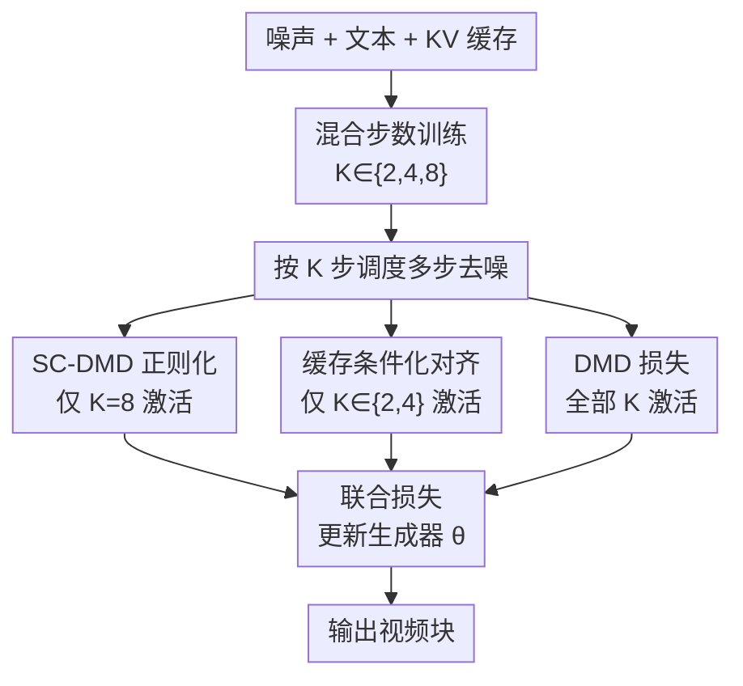

# Salt: Self-Consistent Distribution Matching with Cache-Aware Training for Fast Video Generation

**会议**: ECCV 2026  
**arXiv**: [2604.03118](https://arxiv.org/abs/2604.03118)  
**代码**: 待确认  
**领域**: 视频生成  
**关键词**: 视频生成, 扩散模型蒸馏, 分布匹配蒸馏, 半群正则化, KV缓存感知训练

## 一句话总结
Salt 提出 SC-DMD 框架，通过半群缺陷正则化（semigroup-defect regularizer）修复分布匹配蒸馏（DMD）在多步推理中的组合性缺陷，并结合缓存感知混合步数训练进一步提升自回归视频生成的稳定性，在 2-4 NFE 的极低推理预算下显著提升生成质量。

## 研究背景与动机

将视频生成模型蒸馏到极低的推理预算（2-4 步去噪）是实现实时部署（real-time deployment）的关键。当前主流思路分为两派：轨迹式一致性蒸馏（trajectory-style consistency distillation，如 PCM/LCM）和分布匹配蒸馏（Distribution Matching Distillation，DMD）。轨迹式方法通过回归监督迫使学生模型模仿教师的去噪轨迹，在图像领域表现良好；但视频生成中，同一条件可以对应多个合理的运动延续方式（例如同一运动在速度、幅值或轨迹上可以不同），回归式损失在这种多模态不确定性下会退化为条件平均，导致画面过度平滑、运动趋于保守。DMD 则绕过轨迹回归，通过分布匹配梯度让学生输出的分布逼近教师参考分布的各个模式（mode-seeking），在极低步数下往往产生更锐利、更具表现力的样本，因此已成为当前视频蒸馏乃至实时自回归生成系统的核心设计。

然而，DMD 存在一个根本性的结构性缺陷：它的训练目标是纯局部的（purely local）——每个噪声层级独立地作为"单步生成器"接受分布匹配监督，完全不约束这些逐时间步的行为在先后串联时如何交互。少步推理的本质恰恰是反复组合所学去噪算子的过程（composed rollout），当各步算子缺乏组合性约束时，误差会沿着推理路径逐级累积，导致增加去噪步数反而降低生成质量——例如出现过度曝光、细粒度纹理丢失或多物体语义混杂。本文将此称为 DMD 的"组合性缺陷"（compositionality deficit）。在自回归生成场景中，问题进一步放大：每个新生成块都依赖先前块的 KV 缓存，早期块的误差会编码进缓存并随生成进程逐步漂移，形成恶性循环。

本文的核心洞察是：保留 DMD 的分布对齐能力作为主要驱动力以维持单步锐度，同时引入一个轻量级的正则化器来显式耦合相邻去噪操作，使各步算子近似满足流映射的半群律（semigroup law）。**核心 idea：将学生去噪算子 Ψ_θ 的直接端点（ts→te 单步）与组合端点（ts→tm→te 两步）之间的差异作为正则项加入 DMD 目标，在不牺牲单步锐度的前提下修复多步组合性缺陷；针对自回归生成中 KV 缓存质量随推理步数变化的问题，进一步提出混合步数训练与缓存条件化特征对齐，让生成器在训练时系统性地接触不同质量的缓存条件。**

## 方法详解

### 整体框架

Salt 的核心是在 DMD 框架上增加两条条件激活的正则化路径，分别应对非自回归和自回归场景下的不同瓶颈。在非自回归蒸馏中（以 Wan 2.1 I2V 14B / T2V 1.3B 为骨干），论文在标准的 DMD 训练网格上增加一个 shortcut 自一致性损失（SC-DMD），对齐直接端点与两步组合端点。在自回归蒸馏中（以 Self Forcing / LongLive / Causal Forcing 为骨干），论文进一步引入混合步数机制：每次迭代从 {2,4,8} 中随机采样步数 K，对 K=8 启用 SC-DMD 正则化以约束最长组合链，对 K∈{2,4} 的低步数 rollout 则用下一档更密的调度作为参考进行缓存条件化的特征对齐。三种损失（DMD、SC、Align）按步数条件联合优化同一个学生生成器，不改变推理管线或模型架构。

### 关键设计

**1. SC-DMD：半群缺陷正则化修复组合性缺陷**

DMD 的组合性缺陷源于其纯局部的训练信号——每个噪声层级的分布匹配是独立进行的，没有机制保证从 ts 到 te 的直接去噪等价于先到 tm 再到 te 的组合去噪。SC-DMD 的正则化思路直接源于概率流 ODE 中流映射（flow map）的半群律：对精确 ODE 流映射 Φ，对任意 t>u>s 有 Φ^{t→s}=Φ^{u→s}∘Φ^{t→u}。论文将学生单步欧拉算子 Ψ_θ 对该律的偏离量直接设为惩罚项。具体地，对三元组 (ts, tm, te) 按 ts>tm>te 采样，计算直接端点 x_te^(1)=Ψ_θ^{ts→te}(x_ts) 与组合端点 x_te^(2)=Ψ_θ^{tm→te}(Ψ_θ^{ts→tm}(x_ts)) 之间的 L2 差异，即 ℒ_SC = E[||x_te^(1)-x_te^(2)||²₂]。这里的 te 锚定在推理网格（确保正则化作用于推理时真正关心的终点），tm 则从更密的训练网格上随机采样——tm 所在的时间点已有充分的 DMD 分布匹配监督，算子训练较充分，因此组合端点是一个可靠的参考。这种精心设计的网格对齐避免了 shortcut 式监督中因训练网格不匹配导致的"组合分支经过未充分优化的中间算子，使直接端点向不可靠目标回归"的问题。实验证明，仅增加训练网格密度而不加 SC 正则化（DMD-4 vs DMD-8）并不能改善生成质量，反而在小指标上退步，而 SC-DMD 在 4 步推理下全面超越 DMD 基线，证实增益来自显式的组合性约束。

**2. 混合步数自回归训练：覆盖 KV 缓存质量分布**

在自回归视频生成中，每个新块的条件输入包括先前块的 KV 缓存。与文本等静态条件不同，KV 缓存本身就是模型动态生成的，其质量随先前 rollout 的步数而变化：高步数 rollout 产生更丰富准确的缓存，低步数 rollout 则产生退化、噪声更大的缓存。如果训练始终使用固定步数 K，模型只见过一种缓存质量区间，推理时遇到不同的缓存质量就会产生训练-推理分布偏移。更严重的是，自回归误差在块间累积会导致 KV 缓存逐步漂离训练时的条件分布，造成语义退化。Salt 的解决思路是系统性地覆盖推理时会遇到的各种缓存质量：每次迭代从 {2,4,8} 中按概率 {0.2,0.4,0.4} 采样 K，并以此调度执行块级自回归 rollout。这不仅让生成器和判别器都接触到不同 fidelity 的 KV 缓存模式，还为 SC-DMD 在自回归场景中的应用提供了必要的训练基座——SC 正则化只激活于 K=8 的最长组合链，因为这个区间多步不一致性最突出、正则化收益最大。消融实验清晰地证实了这一设计的必要性：单独在标准基线上叠加 SC 损失反而降低性能（Total 84.62→83.83），只有与混合步数 rollout 配合后 SC 才能生效（Total 83.83→85.02），说明混合步数暴露了低质量缓存下的分布偏移，SC-DMD 因此有了充分发挥作用的上下文。

**3. 缓存条件化特征对齐：弱缓存输出向强参考迁移**

混合步数训练让模型接触了不同质素的缓存条件，但低步数下的生成质量仍然受限于较差的 KV 缓存。论文引入一个缓存条件化的参考对齐损失来进一步弥补这一差距：对 K∈{2,4} 的低步数 rollout，用下一档更密集的调度（2→4 或 4→8）构建一个高质量的参考 rollout（共享相同输入噪声和文本），然后将低步数输出向高步数参考对齐。对齐方式采用 TRD 风格的关系特征空间（relation alignment）：从中间特征层取出帧级空间 token 特征，对每帧计算 S×S 的 token 间关系矩阵（特征先在通道维上做 L2 归一化，再内积得出），然后以带边界的 L1 差异作为损失。这个带边界 δ 的设计让模型忽略小的、无信息的关系差异，只惩罚显著偏离参考关系模式的成分。消融结果与设计意图高度一致：对齐损失在 4 步设定下小幅提升（Semantic 80.65→81.49 中约 +0.1），但在更极端的 2 步推理下帮助显著（Semantic 从 80.65 提升至 81.49），因为它精准地引导了最脆弱的低步数缓存输出向高质量参考靠拢。

### 损失函数 / 训练策略

完整的自回归训练目标为 min_θ [ ℒ_DMD(θ; ψ) + λ_SC·ℒ_SC(θ)·1[K=8] + λ_align·ℒ_align(θ)·1[K∈{2,4}] ]，其中 λ_SC=0.2。DMD 损失对所有步数激活，SC 损失仅在 K=8 时激活，对齐损失仅在 K∈{2,4} 时激活。生成器和判别器使用 AdamW 优化器，学习率分别为 2×10⁻⁶ 和 4×10⁻⁷；对齐损失在训练预热约 600 轮后启用。非自回归设定下不需混合步数，直接在 8 点训练网格上运行 ℒ_DMD + λ_SC·ℒ_SC。

## 实验关键数据

### 主实验

**非自回归 I2V（Wan 2.1 14B, 4 NFE, VBench-I2V）**

| 指标 | PCM (8步) | DMD (4步) | LightX2V (4步) | Ours SC-DMD (4步) |
|------|-----------|-----------|----------------|-------------------|
| I2V Score | 93.63 | 93.09 | 93.50 | **93.90** |
| Quality Score | 78.52 | 78.89 | **80.92** | 80.86 |
| Background Consistency | 97.34 | 92.79 | 95.87 | **95.97** |
| Motion Smoothness | 98.24 | 97.99 | 97.89 | **98.37** |
| Temporal Flickering | 97.67 | 95.21 | 96.30 | **97.41** |
| Imaging Quality | 70.42 | 70.35 | 71.67 | **72.16** |

**自回归 T2V（Wan 2.1 14B, 4 NFE, 5秒, VBench-extend）**

| 模型 | Total Score | Quality Score | Semantic Score |
|------|------------|--------------|----------------|
| Self Forcing | 84.20 | 84.74 | 82.05 |
| Ours - Self Forcing | **84.47** | **85.27** | 81.28 |
| LongLive | 84.40 | 85.12 | 81.53 |
| Ours - LongLive | **84.93** | **85.41** | **83.00** |
| Causal Forcing | 84.62 | 85.41 | 81.47 |
| Ours - Causal Forcing | **85.08** | **85.96** | 81.59 |

### 消融实验

**SC-DMD 核心消融（Wan 2.1 1.3B T2V, 4 步推理）**

| 配置 | Quality | Semantic | Total | Spatial Relation | 说明 |
|------|---------|----------|-------|------------------|------|
| DMD-8 | 84.05 | 76.50 | 82.54 | 67.13 | 8点密网格，无 SC |
| DMD-4 | 84.39 | 76.36 | 82.78 | 69.49 | 4点稀疏网格基线 |
| SC-DMD | **84.76** | **77.77** | **83.36** | **71.91** | 8点网格 + SC 正则化 |

**自回归组件消融（Causal Forcing 骨干, 4 步推理）**

| 配置 | Total | Quality | Semantic | 说明 |
|------|-------|---------|----------|------|
| Causal Forcing 基线 | 84.62 | 85.41 | 81.47 | 官方基线 |
| + 单纯 ℒ_SC | 83.83 | 84.35 | 81.77 | 无混合步数时 SC 有害 |
| + 混合步数 + ℒ_SC | 85.02 | 85.91 | 81.48 | 混合步数是前体 |
| + 完整配置 (full) | **85.08** | **85.96** | **81.59** | 加入对齐损失 |

### 关键发现

- SC-DMD 正则化是收益的主要来源：非自回归消融中 DMD-4 与 DMD-8 在 4 步推理下持平甚至 DMD-8 更差，说明增益来自显式组合约束而非密网格。
- 在自回归场景中，混合步数 rollout 是 SC-DMD 生效的必要前提——单独添加 SC 损失反而由于训练-推理分布偏移而降低性能。
- 缓存条件化特征对齐在 2 步极低推理预算下的增益最显著（Semantic +0.84），与设计意图完全一致。
- 论文直接测量了半群缺陷（semigroup defect）作为诊断指标，SC-DMD 的缺陷值（0.0111）低于 DMD（0.0135），为机制层面的改善提供了定量佐证。
- 30 秒长视频生成中，Salt 的收益延续至长序列，在语义一致性上提升明显（Causal Forcing 的 Semantic 从 60.25 升至 62.77）。

## 亮点与洞察

- **首次明确发现并命名 DMD 的组合性缺陷**：虽然 DMD 已成为视频蒸馏的事实标准，但此前无人明确指出其训练目标是纯局部的、不约束多步组成行为。论文通过"增加步数反降质量"的反直觉实验定量刻画了该问题，并建立半群缺陷作为直接的诊断指标。
- **半群缺陷正则化的简洁与互补性**：仅在欧拉算子上增加 L2 端点对齐约束，与 DMD 天然互补——正则化器修复多步组合性、DMD 保留单步锐度，计算开销仅一次额外前向传播。
- **将 KV 缓存视为随步数变化的条件变量**：这一视角具有独创性。混合步数训练让模型系统性地覆盖缓存质量分布，是比"始终用高质量缓存训练"更贴合推理分布的策略。
- **训练机制设计的条件化启闭逻辑**：两个正则化器各有特定的激活窗口（SC 仅 K=8、Align 仅 K∈{2,4}），在不同缓存质量区间扮演不同的正则化角色，无冗余开销。
- **对网格不匹配的深入分析**：论文分析了 naive DMD+SCFM 的退化原因（训练网格不匹配导致组合分支经过未充分优化的算子），这一分析对后续 DMD 改进工作有很强的指导价值。

## 局限与展望

- SC-DMD 依赖于训练网格上有可采样的中间时间步 tm。在极端少步场景（如 1-2 步）下，可用中间步减少，正则化的覆盖范围受限。
- 对齐损失中的参考 rollout 本身也是模型生成的，仍可能带有偏置。当参考缓存自身质量不佳时，对齐可能引导到错误的方向。
- 方法聚焦于视频蒸馏，其半群正则化的设计思想理论上可迁移到图像蒸馏或其他少步生成范式，但论文未做跨域验证。
- 混合步数训练增加了每次迭代的计算开销（涉及不同步数 rollout），尽管论文指出训练总轮数不高，大模型场景下的实际成本仍需评估。

## 相关工作与启发

- **vs DMD (Distribution Matching Distillation)**: DMD 对每个噪声层级做独立的分布匹配，不约束多步组合。SC-DMD 在其基础上加半群缺陷正则化器，保留 DMD 的 mode-seeking 锐度但修复组合性。
- **vs Trajectory-style consistency distillation (PCM / LCM / rCM)**: 轨迹式方法用回归损失迫使学生模仿教师轨迹，在视频多模态下易条件平均。SC-DMD 将半群律以正则化器而非主要目标的形式引入，避免 mode-averaging。
- **vs Shortcut models (SCFM)**: Shortcut 以组合一致性作为主要自蒸馏目标，但与 DMD 直接杂化因网格不匹配导致严重退化（Total 75.06）。SC-DMD 避免此陷阱：SC 和 DMD 作用在同一对齐网格上。
- **vs Self Forcing / Causal Forcing / LongLive**: Salt 不改推理管线或模型架构，仅改进训练目标就能带来一致提升，体现方法的通用性和实用性。

## 评分

- 新颖性: ⭐⭐⭐⭐⭐ [精准识别 DMD 框架中长期以来被忽视的组合性缺陷，提出半群缺陷正则化这一物理意义清晰、实现简洁的解决方案]
- 实验充分度: ⭐⭐⭐⭐⭐ [覆盖 2 种非自回归设定 + 3 种自回归骨干，做了跨步数/跨长度全方位评估，并有半群缺陷直接诊断和充分的消融分析]
- 写作质量: ⭐⭐⭐⭐⭐ [问题定义清晰、动机层层递进、方法阐述条理分明，附录对关键设计决策（网格设计、SC 与 shortcut 的区别）做了深入分析]
- 价值: ⭐⭐⭐⭐⭐ [DMD 是当前视频蒸馏的事实标准，修复其根本缺陷具有广泛的实际意义；缓存感知训练对自回归视频生成管线也有重要参考价值]

<!-- RELATED:START -->

## 相关论文

- [\[CVPR 2026\] Transition Matching Distillation for Fast Video Generation](../../CVPR2026/video_generation/transition_matching_distillation_for_fast_video_generation.md)
- [\[NeurIPS 2025\] MagCache: Fast Video Generation with Magnitude-Aware Cache](../../NeurIPS2025/video_generation/magcache_fast_video_generation_with_magnitudeaware_cache.md)
- [\[ECCV 2026\] PhyGDPO: Physics-Aware Groupwise Direct Preference Optimization for Physically Consistent Text-to-Video Generation](phygdpo_physics-aware_groupwise_direct_preference_optimization_for_physically_co.md)
- [\[CVPR 2026\] Reward Forcing: Efficient Streaming Video Generation with Rewarded Distribution Matching Distillation](../../CVPR2026/video_generation/reward_forcing_efficient_streaming_video_generation_with_rewarded_distribution_m.md)
- [\[ICCV 2025\] Adversarial Distribution Matching for Diffusion Distillation Towards Efficient Image and Video Synthesis](../../ICCV2025/video_generation/adversarial_distribution_matching_for_diffusion_distillation_towards_efficient_i.md)

<!-- RELATED:END -->
