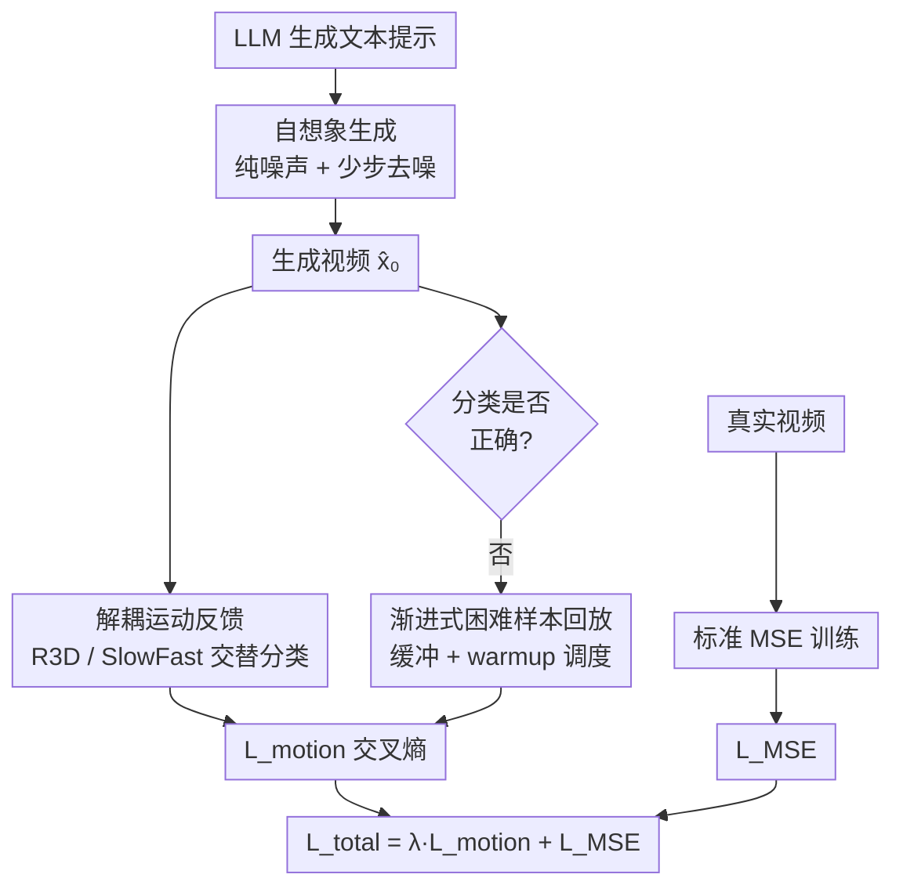

# SIFT: Self-Imagination Fine-Tuning for Physically Plausible Motion in Video Diffusion Models

**会议**: ECCV 2026  
**arXiv**: [2606.27741](https://arxiv.org/abs/2606.27741)  
**代码**: 无  
**领域**: 视频生成  
**关键词**: 视频扩散模型, 运动解耦, 自想象微调, 物理合理性, 运动纠缠  

## 一句话总结
SIFT 提出自想象微调范式，抛弃真实视频输入、从纯高斯噪声出发让扩散模型仅凭 LLM 生成的文本提示"想象"并生成视频，结合双分类器运动感知判别监督和渐进式困难样本回放策略，在不依赖运动解耦标注数据的情况下，显著提升 Wan 和 CogVideoX 两个主干模型生成视频的物理合理性与运动解耦能力，VLM 和人类评估均一致优于 SFT 和 VideoREPA 等基线。

## 研究背景与动机
视频扩散模型（VDM）在视觉保真度和语义一致性上取得了显著突破，但生成运动的物理合理性仍是根本性挑战。现有工作（PhysGen、PhysMotion 等）主要集中在动力学层面（重力、碰撞、流体），本文从运动学角度指出了一个互补且更直观的失败模式——**运动纠缠**（Motion Entanglement）：模型无法独立控制和解耦来自不同源的运动，最典型的场景是相机运动与物体运动的意外耦合。例如，当提示要求相机环绕静止物体时，生成的视频中物体也在漂移；反之，物体运动而相机应静止时，相机却意外跟随物体。这一现象普遍存在于商业模型（Veo3、Kling AI）、开源模型（Wan、CogVideoX）乃至带有显式相机控制（CameraCtrl）或轨迹控制（Wan-Move）的模型中。从根本上看，运动纠缠反映了模型无法保持独立参考系并准确建模相对运动——超出感知真实感之外，这种运动学上的纠缠严重削弱了 VDM 作为世界模拟器在下游应用（如自动驾驶中自车运动与环境动态的严格解耦）中的可用性。

作者将运动纠缠归因于两个核心因素。第一，**数据诱导的偏差**：真实视频中相机运动和物体运动往往同时发生，而大规模视频数据集缺乏区分二者贡献的显式标注，模型学到的是虚假统计相关性，将独立运动学变量视为固有耦合。第二，**扩散模型训练范式的内在局限**：扩散模型被训练为从含噪视频中重建干净视频，使用像素级 MSE 目标。然而，即使高度加噪的视频仍保留了显著的残差结构和时序线索（如粗粒度物体轨迹、帧间连贯性），这制造了一条"重建捷径"——模型学会了复制噪声输入中残留的运动模式，而非从文本提示从头推理运动学上正确的动态。同时，像素级 MSE 目标只约束 RGB 匹配精度，不区分像素位移来自相机运动还是物体自身运动，进一步固化了模型对"外观保真度"的偏好而非"运动结构理解"。

传统监督微调（SFT）看似直接的解决方案——在额外的运动解耦视频数据上微调——实则无效。原因有二：运动解耦视频数据极其稀缺，覆盖完整运动多样性需要难以承受的数据工程成本；更根本的是，SFT 继承了与预训练完全相同的重建捷径和像素级重建偏差，运动模式仍然从输入数据中继承，而非从提示语义中推理。Fig. 2 的诊断实验直接验证了这一点：在 Wan2.1-1.3B 上测试四种输入设置（原始视频+正确提示 / 原始视频+错误提示 / 打乱帧+正确提示 / 打乱帧+正确提示但以原始时序视频为目标），前三种设置的损失曲线几乎完全重合，说明模型几乎不依赖文本提示或时序顺序，完全由噪声输入中的残差信息主导重建行为。

核心 idea：**打破重建捷径，将训练范式从"基于重建的复制"转变为"基于想象的推理"**——丢弃真实视频输入，从纯高斯噪声出发，迫使模型仅凭文本提示想象并合成视频，同时用运动感知的判别监督替代像素级重建目标来引导运动学习。

## 方法详解

### 整体框架
SIFT 的核心思路是将扩散模型的训练从"给定含噪真实视频→去噪重建"翻转为"给定纯噪声+文本提示→想象生成→运动判别反馈"。整个框架包含三个关键组件：自想象生成（打破重建捷径）、解耦运动反馈（提供运动感知监督）、渐进式困难样本回放（稳定训练）。

具体流程：LLM（如 GPT-4o）自由生成覆盖多样运动组合的文本提示及其运动类别标签（纯相机运动 / 纯物体运动 / 两者皆动 / 两者皆静）→ 从纯高斯噪声 $x_T \sim \mathcal{N}(0, I)$ 初始化 → 仅在高噪声区间进行少量去噪步（$t = 1000 \to 980 \to 960$，3 步）生成视频 $\hat{x}_0$ → 送入两个异构运动分类器（R3D 和 SlowFast，交替监督）判断运动类别 → 与提示对应的真实运动标签计算交叉熵损失 $\mathcal{L}_{\text{motion}}$。分类错误的样本进入困难样本缓冲，按渐进概率 $p_s = \min(1, s/S_{\text{warmup}})$ 参与后续训练。同时保留一条真实视频分支，计算标准 MSE 损失 $\mathcal{L}_{\text{MSE}}$ 以维持视觉质量。总损失 $\mathcal{L}_{\text{total}} = \lambda \mathcal{L}_{\text{motion}} + \mathcal{L}_{\text{MSE}}$。

### 关键设计

**1. 自想象生成：从纯噪声出发，迫使模型仅凭文本推理运动**

标准扩散训练中，即使加噪视频仍保留粗粒度运动线索（物体轨迹、帧间连贯性），模型学会了走"重建捷径"——复制噪声输入中残留的运动模式，而非从提示语义推理运动。Fig. 2 的诊断实验证实：原始视频+正确提示、原始视频+无关提示、打乱帧+正确提示三种设置下，预训练 Wan2.1-1.3B 的重建损失曲线几乎完全重合，表明模型几乎不依赖文本内容或帧间时序，仅凭噪声输入的残差信息即可完成重建。第四种设置（打乱帧+以原始正确时序视频为target的重建）损失显著升高，说明当提示与噪声中的残差运动线索强烈矛盾时，模型没有能力仅靠文本推理纠正运动——这正是重建捷径的直接证据。

SIFT 的核心改变是丢弃真实视频输入，代之以纯高斯噪声 $x_T \sim \mathcal{N}(0, I)$。由于纯噪声不包含任何运动线索，模型无法再走重建捷径，必须仅凭文本提示从头"想象"完整的视频内容与运动动态。文本提示由 GPT-4o 自由生成 10,000 条，密集覆盖各种相机/物体运动组合，包括稀有或精细解耦场景——这些场景作为真实视频收集成本极高，但作为文本提示零成本。为提高计算效率，SIFT 仅在高噪声区间进行 3 步去噪（$t = 1000, 980, 960$），因为扩散模型的全局运动结构主要在早期去噪阶段建立，仅探测最关键的运动想象区间即可显著降低计算开销。

为什么有效：与 SFT 从带噪真实视频出发不同，自想象生成完全切断了输入与输出的运动关联——纯噪声中没有任何"可复制"的运动。模型必须从提示中的语义描述（如"相机从左向右平移，物体保持静止"）推理出正确的运动参考系和相对运动关系。消融实验直接验证：保留重建捷径（从带噪真实视频出发而非纯噪声）时，相机 SA 从 3.85 暴跌至 3.05，PC 从 4.15 降至 3.55，是所有消融中最大的性能退化，说明重建捷径是阻碍运动推理的首要障碍。

**2. 解耦运动反馈：双分类器交替监督，提供运动感知判别信号**

即使打破重建捷径，模型从纯噪声想象的视频仍可能运动不合理——毕竟自想象生成过程中没有任何外部信号告诉模型"想得对不对"。像素级 MSE 无法区分像素位移来自相机还是物体，因此需要一个能感知运动类别的监督信号。

作者训练两个异构运动分类器 $\mathcal{C}_\phi$，将视频分为四类：纯相机运动、纯物体运动、两者皆动、两者皆静。分类器在 4,000 个人工筛选的均衡视频上训练，但关键设计是**训练分布对齐**：分类器并非在干净视频上训练，而是在"加噪-单步去噪"后的 $\hat{x}_0$ 上训练（$t \in [900, 1000)$），与 SIFT 训练时分类器所见的输入分布完全一致。R3D 和 SlowFast 在同样分布构造的留出验证集上分别达到 78.4% 和 82.8% 准确率。两个分类器的架构选择互补：R3D（3D-ResNet）用统一 3D 卷积对称建模时空维度，擅长捕捉局部短时运动连贯性；SlowFast 用双路径显式分解时间与空间处理——慢路径以低帧率关注细粒度空间语义，快路径以高帧率捕捉高频运动动态，形成对运动的不同归纳偏置。

交替监督策略是解耦运动反馈的核心机制。训练时不是简单平均两个分类器输出，而是在不同批次间交替使用 R3D 和 SlowFast（每 25 步切换）。Fig. 7 显示，单一分类器监督时其准确率会迅速饱和——生成器学会了"骗过"这个特定分类器（如生成该分类器偏好的伪影），而非真正生成物理合理的运动。交替使用两个异构分类器类似于隐式的集成对抗训练：生成器必须同时满足互补的运动判别标准，无法过拟合到某一个分类器的归纳偏置。消融实验中，单分类器变体在物体运动 SA 上分别掉至 3.20（R3D）和 3.50（SlowFast），均低于完整 SIFT 的 3.50。运动损失使用标准交叉熵：$\ell(\hat{x}_i, c_i) = -\mathbb{I}(c_i)^\top \log \mathcal{C}_\phi(\hat{x}_i)$，其中 $\mathbb{I}(c_i)$ 为真实运动类别的 one-hot 向量。

**3. 渐进式困难样本回放：从易到难，稳定运动学习与加速收敛**

训练初期，模型自想象生成的视频质量较差，运动分类器几乎总是判错。如果从一开始就让所有失败样本参与梯度更新，会注入大量噪声梯度，不仅无法有效学习运动，还会破坏模型的视觉质量——消融实验中去掉渐进式回放后 SA 下降幅度（3.85→3.00）大于 PC 下降幅度，恰好印证了视觉质量的连带损害。

渐进式困难样本回放解决这一问题：每次自想象生成后，分类预测错误的样本（$\arg\max(c_{\text{pred}}) \neq c_i$）被存入困难样本缓冲 $\mathcal{B}$。在训练早期（$s < S_{\text{warmup}}$），这些困难样本暂时排除在损失计算之外，避免不稳定的噪声梯度。随着训练推进，困难样本以逐渐增大的概率参与损失：$p_s = \min(1, s/S_{\text{warmup}})$，其中 $S_{\text{warmup}} = 500$。形式上，对批次 $b_s$ 中的每个样本 $i$，采样 $u_i \sim \text{Uniform}[0,1]$，仅当 $u_i \leq p_s$ 时困难样本才计入运动损失：
$$\mathcal{L}_{\text{motion}} = \sum_{i \in b_s} \left[\mathbf{1}_{\{i \notin H\}} + \mathbf{1}_{\{i \in H\}} \mathbf{1}_{\{u_i \leq p_s\}}\right] \ell(\hat{x}_i, c_i)$$
同时，每 10 个批次从缓冲中采样回放困难样本，强化模型对这些挑战性运动模式的掌握。

为什么有效：该策略让模型先在"简单"样本（能正确分类的生成）上建立基本运动理解，等到参数足够稳定后再逐步引入困难样本，实现从易到难的课程学习。消融实验中，去掉渐进式回放（$S_{\text{warmup}} = 0$，从第 1 步即暴露困难样本）导致相机 SA 从 3.85 降至 3.00——是所有消融中掉点最多的单项配置。此外，渐进式回放还提升了训练效率：同等 1,000 优化步数内取得更大改进，因为困难样本在模型准备好之后才被充分利用，避免了前期无效甚至有害的梯度更新。

### 一个完整示例

以一条典型训练提示走通 SIFT 的完整闭环。假设 GPT-4o 生成提示："A red car is parked on a quiet street. The camera pans smoothly from left to right."，运动类别标签为 camera-only。

第一步，从纯高斯噪声 $x_T \sim \mathcal{N}(0, I)$ 出发，经 3 步去噪（$t=1000 \to 980 \to 960$）生成 16 帧视频 $\hat{x}_0$。第二步，当前批次轮到 SlowFast 分类器，输入 $\hat{x}_0$ 后输出四类概率 $[0.82, 0.08, 0.07, 0.03]$，$\arg\max$ 为 camera-only，与真实标签一致，分类通过。该样本不进入困难缓冲，直接计算 $\ell = -\log(0.82)$ 贡献到 $\mathcal{L}_{\text{motion}}$。同时从真实视频批次采样，计算标准 $\mathcal{L}_{\text{MSE}}$。总损失 $\mathcal{L}_{\text{total}} = 0.01 \times \ell + \mathcal{L}_{\text{MSE}}$ 反向传播更新参数。

再看一个困难样本。提示："The camera remains completely static. A golden retriever runs across a grassy field from left to right."（object-only）。当前批次使用 R3D 分类器，输出 $[0.15, 0.05, 0.72, 0.08]$，错误预测为 both-in-motion。该样本被存入缓冲 $\mathcal{B}$。若当前训练步数 $s = 200$，$p_s = \min(1, 200/500) = 0.4$，则从缓冲回放该样本时有 40% 概率参与损失计算（采样 $u_i$，若 $u_i \leq 0.4$ 则计入）；到 $s = 500$ 之后 $p_s = 1.0$，每次回放均完整参与。整个过程无需任何真实运动解耦视频，仅靠文本提示和分类器反馈即可驱动运动学习。

### 损失函数 / 训练策略

SIFT 的总损失由运动感知判别损失和像素级重建损失加权组合：
$$\mathcal{L}_{\text{total}} = \lambda \cdot \mathcal{L}_{\text{motion}} + \mathcal{L}_{\text{MSE}}$$
其中 $\lambda = 0.01$，$\mathcal{L}_{\text{MSE}}$ 沿用标准扩散训练目标（对 Wan 为速度预测 MSE，对 CogVideoX 为噪声预测 MSE），在真实视频-文本对上计算，用于保留视觉质量和语义对齐能力。

运动损失 $\mathcal{L}_{\text{motion}}$ 为带上文困难样本门控的交叉熵，作用于自想象生成分支。分类器训练阶段模拟 SIFT 推理分布：对干净视频加噪至 $t \in [900, 1000)$，单步去噪得 $\hat{x}_0$，以此作为分类器训练输入。

关键超参：两个主干模型（Wan2.1-T2V-1.3B、CogVideoX）均使用学习率 $5 \times 10^{-6}$，AdamW 优化器，训练 1,000 步，batch size 为 1（每步 1 个自想象样本 + 1 个真实样本），8 张 NVIDIA H100 GPU。自想象去噪步数 3 步（$t = 1000, 980, 960$），运动分类器交替周期 25 步，困难样本回放周期 10 步，warmup 步数 $S_{\text{warmup}} = 500$。VLM 评估使用 InternVideo2.5，将同一 prompt 下所有方法的生成视频随机打乱后联合评分。测试提示由 Gemini Pro Vision 1.5 生成（与训练提示的 GPT-4o 不同模型）以避免训练-测试污染。

## 实验关键数据

### 主实验

在 Wan2.1-1.3B 和 CogVideoX 两个主干模型上，与原始模型、SFT（在 4,000 个人工筛选的运动解耦视频上微调）和 VideoREPA（通过特征对齐蒸馏视频基础模型的物理理解）对比。评估指标为语义遵循度（SA）和物理常识分（PC），同时进行 VLM 自动评估（InternVideo2.5，1-5 分）和人类评估（20 人，每人评 16 组）。测试集 100 条提示，每条采用"{内容描述} {相机描述}"两段式精确格式，涵盖 12 种相机运动模板和 5 种静止模板。

| 方法 | 相机 SA(VLM) | 相机 PC(VLM) | 物体 SA(VLM) | 物体 PC(VLM) | 相机 SA(人) | 相机 PC(人) | 物体 SA(人) | 物体 PC(人) |
|------|:-----------:|:-----------:|:-----------:|:-----------:|:---------:|:---------:|:---------:|:---------:|
| Wan (base) | 3.58 | 4.06 | 3.80 | 3.60 | 3.00 | 2.79 | 2.91 | 2.75 |
| Wan + SFT | 3.94 | 4.73 | 4.32 | 4.30 | 3.26 | 3.53 | 2.91 | 2.43 |
| Wan + SIFT | **4.80** | **4.93** | **4.75** | **4.72** | **3.89** | **4.24** | **3.98** | **3.84** |
| CogVideoX (base) | 3.95 | 3.10 | 3.75 | 2.81 | 3.51 | 3.20 | 2.73 | 2.39 |
| CogVideoX + SFT | 4.68 | 4.32 | 4.25 | 3.69 | 3.50 | 3.10 | 3.18 | 2.86 |
| CogVideoX + VideoREPA | 4.53 | 4.05 | 4.00 | 3.50 | 3.34 | 4.05 | 2.20 | 2.60 |
| CogVideoX + SIFT | **4.89** | **4.84** | **4.38** | **4.25** | **3.88** | **4.25** | **3.75** | **3.68** |

SIFT 在两个主干模型的所有 VLM 和人类评估指标上均取得最优。值得注意的是，SFT 在部分人类评估中甚至不如原始模型（如 Wan+SFT 物体 PC 得 2.43 vs 原始 Wan 的 2.75），验证了 SFT 只能模仿数据中的运动分布、无法培养真正的运动推理的观点——人类评估者能轻易识别 SFT 模型在泛化到新场景时产生的运动学不一致。VideoREPA 通过特征对齐增强了时序稳定性，但缺乏运动解耦的显式监督，PC 指标提升有限，相对运动（相机 vs 物体）错误仍然频繁。人类偏好研究（Fig. 4）进一步确认 SIFT 在所有对比中胜率显著高于基线。与相机控制方法（CameraCtrl、Wan-Move）的单独比较（Tab. 2，相机运动子集）中，SIFT 同样以 SA 4.10、PC 4.30 胜出，且无需手动设计轨迹或参考帧。

### 消融实验

所有消融在 Wan 主干上使用 VLM 评估（40 条随机采样提示，同 prompt 下所有变体联合打分，分数为组内相对值，不与主实验直接比较）。

| 配置 | 相机 SA | 相机 PC | 物体 SA | 物体 PC | 说明 |
|------|:------:|:------:|:------:|:------:|------|
| Full SIFT | **3.85** | **4.15** | **3.50** | **4.00** | 完整模型 |
| w/ Reconstruction Shortcut | 3.05 | 3.55 | 3.45 | 3.65 | 从带噪真实视频出发，保留重建捷径 |
| w/ Single Classifier (R3D) | 3.65 | 3.55 | 3.20 | 3.60 | 仅 R3D 分类器，过拟合其归纳偏置 |
| w/ Single Classifier (SlowFast) | 3.35 | 3.25 | 3.50 | 3.85 | 仅 SlowFast 分类器，同上 |
| w/o Progressive Hard Case Replay | 3.00 | 3.45 | 3.35 | 3.70 | 从头暴露困难样本，噪声梯度破坏训练 |

三个消融方向分别验证了各组件的作用。保留重建捷径是所有消融中掉点最大的配置（相机 SA 从 3.85 降至 3.05），直接证实重建捷径是阻碍运动推理的首要因素。单分类器变体均不及交替监督，且 R3D 和 SlowFast 各有偏重的退化模式（R3D 在物体运动 SA 上掉更多，SlowFast 在相机运动上掉更多），验证了异构交替监督对防止过拟合到单一归纳偏置的必要性。去掉渐进式回放导致 SA 下降幅度大于 PC，表明早期噪声梯度不仅影响运动学习，还会损害视觉质量和语义对齐。

### 关键发现
- **重建捷径是最大障碍**：消融中保留重建捷径导致最大性能退化（相机 SA -0.80），远超其他消融。这直接支持了论文的核心主张——标准扩散训练的"复制运动"模式是运动推理失败的根本原因，而不仅仅是数据不足的问题。
- **SFT 甚至有害**：在人类评估中 SFT 可能不如原始模型（Wan+SFT 物体 PC 2.43 vs Wan 2.75），说明让模型"多看"运动解耦数据并不能教会它运动推理，反而可能强化了从有限数据中学到的错误统计相关性。这一反直觉发现从实验角度佐证了论文对重建捷径的分析。
- **交替监督优于集成**：双分类器交替比单一分类器更好，且交替策略（而非平均融合）是关键——它迫使生成器同时满足互补的运动判别标准，类似于隐式的多教师对抗训练。消融中单分类器各自有偏重的退化模式，表明不同架构确实捕捉到不同侧面的运动质量。
- **泛化到复杂运动场景**：在更具挑战的多物体运动、关节运动和长时域运动（双倍帧数，至少两个连续运动阶段）三种设置中（Tab. 3，各 50 条提示），SIFT 在 Wan 主干上一致提升 SA 和 PC，说明所学到的运动推理能力具有一定泛化性，不仅限于训练中覆盖的相机/物体二选一场景。

## 亮点与洞察
- **"想象驱动训练"的范式价值**：将扩散模型训练从"重建真实数据"翻转为"想象+判别反馈"，这一思路不仅适用于运动解耦，也可能推广到其他难以在像素空间中定义损失的质量维度（如物理合理性、因果性、常识一致性）。关键洞察是：当真实数据携带的量（运动模式）不是我们想让模型学的量时，不如扔掉真实数据、用判别器给反馈。
- **"纯噪声初始化"作为最短路径切断捷径**：SIFT 最简洁有力的一步是从纯高斯噪声出发——不需要修改架构、不需要额外模块、不需要特殊数据，仅改变输入初始化就彻底消除了重建捷径。这种"最小干预、最大效果"的设计哲学值得借鉴。
- **困难样本回放的渐进调度**：将课程学习思想用于判别式反馈训练中，用简单的线性 warmup 调度 $p_s = \min(1, s/S_{\text{warmup}})$ 解决了初期噪声梯度问题。这个机制轻量且有效，可复用到其他涉及判别器反馈的生成模型训练中。
- **分类器训练分布对齐**：在"加噪-去噪"后的 $\hat{x}_0$ 上而非干净视频上训练运动分类器，确保分类器所见分布与 SIFT 训练时一致。这是一个容易被忽视但至关重要的工程细节——分布不匹配会导致分类器在 SIFT 生成的质量较差的视频上给出不可靠的反馈，整个训练将崩溃。

## 局限与展望
- **四类运动标签过于粗粒度**：当前运动分类仅区分"谁在动"（相机/物体/两者/皆静），不显式建模运动方向、幅度、个体轨迹或多运动状态间的时间过渡。在涉及多运动实体和复杂运动组合的场景中，单一类别标签无法完整描述底层运动结构，限制了监督信号的精细度。
- **分类器鲁棒性瓶颈**：运动反馈的质量完全依赖分类器的准确性（R3D 78.4%，SlowFast 82.8%）。对于模糊或严重退化的自生成视频，分类器可能给出不可靠的监督信号，导致错误累积。SIFT 的性能上限受限于分类器的判别能力。
- **主干模型的底层能力依赖**：论文附录中报告的失败案例（如相机方向错误——提示指定"顺时针"但实际执行"逆时针"）表明 SIFT 无法修复主干模型在方向语义理解上的根本缺陷。SIFT 改善了"谁在动"的解耦，但"怎么动"（方向、速度、轨迹形状）的精度仍受限于主干模型的底层能力。
- **改进方向**：引入更丰富的分解式运动表示（如物体级轨迹、光流、运动场），设计面向复杂交互和更长时序的细粒度反馈机制；探索更强的运动判别器（如基于视频基础模型的判别器）；将 SIFT 范式推广到更广泛的物理推理维度（如碰撞、遮挡、重力等动力学层面）。

## 相关工作与启发
- **vs 传统 SFT**：SFT 使用相同数据（4,000 运动解耦视频）但效果远逊于 SIFT，甚至在人类评估中不如原始模型。根本区别在于训练信号来源——SFT 仍让模型从数据中"看"运动并复制，SIFT 则让模型"想"运动并接受判别反馈。这启示我们：当目标能力（如物理推理）难以通过示例直接示范时，判别式反馈可能比示例驱动更有效。
- **vs VideoREPA**：VideoREPA 通过对齐视频基础模型的 token 级特征来蒸馏通用物理知识，增强了时序稳定性但缺乏对运动解耦的显式监督。SIFT 与 VideoREPA 的差异在于：VideoREPA 是"从更好的老师那里学更好的特征表示"，SIFT 是"扔掉老师（真实视频），自己想象并接受纠错"。两者可能在特征层面互补——VideoREPA 的特征对齐 + SIFT 的想象训练或可结合。
- **vs 物理仿真驱动方法（PhysGen）**：PhysGen 用外部物理引擎预计算刚体运动和交互轨迹，将 VDM 仅作为渲染器。SIFT 的根本不同在于让模型内部化物理推理——不需要外部仿真器，不依赖预计算轨迹。从长期看，内部化推理可能比外部注入更具扩展性，但短期内仿真驱动的精度上限更高。两者的融合（用仿真提供精确轨迹监督 + SIFT 范式让模型学习内部推理）是一个有前景的方向。
- **vs 相机控制方法（CameraCtrl, Wan-Move）**：相机控制方法通过稠密外部条件（手动轨迹、参考首帧）实现精确可控性，但不修复主干模型的内在运动先验。SIFT 提升的是模型在标准 text-to-video 设定下的内在运动理解，两者关注不同层面——CameraCtrl 是"告诉模型相机怎么动"，SIFT 是"让模型理解运动和文本的对应关系"。SIFT 微调后的模型可以天然受益于在其上叠加相机控制模块。

## 评分
- 新颖性: ⭐⭐⭐⭐ 将扩散模型训练从"重建"翻转为"想象+判别"的思路具有范式创新性，纯噪声初始化切断重建捷径的设计简洁有力；但具体组件（分类器引导、困难样本挖掘）在技术上并非全新，整体属于旧技术的巧妙重组。
- 实验充分度: ⭐⭐⭐⭐ 双主干模型、多基线对比（SFT、VideoREPA、CameraCtrl、Wan-Move）、VLM+人类双重评估、三项泛化测试、完整的三向消融，实验设计扎实；但消融仅在 Wan 上做且样本量 40 条偏小，缺乏对分类器准确率上限如何影响最终性能的分析。
- 写作质量: ⭐⭐⭐⭐ 问题定义清晰（Fig. 1 运动纠缠示例直观），动机链路完整（数据偏差→重建捷径→诊断实验→SFT 无效→SIFT 方案），方法部分图文对照（Fig. 3 流程对比 + Algorithm 1 伪代码），逻辑自洽；附录中补充了 LLM/VLM 提示细节和失败案例分析。
- 价值: ⭐⭐⭐⭐ 运动纠缠是 VDM 中高度可见的失败模式，SIFT 提供了实用且低成本的解决方案（无需特殊数据，仅需文本提示和分类器），对视频生成社区有直接的工程参考价值；"想象驱动训练"的范式可能启发后续在扩散模型中注入更多维度的推理能力。

<!-- RELATED:START -->

## 相关论文

- [\[ICLR 2026\] MoAlign: Motion-Centric Representation Alignment for Video Diffusion Models](../../ICLR2026/video_generation/moalign_motion-centric_representation_alignment_for_video_diffusion_models.md)
- [\[CVPR 2026\] Chain of Event-Centric Causal Thought for Physically Plausible Video Generation](../../CVPR2026/video_generation/chain_of_event-centric_causal_thought_for_physically_plausible_video_generation.md)
- [\[CVPR 2026\] IP-Adapter Is All You Need: Towards Fine-Tuning-Free Diffusion-Based Talking Face Generation](../../CVPR2026/video_generation/ip-adapter_is_all_you_need_towards_fine-tuning-free_diffusion-based_talking_face.md)
- [\[ICLR 2026\] Controllable First-Frame-Guided Video Editing via Mask-Aware LoRA Fine-Tuning](../../ICLR2026/video_generation/controllable_first-frame-guided_video_editing_via_mask-aware_lora_fine-tuning.md)
- [\[ECCV 2026\] PhyGDPO: Physics-Aware Groupwise Direct Preference Optimization for Physically Consistent Text-to-Video Generation](phygdpo_physics-aware_groupwise_direct_preference_optimization_for_physically_co.md)

<!-- RELATED:END -->
