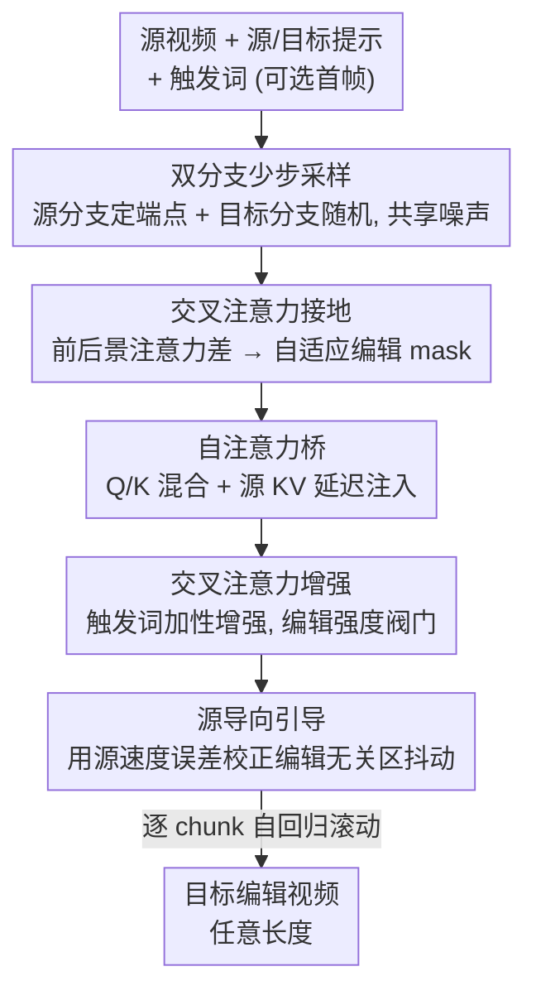

# StreamEdit: Training-Free Video Editing via Few-Step Streaming Video Generation

**会议**: ECCV 2026  
**arXiv**: [2605.21466](https://arxiv.org/abs/2605.21466)  
**代码**: [https://dsl-lab.github.io/StreamEdit/](https://dsl-lab.github.io/StreamEdit/)  
**领域**: 视频生成 / 视频编辑  
**关键词**: 视频编辑, 少步采样, 流式生成, 注意力操控, 免训练

## 一句话总结
StreamEdit 把免训练视频编辑从主流的「数据到数据」范式重新表述成「源条件下的噪声到目标」生成问题，直接嫁接到预训练的流式视频生成器（Self Forcing / LongLive）上，用双分支少步采样 + 自注意力桥 + 交叉注意力接地/增强 + 源导向引导，在 5-15 步内实现比现有方法更快、结构保持更好、编辑更可靠的任意长度视频编辑。

## 研究背景与动机
免训练视觉编辑近两年在图像、3D、视频上都做出了不错的效果，主流做法沿用一条「数据到数据」（data→data）的路线：要么是 inversion-based，先把源样本反演回噪声、再在目标条件下去噪，走 `源→噪声→目标` 的迂回路径；要么是 inversion-free，用带噪的辅助样本去近似 `源→目标` 的转移轨迹。可这两类方法在视频这种高维、复杂的数据上都很吃力——反演类会引入额外迭代和累积误差，复杂视频里编辑无关区域经常被扭曲（比如背景糊掉）；免反演类因为早期样本还紧贴源视频，可见的编辑往往要跑很多轮才浮现，而且它们的采样轨迹不规则，得用很小心翼翼的步长，遇到困难 case 又慢又不稳。总的来说，视频编辑一直被高算力开销和有限的编辑质量卡着。

与此同时，现代生成模型这几年的加速红利（一致性模型、rectified flow、分布匹配蒸馏 DMD）几乎全落在「噪声到数据」（noise→data）的生成范式上，让少步、高质量的推理成为可能；流式视频生成更是把这种少步能力延伸到了任意长度的自回归生成。但这些加速几乎没能迁移到编辑上，原因就在于「数据到数据」的管线和它自己那套迭代流程紧紧耦合，没法直接吃到少步采样的快感——你没法把一个为 `源→噪声→目标` 设计的流程塞进一个 5 步生成器里。

作者的切入角度是：视频编辑本质上就是一个「视频条件下的视频生成」问题，那就干脆把它当生成来做。**核心 idea：把免训练视频编辑重新表述成「源条件下的噪声→目标」生成——在预训练流式生成器上开一条与目标分支共享噪声的源分支做双分支少步采样，再用自注意力桥把源视频的结构、运动、背景先验注入目标生成，配合交叉注意力接地/增强和源导向引导，从而在保留少步高速的同时满足条件注入的需求。**

## 方法详解

### 整体框架
StreamEdit 建立在两个代表性的流式（chunk 级自回归）视频生成器 Self Forcing 和 LongLive 之上，全程免训练，只靠采样策略和注意力操控完成编辑。输入是源视频 + 源提示 + 目标提示 + 用户给的触发词（可选再给一张编辑好的首帧作视觉提示），输出是逐 chunk 生成的目标编辑视频。

整个方法有两条主线：**采样策略**和**注意力操控**。采样侧，作者把随机少步采样扩展成双分支——源分支固定为「常数干净样本 + 噪声」的定端点采样，目标分支则是标准的随机少步生成，两条分支共享同一噪声、逐步并行，源分支的中间态就成了可以同步注入目标的特征；采样侧还叠了一个源导向引导来压掉随机性带来的抖动。注意力侧，自注意力桥负责把源的结构/运动/背景注入目标，交叉注意力接地负责算出「哪块是要编辑的区域」的 mask（供桥和引导使用），交叉注意力增强则作为一个可调的「编辑强度阀门」。对于长视频，因为底座本身就是流式自回归的，方法天然支持任意长度，逐 chunk 滚动即可（Self Forcing 需配合 clip rolling，LongLive 靠短窗注意力 + sink token 可直接扩展）。

### 关键设计

**1. 双分支少步采样：让源信息与目标生成并行传播，共享同一噪声**

反演类方法算力高、反演不完美带来累积误差、背景保不住；免反演类要跑很多轮还慢且不稳。StreamEdit 干脆不走这两条老路，而是把编辑当成条件生成——用蒸馏模型天生的少步能力，开两条并行的采样分支。目标分支就是普通的随机少步生成，从纯噪声出发一步步预测干净样本 $z^{\text{tgt}}_{t_i}$；源分支则是「定端点」采样，它始终围绕同一个干净源样本 $x_0^{\text{src}}$ 做线性插值，因此源分支的中间态承载的是**没有漂移的源信息**。关键是两条分支在每一步都用**同一个随机噪声** $\epsilon_{t_i}$，这样源分支的中间特征可以在每个去噪步同步注入目标生成，也让后续的引导误差能在两分支间投影对齐。目标速度是带了自注意力桥和交叉注意力增强的「条件速度」 $v^*_\theta(x^{\text{tgt}}_{t_i}, t_i \mid x^{\text{src}}_{t_i})$。这一步只是搭起「每步都能注源条件」的骨架，真正怎么注、注多少由后面的桥和增强决定。

$$x^{\text{src}}_{t_i}=(1-t_i)x_0^{\text{src}}+t_i\epsilon_{t_i}, \quad x^{\text{tgt}}_{t_i}=(1-t_i)z^{\text{tgt}}_{t_i}+t_i\epsilon_{t_i}, \quad \epsilon_{t_i}\sim\mathcal{N}(0,I)$$

**2. 自注意力桥：靠 Q/K 混合和延迟的源 KV 注入，把结构、运动、背景一并搬进目标**

有了双分支还不够，得让源特征真正影响目标生成。作者在源、目标两分支的自注意力之间架了一座「桥」，分三件事做。其一是 **query 混合**做结构与运动保持：很多属性编辑要改物体外观但保住整体运动轨迹，而 query 编码的正是时空结构和运动线索，于是把源、目标的 self-attention query 按一个随时间变化的比例混合 $\tilde{Q}^{\text{tgt}}_{\text{SA}}=r_{t_i}Q^{\text{tgt}}_{\text{SA}}+(1-r_{t_i})Q^{\text{src}}_{\text{SA}}$，其中 $r_{t_i}=1-t_{i-1}^{\rho}$——早期去噪主要定语义，让源先验主导以给结构导向，后期再逐渐放手让目标适配（$\rho$ 控制保持强度）。其二是 **key 混合**做编辑有效性与一致性：光混 query 在 query-key 匹配弱时会不稳，于是把 key 也一起混合（并对前一帧 key 做类似混合以加强与历史的匹配）；又因为源和生成目标的背景天然相似，前帧 key 的混合只对前景区域做（用 $M_{\text{prev}}$ 掩码），背景保持目标自身的 key，这样编辑区能聚合相关信息、又不被无关区干扰。其三是 **源 KV 注入**做背景保持：即便混了 Q/K，精细背景细节仍不够，得把源的 K、V 显式拼进目标注意力；但如果全程注入会压住目标概念的形成（$t_{\text{inj}}=1$ 时编辑失败），所以只在**低噪声步**（去噪主要精修细节时）才注入，用 Iverson 括号 $[t<t^{\text{inj}}]$ 当开关，实验里 $t_{\text{inj}}$ 固定 0.5。

**3. 交叉注意力接地与增强：既产出编辑 mask，又提供可调的编辑强度阀门**

自注意力桥要的编辑区 mask 从哪来？作者不引入额外的分割模型，而是复用交叉注意力自己算。以往做法是把触发词的注意力图用固定阈值二值化，但那需要逐模型/逐样本调阈值。StreamEdit 改用**前景-背景注意力差**做自适应接地：对触发词组和其余词组分别取平均注意力，作差后过 Heaviside 阶跃函数得到 mask $M^{\phi}$。源侧 mask 在 $t=0$ 从干净源潜变量取（蒸馏模型能跨时间步保住空间结构），目标侧 mask 在 $t=t_{\text{inj}}$ 目标语义成形后取，二者并集 $M=\cup_\phi M^\phi$ 同时覆盖「源里要被改的区域」和「目标里要编辑的区域」。增强则是给编辑强度一个可控阀门：乘性增强会过度极化 token 表达、负分还可能误伤触发概念，所以作者对编辑区内的触发词做**加性增强**——等价于在 softmax 前给分数加上 $\ln w_{p,q}$，触发词且在 mask 内时 $w=\omega$、否则为 1。工程上因为 FlashAttention 不给显式分数图，作者用「分子/分母各跑一次 FlashAttention 再相除」的技巧实现，不破坏计算复杂度。这样编辑强度可调、背景又基本不受影响。

$$A^{\text{tgt}}_{\text{CA}}(p,q)=\frac{\exp\!\left(S(p,q)+\ln w_{p,q}\right)}{\sum_{j}\exp\!\left(S(j,q)+\ln w_{j,q}\right)}, \quad w_{p,q}=\begin{cases}\omega, & p\in\mathcal{T}\ \text{且}\ M(q)=1\\ 1, & \text{其他}\end{cases}$$

**4. 源导向引导：把源分支相对真值的速度误差投影到目标，压掉编辑无关区的抖动**

随机采样带来编辑灵活性，但也让源分支变成「源视频 + 随机噪声」的混合轨迹，注入了带噪的源条件，即使有自注意力桥，编辑无关区（如背景）仍会抖。作者发现这个误差是可观测的——就是**预测的源速度**和它对应线性插值的**真值速度**之差 $g_{t_i}=v^{\text{gt}}_{t_i}-v^{\text{src}}_{t_i}$，其中 $v^{\text{gt}}_{t_i}=\epsilon_{t_i}-x_0^{\text{src}}$。因为两分支共享同一噪声，源分支这份误差可以投影到目标分支去校正。但编辑相关区里保留随机性反而有利于编辑效果，所以校正主要施加在编辑无关区，用一个软 mask 系数（AMN，即对分支速度差取通道均值绝对值再做 min-max 归一化）来加权。这一步类似 classifier-free guidance，但导向的是「源」而非条件，专门用来把背景等无关区拉回和源视频一致。

$$\tilde{v}^{\text{tgt}}_{t_i}=v^{\text{tgt}}_{t_i}+\text{AMN}(v^{\text{tgt}}_{t_i}-v^{\text{src}}_{t_i})\odot g_{t_i}, \quad z^{\text{tgt}}_{t_{i-1}}=x^{\text{tgt}}_{t_i}-t_i\tilde{v}^{\text{tgt}}_{t_i}$$

**5. 视觉提示：把用户给的首帧当作「前一个 chunk」，给文本编辑补上细粒度控制**

纯文本编辑缺细粒度视觉控制，结果高度依赖难以微调的自然语言提示和模型的理解，成功率没保障。作者利用流式生成「以前帧为条件」的天然机制，把用户提供的目标首帧当成生成视频的**前一个 chunk**，从而把用户在这一帧上做好的精细编辑效果顺势带入后续目标生成。这个设计还有额外好处：可以直接借力现成的图像编辑模型（论文里用 Qwen-Image-Edit）先编好首帧再作视觉提示，让困难编辑（如把人变成瓷偶）更容易成功。实现上只需多跑一次视频生成模型的前向来提供视觉提示——Self Forcing 把条件图的 KV 直接塞到 KV cache 首位，LongLive 则把 attention sink 用它填三遍来强化视觉条件。

### 一个完整示例
以「把金毛犬变成黑白边牧」为例走一遍单 chunk 流程：先前向源干净数据，用交叉注意力接地拿到源 mask $M^{\text{src}}_{\text{curr}}$ 并缓存源 KV 作为下一 chunk 的历史条件；进入去噪循环，从 $t_N$ 到 $t_1$ 每步采同一噪声 $\epsilon_{t_i}$，源分支按定端点插值、目标分支按当前预测插值，经自注意力桥完成 Q/K 混合（早期源先验主导给结构、后期放手）；到 $t=t_{\text{inj}}=0.5$ 时目标语义已成形，抽出目标 mask $M^{\text{tgt}}_{\text{curr}}$ 与源 mask 求并集 $M_{\text{curr}}$，从这步起源 KV 开始注入以精修背景细节；每步再经交叉注意力增强推高「边牧」这个触发词的表达、经源导向引导把背景抖动拉回源视频；循环结束得到 $z^{\text{tgt}}_{0}$，最后前向目标干净数据缓存目标 KV 和 mask 供下一 chunk 使用。整个过程的注意力 mask 经历 $M^{\text{src}}_{\text{curr}}\to M_{\text{curr}}\to M_{\text{prev}}$ 三次更新，且不额外增加 NFE。

### 损失函数 / 训练策略
StreamEdit 全程**免训练**，没有任何损失函数或参数更新，纯靠推理时的采样与注意力操控。关键推理设置：CFG 关闭，函数评估数 NFE = 2×(steps+1)（对应双样本生成）；标准对比用 15 步、长视频流式编辑用 5 步；$\rho=2$、$t_{\text{inj}}=0.5$ 全程固定，$\omega$ 在 Self Forcing 下取 4、其余设置取 2；自注意力桥和交叉注意力增强作用于全部注意力层，接地在 30 层交叉注意力的前 20 层做；全部实验单卡 A100。

## 实验关键数据

### 主实验
在 FiVE-Bench（100 段视频、420 对编辑提示、6 种编辑类型）上对比，指标涵盖结构/背景保持、文本对齐、图像质量、时序一致性、VLM 编辑成功率（FiVE-Acc），及每帧耗时。

| 方法 | Struc.Dist×10³↓ | PSNR↑ | LPIPS×10³↓ | SSIM×10²↑ | CLIPS.edit↑ | FiVE-Acc↑ | Time/帧(s)↓ |
|------|------|------|------|------|------|------|------|
| TokenFlow | 35.62 | 19.06 | 263.61 | 72.51 | 21.15 | 27.43 | 8.04 |
| Wan-Edit | 12.53 | 25.57 | 94.61 | 82.55 | 21.23 | 46.97 | 3.07 |
| UniEdit-Flow | 18.31 | 24.43 | 223.07 | 78.60 | 20.92 | 50.10 | 1.11 |
| **Ours (SF)** | **10.27** | **28.47** | **49.84** | **87.52** | 21.73 | 51.94 | **0.60** |
| **Ours (LL)** | 15.77 | 25.43 | 65.35 | 84.15 | **22.13** | 55.04 | 0.69 |
| **Ours (LL)§** | 15.69 | 25.74 | 67.04 | 84.29 | 22.11 | **61.19** | 0.76 |

（§ 表示用预先编辑好的首帧作视觉提示；SF=Self Forcing，LL=LongLive）StreamEdit 在结构距离、PSNR、LPIPS、SSIM 等背景/结构保持指标上大幅领先，文本对齐和编辑成功率也居前，而每帧耗时最低（0.6s，最快 5 步下 <0.32s/帧）。Self Forcing 底座偏结构/上下文保持，LongLive 底座编辑效果更强，给用户不同偏好留了选择。

### 消融实验
主组件消融（在 Self Forcing 上）：源导向引导 S.O.G. 与自注意力桥 S.A.B.。

| 配置 | PSNR↑ | LPIPS×10³↓ | SSIM×10²↑ | FiVE-Acc↑ | 说明 |
|------|------|------|------|------|------|
| Full (SF) | 28.47 | 49.84 | 87.52 | 51.94 | 完整模型 |
| w/o S.O.G. | 21.86 | 122.43 | 72.40 | 53.58 | 去引导：编辑自由度略升，但背景与源对齐明显变差 |
| w/o S.A.B. | 13.42 | 381.19 | 47.70 | 67.74 | 去桥：源约束几乎失效，输出漂向目标提示、与源视频基本无关 |

### 关键发现
- 自注意力桥是注入源条件的核心机制：去掉它 LPIPS 从 49.84 暴涨到 381.19、PSNR 从 28.47 跌到 13.42，生成几乎不受源约束——虽然 FiVE-Acc「更高」（67.74），但那是因为它自由漂向目标、本质已不是「编辑源视频」了，属于典型的成功率与保真度错位。
- 源导向引导专治随机采样带来的编辑无关区抖动：去掉后背景保持（PSNR/LPIPS/SSIM）全面掉，印证它把背景拉回源视频的作用。
- 两个超参是清晰的控制旋钮：$\rho$ 越小结构越保真但编辑越弱（$\rho=1$ 时改不出 jeep），越大编辑越灵活（$\rho=3$ 成功）；$\omega$ 越大编辑强度越高（大象越变越蓝）。$\rho$、$\omega$ 扫描出干净的 trade-off 曲线，说明可控性和鲁棒性都好。
- 交叉注意力增强（附录 B.1）是「非必需但好用的阀门」：去掉它方法仍能成功编辑并保持高背景保真，加上后背景保持几乎无损、FiVE-Acc 却显著提升，说明它以极小的无关区代价换来编辑成功率。

## 亮点与洞察
- 范式转换是最大亮点：把编辑从 data→data 重新表述为「源条件下的 noise→data」，一句话打通了少步生成加速红利与编辑任务之间的壁垒，让 5-15 步编辑成为可能——这是「换个视角，整条路重新走」的典型。
- 双分支共享噪声是个巧妙的连接件：源、目标共用同一 $\epsilon$，既让源特征能逐步注入，又让源分支相对真值的速度误差可以直接投影到目标分支做校正，一个设计同时服务了「条件注入」和「引导校正」两件事。
- 免额外模型的自适应接地：用前景-背景交叉注意力差 + Heaviside 得 mask，绕开了固定阈值需逐模型调参的老问题，也不引入分割网络，mask 更新三次却零额外 NFE，很省。
- 用 FlashAttention 分子/分母两次前向实现加性交叉注意力增强，避免退回普通矩阵乘法拖慢速度——这是可迁移的工程 trick，任何想在 FlashAttention 上做 score 级操控的工作都能借。
- 视觉提示把「首帧当前一个 chunk」，几乎零成本地接入了现成图像编辑模型的能力，把难编辑（人变瓷偶）的成功率显著拉高，是流式自回归结构的巧用。

## 局限与展望
- 作者承认将进一步提升可扩展性和实时能力，并把框架扩展到更广的视频编辑场景。
- 方法强依赖预训练流式生成器（Self Forcing / LongLive）的质量与其 832×480 分辨率，编辑要先 resize 到该分辨率再还原，可能损失高分辨率细节。
- 需要用户手动提供触发词（源/目标），接地质量与触发词选取相关；纯文本编辑在困难 case 上仍需视觉提示兜底，说明文本可控性本身有天花板。
- 多个超参（$\rho$、$\omega$、$t_{\text{inj}}$）虽给了默认值，但不同底座（SF 用 $\omega=4$、LL 用 $\omega=2$）需分别设，跨模型迁移仍需一点调参。
- 评测主要在 FiVE-Bench 六类编辑上做，长视频对比用的是 20 人用户研究给排名而非硬指标，长视频的定量证据偏弱。

## 相关工作与启发
- **vs UniEdit-Flow / FlowEdit（inversion-free 流编辑）**: 它们仍在 data→data 框架内用带噪样本近似 `源→目标` 转移，早期样本贴源、可见编辑要多轮才现且轨迹不规则需小步长；StreamEdit 换成 noise→target 生成，少步内目标概念快速成形，复杂 case 更稳更快。
- **vs 反演类（Null-text / RF-Inversion 等）**: 它们走 `源→噪声→目标` 需额外迭代且反演不完美带累积误差、背景易崩；StreamEdit 用定端点源分支 + 源 KV 注入直接保背景，PSNR/LPIPS 大幅更优。
- **vs MasaCtrl / FateZero（注意力操控编辑）**: 同样操控注意力，但它们在传统多步扩散上做；StreamEdit 把注意力桥、接地、增强系统性地适配到少步流式生成器上，并新增了随时间变化的 Q/K 混合比与延迟源 KV 注入这些为少步范式量身定制的机制。
- **vs Self Forcing / LongLive（流式视频生成底座）**: 这两者本是生成模型，StreamEdit 不改架构、免训练地把它们「借」来做编辑，等于给流式生成器解锁了一个新用途，也验证了「编辑即条件生成」的可行性。
- **vs StreamV2V / AdaFlow（长视频编辑）**: 在 470+ 帧长视频用户研究中，StreamEdit（LongLive，5 步）在整体质量、背景保持、编辑保真三项排名均第一。

## 评分
- 新颖性: ⭐⭐⭐⭐⭐ 把编辑重构为源条件 noise→data 生成、嫁接流式少步生成器，是范式级的重新表述而非模块微调。
- 实验充分度: ⭐⭐⭐⭐ FiVE-Bench 多指标 + 两套底座 + 详尽消融/超参分析很扎实，长视频只有用户研究排名稍弱。
- 写作质量: ⭐⭐⭐⭐ 逻辑链清晰、图文对照到位、附录给了完整算法；符号密集处稍需对照 Fig.2 才好读。
- 价值: ⭐⭐⭐⭐⭐ 首次把少步生成加速红利真正迁移到视频编辑，0.6s/帧、支持任意长度，兼具效率与质量，实用性强。

<!-- RELATED:START -->

## 相关论文

- [\[CVPR 2026\] SWIFT: Sliding Window Reconstruction for Few-Shot Training-Free Generated Video Attribution](../../CVPR2026/video_generation/swift_sliding_window_reconstruction_for_few-shot_training-free_generated_video_a.md)
- [\[ECCV 2026\] LiveEdit: Towards Real-Time Diffusion-Based Streaming Video Editing](liveedit_towards_real-time_diffusion-based_streaming_video_editing.md)
- [\[CVPR 2026\] FlowDirector: Training-Free Flow Steering for Precise Text-to-Video Editing](../../CVPR2026/video_generation/flowdirector_training-free_flow_steering_for_precise_text-to-video_editing.md)
- [\[ICML 2026\] SGMD: Score Gradient Matching Distillation for Few-Step Video Diffusion](../../ICML2026/video_generation/sgmd_score_gradient_matching_distillation_for_few-step_video_diffusion_distillat.md)
- [\[CVPR 2025\] FlashMotion: Few-Step Controllable Video Generation with Trajectory Guidance](../../CVPR2025/video_generation/flashmotion_few-step_controllable_video_generation_with_trajectory_guidance.md)

<!-- RELATED:END -->
