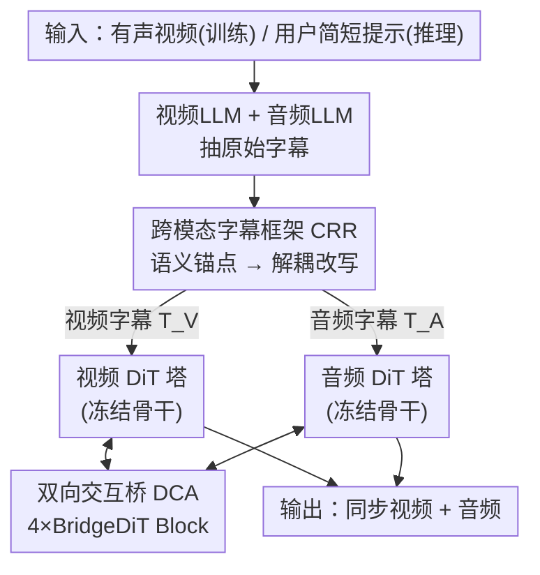

# Taming Text-to-Sounding Video Generation via Advanced Modality Condition and Interaction

**会议**: ECCV 2026  
**arXiv**: [2510.03117](https://arxiv.org/abs/2510.03117)  
**代码**: [https://bridgedit-t2sv.github.io/](https://bridgedit-t2sv.github.io/)  
**领域**: 视频生成 / 音视频联合生成 / 扩散模型  
**关键词**: 文本到有声视频, 双塔扩散, 交叉注意力, 字幕解耦, 模态干扰

## 一句话总结
针对「从文本同时生成画面 + 同步音效」（T2SV）任务，本文用一个双 agent 的字幕改写框架（CRR）给视频塔和音频塔分别喂互不干扰的模态纯净字幕，再用双塔扩散 BridgeDiT 以双向交叉注意力（DCA）在两塔之间搭桥交换特征，在三个基准上多数指标取得 SOTA。

## 研究背景与动机
人的感知天生是多感官的，画面和声音紧密耦合，所以从文本一次性生成「带同步音效的视频」（Text-to-Sounding-Video, T2SV）被看作是走向世界模型的关键一步。文本到视频（T2V，如 Wan、HunyuanVideo）和文本到音频（T2A，如 Stable Audio Open、AudioLDM）各自都已相当成熟，社区自然把注意力转向更难的联合生成。早期做法要么两个模态各自独立生成、根本谈不上时序同步；要么用级联管线（T→V→A 或 T→A→V），但第二阶段模型只在真值上训练，无法纠正第一阶段的错误，反而会把误差放大累积。于是研究重心转向联合生成，其中单塔范式从零学习联合分布、极度依赖海量配对数据且难优化，而**双塔范式**——复用预训练好的 T2V / T2A 骨干、只训练一个轻量交互模块——成了主流。

但双塔范式仍卡在两个根本问题上。第一是条件问题：以往双塔方法给两个塔喂**同一份共享字幕**（$T_V = T_A$），可两个骨干分别是在不同模态的文本上预训练的，共享字幕会造成语义干扰——画面里的颜色描述对音频模型是噪声，音色描述对视频模型是干扰；更麻烦的是训练用的是密集详尽的字幕、推理时用户只给一句简短提示，这个分布鸿沟会显著拖垮生成质量。第二是交互问题：交互模块负责在两塔间交换信息以达成同步，但它到底该怎么设计——全注意力？单向条件？加性融合？——一直没有系统结论。值得注意的是，近期 LTX-2、Ovi 等统一字幕方案主要面向语音/对话（唇音耦合天然适合联合文本表示），而本文聚焦的是拟音（foley）和音效场景，模态干扰问题在这里更突出。

本文的切入角度是把这两个问题分开各个击破：条件问题靠「先把两模态字幕交叉验证、蒸馏出可信的语义锚点，再据此改写出两份互不污染的字幕」，交互问题靠「在相同条件下系统比较各种融合策略、找出真正最优的那个」。**核心 idea：用双 agent 的 Cross-Referential Rewriter 生成模态纯净、训练-推理分布一致的解耦字幕（$T_V \neq T_A$），并用双向对称的 Dual Cross-Attention 在冻结的双塔之间搭一座轻量的「流形之桥」，既保住各自特征空间、又实现双向同步。**

## 方法详解

### 整体框架
系统由两块解耦的组件构成。前端是 **CRR 字幕框架**（Cross-Referential Rewriter），它是一条数据/提示侧的双 agent 流水线：训练时输入一段有声视频，分别用视频 LLM 和音频 LLM 抽出各自的原始字幕，经语义核对器交叉参照、过滤幻觉后得到结构化的「语义锚点」，再由跨模态改写器据此生成两份模态纯净的密集字幕 $T_V$（喂视频塔）和 $T_A$（喂音频塔）；推理时同一条流水线把用户的简短提示扩写成匹配训练分布的密集字幕。后端是生成骨干 **BridgeDiT**：一个视频 DiT 塔（Wan 2.1 1.3B）和一个音频 DiT 塔（Stable Audio Open）并行运行、大部分参数冻结，在若干指定层之间插入 4 个轻量的 BridgeDiT Block，每个 Block 用 **Dual Cross-Attention（DCA）** 做双向特征交换后把更新回的特征送回两塔。整条链路输入是文本、输出是 5.4 秒同步的视频 + 44.1kHz 音频。

### 关键设计

**1. 语义锚点：给字幕解耦装上「防幻觉」的接地闸门**

痛点直白：只要用一个 LLM 直接为两个模态分别写字幕，音频 LLM 会频繁幻想出画面里根本没有的声音——比如给「工人打铁」的场景，音频 LLM 可能输出「有敲击声，有点像石头的声音」，完全没认出真实声源。问题的本质不在「生成字幕」本身，而在两份模态字幕之间缺一个接地（grounding）机制。CRR 的解法是把字幕生成拆成两个 agent，中间卡一个**结构化瓶颈**：语义核对器 $\mathcal{F}_{sc}$ 把输入蒸馏成语义锚点 $\mathcal{A}$——一组经过核验的属性，含核心实体、环境、视觉动作及其对应的声学事件，例如 `{Entity: worker, Env: workshop, Action: hammer strike, Sound: metallic clang}`；训练时它用可靠的视觉描述当参照去校正、过滤音频描述，只把语义一致的事件留进 $\mathcal{A}$。随后跨模态改写器 $\mathcal{F}_{cr}$ **严格只依据 $\mathcal{A}$** 扩写出两份密集字幕：

$$\mathcal{A} = \mathcal{F}_{sc}(\mathcal{I}), \quad T_V, T_A = \mathcal{F}_{cr}(\mathcal{A})$$

由于 $\mathcal{A}$ 只保留了接地的语义、丢掉了模态特有的噪声，改写器**在结构上就不可能**引入未核验的事件——模态纯净是被架构保证的，而不是靠祈祷 LLM 听话。消融显示，去掉这个锚点瓶颈、让单个 LLM 一步改写（Direct Rewrite），音频质量 FAD 从 5.34 恶化到 15.74，这正说明锚点不是提示工程小把戏，而是真正起作用的接地机制。

**2. 训练-推理提示扩写：用同一条流水线抹平分布鸿沟**

痛点是模型在密集详尽的字幕上训练，用户推理时却只给「一个工人在打铁」这种极简提示，两者分布差距巨大，直接喂进去生成质量会崩。本文的巧妙之处在于**推理和训练复用同一条 CRR 流水线，只换输入 $\mathcal{I}$**：训练时 $\mathcal{I}$ 是两份原始字幕、走「交叉参照」逻辑；推理时 $\mathcal{I}$ 就是用户提示、语义核对器切换到「上下文推断」模式——从简短提示推断出隐含的视觉场景与声学事件（「工人打铁」→ 上面那组锚点），再由改写器扩写成和训练字幕同等密度的解耦 $T_V$、$T_A$。这样既补齐了用户提示缺失的细节、又让推理输入落回训练分布，无需用户做任何复杂的提示工程。消融里去掉这步提示扩写造成了最严重的退化（FVD 从 765 飙到 1463、FAD 到 20.84），坐实了「简短输入与密集字幕的分布鸿沟是生成质量的头号瓶颈」。

**3. 双向交叉注意力 DCA：在两个不相交流形之间搭一座轻量桥**

这是交互模块的核心。难点在于两个塔分别在各自模态上预训练、且基本冻结，特征落在两个**不相交的流形** $\mathcal{M}_V$ 和 $\mathcal{M}_A$ 上——这跟从零训练（如 MMDiT，所有模态收敛到同一空间）本质不同。DCA 用两条对称的交叉注意力流更新视频隐 $L_V$ 和音频隐 $L_A$：以 A2V 方向为例，视频隐做 query、音频隐提供 key/value，注意力结果残差加回视频隐（V2A 方向完全对称）：

$$L'_V = \text{Attention}(Q_V, K_A, V_A) + L_V$$

为什么在「冻结骨干双塔」设定下 DCA 是对的选择？两个理由：其一，DCA **保住了各塔的特征空间**——不像全注意力把两模态拼成一条序列、在同一个注意力矩阵里混合了模态内和模态间依赖，DCA 让两条流保持分离，每个塔只接收有针对性的跨模态线索；其二，这种分离带来**更容易的优化目标**——它不是拿有限的可训练参数硬把 $\mathcal{M}_V$、$\mathcal{M}_A$ 揉进一个共享空间，而是在两个已确立的流形之间学一座轻量的桥（$\mathcal{M}_V \leftrightarrow \mathcal{M}_A$），在给定参数预算下这是一个根本上更简单的任务，因而训练更稳、同步更强。相比之下，单向变体（V2A 或 A2V-CrossAttn）只喂一个方向，会出现「改善了一个模态却把另一个晾着」的不对称——A2V 拉低了 FVD 却牺牲了同步（AV-Align 只有 0.236），DCA 靠双向交换让两个模态同时受益。此外 BridgeDiT Block 放在**早到中层**（视频 [3,7,11,15]、音频 [2,5,8,11]）效果最好，因为这些层兼具早层的时空细节和中层的语义抽象，只靠末层的高度抽象特征不足以支撑 T2SV 需要的精确对齐。

### 损失函数 / 训练策略
总损失是两塔损失之和 $\mathcal{L} = \mathcal{L}_{\text{audio}} + \mathcal{L}_{\text{video}}$。音频塔用 v-prediction 扩散损失（连续时间步 $t_A \in [0,1]$，信噪缩放 $\alpha(t_A)=\cos(t_A\pi/2)$、$\sigma(t_A)=\sin(t_A\pi/2)$，预测目标 $\alpha(t_A)\epsilon_A - \sigma(t_A)\mathbf{x}_A$）；视频塔用 flow matching 损失（预测向量场 $\epsilon_V - \mathbf{x}_V$，视频时间步定义为 $t_V = 1000 \cdot t_A$ 与音频对齐）。骨干大部分冻结，只训练两塔各自的最后 5 个 block + 4 个 BridgeDiT Block；每个数据集单独训练，AVSync15 上 4 卡 H100 约 8 小时、15000 步。推理时视频和音频各用独立的 CFG 引导尺度（均为 6.0）分别控制。

## 实验关键数据

### 主实验
在 AVSync15 上，BridgeDiT 在视频质量、音频质量、音频-文本对齐、时序同步上多数指标取得最好或次好。下表对比几个代表性基线（↓越低越好、↑越高越好）：

| 方法 | 范式 | FVD↓ | FAD↓ | KL↓ | CLAP↑ | AV-Align↑ |
|------|------|------|------|------|-------|-----------|
| Wan + MMAudio | T→V→A 级联 | 828.33 | 7.98 | 1.40 | 34.64 | 0.243 |
| JointDiT | T→I→VA | 992.71 | 6.51 | 1.77 | 30.34 | 0.156 |
| JavisDiT | T→VA 联合 | 878.70 | 13.48 | 3.50 | 22.99 | 0.158 |
| CoDi | T→VA 联合 | 1387.14 | 16.56 | 5.24 | 17.94 | 0.081 |
| **BridgeDiT (ours)** | T→VA 联合 | **765.74** | **5.34** | **1.30** | **35.95** | **0.275** |

在 VGGSound-SS 和 Landscape 上同样领先（如 Landscape：FVD 628.07 / FAD 4.78 / AV-Align 0.258，均为最佳）。20 人用户研究里 BridgeDiT 在视频质量、音频质量、文本对齐、同步、总体 5 个维度全部第一（Overall 3.34，级联的 Wan+MMAudio 次之 3.06）。作者也诚实地指出两个小例外：CLIPSIM（28.52）略低于 JointDiT（29.94），归因于后者更强的 T2I 骨干 Qwen-Image；VA-IB（34.59）被 SeeingHearing（35.87）超过，因为后者推理时直接用 ImageBind 当引导、专门优化了这个指标——而它并未被人类评审偏好，反过来印证「自动指标不完全等于感知质量」。

### 消融实验

字幕策略消融（AVSync15）：

| 字幕策略 | FVD↓ | FAD↓ | CLAP↑ | AV-Align↑ | 说明 |
|----------|------|------|-------|-----------|------|
| 共享·仅视频字幕 $T_V$ | 788.65 | 16.46 | 9.67 | 0.176 | 音频塔缺声学细节，音频对齐差 |
| 共享·音视频合并字幕 $T_{AV}$ | 1362.83 | 13.75 | 26.37 | 0.185 | 语义干扰，视频质量崩 |
| 解耦·原始 LLM 字幕(w/o CRR) | 924.36 | 19.42 | 8.43 | 0.161 | 幻觉+跨模态冲突，最差解耦 |
| 解耦·直接改写(w/o 语义锚点) | 787.32 | 15.74 | 27.34 | 0.224 | 无锚点瓶颈，音频与同步明显掉 |
| **CRR (ours)** | **765.74** | **5.34** | **35.95** | **0.275** | 完整框架 |
| CRR·去掉提示扩写(推理) | 1463.81 | 20.84 | 22.45 | 0.155 | 分布鸿沟未补，退化最严重 |

融合机制消融（AVSync15）：

| 融合方式 | FVD↓ | FAD↓ | CLAP↑ | VA-IB↑ | AV-Align↑ |
|----------|------|------|-------|--------|-----------|
| No-Fusion | 828.33 | 11.90 | 30.78 | 26.22 | 0.205 |
| Full-Fusion（全注意力） | 781.03 | 5.62 | 32.28 | 34.14 | 0.253 |
| Additive-Fusion（加性） | 772.23 | 5.72 | 34.77 | 28.34 | 0.258 |
| V2A-CrossAttn（单向） | 813.02 | 6.21 | 35.85 | 34.20 | 0.268 |
| A2V-CrossAttn（单向） | 746.37 | 5.91 | 31.25 | 31.54 | 0.236 |
| **DCA (ours)** | 765.74 | **5.34** | **35.95** | **34.59** | **0.275** |

### 关键发现
- **两个组件各自都是必需的**：去掉提示扩写造成 FVD 从 765 飙到 1463（最大退化），说明训练-推理分布鸿沟是头号瓶颈；共享字幕（无论只用视频还是合并音视频）都会因缺信息或语义干扰而崩，坐实解耦条件的必要性。
- **语义锚点不是提示工程小把戏**：Direct Rewrite（去掉锚点瓶颈）音频 FAD 15.74 vs 完整 CRR 的 5.34，差距巨大，证明结构化锚点是真正阻止改写器引入幻觉事件的接地机制。
- **DCA 全面胜过全注意力**：作者归因于冻结骨干约束——全注意力试图把两个不相交流形硬揉进共享空间、参数预算下优化困难（训练曲线不稳），DCA 只学一座轻量桥、任务本质更简单，训练更稳、同步全程领先。
- **单向融合有不对称副作用**：A2V 改善视频（FVD 746）却牺牲同步（AV-Align 0.236），V2A 反之；只有双向 DCA 让两模态同时受益。
- **交互层位置敏感**：早到中层（Uniform Early Bias）最优（VA-IB 34.59 / AV-Align 0.275），全放末层显著退化（VA-IB 仅 19.32），因为精确对齐既需要早层时空细节也需要中层语义。
- **提升源于方法而非规模**：把 CRR 的 72B LLM 换成 7B 仍然有效（FAD 8.26、AV-Align 0.258），且换骨干（SANA+AudioLDM）加上 DCA 后每个指标都改善，说明泛化性来自设计本身。

## 亮点与洞察
- **把「防幻觉」做进架构而非提示**：语义锚点作为结构化瓶颈，让改写器物理上无法编造未核验的声音——这是一种「用信息瓶颈保证约束」的思路，比在 prompt 里写「不要幻想声音」可靠得多，可迁移到任何「多源信息需交叉验证再生成」的场景。
- **训练与推理复用同一条字幕流水线**：只换输入、把「交叉参照」切成「上下文推断」，就同时解决了字幕解耦和提示扩写两件事，工程上极简却直击分布鸿沟这个最大痛点。
- **对融合策略的系统性实证**：论文没有只抛出 DCA，而是在完全相同条件下把全注意力/加性/单向/双向摆到一张表上比，并用「冻结骨干下是搭桥而非合并流形」这个流形视角解释清楚为什么 DCA 赢——这个「不合并、只搭桥」的洞见对所有基于预训练骨干拼接的多塔架构都有启发。
- **诚实对待自动指标**：主动点出 CLIPSIM、VA-IB 两处落后的具体原因（更强 T2I 骨干、对手直接优化该指标），并用用户研究交叉验证，避免了「刷指标」的误导。

## 局限与展望
- 评测只用了相对小规模基准（最多约 5K 视频），可能无法充分覆盖真实世界声学环境的多样性。
- 目前**不支持语音和音乐**生成——扩展到这些模态受限于开源预训练模型的稀缺，可能需要从零做资源密集的训练；而语音场景（唇音耦合）恰恰是本文有意避开、留给 LTX-2/Ovi 这类统一字幕方案的。
- 尚未探索后训练精炼（如 RLHF），作者认为用专门为音视频同步设计的奖励做 RLHF 是进一步对齐人类感知的有希望方向。
- 自己的观察：每个数据集单独训练、且 CRR 依赖 72B 级 LLM 离线扩写（虽可缓存复用），端到端部署成本不低；跨数据集泛化虽有 OOD 实验支撑，但基准域仍偏窄。

## 相关工作与启发
- **vs 级联管线（如 Wan+MMAudio 的 T→V→A）**: 他们分阶段生成，第二阶段只在真值上训练、无法纠正甚至放大第一阶段误差；本文联合生成从根上消除误差累积，主实验多数质量与对齐指标胜过所有级联基线。
- **vs 单塔联合生成（如 CoDi、MMDiffusion）**: 他们从零学习联合分布、极度依赖海量配对数据且难优化；本文走双塔、复用预训练骨干只训轻量交互模块，数据和优化都更友好。
- **vs 双塔 + 全注意力（JointDiT）**: 他们用全注意力把两模态拼一起做联合自注意力，在冻结骨干下相当于强行合并两个不相交流形、优化困难同步不稳；本文用 DCA 保住各塔空间、只搭双向桥，融合消融中同步指标全面领先。
- **vs 双塔 + 单向条件（SyncFlow 的 V2A、MTV 的 A2V）**: 他们只让信息单向流动（ControlNet 式），会出现改善一个模态却晾着另一个的不对称；本文双向对称交换让两模态同时受益。
- **vs 共享/统一字幕方案（CoDi 的视觉中心字幕、LTX-2/Ovi 的统一字幕）**: 前者天然缺声学细节，后者面向语音/对话（唇音耦合适合联合文本）；本文针对拟音/音效场景提出解耦字幕范式，用语义锚点保证模态纯净、避免干扰。

## 评分
- 新颖性: ⭐⭐⭐⭐ CRR 的语义锚点瓶颈和 DCA 的流形搭桥视角都有实质创新，虽单点技术（交叉注意力、字幕改写）非首创但组合与论证扎实。
- 实验充分度: ⭐⭐⭐⭐⭐ 三基准 + 用户研究 + 字幕/融合/层位/LLM 规模/跨骨干/OOD 多维消融，把每个论点都验到了。
- 写作质量: ⭐⭐⭐⭐⭐ 问题拆解清晰（C1/C2），对自动指标落后处诚实归因，流形视角把「为什么 DCA 赢」讲得很透。
- 价值: ⭐⭐⭐⭐ 为双塔 T2SV 系统在字幕设计与融合架构上提供了可直接复用的实证结论，对拟音/音效方向有明确指导意义。

<!-- RELATED:START -->

## 相关论文

- [\[ICLR 2026\] EchoMotion: Unified Human Video and Motion Generation via Dual-Modality Diffusion Transformer](../../ICLR2026/video_generation/echomotion_unified_human_video_and_motion_generation_via_dual-modality_diffusion.md)
- [\[CVPR 2025\] Video-ColBERT: Contextualized Late Interaction for Text-to-Video Retrieval](../../CVPR2025/video_generation/video-colbert_contextualized_late_interaction_for_text-to-video_retrieval.md)
- [\[AAAI 2026\] Mask2IV: Interaction-Centric Video Generation via Mask Trajectories](../../AAAI2026/video_generation/mask2iv_interaction-centric_video_generation_via_mask_trajectories.md)
- [\[CVPR 2025\] Taming Teacher Forcing for Masked Autoregressive Video Generation](../../CVPR2025/video_generation/taming_teacher_forcing_for_masked_autoregressive_video_generation.md)
- [\[CVPR 2026\] Pantheon360: Taming Digital Twin Generation via 3D-Aware 360° Video Diffusion](../../CVPR2026/video_generation/pantheon360_taming_digital_twin_generation_via_3d-aware_360_video_diffusion.md)

<!-- RELATED:END -->
