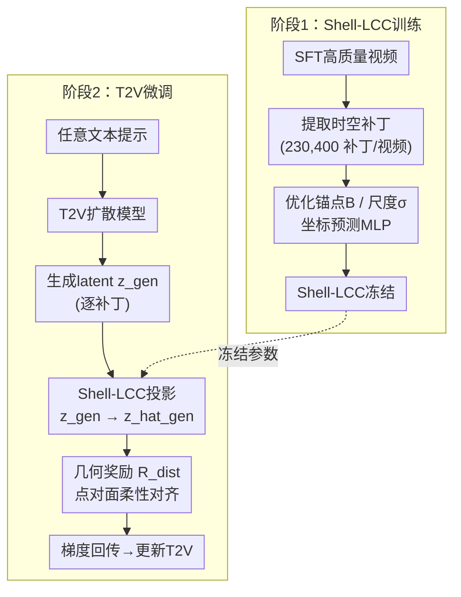

# Your Data Manifold is Secretly a Reward Model: Shell-LCC for Text-to-Video Generation

**会议**: ECCV 2026  
**arXiv**: [2606.30248](https://arxiv.org/abs/2606.30248)  
**代码**: [https://needylove.github.io/Shell-LCC/](https://needylove.github.io/Shell-LCC/) (有)  
**领域**: 视频生成  
**关键词**: 流形学习, 文本到视频生成, 奖励模型, 局部坐标编码, 扩散模型对齐

## 一句话总结

本文提出 Shell-LCC，通过将高质量 SFT 数据的补丁级潜在流形建模为各向同性的壳状高密度区域，从中提取稠密、可微且免费的几何奖励信号，在不引入外部奖励模型或人类标注的前提下显著改善 T2V 生成的低层失真（模糊、过度平滑、运动拖影等）。

## 研究背景与动机

现代文本到视频扩散模型虽能生成动态丰富的画面，但输出的视频仍普遍存在明显的低层失真——物体边缘模糊、过度平滑的"塑料感"纹理、运动拖影等，暴露了其人工合成的本质。为缓解这些问题，主流方案引入 RLHF/DPO 等对齐方法，利用人类偏好对或外部 VLM 奖励模型对生成结果进行整体评分和优化。然而这类方法代价高昂：人类偏好标注成本极大，基于 VLM 的奖励模型计算开销惊人，而且提供的监督信号是全局、整体的——对整个视频打一个分，对改善细粒度局部细节（如一片草叶的纹理、一缕头发的边缘锐度）几乎无能为力。

这个核心矛盾的根源在于：改善局部细节需要逐时空补丁的稠密质量信号，但获取这种稠密信号的传统路径（对每个补丁标注人类偏好）成本高到不现实。有趣的是，高质量 SFT 数据集本身就包含了"什么是好视频"的全部信息——关键是如何在不依赖外部标注的前提下提取出来。本文的前瞻性洞察在于：现代 Diffusion Transformer 将视频 latent 展平为时空补丁序列，如果能在补丁级别建模高质量 SFT 数据在 latent 空间中的流形结构，那么生成补丁到该流形的几何距离就是一个天然的、稠密的、完全可微的对齐信号。**核心 idea：高质量 SFT 数据的补丁级流形结构本身就是一种免费的奖励模型——通过 Shell-LCC 将该流形建模为各向同性的壳状高密度表面（而非传统的质心），生成补丁到流形表面的几何距离 R_dist = ||Σ^{-1/2}(z_gen − z_hat_gen)||² 就是稠密、可微、且无需外部标注的对齐奖励信号。**

## 方法详解

### 整体框架

本文方法分为两个阶段。第一阶段是 Shell-LCC 训练：从高质量 SFT 视频中提取海量时空补丁，训练 Shell-LCC 模型（包含锚点矩阵 B、可学习的各维度尺度向量 σ 以及一个坐标预测 MLP）来刻画补丁空间的流形结构。第二阶段是 T2V 模型微调：冻结训练好的 Shell-LCC，对 T2V 模型每一步生成的 latent 补丁，计算其到 Shell-LCC 流形表面的几何距离作为可微奖励，通过梯度回传直接优化 T2V 骨干网络。

### 关键设计

**1. Shell-LCC：从均值回归到壳状流形建模**

标准 LCC 通过局部锚点的凸组合来重建数据点，但其目标函数天然存在均值回归问题。论文通过方差分解证明，LCC 的优化同时受两项力的作用——重建误差将重建点拉向数据点，而局部方差项将重建点拉向锚点质心，最终的平衡位置是两者的折中，导致系统性地向锚点均值收缩。这种向均值收缩的直接后果是高频细节的丢失，这也是为什么直接拿 LCC 当正则项会产生过度平滑的结果。

在高维空间中，概率质量并不集中在均值附近。根据高斯环形定理（Gaussian Annulus Theorem），高维高斯分布的概率质量几乎全部集中在一个距均值 √d 的薄球壳上，而均值附近的概率质量随维度增加指数衰减。这意味着 latent 空间的数据流形本质上是空心的——真实样本聚集在一个薄壳上，而非质心附近。论文通过径向重建实验直观验证了这一点：从 LCC 重建点 ẑ 沿径向向外采样，解码出的视频从模糊（ẑ 处）逐步恢复清晰，超出一定范围后又产生失真，呈现清晰的三阶段变化。

Shell-LCC 为此提出两个关键改进。**各向同性校准**：引入可学习的维度尺度向量 σ（由 MLP 参数化），将残差映射为 z̃ = Σ^{-1/2}(z − ẑ)；这使得低方差但结构关键的维度不被高方差维度淹没，补丁流形在各个方向上被等权对待。**壳约束**：不把目标设为 ‖z̃‖ → 0（推向均值），而是 (‖z̃‖ − 1)²——推到一个半径为 1 的球壳上，与高维概率质量集中在壳上的现象一致。此外引入对数正则化 Σ log σ_i，防止 σ 通过无限制膨胀来虚假满足壳约束。

**2. 稠密可微几何奖励：逐补丁的流形对齐**

Shell-LCC 训练完毕后冻结。对于 T2V 模型生成的每个 latent 补丁 z_gen，先用 Shell-LCC 的坐标预测器求其局部线性重建 ẑ_gen（将 z_gen 投影到已学到的流形锚点张成的子空间），然后计算几何奖励 R_dist = ||Σ^{-1/2}(z_gen − ẑ_gen)||²。

这个奖励信号有三个关键特性。第一，它是完全可微的——因为 Σ、ẑ_gen 都是参数化的可微函数，R_dist 可直接通过 T2V 骨干网络回传梯度，无需 PPO/REINFORCE 等高方差强化学习算法。第二，它是点到面而非点到点的对齐——标准的 SFT 强制模型生成的每一帧与特定的 ground-truth 帧完全一致（刚性对齐），而 Shell-LCC 只要求生成补丁落在流形壳区域即可，模型在流形内部可自由变化，保留了生成的多样性。第三，它与文本提示解耦——优化 R_dist 不依赖配对的 text-video 数据，可以用任意 prompt 进行微调，在大模型 SFT 数据构建成为瓶颈时尤其有价值。

论文验证了该几何信号的可判别性：真实视频补丁与生成视频补丁的 R_dist 分布显著可分离，区分准确率达 91.4%，证实 R_dist 可作为衡量生成质量的代理信号。

### 损失函数 / 训练策略

Shell-LCC 的完整训练目标：

L_Shell-LCC = L_LCC + τ₁ · (‖z̃‖ − 1)² + τ₂ · Σᵢ log σᵢ

其中 L_LCC 是标准 LCC 目标（重建误差 + 局部性惩罚），壳约束 (‖z̃‖ − 1)² 推动补丁位于各向同性球壳上，log σᵢ 正则化防止尺度膨胀。默认 τ₁ = 1.0，τ₂ = 0.1。Shell-LCC 仅有约 2.5M 参数（仅为主 T2V 模型的 0.2%），训练开销极低。

T2V 微调阶段仅用几何奖励优化，不叠加基础扩散损失。采用早停策略：当 R_dist 降至初始值约 90% 时停止（约 200 步），实验发现过度优化会导致 mean regression 复发——R_dist 被压得过低时模型退回到几何均值附近，高频细节再次丢失。

## 实验关键数据

### 主实验

在 VBench 套件上的定量结果，对比私有 4.5B 模型和开源 Wan-T2V-1.3B 上的表现。Shell-LCC 在 Imaging Quality 上取得显著提升，且不牺牲全局美学或时间一致性，与 DPO 形成鲜明对比：

| 模型 | Aesthetic Quality | Imaging Quality | Motion Smoothness | Subject Consistency |
|------|:---:|:---:|:---:|:---:|
| Our SFT Baseline | 0.6724 | 0.7509 | 0.9891 | 0.9680 |
| + DPO | 0.6784 | 0.7397 | 0.9840 | 0.9637 |
| **+ Shell-LCC (Ours)** | **0.6735** | **0.7631** | **0.9900** | **0.9682** |
| Wan-T2V-1.3B | 0.6244 | 0.6629 | 0.9848 | 0.9654 |
| **+ Shell-LCC** | **0.6253** | **0.7037** | **0.9871** | **0.9715** |
| UltraWan-T2V-1.3B | 0.5744 | 0.6756 | 0.9657 | 0.9225 |
| **+ Shell-LCC** | **0.6299** | **0.7396** | **0.9918** | **0.9658** |

关键观察：DPO 小幅提升 Aesthetic Quality（+0.60%）但 Imaging Quality 下降 1.12%，Shell-LCC 则提升 Imaging Quality 1.22%～4.08% 且不影响其他指标，两者操作粒度正交、可互补。

### 消融实验

| 配置 | 指标 | 说明 |
|------|:---:|------|
| LCC (epoch 200) | Acc 92.7% | 标准 LCC，区分 GT/生成视频 |
| Shell-LCC (epoch 200) | Acc 91.4% | 壳约束 + 各向同性校准 |
| Recon Only (epoch 200) | Acc 83.2% | 去掉局部约束后退化 |
| Shell-LCC, M=2048 | Acc 90.8% | 减少锚点数量 |
| Shell-LCC, 100 videos | Acc 90.1% | 小数据量仍有效 |
| Shell-LCC, 1000 videos | Acc 91.4% | 已达全量 2500 视频性能 |

标准 LCC 的区分准确率略高于 Shell-LCC（92.7% vs 91.4%），但这恰恰印证了设计的必要性：LCC 被高方差维度支配，区分包含大量易判别的极端失真；Shell-LCC 通过各向同性校准公平对待所有维度，在牺牲少量二元分类精度的前提下获得了更真实的几何保真度。

### 关键发现

- **Shell-LCC 与 DPO 正交互补**：DPO 改善全局美学但损害局部细节，Shell-LCC 恰恰相反，两者可在同一模型中联合使用。
- **数据效率极高**：一个 5 秒视频贡献 230,400 个补丁，100 个视频即可达 90.1% 准确率，1000 视频已达全量性能。
- **壳状几何的实证确认**：径向重建实验从 LCC 重心中点出发向外采样，视频从模糊到清晰再到失真三阶段变化，直接可视化了外壳结构。
- **过度优化有风险**：约 200 步后继续优化会导致 mean regression 复发（Figure 3），需早停管控。

## 亮点与洞察

- **"你的数据流形就是奖励模型"**：这个表述直接呼应 DPO 论文标题，本体论上的优雅转移——原本需要昂贵标注的对齐信号，就藏在 SFT 数据的几何结构中。
- **高斯环形定理的工程落地**：将纯数学理论转化为具体的损失函数 (‖z̃‖ − 1)²，是理论驱动设计的典范。
- **学到而非固定的度量**：可学习的 σ 向量让模型自动识别哪些维度在流形结构中更重要，比人工设计的特征权重更灵活。
- **点到面对齐 vs 点到点对齐**：SFT 强制生成与 ground truth 完全一致（刚性），Shell-LCC 只要求落在流形壳上（柔性），保留了多样性且允许任意 prompt 微调。

## 局限与展望

- **早停依赖**：过度优化会重陷均值回归，需要人工监控早停，缺少自动停止机制。
- **联合 DPO 尚未实验验证**：论文仅提出 Shell-LCC 与 DPO 正交的猜想，没有给出联合训练的消融结果。
- **实验规模受限**：主要实验基于 4.5B 私有模型和 720p 分辨率，在 10B+ 级更大模型或更高分辨率上的表现有待验证。
- **理论假设的边界**：流形区分准确率 91.4% 而非 100%，说明存在分布重叠区域；流形的各向同性假设在极端复杂场景下可能不完全成立。

## 相关工作与启发

- **vs DPO/RLHF for T2V**：这些方法使用外部奖励模型或人类偏好提供全局监督；Shell-LCC 使用数据内在的几何结构，提供逐补丁级的稠密局部监督。两者操作粒度互补，可联合使用。
- **vs 标准 SFT**：SFT 强迫生成与 ground-truth 帧逐像素对齐（点对点），Shell-LCC 只要求生成落在流形壳上（点对面），更灵活且不依赖配对的 text-video 数据。
- **vs LCC / 传统流形学习**：标准 LCC 的凸局部重建天然导致均值回归；Shell-LCC 通过壳约束 + 各向同性校准解决了这一问题，使流形学习真正适用于高维生成模型的精细对齐。
- **标题致敬**："Your Data Manifold is Secretly a Reward Model" 是对 DPO 论文 "Your Language Model is Secretly a Reward Model" 的呼应，将"秘密奖励模型"的思想从 LLM 扩展到了流形几何视角。

## 评分

- 新颖性: ⭐⭐⭐⭐⭐ [将流形学习作为奖励信号用于 T2V 对齐的思路新颖，壳状流形建模是对 LCC 的理论性贡献]
- 实验充分度: ⭐⭐⭐⭐ [私有模型 + 开源模型 + 流形分析实验丰富，但缺乏 Shell-LCC + DPO 联合实验]
- 写作质量: ⭐⭐⭐⭐⭐ [从理论推导到工程实现的逻辑链条清晰，高斯环形定理的引入为设计提供了理论支撑]
- 价值: ⭐⭐⭐⭐⭐ [为解决 T2V 低层失真提供了一条无需外部标注的轻量化路径，正交于 DPO 系列方案，实用价值高]

<!-- RELATED:START -->

## 相关论文

- [\[ICLR 2026\] The Quest for Generalizable Motion Generation: Data, Model, and Evaluation](../../ICLR2026/video_generation/the_quest_for_generalizable_motion_generation_data_model_and_evaluation.md)
- [\[CVPR 2026\] Less is More: Data-Efficient Adaptation for Controllable Text-to-Video Generation](../../CVPR2026/video_generation/less_is_more_data-efficient_adaptation_for_controllable_text-to-video_generation.md)
- [\[ICCV 2025\] Prompt-A-Video: Prompt Your Video Diffusion Model via Preference-Aligned LLM](../../ICCV2025/video_generation/prompt-a-video_prompt_your_video_diffusion_model_via_preference-aligned_llm.md)
- [\[ICML 2025\] Data-Juicer Sandbox: A Feedback-Driven Suite for Multimodal Data-Model Co-development](../../ICML2025/video_generation/data-juicer_sandbox_a_feedback-driven_suite_for_multimodal_data-model_co-develop.md)
- [\[ECCV 2026\] PhyGDPO: Physics-Aware Groupwise Direct Preference Optimization for Physically Consistent Text-to-Video Generation](phygdpo_physics-aware_groupwise_direct_preference_optimization_for_physically_co.md)

<!-- RELATED:END -->
