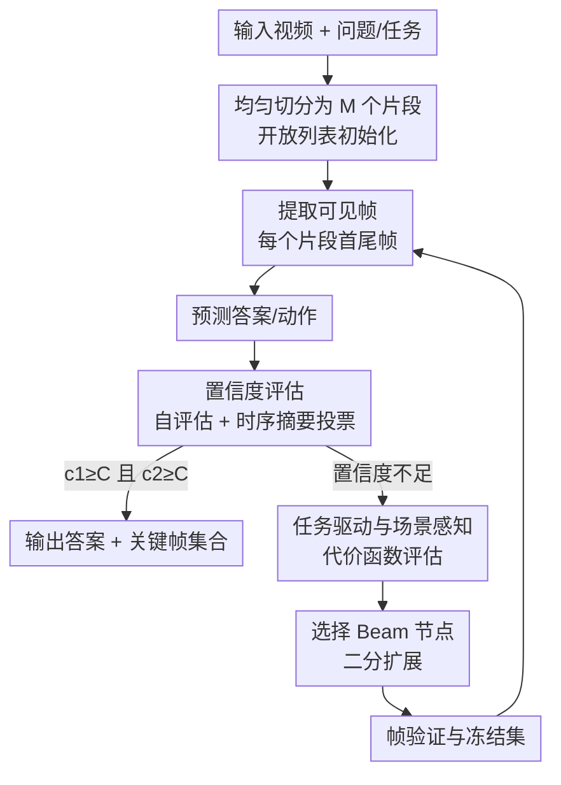

# Bridging VideoQA and Video-Guided Agentic Tasks via Generalized Keyframe Extraction

**会议**: ECCV 2026  
**arXiv**: [2606.29445](https://arxiv.org/abs/2606.29445)  
**项目**: [https://vg-gui-tasker.github.io/](https://vg-gui-tasker.github.io/)  
**代码**: [https://github.com/VG-GUI-TASKER/VG-GUI-TASKER](https://github.com/VG-GUI-TASKER/VG-GUI-TASKER) (有)  
**领域**: 视频理解  
**关键词**: 关键帧提取, 视频问答, GUI Agent, 图搜索, 多模态大语言模型  

## 一句话总结
本文提出 TASKER，一种将关键帧提取形式化为图搜索问题的通用算法——MLLM 同时评估任务相关性（缺什么信息）和场景动态（哪里变化大）来指导搜索方向，配合双路置信度投票决定何时终止，在 EgoSchema 和 NExT-QA 上分别以仅约 15% 的帧数超越此前最佳基线 2.0% 和 1.8%，并配套发布 VG-GUI-Bench 基准以评估模型从视频教程中学习操作步骤并迁移到 GUI agent 任务的能力。

## 研究背景与动机
多模态大语言模型在 VideoQA 榜单上已取得亮眼成绩，但现有评测几乎只考察模型是否能感知浅层视觉线索（物体识别、短时动作、属性），几乎不触及一个更根本的问题：模型能否从视频教程中学会步骤化的操作知识，并将其泛化到长程 agent 任务中？这一能力可视为一种视频上下文学习，在现实场景中极为常见——看一段"如何改 Discord 密码"的教程，就能在 GUI 环境中自己操作一遍。

本文首先将视频理解划分为两个递进层级：低层级的 VideoQA（从视频中提取事实信息并做条件推理）和高层级的视频引导式 agent 任务（从视频演示中学习步骤知识并迁移到决策执行）。当前领域同时存在两个痛点：一是缺乏评测高层级能力的基准，二是两层任务共享同一个瓶颈——模型如何在长视频中定位任务相关的时序内容。长视频充满冗余片段，而关键操作证据往往只短暂出现，朴素均匀采样要么漏掉关键时刻，要么引入过多冗余导致推理退化。以 NExT-QA 为例，同样的帧数预算下，GPT-4o 配合帧筛选策略比均匀采样准确率提升约 15%。

为此，本文做两件事：发布 VG-GUI-Bench，一个配对视频教程与 GUI 交互任务的基准（1000 个测试用例，平均每集 10.71 步）；提出 TASKER，一种任务驱动且场景感知的关键帧搜索算法，用经典图搜索的视角统一处理 VideoQA 和视频引导式 agent 任务中的时序信息选择。核心 idea：把关键帧提取建模为图搜索问题，用 MLLM 充当代价函数评估器和置信度判官，在搜索过程中同时考虑"任务还需要什么信息"和"视频哪里发生了显著变化"，以尽量少的帧支撑准确推理。

## 方法详解

### 整体框架
TASKER 将一段长视频视为根节点，通过不断二分切分和选择性扩展来逐步逼近包含关键信息的视频片段。整个过程是一个迭代式的树搜索：每一轮从当前已切分的所有视频片段中提取可见帧（每个片段的首帧和尾帧），基于可见帧的信息预测答案，再评估当前置信度——若不够，则根据代价函数选择最有价值的节点进行二分扩展，扩展后验证新帧是否冗余，然后进入下一轮。

搜索的起点是将整段视频均匀切分为 $M$ 个片段（文中设 $M=10$），每个片段是一个节点，全部放入开放列表 $\mathcal{L}$。每轮迭代只使用可见帧 $\mathcal{F}_v$——即所有片段的首帧和尾帧（相邻片段的首尾帧相连，信息可拼接）——进行答案预测，MLLM 此时只能"看到"这些边界帧，片段内部的帧对模型暂时不可见。如果置信度达标则终止，输出当前答案和可见帧作为关键帧集合；否则评估代价函数，选出得分最高的 $B$ 个节点做二分扩展（将一个片段从中点切成两半），新露出的内部帧经过去重和相关性验证后进入下一轮。最大迭代轮数 $T=6$。整个过程为训练无关的零样本推理，仅依赖 MLLM 的评估和推理能力。

### 关键设计

**1. 图搜索形式化：将关键帧提取转化为节点扩展问题**

TASKER 的核心洞察是：关键帧提取天然适合用图搜索来建模。视频片段是节点，从一个粗粒度的初始划分出发，通过逐步"展开"某些片段来逼近包含关键信息的时间区间——这等价于在视频树上做启发式搜索。传统关键帧方法要么依赖预计算特征聚类（如 VideoTree 对所有帧做特征聚类再建树，预处理成本高且与问题无关），要么做固定模式的递归采样（如 VideoAgent 的均匀下采样），而 TASKER 把"选哪段展开"的决策交给 MLLM 在线评估，使搜索方向能随问题和视频内容动态调整。

具体而言，搜索使用开放列表 $\mathcal{L}$ 管理所有当前视频片段，每轮从中根据代价函数 $f(n)$ 选出节点展开。展开方式为二分切分：将选中片段在中点分为两半，新的首尾帧变为可见帧加入 $\mathcal{F}_v$。搜索终止不靠传统的"是否到达目标节点"判定（关键帧搜索中无法预知何时信息足够），而是靠置信度评估机制（见设计 3）。

**2. 任务驱动与场景感知双重代价函数：三种搜索策略覆盖不同需求**

这是 TASKER 最核心的设计。受经典图搜索算法的启发，本文定义了四种代价函数变体，对应不同的搜索偏好：

- **TASKER-GBFS（任务驱动）**：采用启发式函数 $h(n)$，让 MLLM 判断当前可见帧"还缺什么信息才能回答问题"，然后评估缺失信息最可能位于哪两个不可见帧之间。`$h(n)$` 越小意味着当前节点离"信息充分"越近，GBFS 优先展开 `$h(n)$` 最小的节点。这种策略纯粹由任务问题驱动，适合问题明确、关键信息集中的场景。

- **TASKER-Dijkstra（场景感知）**：采用移动代价函数 $g(n)$，让 MLLM 评估每个片段首尾帧之间的场景变化程度（场景切换、人物变化、活动转移等）。变化越大的片段被认为包含越丰富的信息，优先展开。注意这个策略完全不看问题——MLLM 只根据视频内在结构做选择，因此是纯场景感知的，适合没有明确问题但需要获取视频概要的场景。

- **TASKER-A\***（任务+场景联合）：代价函数 $f(n) = h(n) + g(n)$，同时考虑任务相关性和场景动态，只有两方面都得分高的片段才被优先展开。实验表明 A\* 变体在各任务上综合最优。

- **TASKER-BFS（朴素基线）**：不做代价评估，对所有节点均匀展开，像波浪一样层层推进，适合 MLLM 不可用或不能遗漏任何信息的场景。本文不引入 DFS 变体，因为深度优先容易陷入局部最优。

**3. 置信度驱动的搜索终止：自评估与时序摘要双路投票**

搜索何时停止？传统图搜索以"到达目标节点"为终止条件，但关键帧搜索没有明确的目标状态——你不知道是否已经收集到足够信息。TASKER 利用 MLLM 的自评估能力设计了双路置信度投票机制：

- **自评估与自反思**：将问题、可见帧信息、模型的推理链和预测答案一起送回 MLLM，让它评估自己回答的准确性和可靠性，输出置信度分数 $c_1$。这利用了 MLLM 反思自身推理缺陷的能力。

- **时序摘要**：可见帧的 caption 是离散的，缺乏时序上下文。TASKER 用 few-shot 示例引导 MLLM 将所有可见帧的 caption 整合成一段连贯的视频摘要，再基于摘要预测答案并输出置信度 $c_2$。这弥补了孤立看帧的缺陷，从完整时序语境中判断信息充分性。

搜索仅在 $c_1 \geq C$ 且 $c_2 \geq C$ 时终止（$C$ 为置信度阈值）。消融实验表明，两条路独立时准确率分别为 67.4% 和 67.3%，联合投票后提升至 68.0%，验证了两种视角互补。

**4. 帧验证与冻结集：去重防冗余，避免重复探索**

每次节点扩展后会产生新的可见帧，其中可能包含冗余帧（与已有可见帧视觉高度相似）或不相关帧（不包含任务所需信息）。TASKER 在每轮扩展后执行帧验证步骤：首先检查新帧与已有可见帧的视觉冗余度，然后让 MLLM 评估新帧的任务相关性。冗余或不相关的帧被丢弃（若可能则在其附近搜索替代帧），产出仅含冗余帧的片段被加入冻结集 $\mathcal{S}_{\text{frozen}}$，后续迭代不再探索。这一机制有效控制了可见帧数量的增长，是 TASKER 高帧效率的关键保障之一。

### 一个完整示例

以 EgoSchema 中的一个 3 分钟视频为例：问题答案的关键信息仅出现在视频的第 126-130 秒，仅占全长的约 2%。TASKER 从 10 个初始片段出发（每段约 18 秒），A\* 代价函数在第一轮评估中发现某一片段的首尾帧之间存在显著的场景切换（$g(n)$ 高），且 MLLM 判断缺失的答案线索可能位于该区间（$h(n)$ 低），因此优先展开该节点。二分后，新露出的中间帧缩小了搜索范围，下一轮继续在更细粒度上评估。经过约 3-4 轮迭代后，TASKER 精确锁定了 125-130s 区间，将其中的所有帧作为关键帧返回并成功回答问题。在整个搜索树中，只有关键路径上的节点被展开（图中黄色标注），其余节点几乎未被探索，最终消耗的可见帧数仅约 28 帧（总帧数的 15%）。

### 损失函数 / 训练策略

TASKER 是训练无关方法，无损失函数。唯一可调节的超参数为初始片段数 $M$（默认 10）、最大迭代轮数 $T$（默认 6）、波束宽度 $B$、置信度阈值 $C$。所用的基座 LLM 为 gpt-4-1106-preview 和 gpt-4o-2024-11-20；captioner 对 NExT-QA 用 CogAgent，对 EgoSchema 用 LaViLa（因其自监督视频预训练适配 egocentric 场景）。

## 实验关键数据

### 主实验

**VideoQA 结果（Table 1）**：TASKER-A\* 在 EgoSchema 全集和 NExT-QA 上全面超越此前最佳基线。

| 数据集 | 指标 | TASKER (GPT-4) | 此前最佳基线 | 提升 |
|--------|------|----------------|-------------|------|
| EgoSchema | 全集 Acc. | 63.1 | 61.1 (VideoTree) | +2.0 |
| EgoSchema | 子集 Acc. | 68.0 | 66.2 (VideoTree) | +1.8 |
| NExT-QA | 时序 (Tem.) | 72.3 | 70.6 (VideoTree) | +1.7 |
| NExT-QA | 因果 (Cau.) | 78.2 | 76.5 (VideoTree) | +1.7 |
| NExT-QA | 描述 (Des.) | 85.4 | 83.9 (VideoTree) | +1.5 |
| NExT-QA | 平均 | 77.4 | 75.6 (VideoTree) | +1.8 |

换用 GPT-4o 后进一步提升至 EgoSchema 63.6 / NExT-QA 78.1；换用开源 Qwen3-VL-235B 后较 VideoTree 仍有 0.8 个点平均提升。关键的是，TASKER 仅处理约 15% 的总帧数（如 EgoSchema 全集约 28 帧 vs 总量 180 帧），而 LangRepo、LifelongMemory 等方法处理全部帧。帧效率方面，在相同 66% 准确率水平下，TASKER 耗帧量仅为 VideoTree 的约 1/4。

**VG-GUI-Bench 结果（Table 3）**：以 Qwen3-VL-235B 为基座，对比各关键帧选择方法。

| 方法 | Acc.(%) | Type Acc.(%) | Comp.(%) | Eff.(帧/步) | PIR |
|------|---------|-------------|----------|------------|-----|
| No Video | 25.32 | 65.85 | 69.03 | 0 | - |
| All Keyframes | 37.21 | 65.75 | 72.01 | 13.23 | 0.470 |
| Uniform Sampling | 39.82 | 66.34 | 70.64 | 10.88 | 0.573 |
| Oracle Keyframes | 44.32 | 73.31 | 76.32 | 1 | 0.750 |
| VideoTree | 40.79 | 67.52 | 71.93 | 10.00 | 0.611 |
| VideoAgent | 39.86 | 67.03 | 71.17 | 5.12 | 0.574 |
| TASKER-A\* | **40.96** | 67.71 | 71.38 | 8.24 | **0.618** |

TASKER-A\* 在总体准确率和 PIR（视频学习增益）上均最优，且 TASKER-Dijkstra 以 74.39% 的完成率紧逼 Oracle 上界（76.32%）。VG-GUI-Bench 榜单上，Gemini-3.1-Pro 以 61.68%（10 帧均匀采样）领先。

### 消融实验

**搜索算法对比（Table 4，EgoSchema 子集）**：

| 算法 | Acc.(%) | 可见帧数 |
|------|---------|---------|
| TASKER-BFS | 64.7 | 31.2 |
| TASKER-GBFS | 67.0 | 27.3 |
| TASKER-Dijkstra | 66.8 | 27.6 |
| TASKER-A\* | **68.0** | 27.9 |

A\* 以 3.3 个点优势超过 BFS，同时帧数反而更少（27.9 vs 31.2），说明定向搜索比均匀展开更高效。GBFS 和 Dijkstra 各自优于 BFS 约 2.3/2.1 个点，而 A\* 结合两者优势在准确率上进一步提升，仅在帧效率上有微小妥协。

**终止条件消融（Table 5，EgoSchema 子集）**：

| 方法 | Acc.(%) | 可见帧数 |
|------|---------|---------|
| 仅自评估 | 67.4 | 27.4 |
| 仅时序摘要 | 67.3 | 28.2 |
| 投票联合 | **68.0** | 27.9 |

两路独立时性能接近，投票后准确率提升 0.6-0.7 个点，说明两种视角评估的是信息充分性的不同侧面，联合后更可靠。

### 关键发现
- **A\* 是实际最优选择**：在所有测试场景中 TASKER-A\* 综合表现最好，任务驱动和场景感知缺一不可——纯任务驱动（GBFS）在问题模糊时可能被误导，纯场景感知（Dijkstra）可能展开无关的高变化片段。
- **帧效率优势来自"按需展开"而非"全量预处理"**：VideoTree 需对所有帧做特征聚类再建树，TASKER 只处理可见帧，且通过冻结集机制避免重复探索无效区域，在同等准确率下耗帧量仅为前者的 1/4。
- **基座 LLM 越强，搜索增益越显著**：GPT-4o 比 GPT-4 的绝对准确率更高且帧效率更好（26.7 vs 27.9 可见帧），但 o3-mini 和 DeepSeek-R1 等推理模型的性能反而略低，作者将其归因于视觉推理在本任务中相对"直白"，推理模型的深度思考优势未充分发挥。
- **视频引导确实能提升 GUI agent 能力**：所有模型加 10 帧均匀采样后 VG-GUI-Bench 准确率均有提升，Seed-2.0-Pro 的 PIR 高达 0.107（从 35.93% 到 39.78%），但总体上 PIR 绝对值仍偏低，说明从视频中提取可执行知识仍是一个开放难题。

## 亮点与洞察
- **用经典图搜索统一关键帧提取是一个优雅的抽象**：BFS/GBFS/Dijkstra/A\* 四种策略对应不同的应用偏好——没有 MLLM 时用 BFS、纯问题驱动用 GBFS、纯视频结构用 Dijkstra、综合最优用 A\*。这套框架的"可插拔"特性使其在不同资源条件下都能部署。
- **置信度投票的设计很务实**：孤立帧 caption 没有上下文，而直接看帧缺乏全局视角——两条路互补，且投票比单路强制更稳健。消融中 0.6-0.7 个点的提升不算巨大，但机制本身可以迁移到任何依赖 MLLM 自评估的迭代搜索任务中。
- **VG-GUI-Bench 的指标设计有参考价值**：将动作正确性拆分为类型分（0.3）和参数分（0.7），比单纯的 exact match 更细粒度；PIR 指标直接量化了"视频到底帮了多少忙"，可复用到其他视频引导式评测中。
- **冻结集是帧效率的 hidden gem**：很多搜索方法会在"死区域"反复试探，TASKER 用冻结集显式标记无效片段，配合帧去重，把可见帧数控制在了约 15% 的水平——这个机制可以迁移到任何迭代式帧采样的方法里。

## 局限与展望
- **依赖强 MLLM 的评估能力**：代价函数评估、置信度估计、帧相关性判断全部依赖 MLLM 的 zero-shot 评估质量，若 MLLM 在某个领域判断不准（如对某类视频的场景变化不敏感），整个搜索方向可能偏差。作者未讨论 MLLM 评估失败时的降级策略。
- **VG-GUI-Bench 的 gap 仍然很大**：即使 TASKER-A\* 也只有 40.96% 的准确率（Oracle 也才 44.32%），说明从视频教程到 GUI 操作的迁移在根本上仍是困难的。没有分析失败案例的具体分布（是哪类动作学不会？是时间对齐问题还是抽象泛化问题？）。
- **超参 $M$ 和 $T$ 未做灵敏度分析**：初始片段数和最大迭代轮数对搜索效果有直接影响，但文中只在附录给出默认值，没有扫描这两个参数的取值对性能的影响曲线，实践者在不同长度的视频上如何调参缺乏指导。
- **对极短视频和直播流的适用性未知**：TASKER 假设视频有一定长度（实验中 3 分钟以上），对于短视频（如几十秒）可能二分几次就到帧级，搜索优势消失；对于直播流则需要在线版本。
- **改进方向**：可以为代价函数加入轻量级视觉信号（如 CLIP 相似度、光流变化幅度）作为 MLLM 的补充，降低对 MLLM 评估质量的单一依赖；可以将 TASKER 的搜索过程与端到端 Video-LLM 结合，用搜索出的关键帧作为 Video-LLM 的输入实现更强的两阶段推理。

## 相关工作与启发
- **vs VideoTree**：VideoTree 对所有帧预计算特征聚类后建静态树再做 LLM 引导搜索，TASKER 不做预处理，在搜索过程中按需提取帧信息，且代价函数同时考虑任务和场景两个维度。TASKER 的劣势是每轮都要调 MLLM 评估代价函数，轮数多时 API 开销可能更大。
- **vs VideoAgent**：VideoAgent 同样做多轮帧采样，但帧选择策略不显式建模视频内部的场景转换和结构组织，TASKER 的 Dijkstra 变体专门针对这一点做了场景变化驱动的搜索。TASKER 的冻结集机制也更好地避免了重复探索。
- **vs TongUI / Watch-and-Learn**：这些工作侧重将视频转化为可学习的轨迹，工作在操作序列层面；TASKER 工作在帧选择层面，是训练无关的模块，可以作为这些方法的即插即用前置组件。
- **启发**：将传统算法（图搜索）与 MLLM 的能力（评估、反思、摘要）结合，用 MLLM 充当算法中"需要人类直觉"的组件（如启发式函数设计），这一范式可以推广到其他需要"逐步逼近目标"的任务，如文本中的长文档检索、代码库中的 bug 定位等。

## 评分
- 新颖性: 四颗星 将关键帧提取形式化为图搜索并用 MLLM 评估代价函数是新的切入点，两种代价函数的双轨设计也巧妙，但底层技术（MLLM 自评估、树搜索）本身不是新东西
- 实验充分度: 四颗星 覆盖两个 VideoQA 基准和自建 GUI agent 基准，消融了搜索策略、终止条件、基座 LLM，帧效率也有定量对比；但缺少超参数灵敏度分析和失败案例分析
- 写作质量: 五颗星 结构清晰，方法论部分对搜索算法到 TASKER 的映射讲得透彻，伪代码和示意图配合到位，附录提供了完整的 prompt 和实施细节
- 价值: 四颗星 同时推进了基准（VG-GUI-Bench）和方法（TASKER）两条线，训练无关的特性使其可即插即用地服务于各类视频理解 pipeline，但视频引导式 agent 任务的绝对准确率仍低，离实用有距离

<!-- RELATED:START -->

## 相关论文

- [\[ICLR 2026\] VidBridge-R1: Bridging QA and Captioning for RL-based Video Understanding Models with Intermediate Proxy Tasks](../../ICLR2026/video_understanding/vidbridge-r1_bridging_qa_and_captioning_for_rl-based_video_understanding_models_.md)
- [\[ICLR 2026\] FOCUS: Efficient Keyframe Selection for Long Video Understanding](../../ICLR2026/video_understanding/focus_efficient_keyframe_selection_for_long_video_understanding.md)
- [\[ECCV 2026\] SFDATrack: Generalized Source-Free Domain Adaptive Tracking Under Adverse Weather Conditions](sfdatrack_generalized_source-free_domain_adaptive_tracking_under_adverse_weather.md)
- [\[ECCV 2026\] HoliDubber: Holistic Video Dubbing for Complex Acoustic Scenes via Text-Guided Audio Synthesis](visual_dubbing_pipeline_with_diffusion_models_for_video_dubbing.md)
- [\[ECCV 2026\] HieDG: A Hierarchical Discrete Geometry-Guided Framework for Multi-Animal Tracking](hiedg_a_hierarchical_discrete_geometry-guided_framework_for_multi-animal_trackin.md)

<!-- RELATED:END -->
