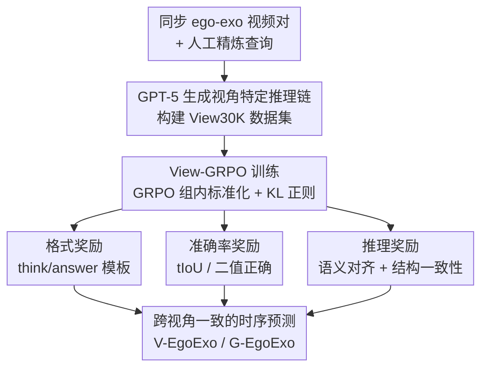

# EgoExo-Con: Exploring View-Invariant Video Temporal Understanding

**会议**: ECCV 2026  
**arXiv**: [2510.26113](https://arxiv.org/abs/2510.26113)  
**代码**: [https://github.com/mjjung/EgoExo-Con](https://github.com/mjjung/EgoExo-Con)  
**领域**: 视频理解  
**关键词**: 视频理解, 视角不变性, 时序定位, 强化学习, 跨视角一致性, ego-exo

## 一句话总结
本文提出 EgoExo-Con 基准（1,148 对同步 ego-exo 视频 + 2,269 条人工精炼的时序查询），首次系统评估 Video-LLM 在不同视角下时序理解的一致性，发现现有模型跨视角一致性仅勉强达到单视角性能的一半；并提出 View-GRPO 强化学习框架，通过语义对齐与结构一致性双重推理奖励，显著提升跨视角时序理解的鲁棒性和一致性。

## 研究背景与动机
现有 Video-LLM 在视频问答和时序定位任务上取得了长足进步，但几乎所有基准和方法都假设固定或变化很小的单一视角（通常为第三人称 exo 视角）。然而，同一事件从不同视角拍摄时画面差异极大——例如头戴相机（ego）和三脚架侧拍（exo）记录同一段烹饪过程，外观完全不同，但底层的时序动态（切菜、搅拌）完全一致。人类能毫不费力地在不同视角间跟踪动作序列和定位时间片段，但对 Video-LLM 而言，这种跨视角时序理解能力几乎未被探索。

现有 ego-exo 配对数据集（CharadesEgo、LEMMA、EgoExo-4D 等）要么局限于特定领域，要么不评估跨视角时序推理。更关键的是，已有基准中的原始查询往往是模板化的（如 CharadesEgo 的类别动作）或基于原子动作-物体标签（如 LEMMA），存在视角导致的歧义——关键元素可能在一个视角可见却在另一个视角被遮挡。这导致无法可靠评估跨视角一致性。

本文的核心切入点是：**时序推理是检验跨视角理解最自然的任务**——外观线索随视角剧烈变化，但事件的时序结构是不变的。因此，本文构建 EgoExo-Con 基准，通过人工精炼查询确保两个视角都能可靠观察到查询中的概念，并同时评估正确性和跨视角一致性。在此基础上，提出 View-GRPO，用强化学习显式强化视角特定的时序推理，同时鼓励跨视角一致的理解。

核心 idea：**用同步 ego-exo 视频对 + 人工精炼查询评估 Video-LLM 的跨视角时序一致性，并用带推理奖励的 GRPO 强化学习让模型学会视角不变的时序推理。**

## 方法详解

### 整体框架
本文的工作分为两部分：基准构建和模型改进。基准 EgoExo-Con 从 CharadesEgo、LEMMA、EgoExo-4D 三个数据集收集同步 ego-exo 视频，通过 GPT-4o 精炼原始查询并生成错位负样本查询，再经人工验证确保两个视角均可识别查询内容。最终得到 1,148 对视频和 2,269 条查询，支撑两个时序理解任务：时序验证（Temporal Verification，判断事件是否在给定时间段发生）和时序定位（Temporal Grounding，定位事件发生的起止时间戳）。

模型改进端，提出 View-GRPO，在 GRPO 基础上为跨视角时序推理定制奖励函数。流程为：先用 GPT-5 为每个视角生成逐步推理链，构建 View30K 训练数据；然后在 GRPO 训练中，模型为每对同步视频生成候选响应，通过格式奖励、准确率奖励和推理奖励三部分联合优化，其中推理奖励是核心创新，包括语义对齐（与参考推理链的 LLM Judge 评分）和结构一致性（跨视角动作/物体集合的 Jaccard 重叠）两个子项。

### 关键设计

**1. EgoExo-Con 基准构建：多阶段查询精炼与人工验证**

原始数据集中的查询无法直接用于跨视角一致性评估——CharadesEgo 使用模板化类别动作，LEMMA 依赖原子动作-物体标签，两者都缺少细节且存在视角歧义。例如 "A person is smiling" 在 ego 视角根本看不到人脸。

为解决这个问题，本文设计了三阶段精炼管线。第一阶段，将 LEMMA 的逐帧 HOI 标签（如 put + cup, fridge）聚合为更长的连续片段，提取显著动词和名词，用规则引擎转换为自然语言查询。第二阶段，使用 GPT-4o 对全量查询进行精炼：给定目标时刻的采样帧，模型验证查询内容是否在两个视角均可可靠推断，并生成精炼版本；同时为每条查询生成一个内容不匹配的"错位查询"（misaligned query），作为时序验证任务的负样本，平衡"是/否"答案分布。第三阶段，四位人工评估者审核所有样本，确认精炼查询在两个视角中均准确定位、错位查询确实与视觉内容冲突，不明确的样本被进一步精炼或丢弃，存疑案例由作者交叉确认。

最终得到 1,148 对同步视频（CharadesEgo 426 对、EgoExo-4D 558 对、LEMMA 164 对）和 2,269 条紧密对齐的查询-时间戳对。视频平均时长 86.4 秒，时刻平均长度 12.8 秒，查询平均 13.0 个 token，错位查询平均 15.9 个 token。三个子集各具不同的时序尺度，为评估带来多样性挑战。

**2. 推理奖励设计：语义对齐与跨视角结构一致性双驱动**

View-GRPO 的核心创新在于推理奖励 $r_{\text{reasoning}}$，它让模型不仅追求答案正确，还要生成可解释的、跨视角一致的推理过程。

语义对齐奖励 $r_{\text{sem}}$ 使用 LLM Judge（如 Qwen2.5-7B）将模型生成的推理链 $o$ 与 GPT-5 生成的参考推理链 $o^*$ 进行语义比较，输出 0 到 1 的评分：

$$r_{\text{sem}}(o) = \text{Judge}(o, o^*) \in [0, 1]$$

这鼓励模型生成的推理过程忠实于参考解释，避免自由发挥导致的幻觉。

结构一致性奖励 $r_{\text{struct}}$ 从跨视角角度出发：对于同一事件的两个视角，分别从推理链中提取动作集合 $\mathcal{A}$ 和物体集合 $\mathcal{O}$（使用 spaCy），计算跨视角的 Jaccard 重叠：

$$r_{\text{struct}}(o) = \frac{1}{2}\big(\text{Jac}(\mathcal{A}(o), \mathcal{A}(\tilde{o})) + \text{Jac}(\mathcal{O}(o), \mathcal{O}(\tilde{o}))\big)$$

其中 $\tilde{o}$ 是另一视角的推理链。这个设计的关键洞察是：同一事件在不同视角下应有共同的核心动作和物体，推理过程中提取出的动作/物体集合重叠度越高，说明模型对两个视角的时序理解越一致。

两项合并为推理奖励 $r_{\text{reasoning}}(o) = \lambda \cdot r_{\text{sem}}(o) + (1-\lambda) \cdot r_{\text{struct}}(o)$，$\lambda=0.7$。相比单纯追求答案正确的 GRPO，推理奖励提供了更丰富的训练信号：语义对齐确保推理质量，结构一致性促使模型内化跨视角共享的时序抽象，而非依赖视角特定的外观偏差。

**3. View-GRPO 训练框架：三合一奖励驱动的跨视角 RL**

View-GRPO 将上述推理奖励与格式奖励、准确率奖励组合为统一的总奖励：

$$r(o) = r_{\text{accuracy}}(o) + r_{\text{format}}(o) + r_{\text{reasoning}}(o)$$

其中格式奖励 $r_{\text{format}}$ 为二值信号，要求响应必须遵循 `<think>...</think><answer>...</answer>` 模板，方便结构化推理和答案提取。准确率奖励 $r_{\text{accuracy}}$ 对时序定位使用预测时段与真值的 tIoU，对时序验证使用二值正确率。

训练时，模型基于 GRPO 算法：对给定提示 $p$ 生成 $G$ 个候选响应，在组内标准化奖励值后优化加权目标，并通过 KL 散度正则项防止偏离基座模型过远。训练冻结视觉编码器，仅更新 LLM 参数，使用 8 张 A100 GPU，batch size 为 8，学习率 $1\times 10^{-6}$。

与朴素地在两个视角数据上做 SFT 不同，View-GRPO 通过推理奖励显式引导模型为每个视角生成忠实、逐步的时序解释，同时收敛到一致的时序结论——这迫使模型减少对视角特定偏差的依赖，转而学习跨视角共享的时序抽象。

### 损失函数 / 训练策略
View-GRPO 基于 GRPO 算法，优化目标为最大化组内标准化奖励的加权和，同时加入 KL 散度正则项 $\beta D_{\text{KL}}(\pi_{\theta} \| \pi_{\text{ref}})$。训练数据 View30K 由 GPT-5 生成：以 1 FPS 采样视频帧，为每个视角生成逐步推理链，过滤掉任一视角推理失败或预测 tIoU 低于 0.7 的样本，最终保留 3.3k 视频、30k 推理实例。训练使用 AdamW 优化器，冻结视觉编码器，最大像素 2.8M，推理长度选择中等的 256 token（实验表明过短缺乏上下文、过长导致过探索和幻觉）。SFT 基线使用 LoRA 微调，3 epoch，4 张 A100。

## 实验关键数据

### 主实验
现有模型在 EgoExo-Con 上的表现：人类在时序验证上达到 92.1%/91.3%（Exo/Ego），一致性 89.4%；在时序定位上达到 72.4%/73.0%，一致性 67.3%。闭源模型中 Gemini-2.5 Flash 最强（V 约 70%，G 约 42-46%），但跨视角一致性仅 52.3%（V）和 20.8%（G），远低于单视角。开源模型中 TimeChat-VT 在时序验证一致性上表现最好（42.1%），TimeSuite 在时序定位一致性上最好（18.7%），但所有开源模型的一致性得分都勉强达到单视角性能的一半。训练数据中包含 ego 数据的模型并不比仅用 exo 数据的模型有更高一致性，说明简单混合 ego-exo 数据不能自然带来视角不变性。

| 方法 | V-Exo | V-Ego | V-ExoEgo | G-Exo | G-Ego | G-ExoEgo |
|------|-------|-------|----------|-------|-------|----------|
| Human | 92.1 | 91.3 | 89.4 | 72.4 | 73.0 | 67.3 |
| GPT-5 | 60.5 | 61.3 | 52.5 | 34.5 | 32.8 | 20.1 |
| Gemini-2.5 Flash | 70.4 | 70.1 | 52.3 | 42.0 | 45.9 | 20.8 |
| TimeChat-VT (best open) | 62.1 | 61.4 | 42.1 | 27.8 | 26.2 | 16.3 |
| Video-LLaMA3 | 56.7 | 54.6 | 36.6 | 27.7 | 28.0 | 16.2 |

View-GRPO 在三个 backbone 上均显著超过 SFT 和朴素 GRPO 基线。以 Qwen2.5-VL-7B 为例，View-GRPO 将时序验证一致性从 33.0% 提升至 45.1%（+12.1%），时序定位一致性从 6.9% 提升至 18.7%（+11.8%）。InternVL3.5-8B 上的增益更大：V-ExoEgo 从 50.7% 到 62.4%（+11.7%），G-ExoEgo 从 3.0% 到 10.6%（+7.6%）。提升最显著的地方始终是跨视角一致性指标，验证了 View-GRPO 设计的有效性。

| 方法 | V-Exo | V-Ego | V-ExoEgo | G-Exo | G-Ego | G-ExoEgo |
|------|-------|-------|----------|-------|-------|----------|
| Qwen2.5-VL-7B (zero-shot) | 54.3 | 56.3 | 33.0 | 14.2 | 11.4 | 6.9 |
| + SFT | 57.6 | 58.0 | 41.4 | 18.3 | 17.8 | 14.9 |
| + GRPO | 55.2 | 57.6 | 39.8 | 18.6 | 16.1 | 14.3 |
| + View-GRPO | **58.6** | **58.2** | **45.1** | **22.0** | **21.6** | **18.7** |
| InternVL3.5-8B (zero-shot) | 64.4 | 64.7 | 50.7 | 12.8 | 6.7 | 3.0 |
| + View-GRPO | **73.1** | **74.4** | **62.4** | **20.5** | **16.8** | **10.6** |

在通用基准 Video-MME 和 TVGBench 上，View-GRPO 同样展现强泛化能力：Video-MME 从 61.1% 提升至 69.7%，TVGBench R1@0.5 从 19.5% 提升至 25.0%，说明强化后的时序推理能力可迁移到标准基准。

### 消融实验
推理奖励的两个子项各自贡献显著。仅加语义奖励 $r_{\text{sem}}$，V-ExoEgo 从 39.8% 提升至 44.7%，G-ExoEgo 从 14.3% 提升至 18.3%；再叠加结构一致性 $r_{\text{struct}}$ 后，进一步提升至 45.1% 和 18.7%。说明语义对齐提供推理质量基线，结构一致性在跨视角对齐上锦上添花。

| 配置 | V-Exo | V-Ego | V-ExoEgo | G-Exo | G-Ego | G-ExoEgo |
|------|-------|-------|----------|-------|-------|----------|
| GRPO (无推理奖励) | 55.2 | 57.6 | 39.8 | 18.6 | 16.1 | 14.3 |
| + $r_{\text{sem}}$ | 58.3 | 58.1 | 44.7 | 21.5 | 21.0 | 18.3 |
| + $r_{\text{sem}}$ + $r_{\text{struct}}$ | **58.6** | **58.2** | **45.1** | **22.0** | **21.6** | **18.7** |

此外，LLM Judge 的规模对推理奖励质量有显著影响：Qwen2.5-0.5B 作为 Judge 从训练第一步就给出过高的推理奖励，导致 G-EgoExo 下降约 3%，说明 Judge 的校准和可靠性对 RL 优化至关重要。推理长度的消融显示 256 token 的中等长度最稳定，128 token 信息不足导致精度低且优化不稳定，512 token 虽获得高推理奖励但精度反而下降（Judge 可能偏好冗长输出而非事实正确性）。

### 关键发现
- **推理奖励是 View-GRPO 的胜负手**：去掉推理奖励的朴素 GRPO 甚至比 SFT 还差（V-ExoEgo 39.8% vs 41.4%），而加上推理奖励后大幅反超，说明单纯追求答案正确的 RL 信号不足以解决跨视角一致性问题，必须显式引导推理过程。
- **朴素多视角 SFT 不可靠**：在 CharadesEgo 上，TimeSuite 同时训练两个视角的数据后一致性反而比仅训练 exo 视角低了 8.1%。这说明没有显式对齐的情况下，混合视角可能引入冲突先验，破坏时序信号而非增强一致性。
- **时序推理能力比帧数更重要**：Video-LLaMA2（8 帧）全面优于 VideoChat2（16 帧），TimeChat-VT（96 帧）超越多个使用更多/更少帧的模型，表明推理和时序建模能力比单纯增加帧数更关键。
- **解冻视觉编码器无益**：在 SFT 中解冻视觉编码器并未带来提升，反而常导致性能下降，可能原因是数据规模不足以支持端到端微调大型视觉 backbone，进一步说明视角不变理解的根本性挑战。

## 亮点与洞察
- **推理奖励的"语义+结构"双驱动设计**：不强制两个视角输出完全相同的答案，而是通过对齐推理过程中的关键概念（动作、物体）来自然诱导一致性——这比直接约束输出更灵活，也更能让模型学到视角不变的时序抽象而非死记硬背。
- **错位查询（misaligned query）作为自动负样本生成**：用 GPT-4o 为每条精炼查询自动生成语义相关但时间不匹配的负样本，在不增加人工标注成本的前提下自然平衡了时序验证任务的正负样本分布，这个设计思路可复用到其他需要负样本的 VQA 基准构建中。
- **LLM Judge 规模影响 RL 训练稳定性的发现**：过小的 Judge 模型会给出校准不良的高推理奖励，直接损害一致性——这个发现对任何使用 LLM-as-Judge 做 RL 训练的工作都有警示意义，提示需要审慎选择 Judge 规模并监控奖励分布。
- **跨视角一致性远低于单视角性能的量化揭示**：所有开源模型的一致性得分勉强达到单视角的一半（如 V-ExoEgo 23-42% vs V-Exo 46-62%），这个差距之大超出直觉预期，说明当前 Video-LLM 的"强性能"很大程度上依赖视角特定的外观捷径，而非真正的时序理解——这是整个领域需要正视的问题。

## 局限与展望
- **数据规模有限**：View30K 仅含 3.3k 视频，虽然经过 GPT-5 推理链增强，但规模上远不及大规模预训练所需。作者也指出大规模 ego-exo 配对数据采集成本高且不切实际，需要探索从 exo 视频合成 ego 风格数据（如裁剪/重投影手部区域）的增广方案。
- **架构限制**：当前 Video-LLM 训练范式独立处理每个视频，模型无法同时感知和对比两个视角。支持多视频联合处理或显式跨视角对齐信号的架构可能进一步提升一致性。
- **推理奖励的 LLM Judge 偏差**：Judge 可能偏好冗长输出而非事实正确性（如 512 token 推理精度反而更低），且小规模 Judge 校准不良。未来可探索更鲁棒的奖励建模方式，如基于 ground-truth 时序对齐的结构化评分。
- **长视频时序定位仍极具挑战**：EgoExo-4D 和 LEMMA 子集上的定位精度远低于 CharadesEgo，说明当前模型在长视频、短时刻的场景下时序定位能力严重不足，这是实际应用的瓶颈。
- **仅覆盖两个时序任务**：时序验证和时序定位是重要的探针任务，但跨视角理解还应涵盖动作识别、过程推理等更丰富的维度，EgoExo-Con 的框架可向这些方向扩展。

## 相关工作与启发
- **vs EgoExoBench (He et al.)**: EgoExoBench 是同期工作，也探索 Video-LLM 的跨视角时序推理，但主要做多选题式的动作排序，既未显式处理预测一致性，也未提出改进方法。EgoExo-Con 在任务设计（验证+定位 vs 排序）、一致性评估和算法改进三方面都更深入。
- **vs 传统 ego-exo 表征学习 (CharadesEgo, EgoExo-4D)**: 这些工作主要做对比学习或跨视角蒸馏来学习视角不变的表征，但几乎都不评估 Video-LLM 的时序推理一致性。本文首次将视角不变性从表征层推进到推理层，揭示了一个更根本的问题：即使表征对齐了，推理过程本身可能仍依赖视角特定捷径。
- **vs Video-LMM 时序推理工作 (TimeChat, VTimeLLM, TimeSuite)**: 这些工作推进了 Video-LLM 的细粒度时序理解能力，但均在单视角假设下设计。本文的发现——这些模型的"强性能"一半以上来自视角特定偏差——对时序推理方向的评估方法论有重要启示：未来应加入跨视角一致性作为标准评估维度。
- **vs GRPO / RL for Video Reasoning (Video-R1, Time-R1)**: 这些工作用 RL 提升视频推理，但未涉及跨视角场景。View-GRPO 在 GRPO 基础上增加的推理奖励（语义+结构双驱动）是一个通用性强的设计模式，可能适用于其他需要多模态一致性的 RL 任务（如多语言、多模态对齐）。

## 评分
- 新颖性: ⭐⭐⭐⭐⭐ 首次系统定义并评估 Video-LLM 的跨视角时序一致性，EgoExo-Con 填补了基准空白，View-GRPO 的推理奖励双驱动设计有原创性
- 实验充分度: ⭐⭐⭐⭐ 覆盖 8 个开源模型 + 2 个闭源模型 + 人类基准，3 个 backbone 的 View-GRPO 实验，消融、Judge 分析、推理长度分析均完备，但缺少在更大规模模型上的验证
- 写作质量: ⭐⭐⭐⭐⭐ 问题定义清晰，动机链条完整，从基准分析到方法提出的逻辑自洽，附录详尽
- 价值: ⭐⭐⭐⭐⭐ 揭示了当前 Video-LLM "强性能"背后的视角偏差问题，为领域提供了新的评估范式和改进方向，EgoExo-Con 基准和 View-GRPO 方法均有独立价值

<!-- RELATED:START -->

## 相关论文

- [\[CVPR 2025\] Bootstrap Your Own Views: Masked Ego-Exo Modeling for Fine-Grained View-Invariant Video Representations](../../CVPR2025/video_understanding/bootstrap_your_own_views_masked_ego-exo_modeling_for_fine-grained_view-invariant.md)
- [\[ECCV 2026\] Towards Long-Form Spatio-Temporal Video Grounding](towards_long-form_spatio-temporal_video_grounding.md)
- [\[AAAI 2026\] TSPO: Temporal Sampling Policy Optimization for Long-form Video Language Understanding](../../AAAI2026/video_understanding/tspo_temporal_sampling_policy_optimization_for_long-form_video_language_understa.md)
- [\[CVPR 2026\] SAVA-X: Ego-to-Exo Imitation Error Detection via Scene-Adaptive View Alignment and Bidirectional Cross View Fusion](../../CVPR2026/video_understanding/savax_egotoexo_imitation_error_detection_via_scene.md)
- [\[ICLR 2026\] Invert4TVG: A Temporal Video Grounding Framework with Inversion Tasks Preserving Action Understanding Ability](../../ICLR2026/video_understanding/invert4tvg_a_temporal_video_grounding_framework_with_inversion_tasks_preserving_.md)

<!-- RELATED:END -->
