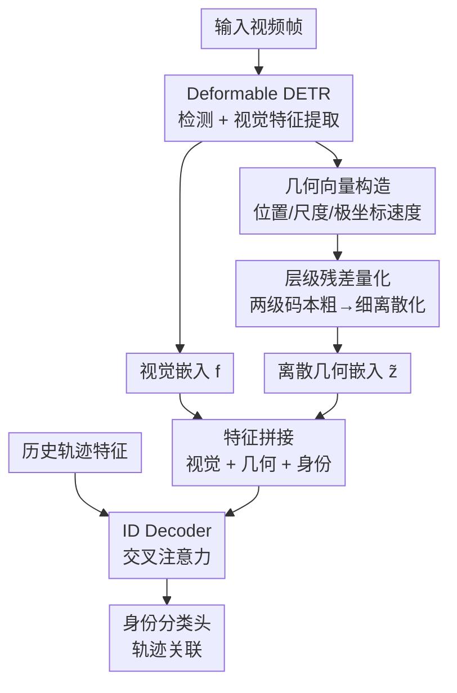

# HieDG: A Hierarchical Discrete Geometry-Guided Framework for Multi-Animal Tracking

**会议**: ECCV 2026  
**arXiv**: [2607.00494](https://arxiv.org/abs/2607.00494)  
**代码**: 无  
**领域**: 视频理解  
**关键词**: 多动物追踪, 离散几何表示, 残差向量量化, 查询式多目标追踪, 身份关联

## 一句话总结
HieDG 将多动物追踪中不稳定的连续几何信号（位置、尺度、速度）通过两级残差码本离散化为结构化 token，再与视觉特征融合注入 query-based 追踪器，在 AnimalTrack / BFT / BuckTales 三个动物追踪基准上取得 SOTA 关联性能（HOTA、AssA、IDF1 显著提升），并在 DanceTrack / SportsMOT 上验证了泛化性。

## 研究背景与动机
多动物追踪（MAT）是野生动物监测和行为分析的基础任务，但同类动物外观高度相似、群体密度大、运动轨迹不规则，使得身份关联极具挑战。现有方法分为两派：启发式方法（如 SORT、ByteTrack、OC-SORT）依赖手工设计的几何匹配规则（卡尔曼滤波 + 匈牙利算法），几何建模显式但无法端到端优化，场景适应性差；查询式方法（如 MOTR、MOTIP）通过跨帧注意力实现端到端身份建模，但严重依赖外观嵌入——在动物场景中外观区分度极低，关联极易出错。

一个自然的想法是将几何线索引入查询式追踪器，结合两者的优势。然而，注意力架构下的几何建模并非易事：相机抖动、目标震颤和环境噪声会在几何信号中引入微小但持续的波动。这些波动在原始模拟空间中虽小，经过嵌入后却可能在交叉注意力权重分布上产生不成比例的偏移，反而破坏身份匹配稳定性。实验也证实，直接使用连续几何表示（HieDG*）的关联性能甚至会低于纯外观基线。

受信号处理中量化原理的启发——将含噪模拟信号映射到稳定的离散状态以抑制扰动——本文从表示学习的视角重新审视几何建模：将波动的连续几何信号通过层级残差向量量化（VQ）转化为有限个可学习码字构成的离散 token，约束嵌入方差的同时保留身份关联所需的结构信息。核心 insight：**把几何建模从连续回归问题转化为离散表示学习问题，通过量化消除微小扰动对注意力权重的放大效应。**

## 方法详解

### 整体框架
HieDG 基于 Deformable DETR 检测器，在 MOTIP 基线之上增加几何分支，整体流程为：输入视频帧经 CNN backbone + Transformer encoder 提取图像特征，Deformable DETR decoder 输出检测框和物体级视觉嵌入 $f_t^i$；同时从检测结果构造归一化几何向量（位置、尺度、极坐标速度），分别经 MLP 投影后进入独立的两级残差码本量化，得到离散几何嵌入 $\tilde{z}_t^i$；最后将视觉嵌入、离散几何嵌入和身份嵌入拼接后送入 ID decoder，通过交叉注意力与历史轨迹特征交互，分类头输出身份预测。

### 关键设计

**1. 层级残差几何量化：用两级码本将连续几何信号转化为稳定离散 token**

多动物场景中，检测框的位置、尺度、速度会因相机抖动和运动不规则而产生持续微小波动。这些波动在连续嵌入空间中会被注意力机制放大——相邻帧同一目标的位置稍有偏移，注意力权重可能剧烈变化，导致身份错配。HieDG 的核心应对是对每个几何分量（位置 $g_p$、尺度 $g_s$、速度 $g_v$）独立使用两级残差码本进行粗到细的离散化。

具体做法：每个几何分量先经 MLP 投影到 $D=64$ 维潜空间得到 $z_g$，再用第一级码本 $E_g^{(1)}$（$K=64$ 个码字）做最近邻查找得到粗码字 $q_{g,1}$，计算残差 $r_g = z_g - q_{g,1}$ 后用第二级码本 $E_g^{(2)}$ 对残差再做量化得到 $q_{g,2}$，最终离散嵌入 $\tilde{z}_g = q_{g,1} + q_{g,2}$。两级设计的关键在于：粗码本捕获几何状态的宏观结构（如"目标在画面左上区域"），细码本建模粗量化之后的残余变化（如"在左上区域内微调了几个像素"）。残差形式让第二阶段只需建模变化量而非绝对值，显著降低了每个阶段的码字负担。三个分量的离散嵌入拼接后线性投影到 $d$ 维，与视觉特征对齐。

消融实验证明：固定分箱量化（FixVQ）提升微弱，单级 VQ 效果次之，两级残差 VQ 效果最优（BFT 上 HOTA 71.3 vs 单级 70.5 vs 无量化 69.2）；三级 VQ 仅微涨 0.2 HOTA 却增加 49K 参数和 98K FLOPs。码本维度从 16→32→64 持续提升，到 128 饱和。

**2. 极坐标速度表示：解耦运动幅度与方向以应对不规则运动**

动物运动常包含急停、骤转等不规则模式，笛卡尔速度 $(v_x, v_y)$ 将幅度和方向纠缠在一起——同一方向不同速度或同一速度不同方向会映射到嵌入空间中距离遥远的点，削弱同一身份轨迹的嵌入紧凑性。HieDG 将帧间差分得到的速度从笛卡尔坐标转换为极坐标 $(\rho, \theta)$：$\rho$ 表示运动幅度，$\theta$ 表示运动方向，两者在物理上解耦。消融显示极坐标速度相比笛卡尔速度在 AssA 和 IDF1 上有稳定提升，验证了解耦对不规则运动建模的有效性。

**3. 推理时的 KNN 速度估计：解决无帧间对应时的速度缺失**

训练时速度可直接由相邻帧检测框差分得到，但推理时当前帧检测尚未与历史轨迹关联，无法直接计算速度。HieDG 对每个当前帧检测，在历史轨迹状态集 $\mathcal{H}$ 中检索空间坐标最近的 $k$ 个邻居，用归一化加权平均估计其速度：

$$\hat{\mathbf{v}}_t^i = \sum_{j \in \mathcal{N}_k} w_{ij} \mathbf{v}_j, \quad w_{ij} \propto \exp\left(-\frac{\|\mathbf{c}_t^i - \mathbf{c}_j\|_2^2}{\sigma_s^2}\right) \cdot \exp\left(\frac{\cos(\Delta\phi_{ij})}{\sigma_d}\right)$$

权重由两项核函数乘积决定：空间邻近核鼓励物理距离近的历史轨迹贡献更大，方向一致性核鼓励运动方向对齐的轨迹贡献更大。这种轻量级 KNN 估计不引入额外可学习参数，且与量化模块完全兼容——估计出的笛卡尔速度同样转为极坐标后送入量化管线。训练时还对速度嵌入施加 0.3 dropout 以增强对估计噪声的鲁棒性。

### 一个完整示例：量化如何稳定注意力

假设一只鹿在第 $t$ 帧的归一化位置为 $(0.32, 0.45)$，因相机微颤在第 $t+1$ 帧变为 $(0.33, 0.44)$。若直接用连续几何嵌入，这两个相近的位置在嵌入空间中可能被 MLP 映射到注意力权重差异较大的区域，导致模型误判为不同身份。而在 HieDG 中，$(0.32, 0.45)$ 经第一级码本被量化为最近码字（如码字 #23，对应"画面中偏左上"），残差 $(-0.01, +0.01)$ 经第二级码本量化为微调码字（如码字 #7）；$(0.33, 0.44)$ 同样落入码字 #23 + 码字 #7。两个帧产生完全相同的离散 token，注意力权重保持稳定，身份关联不被相机抖动干扰。这就是量化"把波动信号压到同一离散状态"的核心价值。

### 损失函数 / 训练策略

总损失为三项加权和：$\mathcal{L}_{\text{total}} = \lambda_{\text{det}}\mathcal{L}_{\text{det}} + \lambda_{\text{id}}\mathcal{L}_{\text{id}} + \lambda_{\text{vq}}\mathcal{L}_{\text{vq}}$，权重分别为 1.0、2.0、0.1。

- $\mathcal{L}_{\text{det}}$：Deformable DETR 标准检测损失（分类 loss + GIoU loss + L1 回归 loss）
- $\mathcal{L}_{\text{id}}$：身份分类交叉熵损失（含"未知"类别），将轨迹关联形式化为分类任务
- $\mathcal{L}_{\text{vq}}$：标准 VQ 损失 $\|\text{sg}[z] - e\|_2^2 + \beta\|z - \text{sg}[e]\|_2^2$，第一项更新码字，第二项（commitment loss）约束编码器输出靠近码字；通过 straight-through estimator (STE) 回传梯度

训练采用 U 型课程策略：前 5% 迭代正常训练建立基础追踪能力，5%-35% 对视觉嵌入施加 0.35 dropout 迫使模型依赖几何和身份线索，35% 后将视觉 dropout 降至 0.1 恢复外观细节。COCO 预训练权重初始化，AdamW 优化器（lr=$10^{-4}$，weight decay=$5\times10^{-4}$），首 epoch 线性 warmup。

## 实验关键数据

### 主实验

AnimalTrack 和 BFT 上的对比（表 1）：HieDG 在两个数据集上均取得最优 HOTA、AssA 和 IDF1。值得注意的是，连续几何版本 HieDG* 在 AnimalTrack 上 IDF1 仅 61.8（低于 MOTIP 的 61.7 基本持平，AssA 反降至 54.2），而离散化后 IDF1 提升至 64.4、AssA 提升至 58.4——直接验证了连续几何在低区分度场景下反而有害、离散化才能释放几何信息价值的核心论点。

| 方法 | AnimalTrack HOTA | AnimalTrack AssA | AnimalTrack IDF1 | BFT HOTA | BFT AssA | BFT IDF1 |
|------|------------------|-------------------|-------------------|----------|----------|----------|
| SORT | 42.5 | 37.0 | 49.1 | 61.2 | 62.3 | 77.2 |
| ByteTrack | 48.1 | 49.3 | 55.5 | 62.5 | 64.1 | 82.3 |
| OC-SORT | - | - | - | 66.8 | 68.7 | 79.3 |
| MOTR | 49.5 | 47.7 | 54.1 | 64.2 | 64.7 | 75.2 |
| MOTIP (基线) | 54.1 | 55.0 | 61.7 | 69.2 | 67.3 | 80.1 |
| CO-MOT | 55.3 | 55.5 | 62.1 | 69.0 | 67.7 | 79.0 |
| HieDG* (连续几何) | 54.6 | 54.2 | 61.8 | 69.5 | 68.8 | 79.8 |
| **HieDG** | **56.2** | **58.4** | **64.4** | **71.3** | **72.2** | **82.5** |

BuckTales 无人机场景下 HieDG 同样最优（HOTA 52.4, AssA 64.0, IDF1 69.7），大幅领先 ByteTrack（HOTA 49.8）和 MOTIP（HOTA 45.6）。DanceTrack 和 SportsMOT 上 HieDG 也取得具有竞争力的泛化结果（DanceTrack HOTA 70.3, SportsMOT HOTA 72.8），说明离散几何建模不局限于动物场景。

### 消融实验

几何分量消融（BFT 数据集，以 MOTIP 为基线 HOTA 69.2）：

| 配置 | HOTA | AssA | IDF1 | 说明 |
|------|------|------|------|------|
| MOTIP 基线 | 69.2 | 67.3 | 80.1 | 纯外观，无几何 |
| + 位置 (Pos.) | 70.6 | 71.0 | 81.6 | 单加位置几何 |
| + 尺度 (Scale) | 70.1 | 68.9 | 81.3 | 单加尺度几何 |
| + 速度 (Vel.) | 69.7 | 68.0 | 80.9 | 单加速度几何 |
| + 三者全加 | **71.3** | **72.2** | **82.5** | 互补增益最大 |

量化策略消融：

| 策略 | HOTA | AssA | IDF1 | 参数量增量 |
|------|------|------|------|-----------|
| 连续编码 (无量化) | 69.5 | 68.8 | 79.8 | +199.2K |
| 固定分箱 VQ | 69.8 | 69.1 | 80.2 | +49.9K |
| 单级 VQ | 70.5 | 68.9 | 81.3 | +99.1K |
| **两级残差 VQ** | **71.3** | **72.2** | **82.5** | +148.3K |
| 三级残差 VQ | 71.5 | 72.2 | 82.7 | +197.4K |

### 关键发现
- **离散化是几何生效的前提**：连续几何嵌入（HieDG*）在 AnimalTrack 上 AssA 甚至低于 MOTIP 纯外观基线（54.2 vs 55.0），说明不加量化的几何信号对注意力机制是噪音而非助力。离散化后 AssA 反超基线 3.4 个点，几何信息的价值才被真正释放。
- **位置贡献最大，三者互补**：单加位置 HOTA 涨 1.4，单加速度仅涨 0.5，但三者叠加涨 2.1——说明位置是主信号，尺度和速度提供互补的细粒度区分信息。
- **两级 VQ 是最佳性价比**：单级 VQ 表达能力不足（HOTA 70.5），三级 VQ 边际收益递减（71.5 vs 71.3，仅涨 0.2），两级设计在性能和效率间取得最佳平衡。
- **匈牙利匹配对 ID 分类框架无额外增益**：MOTIP 式 ID 分类已经隐式完成了全局分配，外挂匈牙利算法几乎无提升。
- **t-SNE 可视化佐证**：量化后的几何嵌入在同一 ID 内的聚类紧密度明显优于连续外观特征，融合嵌入进一步拉大了不同 ID 之间的间距。

## 亮点与洞察
- **信号处理的视角迁移很巧妙**：把量化从信号处理/图像压缩领域借用到多目标追踪的几何建模，思路清新且直觉合理——既然扰动会通过注意力放大，那就从表示层面把连续信号"压平"到离散状态，从源头抑制扰动传播。这个 insight 可能适用于其他需要将噪声敏感信号注入注意力机制的场景。
- **连续几何反效果的实证具有警示意义**：HieDG* 实验直接证明了"把更多信息塞进模型未必更好"——不加处理的几何信号在注意力架构中可能是毒药而非补药，这提醒后续工作在引入辅助模态时必须考虑模态本身的噪声特性和架构的敏感性。
- **极坐标速度解耦是低成本高效 trick**：把笛卡尔速度转极坐标只需要一行公式，却稳定涨点，本质是将神经网络不擅长的"纠缠表示解耦"任务前置到手工特征工程中完成，减轻了学习负担。类似思路可迁移到其他需要建模方向+幅度的运动任务。
- **U 型课程学习策略值得复用**：先让模型学好视觉基线，再逐步降低视觉权重迫使模型利用几何线索，最后恢复视觉信息——这种"先学主干、再补短板、最后融合"的课程设计在引入辅助模态时普适性强。

## 局限与展望
- **尺度嵌入区分度弱**：t-SNE 可视化显示位置和速度嵌入在不同 ID 间有明显分离，但尺度嵌入的类间距离和类内紧密度都不理想。作者认为可探索面积-形状分解、对数空间编码或纵横比表示来改进尺度建模。
- **融合策略朴素**：当前几何与视觉的融合仅为拼接 + 线性投影，未来可尝试门控融合、FiLM 调制、交叉注意力或图消息传递等更具表达力的融合方式。
- **遮挡和边界场景仍有 ID switch**：在目标靠近图像边界或部分遮挡时仍会出现漏检和身份切换，动物外观剧变（如鸭子潜水、鹿大幅度姿态变化）时容易将同一目标判为新出现个体。
- **未涉及长期轨迹建模**：当前历史时间窗口仅覆盖 $[t-T, t-1]$，对于长时间遮挡后重新出现的目标，身份恢复能力有限。

## 相关工作与启发
- **vs MOTIP (Gao et al., CVPR 2025)**：MOTIP 将 MOT 形式化为身份分类问题，是 HieDG 的基线。HieDG 在其纯外观架构上增加了离散几何分支，证明几何信息能稳定补充外观区分度不足的场景。启发：身份分类框架可以自然地吸收多模态信息而无需改变核心匹配逻辑。
- **vs OC-SORT (Cao et al., CVPR 2023)**：OC-SORT 通过运动连续性建模和方向平滑来处理不规则运动，属于启发式几何建模。HieDG 将类似的运动直觉（方向一致性、空间邻近性）编码到了 KNN 速度估计的核函数设计中，但整体框架是端到端可学习的。启发：启发式方法的几何直觉可以作为可学习框架中特征设计的指导思想。
- **vs VQ-VAE / 残差量化 (Lee et al., CVPR 2022)**：层级残差码本的设计直接借鉴了 VQ-VAE 系列工作，但应用场景完全不同——从图像/音频压缩迁移到了追踪中的几何表示学习。启发：生成模型中的表示离散化技术可以迁移到判别式任务中作为鲁棒表示学习工具。

## 评分
- 新颖性: ⭐⭐⭐⭐ 将信号处理的量化思想引入多目标追踪的几何建模，视角迁移有新意；核心方法（残差 VQ）本身是成熟技术，组合方式巧妙但非颠覆性
- 实验充分度: ⭐⭐⭐⭐⭐ 五个数据集（3 动物 + 2 通用）、多组消融（几何分量 / 量化策略 / 码本维度 / 匈牙利匹配 / 极坐标）、t-SNE 可视化、推理速度估计的专门设计，实验覆盖全面
- 写作质量: ⭐⭐⭐⭐ 动机链清晰（外观不足 → 加几何 → 连续几何有害 → 离散化解决），HieDG* 对照实验让核心论点非常有说服力；部分段落略啰嗦
- 价值: ⭐⭐⭐⭐ 为多动物追踪提供了有效的几何建模方案，连续几何有害的实证对领域有警示价值；离散几何表示的思路可迁移到其他跟踪任务（行人、车辆、细胞追踪）

<!-- RELATED:START -->

## 相关论文

- [\[CVPR 2026\] SpikeTrack: A Spike-driven Framework for Efficient Visual Tracking](../../CVPR2026/video_understanding/spiketrack_a_spike-driven_framework_for_efficient_visual_tracking.md)
- [\[CVPR 2026\] An Efficient Token Compression Framework for Visual Object Tracking](../../CVPR2026/video_understanding/an_efficient_token_compression_framework_for_visual_object_tracking.md)
- [\[CVPR 2026\] EthoCLIP: Ontology-Enhanced Video-Language Pretraining for Animal Behavior Understanding](../../CVPR2026/video_understanding/ethoclip_ontology-enhanced_video-language_pretraining_for_animal_behavior_unders.md)
- [\[CVPR 2026\] UETrack: A Unified and Efficient Framework for Single Object Tracking](../../CVPR2026/video_understanding/uetrack_a_unified_and_efficient_framework_for_single_object_tracking.md)
- [\[CVPR 2026\] Real-World Point Tracking with Verifier-Guided Pseudo-Labeling](../../CVPR2026/video_understanding/realworld_point_tracking_with_verifierguided_pseud.md)

<!-- RELATED:END -->
