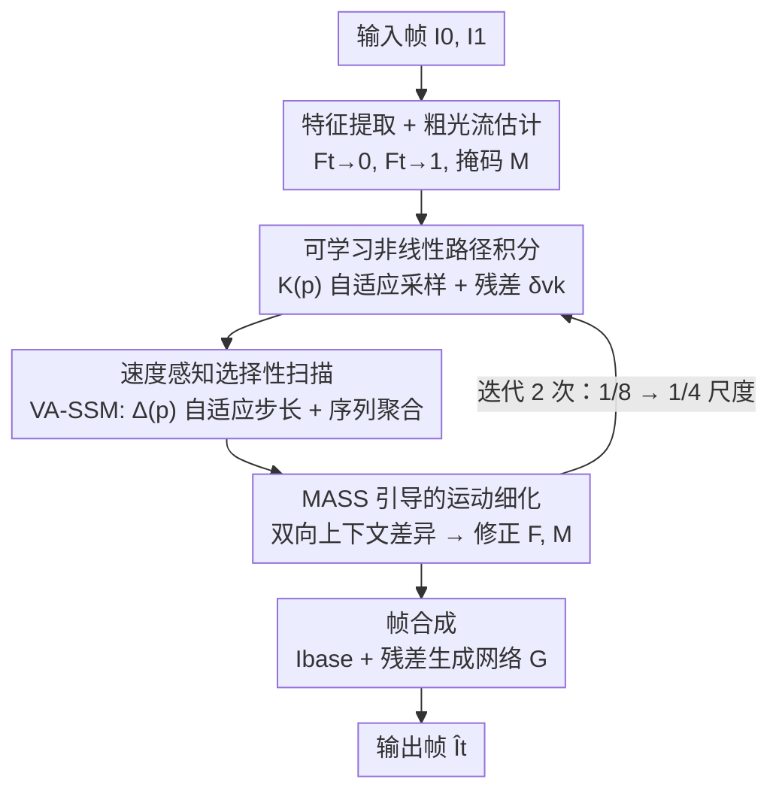

# MASS: Motion-Aligned Selective Scan for Refinement in Flow-Based Video Frame Interpolation

**会议**: ECCV 2026  
**arXiv**: [2606.27718](https://arxiv.org/abs/2606.27718)  
**代码**: 无  
**领域**: 视频理解  
**关键词**: 视频帧插值, 状态空间模型, 运动轨迹, 光流引导扫描, Mamba

## 一句话总结
MASS 将视频帧插值中 SSM 的特征扫描从静态空间网格重新定义为沿光流轨迹的动态序列建模，通过可学习非线性路径积分和速度感知自适应扫描，在保持高效计算的同时显著提升大位移和复杂遮挡场景下的插值质量，在 SNU-FILM Extreme 子集上以 26.04 dB PSNR 超越此前最优方法 0.38 dB。

## 研究背景与动机
视频帧插值（VFI）的主流范式是基于光流的方法：估计中间时刻的双向光流，将输入帧 warping 到中间时刻，再用合成网络融合重建。然而中间帧不可观测，大位移、遮挡/去遮挡、薄结构和重复纹理常导致光流估计存在歧义，使 warping 重建出现伪影。即使采用多尺度或迭代估计器，在根本上缺乏可靠匹配的区域（如去遮挡边界）仍力不从心。为增强长程上下文建模，近年工作引入 Transformer 和选择性状态空间模型（SSM/Mamba）来做全局特征聚合。但现有 SSM-based VFI 方法（VFIMamba、LC-Mamba）的扫描顺序定义在静态空间网格上（光栅扫描、Hilbert 曲线、移位窗口），对 VFI 而言，目标像素最有信息量的上下文通常沿其物理运动路径分布，而非静态空间邻域。这种扫描顺序与物理运动的错位，导致运动不一致的邻居特征混入聚合过程，在大位移和遮挡场景下尤为严重。

本文提出 MASS，将扫描范式从"静态网格序列化"转换为"光流引导的轨迹序列化"：对每个目标像素，沿着粗光流估计构建运动轨迹，在轨迹上采样特征并用 SSM 聚合，使上下文聚合天然对齐物理运动。核心 insight：VFI 的上下文聚合不应在固定空间窗口内做，而应沿着每个像素的运动路径做——运动路径本身就是最强的先验，远比任何手工设计的静态扫描顺序更合理。

## 方法详解

### 整体框架
MASS 在标准 flow-based VFI 管线之上插入轨迹对齐的 SSM 聚合与细化模块。给定两帧 I0、I1，共享特征提取器先得到特征图 C0、C1，轻量光流估计器（IFRNet 风格）输出粗双向光流 F = {Ft→0, Ft→1} 和遮挡掩码 M。接下来以由粗到精的方式，在 1/8 和 1/4 两个尺度上迭代运行 MASS 细化单元，每个单元做三件事：(1) 沿粗光流构建非线性运动轨迹并逐点采样特征序列；(2) 用速度感知 SSM 沿轨迹聚合特征，得到前向/后向运动对齐上下文 Z0→t 和 Z1→t；(3) 利用双向上下文差异检测轨迹误差，细化光流和掩码。细化后的运动估计传入下一尺度重新构建更精确的轨迹，形成迭代优化闭环。最终在 1/4 尺度用细化后的光流和融合上下文合成输出帧 Ît。

### 关键设计

**1. 可学习非线性路径积分：让采样沿真实运动路径弯曲**

线性插值假设运动为匀速直线，无法处理旋转、加速度和运动边界等曲线运动。MASS 将轨迹构建为迭代积分过程：每一步沿粗光流方向推进一个基准步长的同时，用可学习网络预测残差修正，允许轨迹在局部外观指示曲线运动时自动弯曲。

具体来说，首先根据运动幅度动态分配采样预算 K(p)：运动越大沿轨迹采样点越多，避免长轨迹因欠采样而产生混叠伪影；静止区域只需极少采样点，节省计算。K(p) 由双向光流平均幅度缩放后取整并裁剪到 [Kmin, Kmax] = [2, 8]：

$$K(p) = \text{clip}\left(\left\lfloor \alpha \cdot \|F(p)\| \right\rceil, K_{\min}, K_{\max}\right), \quad \|F(p)\| = \frac{1}{2}(\|F_{t\to 0}(p)\| + \|F_{t\to 1}(p)\|)$$

其中 α 通过将局部运动幅度对帧级平均值归一化动态计算，无需手工调参。给定 K(p)，从目标像素坐标 u 出发（初始位移 d0 = 0），第 k 步从源特征图当前追踪坐标处用 backward warping 采样特征，将其与粗光流 Ft→0(p) 和归一化进度指示 rk = k/K(p) 一起送入两层卷积 φ，预测残差速度 δvk：

$$\delta\mathbf{v}_k = \phi_{0\to t}\left(\overleftarrow{\mathcal{W}}(C_0, \mathbf{u}+\mathbf{d}_k), F_{t\to 0}(p), r_k\right)$$

位移更新为基准步长（粗光流平摊到 K 步）加残差修正：

$$\mathbf{d}_{k+1} = \mathbf{d}_k + \frac{F_{t\to 0}(p)}{K(p)} + \delta\mathbf{v}_k$$

这个设计的巧妙之处在于两层分工：粗光流提供"大方向"作为基底，残差网络只需学习"偏离直线的微调量"——学习目标被显著简化，训练更稳定。同时 K(p) 的自适应分配使算力自动流向大运动区域，静止区域的无效采样被自然削减。后向方向（1→t）使用 C1 和 Ft→1 对称构建。变长轨迹的批量计算采用定长缓冲区加掩码策略实现。

**2. 速度感知选择性扫描（VA-SSM）：快运动细粒度聚合，慢运动粗粒度跳过**

沿轨迹采样得到特征序列后，需用 SSM 聚合成统一上下文向量 Z(p)。标准 SSM 使用固定离散化步长 Δ，但轨迹上的外观变化速率因运动幅度而异：快速运动像素在同样 K 步内跨越更大空间距离，外观变化剧烈，固定 Δ 可能欠分辨高频纹理细节。

VA-SSM 根据轨迹平均速度 v(p) = |F(p)|/K(p) 动态调整离散化步长 Δ(p)：速度越大，Δ 越小，SSM 内部状态以更细的时间粒度更新，更好保留边缘和纹理：

$$\overline{A}(p) = \exp(\Delta(p) A), \quad \Delta(p) = \frac{1}{1 + \beta \cdot v(p)}, \quad v(p) = \frac{\|F(p)\|}{K(p)}$$

β 同样通过帧级归一化动态计算，Δ(p) 实际被限制在 [0.25, 1.0] 范围内。这里 K(p) 和 Δ(p) 形成正交且互补的双重自适应：K(p) 控制"空间上沿轨迹采多少点"，Δ(p) 控制"SSM 状态更新多细粒度"——快速运动区域同时获得"密采样 + 细步长"的双重保障。消融实验表明，从固定 Δ 切换到速度感知 Δ 后，SNU-FILM Extreme PSNR 从 25.65 提升到 25.73，且 FLOPs 反降（因为 K(p) 自适应在静止区域大幅减少了无效采样）。SSM 内部状态维度设为 16，扩展因子为 2，平衡表达能力与计算开销。

**3. MASS 引导的运动细化与帧合成：用双向上下文一致性修正光流**

MASS 对前向（0→t）和后向（1→t）分别执行轨迹扫描，得到两个运动对齐上下文 Z0→t 和 Z1→t。关键洞察：在无遮挡区域，正反两个方向追踪的应是同一物理内容，聚合后的语义上下文理应一致；若差异显著，则标志轨迹未对齐或该区域被遮挡。

利用这一性质，MASS 计算双向上下文差异图 D(p) = |Z0→t - Z1→t|。一个两层卷积细化头以 D(p)、聚合上下文和当前运动估计为输入，预测残差更新量，得到细化光流 F̂ 和掩码 M̂。这种"视觉一致性直接指导几何修正"的设计，不需要额外的匹配分支或显式遮挡检测模块——D(p) 是轨迹扫描的自然副产品，零额外计算开销。细化后的运动估计被送回下一尺度迭代，使轨迹构建质量随尺度逐级提升。

帧合成侧，一个两层卷积融合头用 softmax 门控合并 Z0→t 和 Z1→t，得到统一上下文 Ẑt——门控机制自动抑制遮挡区域不可靠的信息。最终帧由 warping 基准加残差生成网络输出：

$$I_{\text{base}} = \hat{M} \odot \overleftarrow{\mathcal{W}}(I_0, \hat{F}_{t\to 0}) + (1-\hat{M}) \odot \overleftarrow{\mathcal{W}}(I_1, \hat{F}_{t\to 1})$$

$$\hat{I}_t = I_{\text{base}} + \mathcal{G}(\hat{Z}_t, C_0, C_1)$$

Ibase 提供基于修正运动的结构基础，处理大位移；生成器 G 采用 U-Net 架构（RIFE 风格），同时接收 MASS 的全局运动上下文 Ẑt 和原始局部特征 C0、C1，恢复 warping 难以处理的复杂纹理和边缘。这种将"结构重建"和"细节恢复"解耦的设计使两部分各司其职。

### 一个例子：大位移前景像素的完整处理流程

以 SNU-FILM Extreme 子集中一个快速移动的网球前景像素为例。该像素在两帧间的光流幅度 |F(p)| 约 40 像素，帧级平均光流约 10 像素，归一化后 α·|F(p)| ≈ 4.0，取整后 K(p) 被分配到上限 Kmax = 8。粗光流估计器输出 Ft→0(p) ≈ (-38, -12)，Ft→1(p) ≈ (38, 12)。

步骤 1——非线性路径积分：从目标帧该像素坐标出发，每步基准步长约为 Ft→0(p)/8 ≈ (-4.75, -1.5)。第 1 步在初始位置采样 C0 特征，卷积 φ 结合粗流和进度 r1 = 1/8 预测残差 δv0 ≈ (0.3, -0.8)，实际位移 d1 = (-4.45, -2.3)，轨迹开始偏离纯直线（网球有微小弧线运动）。循环 8 步后得到一条微弯曲的轨迹和 8 个沿轨迹采样的特征向量。

步骤 2——VA-SSM 聚合：轨迹平均速度 v(p) = 40/8 = 5.0 像素/步，速度较大，经 β 归一化后 Δ(p) ≈ 0.35（靠近下限，对应快速运动），SSM 以细粒度更新状态，8 步后输出前向上下文 Z0→t(p)。后向方向对称处理得 Z1→t(p)。

步骤 3——运动细化：网球在 I0 中可能被部分遮挡，正反向差异 D(p) 较大。细化头据此预测残差修正，将 Ft→0(p) 调整为 (-37.2, -11.5)，掩码 M(p) 从 0.6 修正为 0.55（更偏向 I1，因 I0 中网球遮挡更严重）。1/8 尺度的 warp error 从 12.3 降至 8.7。细化光流传入 1/4 尺度重复三步，最终 warp error 降至 5.1。

步骤 4——帧合成：融合头用 softmax 门控合并双向上下文（遮挡侧权重自动降低），warping 基线提供结构，U-Net 生成器恢复纹理细节，输出该像素在 Ît 中清晰的 RGB 值。

### 损失函数 / 训练策略

使用 Laplacian 金字塔损失在多个尺度上监督重建结果，引导网络恢复多尺度结构和纹理细节。优化器为 AdamW（weight decay 1×10⁻⁴），在两块 NVIDIA RTX 3090 上以总 batch size 32 训练。特征提取器采用 SGM-VFI 架构，最深特征分辨率为 H/8×W/8；细化在 1/8 和 1/4 两个尺度上递进进行。SSM 内部状态维度 16，扩展因子 2。缩放参数 α 和 β 通过对局部运动幅度/速度做帧级归一化动态计算，无需手动调参。仅使用 Vimeo90K 训练，无额外数据。

## 实验关键数据

### 主实验

在 Vimeo90K（448×256）、UCF101（256×256）、Middlebury OTHER（~640×480）、SNU-FILM（1280×720，按难度分 Easy/Medium/Hard/Extreme）、Xiph-2K 和 Xiph-4K 六个基准上评估。带 † 的模型由作者用官方代码仅在 Vimeo90K 上从头重训以保证公平。FLOPs 在 720p 分辨率下测量。

| 方法 | M.B. IE↓ | Vimeo90K PSNR/SSIM | UCF101 PSNR/SSIM | Xiph-2K PSNR/SSIM | Xiph-4K PSNR/SSIM | SNU-FILM Hard | SNU-FILM Extreme | FLOPs (T) |
|------|----------|---------------------|-------------------|--------------------|--------------------|---------------|------------------|-----------|
| RIFE | 1.96 | 35.61/0.9779 | 35.28/0.9690 | 36.19/0.938 | 33.76/0.894 | 30.36/0.9351 | 25.27/0.8601 | 0.20 |
| IFRNet-B | 1.95 | 35.80/0.9794 | 35.29/0.9693 | 36.00/0.936 | 33.99/0.893 | 30.41/0.9358 | 25.05/0.8587 | 0.21 |
| AMT-G | 1.83 | 36.53/0.9816 | 35.41/0.9698 | 36.38/0.940 | 34.63/0.903 | 30.77/0.9384 | 25.42/0.8644 | 2.20 |
| EMA | 1.84 | 36.50/0.9814 | 35.38/0.9697 | 36.74/0.944 | 34.54/0.905 | 30.80/0.9389 | 25.59/0.8650 | 1.64 |
| VFIMamba† | 1.90 | 36.46/0.9814 | 35.42/0.9700 | 36.82/0.944 | 34.12/0.898 | 30.79/0.9389 | 25.66/0.8657 | 1.54 |
| LC-Mamba-P | 1.92 | 36.53/0.9816 | 35.42/0.9699 | 36.99/0.946 | 34.49/0.906 | 30.72/0.9382 | 25.48/0.8645 | 2.70 |
| **MASS-S (Ours)** | 1.90 | 36.32/0.9805 | 35.44/0.9699 | 36.84/0.944 | 34.65/0.907 | 30.90/0.9387 | 25.73/0.8668 | 0.50 |
| **MASS (Ours)** | **1.79** | **36.53/0.9816** | **35.48/0.9703** | **37.05/0.946** | **34.83/0.908** | **31.09/0.9407** | **26.04/0.8681** | 2.06 |

MASS 在常规基准上与最佳方法持平或略优，优势集中在挑战性场景：SNU-FILM Extreme 上 26.04 dB 比此前最优 VFIMamba 高 0.38 dB；Hard 上 31.09 dB 比 LC-Mamba-P 高 0.37 dB；Xiph-4K 上 34.83 dB 比最优竞品高 0.34 dB。轻量版 MASS-S 以仅 0.50 TFLOPs 达到极具竞争力的性能，显著优于同计算量级方法。

### 消融实验

以下消融均基于 MASS-S 轻量版，报告 PSNR/SSIM。

**MASS 组件逐项消融**（Table 2 上部分）：

| 配置 | 可学习路径 | 自适应 K | 速度 Δ | SNU-FILM Hard | SNU-FILM Extreme | Xiph-2K | Xiph-4K | FLOPs (T) |
|------|:---------:|:--------:|:------:|---------------|------------------|---------|---------|-----------|
| 基线（线性路径 + 普通 SSM，K=8 固定） | - | - | - | 30.66/0.937 | 25.49/0.863 | 36.54/0.941 | 34.40/0.904 | 0.53 |
| + 非线性路径（可学习 δvk） | ✓ | - | - | 30.81/0.938 | 25.60/0.865 | 36.69/0.942 | 34.54/0.905 | 0.54 |
| + 自适应采样 K(p) | ✓ | ✓ | - | 30.85/0.938 | 25.65/0.865 | 36.76/0.943 | 34.58/0.905 | 0.49 |
| + **VA-SSM（完整 MASS）** | ✓ | ✓ | ✓ | **30.90/0.939** | **25.73/0.867** | **36.84/0.944** | **34.65/0.907** | **0.50** |

三项设计各自带来正向累积增益。非线性路径贡献最大（Hard +0.15 dB），自适应 K(p) 在降 FLOPs 9% 的同时还提精度，速度感知 Δ 再额外提点。三者累积增益在 Hard 上达 0.24 dB。

**积分器变体消融**（Table 2 下部分，均使用优化后的轨迹采样）：

| 积分器 | SNU-FILM Hard | SNU-FILM Extreme | Xiph-2K | Xiph-4K | FLOPs (T) |
|--------|---------------|------------------|---------|---------|-----------|
| 1D 卷积 | 30.68/0.938 | 25.53/0.864 | 36.39/0.941 | 34.07/0.900 | 0.50 |
| LSTM | 30.80/0.938 | 25.56/0.865 | 36.30/0.940 | 34.10/0.900 | 0.54 |
| 自注意力 | 30.83/0.938 | 25.68/0.866 | 36.60/0.938 | 34.20/0.902 | 0.52 |
| **VA-SSM (Ours)** | **30.90/0.939** | **25.73/0.867** | **36.84/0.944** | **34.65/0.907** | **0.50** |

VA-SSM 在所有基准上精度最高，且 FLOPs 与最简单的 1D 卷积持平，展现出轨迹序列建模场景下最优的精度-效率平衡。1D 卷积无状态记忆能力导致精度最低，自注意力精度接近但失去了序列顺序的归纳偏置。

### 关键发现

- **非线性路径积分是单一最大贡献者**：从线性路径切换到可学习非线性路径，SNU-FILM Hard PSNR 提升 0.15 dB（30.66→30.81），说明曲线运动建模是最基础的需求。自适应 K(p) 在此基础上进一步提 0.04 dB 且降 FLOPs（0.54→0.49），说明在静止区域减少冗余采样不仅是效率优化，也是精度增益（减少噪声特征混入）。速度感知 Δ 再提 0.05 dB。
- **运动对齐是 MASS 有效性的根基，远大于具体实现选择**：Table 4 控制实验显示，将轨迹方向旋转 90°（垂直于运动）导致 SNU-FILM Hard PSNR 骤降 0.29 dB（30.90→30.61）；随机打乱序列顺序降 1.13 dB；替换为静态 3×3 空间网格扫描更是崩溃式下降 4.15 dB（30.90→26.75）。这些降幅远超组件消融中各模块的增量，说明"沿运动方向有序扫描"这一设计选择比具体的 SSM 实现（线性 vs 非线性、固定 Δ vs 自适应 Δ）重要得多。
- **2 次尺度迭代是最优性价比**：S=1 细化不足（Hard 30.82 dB），S=2 大幅提升至 30.90 dB，S=3 仅微增到 30.92 dB 但 FLOPs 暴涨 36%（0.50→0.68）。粗尺度（1/8）修正了大部分大位移误差，细尺度（1/4）仅做微调，边际收益递减。
- **细化头和融合头都不可省略**：去掉融合头（简单逐元素加和）Hard 降 0.27 dB（30.90→30.63）；去掉细化头（不利用双向差异修正）Hard 降 0.34 dB（30.90→30.56）。后者降幅更大，说明"用双向一致性差异修正几何估计"是细化机制的核心价值所在，而非简单的上下文拼接。

## 亮点与洞察

- **"扫描顺序即归纳偏置"这一洞察价值很高**：此前 SSM-for-VFI 的工作（VFIMamba、LC-Mamba）都在优化"静态网格上的扫描顺序怎么设计更好"。MASS 跳出这个框架，指出扫描顺序应该由运动本身决定。这个思维转换可以迁移到其他视频任务：视频超分可以沿运动轨迹聚合多帧特征，视频目标分割可以沿轨迹传播 mask，光流估计本身也可以用轨迹一致性作为约束——核心原则是"让扫描顺序跟随物理运动"。
- **K(p) 和 Δ(p) 的正交双自适应设计**：空间采样密度和状态转移粒度是两个独立维度，分别由 K(p) 和 Δ(p) 控制却自然协同——大运动区域"密采样+细步长"，静止区域"稀采样+大步长"。这种将自适应分配到两个正交自由度上的设计模式，可以推广到任何需要在空间和时间维度上做条件计算分配的场景。
- **双向上下文差异是"免费"的细化信号**：MASS 不引入额外的匹配分支或显式遮挡检测，仅用正反向聚合特征的 L1 差作为细化线索——这是轨迹扫描的自然副产品，零额外开销。这种"一致性即监督"的设计模式可以推广到立体匹配（左右视图一致性）、多视角合成（相邻视角一致性）、双向光流估计（前后向一致性）等需要多路建模的任务。
- **残差合成解耦了结构与纹理**：将最终帧拆为 Ibase（warping 结构基础）和 G 的残差输出（纹理恢复），使两部分各司其职。这不是新发明，但在 MASS 中与轨迹聚合上下文形成了良好的接口——全局运动上下文 Ẑt 主要为残差生成器提供"哪些细节 warp 丢掉了"的信息。

## 局限与展望

- **对粗光流质量有结构性依赖**：作者明确承认，在极端情况下（微小物体的混沌运动、严重运动模糊），初始粗光流可能灾难性失败，此时轨迹引导的扫描难以恢复正确语义上下文。这是方法的结构性局限——轨迹的质量上限由粗光流决定。作者提出未来可联合优化光流估计器和 SSM，让 SSM 从最早阶段就能动态修正光流引导。
- **仅在 VFI 任务上验证**：轨迹对齐扫描的核心思想可能适用于更广泛的视频任务（视频超分、视频去模糊、视频预测），但论文未做跨任务实验，迁移效果存疑。
- **变长轨迹的批量计算效率未深度优化**：论文使用固定长度缓冲区 + 掩码策略，当 K(p) 分布极不均匀时（大量静止像素 K=2 与少量运动像素 K=8 共存），padding 浪费不可忽略。Ragged Tensor 或 NestedTensor 等更高效的变长序列计算方案值得探索。
- **固定 [2, 8] 的采样预算范围**：虽然 K(p) 在范围内自适应，但上下界是全局固定的。对于 4K 极高分辨率场景，最大 8 步可能仍不足以覆盖大位移轨迹的全部细节；对于极低分辨率，最小 2 步可能仍有冗余。场景感知的动态范围调整值得探索。

## 相关工作与启发

- **vs VFIMamba / LC-Mamba**：同属 SSM-VFI 方法，但扫描范式有本质差异。VFIMamba 将两帧 token 交替排列做多方向交叉混合，LC-Mamba 用移位窗口和 Hilbert 曲线保持局部连续性——两者都在静态网格上定义扫描顺序。MASS 的扫描顺序由光流动态决定，是范式层面的转换。MASS 在 SNU-FILM Extreme 上比 VFIMamba 高 0.38 dB，比 LC-Mamba-P 高 0.56 dB，差距在挑战性场景中尤为显著。
- **vs SGM-VFI / AMT**：SGM-VFI 通过稀疏全局匹配增强对应关系，AMT 用更强的 correlation-and-refinement 方案——本质是"找到更好的匹配点"。MASS 的路径是"在现有匹配基础上沿轨迹聚合上下文"，两者互补而非互斥。可以想象用 SGM-VFI 提供更强的粗光流，MASS 在其上做轨迹聚合形成协同。
- **vs TTVFI**：TTVFI 在 Transformer 中也建模了端点条件的线性运动轨迹，但轨迹是简单的两点间线性插值、注意力限制在静态空间窗口内。MASS 用可学习残差实现非线性路径，且 SSM 的序列扫描天然沿轨迹展开，不受窗口约束。
- **vs 传统 flow-based 方法（RIFE、IFRNet）**：MASS 的插入是非侵入式的——不改变光流估计和帧合成的基本架构，仅在中间插入轨迹扫描+细化模块。这种模块化设计意味着可以相对容易地移植到其他 flow-based VFI 框架。

## 评分
- 新颖性: ⭐⭐⭐⭐☆ (4/5) 将 SSM 扫描从静态网格转向运动轨迹是清晰的范式转换，核心理念简洁有力；但非线性路径积分（残差预测）和速度感知 Δ（启发式缩放）的具体实现不算惊世骇俗，属于"好想法 + 扎实工程"的范畴。
- 实验充分度: ⭐⭐⭐⭐⭐ (5/5) 六个基准全覆盖，四组消融（组件/积分器/尺度迭代/轨迹方向扰动）、细化内部机制定量分析（warp error 随尺度变化、高低运动区域对比）、可视化（轨迹修正、细化过程）一应俱全，几乎无可挑剔。
- 写作质量: ⭐⭐⭐⭐☆ (4/5) Method 逻辑清晰，公式与图示配合到位；Fig. 1 扫描方式对比、Fig. 6 细化机制可视化对理解帮助很大。但部分实现细节推给补充材料（变长序列批量计算的具体掩码策略），正文交代不够完整。
- 价值: ⭐⭐⭐⭐☆ (4/5) 解决了 VFI 中实际存在的大位移/遮挡难题，SOTA 性能在 Extreme 场景有实质提升（0.38 dB）；轨迹对齐扫描的核心思想对视频理解诸任务有迁移潜力；但粗光流依赖构成实用部署的结构性风险点。

<!-- RELATED:START -->

## 相关论文

- [\[CVPR 2025\] BIMBA: Selective-Scan Compression for Long-Range Video Question Answering](../../CVPR2025/video_understanding/bimba_selective-scan_compression_for_long-range_video_question_answering.md)
- [\[AAAI 2026\] VTinker: Guided Flow Upsampling and Texture Mapping for High-Resolution Video Frame Interpolation](../../AAAI2026/video_understanding/vtinker_guided_flow_upsampling_and_texture_mapping_for_high-resolution_video_fra.md)
- [\[ECCV 2024\] IAM-VFI: Interpolate Any Motion for Video Frame Interpolation with Motion Complexity Map](../../ECCV2024/video_understanding/iam-vfi_interpolate_any_motion_for_video_frame_interpolation_with_motion_complex.md)
- [\[CVPR 2026\] One-Shot Flow, Any-Time Frame: A Bidirectional Warping Framework for Event-Based Video Frame Interpolation](../../CVPR2026/video_understanding/one-shot_flow_any-time_frame_a_bidirectional_warping_framework_for_event-based_v.md)
- [\[CVPR 2025\] FRAME: Floor-aligned Representation for Avatar Motion from Egocentric Video](../../CVPR2025/video_understanding/frame_floor-aligned_representation_for_avatar_motion_from_egocentric_video.md)

<!-- RELATED:END -->
