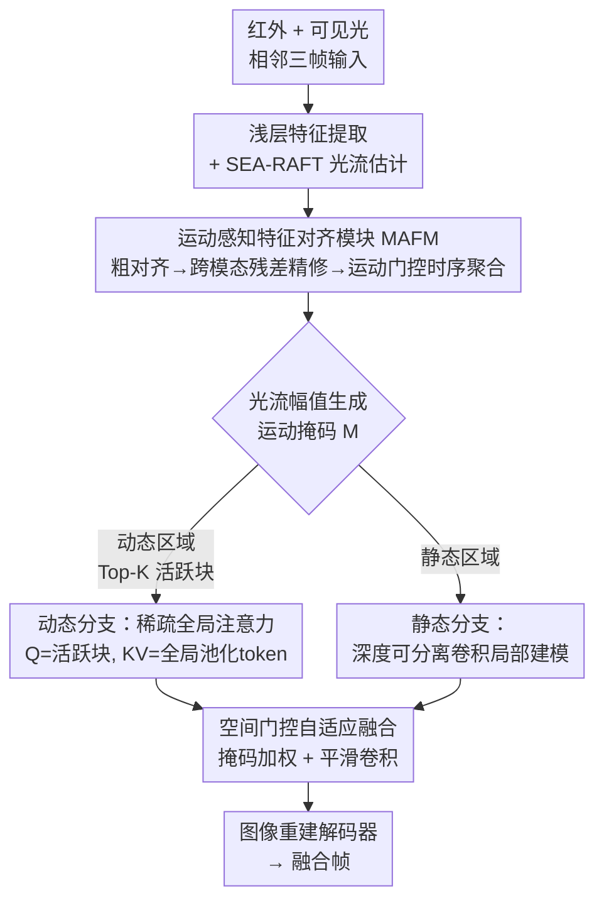

# MAVFusion: Efficient Infrared and Visible Video Fusion via Motion-Aware Sparse Interaction

**会议**: ECCV2026  
**arXiv**: [2604.01958](https://arxiv.org/abs/2604.01958)  
**代码**: [https://github.com/ixilai/MAVFusion](https://github.com/ixilai/MAVFusion)  
**领域**: 视频理解  
**关键词**: 红外与可见光视频融合, 运动感知, 稀疏注意力, 动静解耦, 光流引导

## 一句话总结

MAVFusion 提出运动感知稀疏交互机制，将红外-可见光视频融合的跨帧跨模态交互按光流先导的运动区域检测拆分为"静态背景弱交互 + 动态区域稀疏全局注意力"两条路径，在三个基准上达到 SOTA 融合质量的同时，计算量仅为现有视频融合方案的 5% 左右。

## 研究背景与动机

红外与可见光图像融合能结合红外对热目标的强显著性（高温人物、车辆）与可见光对纹理细节的丰富呈现，在安防监控、自动驾驶、夜间侦察等场景有重要应用。然而绝大多数融合方法面向**单帧图像**设计，忽略了帧间时序依赖，直接迁移到视频场景时会产生闪烁、鬼影等问题。已有的视频融合方法虽然通过引入跨帧交互（如 3D 卷积、全局注意力）改善了时序一致性，但代价极高——它们对整帧的所有区域施加同等密度的注意力计算，而视频中大量区域是静态背景（道路、墙壁、草地），这些区域的跨帧融合实际只需要简单稳定的纹理保持，却被强交互浪费了大量算力。

这种"无差别全局建模"的核心矛盾在于：视频天然提供了运动线索——光流可以精准定位哪些区域正在发生实质性变化（人物走动、车辆移动、相机抖动），这些区域才真正需要复杂的跨帧跨模态交互来消除鬼影并捕获时序显著目标。而静态背景区域占画面大部分面积，用强交互反而可能引入红外噪声或平滑掉可见光的清晰纹理，损害融合质量。

本文的切入角度是：用光流作为先导，把融合交互按动静区域解耦，只在关键运动区域投入高计算量。**核心 idea：设计光流引导的运动感知稀疏交互框架，通过光流生成运动掩码将视频帧划分为动态区域（Top-K 稀疏注意力做全局跨模态交互）与静态区域（深度可分离卷积做轻量局部保持）两条路径，配合跨模态残差光流对齐模块消除帧间鬼影，在计算量降低 20 倍的同时达到 SOTA 融合质量。**

## 方法详解

### 整体框架

MAVFusion 整体为四阶段流水线：输入红外和可见光双模态相邻三帧 → 浅层特征提取 + 光流估计 → 运动感知特征对齐模块（MAFM）做跨帧对齐与时序聚合 → 运动引导双路交互模块（MDIM）按动静区域分离处理 → 图像重建解码器输出融合结果。

### 关键设计

**1. 运动感知特征对齐模块（MAFM）：粗到精的跨模态时序对齐**

相邻帧间物体运动会导致直接融合产生鬼影和模糊。MAFM 先在下采样分辨率上用冻结的 SEA-RAFT 估计帧间光流做粗对齐，再将可见光帧的特征作为空间锚点，与粗对齐后的三帧特征及原始光流一同拼入一个轻量残差预测网络（深度可分离卷积构成），输出残差光流 $\Delta\phi$ 来修正模态间的空间偏差。精修后的中心帧特征与对齐后的相邻帧特征通过可学习的 Softmax 加权时序聚合。但聚合后的特征并非直接全图替换——MAFM 用光流幅值计算的运动掩码作为软门控：动态区域注入多帧聚合信息以消除鬼影，静态区域则主要依赖单帧特征以保持背景稳定。这个逐像素软门控机制避免了不必要的跨帧混合，是后续动静解耦交互的基础。

**2. 动静解耦双路交互模块（MDIM）：运动引导的稀疏注意力 + 静态轻量保持**

MDIM 的核心在于用运动掩码 $M$ 区分两条处理路径。动态分支先将特征切为 $p \times p$ 的不重叠块，对每块做运动掩码的自适应平均池化得到一个显著性分数 $S$，保留 Top-$\tau$（$\tau=0.3$）的活跃块索引集 $\Omega$。这些活跃块的特征作为 Query，而所有块的全局池化 token 作为 Key/Value，构成一个"不对称稀疏注意力"：复杂度从 $\mathcal{O}(N^2)$ 降至 $\mathcal{O}(k\cdot N)$（$k$ 为活跃块数，通常 $k \approx 0.3N$）。注意这里使用相对排序（Top-K 而非硬阈值策略，即使在相机抖动的大幅运动场景中也能稳健框出相对运动最强的目标前景。静态分支则简单使用 $3\times 3$ 深度可分离卷积局部建模，以极低成本保留背景纹理。

**3. 空间门控自适应特征重建：避免动静边界接缝伪影**

动态分支输出的稀疏注意力特征经显著性权重 $W$ 加权后通过索引拷贝散回到原始空间位置，而静态分支保留了全图特征。两者用上采样后的运动掩码 $M$ 做空间软门控混合，再经过一个 $3\times 3$ 平滑卷积消除因块划分产生的拼接伪影，保证动态增强区域与静态保留区域的平滑语义过渡。

### 损失函数

总损失由空间损失 $\mathcal{L}_{spatial}$（像素相似度 + SSIM）保持单帧融合质量，和时序一致性损失 $\mathcal{L}_{temp}$ 约束相邻帧间的光流引导帧差，加权重 $\gamma$ 平衡两项。

## 实验关键数据

### 主实验

在 M3SVD、HDO、VTMOT 三个红外-可见光视频数据集上与 7 个图像融合方法（UP-Fusion、TDFusion、SAGE、GIFNet、RFFusion、UMCFuse、FreeFusion）和 2 个视频融合方法（VideoFusion、UniVF）对比。

| 数据集 | 指标 | MAVFusion | 之前最佳（UniVF） | 提升幅度 |
|--------|------|-----------|-------------------|----------|
| M3SVD | Q_G↑ | **0.6897** | 0.6376 | +8.2% |
| M3SVD | Q_M↑ | **1.1544** | 0.5661 | +103.9% |
| M3SVD | Q_AB/F↑ | **0.7550** | 0.7049 | +7.1% |
| HDO | Q_G↑ | **0.6629** | 0.6125 | +8.2% |
| HDO | Q_M↑ | **0.9996** | 0.7655 | +30.6% |
| VTMOT | Q_G↑ | **0.6325** | 0.5724 | +10.5% |
| VTMOT | Q_M↑ | **0.9741** | 0.8993 | +8.3% |

计算效率方面，在 640×480 分辨率下 MAVFusion 仅 123.37G FLOPs（VideoFusion 的 6.6%、UniVF 的 5.7%），达到 14.16 FPS；1280×720 下 267.88G FLOPs（VideoFusion 的 4.8%、UniVF 的 3.8%），且像素增加 3 倍时 FLOPs 仅增 2.17 倍，可扩展性优异。

### 消融实验

| 配置 | Q_G↑ | Q_M↑ | MS2R↓ | 说明 |
|------|------|------|-------|------|
| Full（完整模型） | **0.6325** | **0.9741** | **0.8301** | 动静分离 + 稀疏注意 + MAFM |
| Full-DB（全动态分支） | 0.6276 | 0.9282 | 0.9878 | 全图强交互，注意分散、背景干扰 |
| Full-SB（全静态分支） | 0.6260 | 0.9550 | 0.9913 | 无动态增强，运动目标模糊，MS2R 恶化 |
| w/ IM（反转掩码） | 0.5880 | 0.7863 | 0.9842 | 静态区强交互引入红外噪声，纹理模糊 |
| w/o SA（替换为密集注意） | 0.6080 | 0.8351 | 0.9662 | 注意分布分散，局部细节退化 |
| w/o MAFM（替换为 UniVF 对齐） | 0.5972 | 0.7820 | 0.9799 | 无跨模态锚点精修，鬼影增多 |

### 关键发现

- **动静分离策略最核心**：Full-DB 实验表明，对全图施加全局强交互不仅浪费算力，还会让显著目标和背景在注意力竞争中相互削弱；反转掩码（动态区给弱交互、静态区给强交互）质量下降最明显，说明**哪类区域该用哪种交互模式不可互换**。
- **稀疏注意力效果优于密集注意力**：w/o SA 显示，将稀疏注意替换为密集 Patch 内全连接注意力后，虽然指标下降不算剧烈，但目视细节退化，说明密集覆盖了冗余信息反而平滑了局部特征。
- **前端光流成本是主要局限**：虽然融合网络计算量极低，但 SEA-RAFT 光流估计的前端开销仍是瓶颈（文中讨论可换用轻量光流模型来进一步加速）。

## 亮点与洞察

- **"动静解耦"思路具有通用性**：红外-可见光融合中运动区域和静态区域需要截然不同的交互模式，这一观察可迁移到其他多模态视频任务（如视频深度估计、视频语义分割）——只要场景符合"大部分背景静止 + 小部分前景运动"的分布。
- **不对称稀疏注意力的设计巧妙**：用全局池化的所有 Patch token 做 KV、仅活跃块做 Q，既保留了全局感受野（活跃块能看到所有位置的上下文）又把 Q 侧复杂度降低到 $O(kN)$，比直接用局部窗口更灵活。
- **Top-K 相对排序优于固定阈值**：相对排序策略对相机抖动和大幅运动场景鲁棒，不会因为全局运动量增大就把整个画面划入"动态区"导致稀疏注意退化为密集注意。

## 局限与展望

- 作者指出严重传感器噪声或极端退化（如完全无光线下的可见光通道）仍可能破坏模态特征提取，模型难以完全抑制退化伪影。
- 当前光流模型使用冻结的 SEA-RAFT，额外开销占运行时间的大头；后续可探索端到端联合训练轻量运动估计器，或直接用运动检测替代光流以进一步加速。
- 动静解耦假设场景中大部分区域静止，对于密集运动场景（如体育赛事、拥挤街道）效果可能会打折，Top-K 保留比 $\tau=0.3$ 可能需要自适应调整。

## 相关工作与启发

- **vs UniVF（NeurIPS 2025）**: UniVF 通过多帧学习 + 光流特征配准提升时序一致性，但依然对全图进行全局建模，计算量约 MAVFusion 的 18 倍。MAVFusion 的动静解耦直接省去了静态背景的冗余交互。
- **vs VideoFusion（CVPR 2026）**: 同样面向视频融合，使用分层融合策略减少帧间特征差异，但计算量是 1874G FLOPs（640×480），约为 MAVFusion 的 15 倍。
- **vs 图像融合方法（UP-Fusion、TDFusion 等）**: 这些方法忽略时序建模，在视频场景下产生鬼影和闪烁；MAVFusion 的 MAFM 模块和时序损失显式解决了这一问题。

## 评分

- 新颖性: ⭐⭐⭐⭐  将"视频中大部分区域静止"的观察转化为动静解耦交互框架，稀疏不对称注意力的应用在融合任务中较新颖
- 实验充分度: ⭐⭐⭐⭐⭐  三个数据集、八项指标、详尽的消融（5种配置）、下游检测任务验证、计算效率全面对比
- 写作质量: ⭐⭐⭐⭐  动机清晰、设计点之间的逻辑链完整，但部分公式标注略显冗余
- 价值: ⭐⭐⭐⭐⭐  为红外-可见光视频融合提供了极实用的高效方案，动静解耦的设计范式可推广至其他多模态视频任务

<!-- RELATED:START -->

## 相关论文

- [\[CVPR 2026\] InterRVOS: Interaction-Aware Referring Video Object Segmentation](../../CVPR2026/video_understanding/interrvos_interaction-aware_referring_video_object_segmentation.md)
- [\[ECCV 2026\] Sink-Token-Aware Pruning for Fine-Grained Video Understanding in Efficient Video LLMs](sink-token-aware_pruning_for_fine-grained_video_understanding_in_efficient_video.md)
- [\[AAAI 2026\] Explicit Temporal-Semantic Modeling for Dense Video Captioning via Context-Aware Cross-Modal Interaction](../../AAAI2026/video_understanding/explicit_temporal-semantic_modeling_for_dense_video_captioning_via_context-aware.md)
- [\[AAAI 2026\] PlugTrack: Multi-Perceptive Motion Analysis for Adaptive Fusion in Multi-Object Tracking](../../AAAI2026/video_understanding/plugtrack_multi-perceptive_motion_analysis_for_adaptive_fusion_in_multi-object_t.md)
- [\[ICCV 2025\] Sparse-Dense Side-Tuner for Efficient Video Temporal Grounding](../../ICCV2025/video_understanding/sparse-dense_side-tuner_for_efficient_video_temporal_grounding.md)

<!-- RELATED:END -->
