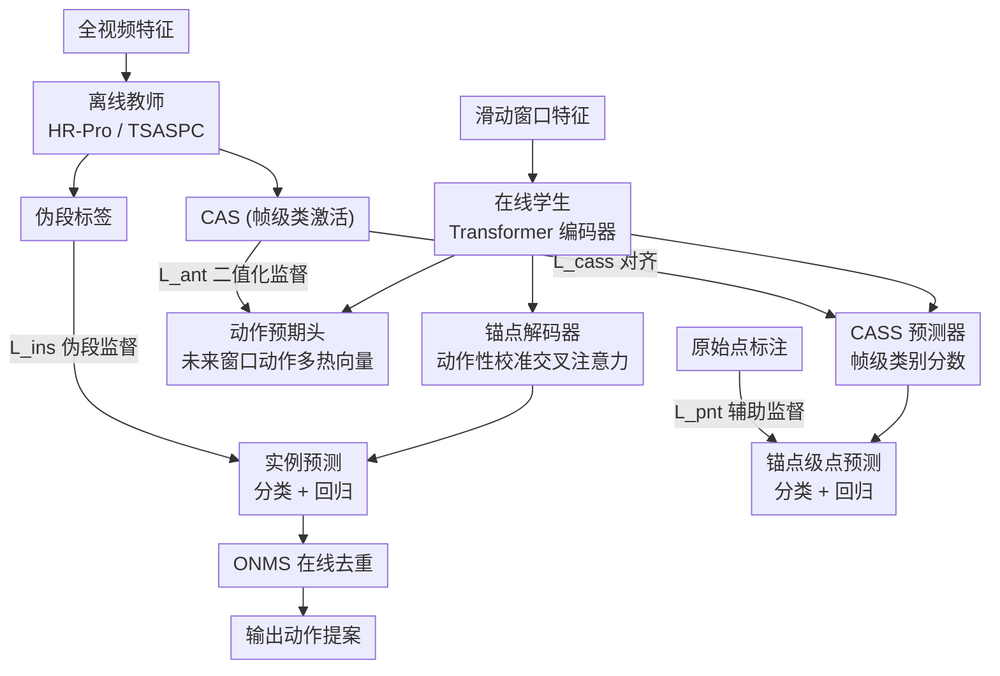

# OnPoint: Offline-to-Online Multi-Level Distillation for Point-Supervised Online Temporal Action Localization

**会议**: ECCV 2026  
**arXiv**: [2607.00289](https://arxiv.org/abs/2607.00289)  
**代码**: 无（受 NDA 限制未开源，但提供了详细实现描述和 pseudocode）  
**项目页**: [https://sakibreza.github.io/OnPoint/](https://sakibreza.github.io/OnPoint/)  
**领域**: 视频理解  
**关键词**: 点监督时序动作定位, 在线学习, 离线到在线蒸馏, 动作性校准注意力, 滑动窗口检测

## 一句话总结
OnPoint 提出离线到在线的多级蒸馏框架，用仅需单帧点标注的离线教师模型生成伪段标签、帧级类激活序列（CAS）和窗口级动作预期信号，通过实例级、帧级、窗口级三层蒸馏注入严格在线的学生模型，辅以动作性校准注意力解码和锚点级原始点监督来稳定训练，在五个数据集上一致超越强基线（THUMOS 上平均 mAP 提升 4.8%，最高 +7.0%），首次打通了点监督在线时序动作定位（POTAL）这一新任务。

## 研究背景与动机

**领域现状**：时序动作定位（TAL）主流方法依赖两种强假设——训练时需要完整的动作起止边界标注（segment-level supervision），推理时可以访问整段视频的全部帧（offline inference）。近年来，在线时序动作定位（OnTAL）放松了推理假设，允许在流式视频中逐帧输出预测，但仍需全段标注训练；点监督时序动作定位（PS-TAL）放松了标注假设，每个动作实例只需标注一个时间戳即可训练，但仍需离线全视频推理。

**现有痛点**：两个方向的放松从未被同时满足。OnTAL 方法（如 OAT、HAT、MATR）需要昂贵的全段标注，在持续录制的真实场景中标注成本过高；PS-TAL 方法（如 HR-Pro、TSASPC、LACP）虽然标注效率提升可达 6 倍，但依赖全视频上下文来从稀疏点推断边界，无法直接用于流式推理。简单叠加两者会导致标注假设崩塌或打破在线约束——直接从点标注训练在线模型，既缺少边界信息又缺少未来上下文，性能极差（论文中蒸馏自由基线在 THUMOS 上仅 33.3% avg mAP@0.1:0.5）。

**核心矛盾**：点标注只提供"动作中间大致在哪"的信号，缺乏起止边界信息；在线推理又剥夺了模型向后看的能力。两者叠加意味着模型既不知道动作从哪开始到哪结束，也无法通过观察完整视频来推断——这正是 POTAL 比单独 PS-TAL 或单独 OnTAL 都困难的根本原因。

**本文目标**：(1) 正式定义 POTAL 新任务，建立评估协议和强基线；(2) 提出能在该任务上有效工作的方法，缩小与全监督在线方法乃至离线点监督方法的性能差距。

**切入角度**：作者观察到，虽然点标注本身信息量少，但离线模型可以利用全视频上下文将其"放大"为高质量的伪段标签和帧级激活序列。如果让一个离线教师先消化全视频、生成结构化的中间表示，再把这些知识蒸馏到一个严格因果的在线学生中，就绕过了"在线模型从稀疏点直接学习"的困难。这个思路在视频实例分割、时空动作检测等领域已有离线到在线蒸馏的先例，但在 TAL 中从未被探索。

**核心 idea**：用点监督离线 TAL 教师的全视频推理能力，通过伪段标签、帧级 CAS 对齐和窗口级动作预期三条蒸馏路径，把"全视频才有的知识"注入仅看滑动窗口的在线学生。

## 方法详解

### 整体框架

OnPoint 是一个"教师-学生"蒸馏框架，核心思路是让一个点监督训练的离线 TAL 模型先看完整视频产生高质量伪标签和中间表示，再通过多级蒸馏信号训练一个严格在线的学生模型。教师模型在训练阶段冻结，推理时被丢弃，只有学生模型参与部署。

输入是一段流式视频的特征序列，学生模型以滑动窗口方式逐窗处理：在每个时间步 t，取当前帧及前 W-1 帧组成特征窗口 X_t，经 Transformer 编码器提取窗口特征 F_t，然后分三路输出——CASS 预测器给出帧级类别分数，动作预期头给出未来窗口内可能出现哪些动作的多热向量，锚点解码器结合动作性校准注意力生成锚点特征并做分类/回归得到动作提案。最终通过在线 NMS（ONMS）去重并输出。

教师模型提供三种蒸馏信号：(1) 实例级伪段标签监督锚点分类回归；(2) 帧级 CAS 监督 CASS 预测器；(3) 未来窗口的 CAS 二值化后监督预期头。此外，原始点标注通过辅助锚点级点预测头注入学生，提供不依赖教师的可靠监督信号。

### 关键设计

**1. 类激活子序列（CASS）蒸馏与动作性校准注意力解码：将教师的全视频帧级知识压缩进在线窗口，并用动作性先验引导锚点解码**

直接训练在线模型做边界回归是困难的，因为点标注本身没有边界信息。OnPoint 让教师模型先生成整个视频的类激活序列 CAS $\in \mathbb{R}^{T \times (C+1)}$，其中每帧都有一个 C+1 维的类别分数向量（含背景通道），这是一个密集的、富含时序结构信息的表示。

学生的 CASS 预测器是一个两层 MLP（ReLU 激活），从窗口特征 F_t 映射到窗口内每帧的类别分数 $\hat{A}_t \in \mathbb{R}^{W \times (C+1)}$，用 L2 损失与教师 CAS 的对应子段对齐：$\mathcal{L}_{\text{cass}} = \frac{1}{W}\sum_{i=1}^{W}\|\hat{A}_t[i] - A_t^{\text{teacher}}[i]\|_2^2$。这个信号让在线主干学到时序精确、类别可分的帧级表示，即使看不到未来帧也能捕捉细微的动作转场。

更有巧思的是，CASS 的输出还被用来校准锚点解码器的交叉注意力。具体做法：从 CASS 的背景通道分数取反得到动作性分数 $r = 1 - \sigma(A_t^{(C+1)})$，再用变换 $\bar{r} = r + \log(r)$ 将其映射为正负对称的偏置项（高动作性帧为正偏置、低动作性帧为负偏置），直接加到 Transformer decoder 的交叉注意力 logit 上：$\text{Softmax}(\frac{\mathcal{Q}\mathcal{K}^\top}{\sqrt{D}} + \bar{r}^\top)\mathcal{V}$。这让锚点查询在聚合窗口特征时天然倾向动作帧、抑制背景帧，无需显式的位置编码或额外的门控机制。作者在实验中对比了仅抑制、仅增强、直接乘注意力图等变体，$\bar{r}=r+\log(r)$ 的组合变换效果最好（avg mAP 61.9 vs 61.5/61.3/58.3/59.8），因为它同时实现了"高动作性增强、低动作性抑制"的双向偏置。

**2. 窗口级动作预期蒸馏：用未来窗口的动作存在性信息补偿在线推理缺失的"向前看"能力**

在线模型在时刻 t 看不到 t 之后的帧，因此对即将开始或正在进行的动作缺乏预判。OnPoint 通过一个窗口级动作预期头来弥补这一缺陷：将窗口特征 F_t 降维后经两层 FC（ReLU + Sigmoid）输出一个多热向量 $\hat{y} \in [0,1]^{C+1}$，表示未来 W' 帧内每个动作类别是否会出现。

监督信号来自教师 CAS 的未来段：取未来 W' 帧的 CAS，以 0.5 阈值二值化为多热目标向量 y，用二值交叉熵训练：$\mathcal{L}_{\text{ant}} = -\sum_{c=1}^{C}[y_c \log(\hat{y}_c) + (1-y_c)\log(1-\hat{y}_c)]$。关键设计在于 W' 的选择——太小则预期窗口与当前动作高度重叠、信息增量有限，太大则远端事件稀释监督信号。在 THUMOS 上 W'=16 达到最优（61.9% avg mAP），多尺度窗口和自适应窗口等替代策略均未超越这个简单固定窗口方案。这个设计让在线模型提前"知道"接下来可能出现什么动作，从而更及时地在边界处做出响应。

**3. 锚点级辅助点监督：用原始点标注作为不依赖教师的"锚"来稳定训练、抑制噪声传播**

蒸馏框架的固有风险是教师的伪标签并非完美——如果教师在某段视频上产生错误伪段或噪声 CAS，这些错误会通过 L_ins 和 L_cass 传播给学生。OnPoint 通过一个锚点级点预测模块将原始点标注直接注入学生训练，作为一个弱但完全可靠的辅助监督信号。

该模块包含分类头和回归头（各为一个两层 MLP），接在锚点解码器的锚点特征上：(1) 分类头判断某个锚点内是否包含标注点及其动作类别，用交叉熵监督；(2) 回归头估计锚点中心到标注点的归一化距离，用 L1 损失：$\mathcal{L}_{\text{pr}} = \frac{1}{N_p}\sum_{j=1}^{N_p}\left|\hat{d}_j - \frac{|c_a - p_j|}{l_a}\right|$，其中 $c_a$ 为锚点中心、$p_j$ 为标注点位置、$l_a$ 为锚点长度。这利用了作者和先前工作 [ma2020sf] 共同的观察——人类标注的点倾向于集中在动作中点附近，呈类高斯分布——因此鼓励模型倾向中点附近的锚点、抑制远离的锚点。

这个设计的价值在噪声鲁棒性实验中得到充分验证：当向教师 CAS 注入递增的均匀噪声（模拟教师质量下降）时，带点监督的模型性能衰减显著更平缓，始终优于不带点监督的变体。去掉整个点预测模块导致 THUMOS 上 avg mAP 下降 3.5%（61.9→58.4），单独去掉分类头或回归头也分别降至 58.8 和 59.5。

### 损失函数 / 训练策略

总损失为四个分量的加权和：$\mathcal{L}_{\text{total}} = \alpha\mathcal{L}_{\text{ins}} + \beta\mathcal{L}_{\text{cass}} + \gamma\mathcal{L}_{\text{ant}} + \delta\mathcal{L}_{\text{pnt}}$。

其中 $\mathcal{L}_{\text{ins}}$ 是锚点级实例预测损失（分类交叉熵 + 回归 L1，用教师伪段标签监督），$\mathcal{L}_{\text{cass}}$ 是 CASS 对齐 L2 损失，$\mathcal{L}_{\text{ant}}$ 是预期头 BCE 损失，$\mathcal{L}_{\text{pnt}}$ 是点预测损失（分类 CE + 回归 L1）。

作者实验发现设 $\alpha=\beta=\delta=1$ 是最稳的默认配置，仅需调节 $\gamma$（THUMOS 上 $\gamma=1.0$，EGTEA/HOI4D-O 上 $\gamma=0.8$，差异很小），大幅降低了超参调优负担。优化器用 Adam（lr=1e-4，weight decay=1e-4）。

推理时仅使用实例预测头的输出，经 ONMS 去重并过滤预测结束时间在当前时刻之后的提案（避免覆盖未来可能更准的预测）。CASS 预测器和预期头不参与推理，仅在训练中提供表示学习信号。

## 实验关键数据

### 主实验

OnPoint 在五个数据集上评估：THUMOS'14（体育动作）、EGTEA（第一人称厨房）、HOI4D-O（第一人称办公）、FineAction（细粒度密集动作）、EPIC-Kitchens-100（大规模第一人称厨房）。所有训练仅用点标注。

**THUMOS'14 主结果（mAP@tIoU）**：

| 方法 | 0.3 | 0.4 | 0.5 | AVG[0.1:0.5] | AVG[0.1:0.7] |
|------|-----|-----|-----|-------------|-------------|
| 蒸馏自由基线* | 31.8 | 18.4 | 10.3 | 33.3 | 24.8 |
| HR-Pro + OAT-ONMS* | 58.7 | 49.3 | 40.1 | 55.7 | 46.3 |
| HR-Pro + HAT* | 48.9 | 39.3 | 28.2 | 46.0 | 36.2 |
| HR-Pro + MATR-ONMS* | 56.5 | 48.2 | 36.7 | 54.2 | 44.5 |
| **OnPoint (Ours)** | **63.9** | **56.3** | **45.2** | **61.9** | **51.1** |
| 参考：全监督在线 MATR-ONMS | 70.3 | 62.7 | 52.1 | - | 49.5 |
| 参考：离线点监督 HR-Pro | 74.3 | 64.3 | 52.2 | 71.6 | 60.3 |

OnPoint 在所有 tIoU 阈值上一致超越蒸馏基线，AVG[0.1:0.7] 比最强基线 HR-Pro+OAT-ONMS 高 4.8 个百分点，且超越了若干早期的全监督在线方法（如 CAG-QIL、2PESNet、SimOn）。

**EGTEA 与 HOI4D-O 结果（avg mAP@[0.1:0.5]）**：

| 方法 | EGTEA | HOI4D-O |
|------|-------|---------|
| 蒸馏自由基线* | 14.3 | 20.6 |
| TSASPC + OAT-ONMS* | 19.7 | 42.3 |
| TSASPC + HAT* | 16.6 | 42.0 |
| TSASPC + MATR* | 14.5 | 41.6 |
| **OnPoint (Ours)** | **23.1** | **44.6** |
| 参考：全监督在线 OAT-ONMS | 23.7 | 48.8 |

在 EGEA 上提升 3.4 个百分点，HOI4D-O 上提升 2.3 个百分点。EPIC-Kitchens-100 上从 8.5% 提升至 10.5%，FineAction 上从 5.3% 提升至 7.4%。

### 消融实验

**多级蒸馏组件消融（THUMOS'14）**：

| 配置 | AVG mAP@[0.1:0.5] | 说明 |
|------|-------------------|------|
| OnPoint 完整模型 | 61.9 | 全部组件 |
| w/o 窗口预期蒸馏 (WAD) | 60.0 | 去掉未来窗口预期，降 1.9 |
| w/o 动作性校准注意力 (ASAC) | 59.9 | 去掉注意力偏置，降 2.0 |
| w/o CASS蒸馏 + ASAC | 58.5 | 同时去掉帧级监督和注意力校准，降 3.4 |
| w/o ASAC + WAD | 58.0 | 去掉两个蒸馏分支，降 3.9 |
| w/o 所有三者 | 57.5 | 仅剩实例蒸馏和点监督，降 4.4 |

**锚点级点监督消融（THUMOS'14）**：

| 配置 | AVG mAP@[0.1:0.5] | 说明 |
|------|-------------------|------|
| 完整模型 | 61.9 | 含点分类+点回归 |
| w/o 点分类头 | 58.8 | 去掉点分类，降 3.1 |
| w/o 点回归头 | 59.5 | 去掉点回归，降 2.4 |
| w/o 两者 | 58.4 | 纯蒸馏无点监督，降 3.5 |
| 仅点监督（蒸馏自由） | 33.3 | 无教师，纯点标注训练 |

### 关键发现

- **CASS+ASAC 组合贡献最大**：同时去掉 CASS 蒸馏和动作性校准注意力导致 3.4 个百分点下降，因为 ASAC 直接依赖 CASS 的输出作为动作性信号源，二者深度耦合。
- **点监督的核心价值在鲁棒性而非绝对精度**：单独去掉点监督仅降 3.5 个百分点（vs 去掉 WAD 或 ASAC 的 ~2 个百分点），但在教师噪声实验中，带点监督的模型在高噪声水平下性能衰减更平缓——这表明点监督更像一个"稳定器"而非性能助推器。
- **ONMS vs OSN 存在精度-响应速度权衡**：ONMS 提供更好的定位精度（61.9 vs 51.6 avg mAP），但 OSN 的检测延迟更低（AEDT -1.53 vs -0.17 秒）。选择哪个取决于应用场景对精度和实时性的偏重。
- **框架对不同离线教师泛化良好**：分别用 HR-Pro、SMBD、LACP、TSASPC 做教师，加上 OnPoint 组件后均在各自基线蒸馏上有显著提升（提升幅度 2.6-6.5 个百分点），表明该框架是教师无关的通用方案。
- **推理效率可接受**：学生模型 93M 参数、2.88 GFLOPs、312 FPS（RTX 4090），与 OAT 相当（92M/2.75/355），远优于 HAT（248M/7.09/161）和 MATR（191M/7.49/206）。

## 亮点与洞察

- **CASS 的"一石二鸟"设计**：同一个 CASS 预测既作为蒸馏目标（对齐教师 CAS），又作为动作性信号源驱动注意力校准，无需额外模块。这种"重用一个中间表示做两件不同的事"的思路简洁高效。
- **$\bar{r}=r+\log(r)$ 的动作性变换公式**：不是简单的线性缩放或阈值截断，而是用 log 函数天然实现了"低值区快速衰减、高值区平缓增长"的非对称偏置，很精巧地拟合了"背景应被强抑制、动作应被适度增强"的直觉。消融中 suppress-only（$\log r$）和 enhance-only（$r$）均不如组合变换，证明两端都重要。
- **窗口级预期蒸馏用"未来有什么动作"而非"未来边界在哪"**：预期头只预测未来窗口内动作类别的存在性（多热向量），不预测精确边界——这是务实的选择，因为预测存在性比预测边界容易得多，且这个粗粒度信息已足够让模型提前"准备"相关类别的检测。预期策略消融（固定窗口 vs 多尺度 vs 自适应 vs 下一转场预测）中简单固定窗口反而最优，说明在蒸馏场景中"稳定且可预期的监督"比"聪明的自适应机制"更重要。
- **点监督的"锚"隐喻**：原始点标注虽然信息量小，但它来自人类标注者、不依赖教师、零噪声传播——在蒸馏框架中作用类似于一种"无偏的弱基准"，防止学生被教师的系统性偏差带偏。这个思路可以迁移到任何使用伪标签蒸馏的任务中：保留一小部分原始弱标注作为"锚定信号"。

## 局限与展望

- **代码未开源**：受 NDA 限制，作者无法发布完整源码。虽然提供了详细的架构描述和 pseudocode，但复现仍有门槛。
- **依赖强离线教师**：OnPoint 的性能上限由离线教师决定。如果教师在某些动作类别或场景上表现差（如 HR-Pro 在密集动作数据集 EGTEA 上仅 12.5% mAP），学生也会受限。教师质量的敏感性需要更系统的分析。
- **点标注的中心性假设**：锚点级点回归头依赖"标注点靠近动作中心"这一假设，如果实际标注者习惯标注动作起点或终点，该模块的效果可能下降。作者仅在 THUMOS 上验证了这一假设，在其他数据集上的标注分布尚不明确。
- **预期窗口大小需逐数据集调优**：虽然作者声称仅需调 $\gamma$，但 W' 在 THUMOS 上最优为 16，不同数据集的平均动作长度差异较大时可能需要重新搜索，缺乏自适应机制。
- **动作性校准的跨层行为未充分分析**：论文仅在最后一层做了注意力可视化，但 r_bar 偏置是加到每层 decoder 交叉注意力的——各层的校准效果是否一致、深层是否比浅层更依赖该偏置，缺少逐层消融。

## 相关工作与启发

- **vs PS-TAL（HR-Pro, TSASPC, LACP）**：这些方法用点标注在离线设定下做 TAL，依赖全视频上下文进行伪标签生成和边界细化。OnPoint 将它们作为教师，把离线能力蒸馏到在线学生，本质上是"借用了 PS-TAL 的全视频推理能力但并不让它们在线运行"。
- **vs OnTAL（OAT, HAT, MATR）**：这些方法是 OnPoint 的学生基座——OAT 的锚点解码器、MATR 的 ONMS 都被 OnPoint 复用。区别在于它们需要全段标注训练，而 OnPoint 的学生通过蒸馏从点标注间接获得了等效于全段标注的监督。
- **vs 通用离线到在线蒸馏（DSTA [patel2026distilling], 视频实例分割 [kim2024offline]）**：这些工作也在做离线到在线的知识迁移，但蒸馏对象是空间注意力或 RoI 特征，教师和学生架构相似。OnPoint 的独特之处在于教师和学生架构完全不同（教师是全视频 TAL 模型，学生是滑动窗口检测器），且蒸馏的是"时序知识"（伪段、CAS、预期）而非"表示对齐"——这对 TAL 领域更有参考价值。
- **vs 多模态大模型标注（Gemini 2.5 Flash）**：论文辅助实验显示 Gemini 在 THUMOS 上生成的全段伪标签仅 29.2% mAP，点标签仅 30.9% mAP，远低于任务专用模型（90.3%/81.6%）——这说明当前 MLLM 在精确时序定位上仍不可靠，专门训练的轻量模型在特定任务上仍是更优选择。

## 评分

- 新颖性: ⭐⭐⭐⭐ 首次定义 POTAL 任务并给出系统解决方案，离线到在线蒸馏在 TAL 领域是新范式；CASS+动作性校准的组合设计和窗口预期蒸馏都有原创性；但各组件本身（蒸馏、CAS、预期）在各自领域并非全新概念
- 实验充分度: ⭐⭐⭐⭐⭐ 五个数据集、三个蒸馏组件消融、注意力校准变体消融、点监督消融、教师噪声鲁棒性分析、损失函数对比（6 种 CASS loss）、超参敏感性、推理效率、在线后处理对比、预期策略对比——实验设计全面且深入
- 写作质量: ⭐⭐⭐⭐ 任务定义清晰、方法流程图配合公式讲得比较清楚；但部分关键细节（如离线教师的后处理流程、伪段质量的具体指标）被放在补充材料中，主干对有经验的读者可能需要跳转查阅
- 价值: ⭐⭐⭐⭐ POTAL 是一个务实的问题设定（标注成本低 + 可流式部署），OnPoint 的性能虽未超越全监督方法，但在标签效率和在线推理之间找到了一个可工作的平衡点，为后续研究建立了可靠的基线和框架

<!-- RELATED:START -->

## 相关论文

- [\[ECCV 2024\] Online Temporal Action Localization with Memory-Augmented Transformer](../../ECCV2024/video_understanding/online_temporal_action_localization_with_memory-augmented_transformer.md)
- [\[ECCV 2024\] HAT: History-Augmented Anchor Transformer for Online Temporal Action Localization](../../ECCV2024/video_understanding/hat_history-augmented_anchor_transformer_for_online_temporal_action_localization.md)
- [\[ICCV 2025\] Online Dense Point Tracking with Streaming Memory](../../ICCV2025/video_understanding/online_dense_point_tracking_with_streaming_memory.md)
- [\[ECCV 2024\] Bayesian Evidential Deep Learning for Online Action Detection](../../ECCV2024/video_understanding/bayesian_evidential_deep_learning_for_online_action_detection.md)
- [\[ECCV 2026\] HieDG: A Hierarchical Discrete Geometry-Guided Framework for Multi-Animal Tracking](hiedg_a_hierarchical_discrete_geometry-guided_framework_for_multi-animal_trackin.md)

<!-- RELATED:END -->
