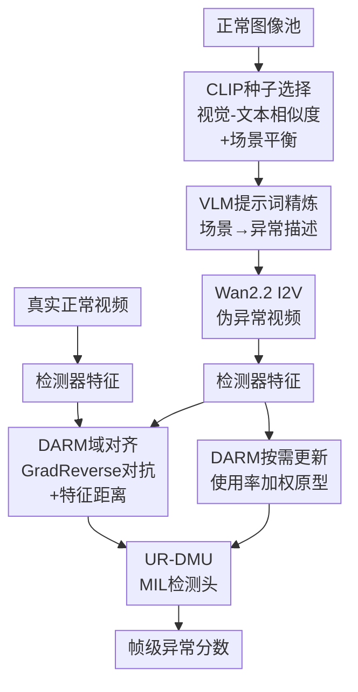

# PA-VAD: 基于扩散模型的纯伪异常视频异常检测

**会议**: ECCV2026  
**arXiv**: [2512.06845](https://arxiv.org/abs/2512.06845)  
**代码**: 无  
**领域**: 视频理解  
**关键词**: 视频异常检测, 伪异常生成, 扩散模型, 领域对齐, 记忆模块  

## 一句话总结
PA-VAD 提出一个无需任何真实异常视频的框架，通过 CLIP 引导的初始帧选择和 VLM 提示词精炼驱动视频扩散模型合成类感知的伪异常片段，并设计领域对齐正则化模块（DARM）抑制伪异常在特征空间中的幅度偏差，在 ShanghaiTech (98.2% AUC)、UCF-Crime (82.5%) 和 XD-Violence (95.1%) 上超越 UVAD SOTA，甚至超过部分使用真实异常视频的 WVAD 方法。

## 研究背景与动机

视频异常检测（VAD）的目标是从监控视频中自动识别异常事件，如攻击、交通事故、盗窃等。现有方法分为两支：无监督方法（UVAD）仅用正常数据训练，通过重建误差或预测偏差判定异常，但分布漂移下假阳性高、场景泛化弱；弱监督方法（WVAD）依赖视频级标签的异常片段训练 MIL 检测器，效果更好，但大规模采集真实异常视频成本极高，且受安全和隐私约束——很多异常场景本身稀有、难以系统性收集。两种路线各有限制，但共享一个矛盾：要么只能检测已知的正常模式（UVAD），要么需要昂贵的异常数据（WVAD）。

为了缓解异常数据稀缺，一个直观方向是合成伪异常。现有工作要么将合成片段与真实异常混合训练（如 GVVAD），仍保留对真实异常视频的依赖；要么基于启发式编辑或窄生成先验，合成多样性和真实性有限。核心挑战在于：能否完全摆脱真实异常视频的依赖，仅靠合成数据训练出可匹敌甚至超越真实数据方案的检测器？

本文的关键发现是，扩散模型合成的伪异常虽然在像素层面逼真，但在特征空间中暴露出显著的时空幅度偏差——伪异常片段的 feature norm 可达真实异常的 20 倍以上。如果直接输入标准 MIL 管道，Top-k 选择会偏向几个高 norm 实例，检测器学到的实际上是 shortcuts 而非真正的异常语义。基于这一洞察，**核心 idea：提出 PA-VAD，通过类感知伪异常生成器（CA-PAG）以 CLIP 选帧 + VLM 写提示词的方式驱动 I2V 扩散模型合成高质量伪异常视频，并设计领域对齐正则化模块（DARM），结合域对抗对齐和按需使用率记忆更新，从全局统计和局部原型两个层面消除伪异常幅度偏差，首次实现完全无需真实异常视频的弱监督 VAD，且达到超越 WVAD 真实方案的水平。**

## 方法详解

### 整体框架

PA-VAD 的训练管线分两个阶段。第一阶段是离线伪异常生成：从真实正常视频池中选取初始帧，经 CLIP 视觉-文本相似度筛选出与目标异常类别语义最匹配的种子帧，再用 VLM 根据种子帧场景生成精细化异常提示词，驱动 Wan2.2 图像到视频扩散模型合成伪异常片段。第二阶段是检测器训练：将真实正常视频和合成的伪异常视频经特征提取器送入 UR-DMU 骨干，并施加 DARM 的两个正则化——域对齐缩小真实/伪分布间的统计偏差，按需使用率记忆更新防止原型集中在少数高 norm slot 上，最后通过 MIL ranking loss 输出帧级异常分数。

### 关键设计

**1. CLIP 引导的初始帧选择：锚定生成到类相关场景**

随机从正常视频池采样初始帧容易产生语义错配——例如为 "Road Accident" 类选中室内家居场景。CA-PAG 用 CLIP 在联合视觉-文本空间中对每一帧打分：以类名拼接正短语（surveillance style, CCTV）构造正查询，用负短语（black screen, logo, dashboard UI）抑制非监控干扰，最终得分为 `s(I, c) = ⟨v̂(I), t̂(pos)⟩ − λ ⟨v̂(I), t̂(neg)⟩`。为避免高密度机位（如同一摄像头拍摄的大量帧）主导种子选择，引入场景平衡策略：按每个摄像头场景的计数 `count(s)^α` 比例分配预算，确保来自不同视角的帧均衡入选 Top-K。这一环节极为关键——消融显示，从随机选择（86.7% AUC）切换到 CLIP 种子选择直接拉升 8.2 个点（94.9%）。

**2. VLM 驱动的提示词精炼：将粗类名转化为场景感知的异常文本**

仅靠原始类名作为扩散模型提示词（如 "Generate fighting"）语义模糊，生成结果常出现物体消失/合并、不自然运动等伪影。CA-PAG 用 Qwen3 30B-A3B VLM 分析每个种子帧的视觉内容（物体、布局、亮度），输出一段简短且场景一致的异常描述，如将 "Generate burglary" 精炼为 "a person reaches behind a store counter to rummage through items while another stands watching from the front"。精炼后的提示词再拼接固定相机、自然运动等模板，输入 Wan2.2 I2V 模型（832×480，81 帧，25 采样步）合成伪异常片段。这一精炼显著提升了生成质量：FVD 从 701 降到 604，KVD 从 57.4 降到 34.7，且时序连续性和物理合理性明显改善。

**3. 领域对齐正则化：从全局分布消除幅度偏差**

合成的伪异常倾向于包含过度的运动、物理不合理的帧切换和时间不一致，导致其特征在检测器空间的 ℓ2 norm 急剧膨胀——例如在 ShanghaiTech 上，伪异常特征平均 norm 为 199.48，而真实异常仅 9.13（超过 20 倍）。这会直接干扰 MIL 的 Top-k 排序，使高 norm 伪实例主导损失。DARM 引入 DANN 风格的域对齐：用一个梯度反转层加域判别器 D，迫使特征编码器无法区分真实 Normal 和伪 Normal 流的均值特征，同时施加显式的特征距离 L2 约束。域对齐的作用是全局性的——它将伪异常 norm 从 199.48 降低到 183.50（部分收窄），但仅靠它还不够。

**4. 按需使用的记忆更新：平衡异常原型覆盖，驱动开集泛化**

域对齐调整的是正常帧层面的全局统计，但异常记忆槽的激活模式仍未纠正：少数高 norm slot 被反复激活，低使用率槽难以被更新。DARM 维护一个可学习的异常记忆库 M_A（K 个 d 维原型），计算每个 slot 在当前 batch 中被 soft assignment 激活的平均使用率 u_k，然后对低使用率的 slot 施加更大的牵引力，将其拉到责任加权中心 µ_k：

`ℒ_upd = (1/K) Σ_k (ū / (u_k+ε))^β · ||m_k − µ_k||²₂`

使用率越低，分母 u_k 越小、权重越大，更新步伐越快。这一机制有两个效果：一是从根本上将伪异常的 norm 恢复到真实异常水平（SHT: 完整 DARM 后 8.39 vs 真实 9.13），二是防止记忆被少数 seen-class 特定原型垄断——这正是 DARM 在开集泛化中表现突出的原因（仅 1 个 seen class 时 XD 上 AUC 比 OpenVAD 高 16.6 点）。

### 损失函数 / 训练策略

总损失 `ℒ = ℒ_UR-DMU + λ₁ℒ_DA + λ₂ℒ_upd`。ℒ_UR-DMU 为 UR-DMU 基线的 MIL ranking loss 和不确定性控制损失；ℒ_DA 包含域对抗 BCE 损失和 Normal-伪 Normal 特征距离 L2；ℒ_upd 为使用率加权的记忆更新损失。超参：λ₁=1.0, λ₂=0.1, β=1.0，GRL 强度 λ_da=0.1~0.2，Adam 优化器，学习率 1e-4~1e-5。

## 实验关键数据

### 主实验

| 数据集 | 指标 | PA-VAD (Real/Pseudo) | 之前 UVAD SOTA | 之前 WVAD Real/Real | 对比 |
|--------|------|---------------------|----------------|---------------------|------|
| ShanghaiTech | AUC(%) | **98.2** | MGSTRL 87.5 | CMRL 97.6 | +0.6 vs 真实异常 WVAD |
| UCF-Crime | AUC(%) | **82.5** | MGSTRL 80.6 | UR-DMU 87.0 | +1.9 vs UVAD |
| XD-Violence | AUC(%) | **95.1** | — | UR-DMU 94.2 | +0.9 vs 真实异常 WVAD |

PA-VAD 在三个数据集上均大幅超越 UVAD SOTA，且在 SHT 和 XD 上甚至优于使用真实异常视频的 WVAD 方法。在 UCF-Crime 上仍与 Real/Real WVAD 有差距（论文将其归因于该数据集中长时依赖的复杂异常更多，当前 I2V 模型难以高保真合成）。

### 消融实验

| 配置 | SHT AUC | 说明 |
|------|---------|------|
| 随机初始帧 | 86.7 | 基线，无 CLIP 选择 |
| + CLIP 种子选择 | 94.9 | +8.2，锚定到类相关场景 |
| + VLM 提示词精炼 | 96.0 | +1.1，CA-PAG 完全体 |
| + 域对齐 (DA) | 96.8 | DARM 部分（全局统计对齐） |
| + 使用率更新 (Update) | 97.6~97.7 | DARM 主要驱动力 |
| 完整 DARM (DA+Update) | 98.2 | 两项正则化互补 |

### 关键发现

- **使用率感知的记忆更新是 DARM 的性能核心**：仅加 Update 就带来 1.6~1.7 个点的提升（96.0→97.6），DA 在此基础上仅贡献额外 0.5~0.6 点。两种正则化互补——DA 对齐全局统计，Update 纠正局部原型垄断。
- **幅度偏差是真实问题而非幻觉**：伪异常在检测器空间的 feature norm 膨胀至 199.48（SHT），是真实异常（9.13）的 21.8 倍。完整 DARM 将其恢复至 8.39（≈真实水平），域对齐单独仅降到 183.50——说明使用率更新在异常侧才是纠偏主力。
- **合成数量效应**：从 14 片段到 140 片段，AUC 从 85.4% 单调提升至 98.2%，在 70 片段（≈ SHT 真实异常 63 片段）时已达 96.9%，超过 140 后轻微饱和（97.7%）。
- **开集泛化显著领先**：仅用 1 个 seen class 训练时，XD 上 AUC 达 89.08%（OpenVAD 72.50%），提升 16.6 个点。这得益于使用率更新防止记忆过度专化于 seen class 原型。

## 亮点与洞察

- **"无需真实异常"的目标被首次严格实现**：不是补充或混合，而是完全替代。这比 GVVAD 等仅将合成作为真实补充的工作更进一步，打开了零采集成本 VAD 的大门。
- **幅度偏差的发现和量化是重要贡献**：该偏差被精确量化——20 倍 feature norm 差距且跨多个 backbone（I3D/Qwen/C3D）一致出现，说明是合成数据的固有属性而非特定模型效应。
- **使用率加权更新的设计巧妙且可迁移**：权重 (ū/(u_k+ε))^β 直觉清晰——使用越多更新力度越小、使用越少拉得越紧。这一思想可泛化到任何需要平衡原型覆盖的 MIL/度量学习场景。
- **DARM 同时处理 closed-set 和 open-set**：域对齐改善闭集性能，使用率更新驱动开集泛化，一套机制覆盖两个维度。

## 局限与展望

- **UCF-Crime 上仍落后于 Real/Real WVAD SOTA**（82.5% vs UR-DMU 87.0%），主要原因是长时依赖的复杂异常（如盗窃的"靠近→观察→拿取→离开"全流程）难以被当前 I2V 模型高保真合成——生成质量成为瓶颈。
- **生成成本不低**：Wan2.2 生成一个片段约 9.5 分钟（双 RTX 6000 Ada），SHT 全套约 30 小时，实际部署需权衡时间和算力。
- **依赖大模型先验**：CA-PAG 调用 CLIP + VLM + Video Diffusion 三种预训练模型，虽替代了真实异常采集，但如果目标场景与预训练分布差异大，生成效果可能退化。
- **类别知识是前提**：需要提前知道异常类名才能生成对应伪异常。真正的 zero-shot 无先验检测仍未解决。

## 相关工作与启发

- **vs GVVAD (Cai et al.)**：两者都用扩散合成伪异常，但 GVVAD 将合成片段与真实异常混合训练，PA-VAD 完全替代真实异常，并额外系统性地解决幅度偏差问题。
- **vs OpenVAD (Zhu et al.)**：OpenVAD 也做开集 VAD，但依赖真实异常参与训练。PA-VAD 仅用合成伪异常就实现更强的开集泛化，说明高质量伪异常 + 正则化训练确实可以替代真实数据。
- **vs UR-DMU**：UR-DMU 是 PA-VAD 的检测器骨干（已含双记忆库和 MIL 头），但直接在伪异常上训练时因幅度偏差退化严重。DARM 在其上增加域对齐和使用率更新，将 SHT 基线从 96.0% 提升到 98.2%。
- **vs Wan2.2 / Stable Video Diffusion**：这些 I2V 扩散模型不是为异常合成设计的。CA-PAG 的贡献在于用 CLIP 选帧 + VLM 写提示词的组合，将通用 I2V 模型适配到异常合成任务——提示词工程被系统化和自动化。

## 评分

- 新颖性: ⭐⭐⭐⭐☆ 将伪异常从"补充"升级为"替代"，系统性发现和解决幅度偏差，整体思想新颖。
- 实验充分度: ⭐⭐⭐⭐⭐ 三个基准 + 开集协议 + 详细消融 + 幅度偏差量化 + 合成数量分析，覆盖全面且有洞察。
- 写作质量: ⭐⭐⭐⭐☆ 动机和问题定义清晰，方法有层次，但详细公式和训练细节较多集中在补充材料。
- 价值: ⭐⭐⭐⭐⭐ 大幅降低 VAD 部署的数据门槛，开集泛化结果亮眼，对实际安防应用有直接推动。

<!-- RELATED:START -->

## 相关论文

- [\[AAAI 2026\] HeadHunt-VAD: Hunting Robust Anomaly-Sensitive Heads in MLLM for Tuning-Free Video Anomaly Detection](../../AAAI2026/video_understanding/headhunt-vad_hunting_robust_anomaly-sensitive_heads_in_mllm_.md)
- [\[CVPR 2026\] Fine-VAD: Towards Fine-Grained Video Anomaly Detection via Progressive Cross-Granularity Learning](../../CVPR2026/video_understanding/fine-vad_towards_fine-grained_video_anomaly_detection_via_progressive_cross-gran.md)
- [\[ECCV 2026\] MAVFusion: Efficient Infrared and Visible Video Fusion via Motion-Aware Sparse Interaction](mavfusion_efficient_infrared_and_visible_video_fusion_via_motion-aware_sparse_in.md)
- [\[ECCV 2026\] SFDATrack: Generalized Source-Free Domain Adaptive Tracking Under Adverse Weather Conditions](sfdatrack_generalized_source-free_domain_adaptive_tracking_under_adverse_weather.md)
- [\[ECCV 2026\] Triangular Consistency as a Universal Constraint for Learning Optical Flow](triangular_consistency_as_a_universal_constraint_for_learning_optical_flow.md)

<!-- RELATED:END -->
