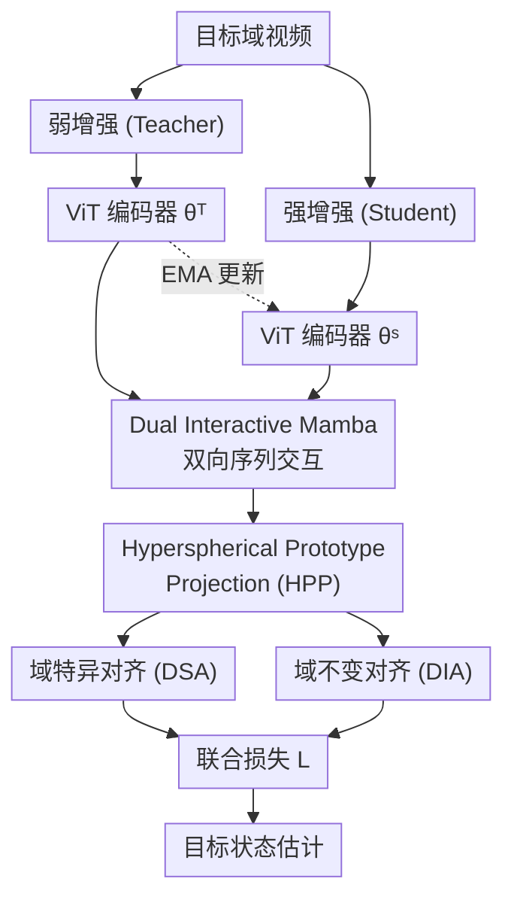

# SFDATrack: Generalized Source-Free Domain Adaptive Tracking Under Adverse Weather Conditions

**会议**: ECCV2026  
**arXiv**: [2607.00369](https://arxiv.org/abs/2607.00369)  
**代码**: [https://github.com/watcherBR0/sfdatrack](https://github.com/watcherBR0/sfdatrack)  
**领域**: 视频理解  
**关键词**: 目标跟踪, 源数据无关域自适应, 恶劣天气, Mamba, 原型投影

## 一句话总结

SFDATrack 提出首个面向恶劣天气下视觉跟踪的源数据无关域自适应框架，通过均值教师结构中的双向交互 Mamba 模块和超球面原型投影模块，在不访问任何源域数据的情况下鲁棒适应多种天气条件，在合成与真实恶劣天气跟踪基准上取得最佳性能。

## 研究背景与动机

视觉目标跟踪在自动驾驶、视频监控、具身智能等应用中扮演着基础角色。现代基于深度学习的跟踪器在标准场景（如白天、晴好天气）下表现优异，但一旦部署到未见的恶劣天气环境中（如夜间、大雾、暴雨），性能就会急剧下降——低对比度、大气噪声等非均匀扰动严重破坏了模型对目标的识别能力。为此，近年出现了域自适应跟踪（DAVOT）方法，试图通过源域（如白天）标注数据与目标域（如夜晚、雾天）无标注数据的联合训练来学习跨天气不变的鲁棒特征。

然而，这些现有方法都依赖一个在实际中往往不可行的假设：在自适应阶段必须始终能访问源域数据。真实场景中，存储限制、计算成本或数据隐私法规常常使这一假设不成立——例如，边缘设备内存有限，无法保存大规模源域视频；带宽受限的网络也难以传输源数据。这就提出了一个关键问题：能否在完全不访问原始源数据的情况下，将预训练的源域模型成功适应到任意恶劣天气的目标域？

本文正是要回答这个问题。**核心 idea：利用均值教师框架，将弱/强增强下的目标 tokens 通过双向 Mamba 交互进行跨视角对齐，再投影到一个可学习的超球面原型空间，用域特异和域不变双重对齐约束让模型在不看任何源数据的前提下泛化到多种天气条件。**

## 方法详解

### 整体框架

SFDATrack 基于均值教师（Mean-Teacher）流水线实现源域数据无关的多域知识蒸馏。输入视频帧经过弱增强（教师分支）和强增强（学生分支）处理后分别送入共享结构的编码器。教师分支为弱增强帧生成伪标签，学生分支在强增强帧上学习，教师参数通过指数滑动平均（EMA）从学生更新。编码后的特征依次经过 Dual Interactive Mamba（DIM）模块和 Hyperspherical Prototype Projection（HPP）模块，最终通过联合损失优化实现跨天气域的鲁棒跟踪。

### 关键设计

**1. Dual Interactive Mamba (DIM)：双向序列交互缩小域差距**

均值教师框架虽然提供了基础的知识蒸馏机制，但在多种天气条件下的泛化能力受限于弱/强增强分支间的特征不一致。DIM 模块的核心思路是让两个分支的搜索区域 tokens 进行双向信息交换，从而蒸馏出对天气变化鲁棒的候选目标 tokens。具体而言，对教师和学生分支编码后的搜索 tokens **X'** 和 **X''**，引入一组可学习的交互提示 tokens **P'** 和 **P''**。将两个分支的搜索 tokens 翻转后与对方的提示 tokens 拼接：教师分支用 **P''** + 翻转后的 **X'**，学生分支用 **P'** + 翻转后的 **X''**。拼接后的 tokens 经归一化和线性投影后生成门控向量，再送入共享的 Mamba SSM 块进行序列建模。最后通过门控融合将两条路径的增强特征聚合回各分支的搜索 tokens，其中门控机制负责控制来自对方分支的信息流入量。通过堆叠多个 DIM 块，模型逐步增强跨视角语义对齐，使弱/强增强下的目标表达在嵌入空间中趋于一致。

**2. Hyperspherical Prototype Projection (HPP)：超球面原型空间的多域泛化**

源域数据不可访问时，直接将预训练模型适配到不同目标域会不可避免地导致性能退化。HPP 模块将 DIM 输出的搜索特征投影到一组可学习的原型上，在一个潜在的超球面空间中组织多域知识。具体来说，对池化后的搜索特征做 L2 归一化后，计算每个特征与 K 个可学习原型之间的相似度得到软分配矩阵 **S**，并用 Sinkhorn-Knopp 算法求解一个带熵正则项的最优传输问题得到硬化的软分配目标 **Q**，确保每个原型在 mini-batch 内被平等分配。在此基础上，HPP 设计了两种互补的对齐策略：

- **域特异对齐（DSA）**：认为与同一天气相关的增广样本应在教师和学生网络中保持一致的定位能力。对 M 个天气域，分别构建学生的域特异相似度矩阵 **S_m***，以教师为对应域提供的软分配 **Q_m*** 作为伪标签，用交叉熵损失拉近每个域内的师生预测。

- **域不变对齐（DIA）**：进一步强制多个域在超球面空间中的表示分布一致。先对 DIM 输出的特征做 k-means 聚类得到 M 个聚类中心，用基于距离的软权重融合聚类加权特征，得到域不变表示 **X***，再将其投影到同一原型空间并与教师提供的软分配目标做 KL 散度对齐。这种聚类加权融合让模型从各个天气域中抽取共享的视觉语义，缓解对特定域的偏好。

两种对齐的联合效应是：DSA 确保每个天气域内的预测一致性，DIA 确保跨域分布的一致性，两者共同作用让模型在零源数据下仍能稳定泛化。

### 损失函数 / 训练策略

整体损失包含三个部分：跟踪基线的目标监督损失 **L_S**（分类 + L1 定位 + GIoU）、域特异对齐损失 **L_DSA** 和域不变对齐损失 **L_DIA**，加权系数分别为 0.5 和 0.5。

## 实验关键数据

### 主实验

| 数据集 | 指标 | SFDATrack | 之前最佳 (UMDATrack) | 提升 |
|--------|------|-----------|---------------------|------|
| GOT-10k-Foggy | AO / SR₀.₇₅ | **70.1** / **67.1** | 66.6 / 62.2 | +3.5 / +4.9 |
| GOT-10k-Dark | AO / SR₀.₇₅ | **67.3** / **62.2** | 65.4 / 57.3 | +1.9 / +4.9 |
| GOT-10k-Rainy | AO / SR₀.₇₅ | **72.1** / **70.1** | 68.5 / 63.2 | +3.6 / +6.9 |
| NAT2021 | AUC / Precision | **56.78** / **73.60** | 54.58 / 70.78 | +2.20 / +2.82 |
| UAVDark70 | AUC / Precision | **61.22** / **76.51** | 60.05 / 73.35 | +1.17 / +3.16 |
| AVisT | AUC / Precision | **60.87** / **59.70** | 60.50 / 59.01 | +0.37 / +0.69 |

在合成数据集 GOT-10k 的三个恶劣天气变体上，SFDATrack 在所有指标上均超越此前跨域方法的最佳成绩，特别是在 SR₀.₇₅ 高精度定位指标上优势显著（最高达 6.9 个百分点）。在真实夜间（NAT2021、UAVDark70）和多种自然天气场景（AVisT）中也全面领先。

### 消融实验

| 配置 | AUC (%) | Precision (%) | 说明 |
|------|---------|---------------|------|
| Baseline (无 DIM / 无 HPP) | 51.22 | 67.62 | 基础均值教师 |
| + DIM | 53.56 | 70.88 | +2.34 AUC |
| + HPP | 53.24 | 70.37 | +2.02 AUC |
| + DIM + HPP (完整模型) | **56.78** | **73.60** | 最佳，两者协同 |
| HPP 仅 DSA | 59.65 | 74.07 | 仅域特异对齐 |
| HPP 仅 DIA | 59.55 | 73.91 | 仅域不变对齐 |
| HPP DSA + DIA (完整) | **61.22** | **76.51** | 双重对齐互补 |
| DIM 用 Transformer | 56.77 | 70.45 | 参照基线 |
| DIM 用双向 Mamba | 60.33 | 75.60 | 双向 > 单向 |
| DIM 完整 (Ours) | **61.22** | **76.51** | 含 prompt 交换 + 门控融合 |

### 关键发现

- DIM 是贡献更大的模块：单独加 DIM 提升 2.34 AUC，单独加 HPP 提升 2.02 AUC，两者叠加提升至 5.56——有显著的协同效应（表 4）。
- DSA 和 DIA 缺一不可（表 5）：单独任一策略的提升约 1.3-1.7 AUC，但两者联用达到 61.22 AUC——说明保持域内预测一致性和域间分布一致性是正交且互补的两个维度。
- DIM 中，从 Transformer 到单向 Mamba 到双向 Mamba 再到完整 DIM（含 prompt 交换和门控融合），每一步都带来稳定提升（表 6）。
- 推理速度 91 FPS，在取得最佳精度的跨域方法中效率领先，与轻量跟踪器 ARTrackV2 相当（95 FPS）。

## 亮点与洞察

- **首个面向跟踪的源数据无关域自适应框架**：在跟踪这个强时间依赖的任务中引入 SFDA 设定，解决了因帧间累积伪标签漂移带来的独有挑战，是 VOT + SFDA 交叉方向的有力 baseline。
- **DIM 的设计简洁又有效**：把弱/强增强分支的搜索 tokens 互翻后通过共享 Mamba 块做双向序列交互，结合门控融合控制信息流——这种「不是简单拼接、而是有控制地交换视角信息」的思路可迁移到任何双分支师生框架。
- **超球面原型空间 + 双重对齐的范式**：用 Sinkhorn-Knopp 做均匀分配 + k-means 聚类加权构造域不变表示，避免了手工设计域融合规则的麻烦，在零源数据的约束下实现了优雅的多域泛化。
- **强天气迁移能力**：不仅在合成数据集上大幅领先（GOT-10k-Rainy 上 AO 72.1%，SR₀.₇₅ 70.1%），在真实夜间（NAT2021/UAVDark70）和混合天气（AVisT）上也全面超越之前需要源数据的方法，证明源数据在域自适应跟踪中并非必不可少。

## 局限与展望

- 论文仅在三个天气域（夜间/雾/雨）的合成数据上训练，对更多样化的真实恶劣天气（如沙尘暴、暴风雪、水下）的泛化能力尚未验证。
- 权重系数 ω 和 λ 在全部实验中固定为 0.5/0.5，缺乏自适应调节机制——真实部署时不同天气域的最佳权重可能不同。
- 原型数量 K 的设定没有敏感性分析，假如域数量远超 K 时原型是否还能有效分工是一个开放问题。

## 相关工作与启发

- **vs UMDATrack**（同一团队前作）：UMDATrack 是经典 Unsupervised DA 范式，需要源域数据参与训练；SFDATrack 在完全不看源数据的情况下实现了更好或相当的性能，证明 SFDA 设定在跟踪中是可行且超越的。
- **vs 通用 SFDA 方法（如 SHOT）**：通用 SFDA 聚焦图像分类/目标检测这类静态任务，SFDATrack 的设计专门考虑了跟踪的时空连续性约束，DIM 模块的跨帧特征交换和 Sinkhorn-Knopp 的等价分配约束都是针对跟踪任务的定制化设计。
- **vs 基于 Transformer 的跟踪器**：SFDATrack 用 Mamba 替代 Transformer 做交互模块，受益于 SSM 的线性复杂度，在 93M 参数量下达到 91 FPS 的实时推理速度。

## 评分

- 新颖性: ⭐⭐⭐⭐ 首个将 SFDA 引入 VOT 的工作，方法设计虽有组件拼装感，但问题设定本身具有重要实践价值。
- 实验充分度: ⭐⭐⭐⭐⭐ 在 2 个合成数据集（6 个子集）和 3 个真实数据集上对比 10+ 种方法，消融覆盖了每个模块和策略分支，EMA 频率和损失权重也做了分析。
- 写作质量: ⭐⭐⭐⭐ 结构与动机清晰，方法描述充分，但部分公式推导（如式 3-4 的符号标注）初读略显繁复。
- 价值: ⭐⭐⭐⭐⭐ 源数据不可用的场景在部署中极为常见，该工作为无源情况下的跟踪域自适应提供了可行且高效的基线，有很强的落地参考意义。

<!-- RELATED:START -->

## 相关论文

- [\[ICCV 2025\] UMDATrack: Unified Multi-Domain Adaptive Tracking Under Adverse Weather Conditions](../../ICCV2025/video_understanding/umdatrack_unified_multi-domain_adaptive_tracking_under_adverse_weather_condition.md)
- [\[CVPR 2026\] Breaking Smooth-Motion Assumptions: A UAV Benchmark for Multi-Object Tracking in Complex and Adverse Conditions](../../CVPR2026/video_understanding/breaking_smooth-motion_assumptions_a_uav_benchmark_for_multi-object_tracking_in_.md)
- [\[ECCV 2026\] Bridging VideoQA and Video-Guided Agentic Tasks via Generalized Keyframe Extraction](bridging_videoqa_and_video-guided_agentic_tasks_via_generalized_keyframe_extract.md)
- [\[CVPR 2026\] EgoXtreme: A Dataset for Robust Object Pose Estimation in Egocentric Views under Extreme Conditions](../../CVPR2026/video_understanding/egoxtreme_a_dataset_for_robust_object_pose_estimation_in_egocentric_views_under_.md)
- [\[AAAI 2026\] Lifelong Domain Adaptive 3D Human Pose Estimation](../../AAAI2026/video_understanding/lifelong_domain_adaptive_3d_human_pose_estimation.md)

<!-- RELATED:END -->
