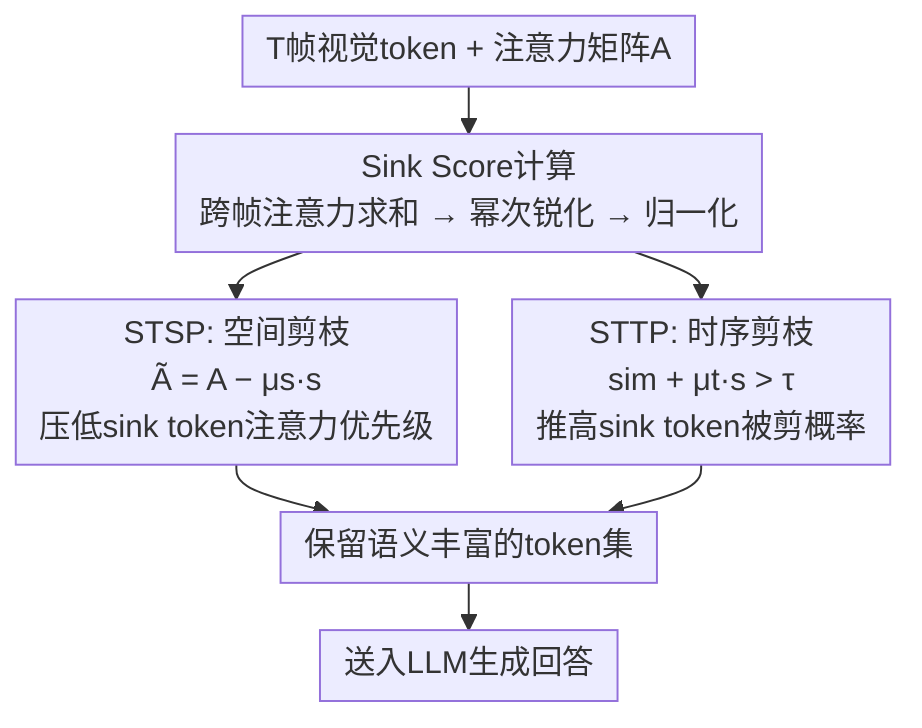

# Sink-Token-Aware Pruning for Fine-Grained Video Understanding in Efficient Video LLMs

**会议**: ECCV 2026  
**arXiv**: [2604.20937](https://arxiv.org/abs/2604.20937)  
**代码**: [https://github.com/rlqja1107/SToP](https://github.com/rlqja1107/SToP)  
**领域**: 视频理解 / 模型压缩  
**关键词**: 视觉token剪枝, sink token, 细粒度视频理解, Video LLM, 免训练加速

## 一句话总结
本文发现注意力剪枝中高注意力但无语义的"sink token"是细粒度视频理解崩溃的关键障碍，提出 SToP 方法——定义跨帧 sink score 量化 token 的 sink 倾向，并分别注入空间剪枝（STSP，降低 sink token 保留优先级）和时序剪枝（STTP，提高 sink token 被剪概率），在 10% 极端保留率下将幻觉和组合推理的性能损失大幅收窄（如 FastVid 从 15.69% 降至 6.32%，VisionZip 从 16.79% 降至 6.87%）。

## 研究背景与动机
**领域现状**：Video LLM 需要处理多帧、每帧数百个视觉 token，导致推理延迟极高。免训练的视觉 token 剪枝（spatial pruning 按注意力保留显著 token，temporal pruning 按帧间相似度合并冗余 token）已成为主流加速手段，相关方法（VisionZip、FastVid、Holitom 等）主要在多选题（MCQA）基准上验证，能在保留 10%-20% token 时维持可接受的精度。

**现有痛点**：本文首次系统检验剪枝方法在细粒度视频理解任务上的表现，发现现有方法在 MCQA 上相对稳健，但在需要精确视觉证据的任务（幻觉检测 EventHallusion、组合推理 VideoComp、开放式生成 VCG-Bench）上性能急剧崩溃——例如 VisionZip 在 10% 保留率下相对原始模型的性能损失达 16.79%，而 MCQA 上仅 7.36%。这一差距严重限制了剪枝方法在实际对话场景中的可用性。

**核心矛盾**：注意力剪枝的核心假设是"高注意力 = 高语义重要性"，但本文发现视觉编码器中存在与 LLM 中类似的 sink 现象——一小部分位于背景区域、语义空洞的 token 持续吸引极高注意力。这些 sink token 因高注意力被空间剪枝优先保留，反复占据宝贵的 token 预算，挤出了真正携带细粒度视觉线索的显著 token，导致模型生成基于扭曲或不完整视觉证据，进而加剧幻觉。

**本文目标**：揭示 sink token 是细粒度视频理解的瓶颈，并提出一种显式抑制 sink token 的即插即用剪枝方法，在不重新训练的前提下提升现有剪枝框架在细粒度任务上的鲁棒性。

**切入角度**：利用 sink token 的关键特征——注意力在空间位置上跨帧持续高企——定义"sink score"来量化每个 token 的 sink 倾向，然后将该分数作为惩罚项同时嵌入空间剪枝和时序剪枝流程。

**核心 idea**：跨帧注意力持久性是区分 sink token 和真正显著 token 的有效信号；用一个幂次锐化的 sink score 显式压低 sink token 的保留优先级，可以在不增加训练成本的前提下显著提升细粒度视频理解。

## 方法详解

### 整体框架
SToP 是一种免训练、即插即用的 token 剪枝增强方法，不改变原有剪枝框架的架构，只在 token 选择阶段引入 sink score 作为修正信号。整体流程分三步：首先对视觉编码器输出的每帧注意力矩阵，跨帧求和得到每个 patch 位置的原始 sink score，经幂次锐化和 min-max 归一化得到最终 sink score；然后将该分数分别注入空间剪枝模块（STSP，从注意力分数中减去 sink 惩罚项，降低 sink token 被选中的概率）和时序剪枝模块（STTP，在帧间相似度上叠加 sink 加成项，使 sink token 更容易越过剪枝阈值）；最后将修正后的 token 选择结果送入 LLM 生成回答。

### 关键设计

**1. Sink Score：用跨帧注意力持久性量化 token 的 sink 倾向**

空间剪枝仅凭单帧注意力无法区分"sink token"和"真正显著 token"——两者都有高注意力分数。本文的核心洞察是：sink token 的高注意力在空间位置上跨帧持续出现（因为它们对应固定背景区域），而真正显著 token 的高注意力往往只在物体出现的若干帧中短暂激活。基于此，定义每个 patch 位置 $i$ 的原始 sink score 为跨所有 $T$ 帧的注意力分数之和 $\hat{s}_i = \sum_{t=1}^{T} A_i^t$，然后经过幂次变换和 min-max 归一化得到最终 sink score $s_i = \text{MinMax-Norm}(\hat{s}_i^w)$。其中幂次 $w$（默认 1.1）起锐化作用：$w>1$ 时拉大高 sink 和低 sink token 之间的差距，使惩罚集中在真正的 sink token 上，避免误伤边界附近的显著 token。

**2. STSP：sink-aware 空间剪枝——从注意力分数中减去 sink 惩罚**

传统空间剪枝（如 VisionZip、FastVid）按注意力分数从高到低选取 token。本文的 STSP 模块直接修改注意力分数：$\tilde{A}_i^t = A_i^t - \mu_s \cdot s_i$，其中 $\mu_s$ 控制惩罚力度。sink score 高的 token 被系统性压低优先级，不再因其虚高的注意力而被错误保留。该公式的关键在于：sink score 是跨帧聚合的全局量，它不依赖于单帧注意力的绝对值，因此能区分"某帧因显著物体出现而短暂高注意力的正常 token"和"每帧都高注意力但语义空洞的 sink token"——前者跨帧求和后仍较低，不触发惩罚。这等价于在注意力排序中引入了一个持久性先验：只有短暂显著才是真正的显著。

**3. STTP：sink-aware 时序剪枝——让 sink token 更容易在时间轴上被合并**

时序剪枝（如 Holitom）通过计算相邻帧同一位置的 token 相似度来发现冗余：相似度超过阈值 $\tau$ 的 token 被视为冗余并被合并。它的副作用是 sink token（背景区域、帧间几乎不变）天然满足高相似度条件，因此容易被剪掉——这正是时序+空间联合剪枝比纯空间剪枝更鲁棒的原因。但仍有部分 sink token 在时序剪枝后存活。STTP 显式利用 sink score 来提高这部分 token 的被剪概率：$P_t = \{i \mid \text{sim}(H_v^{i,t}, H_v^{i,t+1}) + \mu_t \cdot s_i > \tau\}$。加入 $\mu_t \cdot s_i$ 项后，sink token 的得分被整体抬升，更容易越过阈值 $\tau$ 被归入剪枝集。

### 一个完整示例：一个背景 sink token 的命运

考虑一个视频中位于画面左下角（patch 索引 154）的背景区域——它始终是白墙，不携带任何语义信息。在标准 ViT 编码器中，该 patch 的 CLS 注意力分数每帧都高达 0.8+，因为它作为"视觉锚点"吸引了大量注意力。在纯空间剪枝（如 VisionZip）下，该 patch 因高注意力每帧都被选中，在 10% 保留率下占据了 3.2 个 token 的预算（32 帧中有 32 个 patch 位置竞争，它几乎每帧都赢），挤出了本该保留的动作细节 token。加入 SToP 后：该 patch 的 sink score $s_{154}$ 因跨帧持续高注意力而被推到接近 1.0；STSP 将其单帧注意力从 0.85 压低到 $0.85 - 0.03 \times 1.0 = 0.82$，排名落在保留阈值之下；STTP 进一步将其帧间相似度（原本 0.92 接近但未达 $\tau$）叠加 $0.07 \times 1.0 = 0.07$ 后变为 0.99，远超阈值，触发时序合并。最终，这 32 个帧中该位置的 token 被大量清除，释放的预算分配给真正包含动作变化的前景 token，幻觉率显著下降。

### 损失函数 / 训练策略
SToP 是免训练方法，无损失函数。三个关键超参数均通过验证集贪心搜索确定：幂次 $w=1.1$（全局固定），空间惩罚系数 $\mu_s$ 对 VisionZip 取 0.03、对 FastVid 取 0.02，时序加成系数 $\mu_t$ 对 Holitom 取 0.07。消融显示性能对 $w$ 不敏感（1.0-1.15 范围内稳定），对 $\mu_s$ 更敏感——过大会误伤边界附近的正常 token。

## 实验关键数据

### 主实验
在 LLaVA-OneVision-7B 上以 10% 极端保留率（剪掉 90% token）评估。表为细粒度任务上的核心结果。

| 方法 | 保留率 | EventHallusion Binary | EventHallusion Desc | VideoComp Act | VideoComp YC | 性能损失率 |
|------|--------|----------------------|---------------------|---------------|--------------|-----------|
| Vanilla（不剪枝） | 100% | 63.33 | 38.74 | 70.06 | 70.95 | - |
| Holitom | 10% | 60.88 | 36.75 | 68.38 | 68.98 | 6.22% |
| Holitom+SToP | 10% | 62.59 | 39.74 | 69.24 | 69.10 | 4.80% |
| FastVid | 10% | 49.63 | 31.46 | 57.37 | 58.10 | 15.69% |
| FastVid+SToP | 10% | 60.15 | 36.75 | 68.38 | 69.75 | 6.32% |
| VisionZip | 10% | 50.37 | 28.15 | 65.39 | 64.61 | 16.79% |
| VisionZip+SToP | 10% | 60.39 | 36.09 | 67.78 | 68.89 | 6.87% |

性能损失率 = 各指标相对 Vanilla 的 macro-average 降幅。SToP 对纯空间方法（FastVid、VisionZip）的提升最为显著（损失率分别收窄 9.37pp 和 9.92pp），对时序+空间方法 Holitom 也有 1.42pp 增益——因为时序剪枝已隐式抑制了部分 sink token。跨 backbone（LLaVA-Video-7B）和跨数据集（Argus）实验均验证了一致增益。MCQA 基准上 SToP 同样带来提升（如 VisionZip 在 10% 保留率下 MVBench 从 54.16 提升至 57.34），但基数衰减本就温和，进一步印证 MCQA 无法暴露剪枝的脆弱性。

### 消融实验
在 10% 保留率下验证 STSP 和 STTP 各自的贡献。

| 配置 | STSP | STTP | EventHallusion Binary | EventHallusion Desc | VideoComp Act | VideoComp YC | 性能损失率 |
|------|------|------|----------------------|---------------------|---------------|--------------|-----------|
| Vanilla | - | - | 63.33 | 38.74 | 70.06 | 70.95 | - |
| VisionZip（仅空间） | | | 50.37 | 28.15 | 65.39 | 64.61 | 20.46% |
| VisionZip + STSP | ✓ | | 60.39 | 36.09 | 67.78 | 68.89 | 4.64% |
| Holitom（时序+空间） | | | 60.88 | 36.75 | 68.38 | 68.98 | 3.87% |
| Holitom + STSP | ✓ | | 62.10 | 37.09 | 68.02 | 69.24 | 1.94% |
| Holitom + STSP + STTP | ✓ | ✓ | 62.59 | 39.74 | 69.24 | 69.10 | 1.17% |

纯空间方法 VisionZip 加 STSP 后损失率从 20.46% 骤降至 4.64%，说明 sink 惩罚对纯注意力剪枝的纠正效果极强。Holitom 本身已有一定鲁棒性，叠加 STSP 仍有 1.93pp 收益，再叠加 STTP 达到最优，说明时序剪枝的隐式 sink 抑制并不充分，显式 sink-aware 时序剪枝能进一步清理残余 sink token。

### 关键发现
- **纯空间方法受益最大**：VisionZip 和 FastVid 在 10% 保留率下加 SToP 后性能损失率分别收窄 9.92pp 和 9.37pp，说明 sink token 是纯注意力剪枝在细粒度任务上崩溃的主要原因，SToP 几乎"修复"了这一缺陷。
- **16 帧 + SToP 胜过 64 帧无 SToP**：在 EventHallusion 上，VisionZip+SToP 仅用 16 帧就超过了原始 VisionZip 用 64 帧的性能，说明抑制 sink token 比堆更多帧更有效——额外的帧也会引入更多 sink token，抵消了视觉信息增益。
- **Hard Pruning 基线也有效但不如 SToP**：直接将每帧注意力 top-K% 的 token 强制丢弃（Hard Pruning）也能提升性能，但 SToP 通过 sink score 区分"高注意力但无语义的 sink"和"高注意力但真正显著的 token"，避免了误杀。
- **特征聚类剪枝天然规避 sink 但不完美**：基于 DPC-KNN 的特征聚类剪枝不依赖注意力，在 10% 保留率下优于原始注意力剪枝，但 SToP 增强后的注意力剪枝反超了特征聚类方法，说明"正面解决 sink 问题"优于"绕开 sink 问题"。

## 亮点与洞察
- **sink 现象的跨模态迁移洞察**：LLM 中的 sink token（如 BOS）必须保留以维持 softmax 稳定性，而视觉编码器中的 sink token 恰好相反——必须剪掉才能释放预算。这一"同名异命"的细腻区分是本文最巧妙的理论贡献，直接决定了方法设计的正确方向。
- **时序剪枝的"隐藏功能"**：本文揭示了一个有趣的副产品——时序剪枝虽设计用于去除帧间冗余，但天然充当了 sink token 的抑制器（因为背景区域帧间相似度极高）。这一发现解释了为什么 Holitom > VisionZip/FastVid，也为后续方法设计提供了新视角：剪枝的两个维度（空间+时序）之间存在协同效应，不应该独立设计。
- **幂次锐化是一个低成本且通用的分布塑形 trick**：$s_i = \text{MinMax-Norm}(\hat{s}_i^w)$ 中 $w$ 从 1.0 调到 1.1，就把一个"缓慢衰减的分数分布"变成"少数 token 近 1、多数近 0 的陡峭分布"，从而让惩罚精确定位到真正的 sink token。这个技巧可以迁移到任何需要"从连续分数中提取 hard subset"的场景，如基于置信度的伪标签筛选、难样本挖掘、attention map 阈值化等。
- **实验设计的说服力**：从诊断实验（去除时序剪枝后观察 token 选择频率分布异常）到因果验证（随机删除 sink token 后幻觉下降），再到方法提出和消融，形成"观察 → 假设 → 因果验证 → 方法 → 消融"的完整证据链，是顶会论文实验设计的典范。

## 局限与展望
- **不适用于非注意力剪枝方法**：SToP 的 sink score 依赖注意力矩阵，无法直接用于基于特征聚类的剪枝方法（如 DPC-KNN）。作者提出未来可将类似思路迁移到特征空间——识别高范数、高成对相似度的"特征空间 sink token"。
- **μ_s 和 μ_t 需要按方法和保留率分别调参**：不同基线方法对 sink 的敏感程度不同（纯注意力方法 vs 有时序辅助的方法），超参需要针对每种组合贪心搜索，增加了工程部署成本。一个可能的改进是让 sink score 自适应地根据 token 预算动态调整惩罚强度。
- **sink token 的定义依赖启发式阈值**：当前通过"选择频率分布 top-K%"来划定 sink token 集合，缺乏一个原则性的判定标准。未来可探索基于信息论的自动化 sink 检测。
- **仅在 ViT 编码器上验证**：所有实验基于 SigLIP 视觉编码器，sink 现象是否普遍存在于其他编码器架构（如 VideoMAE、InternVideo）尚待验证。

## 相关工作与启发
- **vs VisionZip / FastVid（纯空间剪枝）**：这些方法直接用 CLS 注意力分数选择 token，隐含假设"高注意力 = 重要"。本文揭示了这一假设在细粒度任务中的根本性缺陷——sink token 满足高注意力但不重要——并通过 sink score 修正注意力分数。本质上是将"单帧注意力排序"升级为"跨帧持久性感知的注意力排序"。
- **vs Holitom / PruneVid（时序+空间剪枝）**：这些方法通过帧间相似度做时序剪枝，客观上抑制了 sink token，但设计初衷是去冗余而非去 sink。SToP 将这种"副作用"显式化为设计目标，进一步在时序剪枝中叠加 sink 加成，清理残余。
- **vs Attention Sink 相关工作（LLM 侧）**：LLM 中的 attention sink 研究（Xiao et al. 2023, Sun et al. 2024）强调保留 sink token 以维持 softmax 稳定性；ViT 侧工作（Darcet et al. 2023, Jiang et al. 2025）主要关注 sink 对可解释性的影响。本文是首个将 sink 现象与 token 剪枝的细粒度理解性能联系起来的工作，且方向与 LLM 侧完全相反（剪而非留）。

## 评分
- 新颖性: ⭐⭐⭐⭐⭐ 首次揭示 sink token 是视觉 token 剪枝中细粒度理解崩溃的关键瓶颈，且"视觉 sink 应剪、语言 sink 应留"的对比洞察非常有深度
- 实验充分度: ⭐⭐⭐⭐⭐ 覆盖 3 个细粒度基准 + 5 个 MCQA 基准 + 2 个 backbone + 跨数据集验证，诊断实验和消融实验链条完整，对比了 Hard Pruning、Attention Redistribution、特征聚类剪枝等多种备选方案
- 写作质量: ⭐⭐⭐⭐ 动机链清晰（MCQA 掩盖问题 → 细粒度任务暴露崩溃 → sink 诊断 → 因果验证 → 方法），附录对 sink token 的 LLM vs Vision 辨析是关键加分项；但部分实验表格过于密集，可读性略有牺牲
- 价值: ⭐⭐⭐⭐⭐ 免训练、即插即用、三行公式的核心方法，可无缝嵌入几乎所有注意力类剪枝框架；sink score 的概念可能催生一波细粒度视频理解的 follow-up 工作

<!-- RELATED:START -->

## 相关论文

- [\[CVPR 2026\] UFVideo: Towards Unified Fine-Grained Video Cooperative Understanding with Large Language Models](../../CVPR2026/video_understanding/ufvideo_towards_unified_fine-grained_video_cooperative_understanding_with_large_.md)
- [\[CVPR 2026\] Frame2Freq: Spectral Adapters for Fine-Grained Video Understanding](../../CVPR2026/video_understanding/frame2freq_spectral_adapters_for_fine-grained_video_understanding.md)
- [\[CVPR 2026\] StreamingTOM: Streaming Token Compression for Efficient Video Understanding](../../CVPR2026/video_understanding/streamingtom_streaming_token_compression_for_efficient_video_understanding.md)
- [\[AAAI 2026\] R-AVST: Empowering Video-LLMs with Fine-Grained Spatio-Temporal Reasoning in Complex Audio-Visual Scenarios](../../AAAI2026/video_understanding/r-avst_empowering_video-llms_with_fine-grained_spatio-temporal_reasoning_in_comp.md)
- [\[ICLR 2026\] QueryStream: Advancing Streaming Video Understanding with Query-Aware Pruning and Proactive Response](../../ICLR2026/video_understanding/querystream_advancing_streaming_video_understanding_with_query-aware_pruning_and.md)

<!-- RELATED:END -->
