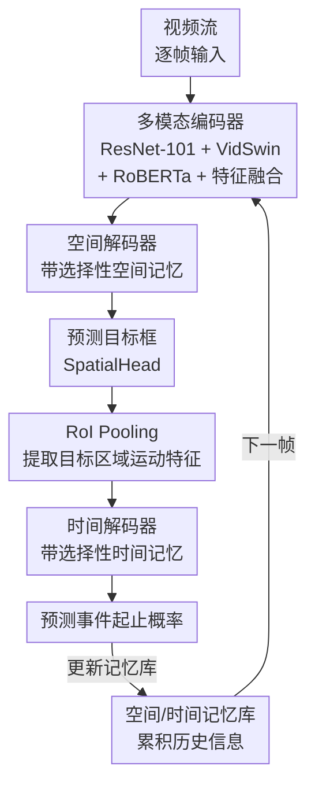

# Towards Long-Form Spatio-Temporal Video Grounding

**会议**: ECCV 2026  
**arXiv**: [2602.23294](https://arxiv.org/abs/2602.23294)  
**代码**: [https://github.com/HengLan/ART-STVG](https://github.com/HengLan/ART-STVG)  
**领域**: 视频理解  
**关键词**: 时空视频定位, 长视频理解, 自回归Transformer, 记忆选择, 级联解码

## 一句话总结
本文定义并首次探索长视频时空定位（LF-STVG）问题，提出 ART-STVG——一种记忆增强的自回归Transformer架构，将视频视为流式输入逐帧处理，通过空间/时间记忆库加选择性检索策略和级联时空解码设计，在不依赖额外长视频训练数据的前提下，在 1-5 分钟级别的长视频定位任务上大幅超越现有方法。

## 研究背景与动机

时空视频定位（STVG）的任务是给定一段未裁剪视频和一个自然语言查询，输出目标对象在视频中的时空管（tube），即每一帧的目标框加上事件起止时间。过去几年的研究（如 TubeDETR、STCAT、CG-STVG、TA-STVG 等）在这一任务上取得了显著进展。然而，现有工作几乎全部聚焦在数十秒级别的短视频上——主流基准 HCSTVG-v2 和 VidSTG 的平均视频时长分别只有 20 秒和 35 秒。在真实场景中，视频检索、视频监控、体育分析等应用往往面对的是几分钟乃至几小时的视频。当视频从 20 秒推到分钟级，现存方法面临三重挑战：首先，一次性加载全部帧到显存进行联合定位会导致严重的内存瓶颈；其次，更长的时域跨度急剧增加了定位的复杂度；第三，大量无关的背景信息会干扰模型对目标事件的识别。

作者指出了一个关键矛盾：现有 STVG 方法无一例外地采用"看全部帧 → 一次性全预测"的非自回归范式。在这种范式下，模型需要同时处理数百帧的时空关系，在长视频上既无法扩展计算资源又难以捕捉跨长距离的时空依赖。而长视频天然具有流式特性——模型其实不需要一次性看到全部内容，而是可以像人观察视频一样一帧一帧地看、逐步建立对目标的记忆。**核心 idea：将视频视为流式输入，提出一种记忆增强的自回归Transformer架构 ART-STVG，逐帧顺序处理视频并通过选择性空间记忆和时间记忆来保持跨帧的一致性，同时将空间定位的结果级联送入时间定位器，用更精细的目标信息辅助复杂的时域定位。**

## 方法详解

### 整体框架

ART-STVG 包含一个多模态编码器和一套级联的自回归解码器。对视频的第 $i$ 帧，编码器提取外观+运动+文本特征并融合为多模态特征；解码器部分先经过空间解码器预测当前帧的目标框，再级联地将该框的 RoI 运动特征送入时间解码器预测事件起止概率。空间和时间解码器各维护一个记忆库，逐帧累积历史信息，并通过选择性策略只取与当前帧最相关的记忆来增强解码。整个流程逐帧滚动，记忆库随之更新，实现长视频的无限扩展推理。

### 关键设计

**1. 流式自回归解码：逐帧预测而非一次全预测**

现有 STVG 方法一次性处理整个视频的全部帧，这种做法在长视频上既受显存限制（处理 284 帧即需约 80G 显存），又难以捕捉跨长距离的时空依赖。ART-STVG 将视频视为流式输入，对每一帧独立提取多模态特征后，通过自回归解码器顺序预测该帧的目标框和事件概率，并利用当前帧更新记忆库用于下一帧。这种设计的核心优势在于：推理时的显存开销不随视频长度增加而增涨（仅需约 7.9G），且理论上可以处理任意长度的视频——整个一小时视频只需 22.5MB 的记忆存储。作者消融实验也表明，自回归基线（无记忆）在长视频上的 m_tIoU（16.2% → 9.2%）远优于传统一次性方法（TubeDETR 在 5 分钟视频上仅 7.8%），证实了流式范式对长视频的必要性。

**2. 选择性空间记忆：用文本引导检索历史目标位置**

空间解码器维护一个空间记忆库 $B^s$，包含 $K$ 个分区（每个解码块一个分区）。在解码第 $i$ 帧时，将当前空间查询 $q_i^{k-1}$ 插入对应分区的记忆库，然后计算库中每条记忆与文本特征的余弦相似度，选出得分最高的 Top-$N_s$ 条记忆（$N_s=32$ 最优）构成选择性空间记忆 $\mathcal{M}^s_{i,k}$。随后，空间查询先与 $\mathcal{M}^s_{i,k}$ 做交叉注意力获得记忆增强的查询特征，再与当前帧的外观+文本特征交叉注意力学习最终查询。这里的设计动机很直观：不同时刻的记忆对于定位当前帧的目标重要程度不同——过于久远或场景剧变后的历史记忆反而会引入噪声。通过文本查询来做语义级别的记忆筛选，可以有效屏蔽与目标无关的历史帧信息。对比实验显示，使用全部空间记忆仅提升 0.8% m_tIoU（21.3→22.1），而加上选择策略后额外再提升 0.9%（22.1→23.0），且注意力热图可视化显示选择性记忆使模型更聚焦在目标区域。

**3. 选择性时间记忆：利用事件边界筛选时域上下文**

时间解码器同样维护一个时间记忆库 $B^t$，但记忆选择策略与空间侧完全不同。由于时间定位的核心是找到目标事件的起止边界，作者借鉴 TextTiling 的思路：计算相邻帧时间记忆之间的余弦相似度，相似度骤降的位置（低于阈值 $\theta_t=0.8$）被判定为事件边界。然后，只选取与当前帧最近的那个事件段内的记忆作为选择性时间记忆 $\mathcal{M}^t_{i,k}$。这一设计的精妙之处在于：它不需要任何事件级别的标注，仅凭记忆向量之间的相似度变化就能自动切分视频中的事件片段。长视频往往包含多个无关事件（如"一个人走进房间，坐下，然后打开电脑"中的三个子事件），如果无差别地使用全部时间记忆，模型会被其他事件的干扰信息淹没——消融实验表明使用全部时间记忆反而让 m_tIoU 从 16.7% 骤降到 9.6%，而加上选择策略后大幅回升到 23.0%，提升达 13.4 个百分点。

**4. 级联时空解码：用空间细化目标区域辅助时间定位**

与现有方法将空间解码和时间解码并行不同，ART-STVG 采用了级联设计：空间解码器预测出当前帧的目标框 $b_i$ 后，对该框对应的运动特征图做 RoI Pooling 得到细粒度的目标区域运动特征 $\bar{f}^m_i$，再将这个特征（而非全图运动特征）与文本特征一起送入时间解码器。这个设计的直觉是：长视频中的时间定位比短视频困难得多（因为需要从大量无关帧中筛选目标事件），而空间定位提供了"目标在哪"这一关键先验——知道了目标在画面中的具体位置，就能更精准地分析它何时出现、何时消失。消融实验显示，级联设计相比并行设计在 m_tIoU 上提升 1.5 个百分点（21.5→23.0），在 vIoU@0.3 上提升 2.8 个百分点（17.3→20.1），证明空间信息确实能有效辅助时域定位。

### 损失函数

总损失由空间定位损失和时间定位损失两部分组成：

$$\mathcal{L} = \lambda_k(\mathcal{L}_{KL}(\mathcal{H}_s^*, \mathcal{H}_s) + \mathcal{L}_{KL}(\mathcal{H}_e^*, \mathcal{H}_e)) + \lambda_l \mathcal{L}_1(\mathcal{B}^*, \mathcal{B}) + \lambda_u \mathcal{L}_{IoU}(\mathcal{B}^*, \mathcal{B})$$

时间侧使用 KL 散度监督事件起止概率分布，空间侧使用 Smooth L1 + IoU 损失监督目标框。权重 $\lambda_k=10,\ \lambda_l=5,\ \lambda_u=3$。

## 实验关键数据

### 主实验

由于长视频 STVG 基准为空白，作者基于 HCSTVG-v2 验证集扩展了三种长度（1/3/5 分钟）的 LF-STVG 基准。所有方法仅在 20 秒的原始训练集上训练，公平对比。

| 基准 | 方法 | m_tIoU | m_vIoU | vIoU@0.3 | vIoU@0.5 |
|------|------|--------|--------|----------|----------|
| LF-STVG-1min | TA-STVG (SOTA) | 38.4 | 25.2 | 35.5 | 12.1 |
| LF-STVG-1min | ART-STVG | **39.1** | **26.1** | **36.8** | **17.6** |
| LF-STVG-3min | TA-STVG (SOTA) | 13.9 | 8.5 | 3.3 | 0.2 |
| LF-STVG-3min | ART-STVG | **23.0** | **15.3** | **20.1** | **9.5** |
| LF-STVG-5min | TA-STVG (SOTA) | 7.7 | 4.5 | 0.3 | 0.0 |
| LF-STVG-5min | ART-STVG | **15.0** | **10.0** | **11.4** | **4.7** |

在 3 分钟和 5 分钟视频上，现有方法几乎完全失效（vIoU@0.5 接近 0），而 ART-STVG 仍然保持了可用的定位精度，且视频越长相对优势越大。

### 消融实验

| 配置 | m_tIoU | m_vIoU | 说明 |
|------|--------|--------|------|
| Full (w/ 全部设计) | **23.0** | **15.3** | 完整模型 |
| 无时间记忆+无选择 | 16.7 | 11.1 | 基线 |
| 有时间记忆+无选择 | 9.6 | 6.2 | 全部记忆反而劣化 |
| 无空间记忆+无选择 | 21.3 | 13.9 | 空间基线 |
| 有空间记忆+无选择 | 22.1 | 14.2 | 略微提升 |
| 并行解码（无级联） | 21.5 | 13.9 | 替换级联为并行 |

### 关键发现

- **时间记忆选择是最大贡献模块**：去掉选择策略后，使用全部时间记忆反而让性能大幅下降 7.1% m_tIoU，加上选择后带来 13.4 个百分点的净提升——直观显示了长视频中"记忆过多等于噪声"的陷阱。
- **空间记忆的边际贡献较小**（仅 1.7% m_tIoU 提升），说明空间定位本身在逐帧自回归框架下已经较强，记忆只起到辅助稳定的作用。
- **级联设计优于并行设计**：m_tIoU +1.5%，vIoU@0.3 +2.8%，说明利用空间定位结果帮助时域定位的思路在长视频场景下尤为有效。
- **显存效率突出**：ART-STVG 推理仅需 7.9G 显存，不到 TA-STVG（25.1G）的三分之一，且不随视频长度增长。

## 亮点与洞察

- **第一个正式定义并解决 LF-STVG 问题的工作**，从问题定义到基准扩展再到方法设计构成完整闭环。这对社区有较好的引导意义——长视频理解中的细粒度时空定位此前几乎未被探索。
- **记忆选择策略的对比极具说服力**：不加选择时全部记忆反而带来显著下降（m_tIoU 16.7→9.6），加上选择后大幅反弹至 23.0，干净地验证了"长视频中记忆不是越多越好"这一直觉。
- **显存不随视频长度增长的流式推理范式**是工程上的巧妙设计，使得该方法在消费级 GPU 上也能处理数小时的视频。这一思路可以迁移到其他长视频任务（如长视频动作检测、长视频描述生成）作为现成的推理框架。

## 局限与展望

- **性能随视频长度增加而衰减**：在 5 分钟视频上 m_tIoU 降至 15.0%，虽然远超现有方法（7.8%），但距离实用仍有较大差距。作者指出需要更精细的判别性记忆系统。
- **无法实时运行**：推理速度为 1.09 秒/64 帧（约 18 FPS），低于实时要求。模型压缩/量化是可能的改进方向。
- **事件边界模糊时的失效**：当相邻事件的转变不清晰时，基于相似度的事件切分策略容易出错，进而导致时间记忆选择错误。可以考虑引入事件级别的外部信号或多模态线索。
- **基准扩展的局限性**：仅基于 HCSTVG-v2 一个数据集，且验证集来自随机填充而非自然长视频，可能低估了真实长视频场景的复杂度。

## 相关工作与启发

- **vs TubeDETR / STCAT / CG-STVG**：这些方法采用非自回归+并行时空解码范式，一次性处理所有帧。在短视频上效果优异，但在长视频上受显存限制和无关信息干扰严重退化。ART-STVG 的自回归式流式处理从底层架构上绕开了这一瓶颈。
- **vs 通用长视频理解方法（如 MovieChat、VidILlama）**：这些方法通常使用全局视频级记忆做问答或描述，而 ART-STVG 的记忆是文本指导的空间实例和时间事件边界线索，专为细粒度定位任务设计。

## 评分
- 新颖性: ⭐⭐⭐⭐ 首次系统探索长视频 STVG 问题，自回归+选择性记忆+级联解码的组合设计整体合理，但各组件本身不算全新的思想突破。
- 实验充分度: ⭐⭐⭐⭐⭐ 在 3 种视频长度基准上与 5 种方法对比，消融实验覆盖了所有关键设计，额外包含效率分析和失败案例分析。
- 写作质量: ⭐⭐⭐⭐ 论述清晰，问题动机和设计理由充分，方法部分较详细，但一些符号和公式可以进一步简化。
- 价值: ⭐⭐⭐⭐⭐ 定义了有实际意义的新问题，提出的流式处理范式在长视频定位上的效率优势显著，为后续工作提供了清晰的基线和方法基础。

<!-- RELATED:START -->

## 相关论文

- [\[ICLR 2026\] OmniSTVG: Toward Spatio-Temporal Omni-Object Video Grounding](../../ICLR2026/video_understanding/omnistvg_toward_spatio-temporal_omni-object_video_grounding.md)
- [\[AAAI 2026\] TSPO: Temporal Sampling Policy Optimization for Long-form Video Language Understanding](../../AAAI2026/video_understanding/tspo_temporal_sampling_policy_optimization_for_long-form_video_language_understa.md)
- [\[CVPR 2025\] T*: Re-thinking Temporal Search for Long-Form Video Understanding](../../CVPR2025/video_understanding/re-thinking_temporal_search_for_long-form_video_understanding.md)
- [\[CVPR 2026\] OmniGround: A Comprehensive Spatio-Temporal Grounding Benchmark for Real-World Complex Scenarios](../../CVPR2026/video_understanding/omniground_a_comprehensive_spatio-temporal_grounding_benchmark_for_real-world_co.md)
- [\[ICCV 2025\] HERMES: temporal-coHERent long-forM understanding with Episodes and Semantics](../../ICCV2025/video_understanding/hermes_temporal-coherent_long-form_understanding_with_episodes_and_semantics.md)

<!-- RELATED:END -->
