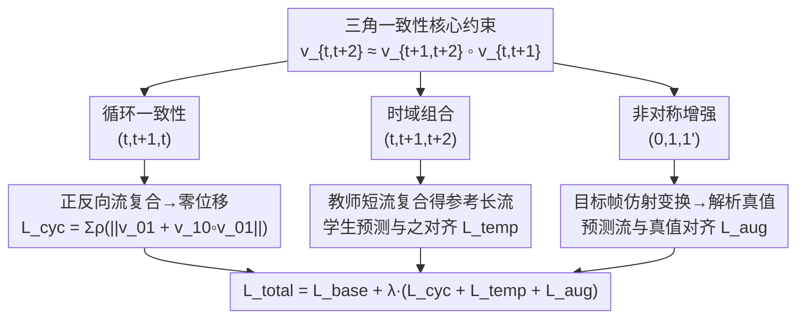

# Triangular Consistency as a Universal Constraint for Learning Optical Flow

**会议**: ECCV2026  
**arXiv**: [2606.19938](https://arxiv.org/abs/2606.19938)  
**代码**: [https://github.com/lsuvision/tri-flow](https://github.com/lsuvision/tri-flow)  
**领域**: video_understanding  
**关键词**: 光流估计, 三角一致性, 几何约束, 自监督学习, 数据增强

## 一句话总结
本文从位移场可复合的几何第一性原理出发，提出三角一致性（triangular consistency）——一种与架构、监督类型和数据集无关的通用光流约束，通过对三帧构成的最小三角形施加组合一致性损失，在有监督、无监督和自监督域适应三种训练范式下均取得一致提升。

## 研究背景与动机

光流估计是计算机视觉的基础问题之一，自Horn-Schunck和Lucas-Kanade时代起就被定义为从离散帧对中推断连续运动。现代深度学习方法——从FlowNet到PWC-Net再到RAFT——延续了这一逐对范式，主要关注网络架构的改进（全对相关体、迭代精化、Transformer匹配等）。这些方法在合成数据集上取得了接近饱和的精度，但在跨域泛化、无监督训练和无标注域适应等场景中仍面临显著挑战。

与此同时，学界很早就知道位移场具有可复合性——这是因为光流本质上是场景坐标系的连续非刚体变换，两帧之间的映射经过中间帧插值可以链式组合出更长跨度的对应关系。多帧光流和点跟踪工作已经利用这一性质来初始化长距离对应。然而，这一几何本质始终没有被显式地用作光流训练的约束信号。现有自监督方法主要依赖光度一致性（photometric consistency），即用预测光流扭曲目标帧后与源帧的像素差异作为监督；它在遮挡、运动模糊和光照变化下容易失效。尽管各种改进引入了遮挡推理、双向一致性校验等机制，但这些约束往往是特定于某个训练范式的代理目标（proxy constraint），而非来源于光流本身的几何本质。

这种缺失的核心矛盾在于：光流的可复合性是最基本的几何性质，它比任何图像外观假设都更根本，却始终只被用于推理阶段的对应初始化，从未被系统性地引入训练损失。本文的关键洞察是，这种几何约束实际上可以独立于架构、监督类型和数据集——不需要额外标注、不改变网络结构、不依赖图像外观，因此可以作为通用插件式组件加入任何光流训练管线。**核心 idea：三角一致性（triangular consistency）从位移场可复合的几何第一性原理出发，以三帧为最小结构单元，强制要求两段短时域流复合所得与直接估计的长程流一致；该约束以轻量损失的形式插件式加入现有训练管线，在有监督、无监督和自监督域适应三种训练范式下均带来一致的精度提升。**

## 方法详解

### 整体框架

三角一致性的核心思想极其简洁：光流表示坐标之间的映射关系，而坐标映射天然可复合。给定三个连续帧 $I_t, I_{t+1}, I_{t+2}$，从 $t$ 到 $t+2$ 的位移场可以通过两种方式获得——直接估计（$v_{t,t+2}$），或先估计两段短流 $v_{t,t+1}$ 和 $v_{t+1,t+2}$ 后通过坐标插值复合得到 $\tilde{v}_{t,t+2}$。三角一致性强制要求这两者一致。这条单一的几何原则在实际训练中表现为三个具体形式：循环一致性（正反向流合成为零映射）、时域组合一致性（三帧链式监督长程流）和非对称增强一致性（目标帧仿射变换产生解析光流真值）。三个约束以加性损失项的形式叠加在基础损失之上，不需要修改网络结构或数据加载流程。

### 关键设计

**1. 三角一致性形式化：将位移场的可复合性转化为显式训练损失**

在物理层面，光流本质上是场景坐标系的连续非刚体变换，不同时间采样下的同一过程必然在复合下保持一致。本文的核心贡献正是将这一观察形式化为最简的三项约束。定义 $v_{t,t+1}$ 为从 $t$ 到 $t+1$ 的光流向量，其对应的变形函数为 $w_{t,t+1}(x) = x + v_{t,t+1}(x)$。给定三帧 $I_t, I_{t+1}, I_{t+2}$，从 $t$ 到 $t+2$ 的复合变形为 $w_{t+1,t+2}(w_{t,t+1}(x))$，即 $v_{t,t+1}(x) + v_{t+1,t+2}(x + v_{t,t+1}(x))$。三角一致性强制直接估计的长程流 $v_{t,t+2}$ 与这一复合结果一致。当第三帧回到第一帧时（即 $I_{t+2} = I_t$），该约束退化为经典的循环一致性——正反向流复合后应为零位移。为应对遮挡带来的无效对应，作者引入有效性掩码 $M_{t,t+1,t+2}$，通过对正反向流进行组合一致性检查来识别遮挡区域并降低其权重，损失使用鲁棒范数 $\rho(\cdot)$ 抑制异常点影响。由于该约束从坐标映射的几何出发，完全不依赖图像外观，因此对光照变化、阴影和成像噪声天然鲁棒。

**2. 时域组合蒸馏：用教师短流复合结果监督学生长流预测**

在自监督域适应和无监督训练中，时域组合一致性是最有效的约束形式。其核心直觉非常直观：两个短时域位移（如 $t{\to}t+1$ 和 $t+1{\to}t+2$）往往比一个长时域位移更可靠——因为帧间位移小、遮挡区域少、信噪比高。因此可以用短流复合的结果来作为长流预测的训练信号。具体实现上采用了教师-学生自蒸馏框架（self-distillation with EMA）：教师网络预测短流 $v_{01}$ 和 $v_{12}$，复合得到长流 $v_{02}$ 的参考值；学生网络直接预测长流 $v_{02}$；损失函数惩罚学生预测与复合参考之间的差异。教师参数通过学生参数的指数移动平均（EMA）更新，梯度只回传到学生网络。在单epoch自监督域适应实验中（仅45次迭代），仅凭时域组合一致性就能将Sintel Clean EPE从2.54降至2.18，说明这一信号本身已能提供非常有价值的几何监督。

**3. 非对称解析增强：仅变换目标帧并通过闭式推导更新光流真值**

现有光流训练中的数据增强通常对源帧和目标帧施加相同的对称变换（如同旋转），以保持对应关系不变。本文提出一种截然不同的策略：仅对目标帧施加仿射变换，并通过闭式推导（closed-form）精确更新光流真值。给定仿射变换 $A$（由平移、旋转和缩放组合而成），将目标帧 $I_1$ 变换为 $I_1'$，则从源帧 $I_0$ 到 $I_1'$ 的光流真值可通过 $v_{01}'(x) = A(x + v_{01}(x)) - x$ 解析计算，无需对图像进行任何重采样或网格插值。这一设计有两个关键优势。第一，解析真值不受插值伪影影响——即使变换后的图像像素映射到图像域之外，源帧上每个像素的真值流仍正确定义。第二，它打破了对称变换的限制：仅变换目标帧意味着源帧和目标帧经历不同的几何变换，从而生成对称变换无法覆盖的多样化运动模式。在KITTI→HD1K的跨数据集零样本迁移中，该增强带来了23.1%的精度提升，说明它有效缓解了源数据集运动模式单一导致的过拟合问题。

### 损失函数 / 训练策略

最终训练目标为 $L_{\text{total}} = L_{\text{base}} + \lambda_{\text{cyc}} L_{\text{cyc}} + \lambda_{\text{temp}} L_{\text{temp}} + \lambda_{\text{aug}} L_{\text{aug}}$。最优权重组合为 $(\lambda_{\text{aug}}, \lambda_{\text{temp}}, \lambda_{\text{cyc}}) = (0.01, 0.003, 0.005)$。计算开销极低：在 $386\times496$ 分辨率下，流复合插值约需0.0003秒，仿射变换约需0.00073秒（NVIDIA RTX Pro 6000 Blackwell GPU），在完整训练中仅占总时间的0.12%。

## 实验关键数据

### 主实验

**自监督域适应（单epoch，仅三角一致性，无光度/平滑项）**：

| 预训练 | 方法 | Sintel Clean EPE | Sintel Final EPE |
|--------|------|------------------|------------------|
| FlyingChairs | RAFT预训练基线 | 2.54 | 4.67 |
| | + 三角一致性 | 2.08 | 3.95 |
| | 提升 | **18.1%** | **15.4%** |
| FlyingThings3D | RAFT预训练基线 | 2.01 | 3.41 |
| | + 三角一致性 | 1.73 | 3.13 |
| | 提升 | **13.9%** | **8.2%** |

**无监督训练（ARFlow + 三角一致性）**：

| 训练集 | 方法 | Sintel Clean EPE | Sintel Final EPE | HD1K EPE | Middlebury EPE |
|--------|------|-----------------|-----------------|----------|---------------|
| Sintel | ARFlow | 2.79 | 3.73 | 1.40 | 0.35 |
| | + 三角一致性 | 2.58 | 3.49 | 1.24 | 0.33 |
| | 提升 | **7.5%** | **6.4%** | **11.4%** | **5.7%** |

**有监督训练（RAFT + 三角一致性数据增强）**：

| 训练集 | 方法 | KITTI Fl-all (%) | HD1K EPE | Middlebury EPE |
|--------|------|-----------------|----------|---------------|
| KITTI | RAFT | 5.27 | 1.08 | 0.69 |
| | + 三角一致性 | 5.02 | 0.83 | 0.56 |
| | 提升 | **4.7%** | **23.1%** | **18.8%** |

### 消融实验

| 配置 | Sintel Clean EPE | Sintel Final EPE |
|------|-----------------|-----------------|
| ARFlow基线 | 2.79 | 3.73 |
| + 增强一致性 ($\lambda_{\text{aug}}=0.01$) | 2.60 | 3.56 |
| + 时域组合 ($\lambda_{\text{temp}}=0.003$) | 2.65 | 3.68 |
| + 循环一致性 ($\lambda_{\text{cyc}}=0.005$) | 2.69 | 3.70 |
| + 三者全开（最优权重） | **2.58** | **3.49** |

### 关键发现
- 在自监督域适应中，时域组合一致性是最主导的约束项；而在从零训练的无监督设置中，非对称增强一致性贡献最大——反映了不同优化动态下约束信号的有效性差异
- 循环一致性在孤立使用时效果有限，但作为互补项加入后能进一步提升整体性能
- 三角一致性的提升主要集中在跨域泛化场景：当训练集运动模式单一（如KITTI的前向驾驶）时，域内精度提升有限但跨数据集迁移提升显著，说明该约束有效缓解了过拟合

## 亮点与洞察
- 把光流的可复合性——这个被长期只在推理中利用（如点跟踪链式初始化）的几何事实——显式引入训练损失，是第一性原理驱动的监督信号设计，比光度一致性更根本且对光照/阴影/模糊天然鲁棒
- 非对称增强通过解析公式更新真值的设计非常巧妙：既生成了对称变换无法覆盖的多样化运动模式，又完全避免了重采样导致的插值伪影，同时能在图像边界外仍保持真值正确定义
- 该约束与架构完全无关——任何现有的或未来的光流网络都可以直接添加三角一致性损失获得提升，工程实用价值极高

## 局限与展望
- 在运动模式高度受限的场景（如KITTI前向驾驶）中，域内精度提升有限，约束的主要收益体现在跨域泛化上
- 三角一致性假设帧间存在单层对应，遮挡和独立运动物体会违反该假设。尽管使用前向后向遮挡掩码进行了缓解，引入显式分层运动模型可以进一步提升鲁棒性
- 本文只探索了三帧构成的"最小三角形"，原则上组合约束可以无限扩展到更长的时间序列，未来可设计课程学习管线逐步增大组合跨度

## 相关工作与启发
- **vs 光度一致性方法（ARFlow等）**：现有无监督方法主要依赖重投影后的像素差异，而三角一致性从坐标映射的几何出发，免受光照/模糊/阴影影响，二者互补
- **vs 传统双向一致性**：传统双向一致性采用线性近似 $v_{10} \approx -v_{12}$，而三角一致性的循环版本 $w_{10}(w_{01}) \approx \text{Id}$ 在几何上更精确
- **vs 对称图像增强（RAFT等同旋转两帧）**：传统增强保持对应关系不变，三角一致性的不对称增强通过解析真值更新创造了全新的运动模式，类似AugUndo在深度估计中的思路

## 评分
- 新颖性: ⭐⭐⭐⭐⭐ 将光流的可复合性——一个被长期忽视的第一性原理——系统性地转化为训练约束，思路干净且具有启发意义
- 实验充分度: ⭐⭐⭐⭐⭐ 覆盖三种训练范式（有监督/无监督/域适应）、两种代表性架构（RAFT/ARFlow）、多个数据集（Sintel/KITTI/HD1K/Middlebury），消融完整
- 写作质量: ⭐⭐⭐⭐⭐ 逻辑链清晰、设计动机交代透彻、诚实讨论局限性（包括什么条件下提升有限），方法是美
- 价值: ⭐⭐⭐⭐⭐ 插件式、零额外标注代价、与架构无关，可被未来所有光流方法复用，实用价值极高

<!-- RELATED:START -->

## 相关论文

- [\[CVPR 2026\] From Contrast to Consistency: Rethinking Event-based Continuous-Time Optical Flow Estimation](../../CVPR2026/video_understanding/from_contrast_to_consistency_rethinking_event-based_continuous-time_optical_flow.md)
- [\[CVPR 2026\] LAOF: Robust Latent Action Learning with Optical Flow Constraints](../../CVPR2026/video_understanding/laof_robust_latent_action_learning_with_optical_flow_constraints.md)
- [\[ICCV 2025\] Unsupervised Joint Learning of Optical Flow and Intensity with Event Cameras](../../ICCV2025/video_understanding/unsupervised_joint_learning_of_optical_flow_and_intensity_with_event_cameras.md)
- [\[CVPR 2026\] U2Flow: Uncertainty-Aware Unsupervised Optical Flow Estimation](../../CVPR2026/video_understanding/u2flow_uncertainty_aware_unsupervised_optical_flow_estimation.md)
- [\[AAAI 2026\] BAT: Learning Event-based Optical Flow with Bidirectional Adaptive Temporal Correlation](../../AAAI2026/video_understanding/bat_learning_event-based_optical_flow_with_bidirectional_adaptive_temporal_corre.md)

<!-- RELATED:END -->
