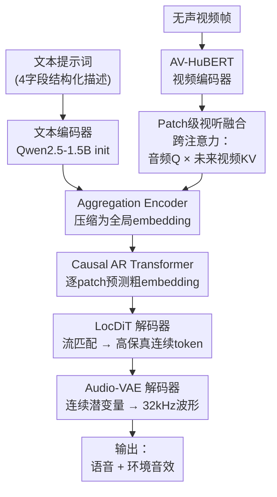

# HoliDubber: Holistic Video Dubbing for Complex Acoustic Scenes via Text-Guided Audio Synthesis

**会议**: ECCV 2026  
**arXiv**: [2606.09098](https://arxiv.org/abs/2606.09098)  
**代码**: 无  
**领域**: 视频理解 / 扩散模型  
**关键词**: 视频配音, 扩散Transformer, 音效合成, 视听融合, 流匹配

## 一句话总结
HoliDubber 提出首个通过单条文本提示词统一生成语音与背景环境音效的视频配音框架，采用 patch 级前瞻式视听跨注意力融合与自回归扩散 Transformer 架构，在保证高唇形同步性的同时实现复杂声场的端到端合成。

## 研究背景与动机

视频配音的目标是为无声视频同步生成与之匹配的音频信号，在影视本地化、游戏制作和数字人交互中广泛使用。现有配音方法（Speaker2Dubber、EmoDubber、ProDubber 等）在零样本语音合成和唇形同步上取得了显著进展，但它们无一例外地局限于孤立语音合成——只生成说话人的台词语音，完全忽略背景音乐、环境噪声和特效音等非语音成分。然而现实世界的视频场景中，笑声、风声、脚步声、背景音乐等环境音效恰恰是沉浸式音频体验的核心组成。当前配音工作流被迫依赖碎片化的多工具串联管线：先用独立的语音配音模型生成台词，再用文本-音效生成模型补环境音，最后人工混音对齐——每个环节之间的隐式断裂不仅效率低下，更难以保证整体音频与画面的时序一致性。

这种分离式方法的核心矛盾在于：语音和音效在声学属性上存在本质差异（语音需要清晰的语义内容和个性化音色，音效需要多样化的频谱结构和空间动态），但配音任务天然需要两者在时间上、情感上与视觉画面同时对齐。近年来虽然出现了 DualDub、VSSFlow 等尝试联合生成语音和音效的方法，但它们采用解耦的双头设计，将语音和音效视为独立任务分别输出，缺乏两者之间的内在协同；且它们以视觉信号为主条件，用户难以用自然语言精确控制想要添加的音效类型和氛围。

本文的切入角度是：既然文本提示已经能有效驱动高质量语音合成和音效生成，何不将两者统一到同一个生成过程中？关键挑战在于如何在保证唇形同步的同时，让同一个模型学会在恰当的时机生成不同类型的音频内容。**核心 idea：用单个结构化文本提示词统一驱动语音和环境音效的联合生成，通过 patch 级前瞻式视听跨注意力融合将发音动作的视觉线索注入自回归扩散 Transformer 的每一步生成过程中，实现从全局时序结构到局部高保真音频的端到端生成。**

## 方法详解

### 整体框架

HoliDubber 的输入为文本提示词（可选加参考语音）和无声视频，输出为包含语音与音效的完整音频片段。整体采用粗到细的分层架构：先由自回归 Transformer 模型在 patch 级别捕获长程时间依赖，再由局部分散式 DiT（LocDiT）解码器在 patch 内部合成高保真连续音频表征。

框架由五个核心组件构成：Audio-VAE 将音频编码到 25Hz 的连续潜空间（在语音、环境音、音乐及自然混合物上训练）；AV-HuBERT 提取每帧视觉特征；Patch 级视听融合模块通过跨注意力对齐音频与视频 patch 序列；Aggregation Encoder 压缩融合结果为全局表征；Causal AR Transformer 与 LocDiT 组成自回归扩散解码器，依次生成每个 patch 的精细音频内容。

### 关键设计

**1. 前瞻式 Patch 级视听融合：跨注意力而非拼接**

模型将音频和视频各自切分为等长 patch（patch size = 5 帧），通过跨注意力层融合——以音频 patch 为 query、未来视频 patch 为 key/value。前瞻式设计的关键在于：音频在生成当前语音片段时能提前"看见"即将发生的口型和面部运动，从而在时序上天然对齐。选择跨注意力而非简单拼接有两层理由：第一，跨注意力是侧通道注入，不改变音频特征的维度和分布，因此能完好保留预训练文生音频模型的能力；第二，注意力机制允许每个音频 token 自适应地从最富含发音信息量的视觉时刻提取线索，而非平均融合所有视觉特征——这对说话场景中只有少量帧承载显著唇动信息的稀疏特性至关重要。

**2. LocDiT：粗到细的局部扩散解码**

遵循 DiTAR 的分而治之策略，把 patch 间和 patch 内的建模分别委托给两个互补模块。Causal AR Transformer 负责 patch 之间的长程依赖建模，对每个 patch 仅产出一个粗粒度的隐层 embedding。LocDiT 使用双向注意力在 patch 内部以流匹配目标合成完整的连续音频表征。这种设计实现了一种隐式的粗到细生成：AR 模型压缩每个 patch 为粗特征、LocDiT 将其展开为高保真连续 token，避免了显式多阶段流水线的误差累积。此外，上一个已生成 patch 的完整输出被作为前缀输入提供给当前 patch 的 LocDiT，保证 patch 边界处音频的平滑连续性。

**3. 结构化音频描述与随机字段 Dropout**

为了让用户能精确控制生成内容，设计了四字段结构化文本提示词：<说话人画像>（性别/年龄/口音/音色）、<语音指令>（语速/情感基调/音质特征）、<音频说明>（背景音乐/环境声/空间动态）和<文本转录>（完整旁白文本）。训练时以 50% 概率随机丢弃辅助字段（只保留<文本转录>），这一简单设计使模型能兼容两种推理模式：零样本配音（仅有文本转录，无需参考语音，保留说话人身份）和文本提示配音（利用完整结构化描述精确控制音效内容）。随机 dropout 还消除了训练与零样本推理模式之间的分布不匹配问题。

### 损失函数 / 训练策略

整个模型端到端优化单一流匹配目标。给定真实音频潜变量 $x_0$ 和高斯噪声 $\epsilon\sim\mathcal{N}(0,\mathbf{I})$，对 $t\sim\mathcal{U}(0,1)$ 构造线性插值 $x_t=(1-t)\epsilon+tx_0$，LocDiT 预测速度场 $v_\theta(x_t,t,c)$，其中条件 $c$ 包含 AR 模型的隐层 embedding 和上一 patch 的完整输出：

$$
\mathcal{L} = \mathbb{E}_{t,\epsilon,x_0}\left[\|v_\theta(x_t,t,c) - (x_0 - \epsilon)\|_2^2\right]
$$

训练分为两阶段：先在约 130,000 小时纯音频数据上训练文本到音频生成骨架（Causal AR Transformer 初始化为 Qwen2.5-1.5B）；然后在 VoxCeleb2 和 CelebV-Dub 配音数据上微调整个模型，接入视频条件。推理时 LocDiT 仅需 10 步 ODE 采样即可获得高质量结果。

## 实验关键数据

### 主实验

零样本配音模式下与 AlignDiT（DiT 基线）、VoiceCraft-Dub（NCLM 基线）和 FunCineForge（MLLM 基线）的对比（VoxCeleb2 测试集）：

| 维度 | HoliDubber | 竞争方法表现 | 解读 |
|------|-----------|-------------|------|
| 唇形同步 LSE-C ↑ | 最优 | 与 AlignDiT 接近 | 跨注意力融合有效对齐发音动作 |
| 说话人相似度 SPK-SIM ↑ | 最高（接近 GT 约 0.71） | 显著领先 | 连续潜空间保真度优于离散编解码 |
| 内容准确性 WER ↓ | 中等 | AlignDiT 最低 | 联合生成中非语音成分干扰 ASR 测量 |
| 语音自然度 UTMOS ↑ | 最接近 GT | FunCineForge 最高但远超 GT | 过度平滑的"伪高质"问题需警惕 |

HoliDubber 在所有维度上表现出最均衡的性能，在保证出色唇形对齐和音色保真的同时，语音自然度最贴近真实录音。

### 消融实验

| 配置 | 关键指标变化 | 说明 |
|------|-------------|------|
| Full model | 综合最优 | 完整模型 |
| 推理时去掉视频条件 | LSE-C 大幅下降，WER 反而改善 | 质量-对齐存在固有权衡 |
| 跨注意力替换为特征拼接 | SPK-SIM 断崖下跌，WER 飙升至约 62% | 融合机制本身比加不加条件更重要 |
| 去掉随机字段 Dropout | 零样本 LSE-C 下降约 2.2 | 消除训练/推理分布不匹配是关键 |
| 联合模型 vs 独立 TTA 基线 | LSE-C: ~1.2→~6.4, FAD: ~10.5→~3.1 | 统一生成大幅优于管线拼接 |

### 关键发现
- **patch 级跨注意力是最关键模块**：替换为特征拼接后几乎所有指标崩溃，说明选择正确的融合机制比仅添加视觉条件重要得多。
- **质量-对齐存在固有权衡**：去掉视频后语音质量（WER/UTMOS）反而轻微改善，说明视觉约束对声学保真度有不可避免的干扰。
- **联合生成大幅优于管线拼接**：在 HoliDub-Bench 上，联合训练的 HoliDubber 在唇形同步和音效保真度上对独立的 TTS+TTA 流水线实现了质的飞跃，证明了统一生成范式的优势。

## 亮点与洞察
- **首次在视频配音中统一语音和音效生成**：此前所有配音方法要么只做语音，要么将语音和音效视为独立任务，HoliDubber 证明了单条提示词驱动的联合生成是可行且更优的范式。
- **前瞻式视听注意力**：音频 query 与未来视频 key/value 的注意力机制让生成过程天然对齐唇形运动，比常规同步注意力更契合自回归生成的时序特性。
- **结构化提示 + 随机 dropout** 让天然对立的两种推理模式（零样本 vs 精确控制）可以在同一模型中共存，是一个优雅的工程设计。
- **粗到细的 patch 级 AR+DiT 架构**将长程依赖建模和局部高保真生成解耦，且保留端到端的单一流匹配目标，避免了显式多模块管线的误差累积。

## 局限与展望
- **语音保真度与对齐之间的权衡尚未解决**：消融实验显示无视频条件时 WER 反而更低，说明视觉信息在改善同步的同时也带来了声学干扰——如何在两者间取得最佳平衡是值得探索的方向。
- **当前仅支持英语单说话人场景**：多说话人对话场景、多语种配音、多人交叠说话等真实影视场景中的表现尚未验证。
- **WER 相对较高**：部分原因是联合生成范式下非语音元素干扰了 ASR 转录，但也说明纯净语音条件下的 WER 仍有优化空间。
- **结构化标注依赖 Qwen3-Omni-30B 等大模型**：数据管线门槛较高，且标注质量和一致性可能影响下游生成效果。

## 相关工作与启发
- **vs AlignDiT**：AlignDiT 使用 DiT 做配音但只生成语音，HoliDubber 首次将音效纳入统一框架。AlignDiT 在纯语音 WER 上略优，但 HoliDubber 在更多维度取得均衡更好的表现。
- **vs FunCineForge**：FunCineForge 是 MLLM 路线，使用自然语言指令驱动配音但仍需参考语音，不支持真正零样本；HoliDubber 的文本提示模式实现了无需参考语音的生成，且唇形同步显著领先。
- **vs DiTAR（文生音频骨架）**：HoliDubber 直接继承了 DiTAR 的 AR+DiT 架构，但新增了 patch 级视听融合模块，证明该架构能有效扩展至跨模态生成。

## 评分
- 新颖性: ⭐⭐⭐⭐⭐ 首次实现统一语音与音效的视频配音生成，方法论和任务定义都有显著创新
- 实验充分度: ⭐⭐⭐⭐ 覆盖两个数据集、两个推理模式、多维度消融和 HoliDub-Bench 基准，但缺少用户主观评测中的显著性检验
- 写作质量: ⭐⭐⭐⭐ 方法描述清晰，消融设计完备
- 价值: ⭐⭐⭐⭐⭐ 解决了影视配音行业中的实际痛点，统一生成范式对多模态内容创作有直接应用价值

<!-- RELATED:START -->

## 相关论文

- [\[ICML 2026\] AVTrack: Audio-Visual Tracking in Human-centric Complex Scenes](../../ICML2026/video_understanding/avtrack_audio-visual_tracking_in_human-centric_complex_scenes.md)
- [\[CVPR 2025\] Learning Audio-Guided Video Representation with Gated Attention for Video-Text Retrieval](../../CVPR2025/video_understanding/learning_audio-guided_video_representation_with_gated_attention_for_video-text_r.md)
- [\[ICLR 2026\] OmniCVR: A Benchmark for Omni-Composed Video Retrieval with Vision, Audio, and Text](../../ICLR2026/video_understanding/omnicvr_a_benchmark_for_omni-composed_video_retrieval_with_vision_audio_and_text.md)
- [\[CVPR 2026\] Hear What Matters! Text-conditioned Selective Video-to-Audio Generation](../../CVPR2026/video_understanding/hear_what_matters_text-conditioned_selective_video-to-audio_generation.md)
- [\[AAAI 2026\] R-AVST: Empowering Video-LLMs with Fine-Grained Spatio-Temporal Reasoning in Complex Audio-Visual Scenarios](../../AAAI2026/video_understanding/r-avst_empowering_video-llms_with_fine-grained_spatio-temporal_reasoning_in_comp.md)

<!-- RELATED:END -->
