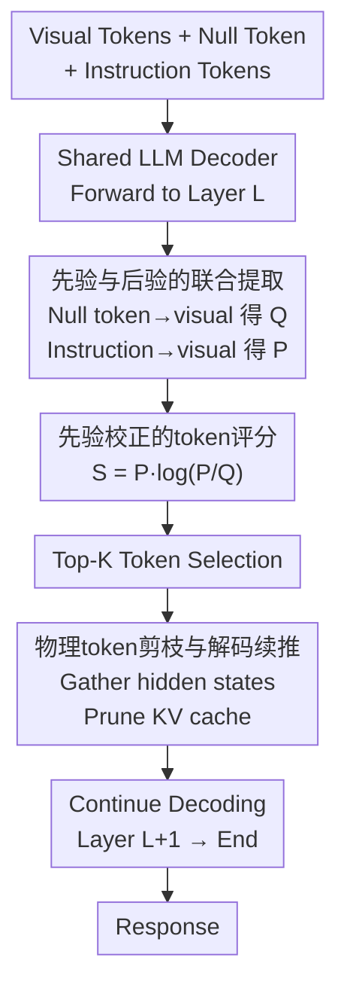

# Accelerating Multimodal Large Language Models with Prior-Corrected Token Reduction

**会议**: ECCV 2026  
**arXiv**: [2606.24156](https://arxiv.org/abs/2606.24156)  
**代码**: [https://github.com/CodeChildCZJ/PriorTR](https://github.com/CodeChildCZJ/PriorTR) (有)  
**领域**: 多模态VLM / LLM效率  
**关键词**: 视觉token剪枝, 注意力先验校正, V-可用信息, 无需训练推理加速, 多模态大语言模型

## 一句话总结
PriorTR 是一种无需训练的视觉 token 剪枝方法，通过用 null token（分隔符）估计模型固有的注意力先验，再用 V-可用信息 $P \cdot \log(P/Q)$ 替代原始注意力分数进行 token 排序，在单次前向传播中完成先验校正与物理剪枝，在激进 token 预算下显著提升了 MLLM 的精度-效率权衡。

## 研究背景与动机

**领域现状**：多模态大语言模型（MLLM）将图像编码为数百甚至上千个视觉 token 送入 LLM 处理，推理开销巨大。训练无关的视觉 token 剪枝方法因其即插即用、无需额外训练的便利性而成为主流加速手段。其中，基于注意力的方法（如 FastV、PDrop、SparseVLM）最具代表性：它们在某个早期 Transformer 层用 text-to-visual 注意力分数对视觉 token 排序，仅保留 top-K 个 token 继续后序层的计算。

**现有痛点**：这些方法的隐含假设是——注意力权重大小能可靠地反映 token 对指令的语义相关性。但本文揭示了一个关键问题：MLLM 存在强烈的**模型诱导先验**（model-induced prior），即即使在没有任何文本指令的情况下，模型也会持续关注图像中某些与任务无关的区域（如高对比度纹理、显著背景）。当剪枝依赖原始的绝对注意力分数时，这个先验会主导排序——大量注意力天然集中在背景区域，导致真正携带指令相关信息的 token 被压制甚至丢弃。

**核心矛盾**：作者将此现象形式化为**先验主导掩码**（prior-dominated masking）。将后验注意力分解为 $P_\theta(v|\mathbf{X}) = Q_\theta(v) \cdot \mathcal{L}(v, \mathbf{X})$，其中 $Q_\theta(v)$ 是先验（无指令时的注意力分布），$\mathcal{L}$ 是语义提升（semantic lift，即指令带来的额外信息增益）。当背景 token 的先验远大于目标 token 时，即使目标 token 的语义提升很高，其后验概率仍可能被压制，导致背景 token 被保留而关键 token 被丢弃。在激进 token 预算下，少量错误选择就会不可逆地丢失正确推理所需的视觉证据。

**本文目标**：不以原始后验注意力大小为排序依据，而是根据每个 token 实际贡献的**指令条件下的额外可用信息**来排序，从根本上消除模型诱导先验对 token 选择的干扰。

**切入角度**：作者从信息论中"可用信息"（usable information）的视角出发，将 token 选择问题转化为：在严格预算约束下，最大化被保留 token 集合所携带的、由指令引入的额外信息量。这个视角自然地导出了后验与先验的对比（contrast）作为排序准则。

**核心 idea**：用 null token（因果注意力掩码天然隔离的分隔符 \n）在单次前向传播中同时估计先验分布 $Q$ 和后验分布 $P$，然后用 $S = P \cdot \log(P/Q)$ 为每个 token 计算先验校正的重要性分数并物理剪枝。

## 方法详解

### 整体框架

PriorTR 要解决的核心问题是：如何在无需额外训练、不增加推理开销的前提下，从 MLLM 的注意力中分离出指令真正驱动的语义信号，并用它指导 token 剪枝。整体流程分三个阶段：在指定剪枝层 $L$（默认为第 2 层，最大化下游节省）完成前向传播后，从同一注意力矩阵中同时提取先验 $Q$ 和后验 $P$，计算先验校正分数并选出 top-K token，最后物理移除其余 token 的 hidden states 和 KV cache，让后序层在真正缩短的序列上继续解码。

具体来说：输入序列被组织为 `[Visual Tokens, Null Token, Instruction Tokens]` 的形式。Null token（在 LLaVA 中就是分隔符 `\n`）位于视觉 token 之后、指令 token 之前，由于因果注意力掩码，它只能看到前面的视觉 token 而完全看不到后面的指令 token——这使得 null token 对视觉 token 的注意力分布天然构成一个指令无关的先验 $Q$。与此同时，指令 token 对视觉 token 的注意力分布构成任务条件的后验 $P$。两者在同一次前向传播的同一个注意力矩阵中获得，无需额外的前向 pass。

随后，按 $S_i = P_i \cdot \log\left(\frac{P_i + \epsilon}{Q_i + \epsilon}\right)$（$\epsilon = 10^{-6}$ 防止数值溢出）计算每个视觉 token 的先验校正分数。该分数同时编码了两个因素：$P_i$（后验相关性质量，避免选出概率极低的离群 token）和 $\log(P_i/Q_i)$（去偏密度，惩罚先验主导的 token）。按 $S$ 降序选出 top-K token 后，物理收集对应的 hidden states 和 KV cache 条目，丢弃其余所有视觉 token，从第 $L+1$ 层起在缩短后的序列上继续自回归解码。因此后序层的注意力和 FFN 计算都按 $K$ 而非原始视觉 token 数量缩放，实现真实的延迟、显存和 FLOPs 节省。

### 关键设计

**1. 模型诱导先验的解耦：从后验中分离出先验与语义提升**

现有基于注意力的剪枝方法将后验 $P_\theta(v|\mathbf{X})$ 直接视为 token 重要性的代理，但本文通过可视化实验（Fig. 1）揭示了一个被忽略的事实：即使在无指令输入（null instruction）的情况下，MLLM 也会对图像中某些视觉显著但任务无关的区域分配高注意力。这意味着观察到的后验 $P_\theta(v|\mathbf{X})$ 并非纯净的任务信号，而是模型固有显著性偏好（先验）与指令驱动语义的混合物。

作者将后验显式分解为 $P_\theta(v|\mathbf{X}) \equiv Q_\theta(v) \cdot \mathcal{L}(v, \mathbf{X})$，其中 $Q_\theta(v) \triangleq P_\theta(v|\emptyset)$ 是模型诱导先验（null token 对视觉 token 的注意力分布），$\mathcal{L}(v, \mathbf{X}) = P_\theta(v|\mathbf{X}) / Q_\theta(v)$ 是语义提升（semantic lift），量化了指令 $\mathbf{X}$ 的介入使 token $v$ 的重要性相对于其先验的乘性增益。

基于此分解，作者形式化了"先验主导掩码"这一失败模式：当背景 token $v_{bg}$ 的先验远大于目标 token $v_{tgt}$ 时（$Q_\theta(v_{bg}) \gg Q_\theta(v_{tgt})$），即使 $v_{tgt}$ 的语义提升远高于 $v_{bg}$，只要先验差异的幅度超过语义提升差异的幅度，即满足 $\frac{\mathcal{L}(v_{tgt}, \mathbf{X})}{\mathcal{L}(v_{bg}, \mathbf{X})} < \frac{Q_\theta(v_{bg})}{Q_\theta(v_{tgt})}$，$v_{tgt}$ 的后验分数就会被 $v_{bg}$ 压制，导致关键 token 被丢弃而背景 token 被保留。这一分析直接说明：理想的排序依据应该是解耦后的 $\mathcal{L}$（或其对数形式），而非混淆了先验的原始后验 $P_\theta$。

**2. 先验校正的 token 评分：基于 V-可用信息的最优排序准则**

为解决上述问题，作者从"可用信息"（usable information）的理论框架出发，定义了 token 级别的逐点 V-可用信息（Pointwise $\mathcal{V}$-Information）：

$$\mathrm{PVI}(v) \triangleq \log \frac{P_\theta(v \mid \mathbf{X})}{Q_\theta(v)}$$

它度量了指令 $\mathbf{X}$ 为 token $v$ 带来的超出先验的语义增益。对于先验主导的区域（$P_\theta \approx Q_\theta$），PVI 自然趋近于 0，从而自动抑制纯先验 token。

在给定的二元选择掩码 $m \in \{0,1\}^N$ 和预算 $\sum m_i = K$ 约束下，作者定义被保留 token 集合的掩码总可用信息：

$$I_{\text{mask}}(m; \mathbf{X} \to \mathbf{V}) \triangleq \sum_{i=1}^{N} m_i \cdot P_\theta(v_i \mid \mathbf{X}) \cdot \log \frac{P_\theta(v_i \mid \mathbf{X})}{Q_\theta(v_i)}$$

这是 $D_{\mathrm{KL}}(P_\theta \| Q_\theta)$ 的一个加性掩码代理，显式地将每个 token 的效用分解为两个正交因子：(i) 相关性质量 $P_\theta(v_i|\mathbf{X})$，避免选出概率极低的离群 token；(ii) 去偏密度 $\log(P_\theta/Q_\theta)$，惩罚先验主导的 token。在严格预算下，最大化 $I_{\text{mask}}$ 的最优解就是选择贡献最大的 $K$ 个 token，由此自然导出 PriorTR 的核心评分公式：

$$S_{\text{PriorTR}}(v_i) \triangleq P_\theta(v_i \mid \mathbf{X}) \cdot \log \frac{P_\theta(v_i \mid \mathbf{X})}{Q_\theta(v_i)}$$

消融实验（Table 5）验证了该公式的每个组成部分都不可或缺：纯先验 $Q$（只看显著性）性能最差；纯后验 $P$（传统注意力排序）有所改善但在激进压缩下受限；简单差值 $P-Q$ 持续优于纯后验，验证了减去先验基线的必要性；但 PriorTR 的 $P \cdot \log(P/Q)$ 在所有预算和大多数 benchmark 上取得最优。这是因为差值规则只做减法，而联合形式同时利用 $P$ 保留相关性幅度信息，在极端压缩下提供了更稳定、更具判别力的排序。

**3. 单次前向传播的联合估计与物理剪枝：零额外开销的工程实现**

这一设计的核心创新在于如何高效地获取先验 $Q$ 和后验 $P$。朴素方案需要两次独立前向传播（一次带指令，一次不带），开销翻倍。PriorTR 巧妙地利用了自回归解码器的因果注意力结构：在输入序列中将 null token（分隔符 `\n`）置于视觉 token 之后、指令 token 之前，由于因果掩码，null token 只能看到前面的视觉 token 而完全看不到后面的指令 token，因此它对视觉 token 的注意力分布天然成为指令无关的先验 $Q$。与此同时，指令 token 对视觉 token 的注意力分布就是任务条件的后验 $P$。两者在同一层、同一次前向传播的同一个注意力矩阵中提取——相当于用一次前向的代价实现了两次前向的效果。

具体实现细节：在剪枝层 $L$ 获得多头注意力矩阵 $\mathbf{A} \in \mathbb{R}^{N_h \times T \times T}$ 后，从分隔符 token（位置 $i_e$）到视觉 token（$[i_s, i_e)$）的注意力行提取 $\tilde{Q}_i = \mathrm{Agg}_h(\mathbf{A}_{h, i_e, i_s+i})$，从所有指令 token（位置 $\ge i_e$）到视觉 token 的注意力聚合提取 $\tilde{P}$，两者均跨头平均后做 $L_1$ 归一化得到有效概率分布，然后按 $S_i = P_i \cdot \log\left(\frac{P_i + \epsilon}{Q_i + \epsilon}\right)$ 计算分数并 top-K 选择。

重要的是，PriorTR 执行的是**物理剪枝**而非掩码：仅收集被选中 token 对应的 hidden states 和 KV cache 条目，其余 token 从显存中彻底移除。后序层（$L+1$ 到最终层）的注意力和 FFN 计算都按缩短后的序列长度 $K$ 进行，从而获得真实的延迟降低、KV cache 缩减和 FLOPs 减少。这与某些仅做 attention mask 而序列长度不变的方法有本质区别。

### 损失函数 / 训练策略

PriorTR 完全无需训练，不修改任何模型权重，也不引入任何可学习参数。唯一需要设定的超参数是剪枝层位置 $L$（默认 $L=2$，附录验证 PriorTR 对剪枝层选择鲁棒）和保留 token 数 $K$。数值稳定化常数 $\epsilon = 10^{-6}$。

## 实验关键数据

### 主实验

在 LLaVA-1.5-7B（576 个视觉 token）上，三个 token 预算下与五个训练无关 baseline 的对比（Avg. 为 12 个 benchmark 的归一化均值）：

| 方法 | K=192 (↓66.7%) Avg. | K=128 (↓77.8%) Avg. | K=64 (↓88.9%) Avg. |
|------|---------------------|---------------------|--------------------|
| FastV (ECCV24) | 89.8 | 85.1 | 70.7 |
| PDrop (CVPR25) | 96.0 | 92.7 | 74.4 |
| SparseVLM (ICML25) | 97.4 | 91.2 | 81.4 |
| PruMerge (ICCV25) | 89.1 | 85.3 | 83.0 |
| VisPruner (ICCV25) | 98.5 | 96.6 | 91.7 |
| **PriorTR** | **99.5** | **98.2** | **94.5** |

PriorTR 在所有预算下均取得最高平均分。与 FastV 的差距在最小预算（K=64，89% token 被移除）时最大——这正是先验主导排序最严重的区域。在 Qwen3-VL-8B 上同样一致优于 FastV，且在 11.1% 极端保留率下优势最大（87.8% vs. 75.5% Avg.）。在 LLaVA-1.5-13B 上跨尺度泛化良好（K=64 时 94.7% vs. VisPruner 92.6%）。在视频理解任务（Video-LLaVA，2048 → 194 token，超 90% 压缩）上，PriorTR 纯剪枝模式比 FastV 高 +4.6 个平均准确点；PriorTR+Merging 变体匹配甚至超过未压缩基线。

效率方面（LLaVA-1.5-7B，K=64）：prefill 延迟 18.4ms，KV cache 仅 56MB，FLOPs 降为原始的 32.8%，吞吐量 37.9 samples/s，端到端加速 2.21x。重要的是 PriorTR 在取得与 FastV 相同的理论 FLOPs 和 KV cache 缩减的同时，保持了显著更高的精度（94.5% vs. 70.7%）。

### 消融实验

在 LLaVA-1.5-7B 上对比不同 token 评分函数（5 个 benchmark 平均值，%）：

| 评分函数 | 公式 | K=128 Avg. | K=64 Avg. | K=32 Avg. |
|---------|------|-----------|-----------|-----------|
| Prior | $Q$ | 90.9 | 79.3 | 59.9 |
| Posterior | $P$ | 93.7 | 86.7 | 74.5 |
| Entropy | $P\log P - Q\log Q$ | 82.6 | 72.3 | 57.6 |
| Log Ratio | $\log(P/Q)$ | 90.5 | 81.7 | 72.7 |
| Diff | $P - Q$ | 93.5 | 87.6 | 76.9 |
| **PriorTR** | $P \cdot \log(P/Q)$ | **95.8** | **91.5** | **84.5** |

关键发现：(1) 纯先验 $Q$ 最差，验证显著性不等同于任务相关性；(2) $P$ 作为传统注意力排序的代理，在极端压缩下性能下降严重；(3) 简单差值 $P-Q$ 持续优于纯后验，验证减去先验基线的必要性；(4) PriorTR 的联合形式 $P \cdot \log(P/Q)$ 在所有预算下最优，尤其在 K=32 时优势最大（84.5% vs. Diff 的 76.9%，差距+7.6%），说明同时编码相关性幅度和去偏密度在极端压缩下尤为关键。

### 关键发现

- **先验校正的收益随压缩率增加而放大**：在 K=192 时 PriorTR 与 VisPruner 差距仅 1.0%，到 K=64 时差距扩大至 2.8%，在 K=32 的消融中 $P \cdot \log(P/Q)$ 相对 $P-Q$ 的优势达到 +7.6%。预算越紧，正确排序越关键，先验校正的价值越大。
- **Null token 的选择鲁棒但需满足分布内条件**：将默认的 `\n` 替换为句号、逗号、"Image"、"Look" 等中间位置常见 token 时性能波动在 $\pm 0.6\%$ MMBench 以内；但使用仅出现在序列开头的 `<bos>` token 会导致大幅退化（-281 MME），说明因果掩码的架构隔离而非 token 语义身份是核心机制。
- **剪枝层位置影响不大**：PriorTR 在剪枝层从第 2 层到第 20 层范围内均稳定且一致优于 FastV，FastV 在过浅层剪枝时性能明显下降。
- **与 token 合并正交可叠加**：PriorTR+Merging 变体（用先验校正分数引导 SparseVLM 的聚类合并管线）在视频任务上匹配甚至超过未压缩基线。
- **TextVQA 是唯一痛点**：在极端压缩下纯注意力方法普遍退化（FastV K=64 时 TextVQA 47.8%），VisPruner 凭借显式空间多样性约束在此场景取得微弱优势（57.7% vs. 55.9%），提示先验校正与空间正则化的结合是未来方向。

## 亮点与洞察

- **将剪枝问题从"找重要 token"重新定义为"找指令真正用到的 token"**：这是核心洞察的转变。前人方法问"哪些 token 注意力高"，PriorTR 问"哪些 token 的注意力是真正由指令驱动的"。这一视角转换直接导出了先验-后验解耦的数学框架，比在原始注意力上打补丁（如加多样性约束）更根本。
- **Null token 的利用极其巧妙**：不插入任何新 token、不修改模型、不增加前向传播次数，仅利用输入模板中天然存在的分隔符和因果掩码的架构特性，就实现了先验和后验的联合估计。这个设计几乎零开销，却解决了"如何获取指令无关基线"这一核心工程挑战。
- **$P \cdot \log(P/Q)$ 的信息论解释自洽且优雅**：从最大化掩码条件下的可用信息出发，闭式推导出评分公式，天然编码了"既要相关性高（$P$ 大）又要与先验差异大（$\log(P/Q)$ 大）"两个维度。消融实验完美验证了两部分各自不可替代。
- **物理剪枝而非逻辑掩码**：许多 token 压缩方法只在 attention mask 上做文章，序列长度不变，理论 FLOPs 下降但实际延迟几乎不变。PriorTR 真正缩短了 KV cache 和 hidden states 序列，实现了端到端 2.21x 加速，这在工程上非常有价值，且这套物理剪枝机制可以复用到任何 token 重要性评分方法上。

## 局限与展望

- **本质受限于 token 预算的信息瓶颈**：即使排序完美，极端压缩（如保留 64/576 token）仍会不可逆地丢失精细空间信息。在计数、左右空间关系、深度排序等需要 token 稀疏但关键的视觉证据的任务上，PriorTR 和所有剪枝方法一样会失败——这是预算层面的天花板，而非排序准则的问题。
- **纯注意力方法在 OCR 密集场景有结构性短板**：TextVQA 上在 K=64 时略逊于引入显式空间多样性约束的 VisPruner（55.9% vs. 57.7%），说明仅靠先验校正的注意力排序在需要保留高频纹理细节的场景下仍有提升空间。将空间正则化融入 PriorTR 的评分框架是自然的扩展方向。
- **仅验证了 LLaVA 架构族和 Qwen3-VL**：虽覆盖了固定分辨率、动态分辨率、视频等多种 setting，但未在非 causal decoder 架构（如交叉注意力机制）上测试，先验-后验解耦框架在那些架构下的适用性未知。
- **先验估计依赖合理的 null token 选择**：方法要求 null token 在预训练中的位置分布与剪枝时一致（中间位置），位置分布外的 token（如 `<bos>`）会导致先验估计严重失真。尽管默认分隔符在所有主流模型中都可用，但在自定义输入模板中需要注意这一点。

## 相关工作与启发

- **vs FastV (ECCV 2024)**：同为 attention-based 训练无关剪枝，FastV 用最后一列指令 token 的原始注意力分数排序，本文指出这实际上是被模型诱导先验污染的混合信号。PriorTR 在保持相同效率的前提下（相同 FLOPs、相同 KV cache），通过先验校正大幅提升精度，且可视为 FastV 评分函数的一个直接替换升级。
- **vs VisPruner (ICCV 2025)**：VisPruner 将注意力重要性与空间多样性约束混合，在 OCR 场景有优势但引入了额外启发式超参。PriorTR 更纯粹——仅通过解耦先验和后验这一条原则就达到或超越 VisPruner 的整体水平。两者的互补性非常明显：将多样性约束整合进 PriorTR 的评分框架可能同时获得两条路径的好处。
- **vs SparseVLM (ICML 2025)**：SparseVLM 的核心贡献在 token merging 而非评分准则，其底层仍依赖原始注意力排序。PriorTR+Merging 变体实验表明，将 SparseVLM 的底层评分替换为先验校正分数后，合并质量进一步提升——说明 PriorTR 的评分准则可以作为其他 token 压缩管线的"drop-in replacement"。
- **vs PDrop (CVPR 2025)**：PDrop 采用渐进式多层剪枝（pyramid dropping），但每层的评分仍基于原始注意力。PDrop 的渐进策略与 PriorTR 的先验校正评分是正交维度，两者可以叠加。

## 评分
- 新颖性: ⭐⭐⭐⭐☆ 观察"模型诱导先验主导注意力排序"这一现象本身不复杂，但将其形式化为先验-后验解耦框架并用 V-可用信息统一起来，思考深度和理论完整性都很好。null token 的单次估计技巧简洁优雅，属于"读完后觉得理所当然但之前没人这么做"的类型。
- 实验充分度: ⭐⭐⭐⭐⭐ 12 个图像 benchmark + 4 个视频 benchmark，覆盖 5 个 baseline 和 5 个 MLLM 架构（7B/13B scale、固定/动态分辨率、图像/视频），消融覆盖评分函数、null token 选择、剪枝层位置，效率分析包含延迟、KV cache、FLOPs、吞吐量四个维度，附录还有更多模型和失败案例分析。实验设计全面且诚实（标注了 TextVQA 的弱点）。
- 写作质量: ⭐⭐⭐⭐☆ 问题动机通过 Fig. 1 可视化非常直观，数学推导从分解到充分条件到闭式解逻辑清晰。方法部分 Algorithm 1 简洁完整。略微不足之处是部分公式符号在纯文本版本中有格式损失。
- 价值: ⭐⭐⭐⭐⭐ 训练无关、零额外开销、即插即用、可与其他方法正交叠加——这些特性使得 PriorTR 具有极高的实用价值。先验-后验解耦的分析框架本身也可能启发其他需要区分"模型固有偏好"和"输入驱动信号"的任务（如 KV cache 压缩、长文本注意力稀疏化）。

<!-- RELATED:START -->

## 相关论文

- [\[ECCV 2026\] Spectral Evolution-Guided Token Pruning in Multimodal Large Language Models](spectral_evolution-guided_token_pruning_in_multimodal_large_language_models.md)
- [\[CVPR 2026\] Rethinking Token Reduction for Large Vision-Language Models](../../CVPR2026/vlm_efficiency/rethinking_token_reduction_for_large_vision-language_models.md)
- [\[CVPR 2026\] CoIn: Coverage and Informativeness-Guided Token Reduction for Efficient Large Multimodal Models](../../CVPR2026/vlm_efficiency/coin_coverage_and_informativeness-guided_token_reduction_for_efficient_large_mul.md)
- [\[CVPR 2026\] MoDES: Accelerating Mixture-of-Experts Multimodal Large Language Models via Dynamic Expert Skipping](../../CVPR2026/vlm_efficiency/modes_accelerating_mixture-of-experts_multimodal_large_language_models_via_dynam.md)
- [\[CVPR 2026\] Accelerating Streaming Video Large Language Models via Hierarchical Token Compression](../../CVPR2026/vlm_efficiency/accelerating_streaming_video_large_language_models_via_hierarchical_token_compre.md)

<!-- RELATED:END -->
