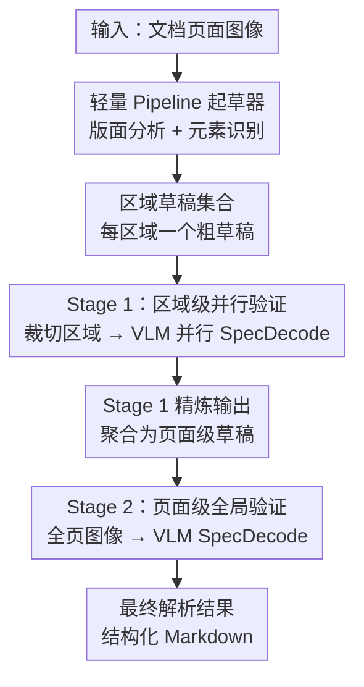

# HSD: Training-Free Acceleration for Document Parsing Vision-Language Models with Hierarchical Speculative Decoding

**会议**: ECCV 2026  
**arXiv**: [2602.12957](https://arxiv.org/abs/2602.12957)  
**代码**: [https://github.com/whlscut/HSD](https://github.com/whlscut/HSD)  
**领域**: 多模态VLM / LLM效率  
**关键词**: 层次化推测解码, 文档解析, 视觉语言模型, 推理加速, 免训练

## 一句话总结
本文提出层次化推测解码（HSD），一种免训练的端到端文档解析加速方法：先用轻量级 pipeline 为每个区域生成粗草稿，再分两阶段验证——Stage 1 在裁切区域上并行做局部验证以获得高吞吐，Stage 2 在全页上做全局验证以恢复跨区域连贯性；在 HunyuanOCR 上实现 2.78 倍端到端加速且精度近乎无损，长文档场景最高加速 7.04 倍。

## 研究背景与动机
VLM 端到端文档解析已成为主流范式——模型直接输入页面图像、自回归输出结构化标记（文本、公式、表格、阅读顺序），凭借强大的语义建模和全局上下文建模能力，在复杂版面、噪声和跨区域依赖上表现鲁棒。然而，自回归解码长序列导致推理延迟随输出长度线性增长，处理多页长文档时尤为严重。现有的混合方法（pipeline 做版面分割 + VLM 按区域并行解码）通过区域级并行提升了效率，但独立解码每个区域丢失了跨区域关联（如阅读顺序、跨栏连接），一旦版面分割或阅读顺序先验出错，VLM 被迫在错误分区/顺序下解码，造成误差传播。

核心矛盾在于：**区域级并行与页面级全局连贯性似乎不可兼得**——要并行就得拆区域、丢上下文；要连贯性就得全页自回归、牺牲速度。本文证明这一矛盾并非固有，切入角度是推测解码（speculative decoding）：让一个快速的 drafter 先"猜"出草稿，再由目标模型并行"验证"——但直接把标准推测解码搬到文档解析面临独特挑战：传统推测解码的 drafter 每步都和 target 同步刷新，而文档解析中 pipeline 一次性生成所有草稿后就固定不变（解耦），导致草稿与 target 当前生成前缀之间出现不对齐。核心 idea：用**层次化**两阶段验证（先并行验区域、再全局验整页）兼顾速度与连贯性，用**解耦推测验证**（草稿-目标匹配 + 前缀树批处理）解决解耦场景下的前缀不对齐问题。

## 方法详解

### 整体框架
HSD 的输入是一张文档页面图像，输出是结构化解析结果（Markdown）。整体流程分三步：首先，一个轻量级 pipeline（默认使用 PP-StructureV3）对页面做版面分析和元素识别，输出区域划分 `R = {r_i}` 及每个区域的粗草稿 `Ỹ^{(i)}`（文本、公式、表格的初步识别结果）；然后，端到端 VLM 解析器分两阶段验证这些草稿——Stage 1 将每个区域裁切出来、并行送入 VLM 做推测验证，产生精炼后的区域解析结果；Stage 2 将所有 Stage 1 输出聚合成页面级草稿，再送入 VLM 在全页图像上做一次全局推测验证，修正残存的结构性错误（阅读顺序、层级关系、跨区域断裂等），输出最终解析结果。整个过程是免训练的（training-free），只需要一个现成的端到端解析器和任意 pipeline drafter。

### 关键设计

**1. 层次化推测解码：Stage 1 区域级并行验证**

痛点在于端到端解析器自回归解码长序列时延迟极高，而直接按区域并行解码（混合方法）会丢失全局上下文。HSD 的设计是：把推测解码的"猜+验"扩展为两层。Stage 1 中，对 pipeline 输出的每个区域 `r_i`，取其裁切图像 `z_i = x|_{r_i}` 和对应草稿 `Ỹ^{(i)}`，调用推测解码算子并行验证：

$$\hat{\mathbf{y}}^{(i)} = \text{SpecDecode}(p_\theta, z_i, \tilde{\mathcal{Y}}^{(i)})$$

这一步的关键收益是并行度：多个区域同时做推测验证，每个区域内又通过推测解码一次接受多个 token，大幅压缩了解码步数。但代价是裁切输入缺乏全页上下文，且 pipeline 的版面分割错误（如过分割、漏检、阅读顺序错）会直接遗传到这一阶段。因此 Stage 1 的输出虽然 token 级质量已经较高，但仍存在结构性问题（层级错误、区域断裂、阅读顺序混乱），需要 Stage 2 兜底。

**2. Stage 2 页面级全局验证：恢复跨区域连贯性**

Stage 2 的输入是 Stage 1 所有输出的无序集合，作为页面级草稿：

$$\tilde{\mathcal{Y}}^{\text{pg}} = \{\hat{\mathbf{y}}^{(i)} \mid r_i \in \mathcal{R}\}$$

然后在全页图像 `x` 上做一次推测验证：

$$\hat{\mathbf{y}}^{\text{pg}} = \text{SpecDecode}(p_\theta, x, \tilde{\mathcal{Y}}^{\text{pg}})$$

关键洞察在于：Stage 1 的输出已经是高质量的页面级草稿（token 级错误已被修正），Stage 2 只需要做**少量步数的结构性修正**——纠正阅读顺序、合并过分割的文本块、补全缺失的语义区域、修正标题层级等。因此 Stage 2 虽然回到了全页自回归，但因为草稿质量高、接受长度大，实际解码步数远少于从头自回归。最终的阅读顺序由 VLM 在验证过程中自行决定，而非依赖 pipeline 的先验。消融实验表明，去掉 Stage 2 只用 Stage 1 会导致 dots.ocr 在 OmniDocBench v1.5 上从 88.41 骤降至 70.47，充分说明页面级全局验证对恢复跨区域连贯性不可或缺。

**3. 解耦推测验证：草稿-目标匹配与前缀树批处理**

传统推测解码中，drafter 每次生成草稿时都以前缀同步为前提——drafter 的输出是 target 当前已接受 token 的延续。但 HSD 的场景是**解耦**的：pipeline 一次性生成所有草稿后就固定不动，不会随 target 的解码进度刷新。这导致草稿与 target 的当前生成前缀之间出现不对齐——target 已经接受了一段 token，但草稿中对应位置的内容可能不同。

HSD 用两部分机制解决这一问题。(a) **草稿-目标匹配**：在每个解码步 `t`，取 target 已接受序列的最近 `n` 个 token 作为参考窗口 `w = ŷ_{t-n+1:t}`（默认 `n=3`），然后在所有草稿中滑动匹配 `w`，找到每个匹配位置 `j`，提取匹配窗口之后的后续 token 作为候选延续 `C`。形式化地，匹配位置集合为 `J(ỹ) = {j | ỹ_{j:j+n-1} = w}`，候选集为 `C = {ỹ_{j+n:|ỹ|} | ...}`。(b) **前缀树批处理**：当候选数 `|C| > 1` 时，将 `C` 组织成前缀树 `T`——共享前缀的候选合并为同一路径，每个节点 `v` 代表一个唯一前缀 `π(v)`，其子节点集合 `Next(v)` 为该前缀之后所有可能的下一个 token。将前缀树线性化为打包序列 `P`，施加**树祖先注意力掩码**——每个 token 只关注已接受序列 `ŷ_{1:t}` 和自己祖先路径上的 token——从而一次前向传播即可验证多条候选路径，不破坏自回归条件依赖。

验证时采用贪婪树遍历：从根节点出发，在 `Next(s)` 中选择模型概率最高的 token `u*`，若满足接受条件 `log p_θ(u*|...) - log p_θ(û|...) >= log τ`（其中 `û` 为整个词表上概率最高的 token，`τ` 为接受阈值，默认 0.75），则接受 `u*` 并移到其子节点；否则停止。遍历终止后，将接受的路径拼接到已接受序列末尾，再加上一步自由生成 token `û`，完成一轮推测验证。通过树结构并行验证，每步可接受多个 token。

### 一个完整示例
假设输入一页学术论文，含标题、双栏正文、一个表格和一组公式。Pipeline 先做版面分析，将页面分为 6 个区域（标题区、左栏正文、右栏正文、表格区、公式区 1、公式区 2），并为每个区域生成粗草稿（如表格区的 HTML/Markdown 草稿、公式区的 LaTeX 草稿）。Stage 1 将 6 个裁切区域分别送入 VLM（如 dots.ocr）并行做推测验证：对正文区域，pipeline 草稿可能只有少量 OCR 错误（如 "th" 误识别为 "th"），VLM 在一次推测验证中接受约 4 个 token 后修正这些局部错误；对表格区，pipeline 草稿可能漏了合并单元格信息，VLM 在验证中补全。6 个区域并行处理完后，Stage 1 输出被聚合成一个页面级草稿。但此时草稿存在结构性问题：Stage 1 中左栏最后一段实际是跨栏延续，被错误地当成了独立段落；表格的 caption 被分到了正文区域。Stage 2 在全页图像上做推测验证时，VLM 发现阅读顺序错误——它看到左栏末段的语义需要右栏承接——于是在一次推测解码步中拒绝了错误段落、重新排列了阅读顺序，并将表格 caption 合并回表格区域。整个流程 Stage 1 并行验证约消耗 3 次解码步，Stage 2 全局验证消耗约 5 次解码步，而基线自回归解码需要约 40 次解码步，实现接近 2.4 倍端到端加速。

## 实验关键数据

### 主实验
HSD 在 OmniDocBench v1.5（1,355 页，9 种文档类型）、olmOCR-Bench（1,403 PDF，7,010 单元测试）和 Ocean-OCR-Bench（200 页中英双语）三个基准上评估，覆盖 6 个模型（Qwen2.5/3-VL 系列、dots.ocr、HunyuanOCR）。

| 模型 | 参数量 | AAL | SR_decode | SR_e2e | 最高单类 SR_e2e |
|------|--------|-----|-----------|--------|-----------------|
| Qwen2.5-VL-7B | 8B | 3.56 | 2.13x | 2.10x | 2.95x (Newspaper) |
| Qwen2.5-VL-3B | 4B | 2.52 | 2.14x | 2.12x | 2.80x (Newspaper) |
| Qwen3-VL-8B | 9B | 3.98 | 2.62x | 2.61x | 4.62x (Newspaper) |
| dots.ocr | 3B | 3.98 | 2.44x | 2.42x | 4.89x (Financial Report) |
| HunyuanOCR | 0.9B | 4.55 | 2.82x | 2.78x | **7.04x** (Financial Report) |

与现有推测解码方法的对比（均以 Qwen2.5-VL-3B 为目标模型，公平适配文档解析数据）：

| 方法 | 来源 | OmniDocBench SRe2e | olmOCR-Bench SRe2e | Ocean-OCR-Bench SRe2e |
|------|------|--------------------|--------------------|-----------------------|
| VSD | ICML 2023 | 1.01x | 1.02x | 1.12x |
| Medusa | ICML 2024 | 1.26x | 1.28x | 1.32x |
| EAGLE-2 | EMNLP 2024 | 1.69x | 1.86x | 1.69x |
| ViSpec | NeurIPS 2025 | 1.75x | 1.90x | 1.72x |
| **HSD** | **Ours** | **2.12x** | **2.64x** | **2.72x** |

现有推测解码方法在文档解析上加速有限（最好基线 ViSpec 仅 1.72-1.90x），因为它们的 drafter（无论是独立小模型还是目标模型内嵌模块）难以有效预测长文档的结构化输出。HSD 利用 pipeline 作为 drafter 天然适配文档的版面结构，加上层次化验证，显著超过所有基线。

### 消融实验
层次化设计的精度消融（dots.ocr 为解析器）：

| 配置 | OmniDocBench v1.5 | olmOCR-Bench | Ocean-OCR-Bench |
|------|-------------------|--------------|-----------------|
| Pipeline 草稿（未经验证） | 86.73 | 65.80 | 85.20 |
| dots.ocr 基线（自回归） | 88.41 | 79.90 | 91.45 |
| HSD Stage 1 only | 70.47 | 67.30 | 86.92 |
| HSD Stage 1+2（完整） | 88.81 | 79.40 | 92.56 |

仅用 Stage 1（区域并行验证）精度暴跌，因为丢失全局上下文且遗传了 pipeline 的版面分割错误。加上 Stage 2 后精度恢复到与基线持平甚至略高（OmniDocBench 88.81 vs 88.41；Ocean-OCR 92.56 vs 91.45），说明 Stage 2 能有效修正 Stage 1 的结构性错误。

框架设计消融（dots.ocr，OmniDocBench v1.5）：

| 配置 | AAL | SR_decode | SR_e2e |
|------|-----|-----------|--------|
| 基线自回归 | - | 1.00x | 1.00x |
| + 仅页面级推测解码 | 2.49 | 2.11x | 2.09x |
| + 层次化推测解码（完整 HSD） | 3.98 | 2.44x | 2.42x |

仅用 pipeline 草稿做页面级推测解码已有 2.09x 加速，加入 Stage 1 区域并行验证后将 AAL 从 2.49 提升到 3.98、端到端加速从 2.09x 提升到 2.42x，说明两阶段设计产生协同增益。

### 关键发现
- **Stage 2 是精度兜底的关键**：去掉 Stage 2 后 dots.ocr 的 OmniDocBench 精度从 88.41 跌至 70.47（-17.94 点），验证了区域级并行验证虽然高效但会严重破坏全局连贯性。而加上 Stage 2 后精度完全恢复（88.81），说明少量步数的全页验证足以修正结构性错误。
- **加速效果与文档类型强相关**：长文档、多语义块的类型（如 Newspaper、Academic Papers、Financial Report）加速最大（最高 7.04x），因为解码占主导且区域并行度高；手写体、退化扫描件（如 olmOCR-Bench 的 Old Scans）加速有限（~1.4x），因为 pipeline 草稿质量差导致接受率低。
- **pipeline drafter 选择具有鲁棒性**：即使注入噪声降低草稿质量，HSD 仍维持超过 2.3x 的加速，说明方法对 drafter 质量不敏感。接受阈值 `τ=0.75` 和参考窗口 `n=3` 在加速与精度之间取得最佳平衡，`τ` 过小（<0.75）时精度明显下降。
- **与视觉 token 压缩（VTC）正交叠加**：在 DeepSeek-OCR 的 VTC 基础上叠加 HSD，可额外获得 1.41-1.91x 加速，验证了方法的即插即用和可叠加性。

## 亮点与洞察
- **用文档的版面结构"白嫖"推测解码的并行性**：标准推测解码需要 drafter 和 target 前缀同步，但文档天然可以按版面分区——这篇论文巧妙地把"分区"变成"并行推测的天然粒度"，用 pipeline 的版面分析结果直接作为多路草稿，而不需要每步刷新。这个思路的核心洞察是：文档的结构化先验（版面、阅读顺序）可以作为推测解码的免费结构信息。
- **两层验证的精妙分工**：Stage 1 负责吞吐（并行验区域，修正 token 级错误），Stage 2 负责质量（全局验整页，修正结构级错误）。这种"先粗后精"的分工与文档解析的误差类型天然匹配——局部 OCR 错误容易在区域内修正，阅读顺序和层级错误必须有全局视野才能发现。这种分工逻辑可迁移到任何"输出有局部结构但需要全局一致性"的长序列生成任务（如代码生成中的跨文件引用、长文档摘要中的跨段落连贯）。
- **前缀树批处理 + 树祖先注意力掩码**是一个很干净的解耦推测解码方案：用最近 n 个 token 窗口匹配解决解耦不对齐，用前缀树共享公共前缀避免冗余验证，用树祖先掩码保持自回归因果性。这套机制独立于文档解析，可以迁移到任何"drafter 一次性生成多个候选、不与 target 同步刷新"的推测解码场景。
- **免训练 + 即插即用的工程价值**：不需要修改 VLM 架构、不需要额外训练数据、不依赖特定 drafter，换一个端到端解析器或 pipeline drafter 就能直接用。这种设计在工业落地上有天然优势。

## 局限与展望
- **prefill 主导场景加速有限**：对于短文档或稀疏输出页面，视觉编码和 prefill 的固定开销占比大，即使解码端大幅压缩，端到端加速也会被 prefill 摊薄（论文 Table A1 显示 prefill 占比 >8% 的页面 SRe2e 仅 1.05x）。改进方向是将 HSD 与视觉 token 压缩、KV-cache 复用等 prefill 加速技术结合。
- **pipeline 草稿质量是加速上限的硬约束**：当 pipeline 遇到手写体、严重退化扫描件时，草稿质量差导致匹配窗口命中率低、接受长度短、回滚频繁，加速效果退化（olmOCR-Bench Old Scans 仅 1.40x）。一个具体改进方向是用合成数据增强 pipeline 对手写/退化文档的鲁棒性，或引入多 drafter 投票机制。
- **当前仅在单页文档上验证**：多页文档（如 PDF 书籍、扫描合同）有更强的跨页依赖（章节连续、图表跨页），HSD 的层次化思想可以扩展到"页内区域并行 + 跨页上下文验证"的三层结构，但需要处理跨页图像拼接和 KV-cache 跨页复用。
- **接受阈值 `τ` 和参考窗口 `n` 目前全局固定**：如果能根据文档类型或草稿置信度自适应调整（如手写页面放宽 `τ`、结构化页面收紧 `τ`），可能在不牺牲精度的前提下进一步提升加速比。

## 相关工作与启发
- **vs 标准推测解码（VSD / Medusa / EAGLE-2）**: 这些方法依赖 drafter 与 target 的前缀同步，每步刷新草稿。在文档解析中，其 drafter（无论是独立小模型还是 target 内嵌头）难以预测长结构化序列的下一个 token，导致接受率极低（VSD 的 AAL 虽然高但 SRe2e 仅 1.01x，说明验证开销完全抵消了步数节省）。HSD 的差异化在于用 pipeline 的版面分析作为"免费"的结构化草稿源，并将同步验证改为解耦匹配验证。
- **vs 混合文档解析（MonkeyOCR / Dolphin / MinerU 2.5）**: 混合方法也是"先版面分割、再区域并行解析"，但它们没有验证/修正机制——一旦版面分割出错，VLM 被迫在错误上下文下解码。HSD 的 Stage 2 全页验证本质上是给混合方法加了一个"全局纠错"安全网，这是混合范式可以借鉴的关键设计。
- **vs ViSpec / HiViS（VLM 专用推测解码）**: 这些方法针对通用 VLM 对话场景设计，依赖视觉 token 级别的草稿预测。但在文档解析中，输出是高度结构化的长序列（Markdown/LaTeX），token 级预测的收益被序列长度放大后的验证开销抵消。HSD 的启发是：**对于结构化长输出任务，应利用任务本身的结构先验（版面分区）而非通用 token 预测来做草稿**。

## 评分
- 新颖性: ⭐⭐⭐⭐☆ 将推测解码引入文档解析并设计层次化解耦验证范式，思路新颖；但推测解码本身的 draft-verify 框架是已知的，核心创新在"怎么适配文档场景"而非全新范式。
- 实验充分度: ⭐⭐⭐⭐⭐ 6 个模型、3 个基准、多文档类型、消融/超参/对比/叠加实验齐全，对比了 10 个推测解码基线 + 4 类文档解析范式，附录有定性分析和 Roofline 模型分析。
- 写作质量: ⭐⭐⭐⭐⭐ 方法论从范式到算子层层递进，notation 清晰，公式与文字对应紧密；实验分组合理，关键发现明确点出；图 2 对 DSV 机制的可视化到位。
- 价值: ⭐⭐⭐⭐☆ 文档解析是 VLMs 落地的核心场景，免训练即插即用 + 近无损 2-3x 加速有强工程价值；层次化验证+解耦推测解码的设计思路对其他结构化长序列生成任务（表格理解、图表解析、代码生成）有迁移潜力。

<!-- RELATED:START -->

## 相关论文

- [\[ICLR 2026\] VisionTrim: Unified Vision Token Compression for Training-Free MLLM Acceleration](../../ICLR2026/vlm_efficiency/visiontrim_unified_vision_token_compression_for_training-free_mllm_acceleration.md)
- [\[CVPR 2026\] Attention-aware Inference Optimizations for Large Vision-Language Models with Memory-efficient Decoding](../../CVPR2026/vlm_efficiency/attention-aware_inference_optimizations_for_large_vision-language_models_with_me.md)
- [\[NeurIPS 2025\] ViSpec: Accelerating Vision-Language Models with Vision-Aware Speculative Decoding](../../NeurIPS2025/vlm_efficiency/vispec_accelerating_vision-language_models_with_vision-aware_speculative_decodin.md)
- [\[CVPR 2026\] VVS: Accelerating Speculative Decoding for Visual Autoregressive Generation via Partial Verification Skipping](../../CVPR2026/vlm_efficiency/vvs_accelerating_speculative_decoding_for_visual_autoregressive_generation_via_p.md)
- [\[CVPR 2026\] ZOO-Prune: Training-Free Token Pruning via Zeroth-Order Gradient Estimation in Vision-Language Models](../../CVPR2026/vlm_efficiency/zoo-prune_training-free_token_pruning_via_zeroth-order_gradient_estimation_in_vi.md)

<!-- RELATED:END -->
