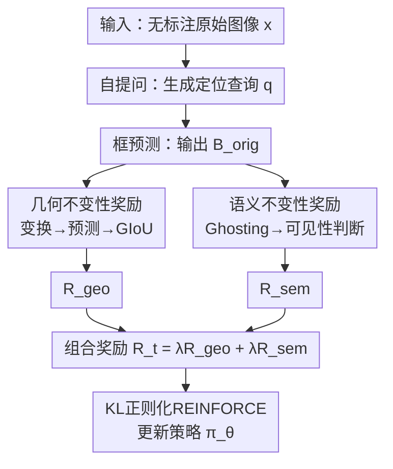

# Paying More Attention to Visual Tokens in Self-Evolving Large Multimodal Models

**会议**: ECCV 2026  
**arXiv**: [2606.27373](https://arxiv.org/abs/2606.27373)  
**代码**: [github.com/mbzuai-oryx/VISE](https://github.com/mbzuai-oryx/VISE)  
**项目页**: [mbzuai-oryx.github.io/VISE](https://mbzuai-oryx.github.io/VISE/)  
**领域**: 多模态VLM  
**关键词**: 自演化、视觉欠条件化、不变性奖励、多模态大模型、幻觉抑制

## 一句话总结
VISE 提出纯无监督的单模型自演化框架，用几何不变性和语义不变性两种奖励信号直接正则化解码器的视觉条件化策略（而非优化答案一致性），在 Qwen3-VL-2B 上 COCO CIDEr 提升 +16.85、TextCaps CIDEr 提升 +19.66、幻觉 Chair-I 降低 5.0 点，且跨 4 个模型规模（2B/4B/8B/32B）与 4 种架构主干一致有效，无任何任务间的 tradeoff。

## 研究背景与动机
**领域现状**：近期自演化大模型（self-evolving LMM）通过 multi-role self-play（如 Proposer-Solver 双角色博弈）和答案自洽性奖励，在无人工标注下实现了视觉推理能力的自我提升。典型工作如 EvoLMM 用 questioner-reasoner 协同演化、iReasoner 引入轨迹感知奖励、VisPlay 加入多样性和难度约束防止模式坍塌。

**现有痛点**：这些方法的奖励信号只关心"答案是否 self-consistent"，不要求解码器真正看图像。解码器可以利用统计语言先验（如"滑板通常在地上"）产出自洽答案，而完全忽略图像中的视觉证据（滑板实际搭在金属栏杆上）。这就导致一个持续的失效模式——**视觉欠条件化（visual under-conditioning）**：解码器生成时对视觉 token 的注意力不足，输出由语言先验驱动而非图像内容驱动。

**核心矛盾**：答案一致性不等于视觉接地。基于答案一致性的自演化方法在科学/数学图表类推理 benchmark 上提升显著（那些任务所需的视觉线索稀疏且可被快速消化），但在需要细粒度视觉理解的任务（图像描述、区域级描述）上表现退化甚至不如 baseline。例如 EvoLMM 在 Qwen3-VL-2B 上 COCO CIDEr 反而下降 −0.70，Flickr30k 下降 −0.94——说明优化答案一致性反而强化了语言先验依赖。

**本文目标**：不优化答案一致性，而是直接正则化模型的"视觉条件化策略"本身——即强制解码器在生成时持续关注视觉 token，而非走语言先验的捷径。

**切入角度**：真正看图定位的模型应满足两种不变性：（1）在已知几何变换下，预测的定位框应精确地映射到分析投影的结果；（2）当预测区域的视觉证据被抹除时，模型应能识别目标"看不见了"。这两种不变性天然构成无监督训练信号。

**核心 idea**：用几何不变性奖励（空间一致性）+ 语义不变性奖励（证据敏感性）作为纯自监督的 REINFORCE 训练信号，在单模型内完成自演化，无需多角色博弈、无需外部奖励模型、无需任何标注。

## 方法详解

### 整体框架
VISE 是一个单模型自提问自回答的自演化框架。每步训练中，模型面对一张无标注原始图像，首先生成一个自然语言的定位查询（描述图中某个显著且空间明确的目标），然后预测该查询对应的边界框。此后分两路：几何不变性分支对图像施加已知的空间变换（仿射/裁剪/翻转），要求模型在新视角下重新预测边界框，用 GIoU 衡量空间一致性作为奖励；语义不变性分支对原始图像的预测区域做"幽灵化"（Gaussian blur 抹除），让模型判断目标是否仍然可见，以此衡量证据敏感性。两路奖励组合后，通过 KL 正则化的 REINFORCE 更新模型参数。视觉编码器冻结，只更新多模态投影层、FFN 和解码器注意力投影。

### 关键设计

**1. 几何不变性奖励：通过空间变换强制视觉定位一致性**

针对视觉欠条件化最直接的体现——定位不稳定——本文利用已知几何变换作为自监督信号。具体流程：模型对原始图像 $x$ 预测边界框 $B_{\text{orig}}$ 后，从三种变换中均匀采样一种（仿射：旋转 $\pm 10^\circ$、缩放 0.9-1.1、平移 $\pm 50$ 像素；裁剪：比例 0.8-1.0 后缩放回原分辨率；水平翻转），对图像施加变换得到 $x'=\mathcal{T}(x)$。模型在 $x'$ 上对同一查询 $q$ 再次预测边界框 $B_{\text{new}}$。同时，将 $B_{\text{orig}}$ 的四个角点经变换矩阵 $M$ 投影，取投影后角点的轴对齐外接框得到期望框 $B_{\text{proj}}$。奖励定义为线性归一化的 GIoU：

$$\mathcal{R}_{\text{geo}} = \frac{\text{GIoU}(B_{\text{proj}}, B_{\text{new}}) + 1}{2}$$

其中 $\text{GIoU}(B_1, B_2) = \text{IoU}(B_1, B_2) - \frac{|\mathcal{C}| - |B_1 \cup B_2|}{|\mathcal{C}|}$，$\mathcal{C}$ 为包围两框的最小轴对齐框。归一化后 $\mathcal{R}_{\text{geo}} \in [0, 1]$。

为什么有效：一个依赖语言先验而非视觉内容的解码器，无法在图像变换后仍保持定位的空间一致性——它的预测会在不同视角下漂移。$\mathcal{R}_{\text{geo}}$ 直接惩罚这种不一致，即使单次预测看起来合理也会被降权。论文用 CKA 相似度分析证明，VISE 训练后解码器末层对变换前后图像的表征相似度显著提升（Qwen3-VL-2B 第 27 层 $\Delta=+0.069$，赢率 100%），说明几何一致性训练确实改善了视觉表征的变换鲁棒性。

**2. 语义不变性奖励：通过区域幽灵化惩罚证据盲生成**

几何一致是视觉接地的必要但不充分条件——模型可以通过预测大而稳定的区域获得高 $\mathcal{R}_{\text{geo}}$，但框内内容可能跟查询目标毫无关系。本文引入"幽灵化"（ghosting）来惩罚这种语义上随意的生成。

具体流程：在原始图像 $x$ 上定位 $B_{\text{orig}}$ 对应的像素区域，用高斯模糊（$\sigma=25.0$）替换该区域内容，生成幽灵化图像 $\tilde{x}$。然后让模型分别在 $x$ 和 $\tilde{x}$ 上对查询 $q$ 做二值可见性判断，得到 $v = \text{vis}(x, q)$ 和 $\tilde{v} = \text{vis}(\tilde{x}, q)$。奖励为硬二值：

$$\mathcal{R}_{\text{sem}} = \begin{cases} 1.0 & \text{if } v=1 \text{ and } \tilde{v}=0 \\ 0.0 & \text{otherwise} \end{cases}$$

为什么有效：只有当模型确切知道查询目标在 $B_{\text{orig}}$ 区域内时，才会在区域模糊后判定"不可见"——这要求预测的框在语义上真正包裹了目标。若模型靠语言先验作弊（比如看到"厨房"就预测"水槽"并随意画框），幽灵化后它仍可能说"可见"（因为只依赖上下文），从而得不到奖励。论文在生成时可视注意力分析中直接验证了行为变化：VISE 在解码器中后层（第 15-25 层）对视觉 token 的注意力占比显著高于 baseline（2B 模型均值 +2.84%，单样本峰值 +5.09%），说明语义奖励确实让解码器在生成过程中持续参考视觉证据而非回到语言先验。

**3. 单模型自演化与自适应 KL 正则化 REINFORCE**

与先前方法的多角色博弈（Proposer-Solver 隐式 minimax 导致训练不稳定、一方坍缩为退化策略）不同，VISE 始终只用单一模型充当所有角色（提问者、定位者、判断者）。去掉角色博弈后，奖励信号完全来自图像本身的不变性约束，消除了角色间目标冲突带来的训练不稳定。

优化目标为带 KL 正则化的 REINFORCE：

$$\mathcal{L}(\theta) = -A_t \cdot \log p_\theta(y \mid x, q) + \beta_t \cdot \Delta_t$$

其中 $A_t = \mathcal{R}_t - b_t$ 是经指数移动平均基线 $b_t \leftarrow 0.9 b_{t-1} + 0.1 \mathcal{R}_t$ 减方差后的优势函数，$\Delta_t = \log p_\theta(y \mid x, q) - \log p_{\text{ref}}(y \mid x, q)$ 是相对于冻结参考策略 $\pi_{\text{ref}}$ 的 KL 散度代理。KL 系数 $\beta_t$ 自适应调节：

$$\beta_{t+1} = \begin{cases} \beta_t (1 + \eta) & \text{if } |\Delta_t| > \tau \\ \beta_t (1 - \eta) & \text{otherwise} \end{cases}$$

当策略偏离参考模型超过目标散度 $\tau=0.020$ 时收紧正则化，保守更新时放松。超参：$\eta=0.10$，$\beta_t$ 下界 $10^{-6}$。

为什么有效：自适应 KL 机制避免了对固定正则化强度的依赖——在训练初期策略变化大时自动加强约束防止坍塌，在后期逼近收敛时自动放松允许更大步更新。相比固定 $\beta$，这种设计在无外部监督的纯 RL 设定下提供了更稳定的训练动力学。

### 损失函数 / 训练策略
总奖励 $\mathcal{R}_t = 0.5 \mathcal{R}_{\text{geo}} + 0.5 \mathcal{R}_{\text{sem}}$，两路权重相等（消融和超参敏感性实验验证等权在各项任务上表现均衡且不敏感）。视觉编码器冻结（因为 VLM 的视觉编码器已经产出高质量表征，问题出在解码器的投影和利用上，向编码器回传噪声梯度反而会破坏已有表征），只对多模态投影层、前馈层和解码器注意力投影做 LoRA 微调（2B/4B：r=16, $\alpha$=32；8B/32B：r=32, $\alpha$=64；dropout 0.05）。优化器 AdamW，学习率 $10^{-6}$（大模型 $1.5\times 10^{-7}$），权重衰减 0.01，梯度裁剪 1.0。训练 4000 步，8 张 AMD MI250X GPU，bfloat16 精度。训练数据仅 4000 张无标注 COCO 原始图像（不使用任何标签、边框、类别信息），变换在线生成。

## 实验关键数据

### 主实验

**图像描述（Table 1）**：在 4 个描述 benchmark 上对 Qwen3-VL 4 个规模与 6 个 baseline 对比。以 2B 模型为例：

| 方法 | COCO CIDEr | NoCaps CIDEr | Flickr30k CIDEr | TextCaps CIDEr |
|------|-----------|-------------|----------------|---------------|
| Base (Qwen3-VL-2B) | 21.54 | 19.52 | 26.09 | 22.20 |
| VisPlay | 23.85 (+2.31) | 19.14 (−0.38) | 27.50 (+1.41) | 22.11 (−0.09) |
| VisionZero-RW | 25.58 (+4.04) | 22.61 (+3.09) | 29.94 (+3.85) | 25.28 (+3.08) |
| EvoLMM | 20.84 (−0.70) | 18.75 (−0.77) | 25.15 (−0.94) | 23.04 (+0.84) |
| iReasoner | 20.93 (−0.61) | 18.81 (−0.71) | 25.23 (−0.86) | 23.14 (+0.94) |
| **VISE (Ours)** | **38.39 (+16.85)** | **34.25 (+14.73)** | **42.64 (+16.55)** | **41.86 (+19.66)** |

VISE 在 COCO 上的提升是最强 baseline（VisionZero-RW）的 4.2 倍，且无任何数据集或规模的退化。4B 模型 COCO 提升 +12.30，8B 提升 +9.48，32B 提升 +8.72，增益随规模递减——大模型在预训练阶段已具备更强的视觉条件化能力，自演化的改进空间更小。

**VQA 与推理（Table 2）**：12 个 benchmark 上，所有 baseline 均表现出领域特定的 generalization tradeoff——EvoLMM 在 ScienceQA 上提升 +3.59 但在 OK-VQA 上下降 −2.73；VisionZero-Chart 提升 ChartQA +0.96 但下降 CaptionQA −0.50。VISE 在 12 个 benchmark 上全部正收益（2B 上 ScienceQA +4.19、InfoVQA +2.41、MMMU +1.75），无任何负收益，表明强化视觉接地对各类任务格式泛化有效。

**幻觉（Table 3）**：2B 模型上 VISE 降低 Chair-I 从 13.21 到 8.21（−5.00），降低 Chair-S 从 45.96 到 40.51（−5.45），同时 POPE 准确率提升 +1.02。相比之下，EvoLMM 仅降 Chair-I −0.23 但 POPE 反而下降 −1.42——说明它减少句子级幻觉的同时削弱了二值目标存在的判断可靠性，是不一致而非实质性的改进。VISE 是唯一在两个维度同时显著改善的方法。

**主干泛化（Table 4）**：在 InternVL3-8B、Gemma3-12B、Llama-3.2-11B 三种架构上都取得一致的描述和幻觉改善。Llama-3.2-11B 尽管 baseline 视觉接地较弱（COCO CIDEr 仅 16.37），VISE 仍提升至 22.81（+6.44），证明奖励信号对预训练分布不敏感，是架构无关的通用方法。

### 消融实验

| 配置 | COCO CIDEr | NoCaps CIDEr | Chair-I↓ | Chair-S↓ | ScienceQA |
|------|-----------|-------------|----------|----------|-----------|
| Base (Qwen3-VL-2B) | 21.54 | 19.52 | 13.21 | 45.96 | 79.42 |
| R_geo only | 26.37 (+4.83) | 23.07 (+3.55) | 11.86 (−1.35) | 44.51 (−1.45) | 80.18 (+0.76) |
| R_sem only | 35.53 (+13.99) | 31.75 (+12.23) | 9.06 (−4.15) | 41.51 (−4.45) | 81.94 (+2.52) |
| Full (VISE) | 38.39 (+16.85) | 34.25 (+14.73) | 8.21 (−5.00) | 40.51 (−5.45) | 83.61 (+4.19) |

单独几何不变性奖励带来中等收益（COCO +4.83），证明空间一致性提供了有价值的接地信号，但因无法惩罚证据盲生成而收益有限。语义不变性奖励单独驱动了大部分提升（COCO +13.99，Chair-I −4.15），Ghosting 机制是描述和幻觉改善的主要驱动力。两者组合带来额外互补收益（相比纯 R_sem，CIDEr 再加 +2.86，Chair-I 再降 −0.85），表明空间一致性和证据敏感性分别解决视觉欠条件化的不同维度。

### 关键发现
- **语义不变性是主要驱动力**：R_sem 单独贡献了约 80% 的描述增益和幻觉降低，Ghosting 直接惩罚证据盲生成是核心机制。
- **几何不变性提供互补**：单独几何奖励收益不大，但在与语义奖励叠加时贡献额外 +2.86 CIDEr 和 −0.85 Chair-I，两信号不可互相替代。
- **增益随模型规模递减**：2B 提升最大（+16.85 CIDEr），32B 最小（+8.72 CIDEr），与大模型预训练阶段已更强地整合视觉条件化的假设一致。
- **超参不敏感**：奖励权重比（0.75/0.25、0.50/0.50、0.25/0.75）和 KL 目标（0.010、0.020、0.050）下的表现差异均在 0.5 CIDEr / 0.3 Chair-I 以内，说明自适 KL 机制有效维持训练稳定性。
- **随机奖励对照**：将 VISE 奖励替换为 $\mathcal{R} \sim \mathcal{U}(0,1)$ 后性能回到 baseline 水平，排除"微调本身"带来提升的可能性。
- **LoRA 优于全量微调**：全量微调（FFT）在各指标上均不如 LoRA，验证了冻结编码器、仅更新跨模态和解码器组件的设计合理性。

## 亮点与洞察
- **从"答案一致性"到"视觉条件化"的范式转换**：整个自演化领域都聚焦于如何设计更好的答案一致性奖励（轨迹感知、多样性、难度控制），而 VISE 指出这个方向存在根本性缺陷——一致性可以被语言先验凑出来。切换到"条件化策略正则化"的视角后，不需要花哨的角色设计或外部奖励模型，只需要两个物理上自然的不变性约束。这是对领域问题定义的重新框定。
- **Ghosting 作为语义接地探针**：幽灵化操作简单至极（高斯模糊一个区域），但它精确地测试了"模型是否知道目标在哪里"——只有真正在框中找到了目标，移除它才会改变判断。这种"用自己的预测区域做 counterfactual 操纵"的思路可迁移到任何需要验证模型是否真正理解其输出的场景，例如 VLM 的归因验证、文档 VQA 的定位校验。
- **自适应 KL 的无监督 RL 稳定性技巧**：在无外部监督的纯 RL 自演化设定中，策略坍塌是核心风险。本文的自适应 $\beta_t$ 设计简单但有效——用目标散度 $\tau$ 作为"安全区"的边界，自动在更新激进时收、保守时放，避免了手工调 $\beta$ 的 trial-and-error。该技巧可直接复用到其他 self-play RL 任务。

## 局限与展望
- **训练效率仍有优化空间**：每步需 7 次前向传播（查询生成、两次框预测、两次可见性判断、policy/reference log-prob），2B 模型 4000 步需 16 GPU-hours（8 卡 16 小时）。虽然比 EvoLMM 等多角色 baseline 快约 2 倍，但相比标准监督微调仍然开销较大。减少前向次数（如复用中间表征）是一个直接可优化的方向。
- **Ghosting 的局限性**：当前的全局高斯模糊（$\sigma=25$）是粗暴的信息抹除，可能同时破坏目标的形状、纹理和上下文线索。更精细的扰动策略（如语义擦除、扩散修复）或许能更精确地隔离"目标存在性"信号。
- **仅评估了定位形式的视觉条件化**：训练信号完全通过边界框定位任务传递，虽然实验显示改进泛化到了描述和 VQA，但定位本身不覆盖所有视觉理解维度（如空间关系、属性绑定、计数）。未来可探索更多类型的不变性约束（如颜色恒定性、计数不变性）。
- **大模型收益递减**：32B 模型的绝对增益远小于 2B，虽然与"大模型预训练已学到更强视觉条件化"的解释一致，但也说明该方法对小模型/弱视觉基线的价值更大，对大模型的意义更多在于幻觉校正而非能力跃升。

## 相关工作与启发
- **vs EvoLMM / iReasoner / VisPlay**：这些方法都采用 Proposer-Solver 双角色博弈 + 答案自洽性奖励，核心假设是 self-consistency 隐含视觉接地。VISE 证明该假设不成立且可被利用，用单模型 + 不变性奖励替代整个角色博弈框架，在描述任务上取得数量级更大的提升（+16.85 vs −0.70）。
- **vs VisionZero**：VisionZero 通过工具验证和 GPT-4o 构建偏好数据，部分依赖外部监督（Chart/RealWorld 变体需要 GPT-4o）。VISE 完全无外部依赖，且 VisionZero 各变体受训练域限制（CLEVR 擅长推理但弱于开放 VQA，Chart 反之），VISE 无此 tradeoff。
- **vs 通用 RLHF/DPO 视觉对齐方法**：RLHF 类方法依赖人类或模型反馈构建偏好对。VISE 证明了在视觉接地这个特定维度上，物理不变性提供的信息量足够替代外部反馈，且不存在 reward hacking 的通道（因为奖励完全由确定性的几何/语义操作定义，不可被语言 hack）。

## 评分
- 新颖性: ⭐⭐⭐⭐⭐ 首次识别并命名"视觉欠条件化"这一失效模式，将自演化领域的优化目标从"答案一致性"根本性切换到"视觉条件化策略正则化"，视角转换本身很有启发性
- 实验充分度: ⭐⭐⭐⭐⭐ 18 个 benchmark、4 个模型规模、4 种架构、随机奖励对照、超参敏感性、LoRA vs FFT、训练域分离（COCO vs Objects365），消融覆盖全面且每个结论都有数据支撑
- 写作质量: ⭐⭐⭐⭐⭐ 问题定义清晰（visual under-conditioning 有操作化定义和可观测指标），方法动机链完整，论文结构紧密，CKA 和可视注意力分析为机制提供了行为层面的直接证据
- 价值: ⭐⭐⭐⭐⭐ 核心思路（用不变性约束替代答案一致性奖励）对自演化 LMM 领域有方法论级别的启示意义，Ghosting 和自适应 KL 都是可单独复用的设计，且方法极简（单模型、无标注、无外部奖励模型）

<!-- RELATED:START -->

## 相关论文

- [\[CVPR 2026\] What Do Visual Tokens Really Encode? Uncovering Sparsity and Redundancy in Multimodal Large Language Models](../../CVPR2026/vlm_efficiency/what_do_visual_tokens_really_encode_uncovering_sparsity_and_redundancy_in_multim.md)
- [\[ICLR 2026\] iLLaVA: An Image is Worth Fewer Than 1/3 Input Tokens in Large Multimodal Models](../../ICLR2026/vlm_efficiency/illava_an_image_is_worth_fewer_than_13_input_tokens_in_large_multimodal_models.md)
- [\[ICCV 2025\] ShortV: Efficient Multimodal Large Language Models by Freezing Visual Tokens in Ineffective Layers](../../ICCV2025/vlm_efficiency/shortv_efficient_multimodal_large_language_models_by_freezing_visual_tokens_in_i.md)
- [\[CVPR 2026\] MM-SeR: Multimodal Self-Refinement for Lightweight Image Captioning](../../CVPR2026/vlm_efficiency/mm-ser_multimodal_self-refinement_for_lightweight_image_captioning.md)
- [\[ECCV 2026\] Accelerating Multimodal Large Language Models with Prior-Corrected Token Reduction](accelerating_multimodal_large_language_models_with_prior-corrected_token_reducti.md)

<!-- RELATED:END -->
