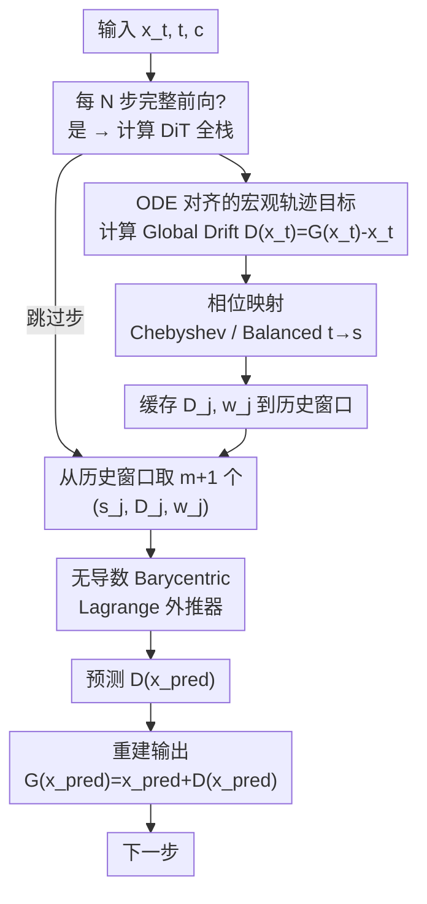

# ResilPhase: Plug-and-Play Phase Mapping and Noise-Resilient Macro-Trajectory Extrapolation for Diffusion Acceleration

**会议**: ECCV 2026  
**arXiv**: [2606.26769](https://arxiv.org/abs/2606.26769)  
**代码**: [https://github.com/zqc214/ResilPhase](https://github.com/zqc214/ResilPhase)  
**领域**: 扩散模型加速  
**关键词**: 扩散模型加速, DiT, 免训练缓存, Barycentric Lagrange 外推, 相位映射, Runge 现象

## 一句话总结
ResilPhase 将 DiT 免训练加速从逐层导数外推范式重构为 ODE 空间中的宏观轨迹外推：用端到端 Global Drift 消除逐层误差级联，用无导数 Barycentric Lagrange 插值绕过导数混沌噪声，再用 Chebyshev/Balanced 相位映射将离散时间步投影到有界相位空间以抑制 Runge 现象，在 FLUX.1-dev 上以约 5 倍加速仍保持 SOTA 画质。

## 研究背景与动机
**领域现状**：Diffusion Transformer（DiT）已成为高保真视觉生成的核心架构，被 FLUX、HunyuanVideo 等主流模型采用，但推理需要数十到上百次串行前向传播——例如 FLUX.1-dev 在 A100 上生成一张图需 23.69 秒，严重制约实时部署。

**现有痛点**：免训练加速方法从早期的"缓存并复用"（DeepCache、TeaCache）演进到"缓存并预测"（TaylorSeer、HiCache、SpeCa），后者用多项式（Taylor 级数、Hermite 插值）外推预测中间特征的轨迹。然而，这些方法在高加速比下画质急剧退化，本文分析其根因在于三个相互交织的瓶颈：

1. **空间维度——逐层误差级联**：逐层对 Transformer block 内部高频微特征做多项式拟合，预测误差随网络深度指数放大（误差界 $O((1+L_f)^L)$），同时产生大量缓存和内存开销。
2. **时间维度——导数混沌放大**：宏观轨迹本身光滑，但其高阶时间导数本质上是混沌的（有限差分会像高通滤波器一样指数放大噪声）。TaylorSeer 等依赖导数的方法将有限差分近似误差注入外推，导致预测发散。
3. **数值维度——Runge 现象**：在均匀离散时间步上做多项式外推，区间边缘的误差界会不可控地增长，导致极端加速比下灾难性退化。

**核心矛盾**：已有范式要么丢弃输入先验直接预测绝对输出（FreqCa，精度上限受限），要么困在局部残差更新中（$\Delta$-DiT，丢失宏观连续动态），缺乏一个同时保留输入先验且严格对齐 ODE 向量场的端到端预测目标。

**核心 idea**：将加速推理重新定义为 ODE 空间中的稳定宏观轨迹外推问题——预测目标从逐层微特征提升为网络的全局漂移（Global Drift），用无导数 Barycentric Lagrange 公式做外推以绕过导数噪声，再通过相位映射将线性时间步非线性投影到有界空间以严格压制外推误差的数学上界。

## 方法详解

### 整体框架
ResilPhase 要解决的核心问题是：在 DiT 的免训练加速中，如何在每隔 $N$ 步才做完整前向计算的情况下，准确预测中间跳过步骤的输出。整个框架由三个协同组件构成，对应空间、时间、数值三个维度的瓶颈。输入是当前潜在状态 $\mathbf{x}_t$ 和时间步 $t$ 及其条件 $c$，输出是预测的全局漂移 $\hat{D}(\mathbf{x}_t)$，进而通过 $\hat{G}(\mathbf{x}_t) = \mathbf{x}_t + \hat{D}(\mathbf{x}_t)$ 重建最终输出。

ResilPhase 在每个完整计算步做三件事：(1) 跑 DiT 全栈得到 $G(\mathbf{x}_t)$，计算 Global Drift $D(\mathbf{x}_t) = G(\mathbf{x}_t) - \mathbf{x}_t$；(2) 通过相位映射将时间步 $t$ 投影到相位坐标 $s$；(3) 将 $(s, D, w)$ 三元组缓存进历史窗口。在跳过步，只需用历史窗口中的 $m+1$ 个数据点、通过 Barycentric Lagrange 公式外推预测 $D$，再加法重建输出——全程不碰 Transformer 内部层，也不计算任何导数。

### 关键设计

**1. ODE 对齐的宏观轨迹目标：从逐层微特征到端到端全局漂移**

逐层预测的根本缺陷是误差随网络深度级联放大。考虑一个 $L$ 层 DiT，设第 $l$ 层的残差变换为 $f_l$，预测器为 $\mathcal{P}_l$，则跳过步的估计值为 $\hat{x}_t^l = \hat{x}_t^{l-1} + \mathcal{P}_l(\hat{x}_t^{l-1})$。假设 $f_l$ 是 Lipschitz 连续的（常数 $L_f$），从第一层递推到第 $L$ 层，累积误差上界为 $E_L \leq \sum_{l=1}^{L} (1+L_f)^{L-l} e_l$，其中 $e_l$ 是第 $l$ 层的局部预测误差。这个界揭示了问题的本质：每层的微小预测误差 $e_l$ 会被因子 $(1+L_f)^{L-l}$ 指数放大，层数越多越糟糕。

ResilPhase 的根本性突破是将预测目标从 $L$ 个独立的层间残差提升为整个网络的宏观演化。定义 **Global Drift（GD）** 为 DiT 最终输出与初始输入之间的端到端状态位移：

$$D(\mathbf{x}_t) = G(\mathbf{x}_t) - \mathbf{x}_t$$

其中 $G(\mathbf{x}_t) = g_L(g_{L-1}(\dots g_1(\mathbf{x}_t, c)\dots))$ 是整个 DiT 栈的组合映射。预测时只需一个宏观预测器 $\mathcal{P}_{\text{macro}}$ 输出 $\hat{D}(\mathbf{x}_t)$，最终结果通过加法 $\hat{G}(\mathbf{x}_t) = \mathbf{x}_t + \hat{D}(\mathbf{x}_t)$ 重建。此时误差退化为单项：$E_{\text{macro}} = \|\hat{D} - D\| = e_{\text{macro}}$，与网络深度 $L$ 完全解耦——误差界从 $O((1+L_f)^L)$ 骤降到 $O(1)$。

与非此即彼的替代方案对比：FreqCa 直接预测绝对值 $G(\mathbf{x}_t)$ 虽也避免了逐层误差，但丢弃了高度相关的输入先验 $\mathbf{x}_t$，预测精度上界受限；$\Delta$-DiT 复用残差位移则困在局部微更新中。GD 优雅地统一了两者的优势——以 $\mathbf{x}_t$ 为锚点只预测位移量，同时追踪的是 ODE 向量场的宏观连续动态而非局部微扰动。

**2. 无导数 Barycentric Lagrange 外推器：绕过导数混沌噪声**

即使 GD 本身是一条光滑的宏观轨迹（如图 2(a) 所示），问题并没有完全解决——因为 GD 的高阶时间导数依然是混沌的。论文通过可视化证明：有限差分近似下的导数轨迹充满了高频噪声和尖峰（图 2(b)），任何依赖导数的求解器（Taylor 级数、Hermite 插值）将这种噪声注入外推都会导致预测发散。如图 2(c) 的纯数学对比实验所示，随着外推间隔 $N$ 增大，无导数 Lagrange 预测器的 $L_1$ 相对误差始终显著低于 Taylor 和 Hermite 求解器，且增长斜率更平缓。

ResilPhase 采用严格无导数的 Lagrange 插值公式：给定 $m+1$ 个历史数据点 $\{(t_0, F_0), \dots, (t_m, F_m)\}$，其中 $F_j = D(\mathbf{x}_{t_j})$ 为历史 GD 值，唯一的 $m$ 次插值多项式为 $P(t) = \sum_{j=0}^{m} F_j L_j(t)$，$L_j(t)$ 是标准 Lagrange 基函数。但标准公式的计算复杂度为 $O(m^2)$，每次外推都要重算所有权重。

为此，论文引入 **Barycentric Lagrange 插值公式**：

$$P(t) = \frac{\sum_{j=0}^{m} \frac{w_j}{t - t_j} F_j}{\sum_{j=0}^{m} \frac{w_j}{t - t_j}}, \quad w_j = \frac{1}{\prod_{k=0, k\neq j}^{m} (t_j - t_k)}$$

其中 Barycentric 权重 $w_j$ 仅依赖于插值节点 $\{t_j\}$ 的相对位置，不依赖特征值 $\{F_j\}$。这个性质是关键：权重可以在完整计算步时预计算并缓存，所有后续预测复用同一组权重，复杂度降至 $O(m)$。整个外推过程全程不涉及任何导数计算或有限差分近似，从根本上消除了导数噪声的注入路径。

**3. 相位映射机制：以 Chebyshev/Balanced 投影抑制 Runge 现象**

即使采用了无导数外推器，还有一个深层数值问题：在均匀分布的离散时间步上做多项式外推会自然触发 **Runge 现象**——区间边缘的振荡误差随外推距离增长而失控（图 1(a)）。ResilPhase 是首个将此识别为扩散加速关键瓶颈的工作。

从 Lagrange 插值的标准误差公式入手：对 $m+1$ 次可微函数 $F(t)$，误差 $E(t) = \frac{F^{(m+1)}(\xi)}{(m+1)!} \prod_{j=0}^{m} (t - t_j)$。其中 $D_{m+1} = F^{(m+1)}(\xi)/(m+1)!$ 是模型固有属性不可修改，唯一可操作的是节点依赖项 $e(t) = \prod_{j=0}^{m} (t - t_j)$。核心思路是：通过一个非线性映射 $t \to s$ 将均匀时间步 $\{t_j\}$ 重新分布到更稳定的节点配置上，以最小化 $\max |e(s)|$。

论文提出两种映射方案：

- **Chebyshev 映射（CM）**：将 $m+1$ 个历史时间步映射到 Chebyshev 节点 $s_k = \cos\big(\frac{(2k+1)\pi}{2(m+1)}\big), \; k=0,\dots,m$。Chebyshev 节点最小化了插值多项式在区间 $[-1,1]$ 上的最大误差界——这是经典数值分析的最优结果。对于外推目标 $t_{\text{target}} < t_m$，通过最近两点的线性外推计算对应的相位坐标 $s_{\text{target}}$。CM 在类条件生成任务上表现最佳。

- **Balanced 映射（BM）**：Chebyshev 节点的固定结构缺乏灵活性，难以适应复杂文本条件任务中变化的时间分布。BM 是一种数据驱动的自适应映射：先计算当前 $m+1$ 个时间步的均值 $\mu_t$ 和最大绝对偏差 $d_{\max}$，再通过 $\tanh$ 函数做非线性投影 $s = \tanh\big(\alpha \cdot \frac{t - \mu_t}{d_{\max}}\big)$。$\alpha > 0$ 控制映射的陡峭度（默认 $\alpha = 0.55$ 在各类场景下均鲁棒）。$\tanh$ 的有界输出 $(-1, 1)$ 天然将外推域压缩到稳定区间内，且能根据近期时间步的分布动态调整映射形状。BM 在文本到图像/视频任务上优于 CM。

两种映射的误差界均有严格数学保证。以无映射为基线，误差多项式因子 $|e_{\text{ori}}(t_{\text{target}})| \leq \prod_{j=0}^{m} |(m-j+1)N-1|$；Chebyshev 映射将其收紧为 $|e_{\text{cheby}}| \leq \prod_{j=0}^{m} |2(m-j+1) - 2/N|$。对任意 $N \geq 2$ 和 $m-j > 0$，可证明 Chebyshev 映射严格缩小了每个因子的绝对值——误差上界在所有加速比下单调降低。Balanced 映射同理。

最终 ResilPhase 通过相位坐标 $s$ 上的 Barycentric Lagrange 公式完成外推：

$$\hat{D}(\mathbf{x}_{\text{pred}}) = P(s_{\text{pred}}) = \frac{\sum_{j=0}^{m} \frac{w_j}{s_{\text{pred}} - s_j} D_j}{\sum_{j=0}^{m} \frac{w_j}{s_{\text{pred}} - s_j}}$$

其中 $s_{\text{pred}}$ 是目标时间步经相位映射后的坐标，$\{s_j, D_j, w_j\}_{j=0}^{m}$ 来自缓存的历史窗口。

### 一个完整示例：从缓存到外推到重建

以 FLUX.1-dev 上的 $N=5, m=1$ 配置为例（每 5 步做一次完整计算、用 2 个历史点做线性外推），走一遍完整流程。总去噪步数 50，从 $t=49$ 开始逐步去噪。

- **t=49**（anchor 步）：正常跑 DiT 全栈，得到 $G(\mathbf{x}_{49})$，计算 $D_{49} = G(\mathbf{x}_{49}) - \mathbf{x}_{49}$。Balanced 映射将 $t=49$ 投影到 $s_{49}$（例如 $\mu_t$ 用当前窗口、$d_{\max}$ 取最大偏差），缓存 $(s_{49}, D_{49})$。
- **t=48**（跳过步）：目标 $t_{\text{target}}=48$，从 $t=49$ 线性外推得 $s_{48}$。历史窗口 $\{(s_{49}, D_{49})\}$ 只有 1 个点（$m=1$ 需要 2 个点），首次跳过时退化为直接用最近 GD 值近似——即 $D_{48} \approx D_{49}$，重建 $G(\mathbf{x}_{48}) = \mathbf{x}_{48} + D_{49}$。
- **t=47**（跳过步）：窗口已有 $(s_{49}, D_{49})$ 和 $(s_{48}, D_{48})$ 两个点（此处 $D_{48}$ 来自上一步预测值），Barycentric 权重 $w_{49}, w_{48}$ 预计算一次即可复用。外推得 $D_{47} = P(s_{47})$，重建 $G(\mathbf{x}_{47}) = \mathbf{x}_{47} + D_{47}$。
- **t=46, 45**：同理，用最近 2 个点外推。
- **t=44**（下一个 anchor 步）：再次跑完整 DiT 全栈，用真实 GD 值刷新窗口，覆盖掉之前预测值累积的误差。窗口始终滑窗保留最新的 $m+1$ 个真实 GD 点。

关键点：整个跳过过程不触发任何 DiT block 的前向计算（省掉 4/5 的算力），不计算任何导数，所有预测在 $O(m)$ 时间内完成。预测误差仅在两个 anchor 之间的一个外推窗口内累积，下一个 anchor 步即被真实值"校准"。

### 损失函数 / 训练策略
ResilPhase 是完全免训练的（training-free），不使用任何损失函数或梯度更新。所有组件（GD 计算、Barycentric Lagrange 外推、相位映射）均为确定性数学运算，在推理时直接执行。唯一的超参数是加速间隔 $N$、插值阶数 $m$（论文中用 $O$ 表示）和 Balanced Mapping 的 $\alpha$（默认 0.55）。

## 实验关键数据

### 主实验
**FLUX.1-dev 文本到图像**（Table 1 精选，~5x 加速档位）：

| 方法 | 加速比 | ImageReward $\uparrow$ | CLIP $\uparrow$ | PSNR $\uparrow$ | SSIM $\uparrow$ | LPIPS $\downarrow$ |
|------|--------|------------------------|-----------------|-----------------|-----------------|---------------------|
| FLUX.1-dev (50步) | 1.00x | 1.0804 | 32.711 | - | - | - |
| FLUX.1-dev (11步) | 4.55x | 0.9541 | 32.485 | 28.397 | 0.5939 | 0.5001 |
| TeaCache | 4.82x | 0.7850 | 32.588 | 27.954 | 0.3837 | 0.8349 |
| SpeCa | 4.78x | 0.9798 | 32.571 | 28.366 | 0.5567 | 0.5324 |
| PFDiff | 4.07x | 1.0386 | 32.816 | 28.671 | 0.6162 | 0.4670 |
| FreqCa | 4.88x | 1.0130 | 32.114 | 28.120 | 0.4023 | 0.6877 |
| TaylorSeer | 4.65x | 0.6241 | 31.895 | 27.940 | 0.3014 | 0.8012 |
| **ResilPhase** | **4.97x** | **1.0258** | **32.847** | **29.536** | **0.6655** | **0.3834** |

ResilPhase 在最高加速比（4.97x）下 ImageReward 达到 1.0258，比最强预测基线 TaylorSeer 高出 64%，LPIPS 低 52%。PSNR 和 SSIM 也在所有加速方法中领先。在 ~4.17x 档位，ResilPhase 的 ImageReward（1.0591）甚至超越了 50 步全量基线的指标。

**HunyuanVideo 文本到视频**（~5x 加速档位）：

| 方法 | 加速比 | PSNR $\uparrow$ | SSIM $\uparrow$ | LPIPS $\downarrow$ | VBench $\uparrow$ |
|------|--------|-----------------|-----------------|---------------------|---------------------|
| 50步全量 | 1.00x | - | - | - | 80.87 |
| TeaCache | 4.62x | 17.923 | 0.6547 | 0.3760 | 79.77 |
| SpeCa | 4.65x | 16.461 | 0.5883 | 0.4219 | 79.59 |
| TaylorSeer | 4.63x | 15.520 | 0.5641 | 0.4581 | 79.07 |
| **ResilPhase** | **4.98x** | **18.920** | **0.6709** | **0.3341** | **79.78** |

ResilPhase 在视频任务上同样稳定——最快加速（4.98x）下 LPIPS 和 PSNR 在所有方法中最佳，VBench 得分（79.78）与最强 TeaCache（79.77）持平，同时 SSIM 高出 0.0162。

**DiT-XL/2 类条件生成**（ImageNet）：在 4.41x 加速下，ResilPhase 的 FID 为 2.832——不仅远超同档位所有缓存基线（TeaCache/ToCa/ClusCa FID >15，SpeCa FID 6.866），甚至逼近全量 50 步 DDIM 的 2.367。在 2.78x 加速下 FID 降至 2.347，**优于**全量 50 步基线（2.367），IS 达到 233.57，也超基线。

### 消融实验
以下从 FLUX.1-dev 消融表（Table 4）中选取代表性配置，固定 $N=5, m=1$（约 4.17x 加速）：

| 配置 | 预测目标 | Phase Mapping | ImageReward $\uparrow$ | PSNR $\uparrow$ | LPIPS $\downarrow$ | 说明 |
|------|---------|---------------|------------------------|-----------------|---------------------|------|
| 仅 Lagrange（无 PM） | GD | 无 | 1.0404 | 29.013 | 0.3853 | 无导数外推基线，比导数方法已好很多 |
| Lagrange + Chebyshev | GD | Chebyshev | 1.0528 | 29.472 | 0.3343 | CM 相对无 PM 显著提升 PSNR +0.46 |
| Lagrange + Balanced | GD | Balanced | 1.0591 | 29.556 | 0.3342 | BM 略优于 CM，ImageReward 进一步提升 |
| 逐层预测 + Lagrange + Balanced | Layer-wise | Balanced | 1.0517 | 29.034 | 0.3811 | GD 换成逐层预测，PSNR 掉 0.52，LPIPS 大幅恶化 |
| Lagrange + BM + 预测 Final Output | Final Output | Balanced | 1.0557 | 29.093 | 0.3808 | GD 换成直接预测 $G(\mathbf{x}_t)$，PSNR 掉 0.46 |

核心发现：(1) Global Drift 相对逐层预测在 PSNR 上有约 0.5 dB 的稳定提升，验证了消除误差级联的收益；(2) Balanced Mapping 相对无 Phase Mapping 提升 PSNR 约 0.54 dB，且对文本到图像任务优于 Chebyshev Mapping；(3) 预测 Final Output 虽然也避免了逐层误差，但因丢弃 $\mathbf{x}_t$ 先验，始终不如 GD。

### 关键发现
- **Global Drift 是最大贡献组件**：消融表中 GD 换逐层预测导致 LPIPS 从 0.3342 恶化到 0.3811（相对增加 14%），是所有单组件移除中掉点最多的。
- **Phase Mapping 有即插即用通用性**：将 Phase Mapping 接到 TaylorSeer 和 HiCache 上，两者的 ImageReward 在所有加速区间均获得稳定提升（Fig. 7），验证了 PM 不仅是 ResilPhase 的专属组件，更是现有导数加速器的通用稳定器。
- **Balanced Mapping 在文本条件任务上优于 Chebyshev**：BM 的自适应 $\tanh$ 映射更适合文本到图像/视频场景中变化的时间步分布，而 CM 的固定结构在类条件生成上更优——这种任务依赖性与理论预期一致（类条件任务动态更简单、固定节点已够用）。
- **高加速比下优势更大**：在 4.97x 档位，ResilPhase 相对最强预测基线的 ImageReward 优势（+64%）远大于 3.58x 档位（+0.5%），验证了 Phase Mapping 对 Runge 现象的抑制在高加速比下更关键。

## 亮点与洞察
- **将加速问题从"拟合信号"提升为"控制数值稳定性"**：前人忙于一阶近似、二阶导数、Hermite 基函数，ResilPhase 直接定位到根因——Runge 现象和导数混沌——然后用经典数值分析（Chebyshev 节点、Barycentric 公式）给出优雅解。从问题定义层面就降维打击了。
- **GD 的优雅之处在于"以加法重建"**：$G(\mathbf{x}_t) = \mathbf{x}_t + D(\mathbf{x}_t)$ 这个简单的残差形式同时解决了三个问题——保留输入先验（不像 FreqCa 丢弃 $\mathbf{x}_t$）、避免逐层误差（不像层间预测追踪 $L$ 个残差）、对齐 ODE 宏观动力学（不像 $\Delta$-DiT 陷在局部更新中）。一个公式吃掉了三个看似矛盾的设计目标。
- **Phase Mapping 是"即插即用"的完美案例**：它不是 ResilPhase 的内部组件，而是一个独立于预测器类型的数学变换——你可以把它接到任何现有多项式加速器（TaylorSeer、HiCache）上并获得增益。这种高内聚低耦合的设计思路可以迁移到任何涉及多项式外推的推理加速场景。
- **数值分析与深度学习的跨界示范**：论文的核心工具（Chebyshev 节点、Barycentric Lagrange、Runge 现象）都来自经典数值分析教材，但在 DiT 加速这个新语境下焕发新生。提示我们很多深度学习系统的瓶颈可能早已在数值分析中有成熟的解决方案。

## 局限与展望
- **仅支持 DiT 架构**：所有实验在 FLUX、SDXL、HunyuanVideo、DiT-XL/2 上完成，未在 U-Net 类扩散模型（如 SD1.5/2.1）上验证。GD 的定义依赖 Transformer block 的组合结构，U-Net 的 skip connection 可能使 GD 的误差界分析不直接成立。
- **Phase Mapping 的 $\alpha$ 未详细调参**：Balanced Mapping 的 $\alpha$ 默认 0.55 在实验中固定不变，但缺乏对 $\alpha$ 的系统消融——不同模型/任务的最优 $\alpha$ 是否一致、$\alpha$ 与加速比 $N$ 是否存在耦合关系，都悬而未决。
- **仅评估 50 步采样调度**：实验固定使用 50 步采样计划，未测试在其他步数配置（如 20 步、100 步）下的表现。不同采样步数下时间步分布不同，可能影响 Phase Mapping 的映射质量。
- **缺乏与量化/剪枝等正交方法的组合实验**：ResilPhase 是纯算法级加速，与模型压缩方法（量化、剪枝）应正交互补，但论文未做组合消融。如果能与 4-bit 量化叠加达成 10x+ 加速，实用价值会更大。
- **可改进方向**：(1) 探索自适应插值阶数 $m$——在不同去噪阶段动态调整，早期高噪声阶段用低阶、后期精细阶段用高阶；(2) 将 Phase Mapping 扩展到更一般的 ODE solver 加速框架（如 DPM-Solver），而非仅限预测缓存场景。

## 相关工作与启发
- **vs TaylorSeer / SpeCa（导数级数外推）**：它们用 Taylor 级数做层间特征预测，依赖有限差分近似导数。本文证明导数混沌是这些方法在高加速比下崩坏的根本原因，并用无导数 Lagrange 外推取代。ResilPhase 不仅是 better，更是定位了旧范式的数学上限。
- **vs HiCache / FreqCa（Hermite 插值）**：Hermite 插值同时使用函数值和导数值，理论上比纯 Lagrange 信息更丰富，但因为导数本身含噪，信息增益被噪声淹没。本文的消融实验（图 2(c)）定量证实：无导数 Lagrange 的外推误差始终低于 Hermite。
- **vs $\Delta$-DiT（残差位移复用）**：$\Delta$-DiT 复用残差位移而非预测，避免了预测误差但未追踪 ODE 宏观动态。本文的 GD 可以看作 $\Delta$-DiT 思想的宏观版本：同样是位移量，但从"层间局部残差"升级为"端到端全局漂移"。
- **vs FoCa（ODE 预测校准）**：FoCa 也用 Lagrange 外推，但仍在层间预测 + 导数框架下，且未做 Phase Mapping。ResilPhase 的贡献在于将 Lagrange 与 GD + Phase Mapping 三者协同，而不只是换个基函数。

## 评分
- 新颖性: ⭐⭐⭐⭐⭐ 将 DiT 加速重构为 ODE 宏观外推问题 + 引入 Chebyshev 节点/Runge 现象到扩散加速语境，问题定义层面有原创性
- 实验充分度: ⭐⭐⭐⭐ 覆盖 4 个模型、3 类任务、与 10 种基线对比，消融设计合理；缺 U-Net 验证和与量化/剪枝的组合实验
- 写作质量: ⭐⭐⭐⭐⭐ 从"现象→根因→三个瓶颈→三个组件"的逻辑链清晰，误差分析到 $O(1)$ vs $O((1+L_f)^L)$ 的对比极具说服力
- 价值: ⭐⭐⭐⭐⭐ 免训练 + 即插即用的性质极其实用；Phase Mapping 作为通用稳定器可接入任何现有加速器，生态价值大

<!-- RELATED:START -->

## 相关论文

- [\[AAAI 2026\] Global Compression Commander: Plug-and-Play Inference Acceleration for High-Resolution Large Vision-Language Models](../../AAAI2026/vlm_efficiency/global_compression_commander_plug-and-play_inference_acceler.md)
- [\[CVPR 2026\] Prune2Drive: A Plug-and-Play Framework for Accelerating Vision-Language Models in Autonomous Driving](../../CVPR2026/vlm_efficiency/prune2drive_a_plug-and-play_framework_for_accelerating_vision-language_models_in.md)
- [\[CVPR 2026\] SODA: Sensitivity-Oriented Dynamic Acceleration for Diffusion Transformer](../../CVPR2026/vlm_efficiency/soda_sensitivity-oriented_dynamic_acceleration_for_diffusion_transformer.md)
- [\[ECCV 2026\] HSD: Training-Free Acceleration for Document Parsing Vision-Language Models with Hierarchical Speculative Decoding](hsd_training-free_acceleration_for_document_parsing_vision-language_models_with_.md)
- [\[CVPR 2026\] PS-SR: Pseudo-Single-Step Video Super-Resolution via Speculative Diffusion](../../CVPR2026/vlm_efficiency/ps-sr_pseudo-single-step_video_super-resolution_via_speculative_diffusion.md)

<!-- RELATED:END -->
