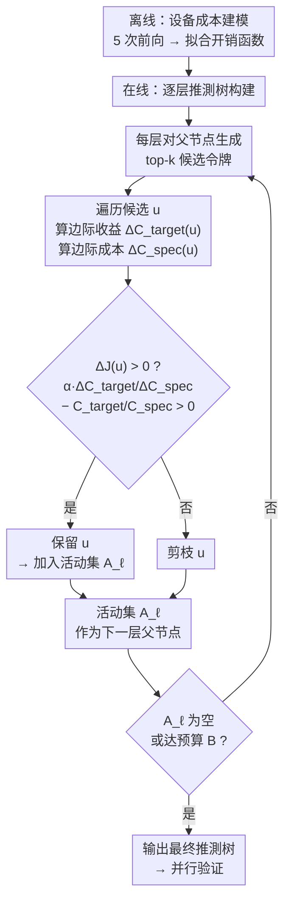

# SMART: When is it Actually Worth Expanding a Speculative Tree?

**会议**: ECCV 2026  
**arXiv**: [2604.09731](https://arxiv.org/abs/2604.09731)  
**代码**: 待确认  
**领域**: LLM效率  
**关键词**: 推测解码, 推测树, 硬件感知, 边际分析, 端到端加速

## 一句话总结
SMART 提出了一套硬件感知的边际分析框架，将推测解码中的推測树构建重写为最大化端到端加速比的序列决策问题——只有在节点的边际收益-成本比超过当前树的整体加速比时才扩展该节点，从而避免了大批量下验证开销超线性增长导致的"负加速"悖论，平均额外带来 20.0%（MLLM）和 15.4%（LLM）的加速提升且无需重新训练。

## 研究背景与动机

基于树结构的推测解码（tree-based speculative decoding）是当前加速自回归生成的主流技术之一。其核心思路是让轻量级草稿模型一次性生成一棵分支结构的候选令牌树，再由目标模型在单次前向传播中并行验证整棵树。相比于单链推测解码，树结构可以覆盖更多可能的候选路径，从而显著提高每步目标模型前向传播的期望接受长度。现有的树构建方法——包括 EAGLE-2、MSD 等——通常基于令牌级的累积概率来驱动树的扩展，优先选择似然最高的候选分支，期望用更大的树"捕获"更多的可接受令牌。GTO 虽然将训练目标从似然最大化改进为接受长度最大化，但依然是在"接受更多令牌"这一方向上做文章。

然而，推测解码的终极目标不是接受尽可能多的令牌，而是**在墙上时钟意义下取得最大的加速比**。这里存在一个容易被忽视的效率悖论：树越大，验证开销增长得越快。当大批量部署时，GPU 会从小批量下的访存受限（memory-bound）状态切换为计算饱和（compute-bound）状态——此时每个额外验证的令牌都会产生超线性增长的验证延迟。这意味着贪婪地扩展推測树反而可能适得其反：验证一棵大树的额外开销超过了它带来的接受长度增益，导致加速比低于 1×，甚至比最朴素的逐令牌自回归解码（vanilla autoregressive）还要慢。MSD 的实验数据清晰地展示了这一点：在 RTX Pro 6000 上，批量从 1 增大到 32 时，MSD 的加速比从 2.20× 暴跌到 0.82×；在 L40S 上，批量到 12 时更是降到 0.90×。更麻烦的是，这个"转折点"高度依赖硬件——同样的树在 RTX Pro 6000 上表现尚可，换到 L40S 上就出现负加速，且不同的 GPU 架构、不同的批量都会改变最优树形状。**核心 idea：SMART 放弃以似然或接受长度最大化为目标，转而将推測树构建建模为最大化端到端加速比的序列决策问题，在每个扩展步骤用当前设备的实测成本模型评估节点的边际收益与边际成本，仅在边际收益-成本比超过当前树级加速比时才决定扩展——从而在推理时在线、自适应地构建真正硬件感知的加速最优树，且无需任何训练。**

## 方法详解

### 整体框架

SMART 是一个即插即用的推理时控制器，不修改草稿模型、目标模型或验证机制的任何参数。它替换掉现有系统（如 MSD、EAGLE-3）中基于似然最大化的树构建策略，改用加速比最大化策略。整体流程分为三个阶段：首先对目标硬件做一次轻量级成本建模（device profiling），拟合出推理开销与树大小的函数关系；然后在实际推理过程中，每步生成推測树时逐层执行贪心扩展决策——对每个候选节点计算其边际加速收益是否超过当前树的全局加速比；最终输出一棵经过硬件感知修剪的推測树，送入原有的并行验证机制。

### 关键设计

**1. 系统级加速比目标：直接优化墙上时钟加速**

现有的树构建方法（包括 GTO）都以期望接受长度 $L^{\text{tree}}$ 作为优化目标，但加速比不仅取决于接受了多少令牌，还取决于为获得这些接受令牌付出了多少开销。SMART 显式定义一个系统级的加速比指标 $\mathcal{R}(\mathcal{T})$——它实际上是自回归解码和推測解码的**成本比**：$\mathcal{R}(\mathcal{T}) = \frac{c_T \cdot L^{\text{tree}}}{C_{\text{draft}} + C_{\text{verify}}}$，其中 $c_T$ 是目标模型逐令牌自回归解码的墙上时间成本，$C_{\text{draft}}$ 和 $C_{\text{verify}}$ 分别是构建和验证整棵推測树的总开销。分子 $c_T \cdot L^{\text{tree}}$ 代表用自回归方式生成 $L^{\text{tree}}$ 个令牌需要的总时间，分母是推測方式拿到同样多令牌所花的时间。这个比值直接告诉我们"推測解码到底比自回归快了多少倍"。关键在于，最大化 $L^{\text{tree}}$ 和最大化的 $\mathcal{R}$ 存在本质差异：前者只顾扩树增加接受长度，后者则天然考虑了扩树带来的开销增长——当一个候选节点带来的接受增量 $\Delta L^{\text{tree}}$ 很小但拖入的开销 $C_{\text{draft}}+C_{\text{verify}}$ 很大时，保留它会拉低而不是提升加速比。这一设计将树构建从似然驱动的"接受长度最大化"扭转为成本感知的"加速比最大化"。

**2. 低成本设备开销建模：用少量前向拟合成正本模型**

要让边际决策落地，必须能够量化"扩一个节点增加多少开销"。SMART 对每台目标设备做一次轻量级离线 Profiling，分别采集草稿和验证两种操作的延迟开销作为树大小 $|\mathcal{T}|$（即树中总令牌数）的函数，然后拟合两个解析成本模型。草图阶段（drafting）开销与总令牌数近似线性关系，因为草稿模型通常很小且访存受限，逐令牌成本基本恒定——SMART 用 $C_{\text{draft}}(\mathcal{T}) = \lambda |\mathcal{T}| + \beta$ 拟合。验证阶段（verification）则复杂得多：目标模型大，在大批量计算饱和状态下验证延迟呈显著凸增长——SMART 采用幂-指数模型 $C_{\text{verify}}(\mathcal{T}) = \gamma(\exp(\delta |\mathcal{T}|^\rho) - 1) + \eta$ 来捕捉这种超线性增长趋势，其中系数 $\gamma, \delta, \rho$ 通过最小二乘拟合在 5 次前向传播的数据点上得到。偏置项 $\beta, \eta$ 固定为 0 以保证原点通过。对 LLaMA-3.1-8B 的 Profiling 仅需约 10 秒（测试集的 1.67% 推理时间），成本几乎可以忽略，但获得的成本模型使每步边际决策有了可靠的定量依据。

**3. 边际收益-成本比贪心扩展规则：收益大于成本才扩**

SMART 将推測树构建形式化为逐层序列决策问题：记 $S_{\ell-1}$ 为前 $\ell-1$ 层已选的所有节点，$A_{\ell-1}$ 为 $\ell-1$ 层保留的可扩展父节点集。在第 $\ell$ 层，对 $A_{\ell-1}$ 中每个父节点生成 top-k 个候选生成完整候选集 $\mathcal{U}_\ell$，然后对每个候选 $u$计算两个量：**边际收益** $\Delta C_{\text{target}}(u) = c_T \cdot \Delta L^{\text{tree}}(u)$，其中 $\Delta L^{\text{tree}}(u) \approx \frac{1}{|\mathcal{P}|} P(\tilde{\mathbf{x}}_u \mid \text{anc}(u))$（累积概率除以路径数目，反映新增一个叶子节点对平均接受长度的稀释贡献）；**边际成本** $\Delta C_{\text{spec}}(u) \approx \lambda + \gamma\delta\rho |\mathcal{T}|^{\rho-1} \exp(\delta |\mathcal{T}|^\rho)$（成本模型在 $|\mathcal{T}|$ 处的导数之和）。决定是否保留 $u$ 的准则直观而优雅：只有当加入 $u$ 后能提升全局加速比时才保留。由于 $\mathcal{R}(\mathcal{T}) = C_{\text{target}} / C_{\text{spec}}$ 是一个分式，作者通过对数加速比 $\mathcal{J} = \log \mathcal{R} = \log C_{\text{target}} - \log C_{\text{spec}}$ 进行一阶展开，导出决策判据 $\alpha \cdot \frac{\Delta C_{\text{target}}(u)}{\Delta C_{\text{spec}}(u)} - \frac{C_{\text{target}}}{C_{\text{spec}}} > 0$，其中 $C_{\text{target}} / C_{\text{spec}}$ 即当前树的全局加速比。这个判据的物理含义很清晰：候选节点的**边际收益-成本比**必须大于当前树的**平均收益-成本比**，否则扩展它会拉低整体加速比。$\alpha \in (0,1]$ 是一个折扣因子，用于抵销草稿模型对接受概率的过度乐观估计（实际验证时目标模型可能不认草稿的高置信预测），经验最优值为 $\alpha=0.8$。整棵树构建的复杂度为 $\mathcal{O}(kB)$（$k$ 为每节点候选数，$B$ 为预算），从穷举的 $\mathcal{O}(2^{k^d})$ 降到线性——每次决策都是 $\mathcal{O}(1)$ 的局部判断。

### 损失函数 / 训练策略

SMART 是训练无关（training-free）方法——不修改任何模型权重，也不需要额外训练草稿模型或验证器。唯一的"训练"是在每台新设备上做一次约 5 次前向传播的 Profiling 来拟合成本模型参数，之后所有决策均在推理时在线完成。

## 实验关键数据

### 主实验

**MLLM 加速比（温度 T=0）**

| 模型 | 方法 | VQAv2 | ChartQA | TextVQA | Hallusion | 平均 SR | 提升 |
|------|------|-------|---------|---------|-----------|---------|------|
| LLaVA-1.5 7B | MSD | 1.23× | 1.14× | 1.26× | 1.26× | 1.18× | - |
| LLaVA-1.5 7B | MSD+SMART | 1.55× | 1.59× | 1.55× | 1.62× | **1.53×** | +29.7% |
| LLaVA-1.5 13B | MSD | 1.30× | 1.45× | 1.22× | 1.17× | 1.26× | - |
| LLaVA-1.5 13B | MSD+SMART | 1.56× | 1.72× | 1.51× | 1.42× | **1.53×** | +21.4% |
| Qwen2VL 7B | MSD | 1.18× | 1.24× | 1.16× | 1.15× | 1.14× | - |
| Qwen2VL 7B | MSD+SMART | 1.22× | 1.34× | 1.24× | 1.22× | **1.25×** | +9.6% |

**LLM 加速比（温度 T=0）**

| 模型 | 方法 | MT-Bench | HumanEval | GSM8K | 平均 SR | 提升 |
|------|------|----------|-----------|-------|---------|------|
| LLaMA-3.1 8B | EAGLE-3 | 1.35× | 1.44× | 1.28× | 1.36× | - |
| LLaMA-3.1 8B | EAGLE-3+SMART | 1.56× | 1.71× | 1.51× | **1.59×** | +16.9% |
| LLaMA-3.3 70B | EAGLE-3 | 2.46× | 2.92× | 2.67× | 2.69× | - |
| LLaMA-3.3 70B | EAGLE-3+SMART | 2.97× | 3.72× | 3.32× | **3.35×** | +24.5% |
| DeepSeek-R1 8B | EAGLE-3 | 1.24× | 1.49× | 1.61× | 1.46× | - |
| DeepSeek-R1 8B | EAGLE-3+SMART | 1.45× | 1.65× | 1.87× | **1.68×** | +15.1% |

### 消融实验

**大批量场景下的加速比退化对比（L40S 上 MSD vs MSD+SMART）**

| 配置 | Batch=1 | Batch=4 | Batch=8 | Batch=12 |
|------|---------|---------|---------|----------|
| MSD | 1.82× | 1.63× | 1.22× | 0.90× |
| MSD+SMART | 1.77× | 1.65× | **1.50×** | **1.40×** |

**推測令牌预算消融（RTX Pro 6000, batch=16）**

| 配置 | 平均 SR (T=0) | 说明 |
|------|-------------|------|
| Budget=100 令牌 | 1.43× | 修剪过度, 未充分利用并行性 |
| **Budget=200 令牌** | **1.58×** | **最优平衡点** |
| Budget=300 令牌 | 1.28× | 验证开销过大 |
| Budget=400 令牌 | 1.27× | 验证开销过大 |

**折扣因子 α 消融（RTX Pro 6000, batch=16）**

| α | 平均 SR (T=0) | 说明 |
|----|-------------|------|
| 1.0 | 1.51× | 过于激进, 保留过多低效节点 |
| 0.9 | 1.55× | 较好 |
| **0.8** | **1.56×** | **最优** |
| 0.7 | 1.55× | 略偏保守 |
| 0.5 | 1.54× | 修剪偏多 |

### 关键发现

- **大批量下的瓶颈凸显是核心发现**：小批量（batch=1）下 MSD 和 SMART 表现接近（2.20× vs 2.17×），但随批量增大 MSD 加速比急降至 0.82×（负加速），而 SMART 始终维持在 1.39× 以上——这说明检查点不在小批量下的"优化冗余"，而是大批量计算饱和后每多一个令牌的边际验证成本暴涨。
- **硬件异构性显著影响最优策略**：相同的 MSD 树在 RTX Pro 6000 上 batch=8 时 1.84×，在 L40S 上同为 batch=8 仅 1.22×——L40S 的计算饱和点更早到来。SMART 通过运行时边际决策自动适应这些差异，无需手动调参。
- **Discount factor α=0.8 是最佳折中**：α 过大会保留草稿模型过去自信的候选（验证时被目标模型拒绝），过小则会错误地剪掉高收益节点。在 0.6-1.0 范围内 SMART 表现稳定，说明边际准则本身是鲁棒的。
- **SMART 对非自回归草稿模型（DFLASH）也有效**：DFLASH 基于块扩散生成所有草稿令牌，其树结构与 EAGLE 族完全不同，但 SMART 仍能带来 +15.3%（T=0）和 +16.2%（T=1）的额外加速，说明方法在草稿范式层面具有通用性。

## 亮点与洞察

- **将加速比化为成本比来优化，巧妙地统一了目标和约束**：$\mathcal{R}(\mathcal{T}) = \frac{c_T \cdot L^{\text{tree}}}{C_{\text{draft}} + C_{\text{verify}}}$ 这一形式把"加速"和"开销"放在同一个物理维度（时间）上比较，天然避免了似然最大化与系统级加速之间的割裂。
- **边际收益-成本比判据极其简洁高效**：$\alpha \cdot \frac{\Delta C_{\text{target}}}{\Delta C_{\text{spec}}} > \frac{C_{\text{target}}}{C_{\text{spec}}}$ 的判据只需 O(1) 的局部运算就能做出全局最优方向的贪心决策，且物理含义直观——"新节点的效率必须不低于已有节点的平均效率"。
- **成本模型的幂-指数形式并不是随意选择的**：作者通过实测发现验证延迟在大批量下呈现指数级增长趋势（而非普通的二次或幂函数），这恰好对应 GPU 计算饱和后的理论瓶颈。选择$\gamma(\exp(\delta |\mathcal{T}|^\rho)-1)$ 形式拟合 5 个数据点就能捕捉这一非线性，兼顾了准确性和极低的 Profiling 成本。
- **接受率（β）和加速比（SR）在 SMART 下出现分歧是重要洞察**：传统方法认为 β 越高 SR 越高，但 SMART 在一些场景下 SR 提升而 β 基本不变（如 LLaMA-3.3-70B 上 T=0 时 β 仅从 0.67 提升到 0.70），说明 SR 提升主要来自"剪掉了低效令牌"而非"接受了更多令牌"——这对未来推测解码的评估指标选择有指导意义。

## 局限与展望

- **作者承认的局限**：SMART 仅在 RTX Pro 6000 和 L40S 上做了充分实验，未覆盖 A100、H100、H200 等更大规模数据中心 GPU——不过附录中也补充了 A100 和 H200 的初步结果（趋势一致）。此外，预算 B 仍需人为设定，最优值会随硬件和批量变化。
- **自己发现的局限**：成本模型是离线 Profiling 的，当模型批处理配置变化剧烈或运行中负载特性发生漂移时（如批处理大小动态变更），可能需要重新 Profiling 或引入在线增量更新。边际规则仅考虑单步贪心最优，在极端情况下可能错过两步联合扩展的更优组合（虽然实验验证了贪心在实践中足够好）。
- **具体的改进思路**：可将预算 B 也纳入自适应框架——用类似的边际分析动态调整每个序列的验证预算。另外，SMART 当前只控制树的拓扑形状，未来可进一步与动态草稿模型选择（多个不同大小的草稿模型切换）结合，在草稿阶段也做边际决策。

## 相关工作与启发

- **vs 基于似然最大化的树构建（EAGLE-2 / MSD）**: 它们用累积概率 $P(u)$ 选择候选、固定 w×d 树结构，完全不考虑硬件成本。SMART 则从加速比出发，只有当节点确实"划算"才扩展。关键区别是 SMART 不追求"最大树"，而是追求"最合适的树"。
- **vs GTO（训练端优化）**: GTO 在训练阶段用 PPO 优化草稿模型以最大化接受长度，但推理时树构建仍用似然策略。SMART 在推理时做硬件感知优化，与 GTO 正交——实验也证明 GTO+SMART 可以叠加出更好效果（如 LLaMA-3.1-8B 上 GTO 从 1.40× 到 1.60×）。
- **vs TapOut / SVIP（启发式停判）**: 这些方法用熵或置信度阈值决定何时停止草稿，阈值手动设置、难迁移。SMART 的边际决策基於定量成本模型，无需手动调阈值，且自动适应硬件和批量变化。

## 评分
- 新颖性: ⭐⭐⭐⭐☆ 将边际成本-收益分析引入推测树构建的思路在系统优化领域并不陌生，但在推测解码这个具体问题中将接受长度、草稿开销、验证开销统一建模为加速比公式的做法是首创且优雅的。
- 实验充分度: ⭐⭐⭐⭐⭐ 在 3 个 MLLM + 4 个 LLM × 多个硬件（RTX Pro 6000/L40S/A100/H200）× 多个 baseline（MSD/EAGLE-2/3/GRIFFIN/GTO/DFLASH）× 两个温度设置下做了充分对比，还有完整的预算/α消融和硬件泛化实验。
- 写作质量: ⭐⭐⭐⭐⭐ 问题动机有数据支撑清晰，方法推导从加速比定义到边际判据再到贪心算法层层递进，实验解读附有对"为什么"的深入分析而非数字堆砌。
- 价值: ⭐⭐⭐⭐⭐ 推测解码是 LLM 推理部署的核心加速技术，SMART 的即插即用特性意味着现有生产系统可以在不改动模型权重和推理框架的前提下直接获取 15-20% 的额外加速，实用价值高。

<!-- RELATED:START -->

## 相关论文

- [\[ECCV 2026\] HSD: Training-Free Acceleration for Document Parsing Vision-Language Models with Hierarchical Speculative Decoding](hsd_training-free_acceleration_for_document_parsing_vision-language_models_with_.md)
- [\[ICLR 2026\] iLLaVA: An Image is Worth Fewer Than 1/3 Input Tokens in Large Multimodal Models](../../ICLR2026/vlm_efficiency/illava_an_image_is_worth_fewer_than_13_input_tokens_in_large_multimodal_models.md)
- [\[CVPR 2026\] When Token Pruning is Worse than Random: Understanding Visual Token Information in VLLMs](../../CVPR2026/vlm_efficiency/when_token_pruning_is_worse_than_random_understanding_visual_token_information_i.md)
- [\[CVPR 2026\] PS-SR: Pseudo-Single-Step Video Super-Resolution via Speculative Diffusion](../../CVPR2026/vlm_efficiency/ps-sr_pseudo-single-step_video_super-resolution_via_speculative_diffusion.md)
- [\[CVPR 2026\] VVS: Accelerating Speculative Decoding for Visual Autoregressive Generation via Partial Verification Skipping](../../CVPR2026/vlm_efficiency/vvs_accelerating_speculative_decoding_for_visual_autoregressive_generation_via_p.md)

<!-- RELATED:END -->
