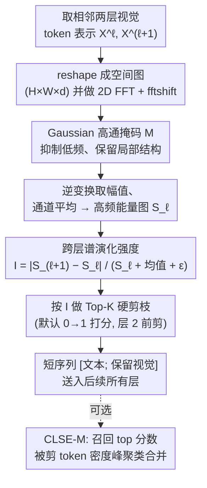

# Spectral Evolution-Guided Token Pruning in Multimodal Large Language Models

**会议**: ECCV 2026  
**arXiv**: [2606.24165](https://arxiv.org/abs/2606.24165)  
**代码**: <[https://github.com/zjubinchen/CLSE>](https://github.com/zjubinchen/CLSE>)  
**领域**: LLM效率 / 多模态VLM  
**关键词**: 视觉 token 剪枝, 跨层谱演化, 频域高通滤波, training-free 加速, MLLM 推理

## 一句话总结
本文提出 CLSE(Cross-Layer Spectral Evolution),一个 training-free 的视觉 token 剪枝框架:不再用单层 attention 或特征幅值判断 token 重要性,而是把每层视觉 token 变换到频域、经高通滤波后度量其高频结构能量在相邻 LLM 层之间的相对变化量,变化剧烈的 token 被判为语义活跃并保留;在 LLaVA/Qwen2-VL/Video-LLaVA 等多个 MLLM、剪到 11%~33% token 的激进压缩下,精度保持显著优于 FastV、SparseVLM、PDrop 等。

## 研究背景与动机
**领域现状**:现代 MLLM 把 ViT 编码的几百上千个视觉 token 拼进 LLM 一起解码,高分辨率和视频场景下 token 数暴涨,自注意力对序列长度是二次复杂度,推理延迟和 KV cache 成为瓶颈。视觉 token 存在大量空间/时序冗余(相邻 patch、相邻帧高度相关),因此推理期剪掉冗余视觉 token 成为免训练加速的主流路线。

**现有痛点**:绝大多数 training-free 方法都依赖**单层瞬时信号**——attention 权重(FastV)、特征幅值、或 token 间相似度(DART/ToMe)。这些信号有两个硬伤:其一,attention 有明显的**位置偏置**,倾向于给拼接序列后半部分的视觉 token 打高分(受位置编码影响),即使那些区域并不语义关键;其二,静态幅值类方法忽略了一个 MLLM 解码的本质规律——视觉 token 表示会**跨层结构化演化**,从低层空间细节逐步抽象为高层语义(同时文本指令被融合进来)。

**核心矛盾**:token 的真实贡献体现在它「随深度如何被文本-视觉交互重塑」,而不是它在某一层的瞬时强度。用单层快照去估计一个本质上是「跨层动态」的量,天然就是错配的。

**本文目标 + 切入角度**:作者要找一个既稳定(不受位置偏置干扰)、又能刻画表示动态、还足够便宜(不能比 attention 提取更慢)的重要性判据。切入点来自频域视角:已有研究(FNet、Fourier-VLM 等)观察到 Transformer 浅层保留高频空间信息、深层强调低频语义结构,这种「depth-wise 谱漂移」正是多模态抽象过程的外在表现。

**核心 idea**:token 重要性 = 它的频域表示跨层演化的强度。对推理有意义的 token 在「细节→语义」的转变中表现出**更强的谱重分布**,而背景冗余 token 在频域里近乎静止。于是把「测幅值/attention」换成「测跨层谱演化」,就能更忠实地识别该保留哪些 token。

## 方法详解

### 整体框架
CLSE 的核心是一个 token 重要性打分器:在 LLM decoder 早期,取相邻两层的视觉 token 表示,各自变换到频域、高通滤波后得到「高频结构能量图」,再计算这张能量图在两层之间的相对变化量作为每个 token 的 evolution intensity;按此分数 Top-K 硬剪枝,剪后的短序列送入后续所有层。整个过程无需训练、不改权重,是 plug-and-play 模块。

### 关键设计

**1. 高频结构能量而非特征幅值:用频域高通滤波隔离「局部结构」**

痛点是幅值类信号会被 embedding 的绝对大小主导,且分不清「结构信息」和「低频全局背景」。CLSE 的第一步不测 token 的原始范数,而是测它的**带限高频能量**。把某层视觉 token $\mathbf{X}^{\ell}\in\mathbb{R}^{N\times d}$($N=H\cdot W$)reshape 成空间特征图 $\mathbf{X}^{\ell}_{2\mathrm{D}}\in\mathbb{R}^{H\times W\times d}$,做 2D FFT 并中心化:$\widehat{\mathbf{X}}^{\ell}=\mathrm{fftshift}(\mathcal{F}(\mathbf{X}^{\ell}_{2\mathrm{D}}))$。然后乘一个 Gaussian **高通**掩码把中心(低频)压掉:

$$\mathbf{M}_{u,v}=1-\exp\!\left(-\frac{(u-c_u)^2+(v-c_v)^2}{2(r\cdot c_u)^2}\right)$$

其中 $(c_u,c_v)$ 是谱中心,$r$ 是截止比(默认 $r{=}0.1$)。再逆变换取幅值、沿通道维平均,得到每个空间位置的高频能量 $\mathbf{S}_\ell=\mathrm{Avg}_d\!\left(\left|\mathcal{F}^{-1}(\mathrm{ifftshift}(\widehat{\mathbf{X}}^{\ell}\odot\mathbf{M}))\right|\right)\in\mathbb{R}^{H\times W}$,展平成 $\mathbb{R}^N$。为什么有效:$\mathbf{S}_\ell$ 隔离的是「低频抑制后的残差能量」(边缘、细结构),而非整个特征范数——消融(Fig. 5c)证明直接用 L1 残差范数(SFR)会因依赖像素级强度、对高频伪影敏感而性能崩溃,证明「先滤低频再看结构」这一步是必要的。

**2. 跨层谱演化强度:用相邻层能量的相对变化衡量 token 是否「在被重塑」**

有了单层能量还不够——关键 idea 是看它**跨层怎么变**。背景 token 的残差图近乎静止,语义参与的 token 则呈现明显重分布。对参考层 $\ell$ 与后续层 $\ell{+}1$,定义 evolution intensity:

$$\mathcal{I}^{(\ell)}=\mathrm{clip}\!\left(\frac{|\mathbf{S}_{\ell+1}-\mathbf{S}_{\ell}|}{\mathbf{S}_{\ell}+\overline{\mathbf{S}}_{\ell}+\epsilon},\ 0,\ \tau_{\max}\right),\quad \overline{\mathbf{S}}_{\ell}=\mathrm{mean}(\mathbf{S}_{\ell})$$

这是一个刻意设计成**尺度不变**的相对量:分母除以 $\mathbf{S}_\ell$ 防止大幅值 token 主导信号,加上全局均值 $\overline{\mathbf{S}}_\ell$ 作正则项,进一步压掉「局部能量低于全图均值」的非活跃/冗余区域的微小谱抖动;$\epsilon$ 和 $\tau_{\max}$ 保证数值稳定和抗离群。为什么有效:分子直接测「相邻层高频结构的重分布量」,而文本-视觉推理正是在早期解码层剧烈重塑 token 表示的地方——因此 $\mathcal{I}^{(\ell)}$ 大的 token 恰好是被主动更新的局部结构。消融(Fig. 5b)给出了「反事实」证据:CLSE-Inertia(反过来保留**演化最弱**、最静止的 token)出现灾难性崩溃,直接证明跨层谱演化确实是语义活跃度的主驱动因子。

**3. 早层剪枝调度:在 decoder 第 1 层就剪,最大化 prefilling 加速**

为最大化 prefill 阶段的加速,CLSE 把剪枝放到 LLM decoder 最前面。默认设置:用输入 embedding $\mathbf{X}^0$ 与第 1 层输出 $\mathbf{X}^1$(即 $0\!\to\!1$)计算 $\mathcal{I}^{(\ell)}$,并在第 2 层之前执行 $\mathcal{K}=\mathrm{TopK}(\mathcal{I}^{(\ell)},K)$,保留 $\tilde{\mathbf{X}}^{\ell}=\mathbf{X}^{\ell}[\mathcal{K}]$,之后所有层只跑短序列。为什么选早层(附录 Table 8 给了扎实证据):早层视觉 token 仍保留原始空间多样性,语义活跃区(边缘、细结构)演化快、背景静止,CLSE 信号最有判别力,且此时剪掉能省下最多计算;中层(如第 10 层)反而最差——反复层间混合已抹平谱多样性、削弱信号,而计算又大多已发生;很深层(≥15)token 已互相同质化,精度虽回升但加速收益归零。因此推荐剪枝层 $K\in\{1,3\}$。作者还给出理论(Thm. 1):在下游 Lipschitz + saliency 对齐假设下,剪枝引入的输出扰动上界为 $\|g(\mathbf{X}^\ell)-g(P_\Omega(\mathbf{X}^\ell))\|_2\le\alpha\sum_{i\notin\Omega}\mathcal{I}^{(\ell)}_i$,即被丢弃的谱演化质量之和;按 $\mathcal{I}^{(\ell)}$ 取 Top-K 恰好最小化这个上界。⚠️ 该上界依赖一阶展开与 Assumption 2(token 下游影响被其谱演化分数上界),以原文为准。

**4. CLSE-M:谱分数引导的 token merging,面向视频的信息召回**

在视频(2048→194,>90% 压缩)这种极端场景,纯硬剪不可避免会丢掉难以恢复的时序内容。CLSE-M 在硬剪基础上加两阶段召回:先取被剪 token 里 joint 分数最高的 top 30%(过滤掉几乎无注意力的),再用 density-peak clustering 把这 $K$ 个召回 token 压成 $\lfloor K/10\rfloor+1$ 个代表向量(聚类中心按「局部密度 × 到更高密度邻居的距离」联合选取,其余 token 归到最近中心并均值合并)。最终序列形如 `[前缀 | 保留视觉 r 个 | 合并代表 ⌊K/10⌋+1 个 | 文本]`。附录还提到 CLSE-M 用文本→视觉 attention 与 CLSE 因子相乘作 joint 分数、保留数由注意力矩阵的数值秩自适应决定(而非固定比例)。⚠️ 附录里 CLSE-M 的 joint 分数含 attention 项,与正文主实验「纯谱演化硬剪」略有差异,以原文附录 A.4 为准。

### 损失函数 / 训练策略
CLSE 是完全 **training-free** 的:不改任何模型权重、不需要额外训练或微调,所有剪枝决策都在推理时基于中间层表示做出,可直接插入现有 MLLM 推理管线。唯一的超参是高通截止比 $r{=}0.1$、剪枝层 $K{\in}\{1,3\}$、以及 CLSE-Hybrid 变体里的温度 $\tau{=}0.1$(附录 Table 7)。

## 实验关键数据

### 主实验
LLaVA-1.5-7B(576 token 剪到 192/128/64),9 个图像 benchmark 的平均保持率(相对 Vanilla=100%):

| 方法 | Retain 192 (↓66.7%) | Retain 128 (↓77.8%) | Retain 64 (↓88.9%) |
|---|---|---|---|
| ToMe (ICLR23) | 84.8% | 84.1% | 67.4% |
| FastV (ECCV24) | 92.1% | 87.2% | 78.0% |
| PruMerge (ICCV25) | 90.8% | 88.9% | 87.5% |
| PDrop (CVPR25) | 96.9% | 95.3% | 77.0% |
| HiRED (AAAI25) | 91.0% | 89.8% | 86.6% |
| SparseVLM (ICML25) | 96.3% | 93.7% | 84.3% |
| FiCoCo-V (AAAI26) | 96.2% | 94.3% | 89.8% |
| **CLSE (Ours)** | **99.4%** | **98.1%** | **94.8%** |

亮点:在最激进的 64 token(仅保留 11%)下,CLSE 达 94.8%,比次优 FiCoCo-V(89.8%)高 5 个点;且 CLSE 只用「谱演化打分 + 简单硬剪、无 token recycling」就打败了带 merging/recycling 的方法。跨模型也成立:Qwen2-VL-7B 三档分别 97.6%/95.8%/90.5%;LLaVA-Next-7B(2880→320,↓88.9%)达 94.7%;LLaVA-1.5-13B 三档 99.1%/98.2%/94.1%;InternVL-2.5-8B 在 ↓88.9% 达 96.2%(FastV 89.4%);Qwen2-VL-72B(4-bit)三档 96.4%/94.5%/90.0%,且领先 FastV 的差距随压缩加剧从 2.0→3.7→7.8 个点单调扩大。

视频(Video-LLaVA-7B,2048→194,GPT-4o-mini 评测的平均 Acc):

| 方法 | 类型 | Avg. Acc |
|---|---|---|
| Vanilla | — | 38.7 |
| FastV | 硬剪 | 26.1 |
| PDrop | 硬剪 | 27.3 |
| FiCoCo-V | merge | 31.9 |
| **CLSE** | 硬剪 | **35.7** |
| SparseVLM | merge | 38.1 |
| **CLSE-M** | merge | **38.7**(追平 Vanilla) |

效率(LLaVA-1.5-7B,192 token):CLSE 达 FLOPs 43.9%、KV cache 56 MB、精度 99.4%、prefill 加速 1.50×;FastV 更快(1.69×)但掉到 92.1%。视频端 CLSE-M 与 SparseVLM 同为 FLOPs 10.7%/KV 121.1 MB,但精度 100% vs 98.4%,加速 2.73×。

### 消融实验
截止比 $r$ 与关键组件(LLaVA-1.5-7B,192 token,Fig. 5;层选择见附录 Table 8):

| 消融项 | 设置 | 结论 / 数据 |
|---|---|---|
| 高通截止比 $r$ | $r{=}0$ → 小值 | 从无滤波到 $r{=}0.1$ 性能大幅提升,轻度抑制低频即可去冗余;默认 $r{=}0.1$ |
| 谱演化方向 | CLSE-Inertia(保留最静止 token) | **灾难性崩溃**,反证谱演化是语义活跃度主驱动 |
| 打分度量 | SFR(L1 残差范数) | 性能崩溃(依赖像素级强度、对高频伪影敏感) |
| 打分度量 | MMD(通道均值差) | 稍稳定但仍粗糙,标量幅值抓不住频谱内的结构重分布 |
| 剪枝层 $K$(Table 8) | $K{=}1$(默认) | GQA 61.1 / MME 1814 / POPE 83.7,评测时间最低(1691s) |
| 剪枝层 $K$ | $K{=}10$ | 严重退化(POPE 42.7),信号已被层间混合抹平且计算已花掉 |
| 剪枝层 $K$ | $K{\ge}15$ | 精度回升但几乎无加速收益 |
| 参考层选择 | $L{=}K{-}1$(邻层) vs $L{=}0$(全局) | 邻层参考普遍持平或更优,说明局部谱变化是可靠信号 |
| 视频 FFT(Table 6) | 逐帧 2D vs 3D 时空 | 逐帧 2D 全面且大幅胜出(35.7 vs 26.5),8 帧太短不足以做 3D 谱分析 |

### 关键发现
- **谱演化(测跨层变化)是精度的第一贡献者**:反着保留最静止 token 直接崩溃,说明重要性的本质是「动态」而非「幅值」,这是全篇的因果基石。
- **高通滤波不可省**:去掉高通(用 SFR 原始残差范数)就崩;$r$ 从 0 调到 0.1 单调提升。低频=全局背景,先滤掉才能露出「结构」。
- **剪枝层是强 U 型 trade-off**:早层(1、3)信号最锐利且省算力最多 → 最佳;中层(10)信号被抹平且算力已耗 → 最差;深层(≥15)精度回升但无加速。「在哪剪」和「怎么打分」同等重要。
- **压得越狠优势越大**:在 64 token / ↓88.9% 这种极端压缩,CLSE 领先幅度最大(如 72B 上领先 FastV 从 2 个点扩到 7.8 个点),说明谱演化在预算最紧时最稳。

## 亮点与洞察
- **把「重要性」从瞬时量重新定义为跨层动态量**:这是最核心的观念转变。别人问「这个 token 现在有多强」,本文问「这个 token 正在被多剧烈地重塑」——后者才对应语义参与度。反事实消融(保留最静止 token 即崩溃)把这个 insight 钉死了。
- **频域高通 + 相对归一化的组合拳很巧**:高通滤波把「结构」从「背景」里剥出来,相对归一化(除以本层能量+全局均值)让分数尺度不变、免受大幅值 token 与图间尺度差干扰,两步都直击 attention/幅值法的具体病灶,而不是空泛地「取平衡」。
- **免费的午餐——O(N log N) 打分**:FFT 打分只需 ~108M FLOPs,不到单层 0.12%、全前向 0.004%。反观依赖 dense attention 权重的方法必须退回 O(N²) 的 Eager 实现(现代 SDPA/FlashAttention 内核根本不物化 N×N 矩阵),CLSE 因此不仅更准还更硬件友好,这是个容易被忽视但很实在的工程优势。
- **正交于 token merging,可即插组合**:CLSE 是打分器,和 ToMe/density-peak 合并天然互补(CLSE-M),视频端追平满 token,复用性强。
- **最「啊哈」的点**:同一张 attention 图,后半段视觉 token 被系统性打高分纯粹是位置编码副作用;而谱演化对这种位置偏置免疫,定性图(Fig. 6)里 CLSE 稳定聚焦到真正演化的物体/人体,attention 却散在背景上。

## 局限与展望
- **作者承认的局限**:视频端纯硬剪在 >90% 压缩会丢失难恢复的时序内容,必须靠 CLSE-M 召回补偿;3D 时空 FFT 在稀疏采样(8 帧)下不如逐帧 2D,即方法的时序建模主要靠「跨层演化因子」间接承担,而非频域直接建模时序。
- **依赖空间可 reshape 的假设**:$N\!=\!H\cdot W$ 才能 reshape 成 2D 网格做 FFT。对 InternVL 这类 dynamic tiling、或非规则 token 布局,需要额外设计(local/global 两种 FFT + 缩略图单独归一化),泛化性有代价。
- **理论保证偏弱(我的观察)**:Thm. 1 的上界依赖一阶泰勒展开和 Assumption 2(token 下游影响被谱演化分数上界)这一较强的、无法验证的先验;作者自己也在 Remark 里承认这是「结构保持代理」而非任务目标的保证。它更像是对经验现象的事后合理化,而非独立预测力。
- **主实验 vs 附录不完全一致(我的观察)**:正文主表宣称「纯谱演化硬剪」,但附录 A.4 的 CLSE/CLSE-M 完整管线把谱因子和文本→视觉 attention 相乘、并用注意力矩阵秩自适应定预算——读者容易混淆「哪个配置产出了主表数字」,建议以官方代码为准。
- **改进思路**:超参 $r$、$K$ 目前全局固定,能否按样本/层自适应?谱演化能否直接用于 KV cache 的层间动态释放,而不只是 prefill 前一次性剪枝?

## 相关工作与启发
- **vs FastV(ECCV24)**:FastV 在第 3 层用 LLM 的 attention 幅值排序剪 token,是「单层 attention」代表。本文指出 attention 有位置偏置且依赖 dense 权重(退化到 O(N²)),改用第 1 层的跨层谱演化打分,既避开位置偏置又保持 O(N log N),同预算下精度全面反超(64 token 上 94.8% vs 78.0%)。
- **vs SparseVLM(ICML25)**:SparseVLM 用文本-视觉 attention 打分 + 自适应稀疏 + token recycling。CLSE-M 用同样的 recycling 骨架但把打分换成谱演化(视频端 38.7 vs 38.1),证明「信号来源」比「回收机制」更决定上限。
- **vs ToMe / PruMerge(ICLR23 / ICCV25)**:它们靠特征相似度合并 token。本文正交——CLSE 是重要性打分器,可与合并组合;且论证「相似度/多样性」抓不到「任务相关的跨层动态」。
- **vs Fourier-VLM / VTC-LFC(频域压缩类)**:这些在**单层内**用低通滤波压缩 token。本文关键区别是把频域变换用作**跨层重要性判据**(高通 + 层间差分),关心的是 token「是否发生了细节→语义的转变」,而非在某层压缩它。
- **vs V²Drop(CVPR26,并行工作)**:V²Drop 也看跨层动态,渐进丢弃「表示变化极小的 lazy token」。思路撞车,但 V²Drop 在原始特征空间测变化,CLSE 在**频域高通后**测变化,后者能剥离低频背景、聚焦结构重分布,消融显示原始残差范数(SFR)会崩溃,暗示频域这一步是关键差异。

## 评分
- 新颖性: ⭐⭐⭐⭐⭐ 「重要性=跨层谱演化」是一个干净且被反事实消融强力支撑的新判据,频域高通+层间差分的组合此前未见于 MLLM token 剪枝。
- 实验充分度: ⭐⭐⭐⭐⭐ 覆盖 5+ 图像/视频 MLLM(含 72B、InternVL、量化)、3 档压缩率、9+ benchmark,消融把每个组件、剪枝层、2D/3D FFT 都拆开验证,罕见地完整。
- 写作质量: ⭐⭐⭐⭐ 动机链条清晰、图示到位;但主表配置与附录完整管线的口径差异会让复现者困惑,理论一节略显硬凑。
- 价值: ⭐⭐⭐⭐⭐ Training-free、plug-and-play、打分开销可忽略、正交于 merging,几乎零成本可接入现有 MLLM,实用价值高。

<!-- RELATED:START -->

## 相关论文

- [\[ECCV 2026\] Accelerating Multimodal Large Language Models with Prior-Corrected Token Reduction](accelerating_multimodal_large_language_models_with_prior-corrected_token_reducti.md)
- [\[CVPR 2026\] IF-Prune: Information-Flow Guided Token Pruning for Efficient Vision-Language Models](../../CVPR2026/vlm_efficiency/if-prune_information-flow_guided_token_pruning_for_efficient_vision-language_mod.md)
- [\[CVPR 2026\] CoIn: Coverage and Informativeness-Guided Token Reduction for Efficient Large Multimodal Models](../../CVPR2026/vlm_efficiency/coin_coverage_and_informativeness-guided_token_reduction_for_efficient_large_mul.md)
- [\[CVPR 2026\] EvoComp: Learning Visual Token Compression for Multimodal Large Language Models via Semantic-Guided Evolutionary Labeling](../../CVPR2026/vlm_efficiency/evocomp_learning_visual_token_compression_for_multimodal_large_language_models_v.md)
- [\[CVPR 2026\] OmniZip: Audio-Guided Dynamic Token Compression for Fast Omnimodal Large Language Models](../../CVPR2026/vlm_efficiency/omnizip_audio-guided_dynamic_token_compression_for_fast_omnimodal_large_language.md)

<!-- RELATED:END -->
