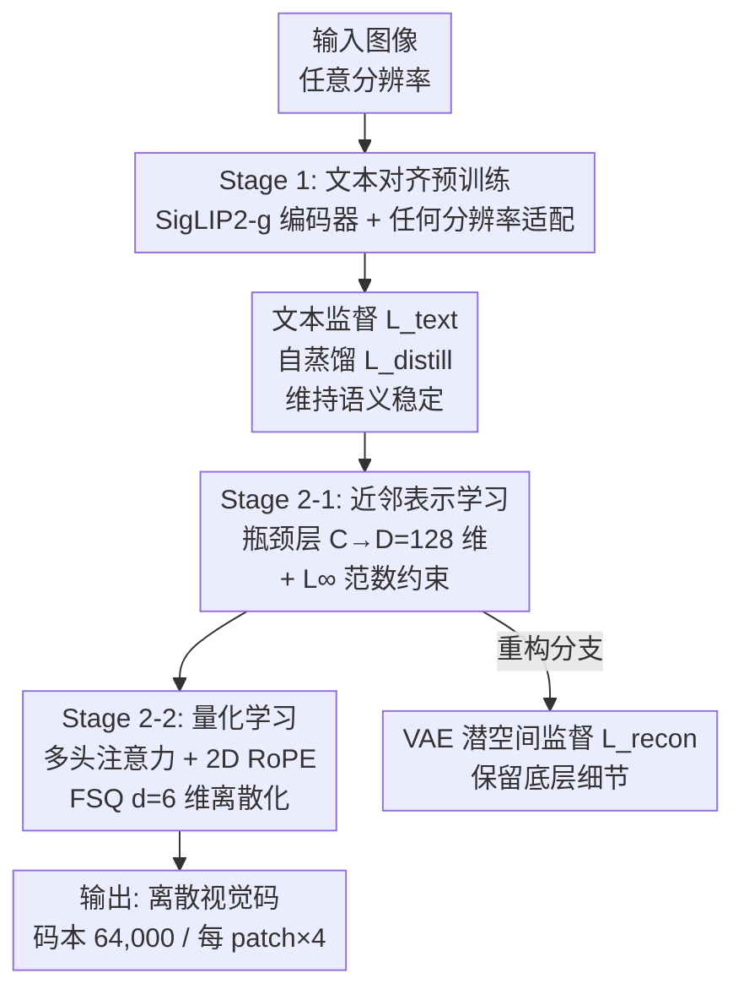

# ViQ: Text-Aligned Visual Quantized Representations at Any Resolution

**会议**: ECCV 2026  
**arXiv**: [2606.27313](https://arxiv.org/abs/2606.27313)  
**代码**: [https://github.com/yuxumin/ViQ](https://github.com/yuxumin/ViQ)  
**领域**: 多模态 VLM / VLM 效率  
**关键词**: 量化视觉编码器、离散表示、训练加速、任意分辨率、文本对齐  

## 一句话总结
ViQ 提出两阶段视觉量化框架——先做文本对齐预训练让连续特征富含语义，再渐进式压缩并用量化器 FSQ 做低维离散化——使离散视觉编码器在 9 个多模态基准上首次达到与连续编码器接近甚至超越的性能，同时带来 20%-70% 的训练加速和接近 1/96 的存储压缩比。

## 研究背景与动机

当前主流的多模态大语言模型（MLLM）几乎都依赖 CLIP、SigLIP、InternViT 等**连续视觉编码器**：图像被映射为高维浮点特征向量，再通过投影层输入给 LLM。这个范式虽然成功，但引入了一个根本性的表征失配——视觉特征流在底层是连续的浮点张量，而文本 token 序列是离散的整数索引。为了让两者交互，MLLM 需要在高维连续视觉流和离散文本空间之间架设一个投影层，这不仅增加了计算开销和硬件压力，也让「视觉与语言在同一个离散框架下建模」这一自然目标难以达成的。一些先驱工作如 QLIP、UniTok 尝试用向量量化（VQ）把视觉信号离散化，但这类方案遇到了一个棘手的矛盾：侧重重建的自动编码器（VQ-VAE 等）在量化后保留了底层细节却丢失了高层语义，侧重语义的视觉编码器在量化后又严重丢失了图像的细粒度信息——量化后的编码器在图文理解 benchmark 上与连续编码器的差距长期在 20-30 个百分点以上。

这种两难困局的核心矛盾在于：离散化的本质是**信息压缩**，而压缩方向决定了信息损失的类型。重建导向的压缩倾向于保留像素级别的细节，但像素级特征天生对语义规整不敏感；语义导向的压缩保留的是概念层面的相似性，但会把分辨率、纹理等细节当作「噪声」丢弃。MLLM 所需要的恰恰是「既要能读图答题（语义），也要能看清文档里的 8 号字（细节）」——二者在离散表示中天然冲突，现有方法被迫二选一。

ViQ 的切入角度是：既然冲突的根源在于「一次性把高维连续特征压到低维离散空间」，那为什么不把这个压缩过程拆解成多步、让每一步都有针对性的监督信号？**核心 idea：将量化学习解耦为「文本对齐预训练 → 渐进式特征压缩 → 无参化低维量化」三阶段，先用语言监督给连续特征注入丰富语义，再用近邻表示（Proximal Representation）逐步压缩特征空间、控制信息损失，最后用无参的 FSQ 在低维空间做最终离散化——让离散码同时承载高层语义（来自预训练对齐）和底层细节（来自渐进式保留）。**

## 方法详解

### 整体框架

ViQ 的视觉量化训练分为 Stage 1（文本对齐预训练）和 Stage 2（视觉量化学习）两大阶段，其中 Stage 2 又细分为 Stage 2-1（近邻表示学习）和 Stage 2-2（FSQ 量化）。整个过程以 SigLIP2-g（1.1B 参数）为视觉编码器基座。Stage 1 让编码器学会处理任意分辨率输入，并通过 LLM 的文本监督获得语义对齐的特征；Stage 2-1 用瓶颈层 + L∞ 范数约束将 1536 维特征渐进压缩到 128 维；Stage 2-2 进一步压缩到 6 维，用 FSQ 完成离散化，并用多头注意力 + 2D RoPE 维持量化质量。

### 关键设计

**1. 近邻表示（Proximal Representation）：渐进式压缩特征空间**

直接对 SigLIP2-g 输出的 1536 维高维特征做量化会造成严重精度损失——在连续空间中紧密排列的相似特征被硬分到同一个离散 bin 后，大量区分性信息被抹除。ViQ 的解决思路不是一次性压缩，而是「化一步为两步」：先通过一个瓶颈全连接层将特征降至 128 维，再对这 128 维中维特征施加 L∞ 范数约束（$\|f_1\|_\infty = 1$），将所有特征投影到超立方体的表面。这样做的效果是让特征点在空间中先「聚拢」到一个紧凑且形状规则的区域，同时保留彼此间的相对距离关系，为后续的硬量化做准备——好比在把东西塞进窄口瓶之前先整理好形状，而不是硬塞。消融实验（Table 3a）清楚显示了渐进式的价值：从连续特征直接做 SimVQ 量化只有 60.9 分，加瓶颈层并逐步增加约束（BN→l2→l∞）后分数从 66.6 逐步提升到 68.7。核心 insight 是，L∞ 范数约束比 L2 更适合 FSQ 的网格量化几何（Table 3a 对比：68.7 vs 67.9），因为 L∞ 将特征投影到超立方体表面，与 FSQ 的离散网格结构天然对应。

**2. 多头有限标量量化（Multi-Head FSQ）：无参量化的反直觉优势**

ViQ 选择 FSQ（Finite Scalar Quantization）作为量化器而不是 SIMVQ、LFQ、IBQ 等需要学习额外码本的方法。FSQ 的做法非常朴素：把 6 维特征每个维度映射到 5-8 个离散值（levels [8,8,8,5,5,5]），直接 round 取整完成量化——码本规模固定为 8×8×8×5×5×5 = 64,000。相比 SimVQ（需要维护可学习的 2^15 码本），FSQ 全程无参、训练更稳定，且在 ViQ 框架下一致胜出（Table 3c：FSQ 68.7 > SIMVQ 66.6 > 原生 VQ 65.7）。为什么无参量化反而更好？关键在于 ViQ 的渐进式特征约束已经把空间「预整形」成了接近 FSQ 网格的形态——可学习码本里的嵌入向量在训练中相互竞争，有时反而扰乱了这种已对齐的空间结构。附录 C 的实验印证了这一解读：将 SimVQ 的 L2 正则换成 L∞ 后分数从 66.6 降到 66.1，说明正则必须与量化几何匹配。

为了弥补单个离散 token 的表达能力不足，ViQ 引入多头扩展机制：每个图像 patch 的 6 维特征通过线性投影上采样到 24 维，再重塑为 4 个独立的 6 维子 token。在同一 patch 的 4 个子 token 内部做自注意力（不同 patch 不交互），各自独立量化后拼接、再经过线性投影恢复到 6 维。这个「1 patch → 4 codes」的设计在不增加下采样率的前提下将码表达能力乘以 4，在文档和 OCR 等细节密集型任务上贡献显著。

**3. 2D 旋转位置编码与任意分辨率量化**

离散码本质上不携带空间位置信息——「左上角的 patch」和「右下角的 patch」被量化后变成了无法区分的特征。ViQ 在量化步骤之前插入 2D 旋转位置编码（RoPE），对位于 2D 空间中坐标 $(h,w)$ 处的 token 特征 $f_m$ 进行旋转调制：
$$\tilde{f}_m = f_m \odot e^{i(h\theta_h + w\theta_w)}$$
其中 $\theta_h$ 和 $\theta_w$ 是高度和宽度维度的频率参数。相比可学习位置嵌入（65.7）或不加位置信息（65.3），2D RoPE 达到 68.7（Table 3d），而且天然支持任意分辨率——因为 RoPE 基于连续频率编码，不需要在训练时预设最大分辨率表。这与 Stage 1 中借鉴 NaViT 和 OryxViT 的动态位置参数技术形成配合：编码端能按任意长宽比提取视觉 token，量化端能保持这些 token 的准确位置关系。正是这种任意分辨率能力让 ViQ 在 InfoVQA（+10.4 vs InternViT-6B）和 DocVQA（+3.2）等高分辨率文档任务上获得了连续编码器级别的表现。

**4. VAE 潜空间重建监督：语义与细节的精妙平衡**

ViQ 的训练目标包含三项损失：文本监督 $\mathcal{L}_\text{text}$（交叉熵，对齐高层语义）、自蒸馏 $\mathcal{L}_\text{distill}$（余弦相似度，维持语义稳定性）、重建损失 $\mathcal{L}_\text{recon}$。重建损失的选择非常关键：如果直接做像素级 MSE + LPIPS 重建，虽然能改善图像重建指标，但像素级的刚性约束会与高层语义特征产生竞争，反而不利于多模态理解（Table 3e：MSE+LPIPS 仅 67.0 vs 完整 68.7）。ViQ 选择在**预训练 VAE 的潜空间**中进行监督：用固定参数的 Qwen-Image 编码器提取图像的潜表示作为目标，让 ViQ 的特征预测结果与之接近（$\mathcal{L}_\text{recon} = \text{NLL}(\hat{f}, \text{Encoder}(x))$，等价于 MSE）。VAE 潜空间本身就是「语义化的细节表示」——它已经去掉了像素噪声但保留了感知相关的高频结构。消融分析（Table 3f）显示，VAE 潜监督仅花了 1.3× 的时间开销（相比不做重建的 1×），就用「轻量级约束」达到了 68.7 的最高分；相比之下，DiT-based 重建需要 4× 开销且效果更差（冻结 DiT 得 67.6，不冻结仅 65.8）。核心 insight 是：选择**在什么空间做重建**比「做不做重建」本身更重要。

### 一个完整示例

假设输入一张 768×1024 的票据扫描图（含表格编号和手写签名）。首先，SigLIP2-g 编码器按原始长宽比做 patch 化（每 16×16），产出约 768 个视觉 token，每个 token 对应一个 1536 维的连续特征。Stage 1 用 Qwen2.5-0.5B 做文本监督（短问答配对数据），让这 768 个特征富含语义——模型学会了「这个 patch 是文本、那个 patch 是签名」。Stage 2-1 接上瓶颈层，把每个 1536 维特征压到 128 维，接着施加 L∞ 约束：所有向量投影到半径为 1 的超立方体表面。Stage 2-2 将 128 维上投影到 24 维（4×6），经 2D RoPE 编码位置信息后，在 6 维空间中执行 FSQ 量化——每个维度的取值落在 [0,7] 或 [0,4] 区间，最终每个原始 patch 产生 4 个离散整数码（每个 16 bits，约 2 字节），全图共 768×4=3072 个码，存储仅 ~6KB（原图的 1/96）。下游训练时，直接加载这组预计算的离散码和一个轻量 MLP 投影层，即可送入 LLM——完全跳过视觉编码器的 forward pass，这也是 20%-70% 训练加速的来源。

### 损失函数 / 训练策略

总目标函数：
$$\mathcal{L}_\text{total} = \lambda_\text{text}\mathcal{L}_\text{text} + \lambda_\text{distill}\mathcal{L}_\text{distill} + \lambda_\text{recon}\mathcal{L}_\text{recon}$$

训练采用三阶段 progressive 策略：
- **Stage 1（文本对齐预训练）**：~3B 规模的 VL token，分辨率从 384² 逐步提升到 768²，仅 LoRA 微调视觉编码器，Qwen2.5-0.5B 提供文本监督。同时固定 SigLIP2-g 作为自蒸馏教师，让学生模型的全局特征与原始固定分辨率的教师特征保持余弦相似，防止多模态微调冲坏预训练学到的泛化能力；
- **Stage 2-1（近邻表示学习）**：1B tokens，768 分辨率，瓶颈 128 维 + L∞ 正则。重建分支用 VAE 潜空间损失的预测头（3 层 MHSA + 卷积上采样）；
- **Stage 2-2（量化学习）**：30B tokens，替换正则为 FSQ 量化模块（6 维 levels [8,8,8,5,5,5]），加入多头注意力 + 2D RoPE。全部参数 lr=5e-5，cosine scheduler 退火到 1e-5。

## 实验关键数据

### 主实验

以下结果基于 Qwen2.5-1.5B / 7B 基座，2000K 固定数据训练。

| 数据集 | 指标 | ViQ (1.3B) | InternViT-2.5-6B | QLIP (0.3B) | UniTok (0.3B) |
|--------|------|-----------|-----------------|------------|-------------|
| MMStar | Acc | 47.8 / 54.2 | 48.5 / 55.3 | 39.9 / - | 41.0 / - |
| MMMU | Acc | 42.6 / 49.1 | 42.1 / 48.1 | 36.9 / - | 36.1 / - |
| SimpleVQA | Acc | 26.0 / 28.5 | 23.7 / 28.4 | 13.7 / - | 15.5 / - |
| InfoVQA | Acc | 41.6 / 55.3 | 35.2 / 44.9 | 14.8 / - | 15.9 / - |
| TextVQA | Acc | 74.3 / 78.5 | 75.5 / 79.9 | 45.1 / - | 39.7 / - |
| DocVQA | Acc | 84.2 / 88.9 | 80.1 / 85.7 | 12.2 / - | 11.6 / - |
| ChartQA | Acc | 65.2 / 72.8 | 67.8 / 77.4 | 14.1 / - | 43.8 / - |
| **Avg** | **Acc** | **57.2 / 63.9** | **57.0 / 63.8** | **29.7 / -** | **33.0 / -** |

ViQ 以 1.3B 参数量（含码本）在 9 个基准平均分上超越了 6B 参数的 InternViT-2.5，而之前最强的量化编码器 UniTok 只有不到 33 分——这是一个量级性的跨越。ViQ 的增益在 OCR/文档类任务上最显著（InfoVQA +10.4、DocVQA +3.2），而在通用知识类任务上与连续编码器基本持平。

### 消融实验

| 配置 | 八任务平均 | 说明 |
|------|-----------|------|
| Continuous→BN+L∞→FSQ（完整） | 68.7 | ViQ 默认 |
| 直接量化（w/o 渐进式） | 60.9 | 损失 7.8 |
| L2 替代 L∞ | 67.9 | 正则需匹配 FSQ 网格 |
| SimVQ 替代 FSQ | 66.5-66.6 | 可学习码本反不如无参 |
| 不加位置编码 | 65.3 | RoPE 贡献 3.4 分 |
| RoPE→Learnable PE | 65.7 | 可学习 PE 增优化难度 |
| 仅文本损失 | 61.3 | 自蒸馏 + 重建叠加增益 7.4 |
| +自蒸馏（无重建） | 66.8 | 自蒸馏贡献显著 |
| +MSE+LPIPS 重建 | 67.0 | 像素级约束侵蚀语义 |
| +VAE 潜空间重建 | 68.7 | 最优（1.3× 成本） |

### 关键发现

- 渐进式压缩（Proximal Representation）是收益最大的单点：直接量化丢 7.8 分，加瓶颈层和合适的正则后几乎恢复全部
- 无参量化（FSQ）一致优于有参量化（SimVQ/LFQ/原生 VQ），这与文献主流观念相反，原因在于 ViQ 的渐进式特征预压缩已与 FSQ 网格结构对齐，可学习码本反而引入竞争性噪声。正则化函数与量化几何的匹配比码本可学习性更重要
- ViQ 在 InfoVQA / DocVQA / ChartQA 上的增益最大（对应「高细节，需要读文本和图表」场景），在 MMStar / MMMU 上持平或略低——说明量化视觉编码器的差异化优势在细节密集型任务，通用推理更多依赖 LLM 自身
- 训练效率：在 4k 序列长度，Qwen2.5-7B + ViQ 获得 46% forward 加速和 20%+ step 加速；16k 场景加速至 65% forward 和 40%+ step。加速来源是「离线预计算离散码 + 训练时跳过视觉编码器」
- VAE 潜空间监督以极低成本（1.3×）和最好的下游性能，是重建损失的最优形式——像素级监督（MSE+LPIPS）和 DiT-based 监督要么侵蚀语义、要么显式让生成分支吸走了编码器的表达能力

## 亮点与洞察

- 「渐进式压缩」是全文最精妙的设计：不是一步到位从 1536 压到 6，而是 1536→128（瓶颈）→6（量化），中间用 L∞ 做软着陆。每一级压缩都有针对性的正则约束和监督信号。这个「层次化瓶颈 + 空间预整形」的思路可以广泛迁移到模型压缩、特征蒸馏、缓存表示等场景
- 无参量化优于有参量化的反直觉发现极具启发：研究者经常把精力花在设计更复杂的码本更新策略上，但 ViQ 证明，当特征空间被充分对齐后，简单的 round 取整就足够好。这意味着「量化之前怎么预处理特征」比「量化器本身多复杂」更重要——一个附带代价很低的 insight
- 2D RoPE 同时解决了位置歧义和任意分辨率两个问题，是一个「一石二鸟」的好设计。相比之下，可学习位置嵌入需要预设最大分辨率（与 ViQ 的 any-res 承诺矛盾），加位置编码但用固定表的方案也不支持迁移到更大尺寸——RoPE 的连续频率编码才是真正与「任意分辨率」表达一致的选择
- VAE 潜空间监督的定位非常精准：潜空间本身就是语义化的细节表示，用 L2 回归在这个空间做监督相当于给编码器一个「该保留什么细节」的软指导——既不苛求像素级对齐（保护语义），也不完全放弃重建（保护细节），在两种竞争目标之间找到了巧妙的平衡点

## 局限与展望

- ViQ 仅在 ≤7B 的 LLM 上完成了验证，与 70B+ 大规模基座模型的配合是空白。当后端 LLM 自身的先验知识足够强时，视觉编码器的量化精度是否仍能匹配，需进一步实验。此外，量化码与超大 LLM 之间的投影层也可能成为新的瓶颈
- 在 OCRBench 上 ViQ（711/636）仍低于同体量连续编码器（InternViT-2.5-6B 达到 757），作者将其归因为离散化的系统性高频丢失——某些细微的字符级特征一旦被量化到不够细的 bin 就不可恢复。多尺度量化或残差量化（RQ）等正交方向可能是弥补手段
- 一个更实际的局限是 Stage 2-2 需要 30B tokens 和 256 张 A100 的训练——这个资源门槛对小型团队和研究者不友好。能否用更少的数据（如 5-10B）达到接近的性能、或者设计更高效的渐进式策略，是提升可复现性的实用方向

## 相关工作与启发

- **vs QLIP**: QLIP 用对比学习目标做量化，重建 PSNR（23.16）高于 ViQ（22.73）但理解任务一塌糊涂（29.7 vs ViQ 57.2），说明「以重建为目标优化的量化 ≠ 对多模态理解有帮助的量化」。ViQ 的渐近式设计让两者不再非此即彼
- **vs UniTok**: UniTok 直接用重建 + 对比联合训练，重建指标（PSNR 25.32, rFID 0.37）在所有量化方案中最好，但理解得分仅有 33.0——远低于 ViQ 的 57.2-63.9。强重建目标与高层语义特征之间的竞争在 UniTok 中变成了单方面牺牲理解。ViQ 的 VAE 潜空间监督证明显式平衡比联合优化的多目标更容易控制
- **vs InternViT-2.5**: InternViT 是目前最强的主流连续编码器之一，ViQ 以离散形式首次达到了竞争的水平，且参数更少（1.3B vs 6B）。这验证了「文本对齐预训练 + 量化」这条路线有追赶甚至超越连续编码器的潜力。但 ViQ 的码本数据和训练 pipeline 对硬件要求更高，在小团队场景下 InternViT 仍然更实用

## 评分
- 新颖性: ⭐⭐⭐⭐ 将渐进式压缩、无参量化、VAE 潜空间监督系统性地组合，产出「量化首次媲美连续」的结果，设计思路和消融结论都对领域有价值
- 实验充分度: ⭐⭐⭐⭐⭐ 9 个基准 + 2 种 LLM 基座 + 5 组独立消融（近邻 / 量化方法 / 位置编码 / 损失组合 / 重建策略）+ 效率 + 存储 + 重建，验证链条非常完整
- 写作质量: ⭐⭐⭐⭐ 行文清晰、实验设置透明、图和表格对照良好。不足在于消融的核心结论（无参量化一致优于有参）散落在 Table 3c 脚注和附录 C 中，主文对反直觉结果的分析略显含蓄
- 价值: ⭐⭐⭐⭐⭐ 首次把离散视觉编码器的多模态理解拉到连续编码器的水平线，同时带来实际可用的训练加速和存储压缩——对学术界（统一表示）和工业界（训练成本降低）都有显著推动力

<!-- RELATED:START -->

## 相关论文

- [\[CVPR 2026\] QVGGT: Post-Training Quantized Visual Geometry Grounded Transformer](../../CVPR2026/vlm_efficiency/qvggt_post-training_quantized_visual_geometry_grounded_transformer.md)
- [\[CVPR 2026\] Blink: Dynamic Visual Token Resolution for Enhanced Multimodal Understanding](../../CVPR2026/vlm_efficiency/blink_dynamic_visual_token_resolution_for_enhanced_multimodal_understanding.md)
- [\[ICLR 2026\] Enhancing Visual Token Representations for Video Large Language Models via Training-free Spatial-Temporal Pooling and Gridding](../../ICLR2026/vlm_efficiency/enhancing_visual_token_representations_for_video_large_language_models_via_train.md)
- [\[CVPR 2026\] CORE: Compact Object-centric REpresentations as a New Paradigm for Token Merging in LVLMs](../../CVPR2026/vlm_efficiency/core_compact_object-centric_representations_as_a_new_paradigm_for_token_merging_.md)
- [\[CVPR 2026\] PS-SR: Pseudo-Single-Step Video Super-Resolution via Speculative Diffusion](../../CVPR2026/vlm_efficiency/ps-sr_pseudo-single-step_video_super-resolution_via_speculative_diffusion.md)

<!-- RELATED:END -->
