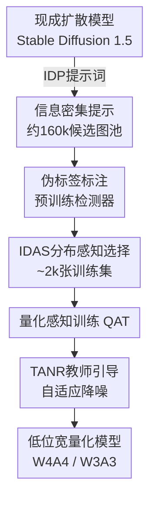

# GoodQ: 利用现成生成模型实现目标检测器的零样本量化

**会议**: ECCV2026  
**arXiv**: [2606.31456](https://arxiv.org/abs/2606.31456)  
**代码**: 待确认  
**领域**: 模型压缩 / 目标检测  
**关键词**: 零样本量化, 目标检测, 扩散模型, 知识蒸馏, 模型压缩

## 一句话总结

GoodQ 利用现成的扩散模型生成多样化训练图像，再通过信息密集提示、固有分布感知选择和教师引导自适应降噪三个组件系统性地解决生成图像与目标检测零样本量化之间的三大挑战，在 W4A4 和 W3A3 等极低位宽下大幅超越此前基于噪声优化的方法。

## 研究背景与动机

量化感知训练 (QAT) 是将检测模型部署到边缘设备的标配技术，它通过在原始训练数据的小子集上微调，把全精度模型压缩到低位宽整数。但现实场景中因隐私法规或商业机密，原始数据往往无法获取——自动驾驶的街景数据、医疗影像中的患者信息都不可二次使用。零样本量化 (ZSQ) 正是为解决这一困境而生：它不依赖真实数据，而是合成代理样本替代原始训练集。

早期 ZSQ 方法在图像分类任务上依赖噪声优化（从高斯噪声开始，反向传播匹配预训练模型的 BN 层统计量），合成样本的多样性有限。近年来 GenQ 和 MixQ 等工作展示了利用现成扩散模型生成多样化图像能大幅改善分类模型的量化质量。然而，直接将这套思路搬到目标检测 (OD) 上会遇到三个独有挑战：第一，分类任务一张图对应一个类别，而 OD 的每张图平均包含近 8 个不同类别的目标——信息密度是任务刚需，分类提示词生成的单物体图像对检测器训练远远不够；第二，OD 数据集的类别分布呈现极度长尾，COCO 中高频类与低频类的包围框比例差距高达 1500 倍，而分类式随机采样生成的图像会严重偏离这种实际分布；第三，生成的图像没有真值标签，必须依靠预训练检测器打伪标签——但伪标签噪声会误导量化微调过程。

本文的核心思路是：合成方法的关键瓶颈不在于数据量，而在于合成数据是否针对以上三个 OD 特有挑战做了系统性的适配。**核心 idea：不改变扩散模型本身，而是通过三个精心设计的组件——信息密集提示（IDP）让每张图含多个类别目标、固有分布感知选择（IDAS）使选出的图像集与真实数据分布对齐、教师引导自适应降噪（TANR）用教师软标签替代硬伪标签——把现成的扩散模型改造成适合目标检测器零样本量化的数据生成管线 GoodQ。**

## 方法详解

### 整体框架

GoodQ 是一条三阶段管线。第一阶段用现成的 Stable Diffusion 1.5 配合信息密集提示生成一个包含 16 万张候选图像的图池。第二阶段通过固有分布感知选择（IDAS）从图池中挑选出约 2000 张与真实 COCO 类别分布最匹配的图像作为训练集。第三阶段在量化感知训练过程中引入教师引导自适应降噪（TANR），用全精度教师的软预测替代伪标签作为优化目标。

### 关键设计

**1. 信息密集提示：让生成图像包含多个共现目标实例**

OD 数据集的核心特征是每张图的高信息密度——COCO 平均每张图 7.7 个包围框。如果直接用分类任务的 GenQ 式提示词（如 "A photo of a car"），生成的每张图只有一个前景目标，检测器在训练时学到的场景共现模式（比如苹果和香蕉常一起出现、人和车共处街景）几乎为零，这严重限制了量化后的检测精度。

IDP 的解决方案非常直接：用模板 `"A {D} photo of {Q} {C1} and {Q} {C2}"`，其中 {D} 是描述性形容词（如 clean, nice），{Q} 是数量形容词（如 multiple, many, several），{C1} 和 {C2} 是随机选取的两个不同类名。每次生成时从 6 个数量词中随机选一个，每轮随机选两个类别，这样生成的图像天然包含多个类别的共现实例。值得注意的是，IDP 的设计思路是"用提示词工程引导扩散模型输出而非改变模型本身"，这带来两个好处：零额外训练成本、且可无缝切换不同的扩散模型骨干。

**2. 固有分布感知选择：在无数据条件下匹配真实类别分布**

OD 数据集的类别长尾分布极为严重——COCO 的头部类（如 person）几乎占三成包围框，而尾部类（如 hair drier）不足 0.02%。如果不对生成图像做筛选，随机采样的训练集会严重偏离这种分布，导致量化模型在高频类上过拟、在低频类上几乎退化。

IDAS 分为两步。第一步是**无数据分布估计**：既然无法访问真实数据，就从预训练检测头的偏置参数中推算类别先验。直观上，检测头的偏置项隐式编码了各类别的出现频率——模型训练中偏置会向高先验类别偏移。具体做法是对每个类别取检测头所有输出通道偏置的均值，然后归一化为目标分布。实验证实该方法与 COCO 真实类别分布的 Pearson 相关系数达到 0.87，证明偏置项确能有效反映分布信息。第二步是**贪婪选择**：在生成图池上执行一个迭代算法——每轮计算当前选中集合的类别分布与目标分布的差距，优先选择"差距最大且候选图像最少"的类别，然后从该类别候选图中挑选包围框数量最多的那张加入集合。这个设计同时保证了分布对齐（缩小 KL 散度）和信息密度（选择框数最多的图）。

**3. 教师引导自适应降噪：用软标签规避伪标签噪声**

用预训练检测器给生成图像打伪标签会不可避免地带入噪声——模型在未见过的场景上预测的包围框可能不准、类别置信度可能偏低。如果将这些硬伪标签直接作为 QAT 的检测损失目标，模型的优化信号会包含大量噪声，尤其低位宽下容易放大这些错误。

TANR 的核心策略是不再依赖伪标签，而是直接让全精度教师模型的软预测充当 ℒ_detect 的目标。具体来说，对于包围框坐标、目标性和类别概率三个分支，TANR 将目标从伪标签的 one-hot 向量替换为教师模型的连续概率分布。在此基础上进一步引入 QFocal 风格的自适应加权：在目标性和类别概率两个分支的损失前乘上一个系数 $|y^{\mathcal{T}} - \hat{y}|^\gamma$，其中 y^T 是教师预测、ŷ 是学生预测。这个系数的直觉是：对于教师和学生分歧大的样本（即量化最易出错、最需要学习的样本），自动加大损失权重；对于教师已经拿得准的样本，减弱约束。这样 QAT 过程会自然聚焦于量化噪声最严重的区域。

### 损失函数 / 训练策略

训练总损失为检测损失 ℒ_detect 和蒸馏损失 ℒ_distill 的加权组合。ℒ_distill 包含预测匹配的 KL 散度和中间特征图 L2 距离两项，从教师向学生传递全精度知识。训练时使用 Adam 优化器，训练 100 个 epoch，蒸馏温度为 4，学习率 0.01（YOLOv5）或 1e-5（YOLOv11）。ℒ_detect 的系数在 YOLOv5 上设为 0.04，YOLOv11 上为 0.01，QFocal 的缩放因子 γ 分别为 1.5 和 2.0。

## 实验关键数据

### 主实验

| 模型 | 位宽 | GoodQ | TSOD (无标注) | LSQ (真实数据) | 优势 |
|------|------|-------|-------------|--------------|------|
| YOLOv5-s | W4A4 | **21.0** / 36.1 | 15.0 / 27.9 | 19.2 / 34.4 | +6.0 mAP vs TSOD† |
| YOLOv5-m | W4A4 | **30.7** / 47.6 | 20.3 / 32.0 | 27.3 / 44.1 | +10.4 mAP vs TSOD† |
| YOLOv5-l | W4A4 | **34.8** / 52.0 | 19.3 / 30.8 | 31.0 / 48.2 | +15.5 mAP vs TSOD† |
| YOLOv11-s | W3A3 | **14.2** / 22.1 | 0.18 / 0.40 | 11.7 / 19.6 | +14.0 mAP vs TSOD† |
| YOLOv11-m | W3A3 | **21.6** / 31.8 | 0.50 / 0.98 | 19.9 / 31.1 | +21.1 mAP vs TSOD† |
| YOLOv11-l | W3A3 | **19.5** / 28.7 | 0.22 / 0.43 | 19.2 / 29.7 | +19.3 mAP vs TSOD† |

注：TSOD† 表示 TSOD 的标签不可用版本（完全零样本，与 GoodQ 相同条件）；LSQ 使用真实数据子集训练（含标签，非零样本条件）。所有方法使用 2000 张训练图像。

### 消融实验

| 配置 | W8A8 (mAP) | W4A4 (mAP) | 说明 |
|------|-----------|-----------|------|
| 扩散 + 随机选择 | 33.5 | 16.0 | 基线：使用 GenQ 分类提示词 |
| +IDP（信息密集提示） | 34.3 | 19.3 | IDP 提升低位宽性能 |
| +IDAS（分布感知选择） | 34.4 | 19.8 | IDAS 也独立有效 |
| +IDP + IDAS | **35.0** | **21.0** | 两者组合效果最佳 |
| 基线损失 | 33.9 | 20.6 | TSOD 的 ℒ_detect + ℒ_distill |
| +TANR | **35.0** | **21.0** | 教师软标签替代硬伪标签 |

### 关键发现

- **多样性是低位宽的关键**：扩散生成的数据比噪声优化数据在 CLIP 嵌入空间中更分散（余弦距离 0.665 vs 0.539），这种多样性在 W3A3 时被进一步放大（0.248 vs 0.133），说明低位宽下数据多样性对维持精度至关重要。
- **分布对齐提升长尾识别**：IDAS 与真实分布的 KL 散度（0.26）远低于随机选择（0.48），直接反映为 W4A4 时 +2 mAP 的增益。简单用"选框数最多的图"的策略反而降低性能（KL 散度高达 1.25），说明数量不等于分布匹配。
- **TANR 对扩散数据更关键**：TANR 给扩散数据带来 ~1 mAP 提升，但对噪声优化数据几乎无影响——因为扩散生成的图像目标置信度分布更分散、伪标签噪声更明显，而噪声优化生成的目标置信度集中，伪标签本身已较可靠。

## 亮点与洞察

- **用偏置权重估计类别分布**是一个巧妙的无数据技巧：在不访问真实数据的情况下，仅从预训练检测头的偏置参数推断类别先验分布，且与真实分布的 Pearson 相关系数达到 0.87。这种方法不依赖于额外的外部知识，具有即插即用性。
- **将生成模型视为数据增强工具而非参数更新对象**是务实的设计选择：GoodQ 不改动扩散模型本身，只通过提示工程和数据筛选来适配 OD 任务，这意味着它可以随时利用更新的生成模型，无需重新训练生成组件。
- **自适应加权与软标签的结合**（TANR）从根本上绕过了伪标签噪声问题——不是去过滤或修正噪声伪标签，而是完全抛弃硬标签，直接用教师输出的连续分布。这使得 QAT 的优化信号天生平滑且具备置信度校准特性。

## 局限与展望

- 当前方法仍依赖 Stable Diffusion 1.5 生成 160k 候选图，再筛选 2k 训练集，生成成本较高。论文在更小图池（2k）上的性能有明显下降（W4A4 ~19.3 vs 21.0），说明 IDAS 的分布对齐优势在充裕候选池中才能充分发挥。
- TANR 引入的 QFocal 自适应加权对 γ 超参敏感，论文在两套 YOLO 骨干上使用了不同 γ 值（1.5 vs 2.0），微调代价未见分析。
- 实验范围集中在 YOLOv5/v11 单阶段检测器上，虽然附录有 Mask R-CNN 结果，但对 Transformer 检测器（DETR 系列）和更极端的部署场景（如手机端 NPU 的 W2A2）尚未验证。

## 相关工作与启发

- **vs GenQ / MixQ**: 这些工作将现成生成模型引入分类 ZSQ，而 GoodQ 将其扩展到目标检测，并系统性地解决了 OD 特有的信息密度、类别分布和伪标签噪声三大挑战。
- **vs TSOD**: TSOD 是 ZSQ-OD 的开创工作，使用噪声优化合成训练集，在 W8A8 性能尚可但低位宽（W4A4/W3A3）严重退化。GoodQ 通过扩散模型的数据多样性 + 三个针对性组件，在完全零样本条件下大幅领先 TSOD。
- **vs ZeroQ / Qimera**: 经典的噪优化 ZSQ 方法，受限于合成数据的多样性瓶颈，在低位宽下表现不佳。GoodQ 用扩散模型线替换噪优化线是本质性的方法论升级。

## 评分

- 新颖性: ⭐⭐⭐⭐⭐ 首次系统性识别并解决 OD 型 ZSQ 的三个挑战，用偏置估计分布是本领域最具工程技巧的设计。
- 实验充分度: ⭐⭐⭐⭐⭐ 覆盖 6 种 YOLO 骨干、跨数据集（COCO/VOC/HomeObjects）、跨生成器（SD1.5/SD2.1）、跨架构（Mask R-CNN），消融完备。
- 写作质量: ⭐⭐⭐⭐⭐ 三挑战-三解决的叙事清晰无冗余，实验分析每段都有因果解释而非纯罗列。
- 价值: ⭐⭐⭐⭐⭐ 直接解决边缘部署中最现实的困境——隐私数据不可用+性能焦虑，管线可直接用于生产环境中的检测器量化。

<!-- RELATED:START -->

## 相关论文

- [\[ECCV 2026\] SMART: When is it Actually Worth Expanding a Speculative Tree?](smart_when_is_it_actually_worth_expanding_a_speculative_tree.md)
- [\[ECCV 2026\] Accelerating Multimodal Large Language Models with Prior-Corrected Token Reduction](accelerating_multimodal_large_language_models_with_prior-corrected_token_reducti.md)
- [\[ECCV 2026\] Spectral Evolution-Guided Token Pruning in Multimodal Large Language Models](spectral_evolution-guided_token_pruning_in_multimodal_large_language_models.md)
- [\[ECCV 2026\] ViQ: Text-Aligned Visual Quantized Representations at Any Resolution](viq_text-aligned_visual_quantized_representations_at_any_resolution.md)
- [\[ECCV 2026\] Paying More Attention to Visual Tokens in Self-Evolving Large Multimodal Models](paying_more_attention_to_visual_tokens_in_self-evolving_large_multimodal_models.md)

<!-- RELATED:END -->
