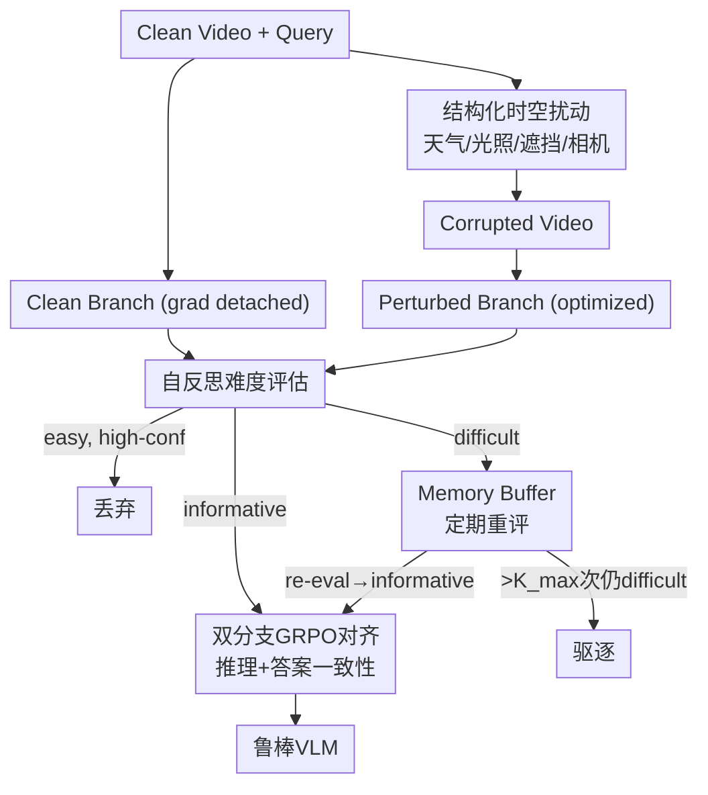

# ROVA: Are Video Reasoning Models Ready to Go Outside?

**会议**: ECCV 2026  
**arXiv**: [2603.10652](https://arxiv.org/abs/2603.10652)  
**项目页**: [https://robust-video-reason.github.io/](https://robust-video-reason.github.io/)  
**领域**: VLM推理 / 鲁棒性  
**关键词**: 视频推理鲁棒性, 扰动鲁棒训练, 自适应课程学习, GRPO, Benchmark

## 一句话总结
ROVA 提出了一套鲁棒视频推理训练框架，通过结构化时空扰动生成、自反思难度感知在线课程、以及基于 GRPO 的双分支对齐来提升 VLM 在真实世界扰动（天气、遮挡、光照、相机抖动）下的推理鲁棒性。同时提出 PVRBench——首个系统性注入真实扰动的具身视频推理 benchmark，覆盖 9K+ 视频和 51K+ 问答对。

## 研究背景与动机

**领域现状**：VLM 在视频理解和推理上进展迅速（Qwen-VL、InternVL、Embodied-R），但主流 benchmark（MVBench、Video-MME）均在干净条件下评估，隐含假设光照稳定、视野无遮挡、相机平滑。

**现有痛点**：真实部署中 VLM 频繁遭遇恶劣天气、动态遮挡、光照剧变和相机抖动。开源模型在此类扰动下准确率下降高达 35%，闭源模型下降 28%。现有鲁棒性方法（随机帧掩码、对抗训练、数据增强）将鲁棒性视为单一目标，忽略了不同扰动类型引发不同的失败模式。

**核心矛盾**：结构化、语义上有意义的视觉扰动（如雨天导致路面反光改变物体外观）与简单像素噪声引发的推理失败模式根本不同——但现有方法从未显式建模这些扰动特定的失败行为。

**本文目标**：(1) 设计能在真实扰动下保持推理鲁棒性的训练框架 ROVA；(2) 构建首个系统性注入真实扰动的视频推理 benchmark PVRBench。

**切入角度**：让模型自己判断每个扰动样本对当前能力的训练价值——easy 丢弃、informative 立即训练、difficult 暂存延迟训练，形成自适应在线课程。

**核心 idea**：结构化时空扰动生成 clean/corrupted 视频对 → 自反思难度感知选择性训练 → 双分支 GRPO 对齐强制输出一致性。

## 方法详解

### 整体框架

ROVA 分三个阶段：先对视频施加四类结构化时空扰动生成 corrupted 版本；然后模型对每个样本进行自反思难度评估；最后通过双分支 GRPO 对齐，强制 clean 和 corrupted 输入下的推理输出一致。

### 关键设计

**1. 结构化时空扰动：从像素噪声到语义扰动**

对每帧 $f_t$，生成风格特定的掩码 $P_t^{(m)} = B_t^{(m)} \odot C_t^{(m)}$（$B$ 为深度感知/随机驱动的二值掩码，$C$ 为连续强度调制），同时随机置换帧序。扰动覆盖四类：天气（雨雾雪，深度感知渲染）、光照（黄昏/夜间/过曝/阴影）、遮挡（静态/动态，前景合理位置）、相机（平移/缩放/旋转）。最终 $V' = \{f_{\pi(t)} \odot P_t^{(m)}\}_{t=1}^T$。

**2. 自反思难度感知在线课程：让模型自己判断学什么**

这是 ROVA 最核心的创新。每个训练迭代，模型对比 clean/corrupted 输出，通过提示模板 $S_e$ 输出难度标签 $d \in \{\text{easy}, \text{difficult}, \text{informative}\}$ 和置信度 $c$。高置信 easy 样本丢弃；difficult 存入 temporal memory buffer $\mathcal{M}$（只存掩码元数据，不存全视频）；informative 和低置信 easy 立即训练。Buffer 中样本被周期性重评，超 $K_{\max}$ 次仍 difficult 的驱逐。形成闭环自适应课程——训练分布随模型能力动态调整。

**3. 双分支 GRPO 对齐：强制 clean/corrupted 输出一致**

Clean 分支梯度 detach 做锚点，corrupted 分支优化对齐。对齐奖励分解为推理一致性 $r^{\text{align, r}}_j = \alpha_r \cdot \text{Sim}^r(o_j, \tilde{o}_j)$ 和答案一致性 $r^{\text{align, a}}_j = \alpha_a \cdot \text{Sim}^a(o_j, \tilde{o}_j)$。总奖励 $R_j = r^F_j + r^{Acc}_j + r^A_j$（格式 + 准确率 + 对齐），通过 GRPO 以组内标准化优势 $A_j$ 优化。损失函数为标准 GRPO 目标：$J(\theta) = \mathbb{E}[\frac{1}{G}\sum(\min(r_j A_j, \text{clip}(r_j, 1-\epsilon, 1+\epsilon)A_j) - \beta D_{KL}(F_\theta\|F_{ref}))]$。

## 实验关键数据

### PVRBench 主结果

ROVA 在 7B 规模上超越了最强开源基线 Embodied-R 达 17%；更大变体（13B/72B）可匹敌或超过 GPT-4o 和 Gemini-3-Pro。相对基线提升至少 24% 准确率和 9% 推理质量。这些提升**也迁移到干净视频**上。

### 推理质量（5 维，0-5 分）

PVRBench 引入 Fragility(↓)、Consistency、Belief、Recovery、Attention 五个推理质量指标，由 GPT-4o 按结构化模板评分。ROVA 在所有维度上均优于基线。

### 训练效率

选择性训练策略（丢弃 easy + 延迟 difficult）过滤了低效用样本，训练效率提升抵消了周期性重评开销。

## 亮点与洞察

- **自反思难度评估是优雅的设计**：让模型自己判断"这个样本对我当前能力是否合适"，避免固定课程的超参数敏感性。memory buffer 的"先学基础、再攻克难题"策略与教育理论中的"最近发展区"概念吻合。
- **Clean 性能也受益**：鲁棒性训练提升了干净数据表现——暗示鲁棒性约束起到正则化作用，防止模型过拟合干净分布中的虚假相关性。
- **PVRBench 的推理质量 5 维评估**是该 benchmark 的核心贡献——使研究者能诊断"失败是因为感知错误还是推理链断裂"。
- **只存掩码元数据而非全视频**是巧妙的工程优化——memory buffer 在几乎不增加存储开销的前提下实现了延迟训练机制。

## 局限与展望

- 扰动类型限于 4 大类 12 种，真实世界扰动空间更大。
- 训练需要成对 clean/corrupted 视频，增加了数据准备成本。
- 自反思评估依赖模型自身能力，训练初期评估可能不准确。
- Memory buffer 大小和重评频率需根据 GPU 显存调整。

## 相关工作与启发

- **vs ImageNet-C**：首次将图像分类的扰动鲁棒性评估范式扩展到视频推理，且扰动是时空连贯的。
- **vs Embodied-R**：在其 GRPO 框架上增加了难度感知课程和扰动特定对齐奖励，可视为鲁棒性增强版。
- **vs Curriculum Learning**：传统课程按固定 easy→hard 调度，ROVA 的模型自适应评估是动态的。

## 评分
- 新颖性: ⭐⭐⭐⭐ (自反思课程+结构化扰动的组合新颖，GRPO 对齐本身非原创)
- 实验充分度: ⭐⭐⭐⭐⭐ (3 个 benchmark + 5 推理指标 + 多模型规模 + 消融)
- 写作质量: ⭐⭐⭐⭐ (motivation 强，方法清晰)
- 价值: ⭐⭐⭐⭐⭐ (真实部署刚需，PVRBench 有潜力成为社区标准)

<!-- RELATED:START -->

## 相关论文

- [\[ECCV 2026\] EgoVITA: Learning to Plan and Verify for Egocentric Video Reasoning](egovita_learning_to_plan_and_verify_for_egocentric_video_reasoning.md)
- [\[ECCV 2026\] VideoSearch-R1: Iterative Video Retrieval and Reasoning via Soft Query Refinement](videosearch-r1_iterative_video_retrieval_and_reasoning_via_soft_query_refinement.md)
- [\[CVPR 2026\] VAST: Video Ability-Stratified Taxonomy for Data-Efficient Video Reasoning](../../CVPR2026/vlm_reasoning/vast_video_ability-stratified_taxonomy_for_data-efficient_video_reasoning.md)
- [\[NeurIPS 2025\] Video-R1: Reinforcing Video Reasoning in MLLMs](../../NeurIPS2025/vlm_reasoning/video-r1_reinforcing_video_reasoning_in_mllms.md)
- [\[CVPR 2026\] Towards Sparse Video Understanding and Reasoning](../../CVPR2026/vlm_reasoning/towards_sparse_video_understanding_and_reasoning.md)

<!-- RELATED:END -->
