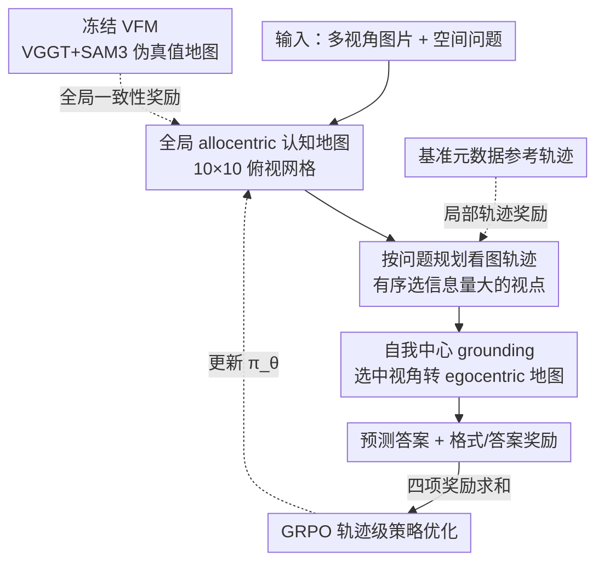

# Dense Reward for Multi-View 3D Reasoning with Global Maps and Local Views

**会议**: ECCV 2026  
**arXiv**: [2606.23557](https://arxiv.org/abs/2606.23557)  
**代码**: [https://github.com/kaist-cvml/dr-mv3d](https://github.com/kaist-cvml/dr-mv3d)  
**领域**: 多模态VLM / LLM推理  
**关键词**: 多视角3D问答, 密集奖励, 认知地图, GRPO, 视觉基础模型

## 一句话总结
针对多视角 3D 视觉问答里 MLLM「只拿最终答案对错做稀疏监督、跨视角推理不一致、视角选择乱跳」的顽疾，本文把任务显式拆成「建全局俯视认知地图 → 按问题规划看图顺序 → 转成自我中心视角作答」三段，用冻结的 3D 视觉基础模型（VGGT+SAM3）生成的几何一致伪地图当全局奖励、用基准元数据推出的参考轨迹当局部奖励，在 GRPO 下做轨迹级优化，让一个 3B 模型在 MindCube 上从 37.8 提到 66.5。

## 研究背景与动机
多视角 3D 视觉问答（MV3D-VQA）要求模型把从不同视点拍到的若干张局部图片，拼成一个连贯的场景理解，再回答诸如「如果我站在图 4 的位置朝同一方向，左转再前进，会离柜子更近吗」这类空间推理问题。这类能力对具身智能、机器人在部分可观测环境下做决策至关重要。然而当前的 MLLM 在这上面普遍很脆：它们常常给出看起来推理链完整、其实视觉上自相矛盾的答案——跨视点的判断前后不一致、遇到遮挡就乱、在需要综合多图证据的组合空间问题上几乎接近随机。近期工作（MindCube 等）发现，光给模型更多视角图片收益有限，真正管用的是让模型先构建一个中间表征（认知地图），再在地图上推理，由此确立了「map-then-reason」范式：认知地图充当一个持久的空间工作区，把碎片化观测组织成场景级结构。

但沿着这条路往下走还有三道坎没迈过去。第一，现有方法几乎只用「以世界为中心」（allocentric）的全局地图，这种地图坐标系稳定、不随相机动而动，但推理问题往往是「以我为中心」（egocentric）的——问的是「从这个视角看某物在我左边还是右边」「假设我朝某方向移动」，全局地图和以自我为参照的推理动态之间存在表征错位。第二，MLLM 自己生成的中间地图几何往往不靠谱，而专门的 3D 视觉基础模型（VFM，如 VGGT）在深度估计、位姿一致性、物体级空间布局重建上能力很强——这暴露出语言驱动的地图生成与几何 grounded 的视觉模型之间存在明显的表征质量差距（论文用一张图证明：VGGT 导出的认知地图比 Qwen2.5-3B 生成的更接近真值）。第三，主流强化学习方案基本只用「最终答案对不对」定义的稀疏奖励，这对学习「空间结构化的推理过程」几乎没有指导——中间哪一步建错了地图、哪一步选错了视角，稀疏信号完全看不见。

本文的核心 idea 是**把 MV3D-VQA 显式重构成一条「全局建图 → 按问题规划看图轨迹 → 自我中心 grounding 作答」的轨迹级策略，并给这条轨迹配上密集、可验证的过程奖励：用冻结 VFM 产出的几何一致伪地图对齐全局认知地图（全局奖励）、用基准元数据推导的参考视角序列监督看图顺序（局部奖励），连同答案与格式奖励一起在 GRPO 下做轨迹级优化**——让「过程对不对」而不只是「答案对不对」变成可学的监督信号。

## 方法详解

### 整体框架
DR-MV3D 把一次多视角问答看成 MLLM（策略 $\pi_\theta$）生成的一条结构化轨迹 $\tau$，整条轨迹经过四个阶段。输入是同一场景不同视点的若干图片 $\mathcal{I}=\{I_1,\dots,I_N\}$ 加一个空间推理问题 $q$，输出是最终答案 $\hat a$；中间会显式吐出三种结构化产物——全局俯视认知地图、看图轨迹、以及每个选中视角对应的自我中心地图。四个阶段依次是：① 从多视角观测建全局 allocentric 认知地图；② 以「全局地图 + 问题」为条件规划一条有序的看图轨迹去采证据；③ 把选中视角的证据转成 egocentric 地图并据此作答；④ 用多级密集奖励在 GRPO 下做策略优化。

训练分两步：先做 SFT 让模型学会这套结构化输出格式（认知地图 / think / 自我中心地图 / 答案四个块串在一条自回归生成流里），再用 GRPO 加密集奖励精调。关键的伪监督信号来自一条离线管线：先用 SAM3 在多视角图上分割出问题相关的显著物体，再用 VGGT 重建场景并注入 2D 分割的语义，最后汇成一张 10×10 网格的 allocentric 俯视认知地图，当作没有人工标注时的「伪真值地图」。

### 关键设计

**1. 全局 allocentric 认知地图 + VFM 几何伪监督：给「乱建地图」找个几何靠谱的老师**

痛点很直接：MLLM 自己脑补的场景地图几何常常是错的，而这一步错了后面全盘皆输，可又没有人工标注的真值地图可用。本文让模型先把多视角观测汇成一张以世界为中心的俯视认知地图 $\mathcal{C}^{\text{allo}}\sim\pi_\theta(\cdot\mid\mathcal{I})$——用 allocentric 是因为世界坐标系不随相机运动而变，能在差异很大的视点间保持几何一致。地图被序列化成轻量 JSON：物体条目记「名字 + 10×10 网格位置（+ 朝向）」，视点条目记「编号 + 位置 + 朝向（up/down/left/right）」，它刻意只捕捉粗粒度布局而非精确 3D 几何，这样既可解释、MLLM 又容易生成。

关键的巧思在于监督信号从哪来：不做人工标注，而是把一个冻结的 3D 视觉基础模型（VGGT+SAM3）产出的几何一致场景当伪真值 $\mathcal{C}^*=\mathrm{VFMs}(\mathcal{I})$，再用结构相似度把预测地图往它上面软对齐：

$$R_{\text{global}}=\mathrm{sim}\left(\mathcal{C}^{\text{allo}},\,\mathcal{C}^*\right)$$

这个 $\mathrm{sim}$ 不追求网格坐标精确对齐，而是拆成方向相似度 $s_{\text{dir}}$（比较两图里各物体对的粗粒度相对方位——左/右/上/下/内外——一致的比例，从而对全局平移不变、对小扰动鲁棒）和朝向相似度 $s_{\text{face}}$（比较各视点的离散朝向标签匹配比例），加权合成 $\mathrm{sim}=\alpha_{\text{sim}}s_{\text{dir}}+(1-\alpha_{\text{sim}})s_{\text{face}}$。这样奖励看重的是「相对空间结构 + 视点朝向」这些对下游推理真正要紧的东西，而不是表面坐标匹配。之所以有效，是因为它把 VFM 强大的几何先验以零人工成本注入了语言模型的建图过程，直接弥合了「语言驱动建图」和「几何 grounded 视觉」之间的质量差距。

**2. 问题条件下的看图轨迹规划 + 局部轨迹奖励：让模型别乱翻图，按需取证**

第二个痛点是视角选择不稳定：模型经常挑错图来核实某个方向，或翻图顺序混乱，导致取证低效、结论站不住。本文让策略以「全局地图 + 问题」为条件，自回归地生成一条有序看图轨迹 $\mathcal{V}=(v_1,\dots,v_T)$，每个视点 $v_t\sim\pi_\theta(\cdot\mid v_{<t},\mathcal{C}^{\text{allo}},q)$，本质是在全局地图上做「以问题为导向」的局部视角选择，优先看信息量大的视点、过滤无关视觉噪声。

为了让这一步可学，本文构造了一个逐步匹配的参考轨迹奖励：参考轨迹 $\mathcal{V}^*$ 直接从基准元数据确定性地推出来——找到最能观测到问题里锚点物体和目标物体的那个视点，据此定序；奖励则是预测轨迹在每一步与参考视点吻合的比例：

$$R_{\text{local}}=\frac{1}{T}\sum_{t=1}^{T}\mathbb{I}[v_t=v_t^*]$$

这比只有最终答案奖励要密集得多，它直接告诉模型「你第几步该看哪张图」，为有序视角规划提供了逐步的信号。有效性在于：视角顺序本身就是多视角推理里最容易崩的一环，把它单独拎出来用步级监督拉住，等于给长程推理里最脆的关节上了夹板。

**3. 自我中心 grounding：把全局地图翻回模型「母语」的视角坐标系再作答**

第三个痛点是表征错位：全局地图是以世界为中心的，但问题问的是「从我这个视角看」，而 MLLM 又主要是在以视角对齐的（egocentric）数据上预训练的，直接在全局坐标系里推「我的左右前后」很容易搞反。本文在轨迹规划之后，把每个选中视角的全局证据转成自我中心地图 $\mathcal{C}^{\text{ego}}_t\sim\pi_\theta(\cdot\mid\mathcal{C}^{\text{allo}},v_t,\mathcal{I},q)$，这一步内部做坐标旋转、空间过滤、参照系对齐，把某物相对当前视点标成 forward / forward-left / back 之类的自我中心方向。最终答案从整条轨迹的自我中心证据序列里解码：$\hat a=\arg\max_a\pi_\theta(a\mid\mathcal{V},\mathcal{C}^{\text{ego}}_{1:T},\mathcal{I},q)$。

之所以这样有效，是因为它把抽象 3D 几何翻译回了模型的「原生表征」——perspective alignment 对视觉空间问题求解至关重要，先在稳定的全局系里建好结构、再翻成自我中心系去回答方向类问题，既保住了跨视角一致性，又贴合模型擅长的推理方式。定性例子里可以看到：baseline 在「转身后我右边是什么」这类问题上跟丢了旋转后的自我中心系而答错，本文顺着预测地图里的 ego_direction 一步步核实就答对了。

### 损失函数 / 训练策略
整条轨迹的密集奖励是四项加权和，每一项监督流水线的一个阶段：

$$R(\tau)=\lambda_g R_{\text{global}}+\lambda_l R_{\text{local}}+\lambda_a R_{\text{ans}}+\lambda_f R_{\text{fmt}}$$

其中 $R_{\text{ans}}=\mathbb{I}[\hat a=a^*]$ 是答案正确性（终端项，直接对齐任务目标），$R_{\text{fmt}}=\mathbb{I}[\hat a\in\mathcal{A}_{\text{valid}}]$ 约束输出格式合法，$R_{\text{global}}$ 和 $R_{\text{local}}$ 提供地图质量与轨迹质量的中间监督。优化用 GRPO：对每个输入采一组 $K$ 条轨迹，用组内标准化的相对优势 $A_i=(R(\tau_i)-\bar R)/(\sqrt{\frac1K\sum_j(R(\tau_j)-\bar R)^2}+\xi)$ 代替单独的 value/critic 网络，配 PPO 式裁剪比率和对参考策略的 KL 正则做梯度上升。工程上基于 Qwen2.5-VL-3B-Instruct，最大序列长 8192 以容纳多视角图 + 指令 + 中间推理 + 答案，SFT 阶段用官方 MindCube 代码库、GRPO 阶段用 verl 框架。

## 实验关键数据

### 主实验
三个基准：MindCube（视角依赖的 3D 空间推理与方向一致性）、VSI-Bench（具身路径规划与组合空间关系）、BLINK-MV（分布式多视角多模态推理）。骨干统一是 Qwen2.5-VL-3B。

| 数据集 | 指标 | 本文(SFT+GRPO) | Qwen2.5-VL-3B 基线 | 提升 |
|--------|------|------|----------|------|
| MindCube-Tiny | Overall Acc | 66.5 | 37.8 | +28.7 |
| MindCube-Tiny | Among | 71.3 | 36.0 | +35.3 |
| MindCube-Tiny | Around | 73.6 | 45.2 | +28.4 |
| VSI-Bench | Avg | 37.1 | 30.4 | +6.7 |
| BLINK (MV) | Acc | 56.4 | 42.1 | +14.3 |

在 MindCube 上，本文 3B 模型 66.5 的 Overall 超过所有开源多图模型，也超过同骨干家族的先前建图方法（MindCube-CGMap-SFT 54.4、MindCube-CGMap-FFR-RL 53.7）；提升集中在需要组合多视角推理的 Among / Around 两类。BLINK-MV 上 56.4 甚至超过更大的 RoBoBrain（7B，55.6）、匹配 Spatial-MLLM（56.0），且都是同一 3B 骨干取得——说明增益来自监督信号而非模型规模。

### 消融实验
SFT 阶段各中间监督组件（表 4，MindCube Overall）：

| 配置 | Overall | 说明 |
|------|---------|------|
| Vanilla（无 SFT） | 37.8 | 直接 prompt |
| 仅 allocentric 地图 | 52.8 | 单组件 |
| 仅 egocentric 地图 | 52.2 | 单组件 |
| 仅轨迹 | 58.2 | 单组件里最强 |
| allo + ego 双地图 | 53.6 | 两图互补但不够 |
| 全部（allo+traj+ego） | 62.4 | 联合最优 |

GRPO 阶段奖励设计（表 5，从已能出合法答案的 SFT 模型起步）：

| 配置 | Overall | 说明 |
|------|---------|------|
| 仅 answer+format | 63.8 | 稀疏基线 |
| + global 奖励 | 64.9 | 加建图一致性 +1.1 |
| + global + local | 66.5 | 再加轨迹监督 +1.6 |

### 关键发现
- 单看 SFT 组件，「轨迹监督」单独就到 58.2，是最强的单组件，说明「按什么顺序看图」这一步对 MindCube 这种视角依赖任务贡献极大；但要拿到最好的 62.4 必须联合全局结构 + 步级信号，单靠某一个中间目标不够。
- GRPO 阶段两项密集奖励是逐步叠加见效（63.8 → 64.9 → 66.5），印证「答案级优化捕捉不全多步空间推理质量，密集中间奖励提供互补增益」。
- 增益能迁移到 VSI-Bench 这种序列路径规划评测（需要跨时间维持一致的自我中心系），说明密集奖励训练不止管单轮 QA。

## 亮点与洞察
- 用「冻结 VFM 当伪真值地图老师」这一手最巧妙：它把 VGGT+SAM3 的几何一致性以零人工标注成本注入语言模型的建图过程，且相似度只比相对结构、不比绝对坐标，对平移不变、对扰动鲁棒——这套「几何模型给语言模型当结构先验」的思路可以迁移到任何需要空间 grounding 的 MLLM 任务。
- 把「视角选择顺序」单独抽成一个可验证的局部轨迹奖励，是对多视角推理最脆关节的精准打击；参考轨迹还能从基准元数据确定性推出、无需额外标注，工程上很务实。
- allocentric 建图 + egocentric grounding 的「两套坐标系分工」是一个清晰的洞察：稳定系里建结构、母语系里答方向，既保跨视角一致又贴合模型预训练分布——这个 insight 对任何做视角依赖空间推理的模型都有参考价值。

## 局限与展望
- 作者承认本工作只针对静态场景，扩到动态环境（视频、4D）会因时间对应、运动、场景变化而困难，虽然框架可通过定义时间感知的一致性/探索奖励自然推广。
- 另一方向是多轮空间推理：带记忆更新的迭代查询与长程规划有望支持更精细的组合式 3D 推断。
- 自己发现的局限：局部轨迹奖励依赖基准元数据推参考轨迹，换到没有这类结构化元数据的开放场景可能失效；全局奖励的质量上限被 VGGT+SAM3 的重建质量卡死，遮挡严重或纹理稀疏时伪真值本身可能不准，却仍被当老师去对齐。
- 表 1 里带 Anno.（用真值中间标注）和不带的差距明显（62.4 vs 53.6 / 66.5 vs 57.7），说明方法对中间标注仍有相当依赖，「w/o Anno.」版本才是更接近实用的设定。

## 相关工作与启发
- **vs MindCube / CGMap 系列**: 他们也走 map-then-reason、也用认知地图，但监督是答案级稀疏信号或依赖任务特定的中间标注；本文换成 VFM 伪监督的全局奖励 + 参考轨迹的局部奖励，直接塑造多步推理过程，同骨干下 66.5 vs 54.4/53.7 明显更高。
- **vs R1-VL / Visual-RFT 等 verifiable-reward RL**: 他们把可验证奖励带进视觉语言推理，但主要面向单视角 2D 设定，不显式强制部分可观测下的跨视角空间一致性；本文的贡献正是补上这块——全局奖励管跨视角场景一致、局部奖励管信息量大的视角选择。
- **vs 几何蒸馏类方法（3DRS / 几何蒸馏 VLM）**: 他们把几何先验蒸进静态特征表征；本文不动特征、而是把 VFM 几何信号变成过程奖励去监督多步推理本身，粒度更细、更贴近「推理过程哪步错了」。

## 评分
- 新颖性: ⭐⭐⭐⭐☆ 「VFM 伪真值当全局奖励 + 参考轨迹当局部奖励」的密集过程监督组合在多视角 3D 推理上是新的，但每个零件（认知地图、GRPO、verifiable reward）都有前作。
- 实验充分度: ⭐⭐⭐⭐☆ 三基准 + SFT/GRPO 双阶段消融齐全，带/不带标注对比诚实；但主要在 3B 单骨干上验证，缺更大模型的 scaling 证据。
- 写作质量: ⭐⭐⭐⭐☆ 三大挑战对应三大设计的结构清晰，图 1/2 直观；公式偏密，部分相似度细节压在补充材料里。
- 价值: ⭐⭐⭐⭐☆ 让 3B 模型在多视角空间推理上超过 7B 模型，「几何模型给语言模型当过程老师」的范式对具身/空间智能有实际借鉴意义。

<!-- RELATED:START -->

## 相关论文

- [\[CVPR 2026\] Think with 3D: Geometric Imagination Grounded Spatial Reasoning from Limited Views](../../CVPR2026/vlm_reasoning/think_with_3d_geometric_imagination_grounded_spatial_reasoning_from_limited_view.md)
- [\[CVPR 2026\] STAR-R1: Multi-View Spatial TrAnsformation Reasoning by Reinforcing Multimodal LLMs](../../CVPR2026/vlm_reasoning/star-r1_multi-view_spatial_transformation_reasoning_by_reinforcing_multimodal_ll.md)
- [\[ICLR 2026\] Spatial Reasoning with Vision-Language Models in Ego-Centric Multi-View Scenes](../../ICLR2026/vlm_reasoning/spatial_reasoning_with_vision-language_models_in_ego-centric_multi-view_scenes.md)
- [\[ICLR 2026\] MindCube: Spatial Mental Modeling from Limited Views](../../ICLR2026/vlm_reasoning/mindcube_spatial_mental_modeling_from_limited_views.md)
- [\[CVPR 2026\] ReasonMap: Towards Fine-Grained Visual Reasoning from Transit Maps](../../CVPR2026/vlm_reasoning/reasonmap_towards_fine-grained_visual_reasoning_from_transit_maps.md)

<!-- RELATED:END -->
