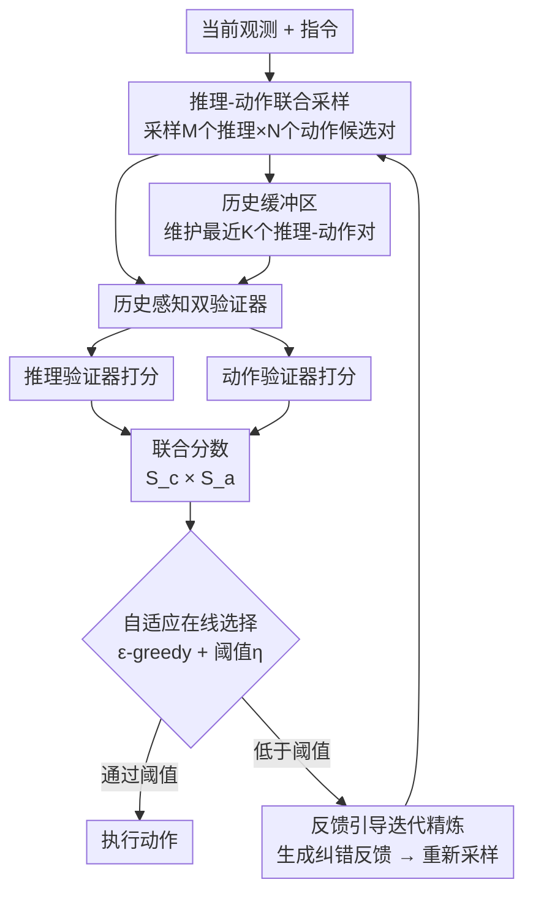

# E-TTS: A New Embodied Test-Time Scaling Framework for Robotic Manipulation

**会议**: ECCV 2026  
**arXiv**: [2606.27268](https://arxiv.org/abs/2606.27268)  
**项目**: [https://27yw.github.io/E-TTS-Web/](https://27yw.github.io/E-TTS-Web/)  
**代码**: 无  
**领域**: 机器人 / 具身智能  
**关键词**: 测试时缩放, 具身智能, VLA模型, 推理-动作联合采样, 闭环迭代精炼

## 一句话总结
E-TTS 是一个即插即用的具身测试时缩放框架，在推理时对 VLA 模型的推理过程和动作进行联合采样、历史感知验证和反馈引导迭代精炼，无需额外训练或数据即可将多种基座模型在仿真和真实场景中的成功率最高提升 33.14%。

## 研究背景与动机
测试时缩放（Test-Time Scaling, TTS）在 NLP 和 CV 领域已经证明可以在不增加训练数据的前提下，通过投入更多推理计算换取更高质量的输出。这一优势对具身领域尤其有吸引力，因为真实机器人数据的采集成本远高于互联网图文数据。对于大量延迟不敏感的具身任务（如物体重排），用推理计算换成功率是合理的方向。然而，直接将现有 TTS 方法搬进具身领域会遭遇两个根本性的挑战。

第一个挑战是推理与动作的错位。当前先进的 VLA 模型普遍在输出动作前先产生中间推理（如子任务分解、场景理解、空间推理），但现有 TTS 方法只对动作候选做重复采样和筛选，完全忽略了推理质量对下游动作的影响——一个更好的推理很可能产出更好的动作，但单纯的动作缩放在推理走偏时无能为力。第二个挑战是历史信息的缺失。具身任务是典型的长周期序贯决策过程，当前动作是否合理不仅取决于当下观测，还与历史轨迹高度相关；而现有 TTS 方法基于单步观测做评分，缺乏对历史上下文的利用，也难以在犯错后通过反馈自我纠正。

核心 idea：将推理和动作纳入同一个联合缩放框架——对「推理-动作」对进行配对采样和联合打分，同时引入历史缓冲区和反馈引导的闭环迭代精炼，使 TTS 能够感知时间依赖并自主纠正错误。

## 方法详解

### 整体框架
E-TTS 在每个时间步接收任务指令和当前观测后，依次经历三个阶段：**推理-动作联合采样**（从基座 VLA 模型采样多个推理-动作候选对并存入历史缓冲区）、**历史感知双验证器评分**（推理验证器和动作验证器各自独立打分后乘出联合分数）、**自适应在线选择与反馈迭代精炼**（用 epsilon-greedy 策略选出最佳候选，低于置信阈值则生成反馈重新采样）。三个模块均为可选、可独立配置的即插即用组件，可根据任务复杂度和基座模型自由组合。

### 关键设计

**1. 推理-动作联合采样与打分：解决「推理好不等于动作好」的错位问题**

现有 TTS 方法只缩放动作空间，但具身任务中推理输出（子任务分解、空间感知、场景理解）直接决定动作的质量。E-TTS 的核心创新是将两者配对：在每个时间步，基座 VLA 模型 $\pi_\theta(c_t, a_t \mid O_t, I)$ 先采样 $M$ 个推理候选 $c_t^i$，再对每个推理候选采样 $N$ 个动作 $a_t^{i,j}$，形成 $M \times N$ 个联合候选对 $J_t^{i,j} = (c_t^i, a_t^{i,j})$。采样结果存入历史缓冲区 $\mathcal{H}_t = \{J_{t-K}, O_{t-K}, \ldots, J_{t-1}, O_{t-1}\}$，以滑动窗口保留最近 $K$ 个推理-动作对。

打分使用联合分数 $S_t^{i,j} = S_c^{i,j} \times \hat{S}_a^{i,j}$，其中 $S_c^{i,j}$ 是推理验证器给出的置信度，$\hat{S}_a^{i,j}$ 是归一化后的动作分数。论文从 Bayes 公式出发给出乘性形式的数学依据：$P(Y=1 \mid c, a) \propto P(Y=1 \mid c) \cdot P(a \mid c, Y=1)$，即任务成功概率正比于「推理质量和动作在成功条件下的似然」的乘积。因此，只有推理合理且动作可执行的候选对才能获得高分，避免了「好的推理配上烂动作」或「烂推理偶然产出好动作」的误选。

**2. 历史感知的双验证器：让时序依赖进入评分**

推理验证器 $V_c$ 使用 Qwen2.5-VL-7B 以零样本方式评估推理候选的有效性、连贯性和场景接地性。针对不同类型推理设计了差异化处理：**文本推理**（如 Embodied-R1 的 `<think>` 痕迹）通过上下文嵌入评估逻辑一致性和任务相关性；**多模态推理**（如 E-CoT 的目标检测+子任务分解）将视觉感知结果渲染为图像视觉提示，与文本理解一同输入验证器以评估跨模态一致性；**空间推理**（如 MolmoAct 的轨迹关键点）将关键点叠加到观测图像上，辅助验证器判断空间规划是否物理可行。

动作验证器 $V_a$ 使用 LLaVA-7B 并在 90k 条对比演示数据上训练，采用改进的 Bradley-Terry 目标函数学习区分不同质量的动作。训练数据通过对比采样动作与真值动作的 MSE 差异自动标注偏好标签，包含成功和失败 rollout，确保验证器能感知动作可行性。动作空间按 RT-2 方式离散化为 256 个 bin。

两个验证器在推理时都接收历史缓冲区 $\mathcal{H}_t$ 作为输入，使得评分过程能感知时间依赖——例如，当前是否在重复之前失败的抓取、是否与上一步的推理一致等。

**3. 自适应在线选择与反馈引导迭代精炼：在探索与利用之间动态平衡，并自主纠错**

选择策略使用 epsilon-greedy 机制：以概率 $\epsilon$ 随机选择一个候选对（探索），否则贪心选择联合分数最高的候选（利用）。选出的候选需通过置信阈值 $\eta$ 检验：若 $S_t^{i,j^*} > \eta$，执行该动作；否则触发反馈引导迭代精炼——推理验证器被重新调用以分析失败样本的缺陷，生成结构化文本反馈 $F_t^i$，将反馈拼接到原始指令上形成更新提示 $I_t^{i+1} = \text{Concat}(I, F_t^i)$，通知下一轮联合采样。如此循环，直到找到高分候选或用尽 $M$ 个推理批次上限。

这一闭环精炼是 E-TTS 区别于传统开环 TTS 的关键：传统方法发现分数低只能扔掉重采，E-TTS 会告诉模型「为什么低、该往哪改」，利用 VLM 的预训练知识指导后续采样方向，显著减少无效探索。实验中观察到自主纠错行为——例如抓取失败后，模型在反馈引导下重新调整推理和动作，最终成功完成任务。

### 一个完整示例

以「把勺子放到毛巾上」任务为例，在第 10 个时间步的迭代精炼过程：

- **批次 10-1**：推理分数 0.1754，动作奖励 0.4385，联合分数 0.0769。反馈：机器人朝勺子移动但选错了勺子，应区分毛巾附近的正确勺子。
- **批次 10-2**：推理分数 0.0608，动作奖励 0.2494，联合分数 0.0152。反馈：机器人未对齐夹爪，应调整夹爪位置改善抓取。
- **批次 10-3**：推理分数 0.1296，动作奖励 0.3972，联合分数 0.0515。反馈：夹爪仍未对齐，继续强化位置修正。
- **批次 10-4**：推理分数 0.5883，动作奖励 0.3403，联合分数 0.2002，通过阈值，执行动作并进入下一时间步。

四轮迭代中，联合分数从 0.0152 逐步升至 0.2002，展示了反馈引导如何使模型逐步纠正感知错误（识别正确物体→对齐夹爪→执行抓取）。

### 损失函数 / 训练策略

E-TTS 框架本身不需要训练基座 VLA 模型。仅有动作验证器 $V_a$ 需要训练：使用 LLaVA-7B 为骨干，替换最后的 unembedding 层为标量奖励头，在 90k 对包含成功/失败 rollout 的偏好数据上训练。训练采用改进的 Bradley-Terry 目标函数，纳入分级偏好水平以增强对不同质量动作的敏感性。训练数据仅使用与基座 VLA 相同的分布，严格排除所有评估环境和测试任务。

## 实验关键数据

### 主实验

E-TTS 在 4 个基座模型（E-CoT, MolmoAct, $\pi_{0.5}$, Embodied-R1）、6 个环境（SIMPLER WidowX, SIMPLER Google Robot, LIBERO, LIBERO-Plus, VLABench, 真实世界）、3 种机器人形态上进行了全面验证。

| 基座模型 | 环境 | 基线 SR | +E-TTS SR | 提升 |
|----------|------|---------|-----------|------|
| E-CoT | SIMPLER WidowX | 6.67% | 39.81% | +33.14% |
| MolmoAct | SIMPLER Google Robot (Visual) | 71.05% | 80.00% | +8.95% |
| MolmoAct | SIMPLER Google Robot (Variant) | 65.68% | 77.77% | +12.09% |
| MolmoAct | LIBERO (4 suites avg) | 85.57% | 90.78% | +5.21% |
| MolmoAct | LIBERO-Plus (4 categories avg) | ~85.3% | ~87.2% | +1.9% |
| $\pi_{0.5}$ | VLABench (avg 12 tasks) | ~19.5%* | ~21.5%* | +2.0% |
| Embodied-R1 | SIMPLER WidowX | 39.82% | 44.90% | +5.08% |
| MolmoAct-FT | 真实世界（4 tasks） | 22.13% | 48.75% | +26.62% |

*注：VLABench 数据为多 track 多任务均值，以原文完整表为准。

与 RoboMonkey 对比（均基于 E-CoT，SIMPLER WidowX）：E-TTS 平均成功率 39.81% vs RoboMonkey 26.38%，相对提升 50.91%，而推理延迟仅增加 7.8%（13.43s vs 12.46s）。

### 消融实验

以下消融实验均在 SIMPLER WidowX 环境上以 E-CoT 为基座模型进行（完整配置：10 推理采样，20 动作采样/批，20 批次上限，$\epsilon=0.1$，$\eta=0.4$，$K=3$）。

| 配置 | Spoon on Towel | Eggplant in Basket | Carrot on Plate | 平均 | 说明 |
|------|:---:|:---:|:---:|:---:|------|
| Full E-TTS | 58.33% | 22.22% | 38.89% | 39.81% | 完整模型 |
| w/o feedback | 50.00% | 11.50% | 13.63% | 25.04% | 去掉反馈精炼，掉点 14.77% |
| w/o reasoning scaling | 50.00% | 4.17% | 25.00% | 26.39% | 只缩放动作，掉点 13.42% |
| w/o action scaling | 45.83% | 16.67% | 29.17% | 30.56% | 只缩放推理，掉点 9.25% |
| w/o joint scoring | 42.85% | 18.75% | 31.80% | 31.13% | 分步打分（先推理后动作），掉点 8.68% |
| w/o history buffer | 54.17% | 20.83% | 20.83% | 31.94% | 去掉历史缓冲区，掉点 7.87% |
| w/o $\epsilon$-greedy | 50.00% | 20.83% | 37.50% | 36.11% | 纯贪心选择，掉点 3.70% |

消融结果表明：反馈精炼和推理缩放是贡献最大的两个组件（分别掉 14.77% 和 13.42%），历史缓冲区和联合打分同样重要（各掉约 8%），epsilon-greedy 探索贡献相对较小但有助于避免局部最优。

| 超参数 | 取值 | 成功率 | 说明 |
|--------|------|:---:|------|
| 历史窗口 $K$ | 1 / 3 / 5 / 10 / 20 | 37.5% / 33.3% / 45.8% / 58.3% / 45.8% | $K=10$ 最优，过长反而降 |
| 阈值 $\eta$ | 0.1 / 0.2 / 0.3 / 0.4 / 0.5 | 70.8% / 45.8% / 50.0% / 37.5% / 33.3% | $\eta=0.1$ 最宽松，但可能选入低质候选；原文推荐 $\eta=0.4$ 结合反馈精炼取得最佳效果 |
| 探索率 $\epsilon$ | 0.1 / 0.2 / 0.3 / 0.5 / 0.7 | 54.2% / 50.0% / 37.5% / 37.5% / 33.3% | 小探索率最佳，过大探索浪费计算预算 |

### 关键发现
- **推理缩放和动作缩放缺一不可**：在固定 60 步采样预算下测试了 5 种推理/动作分配比例，1:1 比例取得峰值性能——过度偏重任一方都会导致次优，说明两者的联合缩放对具身 TTS 不可或缺。
- **推理-动作采样量存在最优区间**：在 10/20 和 100/100 之间，20/20 采样达到 Swin on Towel 59.1% 的最高值，但继续增大到 100/100 时性能仅小幅提升至 62.5%，延迟却从 14.77s 升至 20.22s，边际收益递减。
- **真实世界表现出乎意料**：在 4 个真实任务（涵盖刚体、柔性物体、长周期操作）中平均提升 26.62%，并观察到自发纠错行为——抓取失败后自主重试，该行为未经训练。

## 亮点与洞察
- **「推理-动作配对」作为缩放单元**：将推理和动作捆绑为不可分割的联合单元进行采样和打分，是具身 TTS 设计中一个简洁而关键的洞察——它从根本上解决了「推理好动作烂」或「推理烂动作偶然好」的评价歧义。这种思路可迁移到任何需要多步推理+执行的任务中，如代码生成中的「计划-代码」对、数学推理中的「思路-解答」对。
- **用 VLM 做零样本推理验证器，省钱且泛化**：没有训练专用的推理打分模型，直接复用 Qwen2.5-VL-7B 作为零样本验证器，对不同类型推理（文本/多模态/空间）配以相应提示策略即可工作。这种「大模型当裁判」的思路避免了针对每种推理格式重新训练验证器的成本，且让验证器能借助预训练知识理解从未见过的错误模式。
- **闭环反馈是最核心的差异化设计**：与 RoboMonkey 对比时，E-TTS 用仅 7.8% 的额外延迟换来了 50.91% 的相对提升，关键在于反馈精炼让每次采样失败都在「教」下一轮怎么改，而不是单纯靠数量堆——这个设计对计算预算有限的场景尤为重要。

## 局限与展望
- **延迟仍是硬约束**：测试时缩放本质上用计算换性能，E-TTS 虽然通过 vLLM、PagedAttention 和 prefix-sharing 做了工程优化，但每步推理延迟仍然从 8.35s 增至 14.77s（最优配置），限制了其在高动态任务（如高速移动物体抓取）中的应用。论文承认这一局限，未来方向是更轻量的验证器蒸馏或异步推理。
- **动作验证器需要训练**：虽然推理验证器是零样本的，但动作验证器仍需在偏好数据上训练，且训练数据覆盖的场景分布可能限制其对 OOD 动作的评分准确性。如果基座 VLA 部署到全新环境，动作验证器可能需要微调。
- **超参数较多且敏感**：$M$（推理采样数）、$N$（动作采样数）、$K$（历史窗口）、$\epsilon$（探索率）、$\eta$（置信阈值）的调优对最终性能影响显著（如 $\eta$ 从 0.1 到 0.5，成功率从 70.8% 骤降至 33.3%），实践中可能需要针对新任务做 grid search。

## 相关工作与启发
- **vs RoboMonkey**：RoboMonkey 只缩放动作空间，用 reward model 筛选候选动作；E-TTS 在动作缩放之外加入推理缩放、历史缓冲区和反馈精炼，在 SimplerEnv 上相对提升 50.91% 而延迟仅增 7.8%，证明了推理-动作联合缩放的价值。但 RoboMonkey 的动作验证器设计更精细（拟合高斯分布重采样），未来可考虑将两者结合。
- **vs RoVer**：RoVer 为 VLA 设计 process reward model 打分动作；E-TTS 的差异在于（1）不仅打动作，也打推理；（2）有历史缓冲区和反馈闭环；（3）即插即用，不绑定特定 VLA。本质上 E-TTS 是在 RoVer 的上层抽象，把单验证器扩展为推理+动作双验证器+反馈闭环。
- **vs Hume**：Hume 用双系统框架+value head 做重复采样和级联去噪；E-TTS 的核心差异在于引入推理缩放和反馈精炼。两者互补：Hume 的动作级 refinement 可以与 E-TTS 的推理级缩放叠加。

## 评分
- 新颖性: ⭐⭐⭐⭐ 将 TTS 从「动作缩放」扩展到「推理-动作联合缩放」并引入历史感知和反馈闭环，贡献了一个完整的具身 TTS 范式，而非对已有方法的修修补补
- 实验充分度: ⭐⭐⭐⭐⭐ 4 模型 × 6 环境 × 3 形态 × 真实世界 + 5 项消融 + 超参数扫描 + 效率对比 + 定性可视化，实验量远超顶会平均水准
- 写作质量: ⭐⭐⭐⭐ 结构清晰，方法到实验的论证链条完整，伪代码和附录详实；但主表归一化不足（不同基座/环境/任务无法合并成一个统一表格），部分结果仅放附录
- 价值: ⭐⭐⭐⭐ 即插即用 + 无需重训 + 一致提升 4 个基座模型，实用性和泛化性都很好；对具身 TTS 方向有较强的 push 作用，但诊断性分析偏弱（如「为什么推理验证器需要是 VLM 而非文本 LLM」未充分消融）

<!-- RELATED:START -->

## 相关论文

- [\[ECCV 2026\] On Test-Time Scaling for Vision-Language Models](on_test-time_scaling_for_vision-language_models.md)
- [\[CVPR 2026\] Scaling Test-Time Robustness of Vision-Language Models via Self-Critical Inference Framework](../../CVPR2026/vlm_reasoning/scaling_test-time_robustness_of_vision-language_models_via_self-critical_inferen.md)
- [\[CVPR 2026\] dMLLM-TTS: Self-Verified and Efficient Test-Time Scaling for Diffusion Multi-Modal Large Language Models](../../CVPR2026/vlm_reasoning/dmllm-tts_self-verified_and_efficient_test-time_scaling_for_diffusion_multi-moda.md)
- [\[ECCV 2026\] GAIA: A Data Flywheel System for Training GUI Test-Time Scaling Critic Models](gaia_a_data_flywheel_system_for_training_gui_test-time_scaling_critic_models.md)
- [\[CVPR 2026\] UniT: Unified Multimodal Chain-of-Thought Test-time Scaling](../../CVPR2026/vlm_reasoning/unit_unified_multimodal_chain-of-thought_test-time_scaling.md)

<!-- RELATED:END -->
