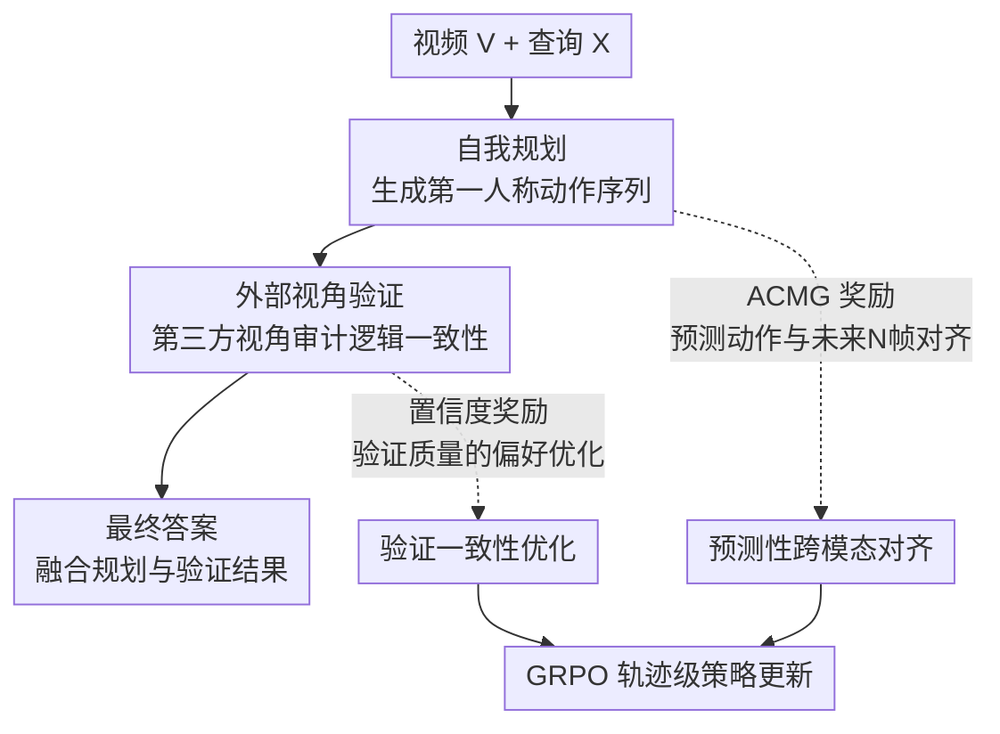

# EgoVITA: Learning to Plan and Verify for Egocentric Video Reasoning

**会议**: ECCV 2026  
**arXiv**: [2511.18242](https://arxiv.org/abs/2511.18242)  
**项目页**: [https://people-robots.github.io/EgoVITA/](https://people-robots.github.io/EgoVITA/)  
**代码**: 无  
**领域**: 视频理解 / 多模态VLM  
**关键词**: 第一人称视频推理, 计划-验证框架, 跨视角对齐, GRPO, 密集奖励

## 一句话总结
EgoVITA 将第一人称视频推理显式分解为"自我规划 + 外部视角验证"两阶段推理，用 GRPO 强化学习配合两个密集奖励信号（ACMG 预测性跨模态对齐 + 置信度验证偏好优化）训练，在仅 52k 样本下 EgoBlind 超 Qwen2.5-VL-7B +7.7 点，同时外部视角视频理解性能零退化。

## 研究背景与动机
第一人称（egocentric）视频理解在生活日志、辅助技术和个人记忆助手等应用中至关重要，但固有的连续相机运动、部分可观测性和频繁遮挡使得程序性推理极为困难。当前 MLLM 在这一场景下常产生看似合理但视觉不一致或弱依据的回答——它们缺乏显式机制来验证第一人称预测是否符合场景的真实物理约束。例如，模型可能声称"接下来把盘子放进橱柜"，但视频中从头到尾没有出现橱柜。

这种失败的核心矛盾在于：第一人称规划（如"伸手够杯子"）需要从外部视角验证其物理可行性（如"杯子确实在够得到的台面上"），但配对的第一人称-外部视角双路视频（ego-exo pair）极其稀缺。现有方法要么用 SFT 在 egocentric 数据上微调导致外部视角性能崩溃（灾难性遗忘），要么像 EgoThinker 那样用大规模稀疏奖励 RL（约 5M 样本）但外中心性能仍大幅退化（DocVQA -10.5），因为稀疏的格式和答案正确性奖励无法为中间推理步骤提供充分监督。

本文的切入角度是：既然 MLLM 已被证明具有跨视角推理能力（能将第一人称画面重新解读为第三人称描述），那就可以将验证内化——让同一模型同时扮演"第一人称规划者"和"第三人称审计者"两个角色，不需要外部 exocentric 视频输入。核心 idea：**将第一人称视频推理显式拆分为"计划-验证"两步推理轨迹，通过两个密集奖励信号分别鼓励预测动作与未来视觉帧的对齐（ACMG）和验证推理的一致性（置信度奖励），在 GRPO 框架下做轨迹级策略优化，同时用轻量外中心正则化防止遗忘。**

## 方法详解

### 整体框架
EgoVITA 将第一人称视频推理建模为序列决策问题：给定视频 $V$ 和文本提示 $X$，MLLM 作为策略 $\pi_\theta$ 自回归生成一条结构化的推理轨迹 $Y = (Y^{\text{plan}}, Y^{\text{verify}}, Y^{\text{ans}})$，分别对应自我规划（预测第一人称动作序列）、外部视角验证（第三方视角审计该序列的时空与逻辑一致性）和最终答案三个连续段落。训练分两阶段：Stage I 用 SFT 初始化"计划-验证"推理结构；Stage II 用 GRPO 做轨迹级策略优化，对每个输入采样 $k=8$ 条候选轨迹，根据组内相对奖励更新策略，奖励函数包含四个分量——格式、答案正确性、ACMG 跨模态对齐和置信度验证一致性。框架图如下：

### 关键设计

**1. 推理分解：将第一人称推理拆为 Plan-then-Verify 双阶段**

当前 MLLM 在第一人称视频上推理失败的根本原因不是视觉信息不足，而是缺少中间验证环节——第一人称规划需要被第三方视角审计才能判断其物理合理性。EgoVITA 将推理轨迹显式拆成两段：$Y^{\text{plan}}$ 生成时序动作子句序列 $\{c_1, c_2, \dots, c_K\}$，描述相机佩戴者的预期行为（如"1. 走向水槽 2. 打开水龙头 3. 冲洗盘子"）；$Y^{\text{verify}}$ 将同一视频以第三人称重新解读，逐一审计每个动作是否与场景布局、物体可供性和可观测上下文一致（如"水槽在第 5-20 帧清晰可见，水龙头在够得到的范围内，计划合理"）。这种解耦不依赖配对的 ego-exo 视频——外部视角验证直接操作在第一人称视频上，仅切换推理视角，从"我在做什么"变成"这个人在做什么"。最终答案 $Y^{\text{ans}}$ 同时以第一人称程序性推理和第三人称审计为依据，比单视角直接回答更可靠。两个阶段各司其职：规划阶段专精第一人称过程推理，验证阶段保留通用第三人称推理能力，从而缓解了专业化与泛化之间的张力。

**2. ACMG 密集奖励：预测性跨模态对齐**

稀疏的格式奖励和答案正确性奖励只能评判最终输出，无法为中间的规划和验证步骤提供细粒度反馈。ACMG（Anticipatory Cross-Modal Grounding）是一个密集奖励信号，衡量规划中每个动作子句与后续视觉观察之间的跨模态对齐程度。具体做法：对每个动作子句 $c_i$，从 MLLM 语言解码器提取其最后隐状态 $h_i^{\text{text}}$，经一个轻量可训练 MLP（Anticipation Head，两层线性 + GELU + LayerNorm）投影到视觉嵌入空间，得到预测的未来视觉嵌入 $\hat{v}_i = \text{MLP}(h_i^{\text{text}})$。取未来 $N=16$ 帧的真实视觉嵌入 $v_{t+n}$，计算子句级奖励为最大余弦相似度：

$$R_{\text{ACMG}}(c_i) = \max_{n \in \{1,\dots,N\}} \frac{\hat{v}_i \cdot v_{t+n}}{\|\hat{v}_i\| \|v_{t+n}\|}$$

轨迹级 ACMG 奖励为所有子句的均值 $R_{\text{ACMG}} = \frac{1}{K} \sum_{i=1}^K R_{\text{ACMG}}(c_i)$。取 max 而非 mean 是关键设计决策：一个正确动作（如"走向公交站"）可能只在某几帧有明显视觉对应（公交站牌出现），对全部 16 帧取均值会稀释有效信号；max 对时序偏移和动作持续时长变化鲁棒，只找最佳对齐帧给分。消融证实 max pooling 比 mean pooling 在 EgoBlind 上多出 +3.9 点提升。Anticipation Head 仅在训练时使用，推理时丢弃，不增加部署开销。

**3. 置信度奖励：教师引导 + 自排序的两阶段验证优化**

外部视角验证的质量直接影响最终答案的可靠性，但 RL 训练初期模型生成的验证通常质量低下。EgoVITA 的置信度奖励采用两阶段设计：前 200 个 RL step 为教师引导阶段，将模型每条 rollout 验证 $y^P$ 与 Qwen2.5-VL-72B 教师生成的参考验证 $y^T$ 比较，通过对数概率差鼓励模型向教师靠拢：

$$R_{\text{confidence}} = \gamma \left[\log \pi_\theta(y^T \mid V, X, Y^{\text{plan}}) - \log \pi_\theta(y^P \mid V, X, Y^{\text{plan}})\right]$$

其中 $\gamma=0.1$ 控制偏好信号强度。200 步后自动切换到自排序阶段：对每条 rollout 用组合奖励打分，取最高分验证 $y^{\text{chosen}}$ 和最低分验证 $y^{\text{rejected}}$ 做对比对数概率偏好优化。消融表明去掉教师预热阶段模型仍能在 EgoBlind 上获得 +6.3 提升（完整模型 +7.7），说明收益主要来自奖励设计本身而非依赖外部教师。ACMG 和置信度奖励功能互补：ACMG 主要提升时序对齐需求强的任务（EgoPlan +0.6），置信度奖励则强化验证一致性（EOC-Bench +1.3），组合使用带来更大增益（EgoPlan +1.5, EOC-Bench +1.9）。

**4. 外中心视角正则化：防止灾难性遗忘**

仅在 egocentric 数据上训练会导致模型丧失外部视角视频理解能力。EgoVITA 采用轻量正则化：每 200 个 GRPO 迭代后，在 MSR-VTT（第三方视角视频 QA 数据集）上做一次交叉熵微调，与 GRPO 目标联合优化：

$$\mathcal{L}_{\text{total}} = \mathcal{L}_{\text{GRPO}} + \lambda_{\text{exo}} \mathcal{L}_{\text{exo}}$$

其中 $\lambda_{\text{exo}}=0.05$。选择 MSR-VTT 是因为其多样的第三方视角日常场景提供互补监督。消融揭示了一个反直觉现象：适度的 exo 正则化（0.05）不仅恢复了 SFT 阶段损失的外中心性能，还反过来提升了 egocentric 性能——因为保留的通用视觉推理能力对第一人称理解也有正面作用。但过大（$\geq 0.2$）则稀释密集奖励信号导致 egocentric 性能骤降。

### 一个完整示例：盲人辅助导航场景

以 EgoBlind 中的一个例子说明完整推理过程。输入视频显示一位盲人手持盲杖沿人行道行走，查询为"接下来该做什么？"。

1. **自我规划**：模型生成动作序列——① 沿人行道走向公交站区域 ② 用盲杖左右扫探测路缘边缘 ③ 停在路缘前等待确认安全 ④ 确认无车辆经过后下台阶过马路。
2. **ACMG 对齐**：子句②"用盲杖探测路缘边缘"的文本嵌入经 Anticipation Head 投影后，与未来第 $t+12$ 帧（盲杖接触路缘石的画面）余弦相似度达到 0.92，获得高 ACMG 奖励。而若将同一场景插入错误动作"捡起地上的瓶子"，与未来帧相似度仅 0.35（$\Delta=0.33$），说明 ACMG 捕捉的是动作依赖的时序变化而非静态背景特征。
3. **外部视角验证**：模型以第三人称审视——"视频中一位盲人沿人行道行走，前方约 3 米处有路缘和斑马线。盲杖在第 12 帧接触路缘边缘。规划的'停在路缘前等待'步骤符合场景安全逻辑，计划一致。"
4. **最终答案**："应当用盲杖继续探测路缘，停在路缘边缘等待确认安全（注意来往车辆声音），确认安全后再通过。"相比之下，基线 Qwen2.5-VL 直接输出"继续往前走"的不安全建议。

### 损失函数 / 训练策略

**Stage I: SFT。** 用 EgoProceL（5k 样本，含时间对齐的动作标注）和 HD-EPIC（7k 样本，含人工标注的动作-时间戳对）构建训练数据。Qwen2.5-VL-72B 根据标注生成规划序列和第三人称验证推理链，经 Seed1.5-VL 过滤质量。使用标准交叉熵 $\mathcal{L}_{\text{SFT}} = -\mathbb{E}_{(V,X,Y^*)\sim D} [\log \pi_\theta(Y^* \mid V,X)]$，学习率 $5 \times 10^{-6}$，训练 1 epoch。

**Stage II: GRPO。** 从 HD-EPIC 和 EgoIT（40k 样本）采样 rollout，每个输入 $k=8$ 条候选轨迹。组内奖励标准化 $\hat{A}(Y_i) = (R(Y_i) - \mu_R) / (\sigma_R + \epsilon)$ 计算相对优势，GRPO 目标含 PPO 风格 clip 和 KL 惩罚 $\beta_{\text{KL}}=0.1$ 限制偏离 SFT 参考策略。组合奖励 $R = 0.1 R_{\text{format}} + 0.3 R_{\text{answer}} + 0.3 R_{\text{ACMG}} + 0.3 R_{\text{confidence}}$（格式奖励权重低因其早期饱和）。使用 8 张 NVIDIA L40S GPU，DoRA 适配器（$r=8, \alpha=16$）同时作用于视觉编码器、投影器和语言解码器。推理时在单张 L40S 上达 84.3 token/s、TTFT 0.6s，相比基座 Qwen2.5-VL 仅增 0.1s 开销。

## 实验关键数据

### 主实验

EgoVITA 在三个基座模型家族上均取得一致的 egocentric 提升，且外部视角性能不退化。

| 模型 | EgoBlind | EgoPlan | EgoThink | EOC-Bench | EgoOrient | Video-MME | MVBench |
|------|----------|---------|----------|-----------|-----------|-----------|---------|
| Qwen2.5-VL-7B | 29.7 | 30.2 | 48.2 | 41.6 | 47.6 | 62.2 | 65.2 |
| + SFT | 34.8 | 31.3 | 49.1 | 41.8 | 48.1 | 60.1 | 63.2 |
| + GRPO (Format+Answer) | 35.6 | 31.4 | 49.0 | 42.2 | 48.6 | 62.9 | 66.4 |
| **EgoVITA** | **37.4 (+7.7)** | **32.9 (+2.7)** | **51.9 (+3.7)** | **44.1 (+2.5)** | **52.0 (+4.4)** | **64.6 (+2.4)** | **66.8 (+1.6)** |
| InternVL-3.5-8B | 47.8 | 34.0 | 58.5 | 37.1 | 36.3 | 65.6 | 71.4 |
| **EgoVITA** | **51.4 (+3.6)** | **35.9 (+1.9)** | **60.8 (+2.3)** | **39.7 (+2.6)** | **40.1 (+3.8)** | **68.3 (+2.7)** | **73.8 (+2.4)** |
| Qwen3-VL-8B | 48.4 | 33.7 | 62.7 | 46.8 | 60.8 | 71.4 | 68.4 |
| **EgoVITA** | **51.9 (+3.5)** | **35.0 (+1.3)** | **63.9 (+1.2)** | **48.6 (+1.8)** | **63.1 (+2.3)** | **72.2 (+0.8)** | **69.2 (+0.8)** |

与 SOTA 方法 EgoThinker 对比（基于同一 Qwen2-VL 基座），EgoVITA 仅用 52k 样本在 EgoBlind 上取得 +5.8 提升，而 EgoThinker 虽用约 5M 样本训练却在 DocVQA 上暴跌 -10.5、MMMU 跌 -1.8，EgoVITA 保持稳定（DocVQA +0.6、MMMU +0.3），证明跨视角稳定性显著优于大规模 egocentric 微调。

### 消融实验

| 配置 | EgoPlan | EOC-Bench | Video-MME | 说明 |
|------|---------|-----------|-----------|------|
| GRPO (仅 Format+Answer) | 31.4 | 42.2 | 62.9 | 稀疏奖励基线 |
| + ACMG only | 32.0 (+0.6) | 43.1 (+0.9) | 63.4 (+0.5) | ACMG 提升时序对齐 |
| + Confidence only | 32.3 (+0.9) | 43.5 (+1.3) | 63.8 (+0.9) | 置信度提升验证一致性 |
| **EgoVITA (Full)** | **32.9 (+1.5)** | **44.1 (+1.9)** | **64.6 (+1.7)** | 两奖励互补 |
| w/o 自我规划段 | 29.6 (-3.3) | 40.1 (-4.0) | 63.0 (-1.6) | 去规划损害 egocentric |
| w/o 外部验证段 | 31.5 (-1.4) | 42.5 (-1.6) | 61.2 (-3.4) | 去验证损害 exocentric |
| ACMG Mean Pooling | 31.5 | 42.6 | — | 均值池化稀释时序信号 |
| N=4 窗口 | 31.0 | 42.4 | — | 窗口太小，长动作无对应帧 |
| N=32 窗口 | 32.5 | 43.7 | — | 窗口太大引入噪声 |
| Present-frame 对齐 | 31.2 | 42.8 | — | 当前帧对齐仅捕获静态场景 |

### 关键发现
- **ACMG 和置信度奖励功能互补**：ACMG 侧重时序对齐（EgoPlan +0.6），置信度奖励侧重验证一致性（EOC-Bench +1.3），两者组合增益超过单独使用之和，说明各自贡献了独立的改进信号。
- **RL 阶段比 SFT 阶段更关键**：SFT 仅改善输出格式，对 egocentric 推理提升有限且损害 exocentric 性能（MVBench -2.0, Video-MME -2.1），EgoVITA 的 GRPO 阶段不仅恢复且反超（MVBench +3.6 over SFT, Video-MME +4.5）。
- **规划与验证承担不同角色**：移除规划段严重损害 egocentric 性能（EgoPlan -3.3），移除验证段主要损害 exocentric 性能（Video-MME -3.4），证实了两阶段的功能分工。
- **任务级分析显示增益集中在安全关键场景**：EgoBlind 的 Safety Warning 子类提升最大（+5.4 over SFT），EOC-Bench 的 Future 推理增益最显著（+3.2），EgoOrientBench 的 Choose 任务提升 +5.5，说明框架对高风险安全保障和前瞻性推理任务尤其有效。
- **EAGLE 可视化证实注意力从静态背景转向任务关键物体**：基座 Qwen2.5-VL 的注意力停留在货架、墙壁等静态背景上且时间上几乎不变；EgoVITA 的注意力随帧推进在蒜头、蛋碗、平底锅和手部区域之间动态转移，与 ACMG 促进"看向未来"的设计一致。

## 亮点与洞察
- **"计划-验证"是一种无需配对数据的跨视角泛化范式**：将推理分解为自我规划 + 外部验证的核心洞察是——同一个视频配上"我在做什么"和"这个人在做什么"两种不同提示，就能在不依赖配对 ego-exo 数据的前提下实现跨视角一致性。这对资源受限的辅助技术场景尤为重要，可迁移到机器人操作（第一人称感知 + 第三人称工作空间推理）、自动驾驶（驾驶员视角 + 俯视场景推理）等需要多视角推理的任务。
- **ACMG 的 max pooling 选择经过消融验证且有直观解释**：均值池化对持续性动作（如"走向公交站"）因大量非匹配帧而稀释信号；max 天然对时序偏移和动作时长的方差鲁棒。这个看似微小的池化策略选择实际在 EgoBlind 上贡献了 +3.9 点（max vs mean），说明在跨模态对齐任务中，"找到最匹配的那一帧"比"平均所有帧"更接近人类验证动作的习惯。
- **外中心正则化的"适度增益"挑战了专注域训练的直觉**：适度的外中心正则化（0.05）不仅防遗忘，反而提升 egocentric 性能——因为保留的通用视觉推理能力对第一人称理解也有正面作用。这提示在多任务/多域训练中，一定比例的"域外数据混入"可能比"纯域内数据"更好。
- **Anticipation Head 训完即弃**：仅 2 层 MLP 的跨模态投影模块在训练时提供密集对齐信号，推理时完全丢弃——零额外部署成本。这种"训练期辅助模块"的设计模式可迁移到其他需要中间监督的 RL 任务。
- **52k 样本 vs 5M 样本**：EgoThinker 用约 5M 样本训练却导致 exocentric 性能崩溃，EgoVITA 用不到 1/100 的样本量实现更强的 egocentric 性能且 exocentric 零退化，证明方法设计（密集奖励 + 视角分解 + 外中心正则化）比堆数据规模更重要。

## 局限与展望
- **固定时序窗口 $N=16$ 无法适配所有动作时长**：实验表明 N 值敏感（N=4 太近视、N=32 太嘈杂），实际中"眨眼"和"煮一锅汤"的时长差异巨大。作者提出未来使用自适应时间窗口（长动作扩展、快动作收缩）是合理且有价值的扩展方向。
- **离线全视频推理假设**：当前 EgoVITA 对完整视频做推理，不适用于流式场景。作者提出的增量规划-验证是自然延伸，但需解决 ACMG 在部分观测下的对齐问题（未来帧尚未到达时无法计算 max 余弦相似度）。
- **单轮验证无迭代修正**：当前验证只执行一次，如果验证发现规划有误，没有机制回头修正。迭代 plan-verify 循环（规划→验证→修正规划→再验证）可在模糊场景下进一步提升可靠性，但会增加推理成本。
- **静态场景偏差残留**：失败案例分析显示，当人物离开场景但相关物体仍可见时（如人走后水槽仍在视野内），ACMG 可能基于静态物体共现给出虚假高奖励——约 3% 的 rollout 属于此类失败（Type F）。未来可引入因果注意力掩码或物体-人的显式关系建模来缓解。
- **Anticipation Head 的基座模型依赖性**：ACMG 假设 MLP 投影后的文本嵌入与 MLLM 视觉编码器输出在同一空间，当替换基座模型时可能需要重新校准投影层，方法的即插即用性有限。

## 相关工作与启发
- **vs EgoThinker**：两者均用 RL 做 egocentric 视频推理，但 EgoThinker 依赖稀疏格式+答案奖励且需约 5M 样本，导致 exocentric 性能大幅退化（DocVQA -10.5、MMMU -1.8）。EgoVITA 用密集 ACMG+置信度奖励替代稀疏信号，52k 样本实现更强 egocentric 性能且 exocentric 零退化。这说明在轨迹级 RL 中，为中间推理步骤设计细粒度奖励比扩大数据规模更关键。
- **vs 配对 ego-exo 方法**（EgoExo-Con、Viewpoint Rosetta Stone）：这些方法依赖同步采集的双视角视频对学习视角不变表征，数据采集成本高。EgoVITA 证明可以"免费"获得跨视角一致性——让同一个模型切换推理视角即可，无需外部视频输入。这对辅助技术等资源受限场景有实际意义。
- **vs GRPO 原始用法**（DeepSeek-R1）：GRPO 最初为纯文本数学推理设计，使用规则化稀疏奖励。EgoVITA 将其扩展到视频+跨模态场景，引入基于视觉对齐的密集奖励，证明了 GRPO 在多模态轨迹级推理中的可行性和有效性。其中组内标准化优势天然适合有多条合理推理路径的模糊场景，这个特性值得在更多感知+推理任务中尝试。

## 评分
- 新颖性: 4/5 —— plan-then-verify 的分解思路不是全新的，但将其应用于 egocentric 视频推理且不需要配对 ego-exo 数据是独特贡献；ACMG 的预测性跨模态对齐作为密集 RL 奖励的设计也新颖
- 实验充分度: 5/5 —— 三个基座模型家族、九个 benchmark（ego+exo）、多维度消融（奖励组件、推理分解、窗口大小、池化策略、教师预热、视觉组件训练、正则化强度）、EAGLE 可视化、t-SNE 分析、静态偏差检验、rollout 失败分类、clause 位置分析，覆盖面极广
- 写作质量: 4/5 —— 结构清晰、公式完整、图文有效支撑论述，但消融表格分散在主文和补充材料之间增加了阅读负担，部分段落密度偏高
- 价值: 4/5 —— 在仅 52k 样本下实现 SOTA 且不牺牲 exocentric 性能，对数据稀缺的学术研究和辅助技术部署有实际意义；plan-verify 分解 + 密集奖励的训练范式可迁移到其他需要多步推理验证的视觉任务

<!-- RELATED:START -->

## 相关论文

- [\[CVPR 2026\] Learning Transferable Temporal Primitives for Video Reasoning via Synthetic Videos](../../CVPR2026/vlm_reasoning/learning_transferable_temporal_primitives_for_video_reasoning_via_synthetic_vide.md)
- [\[CVPR 2026\] Incentivizing Versatile Video Reasoning in MLLMs via Data-Efficient Reinforcement Learning](../../CVPR2026/vlm_reasoning/incentivizing_versatile_video_reasoning_in_mllms_via_data-efficient_reinforcemen.md)
- [\[CVPR 2026\] Thinking With Videos: Multimodal Tool-Augmented Reinforcement Learning for Long Video Reasoning](../../CVPR2026/vlm_reasoning/thinking_with_videos_multimodal_tool-augmented_reinforcement_learning_for_long_v.md)
- [\[ECCV 2026\] ROVA: Are Video Reasoning Models Ready to Go Outside?](are_video_reasoning_models_ready_to_go_outside.md)
- [\[ECCV 2026\] VideoSearch-R1: Iterative Video Retrieval and Reasoning via Soft Query Refinement](videosearch-r1_iterative_video_retrieval_and_reasoning_via_soft_query_refinement.md)

<!-- RELATED:END -->
