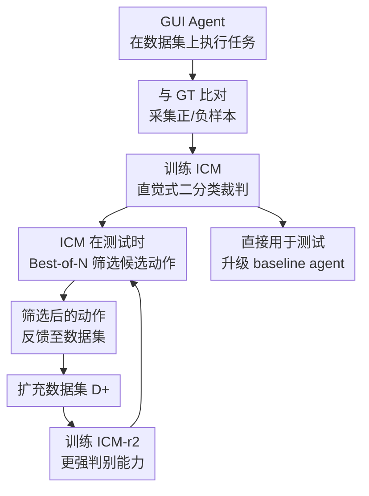

# GAIA: A Data Flywheel System for Training GUI Test-Time Scaling Critic Models

**会议**: ECCV2026  
**arXiv**: [2601.18197](https://arxiv.org/abs/2601.18197)  
**代码**: [https://github.com/SeerRay-Lab/GAIA](https://github.com/SeerRay-Lab/GAIA)  
**领域**: 多模态 VLM / Agent  
**关键词**: GUI Agent, Critic Model, 数据飞轮, Test-Time Scaling, 直觉判断

## 一句话总结

本文提出 GAIA 数据飞轮系统，通过让真实 GUI agent 执行任务来采集正/负动作样本，训练一个直觉式（非推理式）裁判模型 ICM；ICM 在测试时以 Best-of-N 方式从 agent 采样的多个候选动作中选出概率最高的正确动作，再用这些选中的动作扩充数据飞轮训练更强的 ICM-r2，形成自我进化的良性循环。

## 研究背景与动机

GUI agent 在手机操作、桌面自动化等场景中进展迅速，SFT 和 RFT 让 agent 能理解屏幕内容并执行多步任务。然而，GUI 操作有一个天然的特点：动作是不可逆的——一次误点、误输入可能导致整个流程脱轨，且没有重来的机会。因此，在执行前验证 agent 动作的正确性变得至关重要。

现有方法主要走两条路。一是用启发式算法构造负样本（比如在截图随机位置取点击坐标），训练一个正确性判别器；二是让判别器输出完整的 thinking/reasoning 链条，用 RL 训练推理式裁判。前者的问题在于随机负样本与真实 agent 的错误分布严重脱节，判别器从未见过真实错误长什么样，学到的判断标准必然有偏。后者的矛盾更深刻：正确/错误这种二分类本质上是一个直觉判断（intuitive judgment）——认知科学研究表明，人类在这种快速二分类问题上依赖直觉通路、而非耗时的推理链，过度推理反而会引入噪声、降低准确率，同时产生更多输出 token、拖慢 test-time scaling 的效率。

本文的核心矛盾在于：既要让裁判模型接触到真实分布的正/负样本，又要保持二分类的直觉性以避免推理噪声。GAIA 的切入角度是：放弃启发式生成和推理式设计，改用真实 agent 执行任务产生的轨迹数据作为正/负样本来源，并训练一个轻量直觉式判别模型（不做 step-by-step reasoning），然后将它嵌入 Best-of-N 测试时筛选流程，再将被选中动作的反馈数据送回训练集，启动数据飞轮。**核心 idea：构建一个真实 agent 动作数据飞轮，先用基线 agent 的轨迹训练直觉式裁判 ICM，再用 ICM 筛选更高质量的动作扩充数据集、迭代训练更强的 ICM-r2，从而实现裁判模型在测试时持续提升 GUI agent 的决策质量。**

## 方法详解

### 整体框架

GAIA 包含两个阶段。Phase 1 是初始化阶段：用现有 GUI agent（如 UI-TARS）在公开数据集（AndroidControl、GUI-Odyssey）上执行任务，逐 step 与 ground truth 比对得到正样本（动作与 GT 一致）和负样本（动作偏离 GT），构建一个平衡的正/负样本数据集 D（各占 50%）。基于此训练 Intuitive Critic Model (ICM)。Phase 2 是迭代阶段：ICM 在测试时以 Best-of-N 方式从 agent 的 N-rollout 候选动作中选出置信度最高的正确动作执行；这些被 ICM 筛选过的、质量更高的执行数据（尤其是 ICM 最初判断错误的困难样本）经过标注后加入数据飞轮，形成增强数据集 D+，再训练出 ICM-r2。两轮训练后，ICM-r2 在困难样本上的判别能力显著提升，进一步改善 agent 表现。

### 关键设计

**1. 真实动作采样：让负样本反映真实错误分布**

现有批判模型训练负样本的方式（随机点击、跨任务替换、提前截断）与真实 agent 错误分布严重偏离——随机点的位置在客观上可能本就不合理，裁判学到的只是"位置不合理=错误"这类与任务无关的表面规律。GAIA 的做法是直接让 UI-TARS 等现成 GUI agent 在 AndroidControl 和 GUI-Odyssey 数据集上全量跑一遍，逐 step 记录 agent 实际输出的动作及其参数（点击坐标、滑动方向、输入文本等），再与数据集中的 ground truth 严格比对：动作类型和参数同时匹配 GT 即为正样本，否则为负样本。这样产出的负样本就是 agent 真实犯过的错误——可能是坐标偏差几像素（客观动作错误）、也可能是方向根本不对（语义错误）——裁判模型由此学到的是与任务语境耦合的判断标准，而非伪相关。两轮采集正负各约 13.5 万条，保持 50:50 平衡。

**2. 直觉式裁判：二分类推理越少越准**

认知科学指出，直觉通路（intuitive system）在处理二值判断时比分析推理通路更快、更准确——围棋大师的"下一手"直觉就是一个经典案例。GAIA 基于这一观察设计 ICM：输入为（当前截图、全局指令、历史动作、候选动作），输出仅为 `correct` 或 `wrong` 一个 token 分类，不加 `thinking`/`reasoning`。损失为标准交叉熵。作为对照，作者训练了一个推理式裁判 RCM（Reasoning Critic Model）——same input + 思维链输出，用 GRPO 训练——结果 ICM 判别准确率 83.19%，RCM 仅 70.82%，且 ICM 引导下的 agent 成功率也显著更高。这是因为二分类任务中推理链可能引入无关中间变量（"这个坐标距离目标区域还有多远"等），反而干扰最终判断。

**3. Best-of-N 测试时筛选与数据飞轮闭环**

测试时，ICM 不改变基座 agent 的参数，而是让 agent 以较高温度（T=1.0, top_p=0.8, top_k=30）对当前 step 做 N=8 次 rollout，产生 8 个候选动作。ICM 对每个候选输出是否为正确 action + 置信度概率 p，从中选出所有标记为 correct 中置信度最高的动作执行；若无一正确，则回退到第一个候选。这一机制本身就将基座 agent 的 step success rate 提升了 5–17 个百分点。更重要的是，ICM 筛选后执行通过的轨迹数据被自动收集、标注，加入数据飞轮形成 D+（每轮新增约 3–5 万条正负样本），训练出的 ICM-r2 在基座 agent 最高难度的场景上进一步提升了 1–3 个百分点的成功率。这一数据与模型决策能力的正反馈回路是 GAIA 的核心：无需额外的标注人工，agent 执行筛选本身就在产生更精细的训练数据。

**4. 仅接受全局指令的高层设定（High-Level Setting）**

ICM 训练和推理时都不给予单步动作规划（low-level action plan），只接收全局任务指令+"当前屏幕截图+历史动作序列"。这意味着裁判模型必须在缺乏分步指引的条件下自主判断一个动作在当前状态下的合理性——更接近真实场景中用户的使用方式（用户不给 agent 拆好每一步的步骤清单）。消融实验表明即使在这种更具挑战的设置下，ICM/ICM-r2 仍能稳定提升 agent 在 AndroidControl-High 和 GUI-Odyssey 上的表现，展现了裁判模型的泛化实用性。

### 损失函数 / 训练策略

ICM 基于 Qwen2.5 VL 7B，使用交叉熵损失优化。对每个样本 (z_k, u_k, h_k, o_k)，模型预测一个二类 token（correct/wrong），损失函数为：

$$ \mathcal{L}_{\text{CE}} = -\frac{1}{K} \sum_{k=1}^{K} \left[ j_k \log P_{\theta_c}(\text{correct} \mid z_k, u_k, h_k, o_k) + (1 - j_k) \log \left(1 - P_{\theta_c}(\text{correct} \mid z_k, u_k, h_k, o_k)\right) \right] $$

其中 $j_k$ 为 ground truth 二值标签（1 正确 / 0 错误），$P_{\theta_c}(\text{correct} \mid \cdot)$ 为模型对 "correct" token 的预测概率。

## 实验关键数据

### 主实验

| 数据集 | 指标 | 基座模型 | +ICM | +ICM-r2 |
|--------|------|---------|------|---------|
| AndroidControl-High (SR) | Step Success Rate | UI-TARS 1.0 (58.2%) | **67.5** (+9.3) | 67.1 (+8.9) |
| AndroidControl-High (SR) | Step Success Rate | UI-TARS 1.5 (55.8%) | 64.5 (+8.7) | **65.6** (+9.8) |
| GUI-Odyssey (SR) | Step Success Rate | UI-TARS 1.0 (43.3%) | 55.3 (+12.0) | **56.3** (+13.0) |
| GUI-Odyssey (SR) | Step Success Rate | UI-TARS 1.5 (32.9%) | 47.8 (+14.9) | **50.2** (+17.3) |
| GUI-Odyssey (SR) | Step Success Rate | GPT-4o (11.4%) | 13.4 (+2.0) | **14.5** (+3.1) |
| GUI-Odyssey (SR) | Step Success Rate | Doubao (43.8%) | 46.9 (+3.1) | **47.9** (+4.1) |
| ScreenSpotV2 (Avg) | Grounding Acc | Qwen 2.5 VL (65.0%) | 70.4 (+5.4) | **71.1** (+6.1) |
| ScreenSpotV2 (Avg) | Grounding Acc | UI-TARS 1.0 (88.1%) | 88.7 (+0.6) | **89.0** (+0.9) |

### 消融实验

| 配置 | Critic Acc | GUI-Odyssey SR | 说明 |
|------|-----------|---------------|------|
| UI-TARS 1.5 基线 | — | 32.9% | 无 critic |
| + RCM (推理式) | 70.82% | 44.1% | 带 thinking 链，GRPO 训练 |
| + ICM (直觉式) | **83.19%** | 47.8% | 直觉二分类，标准 CE |
| + ICM-r2 (迭代) | **83.56%** | **50.2%** | 数据飞轮增强后迭代训练 |

### 关键发现

- ICM 对 agent 的提升幅度与基座 agent 原本水平呈负相关：基座越弱，ICM 带来的增益越大（UI-TARS 1.5 on GUI-Odyssey SR +14.9→+17.3），说明 ICM 充分挖掘了弱模型候选动作中潜藏的正确选项。
- ICM-r2 相对 ICM 的提升虽然绝对数值不大（1–3% SR），但增量集中在最困难的样本上——这些恰好是 ICM 难以判别的盲区，证明了数据飞轮对 edge case 的针对性覆盖能力。
- 计算开销方面，N=8 时 critic 推理延迟约 2s，总延迟为 N=1 的约 2.2 倍，且主要瓶颈是 base agent 的 rollout 而非 critic 推理（critic 仅输出单 token）。
- ICM 和 ICM-r2 对 GPT-4o/Doubao 等构造数据时未见过的闭源模型也有显著提升，说明真实动作空间数据具有跨模型一致性。

## 亮点与洞察

- **真实负样本替代启发式生成**是本文最巧妙的设计：用 agent 实际执行产生的错误来训练裁判，比随机点击/跨任务替换的合成数据更贴合真实错误分布。这一思路可迁移到任何需要正负样本对的验证任务（代码执行验证、机器人动作校验等）。
- **直觉 vs 推理选择**具反直觉性：通常人们认为"多想想更准"，但 GAIA 用实验证明在二分类裁判任务上直觉判断优于推理链。背后的 insight 是推理会引入无关中间变量、且二分类的决策边界不需要复杂链条就能刻画。
- **数据飞轮的自我进化闭环**轻巧且实用：ICM 筛选动作→筛选结果扩大数据集→下一轮 ICM-r2 更强，这一回路不依赖人工标注，全自动运转。类似 Self-Rewarding / Self-Play 思路在 GUI 场景的落地。
- **Best-of-N 的 N 值可调**使得性能与计算成本的 trade-off 可灵活配置，从 N=2 就有明显提升，到 N=8 趋于饱和。

## 局限与展望

- ICM/ICM-r2 的增益目前主要在 planning（Type/GR/SR）层面，grounding（ScreenSpotV2）的提升相对温和（0.6–6.1%），说明裁判对坐标精度的判别能力仍有提升空间。
- 数据飞轮仅在两轮迭代后验证，文中没有展示多轮飞轮的收敛行为——是否会有维度诅咒（困难样本越选越难、数据分布漂移导致旧知识遗忘）需要进一步实验。
- 当前设置下 ICM 只输出二值判断 + 置信度，无法为 agent 提供纠正性指导（"这里应该点击哪里"），属于 pass/fail 验证而非 corrigible feedback。
- 跨语言/跨平台泛化性测试不足：实验集中在英文 Android 任务，未测试 iOS、Web 桌面或中文 GUI 场景。

## 相关工作与启发

- **vs UI-Genie-RM**: UI-Genie 用启发式负样本（跨任务替换、提前截断）+ 奖励模型；GAIA 用真实错误分布 + 直觉裁判，在 AndroidControl-High 上 SR 提升 2.8% vs UI-Genie 的 0.3%。
- **vs GUI-Critic-R1**: GUI-Critic-R1 用 GRPO 注入推理能力到裁判，而 GAIA 认为二分类不需要推理——实验证实直觉裁判准确率（83.19% vs 70.82%）和引导效果均更优。
- **vs GTA1**: GTA1 也做 GUI agent 的 test-time scaling，但其重点在 agent 自身推理链的多轮细化，GAIA 则聚焦在裁判模型的质量提升和数据飞轮。
- **vs LLM-as-Judge 的一般范式**: 传统 LLM 裁判倾向于用长 CoT 让判断"可信"，GAIA 的反向发现提示我们 judge 任务的分类本质可能更适合保持判断过程简洁。

## 评分

- 新颖性: ⭐⭐⭐⭐⭐ 数据飞轮 + 直觉裁判的组合在 GUI 领域首次被系统化提出，且实验设计扎实地验证了 intuition over reasoning 这一反直觉假设。
- 实验充分度: ⭐⭐⭐⭐⭐ 覆盖了 6 种基座模型（闭源+开源）、3 个数据集（planning+grounding）、裁判模型对比（直觉 vs 推理）、N 值消融、计算效率分析，还含可视化 case study。
- 写作质量: ⭐⭐⭐⭐ 行文流畅、动机链清晰、图表对照好；但部分实验描述（如 action space 定义）在正文和 supp 之间分散。
- 价值: ⭐⭐⭐⭐⭐ 数据飞轮打标方案可直接套用在各类 agent 验证任务上，ICM 的轻量设计方便生产部署（~2s/call），实用价值高。

<!-- RELATED:START -->

## 相关论文

- [\[ECCV 2026\] On Test-Time Scaling for Vision-Language Models](on_test-time_scaling_for_vision-language_models.md)
- [\[ECCV 2026\] E-TTS: A New Embodied Test-Time Scaling Framework for Robotic Manipulation](e-tts_a_new_embodied_test-time_scaling_framework_for_robotic_manipulation.md)
- [\[CVPR 2026\] UniT: Unified Multimodal Chain-of-Thought Test-time Scaling](../../CVPR2026/vlm_reasoning/unit_unified_multimodal_chain-of-thought_test-time_scaling.md)
- [\[CVPR 2026\] Scaling Test-Time Robustness of Vision-Language Models via Self-Critical Inference Framework](../../CVPR2026/vlm_reasoning/scaling_test-time_robustness_of_vision-language_models_via_self-critical_inferen.md)
- [\[CVPR 2026\] dMLLM-TTS: Self-Verified and Efficient Test-Time Scaling for Diffusion Multi-Modal Large Language Models](../../CVPR2026/vlm_reasoning/dmllm-tts_self-verified_and_efficient_test-time_scaling_for_diffusion_multi-moda.md)

<!-- RELATED:END -->
