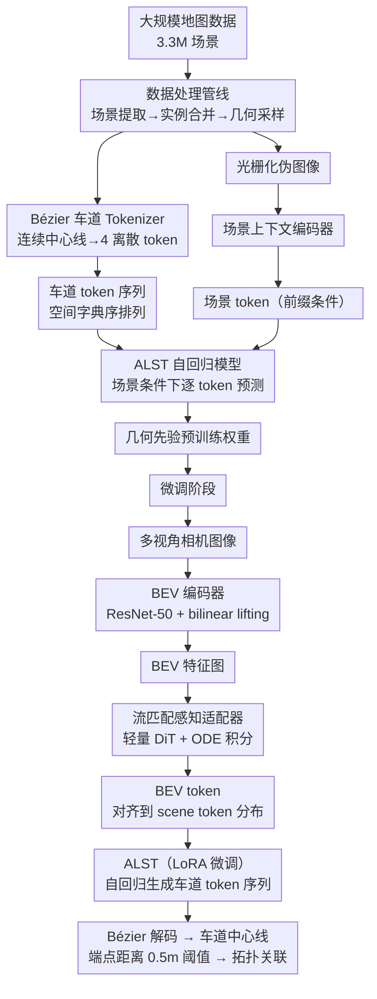

# Generative Lane Topology Reasoning via Autoregressive Model with Geometry Prior

**会议**: ECCV2026  
**arXiv**: [2606.31814](https://arxiv.org/abs/2606.31814)  
**论文**: [项目页](https://buaa-colalab.github.io/topogpt_page)  
**代码**: 待确认  
**领域**: 自动驾驶  
**关键词**: 车道拓扑推理, 自回归模型, 几何先验, 流匹配, BEV感知

## 一句话总结

TopoGPT 将车道拓扑推理从"检测-关联"的判别式范式转为自回归序列生成范式，在 330 万大规模地图场景上预训练车道图的几何先验后，通过流匹配感知适配器将对齐到 BEV 图像条件，在 OpenLane-V2 上以 lane-level +6.4、point-level +11.6 的显著优势全面超越此前方法，且生成的车道图在端点几何一致性和结构完整性上大幅改善。

## 研究背景与动机

车道拓扑推理是自动驾驶感知中的关键环节——从车载多视角相机中检测车道中心线并推断其前后继拓扑关系，从而构建结构化车道图。现有方法遵循"先检测、后关联"的判别式范式：车道检测器先独立预测每条中心线，拓扑预测器再估计两两连接关系。这种解耦设计带来两个固有问题。其一，几何不一致——拓扑相连的两条中心线端点往往对齐很差，因为拓扑阶段无法回溯修正中心线几何。其二，感知不完整——车道图受限于检测器召回率，遮挡和远距离盲区下丢失的车道无法在关联阶段恢复，只能得到碎片化的图结构。

然而，车道图与通用目标检测有根本区别：车道中心线不是空间独立的个体，而是受严格的拓扑约束（平行邻接、路口交汇）支配。人类的直觉可以仅凭车道图结构本身判断其合理性——这说明车道图存在强烈的几何先验。本文的核心洞察是：既然存在这种先验，就不应把车道图当作一组独立实例去逐个检测再拼接，而应当直接学习车道图的全局生成分布——让模型从大规模地图数据中内化"什么样的车道图是合理的"，再以感知信号为条件生成符合该分布的车道图。

**核心 idea：提出 TopoGPT，用自回归序列建模在大规模地图数据上预训练车道图的几何先验，再通过基于无噪声流匹配的感知适配器将对齐到多视角图像条件，让模型以"生成"而非"判别"的方式产生几何一致、结构完整的车道图。**

## 方法详解

### 整体框架

TopoGPT 的核心是两阶段训练 + 一个自回归生成架构。第一阶段（几何地图先验预训练）从 330 万大规模地图场景中学习车道图的几何先验：每条车道用三次 Bézier 曲线参数化后离散化为 4 个离散 token，按空间字典序排列成完整车道 token 序列；同时将车道图光栅化为带方向向量的伪图像，由场景上下文编码器提取全局场景 token 作为生成条件。自回归车道序列 Transformer（ALST）以场景 token 为前缀，通过逐 token 预测学习联合分布。第二阶段（感知对齐微调）将多视角图像经 BEV 编码器提取特征，由流匹配感知适配器将其映射到预训练的 scene token 分布空间，让 ALST 在感知信号驱动下继续自回归生成车道图。推理时利用端点几何一致性，仅靠简单距离阈值（0.5 m）即可判定前后继拓扑关系。

### 关键设计

**1. Bézier 车道 Tokenizer：用 4 个离散 token 紧凑表达任意车道几何**

序列建模的首要问题是如何把连续二维车道中心线转化为离散 token。本文设计了一种基于三次 Bézier 曲线的 tokenizer：每条中心线由 4 个控制点（起点、终点 + 两个中间形状控制点）定义，通过最小二乘法拟合原始点列。关键是起点和终点直接对应真实端点——这让拓扑连接关系被编码在 token 结构里（拓扑相连的两条车道必然在端点 token 上天然对齐），而不是靠额外预测或后处理纠偏。控制点坐标按 x/y 轴分别量化到 64 个 bin、合并为 4096 个离散索引，每条车道仅用 4 个 token 即可表达。所有车道按空间字典序（优先 x_min、再 y_min 等）排序，车道间插入 `<SEP>` 分隔符，形成固定模式的自回归序列。这种紧凑表示让模型在可控序列长度下学习大规模车道图的结构规律，同时端点对齐约束在 token 阶段就确保了几何一致性。

**2. 场景条件自回归预训练：从 330 万地图场景中内化几何先验**

仅靠感知数据（含图例标注的多视角图像）难以积累足够先验，因为这类数据成本极高。本文的巧妙之处在于利用大规模纯地图数据（不含图像）进行自监督预训练。每个场景的车道图同时被光栅化为一张记录方向向量的伪图像（每个像素存指向后继点的方向向量，保留几何方向 + 拓扑连通性），经 CNN 编码 + 线性投影 + LayerNorm 得到场景 token 序列，作为 ALST 的 prefix condition。ALST 采用 decoder-only Transformer 加 causal mask 做下一个 lane token 预测。预训练时引入两种数据增强：全局增强（随机翻转、平移、旋转共用的几何变换）防止过拟合；条件退化（随机遮挡部分车道甚至完全移除场景条件）迫使模型在不完整条件下补全车道图——这种"补全"目标恰恰是学习几何先验的关键驱动力，因为模型不能只复制场景特征，而必须理解车道图的底层结构分布。在 330 万场景、三种模型规模（24.7M/45.9M/91.3M 参数）下，模型和数据量越大微调后下游性能越好的 scaling law 证明了先验被有效内化并迁移。

**3. 流匹配感知适配器：从 BEV 图像特征到 scene token 分布的无噪声对齐**

微调阶段面临一个分布偏移：预训练时条件是纯地图构造的 scene token，在线感知时只能从多视角图像提取 BEV 特征。不同于扩散模型要求源分布为高斯假设，流匹配允许从任意结构化的源分布（BEV 特征分布）到目标分布（scene token 分布）学习连续输运路径。适配器主体是一个轻量级 DiT 网络，通过优化流匹配 MSE 损失学习速度场。训练时显式展开 ODE Euler 积分步得到预测的 BEV token，并联合优化两个对齐信号：特征级 MSE 损失让 BEV token 靠近 scene token，再叠加 lane token 预测的交叉熵损失反向传播到 ODE 积分路径——这确保了对齐不仅"看起来像 scene token"，更要"对 ALST 的生成任务有用"。推理时仅需 N_flow=6 步确定性 Euler 积分即可得到稳定的 BEV token。这一设计的优雅之处在于：对齐任务本身就是一个生成问题，而用生成模型（流匹配）解决生成模型（ALST）的条件对齐，数学上自然兼容。

### 损失函数 / 训练策略

预训练阶段优化 scene token 条件下车道 token 序列的交叉熵损失 $L_{lane}$。微调阶段联合三个目标：流匹配速度场 MSE 损失 $L_{flow}$、BEV token 与 scene token 的特征级 MSE 对齐损失 $L_{align}$、以及车道 token 预测 CE 损失 $L_{lane}$。BEV 编码器和感知适配器共同优化，ALST 使用 LoRA 微调以适应 BEV token 输入，全参数微调和冻结参数也能达到相近效果。

## 实验关键数据

### 主实验

| 数据集 | 方法 | M-P↑ | M-R↑ | M-T↑ | G-IoU↑ | SDA↑ | T-F1↑ | JT-F1↑ | APLS↑ |
|--------|------|------|------|------|--------|------|-------|--------|-------|
| OpenLane-V2 A | TopoPoint (SOTA) | 42.7 | 34.0 | 16.6 | 40.6 | 19.6 | 34.5 | 24.2 | 17.4 |
| | **TopoGPT** | **45.6** | **42.6** | **24.4** | **54.4** | **26.9** | **47.4** | **35.7** | **28.7** |
| OpenLane-V2 B | TopoPoint (SOTA) | 35.4 | 26.8 | 12.6 | 31.9 | 13.2 | 25.7 | 19.6 | 11.1 |
| | **TopoGPT** | **43.1** | **39.2** | **23.4** | **55.4** | **25.8** | **46.3** | **36.8** | **29.5** |

### 消融实验

| 配置 | M-P↑ | M-R↑ | M-T↑ | 说明 |
|------|------|------|------|------|
| Full model (LoRA) | 45.6 | 42.6 | 24.4 | 完整模型 |
| w/o 预训练 (From Scratch) | 7.4 | 7.0 | 0.8 | 无先验时几乎学不到有效映射 |
| w/o 全局增强 | 42.6 | 40.1 | 22.1 | 全局翻转变换带来的提升约 +3 |
| w/o 条件退化 | 43.3 | 40.8 | 22.6 | 补全目标单独贡献约 +2 |
| w/o $L_{align}$ + $L_{lane}$ 联合 | 37.2 | 37.0 | 19.6 | 同时去掉两者退化最严重 |
| w/o 流匹配 | 43.1 | 39.6 | 21.6 | 直接输出 BEV 特征也不错，但流匹配额外带来 +2.5/+3.0/+2.8 |

### 关键发现

- 预训练的增益是决定性的：从零训练仅 7.0/7.0/0.8，有了预训练后跃升至 45.6/42.6/24.4——在有限传感器-标注对数据下根本不足以学到可靠的车道图分布，先验不可或缺。
- 模型规模和数据量呈现一致的 scaling law：从 Small (24.7M) 到 Large (91.3M)、从 25% 到 100% 数据持续提升，未见饱和迹象。
- 流匹配 DI 步数在 6 步后饱和，6 步是最佳精度-效率平衡点。
- 在遮挡 / 远距离场景下，TopoGPT 能推断被遮挡路口的车道延续和拓扑连接，而 TopoPoint 直接丢失——体现了几何先验的"补全"能力。

## 亮点与洞察

- **先验来源的巧妙选择**：用纯地图数据（无需图像）预训练几何先验，高清地图比感知标注数据成本低、规模大得多，创造性地回避了自动驾驶感知中的"标注瓶颈"。
- **Bézier 4-token 表示是钥匙**：将连续几何压缩为 4 个离散 token 并让端点对齐约束编码在 token 结构中，是整个序列化方案能否工作的基石。与 Pix2Seq 的 tokenization 思路一脉相承但又有车道特化的端点对齐设计。
- **条件退化增强的深层逻辑**：随机遮挡场景条件迫使模型从部分上下文推断完整车道图——这种补全目标比简单预测更能诱导对图结构分布的理解，这也是为什么对遮挡场景也能推理的原因。
- **流匹配 vs 扩散**：流匹配不要求源分布为高斯，天然适配 BEV 特征到 scene token 的对齐，推理仅需 6 步而非扩散的 50+ 步，设计和效率上都更优。

## 局限与展望

- 自回归解码的固有延迟：相比 DETR 单次前向即可输出所有车道，逐 token 生成的推理速度更慢，且存在误差累积——早期预测偏差可能连锁影响后续车道。
- 几何先验的地域泛化：预训练数据（nuPlan、Waymo、Argoverse 2）均来自美国路况，对非标准路口结构（环岛、复杂多岔路口、无划线道路）的泛化能力有待验证。
- 输出数量受限于预定义 spatial order：模型按固定顺序生成 token 组，无法像判别式方法那样自由增减车道数，灵活性略逊于 query-based 方案。

## 相关工作与启发

- **vs TopoNet/TopoMLP/TopoPoint**: 判别式方法的代表，走 "detect-then-associate" 路线。本文从生成视角建模车道图全局分布，而非逐个检测独立实例再关联。
- **vs LaneGraph2Seq / Topo2Seq**: 同样用序列生成框架但侧重复杂图遍历确定序列化顺序，直接从感知输入预测。本文则是先大规模预训练几何先验，再微调对齐感知输入，预训练带来的增益是决定性的。
- **vs MapPrior / LaneDiffusion**: 扩散模型生成地图的方法。自回归方案的差异在于离散 token 序列比连续扩散更利于融入场景条件（prefix token），且推理步数更少。
- **vs SMERF / SatForHDMap**: 这些方法需要额外输入（SD 地图、卫星图）作为先验；本文把先验内化到模型参数中，推理时不再依赖外部输入。

## 评分

- 新颖性: ⭐⭐⭐⭐⭐ 将生成式预训练 + 流匹配适配器引入车道拓扑推理，问题建模和框架设计都非常优雅，开创了一个新范式方向。
- 实验充分度: ⭐⭐⭐⭐⭐ 涵盖主结果、模型规模/数据量/数据增强/微调策略/损失项/流匹配步数等全方位消融，定性可视化也有说服力。
- 写作质量: ⭐⭐⭐⭐⭐ 逻辑链条清晰，动机引述充分，从问题定义到方案设计到实验验证层层递进。
- 价值: ⭐⭐⭐⭐⭐ 自动驾驶感知管线中的实打实部署价值，+6.4/+11.6 的超越幅度非常可观。

<!-- RELATED:START -->

## 相关论文

- [\[CVPR 2026\] G$^2$VLM: Geometry Grounded Vision Language Model with Unified 3D Reconstruction and Spatial Reasoning](../../CVPR2026/vlm_reasoning/g2vlm_geometry_grounded_vision_language_model_with_unified_3d_reconstruction_and.md)
- [\[ICLR 2026\] CoPRS: Learning Positional Prior from Chain-of-Thought for Reasoning Segmentation](../../ICLR2026/vlm_reasoning/coprs_learning_positional_prior_from_chain-of-thought_for_reasoning_segmentation.md)
- [\[ICLR 2026\] Generative Universal Verifier as Multimodal Meta-Reasoner](../../ICLR2026/vlm_reasoning/generative_universal_verifier_as_multimodal_meta-reasoner.md)
- [\[CVPR 2026\] GGBench: A Geometric Generative Reasoning Benchmark for Unified Multimodal Models](../../CVPR2026/vlm_reasoning/ggbench_a_geometric_generative_reasoning_benchmark_for_unified_multimodal_models.md)
- [\[CVPR 2026\] SpatialStack: Layered Geometry-Language Fusion for 3D VLM Spatial Reasoning](../../CVPR2026/vlm_reasoning/spatialstack_layered_geometry-language_fusion_for_3d_vlm_spatial_reasoning.md)

<!-- RELATED:END -->
