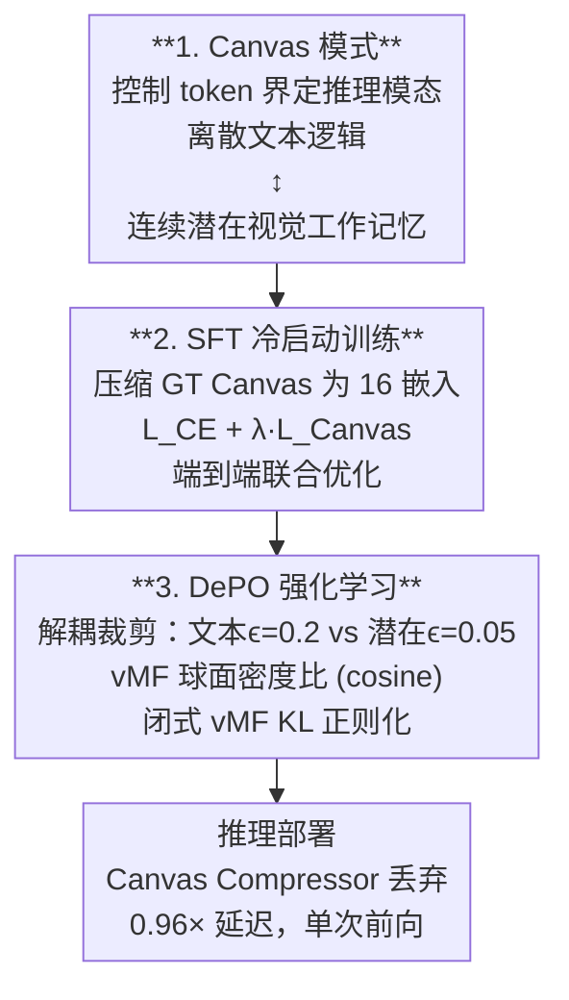

# HyLaR: Hybrid Latent Reasoning with Decoupled Policy Optimization

**会议**: ECCV 2026  
**arXiv**: [2604.20328](https://arxiv.org/abs/2604.20328)  
**代码**: [https://github.com/EthenCheng/HyLaR](https://github.com/EthenCheng/HyLaR)  
**领域**: 多模态VLM / LLM推理  
**关键词**: 混合潜在推理, 解耦策略优化, vMF分布, 视觉潜在表征, 混合动作空间RL  

## 一句话总结
HyLaR 通过引入控制 token 在文本离散 token 和连续视觉潜在向量之间无缝切换，实现混合离散-连续推理；针对混合动作空间的高效强化学习，提出 DePO（解耦策略优化），利用 vMF 球面建模和解耦信任域裁剪解决标准 RL 的几何与方差不匹配问题，在细粒度感知和通用多模态理解基准上显著超越现有方法。

## 研究背景与动机

**领域现状**：CoT 推理显著提升了多模态大语言模型（MLLM）的复杂问题求解能力。然而，大部分 MLLM 面临一个架构性瓶颈——**早期语义坍缩**：高带宽连续视觉信号在进入 LLM 前被强制压缩为离散文本 token，丢失了难以言语化的细粒度视觉证据。

**现有痛点**：为缓解此问题，现有研究探索了两条路线。一是 Think-with-Images 范式（如 DeepEyes、Thyme），借助外部工具重新感知图像，但引入了工具调用错误、推理延迟和刚性操作瓶颈。二是潜在空间推理（如 LVR、SkiLa、Monet），将推理转移到连续潜在空间以保留视觉保真度。但后者的**混合离散-连续动作空间**给优化带来了新挑战：离散 token 与连续潜在向量在概率密度、方差特性上本质不同，标准 RL 算法（GRPO、DAPO）的统一信任域裁剪和 Gaussian 假设完全不匹配。

**核心矛盾**：标准 RL 存在两大不匹配——(1) **方差不匹配**：连续潜在动作的密度比（importance ratio）对策略参数微小变化极为敏感，远高于离散 token；(2) **几何不匹配**：LLM 的 RMSNorm 层将 hidden state 约束在高维超球面流形上（方向性语义），而标准 RL 假设 Gaussian 分布的欧氏几何，导致 KL 正则化采样方差极高、效果差。

**切入角度**：论文识别出上述两个关键不匹配后，提出解耦处理——为离散 token 和连续潜在向量分别设计信任域裁剪范围，并用 von Mises-Fisher（vMF）分布（而非 Gaussian）建模连续潜在策略，使 KL 散度化为闭式余弦距离，彻底避开高方差采样。

**核心 idea**：HyLaR + DePO 通过解耦信任域裁剪处理混合动作的差异方差、通过 vMF 球面建模匹配 LLM 原生几何、通过闭式 KL 实现零方差精确正则化，使得潜在推理的强化学习变得稳定、高效且几何精确。

## 方法详解

### 整体框架

HyLaR 在标准 MLLM 架构上扩展出混合离散-连续动作空间。通过引入特殊控制 token `<|canvas_start|>` 和 `<|canvas_end|>` 界定视觉推理过程：在 canvas 模式下，文本生成暂停，hidden state 被循环反馈作为下一层输入（绕过离散词表），形成内部视觉工作记忆。该连续递归在发出结束 token 或达到最大 canvas 长度预算时终止。

整个训练分为两个阶段：**Stage I SFT 冷启动**让模型学会在文本与潜在步骤间交替，**Stage II DePO RL**进一步用强化学习精细优化混合推理轨迹。

### 关键设计

**1. Canvas 模式：控制 token 实现混合离散-连续推理**

它要解决的是标准文本 CoT 的语义坍缩和 Think-with-Images 的外部工具开销。关键机制是引入 `|<|canvas_start|>` 和 `|<|canvas_end|>` 两个控制 token 界定视觉推理区间。在 canvas 模式下，模型不产生离散输出 token，而是将前一层的 hidden state 循环输入作为下一层的嵌入，实现连续潜在空间的递归计算。这个递归相当于内部视觉工作记忆——模型在潜在空间中自主聚焦或缩放目标区域，比外部工具调用更快（无需 detokenize、re-encode、API 调用），且完全在单次前向推理内完成。从设计动机看，这种机制保留了视觉信号的高保真度，同时避免了像素级图像生成的巨大延迟。

**2. Canvas 压缩与对齐：SFT 阶段的冷启动训练**

要解决的是如何训练模型在 canvas 模式下产生有意义的潜在向量，而不需要监督每一步的潜在空间中间状态。论文采用 Canvas Compressor：在 SFT 阶段，先用冻结的 SigLIP2 编码器从 GT 中间画布图像提取 P=729 个 patch token，再用一个可学习的交叉注意力压缩器（L=2 层，N=16 个 query token）将它们聚合为 16 个紧凑 canvas 嵌入。训练时，利用 MSE loss 对齐 LLM 在 canvas 位置处的 hidden state 和目标嵌入：

$$ \mathcal{L}_{\text{Canvas}} = \frac{1}{|\mathcal{S}|} \sum_{t \in \mathcal{S}} \| \mathbf{h}_t - \mathbf{e}_{t+1} \|_2^2 $$

其中 $\mathbf{h}_t$ 是 LLM 在 canvas 位置 $t$ 的 hidden state，$\mathbf{e}_{t+1}$ 是压缩后的目标 canvas 嵌入。关键细节：backprop 时不 detach 目标嵌入 $\mathbf{e}_{t+1}$，梯度同时流入 LLM backbone 和 Canvas Compressor，主动将视觉特征拉进 LLM 的语义空间。总 SFT 损失为 $\mathcal{L}_{\text{SFT}} = \mathcal{L}_{\text{CE}} + \lambda \mathcal{L}_{\text{Canvas}}$。**推理时 Canvas Compressor 被直接丢弃**，零架构开销。

**3. DePO 解耦策略优化：vMF 球面建模 + 解耦裁剪 + 闭式 KL**

这是本文最核心的设计，专门针对混合动作空间的 RL 优化受限问题。标准 PPO/GRPO 对所有动作步骤应用统一的 surrogate loss 裁剪范围和采样式 KL 正则化，在混合空间中面临两大失败原因。

**(a) 解耦信任域裁剪**：将响应分为文本位置 $\mathcal{Z}$ 和潜在位置 $\mathcal{S}$，各自独立应用双裁剪 PPO surrogate：

$$ \mathcal{L}_{\text{PPO}}(\theta) = \mathcal{L}_{\text{tok}}(\theta|\mathcal{Z}; \epsilon_l^{\text{tok}}, \epsilon_h^{\text{tok}}) + \alpha \mathcal{L}_{\text{lat}}(\theta|\mathcal{S}; \epsilon_l^{\text{lat}}, \epsilon_h^{\text{lat}}) $$

文本使用 $\epsilon_l^{\text{tok}}=0.2, \epsilon_h^{\text{tok}}=0.28$；潜在动作使用显著更紧的 $\epsilon_l^{\text{lat}}=\epsilon_h^{\text{lat}}=0.05$（$\alpha=0.5$ 平衡两项）。原因是连续 vMF 密度比对策略微小变化高度敏感（源于高维空间的对数密度特性 + 潜在递归中的误差累积），需要更小的信任域。

**(b) vMF 球面建模**：对连续潜在位置，不用 Gaussian 而用 von Mises-Fisher 分布建模策略密度：

$$ \pi_\theta(a_t|s_t) = C_D(\kappa) \exp\left(\kappa (\boldsymbol{\mu}_t^\theta)^\top \tilde{\mathbf{z}}_t\right), \quad \tilde{\mathbf{z}}_t \in \mathbb{S}^{D-1} $$

其中 $\boldsymbol{\mu}_t^\theta$ 是 $\ell_2$ 归一化的 hidden state（超球面单位向量），$\tilde{\mathbf{z}}_t$ 是旧策略的 rollout 方向（即旧策略的模式）。重要性采样比简化为 $\log r_t = \kappa(\cos(\boldsymbol{\mu}_t^\theta, \tilde{\mathbf{z}}_t) - 1)$，完全由角度偏差驱动。这完美匹配 RMSNorm 归一化下 LLM hidden state 的方向性几何。

**(c) 闭式 vMF KL 正则化**：两个共享浓度参数 $\kappa$ 的 vMF 分布之间的 KL 散度可化为缩放的余弦距离：

$$ \mathcal{L}_{\text{KL}}^{\text{lat}} = \frac{1}{|\mathcal{S}|} \sum_{t \in \mathcal{S}} \mathbf{W}_\kappa \cdot \left(1 - \cos(\boldsymbol{\mu}_t^\theta, \tilde{\mathbf{z}}_t)\right) $$

这提供了**零方差、精确**的 KL 估计，完全避开了采样式 KL 在高维空间中的巨大噪声。实践中论文采用 unnormalized 放松（内积代替余弦）保留幅度信息作为自适应浓度因子，在各类 benchmark 上平均额外提升 +2.87%。

### 一个完整示例

以一个高分辨率图像中远距离广告牌文字识别为例。传统 CoT：模型将整图压缩为若干离散 token，注意力难以聚焦到极小区域，常产生幻觉输出。HyLaR 的工作流程：模型首先生成文本推理框架（如"我需要观察画面中的广告牌区域"），然后发出 `|<|canvas_start|>` 进入 canvas 模式。在 canvas 模式下，hidden state 在潜在空间循环 16 步进行方向性递归——类似于在潜在空间中对广告牌区域进行视觉"放大"和"聚焦"。当模型完成内部视觉探索后，发出 `|<|canvas_end|>` 退出 canvas 模式，结合已经获得的精细视觉表征恢复文本生成，输出最终答案。整个过程完全在单次前向推理内完成，无需外部工具调用，延迟仅为无 canvas 基线的 0.96 倍。

### 损失函数 / 训练策略

**SFT 阶段**：联合优化 $\mathcal{L}_{\text{SFT}} = \mathcal{L}_{\text{CE}} + \lambda \mathcal{L}_{\text{Canvas}}$。训练 1 epoch 防过拟合，学习率 $10^{-5}$，每 GPU batch size 1，gradient accumulation 16 步。Canvas Compressor 使用 L=2 层 cross-attention，N=16 个 query token，输入来自冻结 SigLIP2 提取的 729 个 patch token。SFT 训练数据来自 Zebra-CoT，经筛选后约 96K 样本。

**DePO RL 阶段**：总损失 $\mathcal{L}_{\text{total}} = \mathcal{L}_{\text{PPO}} + \beta_{\text{tok}} \mathcal{L}_{\text{KL}}^{\text{tok}} + \beta_{\text{lat}} \mathcal{L}_{\text{KL}}^{\text{lat}}$，其中 $\beta_{\text{tok}}=0.01$，$\beta_{\text{lat}}=0.005$，$\alpha=0.5$。学习率降至 $10^{-6}$，rollout size G=8，温度 0.9，最大响应长度 2048，$\kappa=0.01$。RL 训练数据来自 DeepEyes、Thyme 和 CodeDance 的去重合并，约 48.6K 样本。使用动态 rollout 过滤（丢弃组平均准确率不在 [0.1, 0.9] 内的回答组）确保有效梯度信号。训练在 8× NVIDIA H20 GPU 上进行。

## 实验关键数据

### 主实验

| 数据集 | 指标 | Qwen2.5-VL-7B | SkiLa* | Monet* | HyLaR-SFT | **HyLaR-7B(DePO)** |
|--------|------|--------------|--------|--------|-----------|-------------------|
| V* | Overall | 76.44 | 78.53 | 80.10 | 80.63 | **83.77** |
| V* | Attribute | 77.39 | - | 81.73 | 81.73 | **82.61** |
| V* | Spatial | 75.00 | - | 77.63 | 78.95 | **85.53** |
| HRBench-4K | Overall | 68.00 | 72.12 | 67.37 | 71.50 | **75.00** |
| HRBench-8K | Overall | 63.75 | 66.50 | 64.37 | 67.19 | **70.50** |

**分析**：HyLaR 在三个超高分辨率基准上全面领先。相比基线 Qwen2.5-VL-7B，V* 提升 7.33%，HRBench-4K 提升 7.00%，HRBench-8K 提升 6.75%。在视觉潜在推理模型中，HyLaR 大幅超越 SkiLa 和 Monet（V* 分别高出 5.24% 和 3.67%）。Spatial 维度提升最为显著（+10.53%），说明潜在空间推理对空间关系的保持力远超离散化方案。

### 消融实验

| 方法 | V* | HRBench-4K | HRBench-8K | MMVP | Avg |
|------|----|------------|------------|------|-----|
| Text-only SFT | 69.11 | 65.88 | 61.00 | 70.20 | 66.55 |
| HyLaR-SFT | 80.63 | 71.50 | 67.19 | 71.00 | 72.58 |
| + GRPO | 78.53 | 71.50 | 67.50 | 71.40 | 72.23 |
| + DAPO | 79.06 | 71.75 | 68.00 | 70.20 | 72.25 |
| + VLPO (Monet) | 80.10 | 72.84 | 68.00 | 69.67 | 72.65 |
| **+ DePO (Ours)** | **83.77** | **75.00** | **70.50** | **73.67** | **75.74** |

**分析**：对比标准 RL 算法（GRPO、DAPO、VLPO），DePO 在 avg 上高出约 3 个百分点。值得注意的是，GRPO 和 DAPO 在 V* 上甚至比 SFT 基线还低（80.63 → 78.53 / 79.06），说明统一裁剪策略在混合空间中确实有害。DePO 的解耦裁剪和 vMF 建模带来了决定性提升。

### 关键发现
- **SFT 潜在步骤存在"过度思考"退化**：当测试潜在步数 $K_{\text{test}}$ 远大于训练步数 $K_{\text{train}}$ 时，SFT 模型的性能持续下降；RL 训练有效缓解此问题，使模型能泛化到更长的推理预算。
- **解耦裁剪范围高度敏感**：潜在动作的裁剪范围 $\epsilon^{\text{lat}}=0.05$ 是最优值。设置为 0.2（与文本相同）V* 掉至 80.10，说明统一裁剪在混合空间中适得其反。
- **vMF 优于 Gaussian**：用 Gaussian 替代 vMF 后所有指标下降，Gaussian 假设下模型可能通过增加 embedding 范数而非学习更好的语义来最大化优势，vMF 天然的角度正则化避免了这种 norm explosion。
- **推理效率显著**：HyLaR 的运行延迟仅为 Qwen2.5-VL-7B 的 0.96 倍、显存的 0.98 倍，而工具型方法 DeepEyes 的延迟为 2.28 倍、显存为 3.64 倍。

## 亮点与洞察
- **vMF 到 LLM 桥接的天才之处**：观察到 LLM 中 RMSNorm 将 hidden state 约束在超球面后，放弃通用 Gaussian 假设转而采用 vMF 分布——这使重要性采样比退化为简单的余弦相似度，KL 散度化为闭式余弦距离，训练稳定性和计算效率同时受益。
- **解耦裁剪直觉清晰且实用**：不是用一个复杂的网络或自适应机制来调节不同动作类型的策略更新幅度，而是直接用两个独立的裁剪超参数——简单、可调、效果惊人。这种"识别问题差异 → 分而治之"的设计哲学值得借鉴。
- **unnormalized 放松的工程巧思**：理论上完整保留 vMF 的归一化推导，但实践中采用内积代替余弦相似度，让 hidden state 的幅值充当动态浓度参数。这种"理论 clean + 工程 flex"的方法使论文兼具严谨性和实用性。
- **Canvas Compressor 推理时丢弃**：SFT 阶段使用的交叉注意力压缩器（辅助提供监督信号）在 RL 阶段和推理时完全丢弃，零架构开销。这种设计让模型"在监督中学习、在无监督中成长"。

## 局限与展望
- **Canvas 步数的动态决策**：当前 canvas 步数是固定最大值（论文实验设为 16），由模型自行决定何时结束。能否让模型自适应地分配不同复杂度的任务不同数量的潜在步数，仍有探索空间。
- **潜在空间的解释性**：论文通过注意力图验证了 canvas token 确实聚焦于关键区域，但潜在空间递归中每一步究竟在"计算"什么（某种内部视觉搜索？特征对齐？）仍然是一个黑盒，缺乏更好的可视化手段。
- **扩展到开放域 Agent 场景**：当前实验主要针对单轮、确定答案的视觉问答。论文在结论中指出未来希望将混合 RL 范式扩展到开放式的 agentic 环境，但当前尚未验证。
- **大规模扩展性**：论文验证了 3B 和 7B 两个规模的有效性，但更大模型（30B+）上 vMF 假设和闭式 KL 是否仍保持优势需要进一步验证。

## 相关工作与启发
- **vs LVR**：LVR 将潜在 embedding 与辅助图像特征对齐，但主要关注裁剪区域、缺乏全局上下文；HyLaR 支持全局粒度且通过 RL 进一步优化而非仅 SFT。
- **vs SkiLa**：SkiLa 是最直接的 SFT-only 潜在推理方案，通过简单对齐训练；HyLaR 在其基础上增加了 DePO RL 优化（SkiLa 论文自己也未采用 RL），在 V* 上从 78.53 提升至 83.77。
- **vs Monet**：Monet 设计了复杂的 3 阶段 SFT pipeline + RL，设计精度高但易积累训练偏差；HyLaR 仅用单阶段 SFT + DePO 就实现了更强的性能，简洁性显著占优。
- **vs 工具型方法 (DeepEyes/Thyme)**：工具型方法依赖外部工具调用（re-perceive/crop），延迟 2.28 倍、显存 3.64 倍于基线；HyLaR 在单次前向推理内完成，延迟仅 0.96 倍。HyLaR 的 vMF + 解耦裁剪方法论也可迁移到其他需要混合动作空间的任务（如具身智能中的底层连续控制 + 高层离散规划）。
- **对 RL for LLM 的方法论启发**：DePO 的"识别动作空间的方差和几何特征差异 → 针对性拆解"的思路可用于其他非标准动作空间（如 tool-use agent 的 tool invoke vs free text 混合生成）。

## 评分
- 新颖性: ⭐⭐⭐⭐⭐ 将 vMF 分布引入 MLLM 混合空间 RL 优化，解耦裁剪设计和闭式 KL 推导均具高度原创性
- 实验充分度: ⭐⭐⭐⭐⭐ 覆盖高分辨感知、通用 VQA、效率对比、3B/7B 双规模、RL 算法对比、分布假设轮换、超参扫描等多维消融，结论支撑充分
- 写作质量: ⭐⭐⭐⭐⭐ 动机明确、问题定位精准（方差 mismatch + 几何 mismatch）、公式推导清晰、实验设计逻辑严谨
- 价值: ⭐⭐⭐⭐⭐ 解决了潜在推理领域最关键的训练瓶颈，方法简洁优雅且效果领先（大幅超越现有 SOTA），对混合动作空间 RL 的方法论贡献可迁移至多个下游领域

<!-- RELATED:START -->

## 相关论文

- [\[ICLR 2026\] MM-HELIX: Boosting Multimodal Long-Chain Reflective Reasoning with Holistic Platform and Adaptive Hybrid Policy Optimization](../../ICLR2026/vlm_reasoning/mm-helix_boosting_multimodal_long-chain_reflective_reasoning_with_holistic_platf.md)
- [\[ICLR 2026\] Perception-Aware Policy Optimization for Multimodal Reasoning](../../ICLR2026/vlm_reasoning/perception-aware_policy_optimization_for_multimodal_reasoning.md)
- [\[CVPR 2026\] Unified Generation and Self-Verification for Vision-Language Models via Advantage Decoupled Preference Optimization](../../CVPR2026/vlm_reasoning/unified_generation_and_self-verification_for_vision-language_models_via_advantag.md)
- [\[CVPR 2026\] CodeV: Code with Images for Faithful Visual Reasoning via Tool-Aware Policy Optimization](../../CVPR2026/vlm_reasoning/codev_code_with_images_for_faithful_visual_reasoning_via_tool-aware_policy_optim.md)
- [\[ICLR 2026\] Unlocking the Essence of Beauty: Advanced Aesthetic Reasoning with Relative-Absolute Policy Optimization](../../ICLR2026/vlm_reasoning/unlocking_the_essence_of_beauty_advanced_aesthetic_reasoning_with_relative-absol.md)

<!-- RELATED:END -->
