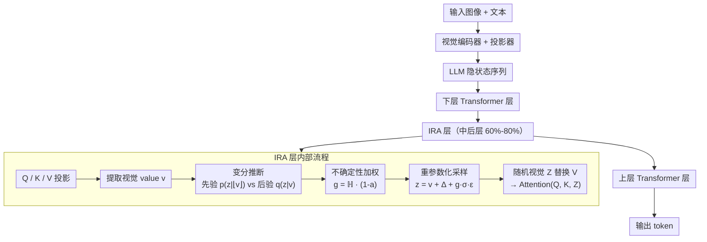

# Information-Regularized Attention for Visual-Centric Reasoning

**会议**: ECCV2026  
**arXiv**: [2607.00434](https://arxiv.org/abs/2607.00434)  
**代码**: 未见公开代码  
**领域**: 多模态 VLM / 表示学习  
**关键词**: 视觉语言模型, 信息瓶颈, 注意力正则化, 幻觉抑制, 变分推断  

## 一句话总结

本文提出 Information-Regularized Attention (IRA)，在 VLM 的 attention 模块内对视觉 value states 施加基于信息瓶颈原理的随机正则化——通过变分推断框架注入数据依赖的层级噪声，让模型在端到端全参数微调中学会主动控制视觉信息的注入量，从而同时改善幻觉、视觉定位和灾难性遗忘问题。

## 研究背景与动机

现代 VLM 在视觉问答、图像描述、多模态对话等任务上取得了突破性进展，但依然面临三大可靠性问题：对象幻觉（生成的内容在图像中不存在）、弱视觉定位（attention 未聚焦于相关区域）和全参数指令微调后的灾难性遗忘。当前主流的应对策略几乎都是数据驱动的——视觉指令微调、偏好优化、策略优化等方法试图从监督信号层面修正模型行为。然而，这些方法的本质共性在于：它们都在标准的 next-token prediction 框架下优化模型，视觉嵌入只通过语言监督间接更新，缺乏对视觉表示空间的直接约束。这意味着与任务无关甚至含噪声的视觉信号可以无差别地通过 attention 层传播，干扰跨模态推理的可靠性。

这种缺陷在注意力模式上体现得尤为明显。近期研究广泛报道了 attention sink 和 attention head 中的 spike values 现象——模型的注意力常常坍缩到语义上无信息的视觉 tokens 上，产生噪声化的跨模态交互。现有缓解方案包括门控机制和 attention 分布优化，但它们主要作用于 attention 权重或 attention 输出的层面，而没有触及中间层表示质量的根源。本文的出发点是：将 VLM 中的跨模态问题重新放在信息论的框架下审视——如果视觉表示 h 是输入 x 到输出 y 的瓶颈中间变量，那么标准 SFT 只最大化 I(h; y)（对预测有用的信息），却无法丢弃 I(h; x|y)（对预测无用的噪声信息）。这恰好是信息瓶颈理论中需要被约束的那一项。

基于上述洞察，本文提出在一组中后层 transformer 层的 attention 模块内，对视觉 value states 施加层次化的随机正则化。核心想法是：如果把视觉表示从确定性变量变为随机变量，就可以用 KL 散度显式控制每层注入的信息量，让模型在端到端训练中自主学会保留哪些视觉信号、抑制哪些噪声。**核心 idea：在 attention 模块的 value states 上引入基于信息瓶颈原理的随机正则化机制——为每个 visual token 注入数据依赖的层级噪声，通过变分 KL 项显式约束表示的信息容量，在端到端全参数微调中让模型同时学会"看"和"过滤"。**

## 方法详解

### 整体框架

IRA 在 VLM 的全参数 SFT 阶段工作。以 InternVL2/LLaVA-OneVision 为代表的标准 VLM 架构中，视觉编码器将图像映射为 token 序列，经投影器后与文本 token 拼接，送入 LLM。IRA 的核心是在 LLM 的中后层（约 60%-80% 深度）的 attention 模块内，对视觉部分的 value states 施加变分随机正则化。具体而言：在每个 IRA 层中，提取视觉 value 状态 v，通过一个轻量级线性头预测后验分布的偏移量和方差，在信息瓶颈框架下约束后验与一个锚定在预训练表示上的先验之间的 KL 散度，并用不确定性感知的加权因子对不同 visual token 施加差异化正则化。正则化强度通过 cosine 调度从 0 逐步增加到最大值，避免训练初期破坏预训练表示结构。

### 关键设计

**1. 信息瓶颈变分框架：将视觉表示学习重塑为有损压缩的优化问题**

标准 VLM 的 SFT 只最大化条件似然 p_θ(y|h)，等价于最大化 I(h; y)，但完全没有约束 h 中与 y 无关的噪声信息 I(h; x|y)。在信息瓶颈理论中，理想的学习目标是 max I(h; y) - β·I(h; x|y)——既保留对预测有用的信息，又压缩掉输入中的噪声。IRA 的核心洞见是：如果把每一层的视觉表示从确定性变量 h^(l) 变为随机变量 z^(l)，在 attention 模块内注入随机的局部重参数化噪声，就可以通过变分推断将信息瓶颈目标转化为可微的训练损失。具体地，整个模型定义一个从输入 x 到隐状态 z 再到输出 y 的马尔可夫链，优化目标变为：

$$ \mathcal{L}(\theta,\phi,\lambda|y) = \mathbb{E}\big[\log p_\theta(y|z^{(L)})\big] - \beta \sum_{\ell=1}^{L} D_{\text{KL}}\big(q_{\theta,\phi}(z^{(\ell)}|v^{(\ell)}) \,\|\, p_\lambda(z^{(\ell)}|\lfloor v^{(\ell)}\rfloor)\big) $$

第一项是重建损失（保持任务性能），第二项是层级 KL 正则项（约束信息容量）。与简单的 dropout 或权重衰减不同，KL 正则化直接作用于表示空间：它迫使每个视觉 token 的表示只保留对预测可靠的信息，而将不确定性编码为局部噪声。

**2. 数据依赖先验与残差后验：在 attention 模块内实现层级可控的随机性注入**

直接对预训练 VLM 的表示加噪声会破坏已学好的嵌入结构。IRA 通过精巧的先验-后验设计实现平稳过渡。先验分布定义为锚定在停止梯度（stop-gradient）视觉 value states 上的高斯分布：p_λ(z|⌊v⌋) = N(⌊v⌋, σ_p²I)。其中 ⌊·⌋ 表示从计算图中截断梯度，防止先验与后验同时依赖 v 导致 KL 快速坍缩到零；σ_p² 是一个层共享的可学习参数，相当于从整个训练数据中学出一个零均值高斯噪声尺度。后验分布则定义为带有可学习残差偏移的高斯分布：q_θ,φ(z|v) = N(v + Δ_φ(v), σ_q²I)。其中 Δ_φ(v) 和 log σ_q²(v) 由一个极轻量的线性头（每层一个 Linear(d, d+1) 和一个 Embedding(H, d)）预测，Δ_φ(v) 捕捉对预训练表示的残差调整，σ_q² 控制每个 attention head 的局部不确定性。最终通过重参数化技巧采样：

$$ z = v + \Delta_\phi(v) + \sigma_q \ast \epsilon, \quad \epsilon \sim \mathcal{N}(0, I) $$

这个公式等价于在预训练视觉表示 v 上叠加一个可学习的特征级噪声 Δ_φ(v) + σ_q·ε。先验锚定在预训练表示上保证了模型不会偏离已学知识太远，后验的残差设计提供了灵活的自适应调节空间。推理时所有随机性被移除（z = v + Δ_φ(v)），不引入额外推理开销。

**3. 不确定性感知的 token 级自适应加权：差异化正则化避免过度压缩关键信息**

不同 visual token 对最终预测的贡献差异巨大——主体目标与无关背景显然不需要相同的正则化强度。IRA 为此设计了一个两阶段加权机制。首先计算每个 visual token 的平均 attention mass a_i = (1/T) Σ_j p_{j,i}，衡量文本上下文对该视觉 token 的"关注度"；同时计算归一化的 attention 熵 ℍ = (1/H) Σ_n [-Σ_j p_{j,n}·log p_{j,n} / log T]，量化 attention 分配的确定性。加权因子定义为 g_i = ℍ · (1 - a_i)——高熵（attention 分布弥散、不确定）且低重要性（attention mass 小）的 token 获得更大的正则化权重；低熵（模型确信）且高重要性（被高度关注）的 token 则保留更多原始信息。该加权因子的计算公式中的 q 和 k 部分也使用了 stop-gradient，防止 KL 项反向影响 query/key 的学习。加权后的 KL 散度作用于每个 token，并在采样时同步缩放噪声量级：z_i = v_i + Δ_φ(v_i) + g_i · σ_i · ε。消融实验表明，去掉该加权机制后性能全面下降，尤其在 MMMU（-1.0）和 MuirBench（-2.5）上损失较大，说明均匀的正则化过于粗暴，而自适应加权在信息保留与噪声压缩之间实现了精细的平衡。

### 损失函数 / 训练策略

IRA 的最终训练目标如上文所述，包含重建损失项和层级 KL 正则项。β 采用余弦调度（cosine interpolation），在前 k% 的训练步数中从 0 线性增加到 β_max。通过 β warm-up 让模型先在无正则化的 SFT 目标下稳定若干步，再逐步引入 KL 约束，避免训练初期即陷入 D_KL ≈ 0 的局部最优。实验中 β_max = 1×10⁻⁴、k = 50% 表现最佳。IRA 只在 SFT 阶段激活，在预训练（Stage 1/Stage 1.5）阶段不应用。IRA 参数的学习率设为骨干网络学习率的 10 倍（1×10⁻⁴ vs 1×10⁻⁵），使正则化项在训练早期快速追赶任务优化进度。

## 实验关键数据

### 主实验

在 InternVL2-8B、InternVL2.5-8B、LLaVA-OneVision-8B 三个模型上，IRA 在 10+ 个 benchmark 上一致优于标准 SFT。下表展示 InternVL2.5-8B 在综合视觉理解 benchmark 上的对比（IRA 改善最显著的指标加粗）：

| 基准类型 | Benchmark | SFT | +IRA | 变化 |
|---------|-----------|-----|------|------|
| 推理/知识 | MMMU-Pro | 30.4 | 30.6 | +0.2 |
| 推理/知识 | MMMU | 46.4 | **47.6** | +1.2 |
| 推理/知识 | MME | 1981 | **2038** | +57 |
| 推理/知识 | OK-VQA | 80.6 | **81.8** | +1.2 |
| 视觉感知 | MMStar | 61.1 | 58.8 | -2.3 |
| 文本密集型 | TextVQA | 74.5 | 74.7 | +0.2 |
| 文本密集型 | ChartQA | 81.0 | 81.8 | +0.8 |
| 文本密集型 | DocVQA | 86.7 | 86.7 | 持平 |

IRA 的改进集中在推理密集型 benchmark（MMMU/MME/OK-VQA）上，而在 MMStar（纯感知）上有轻微下降。这表明 IRA 主要增强了跨模态组合推理的鲁棒性，而不仅仅是在表面对齐指标上做文章。MME 提升 57 分（1981→2038）是一个相当大的幅度，说明随机正则化显著提升了模型在开放场景下的语义抽象和跨模态推理能力。

在鲁棒性和泛化性方面（InternVL2.5-8B）：

| 基准 | 评估维度 | SFT | +IRA | 变化 |
|-----|---------|-----|------|------|
| POPE | 幻觉检测 | 87.0 | **87.5** | +0.5 |
| HallusionBench | 细粒度幻觉 | 37.6 | **37.9** | +0.3 |
| VLM-Bias | 低层视觉偏差 | 17.8 | **18.3** | +0.5 |
| VLM-Blind | 低层视觉盲区 | 33.9 | **37.3** | +3.4 |
| MVBench | 视频理解 | 51.5 | **52.0** | +0.5 |

IRA 在 VLM-Blind（评估模型是否能真正"看见"低层视觉特征而非依赖语言先验）上提升最显著（+3.4），说明随机正则化确实改善了模型对真实视觉信号的依赖。

### 消融实验

| 配置 | MMMU | VQAtext | ChartQA | EmbSpatial | MuirBench | 7 项平均 |
|------|------|---------|---------|------------|-----------|---------|
| Full IRA | 46.1 | 70.3 | 79.8 | 64.7 | 38.4 | 61.3 |
| w/o 加权 KL | 45.1 | 69.5 | 80.4 | 65.6 | 35.9 | 60.7 |
| w/o 先验锚定 v | 45.6 | 69.4 | 79.6 | 64.6 | 34.6 | 60.6 |
| w/o IRA (标准 SFT) | 44.9 | 69.6 | 76.5 | 63.5 | 34.7 | 59.5 |

去掉不确定性加权后 MMMU 下降 1.0、MuirBench 下降 2.5，表明均匀的正则化是过于激进的。去掉先验锚定后降低更多（尤其是在 MuirBench 和 VQAtext 上），说明锚定在预训练表示上确实能保留更多细粒度视觉信息。

IRA 在 LLM 中后层（60%-80% 深度，即 32 层中的第 20-26 层附近）应用效果最佳——这些层已积累了足够的抽象表示，适合进行信息压缩，但尚保留较强的视觉定位信号。应用过广（0%-100%）或过浅（20%-40%）均导致性能下降。

### 关键发现

- **信息瓶颈修正了 attention 分布**：IRA 将 InternVL2.5 的 attention sink ratio 从 46.9% 降至 40.6%，同时准确率同步提升——证明视觉信息的受控压缩直接改善了 attention 的聚焦性
- **表示曲率是注意力质量的有效代理指标**：IRA 产生更平直（straighter）的 curvature trajectory，这与更稳定的 attention 模式、更少 sink 高度相关。这一发现为未来设计鲁棒架构提供了新的评估维度
- **IRA 缓解了灾难性遗忘**：在 10 个 benchmark 上的训练过程中，SFT 的平均性能先升后降（过拟合），而 IRA 展示了更稳定单调的增长曲线
- **text-intensive 任务也受益**：TextVQA/ChartQA 这类需要高保真视觉传输的任务上，IRA 依然有提升（而非下降），说明自适应加权成功保护了关键的细粒度视觉细节

## 亮点与洞察

- **架构级而非数据级方案**：与现有的偏好优化、指令微调等数据驱动方案不同，IRA 从表示学习的根本层面解决 VLM 的幻觉问题——这是对"用数据覆盖模式"思路的补充，二者可以正交叠加
- **随机 attention 的正则化与表征双重作用**：论文通过实验证明，随机 attention 不只是正则化器，更是表示学习的主动贡献者——它重塑了表示几何、产生了更平直 curvature trajectory。这为 stochastic attention 作为 VLM 架构设计的一等公民提供了实证
- **注意力熵与 token 重要性加权的联合设计**：同时利用 attention mass（重要性）和 attention 熵（不确定性）来构建加权因子，互补性很强——低 attention mass 但低熵的 token（模型确定但它不重要的区域）被正确保护，不落入单一指标的一刀切
- **先验锚定 + stop-gradient 防坍缩的技巧**：数据依赖先验本容易导致 KL 快速坍缩（先验和后验同时看 v 就退化了），stop-gradient 的设计简单有效，值得迁移到其他需要使用数据依赖先验的场景

## 局限与展望

- 仅在 8B 以内模型上验证，更大规模模型（13B/26B/73B）上的效果是推测
- 训练时因需要按层提取视觉 value 状态并计算 attention 统计量（熵/重要性），增加了训练管线复杂度和显存开销；推理时虽移除随机性但保留均值后，仍有微小计算开销
- 不确定性加权的 g_i = ℍ · (1-a_i) 是一个经验设计，理论上最优的加权形式有待进一步推导
- 当前只用在 SFT 阶段，论文推测 IRA 也可用于 LLM/VLM 的预训练阶段，但未验证
- 对其他模态（音频、视频帧序列）的适用性尚未探索

## 相关工作与启发

- **vs 数据驱动幻觉缓解（DPO/RLHF/VL-feedback）**：这些方案在训练信号层面修正输出分布，IRA 则在表示层面压噪声——两者互补，完全可以联合使用
- **vs 注意力权重优化（Reinforced Attention Learning、Gated Attention）**：现有方法修改 attention 权重或输出，IRA 更早一步在 attention 输入（value states）上做文章，从源头控制信息质量
- **vs 信息瓶颈方法（VIB-Probe 等）**：VIB-Probe 把信息瓶颈作为外部检测器来过滤幻觉，IRA 则将 IB 原则内化为训练目标的一部分，直接约束每层表示
- **与 Ladder-VAE 的联系**：IRA 中 backbone 参数共享 infer 和 generative 过程的思路与 Ladder-VAE 的层级变分结构有相似之处，但在 IRA 中没有显式实现分离的 bottom-up/top-down 通路

## 评分

- 新颖性: ⭐⭐⭐⭐⭐ 将信息瓶颈引入 attention 模块的 value states 层面做随机正则化，视角新颖——不是改 attention 权重而是改表示本身
- 实验充分度: ⭐⭐⭐⭐⭐ 在 3 个主流 VLM 架构、20+ 个 benchmark（含幻觉、鲁棒性、OOD 多图/视频）上验证，并深入分析了表示曲率、attention sink、训练稳定性等维度
- 写作质量: ⭐⭐⭐⭐ 动机清晰、method 推导充分，但部分公式排版较密集、附录布局可优化
- 价值: ⭐⭐⭐⭐⭐ 提供了一个和数据驱动方案正交的架构级幻觉缓解思路，attention 内部的随机正则化设计优雅且参数量极小，工程可落地性强

<!-- RELATED:START -->

## 相关论文

- [\[ICLR 2026\] Small Drafts, Big Verdict: Information-Intensive Visual Reasoning via Speculation](../../ICLR2026/vlm_reasoning/small_drafts_big_verdict_information-intensive_visual_reasoning_via_speculation.md)
- [\[ICLR 2026\] CompoDistill: Attention Distillation for Compositional Reasoning in Multimodal LLMs](../../ICLR2026/vlm_reasoning/compodistill_attention_distillation_for_compositional_reasoning_in_multimodal_ll.md)
- [\[ECCV 2026\] ScAle: Attention Head Scaling as a Minimal Adapter for Spatial Reasoning in Vision–Language Models](scale_attention_head_scaling_as_a_minimal_adapter_for_spatial_reasoning_in_visio.md)
- [\[CVPR 2026\] Think360: Evaluating the Width-centric Reasoning Capability of MLLMs Beyond Depth](../../CVPR2026/vlm_reasoning/think_360_evaluating_the_width-centric_reasoning_capability_of_mllms_beyond_dept.md)
- [\[ICLR 2026\] VideoReasonBench: Can MLLMs Perform Vision-Centric Complex Video Reasoning?](../../ICLR2026/vlm_reasoning/videoreasonbench_can_mllms_perform_vision-centric_complex_video_reasoning.md)

<!-- RELATED:END -->
