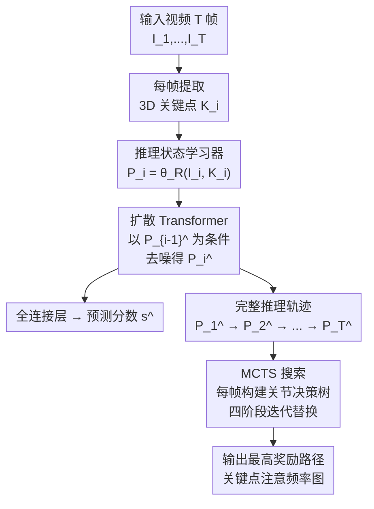

# Latent Visual Diffusion Reasoning with Monte Carlo Tree Search

**会议**: ECCV2026  
**arXiv**: [2606.27988](https://arxiv.org/abs/2606.27988)  
**代码**: [https://github.com/XiruiTeng/LVDR_Official.git](https://github.com/XiruiTeng/LVDR_Official.git)  
**领域**: 视频理解 / 多模态 VLM  
**关键词**: 动作质量评估, 视觉推理, 扩散模型, MCTS, 可解释性

## 一句话总结

提出 LVDR 框架，将细粒度技能评估中从不确定逐步收敛到确定的认知过程建模为潜空间扩散去噪，并用关键点引导的 Monte Carlo Tree Search 提取可解释的推理轨迹，在运动与手术四个数据集上取得超越 SOTA 的评分精度同时输出透明的决策依据。

## 研究背景与动机

精细化的动作技能评估——比如判断一个体操动作是否标准、一台手术操作是否熟练——比单纯的"动作识别"困难得多。动作识别只回答"做了什么"，而技能评估需要回答"做得怎么样"。这不仅要求模型捕捉低层运动动力学（关节角度、速度变化、姿态配合），还要求它能把观察到的运动特征逐步推演为高层的评价判断。现有的动作质量评估（AQA）方法在预测精度上取得了显著进步，但它们本质上都是黑盒——输入一段视频、输出一个分数，中间到底在看什么部位的什么运动、依据什么逻辑给出评分，完全不可见。在运动训练、手术教学这类高风险场景中，专家不仅需要知道评分结果，更需要知道"为什么"，才能提供有针对性的反馈或验证判断的可靠性。

这种困境的核心矛盾在于：逐帧标注推理轨迹几乎是不可能的——我们不可能为每一帧标注"模型此刻正在关注哪个关节、正在形成什么判断"。因此，过去的可解释方法要么依赖人工定义的评分规则（如 NS-AQA 用规则引擎分析视觉符号），要么只能给出每段视频对最终分数的贡献权重（如 Interpretability-AQA），都不能建模连续的、逐步推进的推理演化过程。本文提出了一个巧妙的切入角度：既然无法直接标注推理路径，就把推理本身建模为一个从不确定性到确定性的渐进过程。视频开始时模型对整体动作的理解高度"嘈杂"，随着看到更多帧逐步"去噪"收敛到准确判断——这套逻辑天然契合扩散模型的数学框架。**核心 idea：将视觉推理过程视为潜空间中的扩散去噪轨迹，模型从嘈杂初始状态沿着时间逐渐净化到目标语义分布，然后借助关键点引导的 Monte Carlo Tree Search 从中提取出与最终判断最相关的关键推理步骤，让模型在保持高分准确性的同时能"开口解释"自己的判断依据。**

## 方法详解

### 整体框架

LVDR 框架由两大组件构成：（1）潜空间视觉推理模块，将推理过程建模为沿时间维度的扩散去噪轨迹；（2）关键点引导的 MCTS，从潜推理嵌入中提取出显式可解释的视觉依据。

给定一段 T 帧视频，模型同时输出预测技能分数和每帧的关键点注意模式作为推理过程。推理模块首先对每帧提取 3D 人体关键点，与帧图像一起输入推理状态学习器得到初始推理嵌入 `P_i`。扩散 Transformer 以嵌入序列为条件，沿时间逐步去噪：后一帧的去噪结果受前一帧去噪嵌入的双向条件约束，使整个推理轨迹从"嘈杂"初始状态渐进收敛到目标分布。随后，MCTS 在每帧的潜推理嵌入上构建关键点决策树，反复搜索并选出对评分贡献最大的关键点推理路径。

### 关键设计

**1. 潜空间视觉扩散推理：把认知收敛建模为去噪过程**

核心洞察是用扩散模型的语言描述推理的演化：视频刚开始时信息极少，推理嵌入处于"高度嘈杂"状态（对应随机噪声）；随着观察到更多帧，模型逐步去噪，推理嵌入越来越接近基于完整视频语义的"干净"目标分布。这绕开了推理轨迹逐帧标注不可得的根本困难——模型只需学习一条从噪声到目标分布的轨迹，而这条轨迹本身就可以被解释为推理过程的演化。

实现上，目标分布来自专家评语文本：先用冻结的文本编码器（复用 InternVideo2.5）将评语编码为干净文本嵌入 `z_c`，再定义余弦调度的前向扩散过程逐步加噪。训练时随机采样时间步 t，学习去噪自编码器 `ε_θ` 从带噪嵌入预测添加的噪声。对于每一帧，推理状态学习器 `θ_R` 以帧图像和 3D 关键点为输入产出初始推理嵌入 `P_i`；扩散 Transformer `θ_D` 接收前一帧的去噪结果 `P_{i-1}^` 和当前帧初始嵌入 `P_i` 作为条件，输出当前帧的去噪推理嵌入 `P_i^`。这个设计的巧妙之处在于：帧间的条件依赖强制了推理轨迹的连续性——模型不能"跳跃式"地改变判断，每一次更新都必须建立在先前推理的基础上，这与人类逐步形成判断的过程一致。最终 `P_T^` 接全连接层回归预测分数。

**2. 关键点引导的 MCTS：从潜推理轨迹中提取显式注意模式**

有了潜空间中的推理轨迹，还需要把它翻译成人可以直接理解的视觉形式——模型在每一帧到底在看哪个关节、关注哪些运动线索。本文受裁判判分认知过程启发：裁判不会同时看所有身体部位，而是顺序关注不同区域（比如先看上肢再转移到了下肢），最终形成综合判断。这套顺序注意策略被建模为组合搜索问题。

在运动场景中，MCTS 每帧的树节点定义为四大主要关节（肘、肩、髋、膝），每个节点用该关节的角度 `a`、速度 `v` 和归一化 3D 位置 `p` 构成三元组 `(a, v, p)`；手术场景对应器械的三个部位（尖端、主体、尾部）。树深设为 4（运动）或 3（手术），每帧独立构建一颗搜索树。标准 MCTS 四阶段迭代执行 M 次（默认 150 次）：UCT 选择子节点 → 未访问路径扩展 → 以扩散模型 θ_D 的嵌入为模拟策略评估预期奖励 → 反向传播更新节点价值。M 次迭代后选出期望累积奖励最高的路径，该路径上的关键点序列即模型在该帧的注意焦点。

在推理阶段，先走完扩散模块获得潜推理嵌入，再对其施加 MCTS 提取显式关键点注意。关键点遮盖实验交叉验证了搜索的有效性：遮盖 MCTS 选中的关键点导致性能大幅下降（Cataract-101 准确率从 0.71 降至 0.53），遮盖未被选中的关键点则几乎无影响。用户研究也表明领域专家认为 86% 的生成推理轨迹"正确"，验证了 MCTS 定位的关键点确实与人类裁判的判断一致。

### 损失函数 / 训练策略

总损失为扩散去噪损失与分数回归损失的加权和：
`L = L_DM + λ * L_score`
其中 `L_DM` 为标准的噪声预测 MSE，`L_score` 为预测分数与真实分数的 MSE，λ 设为 1（消融实验表明 λ=1 优于 0.5 和 2）。噪声调度选择余弦调度而非线性调度（实验证明显著更优）。视觉和文本编码器冻结 InternVideo2.5 预训练权重。扩散 Transformer 为 12 层 / 16 头 / 512 维隐状态。Adam 优化器，1e-4 学习率，batch size 8，单张 NVIDIA L40S GPU。MCTS 推理时默认 150 次迭代，每帧耗时约 0.094 秒。

## 实验关键数据

### 主实验

| 数据集 | 指标 | LVDR（完整） | 之前 SOTA | 提升 |
|--------|------|-------------|-----------|------|
| EgoExo4D（综合） | ρ↑ | **0.88** | MAGR (0.73) | +0.15 |
| EgoExo4D（综合） | R-l₂↓ (×100) | **1.69** | MAGR (10.14) | -8.45 |
| JIGSAWS（综合） | ρ↑ | **0.69** | MAGR++ (0.55) | +0.14 |
| JIGSAWS（综合） | R-l₂↓ (×100) | **9.93** | MAGR++ (10.20) | -0.27 |
| FitnessAQA（OHP Elbow F1） | F1↑ | **0.818** | MAGR (0.357) | +0.461 |
| FitnessAQA（Squat Inward F1） | F1↑ | **0.920** | MAGR (0.157) | +0.763 |
| Cataract-101 | Acc↑ | **0.71** | MAGR (0.62) | +0.09 |

### 消融实验

| 配置 | EgoExo4D ρ↑ | Cataract-101 Acc↑ | FitnessAQA (肘)F1↑ | 说明 |
|------|-------------|-------------------|-------------------|------|
| 完整 LVDR | 0.88 | 0.71 | 0.818 | — |
| 去掉扩散模块 | 0.83 | 0.67 | 0.497 | 各数据集一致显著掉点 |
| 遮盖 MCTS 选中关键点 | 0.86 | 0.53 | 0.282 | 大幅掉点，证实关键点重要 |
| 遮盖 MCTS 未选中关键点 | 0.88 | 0.71 | 0.818 | 几乎不影响 |
| 线性噪声调度 | 0.85 | 0.67 | — | 不如余弦调度 |
| λ=0.5 | 0.86 | 0.67 | — | — |
| λ=2 | 0.86 | 0.67 | — | — |

### 关键发现

- 扩散模块是推理质量的核心保障：去掉后所有数据集一致掉点（FitnessAQA 肘部 F1 从 0.818 骤降至 0.497），说明单向的帧嵌入序列不足以建模推理演化，扩散过程提供的渐进去噪结构不可或缺。
- MCTS 定位的关键点确实承载了最关键的运动线索：遮盖选中的关键点使 Cataract-101 的准确率从 0.71 暴跌至 0.53，而遮盖未被选中的关键点无影响，两组对照互为证明。
- 用户研究给出有力定性证据：运动领域专家评估 86% 的 MCTS 推理轨迹为"正确"，仅 8% 被认为错误，说明模型学到的注意模式与人类裁判的判断高度一致。
- 跨领域通用性强：同一套框架在四大差异巨大的数据集（运动视频、手术视频、健身视频）上都取得 SOTA，验证了方法的通用性和稳定性。
- 推理效率可控：225 次 MCTS 迭代每帧 0.129 秒，75 次迭代仅 0.048 秒，具备向实时应用拓展的潜力。

## 亮点与洞察

- **扩散 = 推理的数学化建模**是最关键的设计：用去噪过程自然对应"从不确定到确定"的认知过程，既绕开了推理轨迹标注不可得的瓶颈，又产出了一个时间结构化的潜推理空间——这个空间本身就可视化、可分析、可搜索。
- **MCTS 的双重验证机制**很扎实：不仅有遮盖实验证明"选到的东西真的重要"，还有用户研究证明"选到的东西和人选的一样"，两组证据相互印证，使结果可信度远超单一消融实验。
- 把"裁判先看哪、后看哪"的认知心理学直觉转化为 MCTS 搜索树的节点定义，是领域知识和算法框架的优雅结合，推理结果天然具有人类可理解的语义。
- 方法不加任何领域专用修改就同时在运动（高动态姿态变换）和手术（精细工具操作）两类迥异的场景上有效，说明潜扩散推理的通用性超出了预期。

## 局限与展望

- 当前仅支持单人场景，多人/团体运动（如篮球全场配合、体操团体赛）的交互注意模式尚未覆盖。
- MCTS 节点定义依赖手动选取的关节或器械部位，在新领域（如舞蹈、乐器演奏）需要领域专家重新设计节点空间，自动化程度受限。
- 推理轨迹的质量高度依赖 InternVideo2.5 文本编码器的评语嵌入质量——当评语术语特殊或质量不高时，目标分布本身可能就是有偏的。
- 225 次 MCTS 迭代 0.129s/帧的推理速度对 30fps 的实时场景仍有差距，虽然 75 次迭代已降至 0.048s（约 21fps），但步数和精度之间尚需更系统的 Pareto 分析。

## 相关工作与启发

- **vs MAGR / MAGR++**：传统 AQA SOTA 方法，端到端回归预测分数，精度不错但完全黑盒。LVDR 在精度更高（EgoExo4D ρ 0.88 vs 0.73）的同时提供了透明推理过程。
- **vs NS-AQA / IRIS**：基于人工定义规则和评分检录表进行可解释评估，能给出解释但无法从数据中学习。LVDR 完全数据驱动，自动学出推理轨迹而不依赖预定义规则。
- **vs Interpretability-AQA**：用注意力损失 + 分段加权解释每段视频的贡献，但仍是单个权重值而非连续的推理轨迹。LVDR 建模了推理随时间演化的完整过程，可解释的信息密度更高。
- 扩散 + MCTS 结合用于推理可解释性的范式可迁移至其他视频逐步推理任务（如自动驾驶行为预测、手术步骤识别），特别是当"推理过程标注不可得"但"可做遮盖验证"的场景。

## 评分

- 新颖性: ⭐⭐⭐⭐ [将扩散模型与 MCTS 结合用于 AQA 可解释性是全新思路，但扩散+推理结合的范式有先例]
- 实验充分度: ⭐⭐⭐⭐⭐ [四个跨域数据集 + 多项消融 + 关键点遮盖 + 用户研究 + 推理速度分析，证据链完整]
- 写作质量: ⭐⭐⭐⭐ [框架清晰、图示丰富、实验编排合理，但 MCTS 四阶段描述偏模板化，部分段落可更紧凑]
- 价值: ⭐⭐⭐⭐⭐ [解决了 AQA 领域最实际的问题——缺乏可解释性，方法通用且开源，有较高应用价值]

<!-- RELATED:START -->

## 相关论文

- [\[ICLR 2026\] Latent Visual Reasoning](../../ICLR2026/vlm_reasoning/latent_visual_reasoning.md)
- [\[CVPR 2026\] Thinking Diffusion: Penalize and Guide Visual-Grounded Reasoning in Diffusion Multimodal Language Models](../../CVPR2026/vlm_reasoning/thinking_diffusion_penalize_and_guide_visual-grounded_reasoning_in_diffusion_mul.md)
- [\[CVPR 2026\] Latent Implicit Visual Reasoning](../../CVPR2026/vlm_reasoning/latent_implicit_visual_reasoning.md)
- [\[ACL 2025\] VisuoThink: Empowering LVLM Reasoning with Multimodal Tree Search](../../ACL2025/vlm_reasoning/visuothink_empowering_lvlm_reasoning_with_multimodal_tree_search.md)
- [\[CVPR 2026\] Thinking in 360°: Humanoid Visual Search in the Wild](../../CVPR2026/vlm_reasoning/thinking_in_360deg_humanoid_visual_search_in_the_wild.md)

<!-- RELATED:END -->
