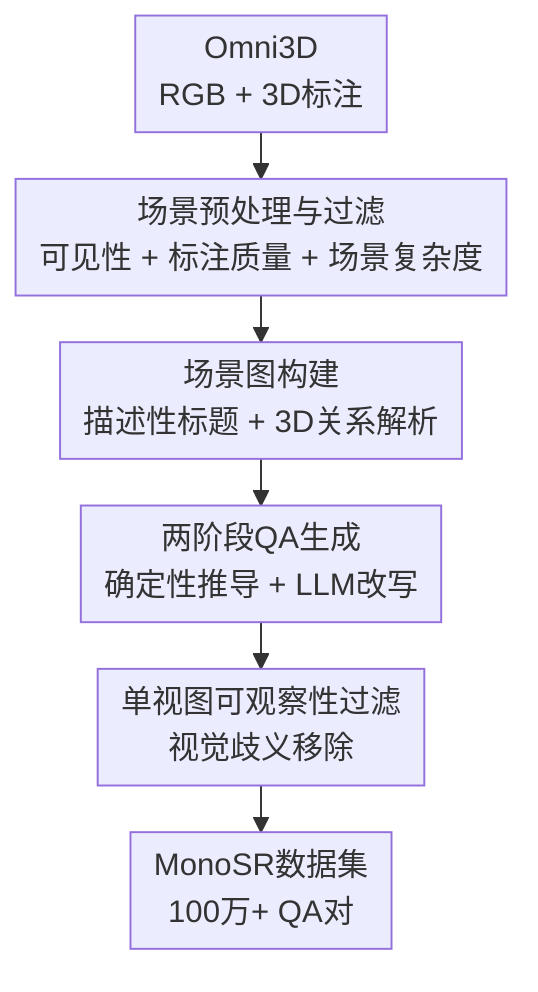

# MonoSR: Open-Vocabulary Spatial Reasoning on Monocular Images

**会议**: ECCV 2026  
**arXiv**: [2511.19119](https://arxiv.org/abs/2511.19119)  
**代码**: 无  
**领域**: 多模态VLM  
**关键词**: 单目空间推理、开放世界、VLM基准、空间VQA、单视图可回答性

## 一句话总结
MonoSR 构建了首个大规模开放世界单目空间推理数据集（100万+ QA对，覆盖室内/室外/物体中心三大场景共98个语义类别），通过四阶段可观察性过滤机制保证每对QA均可从单张RGB图像回答，并系统性评测了7个开源/闭源VLM以及多种辅助信息对空间推理能力的影响。

## 研究背景与动机

**领域现状**：空间推理（Spatial Reasoning, SR）是VLM应用于具身智能等物理世界场景的关键能力。然而，现有空间推理数据集和评测基准几乎全部依赖多视角图像、视频序列或点云——这些输入隐式提供了几何线索，使模型不必从单张图像推演三维结构。与此同时，已有基准严重局限于室内场景，聚焦于低层感知任务，缺乏对高层空间想象和开放世界泛化的覆盖。

**为什么之前没人做**：构建单目空间推理数据集面临三个根本壁垒。第一，空间量必须相对于相机坐标系定义而非绝对世界坐标系，否则在单视图约束下答案无法确定。第二，遮挡、截断、标注噪声导致的大量不可回答问题必须系统性地识别并排除。第三，透视想象类任务的标注需要刚性几何变换而不是直接观察图像，这使得数据生成比已有的多视角方案复杂得多。

**做这件事为什么现在才可能**：Omni3D 等大规模单目3D检测数据集的出现提供了高质量的多域3D标注（230K图片、覆盖室内/室外/物体中心），而LLM的成熟使得问题文本可以自动化多样化改写以消除模板偏置。这两个使能因素让大规模单视图空间推理数据集的构建第一次变得可行。

**本文的设计选择**：MonoSR 直接基于 Omni3D 的3D标注和RGB图像，通过"场景预处理→场景图构建→两阶段QA生成（确定性推导+LLM改写）→四阶段可观察性过滤"这条严格的管线确保数据质量。任务按人类认知层级分为三个层次（基础感知、透视想象、情景推理），每个层次的设计都有明确的几何约束和可回答性保障。在此基础上，论文进一步通过系统性注入辅助信息（场景类别、2D视觉提示、3D框）来量化当前VLM在单目空间推理上的几何信息差距。

**核心 idea**：通过从真实3D标注中确定性推导QA答案并辅以严格的可观察性过滤，构建一个覆盖室内/室外/物体中心场景、支持训练和评测的大规模单目空间推理数据集，并在此基础上系统性地量化当前VLM在单目空间推理上的能力边界与关键瓶颈。

## 方法详解

### 整体框架

MonoSR 的整体构建流程可分为四个阶段。输入来自 Omni3D 的 RGB 图像及其对应的 3D 边界框标注；输出为超过 100 万 QA 对，每个问题都保证可从单张 RGB 图像回答。

第一阶段为**场景预处理与过滤**：对原始 Omni3D 场景进行严格的质量筛选，排除被截断过多（>0.4）、遮挡过多（>0.6）或投影面积过小（<400 px²）的实例；丢弃几何不一致或退化的3D框（如尺寸>20m、体积接近零、2D投影与3D脚印偏差>30%）；控制每张图片的有效实例在3-40个之间，在丰富性与噪声之间取得平衡。

第二阶段为**场景图构建**：为筛选后场景中每个显著物体生成细粒度的描述性标题，解析物体间的3D关系（包括空间关系、相对位置、尺寸对比），构建结构化场景图作为后续QA生成的基座。

第三阶段为**QA数据生成**：采用两阶段混合策略。第一阶段所有答案从3D标注确定性推导——基础感知类任务的答案直接根据物体坐标计算，透视想象类任务通过刚体变换和几何一致性检查获得答案，通过预定义模板将答案与问题配对。第二阶段利用LLM对问题文本进行释义和多样化改写，保留正确答案但生成更自然的语言风格，消除模板偏置。

第四阶段为**单视图可观察性过滤**：对生成的QA对进行第四级质量检查——排除视觉上无法区分答案的问题（如深度模糊对在图像上像素投影间距<20px的样本），确保最终数据集中残存的不可回答问题低于1.4%。

### 关键设计

**1. 三层次认知任务体系：从基础感知到情景推理**

MonoSR 设计了 8 个空间推理任务，按人类认知层级组织为三个层次，分层次系统地评估单目空间理解。第一层**基础3D感知**（Foundational 3D Perception, 占52% QA对）评估最基本的几何与空间属性，包含空间关系（SR）、大小估计（Size）、距离测量（Dist）、尺寸比较（Dim）四个子任务，答案直接从物体3D坐标通过确定性计算得出。第二层**透视想象**（Perspective-Aware Imagination, 占38%）评估从非观察视角回答问题的能力，包含遮挡判断（OJ）、透视关系（PR）、物体定位（OG）三个子任务——要求模型具备隐式的视角想象和空间一致性保持能力，答案通过刚体变换和几何一致性检查获得。第三层**情景推理**（Situational Reasoning, 占10%）模拟真实世界场景，要求模型整合视觉场景信息与常识知识进行复杂推理，解决方案是为LLM分配专家角色（如安全员、机器人专家）并赋以动机从句，将问题锚定在真实操作上下文中。每个任务都支持 Yes/No、Multiple-Choice、Numerical 三种格式。这种分层设计不仅用于训练，也支持细粒度的诊断性评测——通过对比模型在不同层级的表现可以精确定位能力短板。

**2. 四阶段单视图可回答性保证：数据的质量基石**

这是 MonoSR 最核心的设计约束——每个 QA 对都必须在仅看到单张 RGB 图像的情况下可回答。该保证通过四级过滤流水线逐级收紧：(i) 实例可见性——截断 < 0.4、遮挡 < 0.6、投影面积 > 400 px²，从源头淘汰大量因视角问题无法判断的实例；(ii) 3D 标注质量——丢弃退化的边界框（尺寸>20m、近零体积、2D-3D投影偏差>30%），避免因标注噪声产生错误答案；(iii) 场景复杂度——每张图保留3-40个有效实例，复杂度过低缺乏推理素材，过高则引入不可控标注噪声；(iv) QA 歧义性——移除那些在2D图像上无法区分答案的问题（如前后两个物体深度差值对应像素间距<20px）。经人工审计验证，残存不可回答问题仅占 < 1.4%。该机制是 MonoSR 区别于 ScanQA、SQA3D 等室内多视图基准的核心差异——后者不设此约束，QA 可能依赖于多视图间对比信息或深度线索，因此无法公正评测单目视觉能力。

**3. 辅助信息注入分析框架：量化几何信息差距的方法论**

MonoSR 不仅是一个数据集，还提供了一套系统的实验范式来量化当前 VLM 在单目空间推理上的能力边界。具体方案是将三类辅助信号以可控方式注入 VLM 输入，对比不同配置下的性能差异：(a) **场景信息 (SI)**——通过文本告知模型输入图像的场景类型（室内/室外/物体中心），提供高层上下文先验；(b) **2D 视觉提示 (2D VP)**——在图像上标出检测到的物体的 2D 坐标框（通过视觉通道输入），提供局部的2D空间锚点；(c) **3D 边界框 (3D Bbox)**——以文本形式给出物体的 3D 中心坐标、尺寸和朝向（作为几何信息的 oracle 上界——并非实用方案，而是受控探针）。该框架的核心洞察是：通过比较"仅 MonoSR 微调"和"+3D框"之间的差距，可以精确量化当前单目 VLM 缺失的几何信息量，而这个差距正是未来单目感知模块（如度量深度估计、单目3D检测）需要填补的目标。实验在两个不同架构的骨干（Qwen-2.5-VL-3B 和 InternVL-3.5-2B）上重复验证，确保趋势跨模型族一致。

### 一个完整示例：室内场景问答生成

以一张包含"椅子在桌子左边"的室内图像为例，MonoSR 的 QA 生成流程如下：

1. **场景预处理**：Omni3D 标注中记录了椅子的 3D 边界框 (x=1.2, y=0.5, z=2.3, w=0.6, h=0.9, l=0.6) 和桌子的 3D 框 (x=2.8, y=0.4, z=2.1, w=1.2, h=0.8, l=1.0)。两物体截断 < 0.4，遮挡 < 0.2，投影面积 > 400 px²，无几何退化——通过第(i)(ii)级过滤。图片有效实例数15个——通过第(iii)级过滤。

2. **场景图构建**：椅子被描述为"一把棕色木椅，位于房间左侧"；桌子被描述为"一张白色方桌，位于房间中央偏右"；场景图记录关系 "椅子 x=1.2 < 桌子 x=2.8 → 椅子在桌子左边"。

3. **第一阶段QA生成**：从3D坐标计算两物体的空间关系——比较 x 坐标（1.2 < 2.8），确定性答案"左边"。通过模板生成问题 "椅子是在桌子的左边还是右边？" + 答案 "左边"。

4. **第二阶段LLM改写**：LLM 将问题改为 "从拍摄者角度看，房间里的椅子相对于桌子在哪一侧？" 保留答案不变，语言风格更自然。

5. **第四级过滤**：检查该问题在2D图像上的可区分性——椅子与桌子在2D投影水平间距约80px > 20px阈值，视觉上明确可答——通过。

6. **入库**：该 QA 对被分配为 Multiple-Choice 格式（选项：左边/右边/前方/后方），标注认知层级为"基础感知-空间关系"，进入训练集或评测集。

### 损失函数 / 训练策略

在辅助信息实验中，MonoSR 对 Qwen-2.5-VL-3B 和 InternVL-3.5-2B 两个骨干模型在完全相同的辅助输入配置下进行监督微调。每个配置仅改变注入的辅助信号类型，保持批次大小、学习率、训练轮数等超参数一致。数值型问题采用自适应阈值评估：预测值与真值的相对误差 $|\frac{\hat{d}-d}{d}| < 10\%$ 即视为正确，并按 5% 更严阈值进行敏感性分析，确认模型排名不受阈值选择影响。在所有配置下，验证集上残存不可回答问题均 < 1.4%，保证评测不因数据噪声而产生偏差。

## 实验关键数据

### 主实验：与现有空间推理基准对比

| 数据集 | 室内 | 室外 | 物体中心 | 图片数 | QA对数 | 单目专用 | 支持训练 |
|--------|------|------|----------|--------|--------|----------|----------|
| ScanQA | ✓ | ✗ | ✗ | 800 | 41K | ✗ | ✓ |
| SQA3D | ✓ | ✗ | ✗ | 650 | 33K | ✗ | ✓ |
| EmbSpatial-Bench | ✓ | ✗ | ✗ | ~2K | 3.6K | ✗ | ✗ |
| SPHERE | ✓ | ✗ | ✗ | ~3K | ~6K | ✓ | ✗ |
| OmniSpatial | ✓ | ✗ | ✗ | 6.5K | 8.4K | ✓ | ✗ |
| VSI-Bench | ✓ | ✗ | ✗ | 288 | 5K | ✗ | ✗ |
| SpatialBot | ✓ | ✓ | ✗ | 743K | 743K | ✗ | ✓ |
| InternSpatial | ✓ | ✓ | ✓ | — | 12M | ✗ | ✓ |
| **MonoSR (ours)** | ✓ | ✓ | ✓ | 230K | 1M+ | ✓ | ✓ |

MonoSR 是唯一同时覆盖室内、室外、物体中心三大场景、且为单目输入专门设计的大规模可训练数据集。与纯诊断性基准（SPHERE 6K、OmniSpatial 8.4K）不同，MonoSR 的规模（1M+ QA）使单目空间推理的大规模训练和开放世界评测首次成为可能。

### 消融实验：辅助信息对空间推理的影响

| 配置 | Indoor Overall | Outdoor Overall | Object-Centric Overall |
|------|---------------|----------------|------------------------|
| Qwen-2.5-VL-3B baseline (无微调) | 0.283 | 0.302 | 0.052 |
| + MonoSR FT (无辅助信息) | 0.494 | 0.442 | 0.335 |
| + SI (场景信息) | 0.566 | 0.558 | 0.381 |
| + 2D VP (2D视觉提示) | 0.585 | 0.576 | 0.437 |
| + 3D bbox (3D框, oracle上界) | 0.722 | 0.723 | 0.986 |
| + 2D VP + 3D bbox (最优组合) | 0.798 | 0.768 | 0.996 |
| + 2D VP + 3D bbox (全量物体) | 0.767 | 0.732 | 0.988 |

### 关键发现

- **仅 MonoSR 微调已大幅提升性能**：Qwen-2.5-VL-3B 在室内场景从 0.283 提升至 0.494（+74.6%），InternVL-3.5-2B 从 0.301 提升至 0.483，验证了 MonoSR 提供有效的空间监督信号，激活了基础模型中已有的潜在推理能力。
- **3D 框是最大贡献者**：加入 3D 边界框后性能跃升至接近完美（物体中心场景从 0.335→0.986），说明当前 VLM 的核心瓶颈在于无法从单张图像恢复精细的 3D 几何信息，而非物体识别或语义理解。
- **辅助信息并非越多越好**：为场景中所有检测物体提供完整 2D VP + 3D bbox 的"全量"配置反而比仅对目标物体提供时性能下降（室内 0.798→0.767），说明无关信号会分散模型注意力——未来单目感知模块应聚焦于选择性几何信号注入而非全量输入。
- **物体中心场景是所有 VLM 的阿克琉斯之踵**：通用 VLM（LLaVA-OV-72B 降至 0.087，ChatGPT-4 降至 0.069）在物体中心场景的数值估计上性能崩溃，而 SpatialVLM（0.618）凭借其几何感知训练管线拉开显著差距，表明精确的度量推理是当前 VLM 最薄弱环节。

## 亮点与洞察

- **单视图可回答性保证是 MonoSR 的灵魂设计**：四级过滤机制从根本上解决了"这个问题到底能不能从一张图回答"这一核心问题，使 MonoSR 成为目前唯一真正支持单目评测的空间推理数据集。很多现有基准虽然自称"单目"，但问题和答案实际上依赖于多视角间对比线索。
- **3D oracle 实验框架的设计精巧之处**：通过将 3D 框视为几何信息的"上界"、2D 视觉提示作为"2D锚点"、场景信息作为"上下文先验"进行对照，实验框架允许量化"当前 VLM 离完美几何理解还差多少"——这种定量化指导比笼统地说"VLM 表现差"更有工程实践价值。
- **"选择性优于全量"的反直觉发现**：为所有物体提供 3D 框反而降低性能，说明注意力机制在无关信息面前并非免疫——这个发现对未来单目感知模块的设计有直接的工程指导意义。
- **跨模型族的验证增强了结论的可信度**：在两个不同架构的骨干（Qwen 和 InternVL）上重复辅助信息实验得到一致趋势，说明主要结论不是某个特定模型的特性。

## 局限与展望

- **仅覆盖静态场景**：MonoSR 目前不处理视角不确定性下的推理（如从超出透视想象几何变换的新视角或遮挡视角预测空间关系）。作者提出可能需要结合神经渲染或场景补全作为数据生成骨干来弥合这一缺口。
- **3D oracle 差距尚未在实际系统中填补**：辅助信息实验揭示了 3D 框作为几何信息上界的巨大优势，但在实用单目系统中实现接近此上界的性能仍是开放挑战。作者计划将度量深度估计和单目3D检测模块直接集成到 VLM 架构中，以辅助信息分析结果为蓝图有选择性地注入几何信号。
- **RL 后训练是有前景的未探索方向**：基于强化学习的后训练（RL-based post-training）在无需额外标注数据的情况下改善空间推理能力是一条值得探索的路径，作者已明确计划在 MonoSR 训练集上开展相关工作。
- **物体中心场景的"维度灾难"有待突破**：物体中心场景的性能极度依赖于 3D 框注入——当移除 oracle 信号后几乎所有模型都表现不佳，表明从单一视角精确估计单个物体的尺寸和距离是一个本质性的难题，可能需要新的归纳偏置（如尺寸先验、类别级别的物理约束）来实现突破。

## 相关工作与启发

- **vs SpatialVLM / VLM3R / SpatialBot**：这些方法或数据集设计用于多视图/深度增强输入，并非单目优先。MonoSR 填补了明确针对单目输入约束下的空间推理数据集空白——其直接对比价值在于揭示了"多视图"和"单目"间的巨大性能鸿沟。
- **vs SPHERE / OmniSpatial**：这两个基准虽为单目专用，但规模极小（<10K QA，仅室内），仅适用于评测不适用于训练。MonoSR 以 100 倍以上的规模弥补了这一短板，使"在单目数据上训练→在开放世界评测"的管线变为现实。
- **vs SeeGround / Perception-Aware Reasoning**：这些方法从算法侧解决单目空间推理（渲染查询对齐视图、显式物体感知视觉定位），而 MonoSR 从数据侧提供了训练和评测的基础设施。两者天然互补——用 MonoSR 训练、用这些方法做推理管线是未来的自然结合方向。
- **vs Qwen-2.5-VL / InternVL / Gemini**：通用 VLM 在空间推理上的系统性不足通过 MonoSR 的多维评测被精准定位到"度量估计从单张物体中心视图"这一最薄弱环节，为 VLM 的下一个能力突破提供了明确靶点。

## 评分

- 新颖性: ⭐⭐⭐⭐ [首个大规模开放世界单目空间推理数据集，四阶段可观察性过滤和辅助信息分析框架均有独创性，但整体贡献类别为数据+评测设施而非方法论]  
- 实验充分度: ⭐⭐⭐⭐⭐ [覆盖7个SOTA VLM、3场景域、3认知层级、阈值敏感性分析、长尾分类评测、辅助信息多组合消融，实验设计系统且完整]  
- 写作质量: ⭐⭐⭐⭐⭐ [动机清晰、设计详实、实验分析深入、图表配套完善，整体组织连贯、论证有力]  
- 价值: ⭐⭐⭐⭐⭐ [填补了单目空间推理在大规模数据上的关键空白，直接服务于具身智能/自动驾驶等关键应用领域，长期可能类似 VQA-v2 对视觉问答的推动作用]

<!-- RELATED:START -->

## 相关论文

- [\[CVPR 2026\] Decompose and Transfer: CoT-Prompting Enhanced Alignment for Open-Vocabulary Temporal Action Detection](../../CVPR2026/vlm_reasoning/decompose_and_transfer_cot-prompting_enhanced_alignment_for_open-vocabulary_temp.md)
- [\[CVPR 2026\] From Indoor to Open World: Revealing the Spatial Reasoning Gap in MLLMs](../../CVPR2026/vlm_reasoning/from_indoor_to_open_world_revealing_the_spatial_reasoning_gap_in_mllms.md)
- [\[ICLR 2026\] Medical Thinking with Multiple Images](../../ICLR2026/vlm_reasoning/medical_thinking_with_multiple_images.md)
- [\[ICLR 2026\] Thyme: Think Beyond Images](../../ICLR2026/vlm_reasoning/thyme_think_beyond_images.md)
- [\[CVPR 2026\] Fast Reasoning Segmentation for Images and Videos](../../CVPR2026/vlm_reasoning/fast_reasoning_segmentation_for_images_and_videos.md)

<!-- RELATED:END -->
