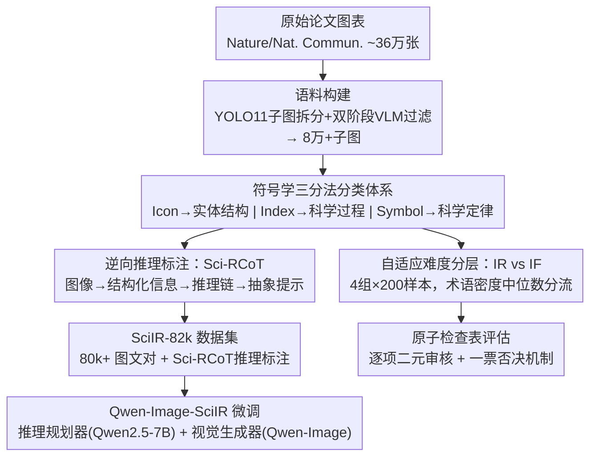

# SciIR: A Large-scale Training Dataset and Benchmark for Scientific Image Reasoning Generation

**会议**: ECCV 2026  
**arXiv**: [2606.30124](https://arxiv.org/abs/2606.30124)  
**代码**: [https://github.com/MAIR-Lab-HUST/SciIR](https://github.com/MAIR-Lab-HUST/SciIR) (有)  
**领域**: 多模态VLM / 图像生成  
**关键词**: 科学图像生成, 符号学三分法, 推理链, 原子检查表, 基准测试  

## 一句话总结
本文以皮尔士符号学三分法（Icon/Index/Symbol）为理论框架，构建了 SciIR-82k（80k+ 科学图文对 + 逆向推理链标注）和 SciIR-Bench（原子检查表驱动的细粒度评估基准），并通过微调得到 Qwen-Image-SciIR，将 SciIR-Bench 最终得分从 35% 提升至 43%，系统性地揭示了当前 T2I 模型在科学推理上的严重缺陷。

## 研究背景与动机

T2I 模型在写实图像生成上已取得显著进展，但在科学图像生成领域仍存在根本性困境：即使最先进的闭源模型（如 Nano-Banana-Pro）也频繁产出"视觉上合理但事实上错误"的结果。这种困境源于三个互相纠缠的瓶颈：（1）**数据层面**——高质量科学图表缺乏显式推理标注，现有数据集只有描述性 caption，没有"视觉逻辑"；（2）**评估层面**——现有 benchmark（如 T2I-CompBench、GenEval++）只衡量感知质量和 prompt 对齐，缺乏对科学正确性的细粒度诊断；（3）**模型层面**——开源 T2I 模型缺乏领域知识内化能力，在拓扑约束、反应因果等硬约束上频繁产生幻觉。

为什么之前没有人系统性地做这件事？因为科学图像的"正确性"本身就是一个难以形式化的多维概念——一张物理示意图需要同时满足实体拓扑、过程因果和定律约束，这三个维度彼此纠缠，用单一指标（如 FID、CLIPScore）无法拆解。更重要的是，大规模获取科学图文对并进行推理标注需要跨学科专业知识，纯人工标注成本不可承受。

为什么现在可以做了？关键使能因素是成熟的多模态大模型（如 Qwen3-VL、Gemini-3-Pro），它们具备从图像中提取结构化科学信息的能力，使得"用 VLM 自动标注科学推理"成为可行方案。本文的设计选择是将皮尔士符号学三分法引入科学图像生成领域，把科学正确性拆解为实体结构（Icon）、科学过程（Index）和科学定律（Symbol）三个可独立验证的维度，并通过"从图像反推推理链"的逆向工程策略实现大规模自动化标注。

**核心 idea**：用符号学三分法将科学图像的正确性形式化为三个可验证维度，通过 VLM 从真实图像逆向重建推理链（Sci-RCoT）实现大规模标注，再用原子检查表（Atomic Checklist）的一票否决机制实现细粒度评估。

## 方法详解

### 整体框架
SciIR 的整体设计分为两大部分：**数据集构建（SciIR-82k）**和**基准评估（SciIR-Bench）**，两者共享同一套符号学三分法理论框架。

数据集构建采用三阶段流水线：首先从 Nature 和 Nature Communications 的 CC BY 4.0 论文中提取约 36 万张原始图表，用 YOLO11 做多面板子图拆分、InternVL3.5 做双阶段质量过滤，得到 8 万+高质量子图；然后由 Qwen3-VL 对每张图在实体结构（Entity Structure）、科学过程（Scientific Process）、科学定律（Scientific Law）三个轨道上打分，实现符号学分层；最后通过"逆向推理"策略——Qwen3-VL 从图像中提取结构化信息，合成 Sci-RCoT 推理链，再由 Qwen3-Max 将推理链蒸馏为紧凑的抽象 prompt。

基准评估从 SciIR-82k 中精选 800 个高难度样本，按符号学轨道交叉分为四组（全三维交叉 + 三种两两交叉，每组 200），并在每组内按术语密度中位数二分为"内在推理（IR）"和"指令遵循（IF）"两个难度级别。评估时，Gemini-3-Pro 先从 ground-truth 推理数据生成原子检查表（逐项二元问题），再作为"审稿人"对生成图像逐条审核，最终采用一票否决制计算 Accuracy Score。

### 关键设计

**1. 符号学三分法分类体系：把科学推理拆成三层可独立验证的认知维度**

现有 T2I 评估将"科学正确性"当作一个不可拆分的黑盒指标，导致模型在哪类错误上失败完全不可诊断。本文借鉴皮尔士符号学三分法（Icon/Index/Symbol），将科学图像的正确性分解为三个正交维度：（1）**实体结构（Entity Structure, Icon）**——评估几何层次重建和空间对齐，如分子拓扑是否正确、细胞结构是否完整；（2）**科学过程（Scientific Process, Index）**——评估因果/时序关联，如状态转移方向、实验流程步骤是否正确；（3）**科学定律（Scientific Law, Symbol）**——评估抽象规则遵守，如能量守恒、化学价键规则、电荷分配是否正确。

在数据构建阶段，Qwen3-VL 对每个样本在三个轨道上打分 $s \in [1, 10]$，通过阈值 $\tau=7$ 做多热编码，三轨道得分全部低于 $\tau$ 的低推理含量样本被剔除。在基准评估阶段，通过轨道交叉生成四个评估组，迫使模型同时处理多维度约束的冲突合成。这种分解使"科学正确性"从一个模糊概念变成了可逐维度诊断的工程问题。

**2. 逆向推理标注：从真实图像反推 Sci-RCoT 推理链**

传统 T2I 数据标注是"正向"的——从 prompt 直接到图像，标注内容仅有 captions 而缺乏推理过程。本文的核心创新是逆转这一流程：从 ground-truth 图像出发，用 VLM 重建出"如果要从零生成这张图，需要经历怎样的科学推理步骤"。

具体分三步：第一步，Qwen3-VL 以"Image >> Caption >> Text"的优先级从图像中提取结构化信息，输出 JSON 格式的 Terms（经过图像验证的科学实体和术语）和 Visualization（几何形态、布局等视觉接地描述）；第二步，Qwen3-VL 重新审视图像，将离散的推理单元整合为连续的 Sci-RCoT（Scientific Reasoning Chain-of-Thought）——一段描述从抽象概念到具体空间布局的因果推理过程，明确桥接符号推理与整体场景合成；第三步，Qwen3-Max 通过"术语替换"策略将 Sci-RCoT 蒸馏为紧凑 prompt：用规范科学术语替换视觉描述，仅保留显式要求的文字渲染，最终产出一个同步的（抽象 prompt, 保留文字）对。

这一逆向工程策略的关键在于：它不依赖人工专家逐张标注，而是利用 VLM 的视觉理解和推理能力实现大规模自动化标注，产出的 Sci-RCoT 既是训练信号（告诉模型"从 prompt 到图像应该经历怎样的推理"），也是评估锚点（为原子检查表提供 ground-truth 推理依据）。

**3. 自适应难度分层：分离"指令遵循"与"内在推理"**

在科学图像生成中，模型得分高可能有两种截然不同的原因：一是模型真正内化了领域知识，能从抽象概念自主推理出正确的空间布局和因果逻辑；二是模型只是忠实地执行了提示中的详细视觉指令（而后者本身已是正确答案的密文描述）。如果不加区分，两种能力会被混淆。

本文通过术语密度（term density）的中位数进行自适应分流：**高术语密度样本（$\geq$ 中位数）**被分配 Sci-RCoT 作为输入，测试模型在密集视觉蓝图下的指令遵循能力（Instruction Following, IF）——此时提示已包含足够的结构信息，模型只需忠实渲染；**低术语密度样本（$<$ 中位数）**仅获得抽象 prompt，测试模型用潜在领域知识自主推理的能力（Intrinsic Reasoning, IR）——信息稀疏迫使模型"自己补全"科学约束。

这种设计的巧妙之处在于：术语密度本身就是信息饱和度的代理指标，用中位数自适应分流无需人工标注难度，且结果可解释——大多数模型在 IF 模式下显著优于 IR 模式（如 FLUX.1-Kontext-Max 从 13% 跳到 36%），证实了它们擅长执行而非推理；而部分开源模型在 IR 下反超 IF，恰好暴露了它们处理长文本指令时的 prompt overflow 问题。

**4. 原子检查表评估：把科学正确性变成逐项可验证的二元问题，采用一票否决制**

传统的 FID、CLIPScore 等指标测量的是图像整体与参考的分布相似度或语义对齐度，无法检测"分子拓扑错了一个键""电荷符号标反"这类局部的、但致命的科学错误。本文提出**原子检查表（Atomic Checklist）**评估协议，模仿同行评审的严谨性。

检查表生成严格以术语为驱动：对 ground-truth 推理结构中出现的每个科学术语，Gemini-3-Pro 生成一个对应的二元验证问题，每个问题仅验证一个语义原子的视觉表现（如"蛋白质的 alpha 螺旋形态是否正确""反应箭头的方向是否从左到右"）。为抑制评估 VLM 的幻觉，额外注入对抗性问题（如检验是否存在不可能化学键）。审核阶段，评估 VLM 必须先定位图像中的具体视觉元素并描述，再给出 Yes/No 判决。

得分计算采用严格的**一票否决制（veto mechanism）**：一个样本在某个科学轨道（如 Scientific Law）上有效，当且仅当它通过了该轨道下的**所有**原子检查。形式化地，$V_{i,c} = \prod_{q \in Q_{i,c}} s(q)$，其中 $s(q) \in \{0, 1\}$ 是单题得分，最终轨道准确率 $Accuracy\ Score_c = \frac{1}{|D|}\sum_{i \in D} V_{i,c}$。这种严苛设计反映了科学传播对错误的零容忍——一个错键就让整张图"不合格"。与人类专家评分的一致性分析（Pearson's r=0.692，远高于 VQAScore 的 0.457）验证了这种评估的有效性。

### 损失函数 / 训练策略

Qwen-Image-SciIR 采用两阶段 LoRA 微调，显式解耦推理与生成。推理规划器基于 Qwen2.5-7B-Instruct，在 (prompt, Sci-RCoT) 对上做全线性层 LoRA 微调（r=64, $\alpha$=16），学习率 $1 \times 10^{-4}$，最大上下文 2048 tokens，训练 1 个 optimization step。视觉生成器基于 Qwen-Image-2512，在 (Sci-RCoT, image) 对上做扩散 Transformer 层的 LoRA 微调（r=32），分辨率 $1024 \times 1024$，同样学习率 $1 \times 10^{-4}$ 和 1 个 optimization step。推理时采用链式流程：推理规划器先从输入 prompt 推断完整 Sci-RCoT，视觉生成器再基于该推理链生成最终图像。训练前从 SciIR-82k 中移除了 SciIR-Bench 的 800 个测试样本以保证零样本评估的公平性。

## 实验关键数据

### 主实验

12 个 T2I 模型（闭源 4 个、开源扩散 4 个、开源自回归 3 个、微调模型 1 个）在 SciIR-Bench 上的评估结果如下（选自 Table 3 的核心模型）。

| 模型 | SL (%) | ES (%) | SP (%) | Text (%) | Final (%) |
|------|--------|--------|--------|----------|-----------|
| Nano-Banana-Pro (闭源) | 96 | 95 | 97 | 90 | **95** |
| GPT-Image-1 (闭源) | 62 | 76 | 72 | 41 | 62 |
| Seedream 4.5 (闭源) | 49 | 63 | 60 | 47 | 55 |
| FLUX.1-Kontext-Max (闭源) | 17 | 31 | 28 | 9 | 22 |
| Qwen-Image-2512 (开源扩散) | 40 | 50 | 37 | 15 | 35 |
| Flux-Dev (开源扩散) | 11 | 11 | 12 | 1 | 9 |
| HiDream-L1-Full (开源扩散) | 13 | 20 | 16 | 2 | 13 |
| SD 3.5 Large (开源扩散) | 5 | 10 | 6 | 0 | 5 |
| Show-o2-7B (开源自回归) | 20 | 28 | 28 | 8 | 21 |
| BAGEL-7B-MoT (开源自回归) | 2 | 2 | 2 | 0 | 2 |
| **Qwen-Image-SciIR (微调)** | 43 | 59 | 53 | 15 | **43** |

### 消融实验

对 Qwen-Image-SciIR 的三个核心组件做消融（Table 6）。

| 配置 | SL | ES | SP | Text | Final | 说明 |
|------|----|----|----|------|-------|------|
| Qwen-Image-2512 (基线) | 40 | 50 | 37 | 15 | 35 | 未微调原始模型 |
| w/o Sci-RCoT | 41 | 54 | 39 | 15 | 38 | 去掉推理链标注，仅用普通 prompt 训练 |
| w/o Taxonomy | 41 | 54 | 45 | 15 | 39 | 去掉符号学三分法分层，统一训练 |
| w/o Planner | 42 | 56 | 49 | 14 | 41 | 去掉推理规划器，直接端到端微调 |
| **Full (Qwen-Image-SciIR)** | 43 | 59 | 53 | 15 | **43** | 完整模型 |

### 关键发现

- **闭源 vs 开源的鸿沟极大**：Nano-Banana-Pro 以 95% 的 Final Score 证明任务本身可解，但最强开源模型 Qwen-Image-2512 仅 35%，差出 60 个百分点。差距最大的是 Scientific Law（96% vs 40%），说明开源模型几乎没有内化物理/化学定律约束。
- **所有模型的共同短板是 Text**：即使最强的闭源模型 Nano-Banana-Pro 在 Text 轨道也只有 90%，开源模型普遍低于 15%。这意味着当前 T2I 模型在科学标注的文字渲染上存在根本性缺陷，无论扩散还是自回归架构均如此。
- **推理规划器贡献最大**：去掉 Planner 后 Final Score 从 43% 降到 41%（-2pp），而 Scientific Process 掉得最多（53% → 49%），说明显式推理模块对过程类科学图像（涉及多步因果链）最为关键。
- **Sci-RCoT 标注的收益在 SP 最明显**：去掉 Sci-RCoT 后 SP 从 53% 降到 39%（-14pp），远超 ES（59% → 54%）和 SL（43% → 41%），说明推理链标注对时序/因果类图像的生成质量提升最大。
- **评估稳定性已验证**：更换评判模型（GPT-5.5、Claude-4.6、Qwen3.5）、调整评分标准（Strict vs 80% 阈值 vs Avg. Pass）、改变检查表措辞（Original vs Reordered vs Violation vs Concise），模型排名保持稳定，证明原子检查表评估框架是鲁棒的。

## 亮点与洞察

- **符号学三分法作为分类框架是一个巧妙的跨学科迁移**：皮尔士的 Icon/Index/Symbol 三分法诞生于 20 世纪初的符号学，本文将其平移到科学图像生成领域，天然地为"科学正确性"提供了三层正交的分类——结构/过程/定律分别对应"是什么/怎么变/为什么"。这种分类不是简单的 taxonomy 贴标签，而是直接驱动数据构建、标注策略和评估协议的全局设计原则。
- **"逆向推理标注"是一种可复用的大规模数据标注范式**：从真实图像反推推理链，用 VLM 替代人工专家做结构化信息提取和逻辑重建，这套"Image → Structured Info → CoT → Prompt"的逆向管线不仅适用于科学图像，任何需要推理标注的视觉领域（如医学影像、工程制图、法律证据图）都可以借鉴。
- **原子检查表 + 一票否决制是对科学评估的精准建模**：科研审稿和科学传播中，一个关键错误就足以否定整张图——你不可能因为"大部分键画对了"就给一张错了一个键的分子结构图打及格分。本文把这种"科学领域的零容忍"用 veto mechanism 形式化，且通过 human correlation 验证了这种严格性确实与专家判断一致（Pearson r=0.692 vs VQAScore 0.457）。
- **IR vs IF 的分层设计揭示了当前模型的真实能力构成**：如果不分层，所有模型看起来都"部分可用"；一旦拆开，就会发现大多数模型的"好成绩"来自指令遵循而非真正的科学推理。这个洞察对后续研究有重要指导：改进方向应该在知识内化而非更好的指令执行。

## 局限与展望

- **数据偏见**：SciIR-82k 全部来自 Nature 和 Nature Communications，偏向已发表的标准化图表风格，对非典型示意图、手绘风格、预印本中的非正式图表覆盖不足。这可能使下游模型对"正式出版物美学"过拟合。
- **评估维度缺审美**：SciIR-Bench 只评估科学正确性，不评估视觉美学——这在科学场景下是合理的取舍，但实际应用中（如论文配图生成）美感和可读性同样重要。
- **原子检查表的完备性依赖 VLM 能力上限**：检查表由 Gemini-3-Pro 从 ground-truth 推理数据自动生成，如果 ground-truth 本身遗漏了某些隐含的科学约束，检查表也会遗漏。人工验证（91.3% Pass）虽然高但仍有遗漏可能。
- **一票否决制的粒度问题**：当一张图像确实科学有效但某个原子问题因为 VLM 误判被否决时，整张图被标记为失败。这个误杀率在统计分析中影响模型排名的程度需要更细致的分析。
- **具体改进思路**：(1) 扩展数据源到更多期刊和预印本平台，增加领域和风格多样性；(2) 引入符号约束（如化学键规则的形式化验证）作为检查表的补充，减少对 VLM 判断的单一依赖；(3) 探索对抗性/反事实评估——故意输入违反物理定律的 prompt，检验模型是否"知道"不应该生成那种结果。

## 相关工作与启发

- **vs SridBench**: SridBench 是第一个专门评估科学图表生成的 benchmark，但其评估侧重"广泛解释"而非细粒度生成约束。SciIR-Bench 在此基础上引入了原子检查表和三维度分解，诊断粒度更细。
- **vs FigureBench / PaperBananaBench**: 两者关注流程图和统计图表的自动化生成与评估，强调布局和工作流；SciIR 的目标是编码自然原理的科学示意图（物理定律、因果机制），在推理深度上有本质差异。
- **vs Science-T2I**: Science-T2I 也利用专业知识减少科学图表生成的不一致性，但规模仅 20K 且采用基于偏好的结果导向推理（post-hoc preference modeling）；SciIR-82k 的 80k+ 规模更大，且 Sci-RCoT 提供了过程导向的推理监督，使模型学到的是"如何推理出正确图像"而非"哪个结果看起来更对"。
- **vs FLUX-Reason-6M**: 该数据集提供视觉推理标注，但面向通用场景且使用简短 caption；SciIR-82k 面向科学领域，使用短+长混合文本和过程导向推理链，深度更匹配科学图像的复杂性。

## 评分
- 新颖性: ⭐⭐⭐⭐☆ 符号学三分法与科学图像生成的结合令人耳目一新，逆向推理标注是一个值得推广的范式；核心贡献偏向资源构建（数据集+benchmark），方法层面的全新机制不多
- 实验充分度: ⭐⭐⭐⭐⭐ 12 个模型的系统对比、消融实验、评估稳定性分析（换 judge/换标准/换措辞）、human correlation、human validation of annotations，覆盖非常全面
- 写作质量: ⭐⭐⭐⭐☆ 理论框架阐述清晰，实验分析有洞察（如 IR vs IF 的反直觉发现解释到位）；部分细节依赖附录且 Appendix 较长
- 价值: ⭐⭐⭐⭐⭐ 80k+ 推理标注的科学图文对 + 一个填补空白的三维度 benchmark + 强 baseline 模型，对科学图像生成方向的推动力是实质性的；开源完整，可直接作为后续工作的标准测试平台

<!-- RELATED:START -->

## 相关论文

- [\[CVPR 2026\] RMIR: A Benchmark Dataset for Reasoning-Intensive Multimodal Image Retrieval](../../CVPR2026/vlm_reasoning/rmir_a_benchmark_dataset_for_reasoning-intensive_multimodal_image_retrieval.md)
- [\[ICLR 2026\] VisualPRM400K: An Effective Dataset for Training Multimodal Process Reward Models](../../ICLR2026/vlm_reasoning/visualprm400k_an_effective_dataset_for_training_multimodal_process_reward_models.md)
- [\[ECCV 2026\] ScAle: Attention Head Scaling as a Minimal Adapter for Spatial Reasoning in Vision–Language Models](scale_attention_head_scaling_as_a_minimal_adapter_for_spatial_reasoning_in_visio.md)
- [\[ACL 2026\] Decoding Scientific Experimental Images: The SPUR Benchmark for Perception, Understanding, and Reasoning](../../ACL2026/vlm_reasoning/decoding_scientific_experimental_images_the_spur_benchmark_for_perception_unders.md)
- [\[ICLR 2026\] IV-Bench: A Benchmark for Image-Grounded Video Perception and Reasoning in Multimodal LLMs](../../ICLR2026/vlm_reasoning/iv-bench_a_benchmark_for_image-grounded_video_perception_and_reasoning_in_multim.md)

<!-- RELATED:END -->
