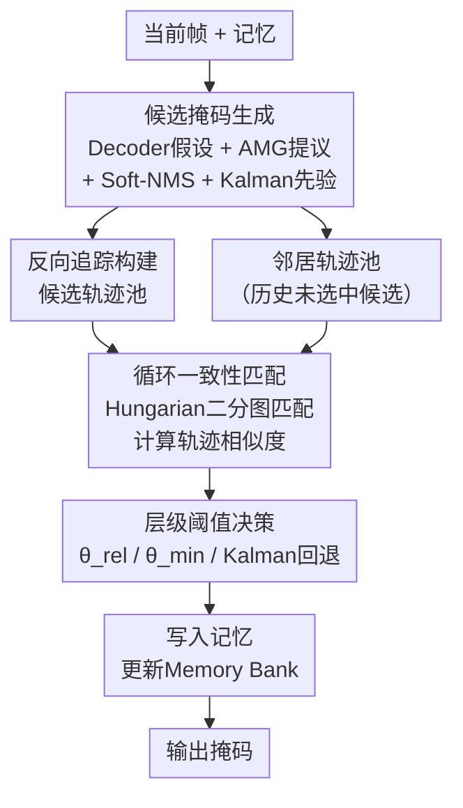

# SENTRY: SAM2-Enhanced Neighbor-Aware and Temporally Reasoned Memory for Visual Tracking

**会议**: ECCV 2026  
**arXiv**: [2606.24449](https://arxiv.org/abs/2606.24449)  
**论文**: [Project Page](https://hamadya.github.io/SENTRY/)  
**代码**: 有 ([https://github.com/hamadya/SENTRY](https://github.com/hamadya/SENTRY))  
**领域**: 视频理解  
**关键词**: 视觉目标跟踪, SAM2, 记忆机制, 时序一致性, 零样本跟踪

## 一句话总结
SENTRY是一个免训练、即插即用的"写前精炼"(refine-before-write)模块，在SAM2系列跟踪器写入记忆前用短时域循环一致性验证每个候选掩码的时序合理性，替代原有基于置信度的记忆更新机制，集成到五个强基线后在九个benchmark上一致提点，在LaSOT/LaSOText/GOT-10k/VOT20/VOT22/DiDi上达到零样本新SOTA，且SAM2-L版本在A100上仍保持32.8 FPS的实时速度。

## 研究背景与动机
基于记忆的架构已成为视觉目标跟踪(VOT)的核心范式，通过维护历史特征来应对遮挡、运动模糊和外观变化。SAM2沿袭这一思路，使用流式记忆和每帧多掩码假设，但其核心弱点是**置信度驱动的掩码选择**：每帧只取预测IoU最高的掩码写入记忆，不做任何短时域时序一致性验证。在遮挡、快速运动或干扰物场景下，置信度信号往往不可靠——高置信度的错误掩码被写入记忆后，会在自回归的记忆流中逐帧放大误差，最终导致漂移。

现有SAM2扩展（如SAMURAI的运动滤波、DAM4SAM的干扰物检测）试图缓解这一问题，但它们仍然重度依赖SAM2的置信度选择机制。运动滤波在非线性轨迹下会失效，启发式阈值在杂乱场景中不稳定，二者都没有在记忆写入前做系统的轨迹级时序验证。SENTRY正是填补这一空白：**它不改进当前帧的预测或打分，而是介入记忆写入接口**，在掩码成为未来推理的"证据"之前，先验证它是否与目标近期运动时序一致。

**核心idea**：用"写前精炼"替代"置信度写入"——对每个候选掩码做短时域反向追踪，通过邻居感知的循环一致性匹配筛选出与目标近期轨迹最一致的掩码，确保只有时序可靠的掩码才进入记忆。

## 方法详解

### 整体框架
SENTRY是一个不修改SAM2骨干网络和记忆模块的推理时外挂，核心逻辑是：每帧先收集多个候选掩码（来自decoder多假设、AMG自动掩码生成和Kalman运动先验），然后对每个候选做短时域反向追踪构建轨迹片段(tracklet)，再通过邻居感知的循环一致性匹配评估每个候选轨迹与目标近期参考轨迹的相似度，最终选择时序最一致的掩码写入记忆。

整个流程分三个阶段：(1) 候选掩码生成与筛选；(2) 邻居感知的循环一致性匹配；(3) 层级阈值决策与记忆更新。

### 关键设计

**1. 多源候选掩码生成与筛选：扩大候选池以覆盖正确的目标状态**

SAM2每帧只输出三个decoder掩码假设（各带预测IoU和遮挡分数），取最高IoU者写入记忆。但当最高置信度的掩码恰好是错误的时，系统没有备选方案。SENTRY的做法是构造一个多样化、去冗余的候选池，包含三个来源：

**Decoder假设**：保留满足 $\hat{\text{IoU}}_i^t > \alpha \cdot \max_j \hat{\text{IoU}}_j^t$ 且遮挡分数 $\hat{o}_i^t > 0$ 的假设（$\alpha=0.7$），而非仅保留最高分的一个，容忍decoder的不确定性。

**AMG自动掩码生成提议**：SAM2的AMG模块本身就能生成大量目标无关的掩码提议。SENTRY计算每个提议区域与首帧模板 $\mathcal{T}^0$（初始掩码覆盖的图像区域）的余弦相似度 $s_j$，保留 $s_j \geq \beta \cdot \max_k s_k$ 的提议（$\beta=0.7$）。这使得候选池包含目标相关的、decoder可能遗漏的空间覆盖。

**去重与运动回退**：合并后的候选池经Soft-NMS在包围盒空间去重，保持空间多样性。此外，使用恒加速度Kalman滤波器从上一帧精炼掩码 $\bar{\mathcal{M}}^{t-1}$ 的中心和尺度预测当前帧位置，生成一个平移后的运动先验掩码 $\mathcal{M}_{\kappa}^t$，作为严重遮挡或外观失效时的兜底方案（不参与Soft-NMS竞争）。

这个多源候选池的好处是：即使decoder最高置信度假设是错误的，只要正确的目标状态以某种形式存在于候选池中（AMG提议或Kalman先验），后续的时序验证就有机会把它挑出来。

**2. 邻居感知的短时序轨迹推理：用"回溯轨迹"验证候选掩码的时序可靠性**

这是SENTRY最核心的创新。一个在帧 $t$ 看似合理的掩码，可能与目标近期的运动模式不一致。SENTRY通过对每个候选做**短时域反向传播**来检验这种一致性。

**候选轨迹池**：对于候选池 $\mathcal{C}^t$ 中的每个掩码 $\mathcal{M}_i^t$，将其作为稠密提示(dense prompt)输入SAM2的提示式分割，在过去的 $\tau$ 帧（$\tau=10$）上逐帧反向重新分割，得到一条候选轨迹 $\xi_i^t = (\mathcal{M}_i^t, \mathcal{M}_i^{t-1}, \ldots, \mathcal{M}_i^{t-\tau})$。同时维护一条参考轨迹 $\eta^t = (\bar{\mathcal{M}}^t, \ldots, \bar{\mathcal{M}}^{t-\tau})$，由历史已选精炼掩码构成，作为时序锚点。

**邻居轨迹池（关键设计）**：在筛选出当前帧精炼掩码 $\bar{\mathcal{M}}^t$ 后，将候选池中**未被选中的其余候选轨迹**保留为"邻居"。每个邻居在下一帧通过用其最后一帧掩码作为提示做一次前向分割来保持 $\tau$ 帧窗口对齐。这个池子本质上编码了"目标不是什么"的负样本运动上下文——后续匹配时，与邻居运动高度对齐的候选会被惩罚，有效降低在杂乱场景中因干扰物导致的漂移。邻居轨迹自然过期（超出 $\tau$ 帧窗口即丢弃），无需显式剪枝，池子不会无限膨胀。

**3. 循环一致性匹配与层级阈值决策：用几何运动一致性选出最优掩码**

给定候选轨迹池 $\mathbf{P}_c^t$ 和邻居/目标轨迹池 $\mathbf{P}_n^t \cup \{\eta^t\}$，SENTRY对每对候选-邻居（或候选-目标）轨迹计算轨迹相似度：

$$\mathrm{Sim}(\xi_i, \zeta_j) = \frac{1}{\tau} \sum_{k=t-\tau}^{t-1} \mathrm{IoU}(b_i^k, b_j^k)$$

在由这些相似度构成二分图上运行Hungarian算法做一对一匹配，最大化全局轨迹对齐。这个匹配起到运动一致性滤波器的作用：与目标轨迹时序一致的候选被保留，与邻居轨迹对齐的候选被抑制。值得强调的是，匹配本身用于过滤而非直接选最优——最终选择只看候选-目标相似度 $s_i = \mathrm{Sim}(\xi_i^t, \eta^t)$。

选择策略采用两层阈值：
- 若 $\max_i s_i \geq \theta_{\text{rel}}$（$\theta_{\text{rel}}=0.6$），直接选最高 $s_i$ 的候选 —— 有高置信度的时序一致性匹配
- 若 $\theta_{\text{min}} \leq \max_i s_i < \theta_{\text{rel}}$（$\theta_{\text{min}}=0.3$），候选虽非强匹配但仍有时序合理性，选最高分者
- 若 $\max_i s_i < \theta_{\text{min}}$，所有候选时序一致性都很弱（严重遮挡/外观失效），回退到Kalman先验 $\mathcal{M}_{\kappa}^t$

选定的掩码 $\bar{\mathcal{M}}^t$ 按SAM2默认的更新调度写入记忆。所有阈值（$\alpha, \beta, \theta_{\text{rel}}, \theta_{\text{min}}$）全局固定，跨数据集无需调参。

使用IoU而非外观距离做轨迹比较的原因：遮挡、光照变化和杂乱背景下外观线索不可靠，而反向传播已经将外观信息隐式编码在生成的轨迹中，用几何运动做比较信号更稳定。

### 损失函数 / 训练策略
SENTRY完全免训练，纯推理时模块。不修改任何骨干网络参数，不引入额外训练目标。所有阈值通过LaSOT上的简单网格搜索确定，跨所有数据集和模型尺度固定不变。

## 实验关键数据

### 主实验
集成SENTRY到SAM2/SAMURAI/DAM4SAM三个强基线（L尺度），在五个主要box benchmark上的结果（S为Success AUC，取自论文Table 1）：

| 方法 | LaSOT S | LaSOText S | TNL2K S | GOT-10k AO | TrackingNet S |
|------|---------|------------|---------|------------|---------------|
| SAM2-L | 68.5 | 56.8 | 56.7 | 80.8 | 85.3 |
| SAMURAI-L | 74.2 | 61.0 | 50.6 | 81.7 | 85.3 |
| DAM4SAM-L | 75.1 | 60.9 | 59.8 | 81.1 | 85.3 |
| SENTRY-S2-L | 70.2 (+1.7) | 57.0 (+0.2) | 57.9 (+1.2) | 81.1 (+0.3) | 85.7 (+0.4) |
| SENTRY-SR-L | 75.1 (+0.9) | 61.5 (+0.5) | 59.6 (+9.0) | 81.8 (+0.1) | 85.8 (+0.5) |
| SENTRY-D4S-L | **76.3** (+1.2) | **61.8** (+0.9) | **61.3** (+1.5) | **82.1** (+1.0) | **85.9** (+0.6) |

VOT基准上的零样本结果（Q指标，取自论文Tables 2-5）：

| 方法 | VOT20 Q | VOT22 Q | VOTS24 Q | DiDi Q |
|------|---------|---------|----------|--------|
| SAM2-L | 0.681 | 0.692 | 0.661 | 0.649 |
| SAMURAI-L | 0.674 | 0.693 | 0.673 | 0.680 |
| DAM4SAM-L | 0.723 | 0.750 | 0.711 | 0.694 |
| SENTRY-D4S-L | **0.732** (+0.9) | **0.759** (+0.9) | **0.715** (+0.4) | **0.705** (+1.1) |

SENTRY-D4S-L在所有box和VOT基准上取得新的零样本SOTA。收益模式与数据集难度高度相关：干净短序列（TrackingNet）收益小但一致，长序列或快速变化序列（LaSOT、TNL2K）收益大。最显著的提升出现在SAMURAI+TNL2K（+9.0 S），因为TNL2K的强非线性运动直接暴露了SAMURAI线性运动模型的弱点。

### 消融实验
候选生成模块在SAM2-L上的增量贡献（S指标平均提升，取自论文Table 6）：

| 配置 | LaSOT S | TNL2K S | GOT-10k AO | 平均增益 |
|------|---------|---------|------------|----------|
| SAM2-L (基线) | 68.5 | 56.7 | 80.8 | - |
| + Decoder候选 ($\mathcal{C}_{\text{dec}}$) | 69.8 | 57.5 | 80.9 | +0.6 |
| + AMG提议 ($\mathcal{C}_{\text{AMG}}$) | 69.9 | 57.8 | 80.9 | +0.7 |
| + Soft-NMS去重 | 70.0 | 57.8 | 81.0 | +0.8 |
| + Kalman先验 ($\mathcal{M}^{\kappa}$) | 70.2 | 57.9 | 81.1 | +0.9 |
| 去掉邻居轨迹池 (LaSOT) | 65.8 | - | - | -4.4 vs 70.2 |

每个候选生成模块都带来增量收益（+0.1~0.5 S），邻居轨迹池的贡献最大（去掉后LaSOT S从70.2暴跌至65.8），验证了"负样本运动上下文"对抑制干扰物漂移的关键作用。

时序窗口 $\tau$ 的消融显示：$\tau=1$ 等价于不做时序验证（68.5），$\tau=10$ 达到峰值（70.2），$\tau=30$ 反而下降（69.2），说明过长窗口引入过期特征和时序噪声。

### 关键发现
- **邻居轨迹池是最关键的组件**：去掉后LaSOT S下降4.4，说明单纯的目标-候选匹配无法区分干扰物，邻居提供的"负样本运动上下文"至关重要
- **SAMURAI受益最大**：平均跨尺度提升4.5 S（vs SAM2的0.7和DAM4SAM的1.5），因为SENTRY的时序验证直接修正了SAMURAI线性运动模型在非线性轨迹上的系统性错误
- **记忆写入质量显著提升**：虚假写入（写入IoU<0.5的掩码）减少约37.5%，严重写入错误减少约51%，写入的假阳性面积减少约31%
- **跨模型尺度和跨架构泛化**：在SAM2 T/S/B/L四个尺度和STCN/XMem/Cutie/EfficientTAM/SAM3等非SAM2跟踪器上均一致提点，表明收益源于"时序验证的记忆写入"这一机制本身，而非特定架构特性
- **全局设定参数**：所有阈值（$\alpha$、$\beta$、$\theta_{\text{rel}}$、$\theta_{\text{min}}$）跨所有数据集固定，不需要逐数据集调参

## 亮点与洞察
- **"写前验证"的设计哲学**：将关注点从"怎么在当前帧预测得更好"转移到"怎么确保写入记忆的内容是可靠的"，这是一个根本性的视角转换。自回归系统的核心问题是误差累积，而从写入端做质量控制比从预测端做事后修正更治本。这个思路可以迁移到任何带记忆/缓存的序列模型
- **邻居轨迹池的负样本设计**：维护"目标不是什么"的轨迹池是朴素但高效的想法。它不需要显式的干扰物检测或复杂的注意力机制，只需利用每帧未选中候选的"废料"信息就能提供强上下文信号。这种"变废为宝"的工程智慧值得学习
- **IoU做轨迹相似度的选择**：在时序验证阶段用IoU而非外观距离——因为反向传播已经将外观信息编码在生成的轨迹分割结果中，用几何运动做匹配反而更稳定。这种"隐式编码+显式几何比较"的双阶段策略可以推广到其他需要时序对齐的任务
- **免训练即插即用的实用主义**：不修改任何模型参数，不引入额外训练代价，0.4-0.6 GB显存增量，25%左右的FPS损失（但仍保持30+ FPS实时性）。这种低成本高收益的推理时模块在实际部署中极具吸引力
- **统一的全尺度评估**：首次对SAM2系列跟踪器在四个模型尺度、九个benchmark上做了统一的re-evaluation，填补了先前工作中缺失的基线数据，为后续研究提供了可复现的参考

## 局限与展望
- **长期完全消失后的重检测是硬伤**：SENTRY减少漂移但不做全局重检测。目标长时间完全离开画面（约100帧）后重新出现，若decoder/AMG/Kalman都无法生成含目标的候选，所有方法均失败。作者承认这是模块范围外的能力
- **短时域窗口的固有限制**：$\tau=10$帧的窗口在大多数场景有效，但对极长遮挡（如目标被遮挡数百帧后从完全不同角度重现），短窗口内的参考轨迹已完全不包含目标信息，时序验证失效
- **依赖SAM2的提示式分割进行反向追踪**：候选轨迹的质量受限于SAM2自身的反向传播能力。如果SAM2在反向传播时也发生漂移，候选轨迹本身就可能不可靠，导致验证失效
- **同质外观密集人群是未解决的挑战**：作者在附录中专门讨论了D-PTUAC等密集人群数据集，指出当个体外观相同且运动高度同步时，外观和几何线索同时失效，SAM2的掩码传播机制从根本上难以区分个体。作者提出三个未来方向：点级身份锚点、小目标感知提议生成、运动结构化的时序一致性增强
- **增量收益在一些场景中不明显**：在TrackingNet等干净短序列上收益仅0.4-0.7 S，因为基线本身错误少。这种场景下SENTRY的25% FPS开销可能不被认为划算——需要一个自适应开关机制

## 相关工作与启发
- **vs SAMURAI**: SAMURAI用Kalman滤波做运动先验来修正掩码选择，但仍依赖置信度排序。SENTRY在记忆写入接口做时序验证，用循环一致性而非线性运动假设，因此在非线性轨迹（TNL2K）上大幅领先。两者可互补——SENTRY已成功集成到SAMURAI上
- **vs DAM4SAM**: DAM4SAM通过启发式阈值检测和过滤干扰物，是一种"预测端"的事后修正。SENTRY在"写入端"做时序验证，二者正交——实验显示SENTRY-D4S同时享有两者的优势
- **vs XMem/STM等经典记忆跟踪器**: 经典方法通过训练目标或记忆更新调度来间接提升时序一致性，SENTRY在推理时显式验证。附录中SENTRY在STCN/XMem/Cutie上也提点（0.5-1.5%），说明"写前验证"这一思想超越SAM2生态，是通用的记忆管理策略
- **vs SAM2Long**: SAM2Long用多分支记忆树做长期推理，SENTRY是单流写入的准入规则。两者不兼容——组合需要重新设计分支扩展和剪枝策略。实验显示SENTRY-D4S-L在平均跟踪分数（73.2 vs 67.9）和FPS（30.2 vs 26.1）上均优于SAM2Long-L

## 评分
- 新颖性: 4星 —— "写前验证"切入记忆写入接口而非预测端的视角是新颖的，邻居轨迹池的负样本设计也巧妙，但循环一致性匹配本身借鉴了NeighbourTrack等先前工作
- 实验充分度: 5星 —— 5个基线x4个尺度x9个benchmark的全面评估，消融覆盖所有组件和超参数，记忆写入诊断分析和恢复能力分析提供了深入的机制验证，附录还有VOS和跨架构泛化实验
- 写作质量: 4星 —— 核心思路清晰，"refine-before-write"的概念贯穿全文，实验组织有条理。但附录篇幅极长（A-L共12个），部分内容可精简
- 价值: 5星 —— 实用价值高：免训练即插即用，0.4-0.6 GB显存、25% FPS开销换一致的性能提升，可直接部署到现有SAM2跟踪器。方法论价值：将"记忆质量控制"作为独立设计维度，启发了记忆增强系统的通用设计思路

<!-- RELATED:START -->

## 相关论文

- [\[CVPR 2026\] Visual-Aware CoT: Achieving High-Fidelity Visual Consistency in Unified Models](../../CVPR2026/vlm_reasoning/visual-aware_cot_achieving_high-fidelity_visual_consistency_in_unified_models.md)
- [\[CVPR 2026\] Mimic Human Cognition, Master Multi-Image Reasoning: A Meta-Action Framework for Enhanced Visual Understanding](../../CVPR2026/vlm_reasoning/mimic_human_cognition_master_multi-image_reasoning_a_meta-action_framework_for_e.md)
- [\[CVPR 2026\] CodeV: Code with Images for Faithful Visual Reasoning via Tool-Aware Policy Optimization](../../CVPR2026/vlm_reasoning/codev_code_with_images_for_faithful_visual_reasoning_via_tool-aware_policy_optim.md)
- [\[CVPR 2026\] OASIS: On-Demand Hierarchical Event Memory for Streaming Video Reasoning](../../CVPR2026/vlm_reasoning/oasis_on-demand_hierarchical_event_memory_for_streaming_video_reasoning.md)
- [\[ICML 2026\] MET-Bench: Multimodal Entity Tracking for Evaluating the Limitations of Vision-Language and Reasoning Models](../../ICML2026/vlm_reasoning/met-bench_multimodal_entity_tracking_for_evaluating_the_limitations_of_vision-la.md)

<!-- RELATED:END -->
