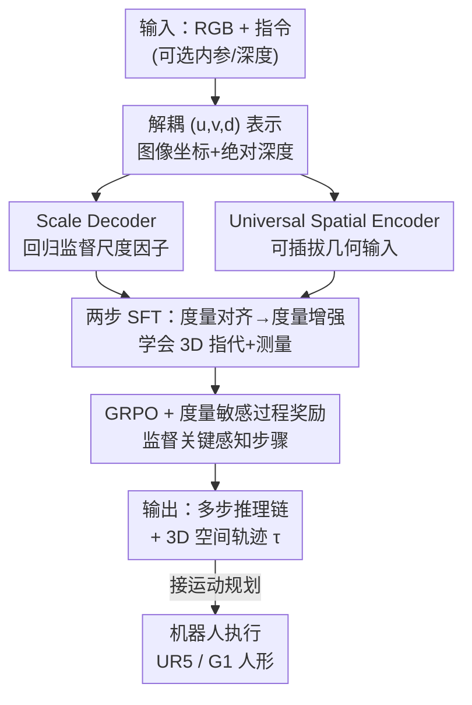

# Towards Spatial Trace with Reasoning in Vision-Language Models for Robotics

**会议**: ECCV 2026  
**arXiv**: [2512.13660](https://arxiv.org/abs/2512.13660)  
**代码**: [https://zhoues.github.io/RoboTracer](https://zhoues.github.io/RoboTracer) (项目页)  
**领域**: 多模态VLM / 具身智能 / LLM推理  
**关键词**: 空间轨迹, 空间推理, 3D 视觉语言模型, 度量感知, 强化微调

## 一句话总结
提出 RoboTracer——一个 3D 感知的 VLM，用可回归监督的 scale decoder 与可插拔几何输入的 universal spatial encoder 学会「3D 空间指代 + 度量测量」，再用带度量敏感过程奖励的 GRPO 强化微调把它拔高到多步、度量落地的空间轨迹推理，在自建 TraceSpatial-Bench 上比 Gemini-2.5-Pro 高 36 个点，并能直接接运动规划驱动 UR5、G1 人形等真实机器人。

## 研究背景与动机
机器人越来越常收到「把浇水壶悬在每朵花上方 1–5 cm、从左到右挨个浇水」这类**受空间约束的指令**。要执行它，机器人得在 3D 场景里推出一串有序的三维路点——论文把这串路点叫做**空间轨迹（spatial trace）**，作为「读懂指令」到「生成动作」之间的中间桥梁。可这件事本质上很难：每一步既要做 **3D 空间指代**（在杂乱场景里按「从左到右第几朵」这种关系精确定位物体），又要做 **3D 空间测量**（读出物体的真实物理高度、以及「上方 1–5 cm」这种绝对尺度量），还要把这些线索串成多步推理。近来数据稀缺的 VLA 模型直接端到端预测 6D 稠密动作，在这类任务上基本失手。

现有 VLM 也不够用。它们能做 2D 空间推理、甚至能生成 2D 视觉轨迹（图像平面上的点序列），但普遍**忽视了任务的多步本质**——尤其是轨迹沿途那些起关键作用的中间物体没有被显式监督，导致生成质量打折。更根本的鸿沟在于：这些输出停留在 2D 空间，缺乏 3D 落地与绝对度量理解，2D 视觉轨迹和真正的 3D 空间轨迹之间隔着一道坎。直接微调现成 VLM 又撞上两堵墙：一是绝对尺度监督不足（尤其只有 RGB 时模型根本不知道「一米」有多长），二是相机内参、绝对深度这些现成的绝对尺度几何线索没被用起来。

本文的切入角度是把问题拆成「先学感知、再学推理」两级，并在**输入、输出、监督、训练四个环节都注入度量意识**。SFT 阶段先让模型具备精确的 3D 指代与测量能力（靠一个专门回归尺度因子的解码器和一个能吃任意几何输入的空间编码器）；RFT 阶段再用一组**度量敏感的过程奖励**去监督推理链里那些关键感知步骤（这一步该指代谁、测出多少米），把感知能力组织成多步、度量落地的推理。**核心 idea：把空间轨迹表示成解耦的 $(u,v,d)$ 点序列，用「回归监督尺度 + 可插拔几何编码」的 SFT 打好 3D 度量感知底子，再用监督关键感知步骤的度量敏感过程奖励做 GRPO 强化微调，让 VLM 学会多步、度量落地的空间轨迹推理。**

## 方法详解

### 整体框架
RoboTracer 要解决的是：给定 RGB（可选带相机内参、深度等几何线索）和一句受空间约束的指令，输出一串有序的 3D 稀疏路点 $\tau=\{p_t\}_{t=1}^{T}$（6–12 个点）来完成指令。每个点写作 $p_t=(u_t,v_t,d_t)$——图像平面坐标加上对应的绝对深度，而不是直接的 $(x,y,z)$；这样只需相机内参就能平凡地转成 3D，省得让 VLM 隐式地去学相机几何，训练更简单、精度更高。这个解耦表示还天然可降维复用：丢掉 $d$ 就退化成 2D 视觉轨迹，只留首尾点就退化成 3D/2D 空间指代数据，从而能和现有 2D 数据集拼在一起协同训练。

整条 pipeline 分两大阶段。**Stage 1（SFT）**：在标准 VLM（RGB 编码器 + LLM）基础上并挂两个新组件——把 `<SCALE>` token 映射成数值尺度因子的 **scale decoder**，和能灵活吃进内参/位姿/深度的 **universal spatial encoder**，两者都经各自 projector 与 LLM 对齐；SFT 本身又细分为「度量对齐」和「度量增强」两小步，先只更新 projector 与 scale decoder，再冻结空间编码器微调其余部分。这一阶段让模型学会精准的 3D 指代与测量，并靠数据里附带的多步推理过程为下一阶段做「冷启动」。**Stage 2（RFT）**：用 GRPO 在多步推理数据上做强化微调，模型以 `<think>Step1…Step7</think><answer>…</answer>` 的形式先分步推理（每步显式声明「[感知类型] [目标物体]」，如「[Referring] [浇水壶]」「[Measuring] [从左第一朵花] 0.195m」）再给出最终轨迹，由一组度量敏感奖励（结果级 + 过程级）监督。

### 关键设计

**1. 解耦 $(u,v,d)$ 轨迹表示：把「学相机几何」这件苦活从 VLM 身上卸下来**

痛点很直接：如果让 VLM 直接吐 $(x,y,z)$ 世界坐标，它得隐式地把相机内外参也一并学会，训练更难、精度也差。本文改成预测图像平面坐标加绝对深度 $p_t=(u_t,v_t,d_t)$，因为有内参时 $(u,v,d)\to(x,y,z)$ 只是一步平凡投影，VLM 不必再操心几何变换。这个表示的妙处在于**可复用性**：省掉 $d$ 就是 2D 视觉轨迹，只留首尾点就是 3D/2D 指代样本，于是能无缝对齐现有 2D 数据集做协同训练，多任务性能反而更好。消融（表 9 ID G vs H）也显示，同样训练数据下建模 $(u,v,d)$ 在 TraceSpatial-Bench 上（31%）优于直接建模 $(x,y,z)$（30%），且 Fréchet 距离明显更低（0.1605 vs 0.2426）——作者归因于降维带来的数据复用与和 2D 数据更强的对齐。

**2. 回归监督的 scale decoder：逼模型从 RGB 里也长出「绝对尺度」感**

一般 VLM 只在 2D 上预训练，对「一米有多长」这种绝对尺度几乎没概念，RGB-only 时尤其瞎。本文给 LLM 挂一个 scale decoder，把一个特殊的 `<SCALE>` token 的嵌入映射成一个数值尺度因子，把「尺度无关的表示」和「绝对度量尺度」链接起来。关键是**用回归损失而非分类/文本损失**去监督它，在对数空间对齐预测尺度与真值。SFT 总损失为

$$\mathcal{L} = \mathcal{L}_{ntp} + 0.1\,\bigl\|\log(\hat{s})-\operatorname{stopgrad}(\log(s^{*}))\bigr\|_2^2$$

其中 $\mathcal{L}_{ntp}$ 是下一 token 预测损失，$\hat{s}$ 是对数空间的预测尺度，$s^{*}$ 是真值尺度（对真值取 stopgrad，只让梯度回流到预测支路）。消融（表 9 ID E/F/H）对比了回归、下一 token 文本监督、无监督三种做法：回归最好，纯文本监督只有微弱收益。原因是纯 next-token 监督要吃大量数据才能把尺度感练出来，而显式回归尺度因子——尤其在 RGB/RGB+X 混合训练下——逼着模型不靠额外几何就把尺度信息学进去。

**3. Universal spatial encoder：几何线索有多少吃多少，训练/推理都不用改架构**

现实具身场景里常常现成就有相机内参、位姿、深度这些绝对尺度几何线索，但普通 VLM 用不上它们。本文以一个强力的前馈式度量 3D 几何模型为骨架，构建一个**可插拔**的空间编码器：有额外几何就喂进去精化空间表示，几何越多、表示越准；没有就只靠 RGB 也能跑。它带来两个好处——**灵活训练**（利用数据集里各种尺度标注做输入增强、丰富空间学习）和**几何自适应推理**（推理时按现场可得的几何线索即插即用，无需重训或改结构，线索越多性能越好，实测精确几何可带来最多约 6% 的绝对提升）。有意思的是消融（表 9 ID D vs I）显示：度量落地推理更依赖 RFT 的多步过程训练，而非 SFT 阶段这个空间编码器给的高质量外部 3D 输入——去掉空间编码器的 RFT 虽略逊于带它的版本，却远超 SFT，且在噪声几何输入下依然稳健。

**4. 度量敏感的过程奖励 + GRPO：不只看结果对不对，还盯着推理中间每一步的感知**

这是把感知能力升级为多步推理的核心。SFT 后先用 GRPO 配几个**结果级奖励**：格式奖励 $R_{OF}$（约束结构化输出），点奖励 $R_P$（起终点一致性），轨迹奖励 $R_T$（整条轨迹级对齐）。点奖励取起终点距离的一种截断相似度：

$$R_P=\tfrac{1}{2}\bigl[f(p_1,\hat{p}_1)+f(p_T,\hat{p}_T)\bigr],\quad f(p,p')=\max\bigl(0,\,1-\|p-p'\|_2^2\bigr)$$

所有 $(u,v,d)$ 归一化到 $[0,1]$、深度按场景最大深度缩放。但这些结果级奖励是**度量无关**的，管不到轨迹生成里真正吃劲的中间感知（该指代哪个物体、测出几米）。于是本文引入两个**过程级奖励**，利用 TraceSpatial 提供的关键步感知标注：过程格式奖励 $R_{PF}$（强制每步写成「[感知类型] [目标物体]:」），以及准确度奖励 $R_{Acc}$（只对落在关键步标注里的步骤按感知类型算预测误差，如指代用 L1 距离）。$R_{Acc}$ 被设计成**顺序无关**，允许步骤灵活排序。最终奖励把结果级与过程级相加、过程级乘 0.25。消融显示加入过程奖励让整体成功率再涨 4%，且它对 3D 指标的提升明显大于纯结果奖励——正说明「监督度量落地的分步感知」才是复杂空间关系下生成准确轨迹的关键。

### 一个完整示例
以「从左到右浇花、浇水壶悬在每朵上方 1–5 cm」为例走一遍 RFT 后的 7 步推理：Step1 先出场景尺度（[Scale][Scene] 2.406）；Step2 指代浇水壶（179,789,0.941），Step3 测出它高 0.104m；Step4 指代「从左第一朵花」（454,723,0.965），Step5 测得 0.195m；Step6 指代「从左第二朵花」（729,624,0.972），Step7 测得 0.403m……逐步把每朵花的位置与高度这些度量线索解出来，作为中间证据，最后 `<answer>` 里给出 5 个路点组成的完整空间轨迹（如 (176,788,0.945)→…→(728,122,0.978)）。这条轨迹再交给运动规划（含碰撞规避、关节限位、平滑代价，并对 VLM 生成的轨迹做物理约束修正），就能驱动机器人挨个把浇水壶悬到每朵花上方 1–5 cm。

### 损失函数 / 训练策略
基座用 NVILA（2B/8B），受算力所限只在 2B 上做 RFT。SFT 分两小步：度量对齐（只更新 projector 与 scale decoder）→ 度量增强（冻结空间编码器、微调其余，且在 RGB-only 与 RGB+X 输入上都训，以保住通用 VQA 能力并适配任意几何配置）；损失即式 (1) 的 next-token 损失加 0.1 权重的对数空间尺度回归项。RFT 用 GRPO，奖励为上面结果级（格式/点/轨迹）与过程级（过程格式/准确度）之和、过程级项乘 0.25。

## 实验关键数据

### 主实验
在空间理解、测量、指代、2D 视觉轨迹、以及自建 TraceSpatial-Bench 上全面评测。仅 SFT 的 RoboTracer-8B 在空间理解/测量上平均成功率 85.7%，超 Gemini-2.5-Pro 8.58%、超基座 NVILA-8B 20.3%，且在 3D/测量类任务上的提升（23.6%）明显大于 2D 任务（14.7%）。

| 基准/指标 | RoboTracer | 之前最好基线 | 提升 |
|--------|------|----------|------|
| 空间理解/测量 平均成功率 (8B-SFT) | 85.7% | Gemini-2.5-Pro 77.1% | +8.58% |
| Q-Spatial S.E. 成功率 (8B-SFT) | 83.01% | RoboBrain 2.0-7B 69.11% | +13.9% |
| 2D 视觉轨迹 ShareRobot-Bench (Fréchet↓, 8B-SFT) | 0.1384 | RoboBrain 2.0-7B 0.1575 | 更低 |
| TraceSpatial-Bench 总体成功率 (2B-RFT, R.I.D.) | 45% | RoboRefer-2B 28% | +17% |
| TraceSpatial-Bench 总体成功率 (vs Gemini) | 39–45% | Gemini-2.5-Pro 3% | +36% |
| RoboTwin 2.0 hard 总平均成功率 (2B) | 64.0% | π0 8.6% | +55.4% |

在 TraceSpatial-Bench 上，各强 VLM 虽 2D 指代/追踪尚可，但因缺乏度量深度理解，3D 轨迹常「悬空」或与物体碰撞；RoboTracer-RFT 在 3D 指标上大幅领先，也超过带 3D 点云/深度输入的 LEO、RoboRefer。真实机器人上（UR5 抓取放置、G1 人形浇花），只有本文方法能在杂乱动态场景里完成需要多步度量落地追踪的长程任务，接 Code-as-Monitor 后能以 1.5 Hz 快速更新、目标被移动也能自适应重规划。

### 消融实验

| 配置 | 关键指标 (TraceSpatial-Bench SR) | 说明 |
|------|---------|------|
| Full (2B-SFT, ID H) | 31% | 2D+3D+Video + 空间编码器 + 回归尺度 + (u,v,d) |
| w/o 2D 数据 (ID A) | 27% | 缺室内外尺度监督，Q-Spatial 掉到 51.49 |
| w/o 3D 数据 (ID B) | 19% | 掉最多，Q-Spatial 骤降到 33.52 |
| w/o Video 数据 (ID C) | 24% | 末端执行器追踪与 Fréchet 明显变差 (0.4376) |
| w/o 空间编码器 (RFT, ID D vs I) | 36% vs 39% | 去掉后 RFT 略降但仍远超 SFT |
| 尺度无监督 (ID E) | 24% | Q-Spatial 53.47 |
| 尺度用 N.T.P 文本监督 (ID F) | 26% | Q-Spatial 57.43，逊于回归 |
| 用 (x,y,z) 建模 (ID G) | 30% | Fréchet 0.2426，逊于 (u,v,d) |
| +过程奖励 (RFT) | +4% 总成功率 | 相比纯结果奖励，3D 指标提升尤其大 |

### 关键发现
- **3D 数据贡献最大**：去掉后 TraceSpatial-Bench 从 31% 掉到 19%、Q-Spatial 从 ~69 掉到 33.52，因为它提供了精确 3D 框带来的度量落地监督；2D、Video 数据分别补齐室内外尺度感知与末端执行器追踪，三者缺一不可。
- **回归尺度监督 > 文本监督 > 无监督**：显式回归尺度因子逼 RGB-only 模型不靠几何也学到尺度；纯 next-token 监督要海量数据才勉强见效。
- **多步过程 RFT 比外部高质量几何更关键**：度量落地推理更依赖分步过程训练，去掉空间编码器的 RFT 仍远超 SFT，且在噪声几何输入下稳健。
- **几何越精确越好**：喂进精确内参/深度最多带来约 6% 绝对提升，且即插即用无需重训。

## 亮点与洞察
- **把「感知」与「推理」分两级学**：SFT 先用回归尺度 + 可插拔几何把 3D 指代/测量这类感知能力打扎实，RFT 再用过程奖励把它组织成多步推理——这条「先感知底子、后推理组织」的路线清晰且可迁移。
- **过程奖励监督「关键感知步」是点睛之笔**：多数 RFT 只给结果级、度量无关的奖励，本文用数据集里的关键步标注去盯「这一步该指代谁、测出几米」，而且奖励设计成顺序无关，允许推理步骤灵活排序——这对复杂空间关系下的准确追踪贡献最大。
- **$(u,v,d)$ 解耦表示一表多用**：一个表示能同时退化成 2D 视觉轨迹、3D/2D 指代，天然对齐现有 2D 数据做协同训练，既提精度又省数据，是很实用的工程 trick。
- **强调「显式几何 > 纯隐式学」**：在具身场景里内参/深度往往现成可得，与其逼 VLM 从 RGB 隐式硬学，不如把它们即插即用喂进去，这个视角对具身 VLM 设计有普适启发。

## 局限与展望
- **作者承认**：方法只预测 3D 空间轨迹，需靠运动规划反解 6D 末端位姿；对「姿态约束关键」的富旋转操作（如拧、翻）不够有效。稠密空间轨迹或许能处理这类任务，是后续方向。
- **RFT 受算力限制只在 2B 上做**（补充材料显示 8B-RFT 增益更大，12% vs 8%），完整 8B RFT 的潜力尚未在正文充分释放。
- **依赖大量基础模型搭建数据管线**（RAM++、GroundingDINO、SAM 2.1、MoGe-2 等）与仿真生成，数据质量与偏差受这些工具链影响；TraceSpatial-Bench 仅 100 张真实图（补充扩到 800 张复标）。
- **轨迹需事先做物理约束修正**才能用，说明 VLM 原始输出仍可能违反物理可行性。

## 相关工作与启发
- **vs RoboRefer**: RoboRefer 做单图单点的 2D 定性空间指代；本文做更难的 3D 空间轨迹，在 $(u,v,d)$ 空间预测整条轨迹，并在输入/输出/监督/训练每个环节都注入度量意识，还用操作/仿真视频采集全任务级、带时序一致性的 3D 关键点序列——单图单点特征支撑不了这种 3D 追踪。
- **vs 端到端 VLA（如 MolmoAct、π0）**: VLA 直接预测 6D 稠密动作、需按任务训练，在受空间/度量约束的长程任务上基本失手（RoboTwin hard 总成功率个位数）；本文以空间轨迹为中间表示，零样本泛化明显更强（unseen 任务超最佳基线 32.8%），且能反过来给 MolmoAct 生成动作数据把它从 0% 提到 25%。
- **vs 2D 视觉轨迹方法（Lift-to-3D / Overlap-on-2D，如 HAMSTER）**: 它们输出停留在 2D、靠深度投影或叠加渲染，难以完整刻画 3D 动态、也没监督关键感知步；本文原生在 3D 追踪并用过程奖励补上这一环，且消融显示「把标注 lift 到 (u,v,d) 3D」优于「把输出 lift 到 3D」。

## 评分
- 新颖性: ⭐⭐⭐⭐⭐ 空间轨迹这一任务形式 + 度量敏感过程奖励 + 可插拔几何/回归尺度，组合出一个连贯且有辨识度的 3D 度量推理框架。
- 实验充分度: ⭐⭐⭐⭐⭐ 覆盖理解/测量/指代/2D 轨迹/自建 3D benchmark/仿真/真机，消融把每个组件与数据源都拆开验证。
- 写作质量: ⭐⭐⭐⭐ 结构清晰、图示到位；公式排版在原文里有些错乱，符号需对照补充材料核实。
- 价值: ⭐⭐⭐⭐⭐ 直接可接运动规划驱动多种真实机器人、还能反哺 VLA 生成动作数据，具身落地价值高。

<!-- RELATED:START -->

## 相关论文

- [\[ECCV 2026\] ScAle: Attention Head Scaling as a Minimal Adapter for Spatial Reasoning in Vision–Language Models](scale_attention_head_scaling_as_a_minimal_adapter_for_spatial_reasoning_in_visio.md)
- [\[NeurIPS 2025\] RoboRefer: Towards Spatial Referring with Reasoning in Vision-Language Models for Robotics](../../NeurIPS2025/vlm_reasoning/roborefer_towards_spatial_referring_with_reasoning_in_vision-language_models_for.md)
- [\[ACL 2026\] TRACE: Unleashing Spatial Reasoning in Multimodal Large Language Models via Textual Representation Guided Reasoning](../../ACL2026/vlm_reasoning/unleashing_spatial_reasoning_in_multimodal_large_language_models_via_textual_rep.md)
- [\[ICLR 2026\] OmniSpatial: Towards Comprehensive Spatial Reasoning Benchmark for Vision Language Models](../../ICLR2026/vlm_reasoning/omnispatial_towards_comprehensive_spatial_reasoning_benchmark_for_vision_languag.md)
- [\[ICLR 2026\] InternSpatial: A Comprehensive Dataset for Spatial Reasoning in Vision-Language Models](../../ICLR2026/vlm_reasoning/internspatial_a_comprehensive_dataset_for_spatial_reasoning_in_vision-language_m.md)

<!-- RELATED:END -->
