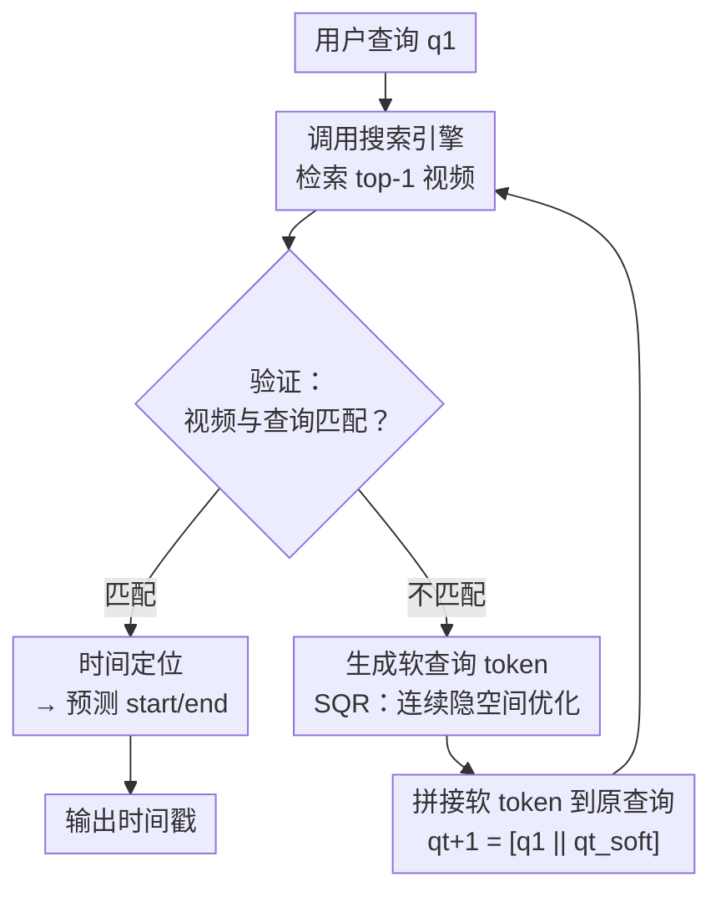

# VideoSearch-R1: Iterative Video Retrieval and Reasoning via Soft Query Refinement

**会议**: ECCV 2026  
**arXiv**: [2607.00446](https://arxiv.org/abs/2607.00446)  
**代码**: [https://mlvlab.github.io/VideoSearch-R1/](https://mlvlab.github.io/VideoSearch-R1/) (已开源)  
**领域**: 多模态 VLM / 视频理解 / Agent  
**关键词**: 视频检索、时间定位、软查询优化、GRPO、Agentic AI

## 一句话总结

VideoSearch-R1 提出了一个将视频检索与时间定位统一在迭代交互循环中的 agentic 框架，用连续隐空间的"软查询优化"替代传统的文本级查询重写，通过 GRPO 联合优化检索与推理，在 VCMR 三项基准上达到最优。

## 研究背景与动机

视频语料库的规模持续膨胀，用户的需求早已不满足于"找到相关视频"这样的粗粒度检索。真正有意义的场景往往是：用户给出一个自然语言查询，系统需要先从包含数万条视频的语料库中定位到正确的视频（视频检索），再在那个视频中精确预测查询所描述事件的时间起止点（时间定位）。这个任务被称为 Video Corpus Moment Retrieval（VCMR），是视频检索和时间定位的联合挑战。

然而，现有的管线几乎都把这两个阶段割裂开来处理。检索模型（如 CLIP4Clip、TS2-Net）负责粗粒度的跨模态对齐，输出一个候选视频列表；下游的时间定位模型（如 Vid2Seq、VideoLLaMA、FlashVTG）则假设"相关视频已经在手"，只做视频内部的细粒度推理。这种解耦架构带来了一个致命的级联问题：如果第一阶段的检索没有得到正确视频，后续所有的时间定位就都无从谈起——而且没有任何补救机制。同时，已有的视频 agent 框架虽然在长视频理解中融入了外部工具（目标追踪器、OCR、定位器），但它们也普遍假设查询相关的视频是已知的，跳过了从语料库中检索这一环。

本文的核心洞察是：检索和推理不应该是一场"一次性买卖"，而应该形成一个闭环——模型先检索、再验证、发现不对就修改查询重新检索，直到找到正确视频才进行时间定位。为此，作者提出了 VideoSearch-R1，一个将检索和推理统一在迭代交互循环中的 agentic 框架，并引入了一个很有意思的机制：通过低成本的软查询优化来替代写起来又长又杂的文本级别重写，配合强化学习端到端训练。**核心 idea：将视频检索与时间定位建模为一个迭代的 agent-搜索引擎多轮交互过程，其中查询优化不是在文本空间进行自然语言重写（硬查询优化），而是在连续表示空间中直接生成少量软 token 来精细调整查询语义，并用 GRPO 联合优化检索验证与时间定位的多个目标。**  

## 方法详解

### 整体框架

VideoSearch-R1 的核心是一个迭代的检索-验证-优化循环。给定用户查询 $q_1$，模型首先调用视频搜索引擎（一个跨模态密集检索器，如 Qwen3-VL-Embedding-2B）从语料库 $\mathcal{V}$ 中返回 top-1 候选视频 $v_t$，然后模型逐帧分析该视频，判断它是否与查询的要求匹配。如果匹配，模型立即切换到时间定位模式，预测精确的开始和结束时间戳；如果不匹配，模型通过生成一组连续的软 token 对查询进行细腻度调整，然后带着优化后的查询重新调用搜索引擎。这个过程最多重复 $T$ 轮，如果在轮次内没有找到匹配视频则视为失败。

**训练流程分为两阶段**：

- **Stage 1 SFT 冷启动**：先用监督学习让模型学会遵循结构化的推理模板，同时用对比学习（InfoNCE）训练软 token 生成能力——软 token 要与正确视频的嵌入相似、与负样本嵌入疏远。
- **Stage 2 GRPO 强化学习**：在 SFT 基础上用 GRPO 探索更优的推理轨迹和查询优化策略，四个奖励信号分别对应格式合规性（format）、匹配验证正确性（verification）、软 token 检索质量（retrieval）和时间定位精度（temporal grounding）。

### 关键设计

**1. Soft Query Refinement SQR：在连续隐空间中优化查询**  

传统的查询优化思路是让模型用自然语言重新写一句更精确的查询——称为硬查询优化（Hard Query Refinement, HQR）。但这种做法有几个弊端：第一，模型需要生成大量 token（实验中平均 26.8 个 token）来描述视觉细节，这些文本在跨模态检索器中可能引入语义噪声，反而干扰检索；第二，文本级重写的优化空间被限制在离散词表内，无法做到细腻度的连续调整。

SQR 的做法完全不一样：模型在自回归解码时，通过一个线性投影层把上一 token 的隐状态映射为下一 token 的输入嵌入，直接生成 $N$ 个连续向量 $\mathbf{q}^{\text{soft}}_t \in \mathbb{R}^{N \times D}$。这些软 token 并非自然语言词表中任何一个词，而是纯粹的隐空间表示。它们被拼接到原始查询 $q_1$ 后面形成 $q_{t+1} = [q_1 \parallel q^{\text{soft}}_t]$，再送入搜索引擎。软 token 通过 InfoNCE 损失训练，目标是最小化优化后查询与正确视频嵌入之间的距离，同时推远与负样本的距离——这种对比监督比 HQR 中简单的 next-token prediction 提供了更丰富的判别性信号。实验表明，仅需 8 个软 token 就能显著提升检索效果，而 HQR 需要 26.8 个 token 且检索增益更小。

**2. 迭代检索-验证循环：让检索自己长出"自我纠错"能力**  

这是整个框架的顶层架构。每一轮的交互由三条信息组成：当前查询 $q_t$、检索引擎返回的 top-1 视频 $v_t$、以及模型的推理痕迹 $r_t$。模型不只是简单地说"匹配/不匹配"，而是先生成一段显式的<think>推理链，在其中逐条对比查询需求的视觉证据与视频中实际观测到的内容（比如"查询要求深灰色 T 恤，但视频中人物穿着浅灰色 T 恤"），然后才输出匹配判断 $y^{\text{ret}}_t$。如果判断为不匹配，模型还会在末尾输出一个特殊的 <REFINE> 标签，触发软 token 生成。

这个"先推理再判定"的设计至关重要——它强迫模型在决定"要不要重新搜索"之前真正理解了查询和视频内容之间的语义差距。更巧妙的是，即使在匹配成功的情况下也要输出 <REFINE> token，保证模型在推理时始终启用软查询生成路径，而不会在 RL 训练中坍缩到"永远说不匹配、一直做检索"的懒惰策略。当匹配成功，模型接着预测精确的时间边界 $y^{\text{time}}$，覆盖检索和定位的完整链条。

**3. GRPO 多奖励联合优化：把四个目标拧成一根绳**  

大多数现有工作把检索和推理分开训练，或者只用 SFT 让模型模仿固定模式。VideoSearch-R1 使用 GRPO 将整个迭代过程作为一条轨迹做策略优化，并设计了四个互补的奖励信号：

- **格式奖励 $R^{\text{format}}$**：确保输出严格遵循 <think>/<answer>/<start>/<end>/<REFINE> 模板——这是让模型能稳定运行多轮交互的基础设施。
- **验证奖励 $R^{\text{verif}}$**：正确判定视频是否匹配查询，这是防止"检索错了还硬做时间定位"的栅栏。
- **检索奖励 $R^{\text{ret}}$**：复用 SFT 阶段的 InfoNCE 损失，通过 $R^{\text{ret}} = \exp(-\mathcal{L}_{\text{ret}})$ 鼓励软 token 更精准地将查询嵌入推向正确视频。
- **时间定位奖励 $R^{\text{time}}$**：直接计算预测帧区间与 ground truth 的 IoU，只在匹配成功时激活。

四个奖励加权求和后做组内标准化计算 Advantage。这种设计使得 GRPO 的信号能同时传导到检索增强（软 token 的嵌入优化）和推理增强（时间边界预测），实现真正的端到端迭代优化。消融实验显示，单独加 $R^{\text{ret}}$ 主要提升检索召回率，加 $R^{\text{verif}}$ 大幅提升验证准确率，而 $R^{\text{time}}$ 则显著提升了定位 IoU——三者缺一不可。

### 损失函数 / 训练策略

- **SFT 阶段联合损失**：$\mathcal{L}_{\text{SFT}} = \mathcal{L}_{\text{verif}} + \mathcal{L}_{\text{ret}} + \mathbb{1}_{y^{\text{ret}}=\text{'match'}} (\mathcal{L}_{\text{time}})$。其中 $\mathcal{L}_{\text{ret}}$ 为软 token 的 InfoNCE 对比损失，$\mathcal{L}_{\text{verif}}$ 和 $\mathcal{L}_{\text{time}}$ 为交叉熵。
- **RL 阶段**：GRPO，KL 系数 $\beta=0.01$，rollout size $G=8$，解码温度 1.0。学习率 $5\times10^{-7}$，weight decay 0.01。
- **骨干模型**：Qwen3-VL-2B-Instruct，搜索引擎为 Qwen3-VL-Embedding-2B。视觉 token 数 4096（64 帧 @1FPS），软 token 数 $N=8$，最大推理轮次 $T=2$。

## 实验关键数据

### 主实验

在三个 VCMR 基准（ActivityNet-FIG、Charades-FIG、DiDeMo-FIG）上以 Qwen3-VL-2B 为骨干，对比 zero-shot 和 fine-tune 基线以及经典方法（CONQUER、SQuiDNet）：

| 数据集 | 方法 | VCMR 0.5/R@1 | VR R@1 | VER Acc |
|--------|------|:---:|:---:|:---:|
| Charades-FIG | Qwen3-VL-2B (FT) | 10.4 | - | 74.7 |
| | VideoSearch-R1 | **13.4** | **24.6** | **75.7** |
| DiDeMo-FIG | Qwen3-VL-2B (FT) | 22.1 | - | 73.1 |
| | VideoSearch-R1 | **30.2** | **59.0** | **74.6** |
| ActivityNet-FIG | Qwen3-VL-2B (FT) | 19.2 | - | 83.1 |
| | VideoSearch-R1 | **22.3** | **61.1** | **83.3** |

VideoSearch-R1 在所有数据集和所有指标上全面领先。值得注意的是，即便是 fine-tune 基线在多轮推理中只是顺序检查搜索引擎返回的 top-2/top-3 候选视频，而 VideoSearch-R1 通过迭代优化查询嵌入将 R@1 提升了 6-7 个点（因为同一个搜索引擎对于优化后的查询返回的 top-1 更准了）。

### 消融实验

| 配置 | VCMR 0.5/R@1 | VR R@1 | VER Acc | 说明 |
|------|:---:|:---:|:---:|------|
| ZS baseline | 10.6 | 54.8 | 62.8 | 无任何微调 |
| Stage 1 (SFT only) | 18.7 | 57.4 | 66.0 | 学会模板+软 token，但时间定位增益有限 |
| Stage 1 + Stage 2 (Full) | **30.2** | **59.0** | **74.6** | GRPO 大幅提升定位精度 |
| Full w/o $R^{\text{ret}}$ | 17.3 | 58.0 | 65.0 | 失去检索奖励，软 token 退化 |
| Full w/o $R^{\text{verif}}$ | 17.3 | 59.7 | 75.0 | 验证更准但定位下降 |
| Full (all rewards) | **30.2** | 59.0 | 74.6 | 完整版，三者平衡 |

### 关键发现

- **SQR vs HQR 的 token 效率差距巨大**：SQR 只用 8 个软 token，检索 R@1 提升 7.2；HQR 平均 26.8 个 token，R@1 提升仅 3.7。后者更长反而检索增益更小，作者推测是因为冗长的文本重写在跨模态嵌入空间中引入了语义噪声。
- **迭代轮次饱和很快**：VCMR 性能在第 2 轮后接近饱和，第 3 轮几乎无提升——说明 T=2 的设定能高效平衡计算和精度。
- **软 token 的逐步细化效果是可观测的**：逐步增加软 token 数量时（从 0 到 8），检索到的视频从"一个女的在刷牙"渐进到"金发、有人给梳头"再到"浅蓝色墙壁背景"——软 token 确实在连续空间中逐级逼近目标视频的嵌入，读者可以想象一条嵌入空间中的渐变路径。

## 亮点与洞察

- **"软查询"这个设计很巧妙**：把查询优化从离散词表空间搬到连续向量空间，既减少了 token 开销（8 vs 26.8），又避免了文本重写引入的语义噪声。这是"软推理"思想在视频检索上的成功迁移，类似 CoCoT/Latent CoT 在 NLP 中的探索。
- **验证环节的 <think> 推理链 + <REFINE> 特殊 token 设计**：让模型在判定匹配与否之前必须显式写出推理过程（逐条对比查询需求和视频证据），既提高了验证可信度，也提供了一个天然的可解释接口——用户可以看模型"为什么说没匹配"。
- **GRPO 四个奖励的渐进式加入逻辑**：格式→验证→检索→定位，每一步解决一个子问题。消融表非常干净地展示了每增加一个奖励对哪个指标有直接影响，验证了多目标 RL 中奖励设计的有序性。
- **这个方法可以范式化迁移**：任何需要"先检索再细粒度推理"的双阶段任务——如跨模态事实核查（先搜图再验证）、文档检索问答（先搜文档再抽取答案）——都可以套用 SQR + 迭代验证循环的框架。

## 局限与展望

- 搜索引擎是固定的（Qwen3-VL-Embedding-2B），软 token 的优化受限于该检索器的嵌入空间表达能力。如果搜索引擎切换，SQR 需要重新训练适应新的嵌入空间。
- 最大迭代轮次 T=2 对不同难度查询的场景可能不够灵活——简单查询一次命中，困难查询可能需要更多轮检索。一个更好的设计是让模型自己决定何时停止迭代（如同 ReAct 中的 halting）。
- 实验仅在 VCMR 上验证，能否泛化到更开放的场景（如无预定义语料库的实时 web 视频检索）还未验证。
- 软 token 的可解释性不足：硬查询能让人读 "模型把查询改成了什么"，而软 token 完全不可解释，调试和故障排查会更困难。

## 相关工作与启发

- **vs CONQUER / SQuiDNet**：它们是解耦的两阶段方法——先视频检索、再时间定位，检索错误无法补救。VideoSearch-R1 把两者变成了迭代闭环，通过反馈纠错。
- **vs Search-R1**：Search-R1 在纯文本 RAG 中用 GRPO 优化搜索查询和推理，VideoSearch-R1 将其扩展到了视频域，并且用 SQR 替代了文本查询重写——这是从文本到跨模态的关键改进。
- **vs VideoAgent / VidoRAG**：已有的视频 agent 框架假设相关视频已知，只做视频内的推理。VideoSearch-R1 把检索也纳入了 agent 的工具箱，让 agent 从"用工具分析已知视频"升级为"自己找视频 + 再分析"。
- **vs CoCoT/Coconut（NLP 软推理）**：这些工作用连续隐状态替代文本 CoT 推理链，VideoSearch-R1 将类似思路应用到查询优化而非推理本身，展示了"软表示"思想在检索场景的可移植性。

## 评分

- 新颖性: ⭐⭐⭐⭐⭐ SQR 将软推理从 NLP 推理迁移到视频检索，迭代检索-验证循环的结构设计清晰合理
- 实验充分度: ⭐⭐⭐⭐⭐ 三个基准、详尽的消融（训练阶段、奖励设计、SQR vs HQR、token 数量扫描），验证链完整
- 写作质量: ⭐⭐⭐⭐ 动机明确，图表配合好（Fig.1/2/3 的图示非常直观），但方法部分较长、稍显冗余
- 价值: ⭐⭐⭐⭐⭐ 对视频检索+定位的割裂问题给出了一个优雅且实用的统一方案，SQR 的 token 效率优势显著

<!-- RELATED:START -->

## 相关论文

- [\[CVPR 2026\] Compositional Transformation Reasoning for Composed Video Retrieval](../../CVPR2026/vlm_reasoning/compositional_transformation_reasoning_for_composed_video_retrieval.md)
- [\[NeurIPS 2025\] Video-R1: Reinforcing Video Reasoning in MLLMs](../../NeurIPS2025/vlm_reasoning/video-r1_reinforcing_video_reasoning_in_mllms.md)
- [\[ICLR 2026\] VidGuard-R1: AI-Generated Video Detection and Explanation via Reasoning MLLMs and RL](../../ICLR2026/vlm_reasoning/vidguard-r1_ai-generated_video_detection_and_explanation_via_reasoning_mllms_and.md)
- [\[ICLR 2026\] AdaReasoner: Dynamic Tool Orchestration for Iterative Visual Reasoning](../../ICLR2026/vlm_reasoning/adareasoner_dynamic_tool_orchestration_for_iterative_visual_reasoning.md)
- [\[ECCV 2026\] ROVA: Are Video Reasoning Models Ready to Go Outside?](are_video_reasoning_models_ready_to_go_outside.md)

<!-- RELATED:END -->
