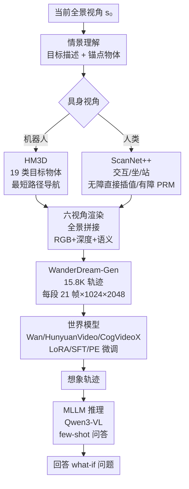

# What if? Emulative Simulation with World Models for Situated Reasoning

**会议**: ECCV2026  
**arXiv**: [2603.06445](https://arxiv.org/abs/2603.06445)  
**代码**: [https://github.com/RuipingL/WanderDream](https://github.com/RuipingL/WanderDream)  
**领域**: 多模态VLM / 具身推理  
**关键词**: 模拟性模拟, 情景推理, 世界模型, 全景视频, 具身智能

## 一句话总结
WanderDream 是首个大规模"模拟探索"（emulative simulation）数据集，包含 15.8K 全景轨迹视频和 158K 问答对，让 agent 无需物理移动就能通过世界模型想象前往目标情景的完整路径并回答空间"what-if"问题。

## 研究背景与动机

情景推理（situated reasoning）是具身智能体的核心能力，无论对机器人还是视障辅助穿戴设备都至关重要。然而，现有方法严重依赖主动探索：要么像 SQA3D 在预探索的静态场景中推理，要么像 OpenEQA 在探索过程中实时更新记忆。这两种范式在真实世界中都面临根本性瓶颈——机器人受机械结构限制（不能爬楼梯、只能在平整地面运动），视障用户则有心理安全顾虑（面对未知障碍物时不敢继续前进）。动态环境中持续变化的障碍物使"先探索后理解"的范式彻底失效，agent 需要一个无需物理移动就能"预演"的机制。

认知心理学将心理想象分为两个层次：**工具性模拟**（instrumental simulation）面向任务驱动，已被导航世界模型（PathDreamer、Navigation World Models）和动作推理（WorldVLA）广泛探索；**模拟性模拟**（emulative simulation）则是体验导向的——"设身处地"地走上那条路、感受沿途场景变化，并回答"如果我走到某个位置，会看到什么？"这类假设性问题。后者是空间推理中更基础的能力，却因缺少大规模数据支撑而几乎未被研究。

本文的切入角度是从数据源头填补这一空白：既然主动探索在诸多场景不可行，能否让 agent 通过世界模型在头脑中"走一遍"完整路径，再基于想象轨迹回答情景问题？**核心 idea：WanderDream——首个专门面向模拟性模拟的大规模数据集，整合 HM3D（机器人导航）和 ScanNet++（人类活动）两大场景源的 15.8K 全景轨迹视频与 158K QA 对（10 类题型覆盖起始态/路径/终点三阶段），并配以世界模型+多模态大模型的顺序式评估框架来检验"想象→推理"的有效性与 sim-to-real 迁移能力。**

## 方法详解

### 整体框架

WanderDream 由两个互补的子集构成：**WanderDream-Gen** 提供从当前视角到目标情景的连续全景轨迹（训/测世界模型的视频生成能力），**WanderDream-QA** 沿轨迹标注 10 类推理问题（评估想象后的情景推理能力）。两条数据生成线并行，覆盖机器人和人类两种具身视角。

WanderDream-Gen 的视频构建双线并行：机器人侧以 HM3D 网格化场景为底，19 类目标物体导航为任务，Habitat-Sim 最短路径规划器调度 MOVE_FORWARD(0.25m)/TURN_LEFT_RIGHT(10°) 动作生成离散路径。人类侧以 ScanNet++ 室内场景为底，从"交互/坐/站"三种情景锚点出发，随机采样距目标 1.5–3m 的起点；无障碍物时直接插值位置和朝向，有障碍物时构建 3D 概率路图（PRM）并运行 Dijkstra 求解最短路径，对 capsule-validated 边施加垂直高度惩罚并做 micro-PRM 局部修复。两种视角生成的轨迹均固定 21 帧全景图（1024×2048），附带深度图、语义图和相机位姿。

WanderDream-QA 基于轨迹 GT 标注，由 GPT-5 生成 158K QA 对。生成时用 Set-of-Mark（SoM）在 start/end cubemap 上叠加实例 ID，并提供 JSON 结构化元数据（方向、距离）辅助空间定位。人工抽检 800 对，Likert 评分 4.73–4.88。

### 关键设计

**1. 双情景路径生成：机器人 vs 人类的不同约束建模**

两种具身 agent 的运动模式和场景约束截然不同，需要差异化的路径生成策略。机器人在 HM3D 的平整网格中以离散动作（前进/转向）做最短路径导航，移动步长 0.25m、转向 10°，适用于仓库/平地场景的路径规划。人类在 ScanNet++ 的室内环境中更灵活（可跨越垃圾箱而非绕行），但室内空间小（起点距目标仅 1.5–3m），且需要处理墙壁等不可穿越障碍。对有障碍的场景，流程是：构建 3D PRM 路图 → 胶囊体碰撞验证（capsule validation）→ 对穿过不可穿越区域的边加重垂直高度惩罚 → Dijkstra 求最短路径 → 对无效段做 micro-PRM 局部重规划。此外，为模拟真实全景相机的晃动特性，人类视角的起始帧添加±30° 随机俯仰；终点态中站立/坐姿保持水平对齐，交互态则朝向目标物体。

**2. 十类渐进式推理问答体系：覆盖全轨迹的 3 阶段设计**

现有情景推理数据集（SQA3D、MSQA）的 QA 类型多关注静态场景的物体关系，缺少沿路径的动态推理维度。本文沿轨迹划分三个阶段、每段 10 个问题，确保信息完整覆盖：起始态（s₀，3 问）考察**物体感知**（定位附近物体以确定 agent 当前位置）、**可导航性推理**（四方向是否畅通）和**自我-目标方位关系**（agent 与目标情景的全局空间关系）；路径阶段（s₀→s_T，4 问）考察**地标顺序记忆**（沿途经过哪些地标及其顺序）、**距离估计**、**障碍物识别**；机器人额外做**路径规划**（判断何时转向/直行），人类替换为**相对距离变化**（沿路向特定物体靠拢还是远离）；终点态（s_T，3 问）考察**功能物可及性**（目标附近是否有可交互物体）、**自我中心空间关系**（目标物相对 agent 的方向和距离）和**物体间近距离对比**（从 agent 视角看两物体谁更近）。

**3. 顺序式想象-推理评估框架：解耦视频生成与情景推理**

目前没有开源模型能一体输出视频+文本，因此本文设计两阶段顺序框架。第一阶段用世界模型生成从 s₀ 到目标情景的想象轨迹，支持两种注入方式：(a) LoRA/SFT 微调——在 WanderDream-Gen 上训练 8-10 epoch 直接习得场景变换规律；(b) MLLM prompt extension——用大模型把目标分解为动作序列（"向左转到看到冰箱→前进到柜前→右转到面对水槽"），无参数更新、但依赖外部语言先验。第二阶段用 MLLM（Qwen3-VL-32B 或 LLaVA-OneVision）对生成的轨迹做 few-shot 推理。为消除不同视频管道引入的偏差，生成视频统一采样每 5 帧 1 帧（s_Δ5）供 MLLM 输入。

评估指标分为两路：视频生成用 FVD（轨迹连贯性）、End-FID（终点态预测精度）、球形 SSIM 和 LPIPS（全景几何/感知一致性）；QA 准确性用 GPT-as-judge 打分（$C=\frac{1}{N}\sum_{i=1}^{N}\frac{s_i-1}{4}\times100\%$，其中 $s_i\in[1,5]$ 为 GPT 对每个回答的评分），与人工判断 Spearman 相关系数达 0.972。

### 一个完整示例

以 HM3D 厨房场景为例：当前视角 s₀ 面对带有花饰窗户的橱柜，目标情景描述为"导航到花窗下的水槽"。WanderDream 在该场景中从 s₀ 出发，Habitat-Sim 规划的最短路径约为 2.6m，经 3 步前进 + 1 次右转到达水槽前方——完整的 21 帧全景轨迹清晰呈现画面逐步右移、水槽从视野右侧逐渐居中。Wan2.1 经 LoRA 微调后能复现这一轨迹，生成的终点态 End-FID 达到 40.20。基于这 21 帧中均匀采样的 5 帧，MLLM 可以回答"沿途经过了哪几个地标？"（冰箱→水槽上方的储物柜→水槽）和"水槽附近有哪些可交互物品？"（水龙头、右侧的砧板）。

### 损失函数 / 训练策略

世界模型微调：Wan 和 HunyuanVideo 采用 LoRA（rank 32/64），CogVideoX1.5 因图像预处理管道特殊改用全参数 SFT。训练统一在 384×768 分辨率下进行 8-10 epoch，A100×4，batch size 1/GPU，bf16 精度。评估时视频缩放到 256×512。MLLM 统一使用 Qwen3-VL-32B（除非对比实验），GPT-4o-mini 温度=0 打分。

## 实验关键数据

### 主实验：想象对情景推理的必要性

用真实 GT 视频的不同帧输入给 MLLM，检验是否需要想象才能回答各阶段问题（数据来自 ScanNet++ 人类视角子集）：

| 输入设置 | 起始态 Avg | 路径阶段 Avg | 终点态 Avg | 说明 |
|---------|-----------|------------|-----------|------|
| 仅当前帧 s₀（无想象） | **32.5** | 36.4 | 45.5 | 起始态问题仅需当前感知即可解答 |
| 仅当前+目标帧 s₀+s_T | 30.2 | 34.7 | 46.0 | 知道目标位置对终点态帮助有限 |
| 均匀采样 5 帧 s_Δ5 | 29.8 | 37.0 | **48.6** | 路径中间帧提供了终点理解的关键线索 |
| 全视频帧 | 28.5 | **37.3** | 47.5 | 冗余帧干扰起始态但强化路径推理 |

核心发现：**想象的重要性沿轨迹递增**——起始态仅需当前帧即可（信息最多），但终点态需要路径中间帧的过渡信息辅助理解；s_Δ5（均匀采样 5 帧）在终点态上超越仅给两端的 s₀+s_T，说明路径的连贯想象比"跳看"两端更能帮助理解目标情景。

### 消融：世界模型在 WanderDream-Gen 上的视频生成质量

| 模型 | 微调方式 | HM3D FVD↓ | HM3D End-FID↓ | 说明 |
|------|---------|-----------|--------------|------|
| Wan2.1 | LoRA | **5.96** | **40.20** | 综合最佳，视频质量与终点预测均领先 |
| Wan2.2 | LoRA | 6.19 | 40.13 | End-FID 略优，FVDr 稍逊 |
| HunyuanVideo | LoRA | 14.50 | 62.01 | 轨迹连贯性可接受但终点模糊 |
| CogVideoX1.5 | SFT | 22.16 | 42.74 | 终点预测精度高但帧对齐有损失 |
| Wan2.2 | Prompt Extension | 17.62 | 46.86 | 零样本场景下仍能正确朝向移动 |

### 关键发现
- **视频质量与推理性能正相关**：在 WanderDream-QA 上，CogVideoX1.5+SFT（终点态最精确）在 ScanNet++ 路径推理（37.6）和终点推理（47.5）均最高；Wan2.1+LoRA（综合视频质量最优）在 HM3D 路径推理（53.4）最高。更好的视频生成质量直接带来更强的情景推理能力。
- **Sim-to-real 迁移有效**：仅用合成最短路径数据训练的 Wan2.1+LoRA 迁移到真实全景录制场景后，视频质量（FVD 27.49）和 QA 准确性（43.0%）均优于 prompt extension 方案（FVD 41.65、QA 38.8%），尽管真实人的走动并非严格最短路径。
- **Prompt Extension 在无训练场景有效**：Wan2.2+PE 在 HM3D 上 FVD 17.62 优于 fine-tune 的 CogVideoX SFT（FVD 22.16），说明语言引导的相机控制对规则清晰的导航场景足够实用。

## 亮点与洞察
- **填补"模拟性模拟"数据空白**：区别于已有数据集（SQA3D、MSQA 聚焦静态场景、OpenEQA 聚焦探索过程），WanderDream 首次提供从 s₀ 到 s_T 的完整想象轨迹数据集，含视频+QA，使"想象后再推理"的范式成为可能。
- **双视角差异化设计**：机器人（离散导航action）和人类（连续插值/PRM）路径生成策略分别建模两种具身场景约束，不为统一而牺牲真实感。
- **10 类 QA 的三阶段递进结构**：起始态（定位）/ 路径（跟踪）/ 终点态（理解）覆盖推理全链条，且为每种具身视角定制了不同的路径阶段题型。
- **Sim-to-real 验证的严谨性**：真实场景录制的 26 段全景视频（含人体遮挡）直接检验了合成数据训练的零样本迁移表现，发现即使真实行走不遵循最短路径，想象能力仍能有效迁移。

## 局限与展望
- **真实场景规模较小**：当前仅 2 个场景 26 段视频用于 sim-to-real 测试，后续需覆盖更多类型 agent（不同运动能力、不同相机装载方式）和场景。
- **锚点定位错误传播**：当世界模型对目标物体的定位偏差较大时，生成的轨迹方向错误，导致后续 QA 整体失效——这是当前 pipeline 的主要瓶颈。
- **世界模型推理延迟高**：Wan 5B 模型生成一段轨迹需 53s，CogVideoX 需 283s，视频生成基础模型的效率瓶颈限制了实时应用潜力（本文未声称效率贡献）。
- **缺乏端到端模型**：目前需要"视频生成→MLLM 推理"两阶段串联，GPT 调用的 pipeline 增加系统复杂度，未来统一视频-文本生成模型是明确方向。

## 相关工作与启发
- **vs SQA3D / MSQA**：它们在预探索静态场景中做 3D 情景推理，输入含完整点云；WanderDream 仅给当前全景图和目标描述，依赖世界模型想象走向目标，更贴近真实"受限探索"场景。
- **vs MindJourney / GenEx**：MindJourney 面向单步 view change 的逐步想象（每问一步），GenEx 生成前向全景视频，但均未覆盖"从 s₀ 到指定目标情景"的全轨迹；WanderDream 提供 21 帧连贯轨迹 + QA 对，支持拟设性推理（what-if）。
- **vs Navigation World Models / WorldVLA**：这些方法属于工具性模拟——给定动作预测下一帧；WanderDream 则属于体验导向的模拟性模拟——不给定动作序列，只给目标情景描述，模型需自行"脑补"完整路径。

## 评分
- 新颖性: ⭐⭐⭐⭐⭐ 首发"模拟性模拟"数据集+评估基准，填补了想象推理的数据空白，选题视角独特
- 实验充分度: ⭐⭐⭐⭐ 双数据集多维度评估（视频生成 4 指标 + QA 推理 10 类 + sim-to-real），但真实场景测试规模偏小
- 写作质量: ⭐⭐⭐⭐⭐ 问题定义清晰、方法描述完整、实验逻辑层层递进，图表质量高
- 价值: ⭐⭐⭐⭐⭐ 直接推动"想象→推理"新范式，世界模型+MLLM 顺序框架可作为后续工作的标准 baseline

<!-- RELATED:START -->

## 相关论文

- [\[ICLR 2026\] Reasoning in Space via Grounding in the World](../../ICLR2026/vlm_reasoning/reasoning_in_space_via_grounding_in_the_world.md)
- [\[ICCV 2025\] Perspective-Aware Reasoning in Vision-Language Models via Mental Imagery Simulation](../../ICCV2025/vlm_reasoning/perspective-aware_reasoning_in_vision-language_models_via_mental_imagery_simulat.md)
- [\[ACL 2026\] GeoArena: Evaluating Open-World Geographic Reasoning in Large Vision-Language Models](../../ACL2026/vlm_reasoning/geoarena_evaluating_open-world_geographic_reasoning_in_large_vision-language_mod.md)
- [\[ICLR 2026\] MMR-V: What's Left Unsaid? A Benchmark for Multimodal Deep Reasoning in Videos](../../ICLR2026/vlm_reasoning/mmr-v_whats_left_unsaid_a_benchmark_for_multimodal_deep_reasoning_in_videos.md)
- [\[CVPR 2026\] CARE What Fails: Contrastive Anchored-REflection for Verifiable Multimodal Reasoning](../../CVPR2026/vlm_reasoning/care_what_fails_contrastive_anchored-reflection_for_verifiable_multimodal_reason.md)

<!-- RELATED:END -->
