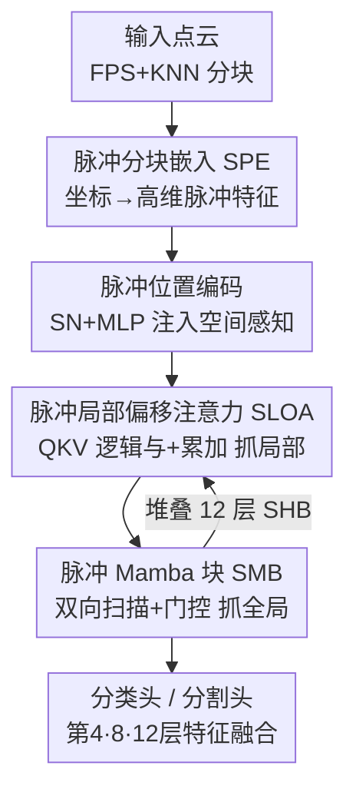

# 3DSMT: A Hybrid Spiking Mamba-Transformer for Point Cloud Analysis

**会议**: ICLR2026  
**OpenReview**: [https://openreview.net/forum?id=KkoS6y0pHP](https://openreview.net/forum?id=KkoS6y0pHP)  
**代码**: 待确认（原文称已开源）  
**领域**: 3D视觉 / 点云分析 / 脉冲神经网络  
**关键词**: 点云分析、脉冲神经网络、Mamba、局部偏移注意力、能效

## 一句话总结
3DSMT 把脉冲神经网络（SNN）的事件驱动低功耗特性，与 Transformer 的局部建模、Mamba 的线性复杂度全局建模拧成一个混合架构，用「脉冲局部偏移注意力 + 脉冲 Mamba 块」在分类、少样本、分割任务上拿下 SNN 方法的 SOTA，能耗只有 ANN 同行的几十分之一，还反超了不少 ANN 模型。

## 研究背景与动机
**领域现状**：点云分析（分类、分割）是自动驾驶、机器人、AR/VR 的底层能力。主流做法从早期的 PointNet/PointNet++（MLP）演进到 Point Transformer（自注意力建模全局依赖），近期又出现 PointMamba 这类把状态空间模型（Mamba）引入点云的工作。这些方法精度很高，但都是传统人工神经网络（ANN）。

**现有痛点**：点云本身是稀疏、无序的，把它喂给稠密计算的深度模型会带来大量「无谓的计算和能耗」。具体而言，Transformer 的点积自注意力对点数 $N$ 是二次复杂度 $O(N^2)$，大规模点云上吃不消；Mamba 虽然把复杂度压到线性 $O(N)$，但它天生面向有序序列，对无序点云缺乏自然适配，强行学序列顺序会产生不稳定的「伪序列依赖」。更根本的是，无论 Transformer 还是 Mamba，都受限于 ANN 范式固有的能耗低效，难以部署到无人机、移动机器人、AR/VR 头显这类算力/电量受限的边缘设备。

**核心矛盾**：精度和能效之间存在尖锐 trade-off。脉冲神经网络（SNN）用稀疏的事件驱动二值脉冲通信、用加法代替乘累加，在神经形态硬件上能做到超低功耗，其稀疏性又天然契合点云的稀疏分布——但已有 SNN 点云方法（Spiking PointNet、P2SResLNet、SPT、SPM）为了省能耗过度牺牲精度，与 ANN 模型仍有明显精度差距，原因在于特征表达能力不足、训练机制不成熟。

**本文目标**：造一个同时具备「局部几何建模 + 线性复杂度全局建模 + SNN 低功耗」三者的统一架构，把 SNN 点云方法的精度拉到能与 ANN 抗衡的水平。

**切入角度**：作者的核心观察是，Transformer 擅长局部细粒度关系、Mamba 擅长线性复杂度全局依赖、SNN 擅长稀疏低功耗——三者的长处恰好互补，关键是把注意力的局部建模和 SSM 的全局建模都「脉冲化」后塞进同一个 SNN 框架里。

**核心 idea**：在统一的脉冲框架内，用脉冲版局部偏移注意力抓局部、用脉冲版双向 Mamba 抓全局，纯靠代理梯度直接训练（不走 ANN-SNN 转换那条增加时序开销的路），实现精度-能效的最优平衡。

## 方法详解

### 整体框架
3DSMT 是一个专为点云设计的脉冲神经网络。给定一团 $N$ 个点的点云 $P\in\mathbb{R}^{N\times 3}$，整条管线是「分块嵌入 → 堆叠 12 层混合块 → 任务头」三段：先用**脉冲分块嵌入（SPE）**把低维点坐标 patch 映射成高维脉冲特征序列，再让序列穿过 $M=12$ 个串联的**脉冲混合块（SHB）**——每个 SHB 内部先用脉冲局部偏移注意力（SLOA）抓局部、再用脉冲 Mamba 块（SMB）抓全局，外加脉冲位置编码（SPE-pos）补空间感知，最后由分类头/分割头出结果。

具体地，输入先用最远点采样（FPS）选出 $L$ 个中心点，每个中心点用 KNN 构出局部 patch；由于脉冲神经元带时空维度，patch 会沿时间步 $t\in[0,T)$ 复制 $T$ 份再送进网络。Patch 嵌入后拼上一个可学习的 `[CLS]` token 形成长度 $L+1$ 的序列，逐层过 SHB。SHB 内部用残差连接组织：

$$O_{i'} = \text{SLOA}(\text{LN}(O_{i-1}+S_{pos})) + O_{i-1}, \quad O_i = \text{SMB}(\text{LN}(O_{i'})) + O_{i'}$$

分割头借鉴 PointBERT，把第 4、8、12 层 SHB 的特征拼起来输出逐点的部件概率；分类头则是堆叠线性层。

### 关键设计

**1. 脉冲局部偏移注意力（SLOA）：用脉冲逻辑运算抓局部几何，顺带省掉 softmax 的浮点能耗**

这一块针对的痛点是「点云的局部几何细节很关键，但 Transformer 的标准自注意力靠 softmax 做浮点乘累加（MAC），既贵又费电」。SLOA 的做法是：先借鉴 Mamba3D 的 K-Norm（把中心点局部特征向邻点传播）和 K-Pool（局部特征聚合）得到 $S_1=\text{K-Pool}(\text{K-Norm}(S))$，再过脉冲神经元层（SN）把局部特征转成 $\{0,1\}$ 的脉冲序列 $S_2$，然后用线性变换得到 $Q,K,V$（每步都串 Linear-BN-Spiking，简记 LBS），算注意力 $A=Q\cdot K^T\cdot V$。

关键巧思在于：由于脉冲序列天然稀疏且非负，注意力矩阵 $A$ 的计算可以直接用「逻辑与（AND）+ 累加（AC）」实现，完全绕开传统 ANN 里 softmax 引入的浮点 MAC，能耗骤降。之后它不是直接用注意力特征，而是算注意力特征与输入 $S_2$ 的**偏移**（逐元素相减），过 SN 和 MLP 后再加回 $S_2$：

$$S_3 = \text{MLP}(\text{SN}(S_2 - \text{SN}(A))) + S_2$$

这个「偏移注意力」让模型更显式地凸显局部区域内的特征差异，强化对细微结构变化的捕捉，从而提升细粒度局部表征。

**2. 脉冲 Mamba 块（SMB）：把无序点云的全局建模脉冲化，用双向扫描 + 门控解决「伪序列依赖」**

Mamba 的强项是线性复杂度全局建模，但它面向有序序列，点云无序，强行学序就会产生不稳定的伪序列依赖。SMB 的设计是把 Mamba 的全局建模与 SNN 的省能优势融合，并用双向扫描化解无序问题。流程上，输入特征 $Z$ 先经 SN 转成二值脉冲序列 $Z_1$（稀疏化、降冗余），然后分两支：SSM 支把 $Z_1$ 经 Linear+SN 编码成 $Z_S$，再用双向扫描得到两个方向的依赖 $Z_L=\text{L+SSM}(\text{Conv1d}(Z_S))$ 与 $Z_C=\text{C-SSM}(\text{Conv1d}(Z_S))$；门控支产生稀疏脉冲门控矩阵 $Z_G$，与 $Z_L,Z_C$ 做 Hadamard 积实现特征选择与过滤：

$$Z_2 = (Z_L\otimes Z_G) + (Z_C\otimes Z_G), \quad Z_3 = \text{Lin}(\text{SN}(Z_2))$$

这里 L+SSM 是原始 Mamba 的扫描策略、C-SSM 是 Mamba3D 提出的通道翻转扫描，二者组合即「双向」。SMB 还用非因果 Conv1D 消除时序伪影。它有效之处在于：脉冲稀疏化压掉了特征冗余，双向扫描补全了无序点云缺失的方向信息，动态脉冲门控选择性激活显著特征、抑制噪声，且消融显示双向扫描**不增加额外能耗**就能涨点。

**3. 脉冲位置编码（SPE-pos）：在脉冲域里给无序点云补回空间结构信息**

无序点云丢了空间位置就难学几何，而位置编码也得脉冲化才能融进 SNN。作者设计了可学习的点云位置编码：交替堆叠脉冲神经元层（SN）和 MLP，对每个点 $p=(x,y,z)$，先用 SN 借神经元膜电位动力学把原始坐标初始化成带时间依赖的时空特征，再用 MLP 做特征变换增强几何表达，输出最终位置编码。每个 SHB 都注入这份位置编码 $S_{pos}\in\mathbb{R}^{(L+1)\times C}$ 来增强空间感知。

**4. 全脉冲混合 + 代理梯度直接训练：把局部、全局、位置三块统一进事件驱动框架，靠 IF 神经元省内存省电**

整个 3DSMT 的统领设计是「混合 + 全脉冲」：SHB 把 SLOA（局部）、SMB（全局）、SPE-pos（位置）三块都放进同一个脉冲框架，残差串联、堆 12 层。底层用 Integrate-and-Fire（IF）神经元——它内存和能耗需求都低，适合能耗敏感任务；训练上严格走「代理梯度直接训练」，避开 ANN-SNN 转换带来的额外时序开销，保证低能耗。正是这套混合设计让模型同时拿到 Transformer 的局部细粒度、Mamba 的线性全局、SNN 的事件驱动低功耗，实现精度-能效的联合最优。

### 损失函数 / 训练策略
模型基于 PyTorch + SpikingJelly 实现，用代理梯度直接训练 SNN（不做 ANN-SNN 转换）。两个 SNN 专属超参对结果影响很大：脉冲发放阈值（Threshold）和时间步（TimeStep）。实验扫了阈值 $\{0.5,1.0,1.5,2.0\}$ 与时间步 $\{1,2,3,4\}$ 的组合，最优为 TimeStep=3、Threshold=1.0；阈值太低会引入噪声、太高会压住有用特征，时间步超过 3 会引入冗余信息反而掉点。SLOA 邻域 $k=4$、token 数 $L=128$ 为最优。分类还可叠加 voting 后处理进一步涨点。

## 实验关键数据

### 主实验
分类：ScanObjectNN 三个变体 + ModelNet40，对比 ANN 与 SNN 两类方法（能耗单位 mJ，FLOPs 单位 G）。

| 方法 | 类型 | FLOPs | PB_T50_RS OA | ModelNet40 OA | 能耗 |
|------|------|-------|------|------|------|
| PCM | ANN | 45.0 | 88.1 | 93.4 | 207.0 |
| PTv2 | ANN | 17.1 | - | 93.7 | 78.7 |
| SIM | ANN | 3.6 | 87.3 | 92.7 | 16.6 |
| SPM（前 SNN SOTA） | SNN | 1.5 | 84.2 | 92.3 | 5.4 |
| **3DSMT (w/ vot.)** | SNN | **1.3** | **92.0 (+7.8)** | **95.2 (+2.9)** | **4.3** |

要点：3DSMT 在 ScanObjectNN 最难变体 PB_T50_RS 上比次优 SNN（SPM）猛涨 7.8%；ModelNet40 上 95.2% OA 比 SPM 涨 2.9%、能耗还降了 1.1 mJ。对比 ANN：超过单 Mamba 的 PCM（93.4%）1.8% 且能耗降至 1/48，超过单 Transformer 的 PTv2（93.7%）1.5% 且能耗降至 1/18。

少样本（ModelNet40）：5-way 10/20-shot 达 92.8%/96.2%，10-way 10/20-shot 达 87.2%/92.1%，远超 SNN 基线 SpikePointNet，与 ANN 的 Mamba3D 持平。部件分割（ShapeNetPart）：Cat.mIoU 82.7%、Ins.mIoU 85.1%，均为 SNN 方法最高。语义分割（S3DIS）mIoU 70.2% 为 SNN 最佳、能耗仅 11.4 mJ（ANN 的 PTv3 虽达 73.6% 但要 687.7 mJ）。效率（ModelNet40）上训练/推理延迟 298ms/142ms、显存 10.1G/4.6G，全面优于 SPT 系列与 Mamba3D。

### 消融实验
混合架构消融（ModelNet40 / ScanObjectNN，Table 7）：

| 配置 | 类型 | ModelNet40 OA | 能耗 | 说明 |
|------|------|------|------|------|
| Full | ANN | 94.9 | 36.3 | ANN 上限，但能耗爆炸 |
| No-MT | SNN | 92.1 | 3.3 | 去掉 Transformer 和 Mamba，基线 |
| Only-T | SNN | 93.8 | 4.1 | 只加 Transformer |
| Only-MB | SNN | 94.0 | 4.0 | 只加双向 Mamba |
| Full-MUT | SNN | 94.2 | 4.3 | 混合 + 单向 SSM |
| **Full-MBT** | SNN | **94.7** | 4.3 | 混合 + 双向 SSM（本文） |

扫描策略消融（Table 11）：单向 SSM 94.2% → L-SSM+C-SSM 双向 94.7%；排序策略消融（Table 10）：No Order（94.7%）反而优于 Shuffle/Z-order，证明模型能直接吃无序点云。

### 关键发现
- **混合 + 双向是涨点主力**：从 No-MT（92.1%）到 Only-T/Only-MB 再到 Full-MBT（94.7%），逐块叠加都涨；双向 SSM 比单向涨 0.5% 且零额外能耗，说明双向扫描是「免费午餐」。
- **SNN 把能耗压到 ANN 的零头**：Full（ANN）94.9% 要 36.3 mJ，而 Full-MBT（SNN）94.7% 只要 4.3 mJ——精度只差 0.2%，能耗差近 8.4 倍。
- **超参有甜区**：TimeStep=3、Threshold=1.0、$k=4$、$L=128$ 均为先升后降的峰值；时间步过长引入冗余、阈值过高压住特征。
- **真实世界数据优势更明显**：分割涨幅（+0.3~0.4%）小于分类，因 ShapeNetPart 是无噪合成数据、区分度低；而 ScanObjectNN 含真实噪声/遮挡，3DSMT 在其上优势更突出。

## 亮点与洞察
- **把注意力矩阵脉冲化成「逻辑与 + 累加」**：因为脉冲序列稀疏非负，$Q\cdot K^T\cdot V$ 可以直接用 AND+AC 算，绕开 softmax 的浮点 MAC——这是 SNN 省能的核心抓手，能迁移到任何需要把注意力部署到神经形态硬件的场景。
- **偏移注意力而非普通注意力**：算注意力特征与输入的差值再加回，比直接用注意力更能凸显局部结构差异，是个轻量但有效的细节增强 trick。
- **三长互补的工程哲学很干净**：Transformer 管局部、Mamba 管线性全局、SNN 管低功耗，各取所长塞进一个残差块堆叠，思路清晰、易复现。
- **双向扫描零成本涨点**：用 L-SSM + C-SSM 组合补无序点云的方向信息，不增能耗就涨精度，对所有把 Mamba 用到无序数据上的工作有借鉴意义。

## 局限与展望
- 作者明确把任务范围限定在分类/少样本/分割，未涉及目标检测与场景理解这类更复杂的点云任务，留作未来工作。
- ShapeNetPart 上提升很小（+0.3~0.4%），作者归因于数据集本身区分度低、ANN 方法也都挤在 85%-87%，但这也说明部件分割上 3DSMT 的优势并不显著。
- 与最强 ANN（如 S3DIS 上 PTv3 73.6%、SemanticKITTI 上 PTv3 75.5%）相比仍有精度差距，3DSMT 卖点是「精度-能效平衡」而非绝对精度天花板。
- SNN 的硬功耗优势依赖神经形态硬件落地，论文中的能耗为估算值；在通用 GPU 上的实际收益还需结合硬件适配评估。
- 可改进方向：把 SLOA 的偏移注意力与 SMB 的门控进一步统一、或探索自适应时间步以避开「时间步过长掉点」的硬性甜区限制。

## 相关工作与启发
- **vs PointMamba / Mamba3D（ANN Mamba）**：它们率先把 Mamba/双向扫描引入点云，本文沿用了 K-Norm/K-Pool（来自 Mamba3D）和 C-SSM 扫描，但全程脉冲化并叠加 Transformer 局部分支，能耗降至几十分之一、精度反超。
- **vs SPM（前 SNN SOTA，Spike Mamba）**：SPM 是首个脉冲 Mamba 点云框架、用时间翻转双分支，本文改用「水平翻转 + 通道翻转」的双向策略并加入脉冲偏移注意力，在 PB_T50_RS 上猛超 7.8%。
- **vs SPT（脉冲 Transformer）**：SPT 是首个脉冲 Transformer 点云分类框架但 FLOPs 高（14.0G）、精度有限；3DSMT 用 1.3G FLOPs 拿到更高精度，靠的是 Mamba 的线性全局建模分担了 Transformer 的二次成本。
- **vs Point Transformer / PTv2/PTv3（ANN Transformer）**：ANN Transformer 是精度天花板但能耗极高（PTv3 在 S3DIS 上 687.7 mJ），本文以接近的精度把能耗压到 11.4 mJ，主打边缘部署。

## 评分
- 新颖性: ⭐⭐⭐⭐ 首次把脉冲偏移注意力 + 脉冲双向 Mamba 拧进统一 SNN 框架，组合创新扎实，但单个组件多有出处。
- 实验充分度: ⭐⭐⭐⭐⭐ 覆盖分类/少样本/部件分割/语义分割/场景分割五类任务，消融细到阈值-时间步组合与扫描策略。
- 写作质量: ⭐⭐⭐⭐ 结构清晰、公式完整，个别表述与拼写略糙。
- 价值: ⭐⭐⭐⭐ 为高性能低功耗点云分析提供了可落地的 SNN 范式，对边缘 3D 感知有实际意义。

<!-- RELATED:START -->

## 相关论文

- [\[ICLR 2026\] Spiking Discrepancy Transformer for Point Cloud Analysis](spiking_discrepancy_transformer_for_point_cloud_analysis.md)
- [\[ICCV 2025\] Efficient Spiking Point Mamba for Point Cloud Analysis](../../ICCV2025/3d_vision/efficient_spiking_point_mamba_for_point_cloud_analysis.md)
- [\[CVPR 2025\] Spectral Informed Mamba for Robust Point Cloud Processing](../../CVPR2025/3d_vision/spectral_informed_mamba_for_robust_point_cloud_processing.md)
- [\[AAAI 2026\] DAPointMamba: Domain Adaptive Point Mamba for Point Cloud Completion](../../AAAI2026/3d_vision/dapointmamba_domain_adaptive_point_mamba_for_point_cloud_completion.md)
- [\[AAAI 2026\] Graph Smoothing for Enhanced Local Geometry Learning in Point Cloud Analysis](../../AAAI2026/3d_vision/graph_smoothing_for_enhanced_local_geometry_learning_in_point_cloud_analysis.md)

<!-- RELATED:END -->
