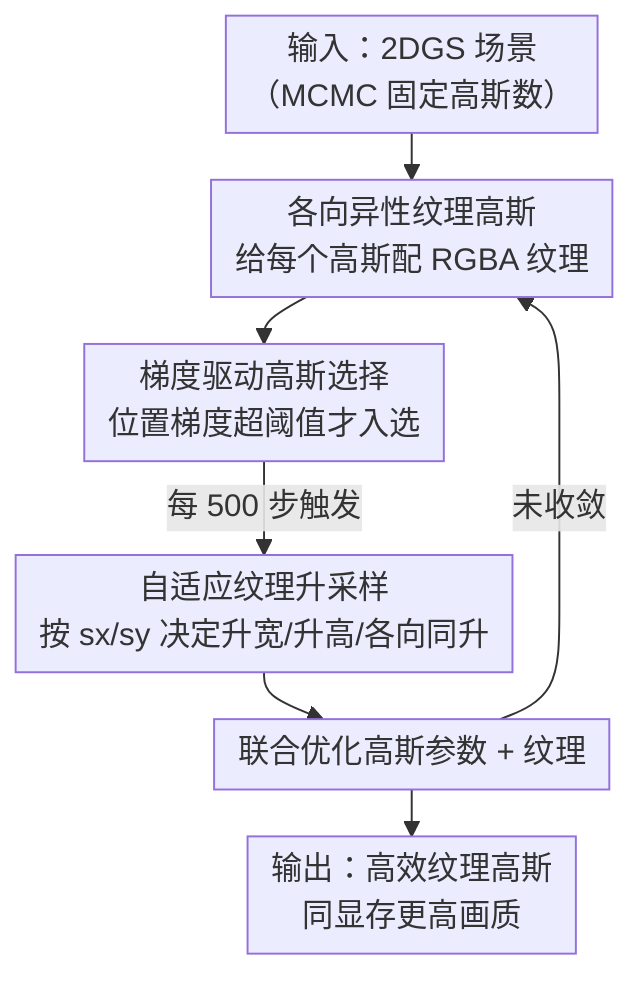

# A²TG: Adaptive Anisotropic Textured Gaussians for Efficient 3D Scene Representation

**会议**: ICLR2026  
**OpenReview**: [https://openreview.net/forum?id=EPN5MU4liR](https://openreview.net/forum?id=EPN5MU4liR)  
**代码**: 待确认  
**领域**: 3D视觉 / Gaussian Splatting / 场景表示  
**关键词**: 高斯泼溅, 纹理高斯, 各向异性纹理, 自适应分辨率, 内存效率

## 一句话总结
A²TG 给每个 2D 高斯配一张分辨率和长宽比都自适应的「各向异性纹理」，用梯度驱动的选择 + 升采样规则把纹理参数只花在真正需要高频细节的高斯上，从而在相同显存预算下比固定方形纹理的高斯泼溅画质更高、显存更省。

## 研究背景与动机
**领域现状**：3D Gaussian Splatting（3DGS）和它的面片变体 2D Gaussian Splatting（2DGS）已经成为高质量、实时 3D 场景渲染的主流表示。为了让单个高斯也能承载更丰富的外观，近期一类「纹理高斯（Textured Gaussians）」工作给每个高斯贴上一张可学习的纹理贴图，用来表达比球谐（SH）颜色更细的高频外观。

**现有痛点**：这些纹理高斯几乎都给每个 primitive 分配一张**固定大小的方形纹理**（比如统一 $4\times4$）。但场景里的高斯天差地别——有的投影面片很大、覆盖高频区域，需要细致纹理；有的投影只覆盖几个像素、不透明度极低、或被前景遮挡，贴再大的纹理也几乎没用。一刀切的方形纹理把大量参数浪费在「不需要细节」的高斯上，膨胀存储、浪费显存。

**核心矛盾**：固定方形纹理忽略了高斯本身的**几何各向异性**。2D 高斯往往是被拉长的椭圆面片，沿某个方向细长，用方形纹理去贴一个细长结构，要么分辨率不够、要么在不重要的方向上白白堆像素——纹理形状和高斯几何对不上。

**本文目标**：让纹理参数「按需分配」——既要决定每个高斯**该不该**升纹理分辨率，又要决定升成**什么形状**（方形还是细长的各向异性）。

**切入角度**：作者观察到，致密化（densification）里常用的**位置梯度**天然标记了「哪里高频、重建误差大」。同样的信号也可以用来判断「哪个高斯值得分配更多纹理预算」；而高斯两条半轴的比例（$s_x/s_y$）则天然指示了它应该往哪个方向加细节。

**核心 idea**：用「梯度引导」决定哪些高斯升纹理、用「高斯各向异性」决定纹理升成什么长宽比，把固定方形纹理替换成**自适应各向异性纹理**，在同样显存里把参数花在刀刃上。

## 方法详解

### 整体框架
A²TG 建立在 2DGS 之上。2DGS 把场景表示成一堆扁平 2D 高斯，每个高斯有中心 $\mu_i$、2D 尺度 $s_i$、旋转四元数 $r_i$、不透明度 $o_i$ 和球谐系数 $c_i^{SH}$，并在每个高斯的局部空间定义 uv 坐标，便于一致地采样纹理。

整个训练分两阶段。**第一阶段**用集成了 MCMC 致密化的 2DGS 训练 30,000 步，此时纹理固定为 $1\times1$ 且 RGB/alpha 纹理都置零（等价于没纹理），目的是用 MCMC 把最终高斯总数稳定下来。**第二阶段**冻结高斯总数、打开纹理（alpha 纹理置 1），再训练 30,000 步，每一步先更新高斯和纹理参数，再执行核心的「梯度驱动自适应纹理控制」：先用位置梯度**选**出需要升分辨率的高斯，再按各向异性**升采样**它们的纹理。如此循环，让每张纹理的分辨率和长宽比逐步贴合所属高斯的各向异性足迹。

### 关键设计

**1. 各向异性纹理高斯：让纹理形状对齐高斯几何**

针对「固定方形纹理和细长高斯对不上」这个痛点，A²TG 给每个 2D 高斯配一张 RGB 纹理 $T_i^{RGB}$ 和一张 alpha 纹理 $T_i^A$，但**宽高可以不等**：把局部 uv 坐标从 $[-1,1]$ 重映射到 $[0,T_i^u]$ 和 $[0,T_i^v]$，其中 $T_i^u$、$T_i^v$ 是第 $i$ 个高斯各自的纹理宽和高，因此每张纹理都能有不同的宽高。最终单个高斯对像素 $x$ 的颜色贡献由球谐颜色加纹理颜色组成：$c_i(x)=c_i^{SH}+T_i^{RGB}(u(x))$，而它的 alpha 为 $\alpha_i(x)=o_i\cdot G(u(x))\cdot T_i^A(u(x))$，纹理值用双线性插值采样，再按前到后 alpha 合成出像素颜色。这样球谐负责平滑低频外观、纹理负责高频残差细节，二者互补；而把纹理做成矩形，正好能用一个细长纹理去贴一个细长高斯，不在无用方向上浪费像素。

**2. 梯度驱动高斯选择：只给「值得」的高斯升纹理**

很多 2D 高斯从纹理里获益甚微——投影面片只覆盖几个像素、不透明度极低、被前景遮挡，或落在墙面这种均匀区域。盲目给所有高斯升纹理就是浪费。作者借鉴致密化里的位置梯度信号来筛选：对渲染视图和训练视图之间的 L1+SSIM 损失 $L$，计算每个高斯的位置梯度 $\nabla_{\mu_i}L$。以 $x$ 方向分量为例，$\dfrac{\partial L}{\partial \mu_{i,x}}=\sum_{k=1}^{3}\dfrac{\partial L}{\partial c^k}\cdot\dfrac{\partial c^k}{\partial \alpha_i}\cdot\dfrac{\partial \alpha_i}{\partial \mu_{i,x}}$。这个梯度很巧妙地把三类信息编进了一个数：第一项 $\partial L/\partial c^k$ 是像素差，意味着已经重建好的区域不会再分配额外参数；后两项里 $\partial c^k/\partial \alpha_i$ 隐含了来自其它高斯的遮挡、不透明度、像素贡献次数等信息。把位置梯度在覆盖像素上取绝对值累加（沿用 AbsGS），若幅值超过阈值 $\|\nabla_{\mu_i}L\|_2>k_G$，就说明这个高斯上有高频内容、值得升纹理，被选为候选。换句话说，「该不该升」直接由「这里还有多少重建误差且没被遮挡」决定，而不是拍脑袋设规则。

**3. 自适应纹理升采样：用高斯各向异性决定升成什么形状**

选出候选后，A²TG 不是无脑各向同性加倍，而是看高斯两条半轴 $s_x$、$s_y$ 的比例来定方向。规则是：若 $s_x/s_y>k_A$ 且 $s_y<k_S$，就只把 $T^u$ 翻倍（沿长边加细节）；若 $s_y/s_x>k_A$ 且 $s_x<k_S$，就只把 $T^v$ 翻倍；否则两个方向都翻倍。$k_A$、$k_S$ 是预设阈值。这条规则的好处是把分辨率优先花在「对梯度变化最敏感的那个维度」上——细长高斯只在长方向上加像素，近方形高斯才各向同升，从而既省参数又对得上几何。升采样时新纹理用旧纹理最近邻像素初始化，再和高斯参数一起在后续迭代联合优化；升采样每 500 步触发一次，让梯度先累计够再调分辨率。最终单张纹理在 $\{1,2,4\}\times\{1,2,4\}$ 之间变动，既有方形也有各向异性形状。

### 损失函数 / 训练策略
训练用 2DGS 标准的 L1 + SSIM 重建损失（关闭了 2DGS 里的深度畸变和法向一致性两项，因为它们主要提升网格质量、会略微牺牲图像保真度）。两阶段各 30,000 步，第一阶段无纹理 + MCMC 固定高斯数，第二阶段开纹理 + 自适应纹理控制。关键超参 $k_A=4.0$、$k_S=0.01$、$k_G=0.00002$，自适应升采样在迭代 500、1000 步执行，最终纹理停在 $\{1,2,4\}\times\{1,2,4\}$。

## 实验关键数据

数据集：Mip-NeRF 360（7 个场景）、Tanks and Temples（2 个）、Deep Blending（2 个）；指标 PSNR / SSIM / LPIPS，外加高斯数（#GS）和可训练参数显存（MB）。每 8 张取 1 张做测试集。对比对象：2DGS、Textured Gaussians、BBSplat、SuperGaussians（Textured Gaussians 用基于 2DGS 光栅化的非官方实现，记作 \*）。

### 主实验

**设置一：固定显存预算（约 200 MB）下比画质**

| 数据集 | 方法 | PSNR↑ | SSIM↑ | LPIPS↓ | 显存 |
|--------|------|-------|-------|--------|------|
| Mip-NeRF 360 | Textured Gaussians* | 28.37 | 0.832 | 0.188 | 200.0 MB |
| Mip-NeRF 360 | **A²TG (Ours)** | **28.51** | **0.838** | **0.174** | 199.7 MB |
| DeepBlending | Textured Gaussians* | 29.51 | 0.897 | 0.198 | 200.0 MB |
| DeepBlending | **A²TG (Ours)** | **29.86** | **0.900** | **0.187** | **189.4 MB** |

同样显存下，A²TG 在各纹理高斯方法里整体画质最好（尤其 PSNR），因为它能用更省的纹理参数换来更多的高斯。其它纹理方法因纹理参数过多，在固定显存约束下画质反而被拖累。

**设置二：固定高斯数下比显存增量**

| #GS | 方法 | PSNR↑（Mip-NeRF 360） | 显存增量 |
|-----|------|------------------------|----------|
| 1M | Textured Gaussians* | 28.81 | +110% |
| 1M | **A²TG (Ours)** | 28.70 | **+25%** |
| 500k | Textured Gaussians* | 28.47 | +110% |
| 500k | **A²TG (Ours)** | 28.31 | **+28%** |

固定高斯数时，Textured Gaussians 的画质比 A²TG 略高（约 +0.4 dB PSNR），但纹理显存要多出**四倍以上**（+110% vs +25~28%）。A²TG 用极小的画质代价换来大幅显存节省。

### 消融实验

在 50k/100k/500k/1M 四档高斯数、三数据集平均下，对比完整模型与两个变体（下表为 #GS = 1M 一档，其余档位结论一致）。

| 配置 | PSNR↑ | SSIM↑ | LPIPS↓ | 显存↓ | 说明 |
|------|-------|-------|--------|-------|------|
| w/o Upscaling | 27.03 | 0.854 | 0.170 | 232.0 | 不升纹理，显存最低但画质最差 |
| w/o Anisotropy | 27.38 | 0.859 | 0.162 | 298.2 | 只各向同升，画质接近但显存更高 |
| **Ours (full)** | 27.37 | 0.858 | 0.163 | 286.5 | 各向异性，画质相当但更省显存 |

### 关键发现
- **升采样是画质主力**：去掉纹理升采样（w/o Upscaling）显存最省但画质明显最差，说明自适应升分辨率是画质来源。
- **各向异性是省显存主力**：去掉各向异性（w/o Anisotropy）画质几乎不掉，但显存反而更高——因为方形纹理没法高效贴合细长高斯，得堆更多像素才达到同样效果。两者一对照，正好印证「各向异性=同画质更省」的核心主张。
- **纹理稀疏分配**：在 Garden 场景里，**62.4%** 的高斯保持 $1\times1$（不升纹理），非方形纹理集中在桌板缝隙等锐利边缘，证明梯度驱动选择确实把预算稀疏地花在了真正需要细节的地方。
- **SH 与纹理互补**：去掉纹理会丢失叶片、草地、织物等高频细节；去掉 SH 底色会让渲染整体偏暗、丢失低频光照——二者一个管平滑光照、一个管高频残差，刚好印证「按需分配纹理」的合理性。

## 亮点与洞察
- **一信号两用**：位置梯度本是致密化用来决定「在哪加高斯」的信号，作者直接拿它来决定「在哪加纹理」，省去了为纹理预算单独设计准则，且天然把遮挡/不透明度/像素贡献都编进了一个数——这是最巧妙的复用。
- **几何驱动形状**：用高斯半轴比 $s_x/s_y$ 决定纹理长宽比，把「高斯本来就是各向异性的」这个被以往方法忽略的事实直接变成省参数的杠杆，思路简单但切中要害。
- **可迁移性强**：A²TG 与 3DGS 压缩方法（向量量化、splat 剪枝、上下文模型）是**正交**的，可以叠加；这套「梯度选 + 几何升」的自适应分配逻辑也能迁移到别的「给 primitive 配可变容量附件」的场景。
- **诚实的 trade-off**：作者没有声称「全面碾压」，而是清楚地把结论拆成「同显存我画质更高」「同高斯数我显存更省」两种设置分别说明，避免误导。

## 局限与展望
- **只升不降**：当前只做纹理分辨率升采样，没有在不需要时**降**分辨率，省显存空间还没吃满；作者把「按需 downscale」列为未来工作。
- **未结合纹理压缩**：纹理本身没做压缩，也没联动控制高斯的形状和数量，进一步压显存还有空间。
- **固定高斯数下略逊于堆参数方法**：在等高斯数设置下 PSNR 比 Textured Gaussians 低约 0.4 dB，对极致画质场景仍是代价（虽然换来约 4 倍显存节省）。
- **静态场景**：目前只验证静态场景，作者计划把 A²TG 扩展到 4DGS 等动态模型，并尝试结合 Deformable Radial Kernel 等边界更锐利的灵活 primitive。

## 相关工作与启发
- **vs Textured Gaussians (Chao et al., 2025)**: 它给每个高斯固定 $4\times4$ 方形纹理，A²TG 改成自适应的 $\{1,2,4\}\times\{1,2,4\}$ 各向异性纹理；前者画质略高但纹理显存多 4 倍以上，后者用极小画质代价换大幅省显存。
- **vs BBSplat / SuperGaussians**: 同样是给 2DGS 加纹理/附加参数，但都用预定义固定大小纹理，参数利用率低；A²TG 的梯度 + 几何自适应分配是核心差异。
- **vs 3DGS 压缩方法（向量量化 / splat 剪枝 / 上下文模型）**: 那些方法压的是高斯本身的属性，A²TG 压的是「纹理预算的分配」，两者正交互补、可叠加使用。
- **启发**: 「用训练梯度作为容量分配的指示信号 + 用 primitive 几何决定附件形状」这套思路，对任何「给基元挂可变容量附属表示」的表示学习问题（不止 GS）都有借鉴价值。

## 评分
- 新颖性: ⭐⭐⭐⭐ 把固定方形纹理改成梯度 + 几何驱动的各向异性纹理，切入点扎实但属于在 Textured Gaussians 上的增量改进。
- 实验充分度: ⭐⭐⭐⭐ 两种对比设置（固定显存/固定高斯数）+ 四档高斯数消融 + 纹理分布/分解可视化，论证较完整。
- 写作质量: ⭐⭐⭐⭐ 动机清晰、把 trade-off 诚实拆开讲，公式推导到位。
- 价值: ⭐⭐⭐⭐ 在纹理高斯这条线上把内存效率往前推了一大步，且与压缩方法正交、易于叠加落地。

<!-- RELATED:START -->

## 相关论文

- [\[ICLR 2026\] ComGS: Efficient 3D Object-Scene Composition via Surface Octahedral Probes](comgs_efficient_3d_object-scene_composition_via_surface_octahedral_probes.md)
- [\[CVPR 2025\] Textured Gaussians for Enhanced 3D Scene Appearance Modeling](../../CVPR2025/3d_vision/textured_gaussians_for_enhanced_3d_scene_appearance_modeling.md)
- [\[CVPR 2026\] SGI: Structured 2D Gaussians for Efficient and Compact Large Image Representation](../../CVPR2026/3d_vision/sgi_structured_2d_gaussians_for_efficient_and_compact_large_image_representation.md)
- [\[ICLR 2026\] MEGS2: Memory-Efficient Gaussian Splatting via Spherical Gaussians and Unified Pruning](megs2_memory-efficient_gaussian_splatting_via_spherical_gaussians_and_unified_pr.md)
- [\[CVPR 2026\] EfficientVPR: Toward Efficient Visual Place Recognition via Scene-Aware Prompt Tuning and Adaptive Feature Enhancement](../../CVPR2026/3d_vision/efficientvpr_toward_efficient_visual_place_recognition_via_scene-aware_prompt_tu.md)

<!-- RELATED:END -->
