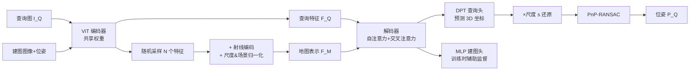

# A Scene is Worth a Thousand Features: Feed-Forward Camera Localization from a Collection of Image Features

**会议**: ICLR 2026  
**OpenReview**: [https://openreview.net/forum?id=rmDA02o8MV](https://openreview.net/forum?id=rmDA02o8MV)  
**项目主页**: [https://nianticspatial.github.io/fastforward/](https://nianticspatial.github.io/fastforward/)  
**代码**: 待确认  
**领域**: 3D 视觉 / 视觉定位 (Visual Localization)  
**关键词**: 相机重定位, 前馈定位, DUSt3R, 场景坐标回归, 相对位姿回归, 多视图  

## 一句话总结
FastForward 把"建图"压缩成一次特征提取：用一组从带位姿建图图像中随机采样、并锚定在 3D 空间的特征当作场景地图，再用一个 DUSt3R 风格的前馈网络一次性预测查询图像的 3D 坐标并解算位姿，做到几秒建图 + 0.5 秒定位的同时，精度追平甚至超越需要几分钟到几小时建图的 SCR / 结构化方法。

## 研究背景与动机
- **领域现状**：视觉定位（估计查询图像的相机位姿）的核心是"场景如何表示"。主流路线有四类——结构化方法靠 SfM 建 3D 模型再 PnP-RANSAC，场景坐标回归 (SCR) 和绝对位姿回归 (APR) 把场景隐式编码进网络权重，相对位姿回归 (RPR) 则只对查询图与检索到的建图图像估计相对位姿。
- **现有痛点**：精度高的方法（结构化 / SCR）建图代价大——SfM 三角化要几分钟到几小时，SCR 训练即便压缩到 ACE 的 5 分钟、GLACE 的 25 分钟也仍是按场景重训，且对未见区域泛化差、需要稠密覆盖。建图便宜的 RPR 只需图像 + 位姿（可由 SLAM 实时拿到），但精度普遍落后；想靠三角化补精度又会拖慢定位。
- **核心矛盾**：**建图速度**和**定位精度**长期是跷跷板两端，没人能在"建图近乎免费"的前提下拿到结构化方法级别的精度。
- **本文目标**：把建图开销压到极致——只剩一个检索步骤，但定位精度仍要对标 SCR / 结构化方法。
- **核心 idea**：作者追问"支撑精确高效定位的**最小地图表示**是什么"，答案是 **一组编码了局部外观 + 3D 位置的图像特征**。**【核心 idea】** 借鉴 DUSt3R，但把"两张图"换成"一张查询图 + 多张建图图像随机采样出的特征集合"，让网络在单次前馈中直接回归查询点在地图坐标系下的 3D 坐标，从而绕开逐对估计相对位姿、并把尺度从建图位姿里直接迁移过来。

## 方法详解

### 整体框架
给定一批带位姿的建图图像 $M=\{I_k\}$，目标是估计查询图 $I_Q$ 相对 $M$ 的位姿 $P_Q$。流程分三步：(1) 用共享权重的 ViT 编码器提特征，从建图图像里**随机采样** $N$ 个特征、叠加射线编码，构成"地图表示"；(2) 解码器在查询特征与地图表示间做自注意力 + 交叉注意力，由 DPT 头预测查询像素的 3D 坐标（归一化空间下，再乘尺度因子 $s$ 还原真实尺度）；(3) 用预测出的 2D-3D 对应跑 PnP-RANSAC 解出位姿。整套架构由 DUSt3R 权重初始化（编码器冻结，解码器微调）。

### 关键设计

**1. 稀疏特征地图：几百个特征就够描述一个场景。** 所有现代定位系统都要从建图图像抽神经网络特征，但全量特征又重又冗余——相似区域并不提供新信息。FastForward 主张只需"几百个"特征即可代表场景，于是固定地图表示大小为 $N$，从所有建图特征里**随机采样** $N$ 个（实验中 Wayspots 用 $N=3000$ 约占总特征的 20%，Indoor6 用 $N=1500$）。这带来两个直接好处：建图阶段只需做一次特征提取，没有训练、没有三角化；推理阶段对建图图像数量近乎"免费扩展"，因为地图大小恒定、查询时延和显存几乎不随建图图数变化（论文 Figure 1 中 1/3/9 张建图图的查询开销基本一致）。因为不知道哪些区域对新查询有用，所以采取随机采样而非启发式选点。

**2. 场景与尺度归一化：让网络跨数据集、跨尺度泛化。** 单目下尺度天然有歧义，多图方法必须从建图位姿里"蒸馏"出尺度才能保证多视图一致；但跨数据集训练时各场景尺度范围差异巨大。作者用一招简单归一化解决：先把某张建图图 $I_0$ 设为参考、把其余位姿变换成 $\bar P_k = P_0^{-1}P_k$ 使场景落在原点；再取归一化后最大平移分量 $s=\max\{|x|,|y|,|z|\}_k^K$ 作为场景尺度，把所有平移缩放成 $\hat t=[x/s,y/s,z/s]^T$。网络在归一化空间里预测坐标，最后乘回 $s$ 还原真实尺度。这样网络学的是"无量纲坐标"，把度量信息的来源交给位姿而非图像——消融显示这显著提升了对训练时未见尺度范围的鲁棒性，也是 FastForward 能在大尺度的 Cambridge 上泛化、而同样基于 DUSt3R 的 MASt3R 却崩掉的关键。

**3. 射线编码：把每个建图特征的来历告诉网络。** 单纯一堆特征丢进网络，网络并不知道它们来自哪个相机、朝哪看。作者给每个采样特征 $f_{ij}^k$ 配一个射线编码：把相机参数化为射线向量，含原点 $\hat t^k$ 和视线方向 $r_{ij}^k=(K_kR_k)^{-1}[u_{ij},v_{ij},1]^T$（$u,v$ 是该特征 token 的中心像素，$K,R$ 为内参与旋转），用 Fourier 编码 (NeRF 同款) tokenize 后过 MLP 投影到与特征同维，得到 $R_{ij}^k$。地图表示即 $F_M=\{R_n+f_n\}$。射线编码让稀疏特征带上了 3D 几何先验，使后续注意力能在"外观相似性"之外推理空间结构。

**4. DUSt3R 式编解码 + 双头监督：单次前馈完成场景推理。** 编码器用预训练 DUSt3R 初始化并冻结，把图像 tokenize 成 $F\in\mathbb{R}^{T\times d}$（$d=1024$）。解码器同样由 DUSt3R 初始化但微调，在自注意力与 MLP 之间插入**交叉注意力**，让查询特征与地图表示相互推理——$\bar F_Q=\mathrm{Decoder}_Q(F_Q,F_M)$、$\bar F_M=\mathrm{Decoder}_M(F_M,F_Q)$，地图表示因此能随查询自适应调整。查询头用 DPT 头回归 3D 坐标（需要捕捉空间结构），建图头只用单层 MLP（仅作训练监督）。训练用 DUSt3R 的置信度加权回归损失 $\ell_{Conf}=\sum_v\sum_i C_i\ell_{Reg}(v,i)-\alpha\log(C_i)$，让网络对天空、半透明物体等模糊区域预测低置信度。作者发现加上建图头的辅助监督能让查询预测更准。

## 实验关键数据

### 主实验表格

Wayspots（小型户外，Unseen 组对比，et=平移中位误差 m / er=旋转误差°）：

| 方法 | 组 | et 平移 ↓ | er 旋转 ↓ | 10cm,10° 准确率 ↑ | 建图时间 | 时延 |
|---|---|---|---|---|---|---|
| ACE (SCR) | Seen | 1.33 | 9.08 | 51.9% | 5 min | 0.1s |
| GLACE (SCR) | Seen | 1.43 | 8.87 | 52.4% | 25 min | 0.1s |
| E5+1 (ALKD-LG) | Unseen | 0.51 | 7.74 | 46.5% | 3s | 0.8s |
| E5+1 (RoMa) | Unseen | 0.77 | 4.12 | 49.5% | 3s | 18.0s |
| Reloc3r | Unseen | 1.31 | 2.04 | 37.1% | 3s | 0.6s |
| **FastForward** | Unseen | **0.17** | **1.75** | **51.4%** | 3s | 0.5s |

Indoor6 / RIO10（室内）：

| 方法 | Indoor6 10cm,10° | Indoor6 20cm,20° | RIO10 10cm,10° | RIO10 20cm,20° | 建图 |
|---|---|---|---|---|---|
| MASt3R+Kapture (Seen) | 89.0 | 93.6 | 24.8 | 32.6 | ~3.5h/~4h |
| GLACE (Seen) | 86.3 | 92.0 | 22.8 | 31.7 | 25 min |
| MASt3R (Unseen) | 45.9 | 76.0 | **45.1** | 58.2 | 8s/10s |
| Reloc3r (Unseen) | 57.4 | 72.8 | 21.4 | 32.9 | 8s/10s |
| **FastForward** | **91.5** | **98.0** | 40.6 | **59.7** | 8s/10s |

Cambridge Landmarks（大尺度户外，平均 et/er）：FastForward 0.27m / 0.4°，Reloc3r 0.52m / 0.5°（FastForward 把平移误差降 48%），E5+1(ALKD-LG) 0.18m/0.3° 最优但依赖稠密结构一致性；MASt3R 因尺度超出训练范围崩到 3.90m。

### 消融实验表格

| 设置 | Wayspots 10cm,10° |
|---|---|
| FastForward + Top-20 检索 | 51.4% |
| FastForward 无检索（随机/均匀选参考图） | 47.8% |
| Reloc3r + 检索 | 37.1% |
| Reloc3r 无检索 | 19.7% |

去掉检索时 FastForward 仅掉 3.6 个点（51.4→47.8），而 Reloc3r 暴跌 17.4 个点（37.1→19.7），说明多视图稀疏地图表示对参考图选取远比单参考图的 RPR 鲁棒。尺度归一化的消融在附录 C.1，显示其对未见尺度范围至关重要。

### 关键发现
- **建图近乎免费仍能 SOTA**：在 Unseen 组，FastForward 几乎全面领先，室内 Indoor6 甚至超过需要 3.5 小时建图的 MASt3R+Kapture；Wayspots 平移中位误差 0.17m，唯一一个低于半米的方法。
- **稀疏 vs 稠密的边界**：在动态变化的 RIO10 上 MASt3R（用全图）10cm 精度更高，提示稀疏地图在场景剧烈变化时可能丢失细节；但 FastForward 20cm 精度仍最优，整体鲁棒。
- **建图/查询经济学**：相比 ACE，约 600 次重定位才到结构化方法的"收支平衡点"——对使用不可预测的长尾地点，FastForward 的即时按需定位更划算。

## 亮点与洞察
- **把"地图"重新定义为一袋带 3D 锚点的特征**，是对"场景表示最小化"这个问题的漂亮回答：建图退化成一次前向特征提取，彻底拿掉了训练与三角化。
- **尺度从位姿迁移而非从图像估计**，配合归一化，让一个模型跨室内外、跨尺度通用，规避了 RPR 一贯的尺度启发式。
- **地图大小解耦于建图图数**：固定 $N$ 让查询时延/显存恒定，工程上对"建图图越加越多"的场景极友好。
- **与 Reloc3r 的对照很有说服力**：同为 DUSt3R 后裔，但 Reloc3r 仍是两视图相对位姿，FastForward 用多视图集合一举把鲁棒性和精度都提上去。

## 局限与展望
- **依赖检索的描述子提取开销**：建检索索引虽快（2500 张 < 1 分钟），但随图数增长仍非可忽略；无检索版精度会下降，作者把"如何选参考图"留作未来工作。
- **稀疏地图在动态/剧变场景的细节缺失**：RIO10 上 10cm 精度不如用全图的 MASt3R，说明随机稀疏采样可能漏掉细粒度细节，自适应/任务感知的采样值得探索。
- **随机采样无显式覆盖保证**：当前靠随机性 + 大 $N$ 兜底，是否有更省的确定性选点策略尚未深究。

## 相关工作与启发
- **DUSt3R / MASt3R / Reloc3r 谱系**：本文是把 DUSt3R 的"两视图点图预测"范式迁移到"查询 + 多视图特征集合"的定位问题，并用尺度归一化补上 DUSt3R 系在大尺度上的泛化短板。
- **SCR（ACE / GLACE）与结构化（hLoc / Active Search）**：作为精度上界对照，FastForward 证明了"无场景特定训练"也能逼近甚至反超它们，尤其在室内。
- **半广义相对位姿（E5+1 solver）**：几何 solver 在稠密一致场景强，但在挑战场景退化；FastForward 用学习式多视图推理在这类场景拉开差距。
- **启发**：这条"前馈基础模型 + 稀疏锚定表示"的思路，可能进一步推广到 SLAM 重定位、AR 即时建图、乃至机器人导航里"用一袋特征当地图"的更广范式。

## 评分
- **新颖性**: ⭐⭐⭐⭐ — "一袋 3D 锚定特征即地图 + 单次前馈定位"的表示设计干净且有洞见，把 DUSt3R 范式创造性地拓展到多视图定位。
- **实验充分度**: ⭐⭐⭐⭐ — 覆盖 Wayspots/Indoor6/RIO10/Cambridge 室内外多基准 + 无检索/尺度归一化消融，Seen/Unseen 分组对照清晰；7-Scenes 等更多实验在附录。
- **写作质量**: ⭐⭐⭐⭐ — 动机层层递进，"最小地图表示"问题贯穿全文，图表对建图/定位经济学的讨论有工程洞察。
- **价值**: ⭐⭐⭐⭐ — 几秒建图 + 0.5 秒定位且精度对标重建图方法，对 AR / 实时定位的落地价值高，且来自 Niantic Spatial 有产业背景。

<!-- RELATED:START -->

## 相关论文

- [\[ECCV 2024\] The NeRFect Match: Exploring NeRF Features for Visual Localization](../../ECCV2024/3d_vision/the_nerfect_match_exploring_nerf_features_for_visual_localization.md)
- [\[CVPR 2026\] Pano3DComposer: Feed-Forward Compositional 3D Scene Generation from Single Panoramic Image](../../CVPR2026/3d_vision/pano3dcomposer_feed-forward_compositional_3d_scene_generation_from_single_panora.md)
- [\[ICLR 2026\] Flash-Mono: Feed-Forward Accelerated Gaussian Splatting Monocular SLAM](flash-mono_feed-forward_accelerated_gaussian_splatting_monocular_slam.md)
- [\[CVPR 2026\] FILTR: Extracting Topological Features from Pretrained 3D Models](../../CVPR2026/3d_vision/filtr_extracting_topological_features_from_pretrained_3d_models.md)
- [\[ICLR 2026\] GenFusion: Feed-forward Human Performance Capture via Progressive Canonical Space Updates](genfusion_feed-forward_human_performance_capture_via_progressive_canonical_space.md)

<!-- RELATED:END -->
