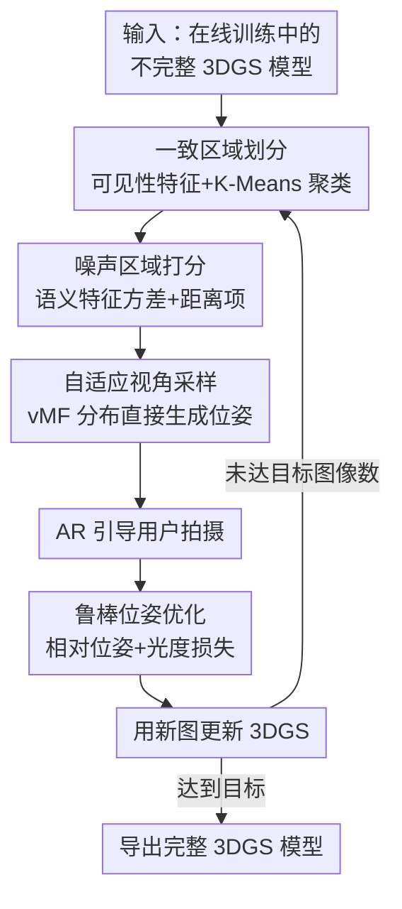

# Active Learning of 3D Gaussian Splatting with Consistent Region Partition and Robust Pose Estimation

**会议**: ICLR2026  
**OpenReview**: [https://openreview.net/forum?id=yye5kN9jH7](https://openreview.net/forum?id=yye5kN9jH7)  
**代码**: https://github.com/csrqli/al-3dgs  
**领域**: 3D视觉  
**关键词**: 3D 高斯泼溅, 主动重建, 下一最佳视角, 一致区域划分, 鲁棒位姿估计

## 一句话总结
本文给 3D Gaussian Splatting 设计了一套在线主动学习算法：边训练边告诉用户"下一张该从哪个角度拍"，通过可见性特征聚类把模型切成一致区域、用语义特征方差找出最欠重建的区域、再用 von Mises-Fisher 分布直接生成下一最佳位姿，并配一套鲁棒位姿优化来吃掉手持拍摄带来的位姿噪声，在 NeRF-Synthetic 上以 10/20 张图的少视角设定超过 FisherRF 等 SOTA。

## 研究背景与动机
**领域现状**：3DGS 用一堆高斯椭球显式表示辐射场，已经是新视角合成的主流方案，但它对训练图像数量和覆盖密度的要求很高——要把一个物体重建好，往往得围着它密集地拍很多张图。

**现有痛点**：这种"先拍一大批、再重建"的离线流程有两个硬伤。其一，拍摄阶段**没有任何反馈**，用户不知道哪里拍够了、哪里还缺，结果某些部位过采样、某些部位欠采样，拍的图和"重建真正需要的图"对不上，白费力气。其二，主动重建领域已有的方法（NeurAR、ActiveNeRF、FisherRF 等）大多是**先随机撒一批候选位姿，再渲染图像评估信息量**（预测不确定性、射线熵等），这既无法直接"生成"新位姿、又会忽略被遮挡区域，而且这些基于渲染图像的指标看不到物体语义层面的质量。

**核心矛盾**：现有主动重建一方面**依赖候选位姿采样 + 图像渲染评估**这条间接链路，没法利用 3DGS 显式几何直接推位姿；另一方面普遍**假设拍到的位姿是完美的**，而真实手持设备（手机、机械臂）拍出来的实际位姿必然偏离理想位姿，带噪位姿会让重建质量崩掉（比如凤凰玩具的翅膀直接重建成白背景）。

**本文目标**：做一套能在线运行的主动重建系统，既能直接生成"信息量最大"的下一位姿来指导拍摄，又能在位姿带噪的真实场景下保持重建质量。

**切入角度**：作者抓住 3DGS 是**显式表示**这一点——既然高斯椭球的位置、可见性都是显式可分析的，那就不必绕"采样候选→渲染→评估"的弯路，可以直接分析当前不完整模型的噪声分布，自底向上地一块块去补欠重建的部位。

**核心 idea**：用"可见性一致区域划分 + 语义特征方差找噪声区 + 直接生成下一位姿 + 鲁棒位姿优化"这条显式管线，替代"渲染图像评估不确定性"的间接套路，做到在线、可落地、抗位姿噪声。

## 方法详解

### 整体框架
系统把 3DGS 的训练和图像采集**交替在线进行**：在第 $k$ 个采集步，拿到当前不完整模型 $G_k$，由一个采集函数 $\{P^1_k,\dots,P^l_k\}=A(G_k)$ 分析模型、估计下一批最佳位姿，并**自适应决定这一步要拍几张** $l$。具体地，采集函数先把模型切成若干"一致区域"，再用语义方差挑出最噪声、最欠重建的那块，然后只在那块区域上方采样生成朝向它的相机位姿；用户（例如在 AR 界面里看到虚拟相机引导）据此拍图，系统再用鲁棒位姿优化把实际拍到的带噪位姿纠正回去，最后用新图继续优化 3DGS。如此循环，自底向上地把物体一块块补完整。

### 关键设计

**1. 可见性一致区域划分：把模型切成"能被一个视角整块看到"的区域**

主动重建最怕用基于渲染图像的指标来挑位姿，因为图像里被遮挡的部分根本评估不到。作者反其道而行，直接在 3DGS 几何上定义"一致区域"——几何平滑、纹理相近、且**最关键的是从某个相机位姿能整块看到**的连通区域。为捕捉这个"可见性"性质，作者先从模型里采一个 $M$ 个高斯的子集，用 Alpha Shape 重建出表面，再在物体外围半球上均匀采 $N$ 个相机位置，估出一个可见性矩阵 $\Gamma$，其中 $\Gamma_{mn}$ 是第 $m$ 个点对第 $n$ 个相机是否可见的二值指示（用 mesh 光栅化的 fragment buffer 判遮挡）。$\Gamma$ 的第 $m$ 行就是该高斯的**可见性特征**。把可见性特征和颜色、位置、旋转拼成每个高斯的特征向量

$$\gamma = [\,x/r,\; c/\sqrt{3},\; R,\; \Gamma_m/\sqrt{N}\,]$$

（各分量按最大值归一化，$r$ 是预设半径，$R$ 是四元数表示的旋转），再用 K-Means 对 $\gamma$ 聚类，就得到一组一致区域。这样做的好处很直观：一块薄板的正反两面虽然几何上贴在一起，但可见性特征完全不同，传统图像指标分不开，而本方法能把它俩切成两个区域——从而不会漏掉任何被遮挡的、需要单独补拍的面。

**2. 语义特征方差打分：用自监督特征的不确定性找最欠重建的区域**

切好区域后还得知道**哪块最噪、最该补图**。作者借鉴"用大规模数据学到的深度特征评估数据质量"的思路，但不是评估渲染图，而是直接评估几何点云：先用 Alpha Shape 重建当前模型的表面、取顶点作为点云，用自监督预训练的 **Point-MAE** 提每点深度特征。关键技巧是做 $T$ 次前向，每次随机采样不同输入点和 dropout mask，得到多份特征实例，再算这些实例方差的范数作为**语义方差分数**

$$S_{\text{sem}} = \big\| \operatorname{var}\{\tfrac{1}{T}\Sigma f_t(x)\} \big\|$$

方差大说明该点语义属性不稳定（这正是 MC-Dropout 式不确定性估计的思路），意味着周围区域噪声高、质量差。最终挑下一个区域用的是综合分数

$$S_{\text{total}} = \lambda_1 \cdot \tfrac{1}{J}S_{\text{sem}}(x_j) + \lambda_2 \cdot \min_k \|\hat{x}-\tilde{x}_k\|$$

其中 $\hat{x}$ 是区域中心、$\tilde{x}_k$ 是历史已覆盖区域的中心。第二项是个**距离项**，鼓励选离已拍区域更远的区域，避免来回在同一块地方打转。

**3. 自适应覆盖视角采样：从噪声区域直接生成朝向它的下一位姿**

确定要补的区域后，不再"撒候选再筛"，而是**直接生成位姿**。做法是从区域中心沿法线方向射一条线，与给定半径的包围球求交点 $p$；以 $p$ 为均值方向 $\mu$，从 von Mises-Fisher 分布 $v(\mu,\kappa)$ 采相机位置，集中度参数 $\kappa = \eta_1\cdot N_r/N_{\text{all}}$（$N_r$ 是区域内点数、$N_{\text{all}}$ 是总点数）。vMF 相当于球面方向上的高斯，这样保证采出来的相机都"看着"目标区域。更巧的是**采几张图也自适应**：位姿数取 $\eta_2\cdot N_r/N_{\text{all}}$，即区域越大、占比越高就多拍几张，最后用 look-at 把相机对准区域中心。这让每一步的拍摄数量按需分配，进一步省图。

**4. 鲁棒位姿优化：冻结高斯、只优化相对位姿来吃掉拍摄噪声**

真实手持拍摄时，实际位姿会偏离系统给的理想位姿，带噪位姿会污染高斯模型。作者把理想最佳位姿 $P$ 当作初始化，只优化实际位姿与理想位姿之间的**相对刚体变换** $T\in SE(3)$：

$$T^* = \arg\min_T L_{\text{pose}}(TP, P), \quad L_{\text{pose}} = L_{\text{rgb}}\big(c(TP),\, \hat{c}(P)\big)$$

即用光度损失最小化"按 $TP$ 渲染出的图"和"实际拍到的真值图 $\hat{c}(P)$"之间的差异。数值上优化李代数 $\tau = \log T$ 而非直接优化变换矩阵，避免退化的非法矩阵。**优化位姿时冻结高斯属性**，防止带偏的位姿反过来污染高斯模型；位姿对齐后再恢复 3DGS 参数的训练。正是这一步让翅膀、薄结构在带噪手持采集下也能重建出来。

### 损失函数 / 训练策略
3DGS 主重建沿用原版的 L1 + SSIM 光度损失。在线流程里每 300 步采集一次图像，采集后模型重新初始化为随机点；聚类时从模型采 10K 高斯子集、K-Means 相对容差 $1\text{e-}4$；所有图像收集完后再额外训练 10,000 步。位姿优化阶段单独用式 (7) 的光度损失，且冻结高斯属性。

## 实验关键数据

### 主实验
NeRF-Synthetic 8 个物体、完美位姿下，分别用 10 张和 20 张总视角，报告平均图像质量（先均匀拍 3 张初始化，再估位姿并在 Blender 渲图训练）：

| 设定 | 方法 | PSNR ↑ | SSIM ↑ | LPIPS ↓ |
|------|------|--------|--------|---------|
| 10 Views | 3DGS + Random | 22.493 | 0.873 | 0.112 |
| 10 Views | 3DGS + ActiveNeRF | 22.979 | 0.876 | 0.111 |
| 10 Views | 3DGS + FisherRF | 23.681 | 0.883 | 0.102 |
| 10 Views | **Ours** | **25.542** | **0.896** | **0.063** |
| 20 Views | 3DGS + FisherRF | 29.525 | 0.944 | 0.043 |
| 20 Views | **Ours** | **30.186** | 0.943 | **0.033** |

10 视角下 PSNR 比 FisherRF 高约 1.9、LPIPS 也明显更低；20 视角下 PSNR 高约 0.6、LPIPS 更优、SSIM 持平。作者指出 20 视角增益变小是因为图像越多、信息冗余越高，主动选图的边际收益自然下降。

### 消融实验
Blender 8 场景、10 张总图：

| 配置 | PSNR | SSIM | LPIPS | 说明 |
|------|------|------|-------|------|
| w/o Γ | 21.271 | 0.863 | 0.137 | 聚类时去掉可见性特征 |
| w/o Distance | 22.438 | 0.866 | 0.090 | 去掉式 (5) 的距离项 |
| w/o Point-MAE | 24.584 | 0.877 | 0.074 | 用 FisherRF 的 Fisher 信息替换语义方差 |
| Full | **25.542** | **0.896** | **0.063** | 完整模型 |

### 关键发现
- **可见性特征 Γ 贡献最大**：去掉后 PSNR 从 25.542 暴跌到 21.271（掉 4.3），说明"按可见性切区域、不漏遮挡面"是整套方法的根基。
- **语义特征方差优于 Fisher 信息**：把 Point-MAE 语义方差换成 FisherRF 的 Fisher 信息后 PSNR 掉到 24.584，验证了"从语义层面评估高斯质量"比纯信息增益更能定位欠重建区。
- **距离项防扎堆**：去掉后掉到 22.438，证明鼓励选远离历史区域的位姿能避免重复采样、提升覆盖效率。
- **带噪位姿场景**：在 4 个真实物体上手持采集，不做位姿优化时凤凰翅膀直接糊成白背景，加上鲁棒位姿优化后整体重建质量显著恢复。

## 亮点与洞察
- **把"评估渲染图像"换成"分析显式几何"**：这是全文最聪明的转向——既然 3DGS 是显式的，就不必先撒候选位姿再渲染评估，可以直接从几何里读出可见性和噪声，从而**直接生成**下一位姿、还能看到被遮挡区域。这套思路可迁移到任何显式表示（点云、网格）的主动采集。
- **可见性矩阵 + 聚类切区域**：用"从外围半球各相机能否看到每个点"组成的二值矩阵当特征，能干净地把薄板正反面这种几何相邻但视觉割裂的结构分开，是个很轻量又有效的几何先验。
- **自监督特征方差当不确定性**：用 Point-MAE 多次 dropout 前向的特征方差衡量质量，相当于把 MC-Dropout 不确定性搬到了 3DGS 质量评估上，避免了训练额外的不确定性头。
- **冻结高斯只优化李代数位姿**：直面手持拍摄这个真实痛点，把"理想位姿当初始 + 只优化相对变换 + 优化时冻结高斯"组合起来，是个干净、可落地的抗噪设计，可复用到任何"引导拍摄 + 在线重建"的系统。

## 局限与展望
- **作者承认的局限**：方法效率和向大规模场景的适配仍有提升空间——当前主要在物体级（NeRF-Synthetic、单物体手持采集）验证，未做大场景探索。
- **依赖额外表面重建与采样开销**：每步都要 Alpha Shape 重建表面、采 $M$ 个高斯估可见性矩阵、$T$ 次 Point-MAE 前向，这些都在 300 步一次的循环里反复做，在线开销不小，论文未给计时分析。
- **关键超参较多**：$\lambda_1,\lambda_2,\eta_1,\eta_2$、半球采样数 $N$、子集 $M$、前向次数 $T$ 都需预设，对不同物体的鲁棒性、敏感性未充分讨论。
- **真实带噪实验偏定性**：噪声位姿那部分主要是 4 个物体的可视化对比，缺少量化指标和与其他抗噪基线的对照。
- **可改进方向**：把语义方差指标按物体扩展到场景级（作者已提及），并引入路径长度/导航效率的约束，让它真正用于机器人/无人机的主动探索。

## 相关工作与启发
- **vs FisherRF**：FisherRF 从预收集图像集里用 Laplace 近似最大化期望信息增益选下一张图，假设位姿完美且只能"选"不能"生成"；本文直接从显式几何生成新位姿、且处理带噪位姿，10 视角 PSNR 高约 1.9。
- **vs NeurAR / ActiveNeRF**：它们在神经网络里加不确定性输出、用 NLL 损失优化，再据此选视角，基于 NeRF 渲染评估、会忽略遮挡区；本文用 3DGS 显式几何 + 可见性聚类，不漏遮挡面，且能在线运行。
- **vs GenNBV 等 NBV 强化学习**：GenNBV 把下一最佳视角建模成 MDP、用模拟器训练泛化策略；本文不训练策略，靠几何分析 + 自监督特征方差即时决策，无需大规模仿真训练。
- **vs ScanNeRF / 机械臂采集系统**：那类系统沿预定义轨迹密集采图、假设完美位姿；本文针对手持设备的实际位姿偏差专门设计鲁棒优化，更贴近真实移动采集。

## 评分
- 新颖性: ⭐⭐⭐⭐ 把主动重建从"渲染评估"转向"显式几何分析 + 直接生成位姿"，并正面处理位姿噪声，角度新且实用。
- 实验充分度: ⭐⭐⭐⭐ 完美/带噪位姿两套实验 + 三项消融较扎实，但带噪部分偏定性、缺效率与超参敏感性分析。
- 写作质量: ⭐⭐⭐⭐ 管线清晰、动机贴合实际，公式与图示到位；部分符号（如 $S_{\text{total}}$ 各项）可再交代得更细。
- 价值: ⭐⭐⭐⭐ 面向 VR/AR 手持扫描的真实落地场景，AR 引导 + 抗噪重建有明确应用价值，代码开源。

<!-- RELATED:START -->

## 相关论文

- [\[CVPR 2026\] WildPose: A Unified Framework for Robust Pose Estimation in the Wild](../../CVPR2026/3d_vision/wildpose_a_unified_framework_for_robust_pose_estimation_in_the_wild.md)
- [\[CVPR 2026\] ComPose: A Unified Completion-Pose Framework for Robust Category-Level Object Pose Estimation](../../CVPR2026/3d_vision/compose_a_unified_completion-pose_framework_for_robust_category-level_object_pos.md)
- [\[ICLR 2026\] Learning Unified Representation of 3D Gaussian Splatting](learning_unified_representation_of_3d_gaussian_splatting.md)
- [\[ICLR 2026\] NGS-Marker: Robust Native Watermarking for 3D Gaussian Splatting](ngs-marker_robust_native_watermarking_for_3d_gaussian_splatting.md)
- [\[CVPR 2026\] Pose-Free Omnidirectional Gaussian Splatting for 360-Degree Videos with Consistent Depth Priors](../../CVPR2026/3d_vision/pose-free_omnidirectional_gaussian_splatting_for_360-degree_videos_with_consiste.md)

<!-- RELATED:END -->
