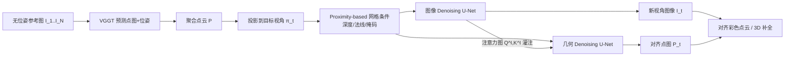

# Aligned Novel View Image and Geometry Synthesis via Cross-modal Attention Instillation

**会议**: ICLR 2026  
**OpenReview**: [https://openreview.net/forum?id=vjvwYexMQn](https://openreview.net/forum?id=vjvwYexMQn)  
**代码**: [https://cvlab-kaist.github.io/MoAI/](https://cvlab-kaist.github.io/MoAI/)  
**领域**: 3D 视觉 / 新视角合成 / 扩散模型  
**关键词**: novel view synthesis, geometry completion, diffusion, cross-modal attention, warping-and-inpainting  

## 一句话总结
把多视角新视角合成重新表述为"图像 + 几何"的双分支扩散修复任务，并用 **MoAI（cross-Modal Attention Instillation）** 把图像分支的注意力图注入几何分支，从无位姿参考图直接生成对齐的新视角图像与点云，在外推视角下达到 SOTA。

## 研究背景与动机
- **领域现状**：新视角合成（NVS）有两条主流路线。前馈方法（PixelSplat、MVSplat、DUSt3R、NoPoSplat）能从稀疏视图直接预测 3D，但本质是"填补参考图中可见区域"，**插值设置下高保真**；生成式扩散方法（Zero123、CAT3D、ViewCrafter）有强外推能力，但训练时依赖已知相机位姿、目标位姿以特征 embedding 形式输入。
- **现有痛点**：前馈方法**缺乏外推能力**，无法合成参考图中被遮挡/未观测的区域；生成式方法当目标位姿落在训练分布之外时容易崩坏，且**必须知道参考相机位姿**，只能在 posed 设置下工作；warping-and-inpainting 路线（LucidDreamer、GenWarp）虽然能脱离位姿约束，但只在 2D 图像层面修复、缺乏 3D 结构理解，**视角差异大时退化严重**，且预测深度与参考几何之间存在 scale-shift 错位。
- **核心矛盾**：既要像生成式方法那样**外推未见区域**，又要像前馈方法那样**几何对齐准确**，还要摆脱对已知位姿的依赖——三者难以兼得。
- **本文目标**：从一张或多张**无位姿**参考图，联合生成任意目标视角的新视角图像 $I_t$ 与点云 $P_t$，且两者几何严格对齐，无需额外的 NeRF/3DGS 优化。
- **核心 idea**：**【几何即修复】** 用现成几何预测器把参考图的部分几何投影到目标视角，再把图像与几何**都**当作扩散修复任务来补全；**【跨模态注意力灌注】** 几何补全比图像生成更确定、结构约束更强，于是把图像分支学到的语义对应注意力图直接"灌"进几何分支，让两个模态互相正则、协同对齐。

## 方法详解

### 整体框架
给定 $N$ 张无位姿稀疏参考图 $\{I_n\}_{n=1}^N$，先用现成几何模型（VGGT）预测各视角点图与相机位姿，聚合成点云并投影到目标视角 $\pi_t$，得到部分投影点图。框架由**两套并行的 U-Net 双分支**组成：图像分支（reference network 提取语义特征 + denoising network 修复图像）和几何分支（结构同构，denoising network 修复点图）。两个分支共享相同的对应关系条件 $c_t, c_r$，关键的耦合发生在注意力层——图像分支的注意力图被灌注进几何分支。

### 关键设计

**1. 几何完成式 NVS：把点图投影当作修复条件，绕开 scale-shift**　不同于以往把 NVS 当纯 2D 图像修复，本文先用现成模型对每张参考图预测点图 $P_n$（每个像素对应一个世界坐标 3D 点），合并为点云后投影到目标视角：$P_t^\Pi = \Pi(P, \pi_t),\ P = \bigcup_{n=1}^N P_n$，多点落到同一像素时按点云光栅化取最近点。投影点图经 Fourier 位置编码 $E(\cdot)$ 与二值掩码 $M_t$（标记无投影点的空洞）拼成目标对应条件 $c_t = [E(P_t^\Pi), M_t]$，参考视角则因密集预测全部有点而用全 1 掩码 $c_r^n = [E(P_n), \mathbf{1}]$。这些条件经卷积网络后**加到** denoising network 第一层的图像潜变量上。关键在于：作者**不提供显式像素到像素的对应**（如 GenWarp 的 warped 坐标），而是直接喂入嵌入后的点图，让模型自己为目标图每个空间位置关联多张参考图中的潜在对应，从而更鲁棒。几何分支用同样架构和条件，但从 Marigold 法线预测模型微调而来去补全点图——由于几何是"参考几何的延续生成"而非独立深度预测，天然避免了预测深度与已知参考几何之间的 scale-shift 错位。

**2. 聚合注意力（aggregated attention）：一次注意力同时跨参考图 + 自注意**　图像 denoising network 的空间自注意层产出目标视角 key/value 特征 $K_t^I, V_t^I$，与 $N$ 张参考特征拼接：$K^I = [K_t^I, K_1^I, \dots, K_N^I]$，$V^I = [V_t^I, V_1^I, \dots, V_N^I]$，以目标 query $Q^I_t$ 做注意力 $\mathrm{Attention}(Q^I, K^I, V^I) = \mathrm{Softmax}\!\left(\frac{Q^I K^{I\top}}{\sqrt{d_k}}\right) V^I$。这样一层注意力里既跨所有参考图做 cross-attention、又在目标潜变量内做 self-attention，实现统一的多视图新视角合成；且因为是聚合机制，推理时可接收**任意数量**参考视角（即使训练只用 2 视角）。

**3. 跨模态注意力灌注 MoAI：用图像注意力图替换几何注意力图**　作者观察到一个不对称现象（Fig.3）：几何补全比图像修复更确定、结构约束更强，补轮子等部分可见结构时几何分支能正确 attend 到同类结构、而图像分支建立不起这种对应；反过来几何分支缺语义线索，注意力发散、拿不到细粒度跨视角对应。于是 MoAI 把几何分支注意力层中的 query/key **换成图像分支的** $Q^I, K^I$，只保留几何自己的 value $V^P$：$\mathrm{Attention}(Q^I, K^I, V^P) = \mathrm{softmax}\!\left(\frac{Q^I K^{I\top}}{\sqrt{d_k}}\right) V^P$。这带来双向协同——图像分支从更确定的几何补全任务获得正则训练信号、生成更一致；几何分支借图像的丰富语义获得更准的补全。由于注意力图只作为聚合 value 的结构线索、不直接混合跨模态特征，还规避了前作常见的有害特征混叠。训练与推理阶段都执行这一灌注。

**4. 邻近度网格条件（proximity-based mesh conditioning）：滤掉错误投影**　现成几何模型产出的稀疏点云带噪声，目标视角偏离参考越远投影错误越严重。本文用 ball-pivoting 算法把稀疏点云转成网格，得到更稠密、错误更少的投影点图 $X_t^\Pi$ 替代裸点图，并把网格的深度图 $D_t^\Pi$ 与法线图 $N_t^\Pi$ 通道拼接进条件：$c_t = [E(X_t^\Pi), D_t^\Pi, N_t^\Pi, M_t]$。再加**法线掩码**——把法线与目标视角方向偏差超过 90° 的网格面剔除（这些通常是几何不完整导致的错误投影面），进一步阻止噪声对应污染生成。

## 实验关键数据

实现：图像分支从 Stable Diffusion 2.1 初始化，几何分支从 Marigold 法线预测微调；在 RealEstate10K、Co3D、MVImgNet 上训练，用 VGGT 提供伪真值几何。

### 主实验：DTU 零样本（与前馈 / warping 方法对比）

| 视图 | 方法 | Pose-free | 外推 PSNR↑ | 外推 SSIM↑ | 外推 LPIPS↓ | 插值 PSNR↑ | 插值 LPIPS↓ |
|------|------|:---:|:---:|:---:|:---:|:---:|:---:|
| 2-view | PixelSplat | ✗ | 14.66 | 0.517 | 0.334 | 12.75 | 0.637 |
| 2-view | MVSplat | ✗ | 12.22 | 0.416 | 0.423 | 13.94 | 0.385 |
| 2-view | NoPoSplat | ✓ | 13.58 | 0.393 | 0.545 | 14.04 | 0.530 |
| 2-view | **Ours** | ✓ | **15.58** | **0.615** | **0.184** | **16.58** | **0.152** |
| 1-view | LucidDreamer | ✓ | 11.14 | 0.423 | 0.440 | 12.09 | 0.419 |
| 1-view | GenWarp | ✓ | 9.85 | 0.315 | 0.527 | 9.54 | 0.538 |
| 1-view | **Ours** | ✓ | **15.56** | **0.609** | **0.184** | **14.58** | **0.202** |

外推与插值两种设置下均显著领先，且单视图也能稳健工作。RealEstate10K 域内测试中外推 PSNR 17.41（NoPoSplat 14.36），插值保持竞争力（PSNR 24.23）。

### 消融实验（RealEstate10K，外推设置）

| 组件 | PSNR↑ | SSIM↑ | LPIPS↓ |
|------|:---:|:---:|:---:|
| (a) Baseline（无几何条件） | 16.55 | 0.559 | 0.260 |
| (b) + 点图条件 | 16.93 | 0.594 | 0.243 |
| (c) + 邻近度网格条件 | 17.01 | 0.601 | 0.238 |
| (d) + 跨模态注意力灌注 MoAI | **17.41** | **0.614** | **0.229** |

每个组件递增贡献，MoAI 带来最后一跳提升。

### 关键发现
- **外推是杀手锏**：对比 LVSM / ZeroNVS / ViewCrafter，本文在大面积未观测区域的外推质量最佳，且推理仅 9.67s（ViewCrafter 25 帧需 209s，ZeroNVS 需 2+ 小时 SDS 蒸馏）。
- **视角越多越好**：仅用 2 视角训练，推理时给 3 视角，图像 PSNR 从 17.41 升到 20.02、几何精度同步提升，验证聚合注意力对任意视角数的泛化。
- **几何对齐免拟合**：多视角点图无需 scale-and-shift 拟合就天然对齐，因为深度被表述为"参考几何的续写补全"。

## 亮点与洞察
- **任务重表述的优雅**：把"新视角合成"和"新视角几何合成"统一成同一套修复框架，图像与几何共享条件、共用架构，只在注意力层耦合，结构干净。
- **MoAI 抓住了模态不对称**：几何确定性高但缺语义、图像语义丰富但对应弱——用"借注意力图而非混特征"的方式取长补短，既协同又不引入跨模态噪声，是本文最有价值的洞察。
- **彻底 pose-free + 外推**：同时摆脱已知位姿依赖、又具备生成式外推能力，填补了前馈与生成式两条路线之间的空白。

## 局限与展望
- 重度依赖现成几何预测器（VGGT/Marigold）的质量，几何模型在弱纹理/反光场景失效会直接传导到生成。
- 邻近度网格条件依赖 ball-pivoting 与法线阈值等启发式，对极稀疏或高度不完整点云的鲁棒性仍有限。
- 评测主要在 object-centric / 室内场景（Co3D、DTU、RealEstate10K），大规模开放场景与动态场景未验证。
- 推理虽快于大模型方法，但双分支扩散仍比纯前馈方法慢一个量级。

## 相关工作与启发
- **warping-and-inpainting**（LucidDreamer、GenWarp）：本文的直接前身，但把其从单图 2D 修复推广到多视图、并扩展到几何模态，解决了 scale-shift 与 3D 结构缺失。
- **pose-free 几何预测**（DUSt3R、MASt3R、NoPoSplat、VGGT）：作为现成几何后端被复用，本文证明把它们的"部分几何"接到生成式补全上能撬动外推能力。
- **生成式 NVS**（Zero123、CAT3D、ViewCrafter）：提供了空间 cross-attention 一致性的思路，但本文用聚合注意力 + 修复表述摆脱了位姿 embedding 的训练域限制。
- **启发**：当一个任务存在两个互补模态（一个确定性强、一个语义丰富）时，"共享注意力图而非共享特征"是一种低耦合高协同的多任务对齐范式，可迁移到其他跨模态生成场景。

## 评分
- **新颖性**: ⭐⭐⭐⭐ — MoAI 跨模态注意力灌注 + 几何完成式修复是一组有辨识度的新组合，切中前馈/生成式两条路线的空白。
- **实验充分度**: ⭐⭐⭐⭐ — 覆盖 DTU 零样本、RealEstate10K 域内、与大模型方法对比、组件消融、视角数分析，外推/插值双设置完整；但缺开放/动态场景。
- **写作质量**: ⭐⭐⭐⭐ — 动机层层递进，Fig.3 的模态不对称分析直观，方法表述清晰。
- **价值**: ⭐⭐⭐⭐ — 同时输出对齐图像与几何、无需位姿、外推强、推理快，对实用 NVS 与 3D 补全有较高落地价值。

<!-- RELATED:START -->

## 相关论文

- [\[ICLR 2026\] Efficient-LVSM: Faster, Cheaper, and Better Large View Synthesis Model via Decoupled Co-Refinement Attention](efficient-lvsm_faster_cheaper_and_better_large_view_synthesis_model_via_decouple.md)
- [\[ICLR 2026\] True Self-Supervised Novel View Synthesis is Transferable](true_self-supervised_novel_view_synthesis_is_transferable.md)
- [\[CVPR 2026\] PR-IQA: Partial-Reference Image Quality Assessment for Diffusion-Based Novel View Synthesis](../../CVPR2026/3d_vision/pr-iqa_partial-reference_image_quality_assessment_for_diffusion-based_novel_view.md)
- [\[CVPR 2026\] AffordGrasp: Cross-Modal Diffusion for Affordance-Aware Grasp Synthesis](../../CVPR2026/3d_vision/affordgrasp_cross-modal_diffusion_for_affordance-aware_grasp_synthesis.md)
- [\[ICLR 2026\] Dynamic Novel View Synthesis in High Dynamic Range](dynamic_novel_view_synthesis_in_high_dynamic_range.md)

<!-- RELATED:END -->
